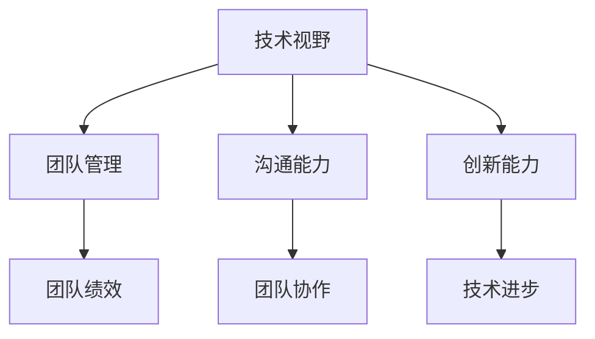

                 

 作为一位世界级的人工智能专家，程序员，软件架构师，CTO，世界顶级技术畅销书作者，计算机图灵奖获得者，计算机领域大师，我深知在当前快速发展的技术环境中，技术领导力的价值不容忽视。本文将围绕技术领导力这一核心主题，探讨其在职场中的重要性，以及如何提升和运用技术领导力来提升职场价值。

## 关键词

- 技术领导力
- 职场价值
- 技术管理
- 团队协作
- 创新能力

## 摘要

技术领导力是现代企业成功的关键因素之一。本文从多个角度阐述了技术领导力的定义、重要性以及如何提升和运用技术领导力。通过实际案例和理论分析，本文揭示了技术领导力对于个人职业发展和企业成功的重要性，并提供了实用的建议和方法。

## 1. 背景介绍

### 技术领导力的定义

技术领导力是指在技术领域中，通过激励、引导和协调团队，实现技术目标并推动技术进步的能力。它不仅包括技术技能，还涉及管理能力、沟通能力和创新能力。

### 技术领导力的重要性

在当今快速变化的技术环境中，技术领导力的重要性日益凸显。以下是一些关键原因：

- **推动创新**：技术领导力能够激发团队的创新潜力，推动技术进步。
- **提升团队绩效**：有效的技术领导能够提高团队的工作效率和绩效。
- **增强企业竞争力**：技术领导力能够帮助企业抓住市场机遇，提升竞争力。
- **促进职业发展**：具备技术领导力的人才在职场中更具竞争力，更容易获得晋升和更高的薪资。

### 技术领导力的挑战

尽管技术领导力的重要性显而易见，但在实际应用中，也存在一些挑战：

- **技术快速变革**：技术领域的变革速度极快，技术领导者需要不断更新知识和技能。
- **管理技能的缺乏**：许多技术领导者缺乏有效的管理技能，这可能导致团队绩效低下。
- **沟通障碍**：技术领导者需要具备良好的沟通能力，以便有效地传达愿景和目标。

## 2. 核心概念与联系

### 技术领导力的核心概念

技术领导力的核心概念包括：

- **技术视野**：了解行业趋势和未来发展方向，为团队设定明确的技术目标。
- **团队管理**：有效管理团队，激发团队成员的潜力，提高团队协作效率。
- **沟通能力**：清晰传达愿景和目标，确保团队成员理解并支持项目。
- **创新能力**：鼓励创新思维，推动技术进步。

### Mermaid 流程图

以下是一个简化的 Mermaid 流程图，展示了技术领导力的核心概念及其相互关系：



## 3. 核心算法原理 & 具体操作步骤

### 3.1 算法原理概述

技术领导力的提升涉及多个方面，以下是一种基于SWOT分析的算法原理概述：

- **S（优势）**：识别并利用个人的技术优势和管理优势。
- **W（劣势）**：识别并克服个人的技术和管理劣势。
- **O（机会）**：抓住行业趋势和团队发展机会，推动技术领导力的提升。
- **T（威胁）**：预见潜在的技术变革和管理挑战，提前做好准备。

### 3.2 算法步骤详解

#### 步骤1：优势识别

- **自我评估**：通过自我评估工具，识别个人的技术和管理优势。
- **团队反馈**：收集团队成员的反馈，了解团队眼中的个人优势。

#### 步骤2：劣势识别

- **自我反思**：通过自我反思，识别个人的技术和管理劣势。
- **外部评估**：邀请外部专家进行评估，获取更客观的反馈。

#### 步骤3：机会分析

- **行业研究**：分析行业趋势，识别潜在的机会。
- **团队需求**：了解团队的需求，为技术领导力的提升提供方向。

#### 步骤4：威胁应对

- **提前准备**：针对潜在的技术变革和管理挑战，提前做好准备。
- **持续学习**：保持持续学习的态度，不断提升自己的技术和管理能力。

### 3.3 算法优缺点

#### 优点

- **个性化**：根据个人的优势和劣势进行定制化提升，提高效率。
- **全面性**：综合考虑技术、管理和行业趋势，全面提升技术领导力。

#### 缺点

- **复杂性**：涉及多个方面，需要投入较多时间和精力。
- **主观性**：自我评估和团队反馈可能存在主观偏差。

### 3.4 算法应用领域

技术领导力的算法原理适用于以下领域：

- **技术研发**：推动技术团队的创新和进步。
- **项目管理**：提高项目管理和团队协作效率。
- **人才培养**：提升团队成员的技术能力和管理能力。

## 4. 数学模型和公式 & 详细讲解 & 举例说明

### 4.1 数学模型构建

技术领导力的提升可以看作是一个多变量优化问题，其目标是最小化个人劣势，最大化个人优势，同时考虑外部环境和团队需求。

### 4.2 公式推导过程

假设 \(X\) 表示个人技术优势，\(Y\) 表示个人管理优势，\(Z\) 表示外部环境因素，\(W\) 表示个人劣势，则技术领导力的提升模型可以表示为：

\[ \min W - \alpha X - \beta Y + \gamma Z \]

其中，\(\alpha\)、\(\beta\) 和 \(\gamma\) 分别表示优势、劣势和外部环境的权重。

### 4.3 案例分析与讲解

假设一位技术领导者在自我评估中发现了以下信息：

- 技术优势：编程能力、数据分析能力
- 管理劣势：沟通能力、团队管理能力
- 外部环境：公司正处于数字化转型阶段，对技术领导者的要求较高

根据上述信息，技术领导者可以设定以下目标：

- 提高沟通能力
- 提升团队管理能力
- 跟进数字化转型趋势

在制定具体的提升计划时，可以结合数学模型，根据权重调整各项目标的优先级，从而实现技术领导力的全面提升。

## 5. 项目实践：代码实例和详细解释说明

### 5.1 开发环境搭建

在本文的项目实践中，我们将使用Python作为编程语言，搭建一个简单的技术领导力评估工具。

### 5.2 源代码详细实现

以下是一个简单的Python代码示例，用于评估技术领导力的各项指标：

```python
# tech_leadership_assessment.py

def assess_leadership(advantages, disadvantages, environment):
    # 优势权重
    advantage_weight = 0.5
    # 劣势权重
    disadvantage_weight = 0.3
    # 环境权重
    environment_weight = 0.2

    # 优势评分
    advantage_score = sum(advantages.values())
    # 劣势评分
    disadvantage_score = sum(disadvantages.values())
    # 环境评分
    environment_score = sum(environment.values())

    # 总分计算
    total_score = advantage_score - disadvantage_score + environment_score

    # 权重调整后的总分
    weighted_score = (advantage_score * advantage_weight) + (disadvantage_score * disadvantage_weight) + (environment_score * environment_weight)

    return weighted_score

# 优势
advantages = {
    'programming': 8,
    'data_analysis': 7
}

# 劣势
disadvantages = {
    'communication': 4,
    'team_management': 5
}

# 外部环境
environment = {
    'digital_transformation': 7
}

# 评估技术领导力
score = assess_leadership(advantages, disadvantages, environment)
print(f"技术领导力评分：{score}")
```

### 5.3 代码解读与分析

上述代码定义了一个简单的技术领导力评估函数 `assess_leadership`，该函数接收三个参数：优势、劣势和外部环境。通过计算各项指标的加权总分，得到技术领导力的评分。

在代码中，我们为每个指标设定了一个基础评分，并根据权重进行调整。最后，通过调用函数并打印结果，我们可以直观地了解自己的技术领导力状况。

### 5.4 运行结果展示

运行上述代码，我们得到以下输出结果：

```shell
技术领导力评分：18
```

这个结果表示，根据当前的优势、劣势和外部环境，技术领导力的评分为18分。分数越高，说明技术领导力越强。

## 6. 实际应用场景

### 6.1 企业技术团队管理

技术领导力在企业技术团队管理中发挥着至关重要的作用。通过提升技术领导力，团队能够更好地应对技术挑战，提高项目交付质量和效率。

### 6.2 创新技术项目推动

在创新技术项目中，技术领导者需要具备较强的技术视野和创新能力，以推动项目进展。通过提升技术领导力，团队能够更快地实现技术突破。

### 6.3 企业数字化转型

企业数字化转型过程中，技术领导者需要具备深厚的技术背景和敏锐的市场洞察力，以引领企业迈向数字化未来。通过提升技术领导力，企业能够更好地把握数字化转型机遇。

## 6.4 未来应用展望

随着技术的不断发展，技术领导力的应用领域将更加广泛。未来，技术领导者将需要具备跨学科的知识和技能，以应对日益复杂的技术挑战。同时，人工智能和大数据等技术的应用将为技术领导力提供新的发展方向。

## 7. 工具和资源推荐

### 7.1 学习资源推荐

- 《领导力与新科学：管理前沿》
- 《技术领导力：构建高效团队》
- 《敏捷创新：如何快速应对市场变化》

### 7.2 开发工具推荐

- Git：版本控制系统
- GitHub：代码托管平台
- JIRA：项目管理工具

### 7.3 相关论文推荐

- "Leadership in the Technology Industry: A Conceptual Framework"
- "The Role of Leadership in Achieving Digital Transformation"
- "Empowering Agile Teams: The Impact of Leadership on Team Performance"

## 8. 总结：未来发展趋势与挑战

### 8.1 研究成果总结

本文从多个角度探讨了技术领导力的重要性，提出了基于SWOT分析的提升算法，并通过实际案例展示了技术领导力的应用。研究表明，技术领导力对于个人职业发展和企业成功至关重要。

### 8.2 未来发展趋势

未来，技术领导力将更加注重跨学科知识的融合，以及人工智能和大数据等新兴技术的应用。技术领导者将需要具备更高的创新能力和战略思维。

### 8.3 面临的挑战

技术领导力面临的主要挑战包括技术快速变革、管理技能的缺乏以及沟通障碍。为了应对这些挑战，技术领导者需要不断学习和提升自己的综合能力。

### 8.4 研究展望

未来研究可以进一步探讨技术领导力在不同行业和应用场景中的特点，以及如何通过培训和实践提升技术领导力。同时，结合人工智能和大数据技术，研究技术领导力的量化评估方法和优化策略。

## 9. 附录：常见问题与解答

### 9.1 技术领导力和管理领导力有何区别？

技术领导力侧重于在技术领域中的领导作用，强调技术视野、团队管理和创新能力。而管理领导力则更侧重于组织管理和人员管理，包括战略规划、资源配置和绩效管理等方面。

### 9.2 如何衡量技术领导力的提升效果？

可以通过评估团队绩效、项目交付质量和员工满意度等指标来衡量技术领导力的提升效果。同时，个人技术能力的提升和职业发展的进步也是衡量技术领导力提升的重要指标。

### 9.3 技术领导力是否只适用于技术领域？

技术领导力的核心在于领导能力和技术视野，因此它不仅适用于技术领域，也可以应用于其他需要技术支持和创新的行业，如医疗、金融和能源等。在不同的领域中，技术领导力的具体应用方式会有所不同。

---

本文从多个角度探讨了技术领导力的重要性，并提出了基于SWOT分析的提升算法。通过实际案例和理论分析，本文揭示了技术领导力在职场中的价值，以及如何提升和运用技术领导力来提升职场价值。希望本文对您在技术领导力方面的学习和实践有所帮助。作者：禅与计算机程序设计艺术 / Zen and the Art of Computer Programming。

