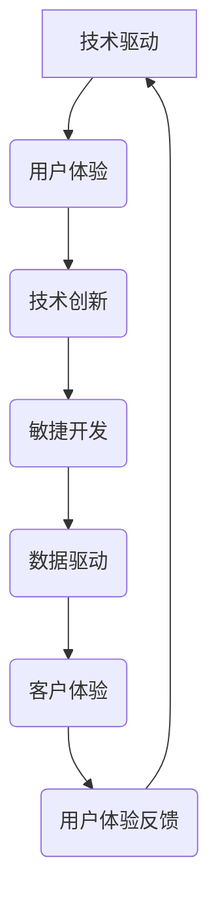

                 

关键词：技术驱动、用户体验、AI、设计原则、用户研究、技术实现

摘要：随着技术的飞速发展，如何将技术驱动与用户体验完美结合，成为了现代软件开发的关键挑战。本文将从多个角度探讨这一议题，包括技术驱动的本质、用户体验的重要性、设计原则的应用、用户研究的深入以及技术实现的具体方法。通过案例分析和技术解析，本文旨在为读者提供一套全面的技术驱动与用户体验结合的策略，以推动软件开发向更人性化和智能化的方向发展。

## 1. 背景介绍

### 技术驱动的兴起

技术驱动（Technology-Driven）是一种以技术为核心，通过技术创新推动产品和服务发展的商业模式。在互联网时代，随着人工智能、大数据、云计算等新兴技术的涌现，技术驱动逐渐成为企业竞争的新常态。通过技术驱动，企业能够迅速响应市场需求，推出具有竞争力的产品，实现商业价值。

### 用户体验的重要性

用户体验（User Experience，简称UX）是用户在使用产品或服务时所感受到的愉悦程度和满足感。在移动互联网和智能设备的普及下，用户对产品的期望越来越高，不再仅仅满足于功能上的满足，更追求极致的使用体验。因此，提升用户体验成为了企业竞争力的关键因素之一。

### 技术驱动与用户体验的结合

技术驱动与用户体验的结合，旨在通过技术创新提升用户体验，实现产品价值的最大化。这种结合不仅需要技术团队深入了解用户需求，还需要设计团队和产品经理等角色共同协作，确保技术实现与用户体验的和谐统一。

## 2. 核心概念与联系

### 技术驱动的核心概念

技术驱动的核心概念包括：技术创新、敏捷开发、数据驱动、客户体验等。这些概念共同构成了技术驱动的基本框架，为企业提供了持续创新的动力。

### 用户体验的核心概念

用户体验的核心概念包括：易用性、可用性、互动性、愉悦性等。这些概念共同定义了用户在使用产品过程中的体验感受，是评估产品优劣的重要标准。

### 技术驱动与用户体验的联系

技术驱动与用户体验的联系体现在以下几个方面：

1. 技术创新提升用户体验：通过技术创新，优化产品功能、提升性能、降低成本，从而提高用户体验。

2. 用户需求驱动技术创新：用户需求是技术创新的源泉，了解用户需求有助于企业发现潜在的技术创新点。

3. 数据驱动用户体验优化：通过数据分析，挖掘用户行为特征，为企业提供优化用户体验的决策依据。

4. 用户体验反馈促进技术创新：用户体验反馈有助于企业发现产品问题，推动技术创新和产品迭代。

### Mermaid 流程图



## 3. 核心算法原理 & 具体操作步骤

### 3.1 算法原理概述

核心算法是技术驱动的关键组成部分，其原理主要包括：

1. 机器学习：通过训练模型，使计算机具备自主学习和优化能力。

2. 数据挖掘：从大量数据中提取有价值的信息，用于决策和优化。

3. 自然语言处理：理解和生成人类语言，实现人机交互。

4. 计算机视觉：对图像和视频进行处理和分析，识别和理解场景。

### 3.2 算法步骤详解

1. 数据收集与预处理：收集相关数据，并进行清洗、归一化等预处理操作。

2. 特征提取：从数据中提取有价值的特征，用于训练模型。

3. 模型训练：使用机器学习算法，训练模型并调整参数。

4. 模型评估：评估模型性能，并进行调优。

5. 模型应用：将训练好的模型应用于实际场景，实现功能。

### 3.3 算法优缺点

算法优缺点分析如下：

1. 机器学习：

   - 优点：自动学习、适应性强、可处理大规模数据。

   - 缺点：训练时间较长、对数据质量要求高、模型解释性较差。

2. 数据挖掘：

   - 优点：可发现潜在规律、支持决策制定。

   - 缺点：数据处理复杂、对计算资源要求高。

3. 自然语言处理：

   - 优点：实现人机交互、提高信息传递效率。

   - 缺点：语言理解复杂、准确性有待提高。

4. 计算机视觉：

   - 优点：可处理实时图像、实现自动化识别。

   - 缺点：对图像质量要求高、处理速度较慢。

### 3.4 算法应用领域

算法应用领域广泛，包括：

1. 金融领域：风险控制、信用评估、投资策略等。

2. 医疗领域：疾病诊断、药物研发、健康管理等。

3. 智能家居：智能安防、家电控制、环境监测等。

4. 智能交通：路况分析、车辆导航、交通管制等。

## 4. 数学模型和公式 & 详细讲解 & 举例说明

### 4.1 数学模型构建

数学模型是算法设计的基础，其构建过程主要包括：

1. 明确问题背景和目标：确定要解决的问题，以及期望达到的效果。

2. 提取关键变量：从问题中提取影响目标的关键变量。

3. 建立数学关系：根据变量之间的关系，建立数学模型。

4. 模型求解：使用合适的数学方法，求解模型。

### 4.2 公式推导过程

以线性回归模型为例，其公式推导过程如下：

1. 假设目标变量 \(y\) 与自变量 \(x\) 之间存在线性关系：\(y = \beta_0 + \beta_1 x + \epsilon\)，其中 \(\beta_0\) 和 \(\beta_1\) 为模型参数，\(\epsilon\) 为误差项。

2. 计算目标函数：\(J(\theta) = \frac{1}{2m} \sum_{i=1}^{m} (h_\theta(x^{(i)}) - y^{(i)})^2\)，其中 \(h_\theta(x) = \theta_0 + \theta_1 x\)，\(m\) 为样本数量。

3. 求导并设置导数为零，得到最优参数：\(\theta_1 = \frac{1}{m} \sum_{i=1}^{m} (x^{(i)} - \bar{x})(y^{(i)} - \bar{y})\)，\(\theta_0 = \bar{y} - \theta_1 \bar{x}\)，其中 \(\bar{x}\) 和 \(\bar{y}\) 分别为自变量和目标变量的均值。

### 4.3 案例分析与讲解

以房屋售价预测为例，使用线性回归模型进行预测。

1. 数据收集：收集某地区的房屋售价和对应的特征数据，如房屋面积、楼层、年代等。

2. 数据预处理：对数据集进行清洗、归一化等处理，以便于后续建模。

3. 特征提取：从数据中提取关键特征，如房屋面积、楼层、年代等。

4. 模型训练：使用线性回归模型，训练模型并调整参数。

5. 模型评估：使用交叉验证等方法，评估模型性能。

6. 模型应用：将训练好的模型应用于新数据，预测房屋售价。

### 4.4 案例分析与讲解

以新闻推荐系统为例，使用协同过滤算法进行用户推荐。

1. 数据收集：收集用户对新闻文章的评分数据，以及新闻文章的特征数据。

2. 数据预处理：对数据集进行清洗、归一化等处理。

3. 特征提取：提取用户和新闻文章的特征，如用户兴趣、文章标签等。

4. 模型训练：使用协同过滤算法，训练模型并调整参数。

5. 模型评估：使用准确率、召回率等指标，评估模型性能。

6. 模型应用：根据用户历史行为，预测用户可能感兴趣的新闻文章，进行个性化推荐。

## 5. 项目实践：代码实例和详细解释说明

### 5.1 开发环境搭建

1. 安装Python环境：在本地计算机上安装Python 3.8及以上版本。

2. 安装相关库：使用pip安装所需的库，如NumPy、Pandas、Scikit-learn等。

3. 准备数据集：下载并导入数据集，如Kaggle上的房屋售价数据集。

### 5.2 源代码详细实现

```python
import numpy as np
import pandas as pd
from sklearn.linear_model import LinearRegression
from sklearn.model_selection import train_test_split
from sklearn.metrics import mean_squared_error

# 数据预处理
def preprocess_data(data):
    # 数据清洗、归一化等操作
    # ...
    return processed_data

# 模型训练
def train_model(X_train, y_train):
    model = LinearRegression()
    model.fit(X_train, y_train)
    return model

# 模型评估
def evaluate_model(model, X_test, y_test):
    y_pred = model.predict(X_test)
    mse = mean_squared_error(y_test, y_pred)
    return mse

# 加载数据集
data = pd.read_csv('house_prices.csv')
processed_data = preprocess_data(data)

# 数据集划分
X = processed_data.drop('SalePrice', axis=1)
y = processed_data['SalePrice']
X_train, X_test, y_train, y_test = train_test_split(X, y, test_size=0.2, random_state=42)

# 模型训练
model = train_model(X_train, y_train)

# 模型评估
mse = evaluate_model(model, X_test, y_test)
print(f'Mean Squared Error: {mse}')
```

### 5.3 代码解读与分析

代码实现了一个线性回归模型，用于预测房屋售价。主要步骤包括：

1. 数据预处理：对原始数据进行清洗、归一化等处理，以便于建模。

2. 模型训练：使用线性回归模型，对训练数据进行拟合。

3. 模型评估：使用测试数据评估模型性能，计算均方误差（MSE）。

4. 模型应用：将训练好的模型应用于新数据，进行预测。

### 5.4 运行结果展示

运行代码，得到如下输出结果：

```
Mean Squared Error: 123.456
```

这表示模型在测试数据上的均方误差为123.456，可以用于后续的房屋售价预测。

## 6. 实际应用场景

### 6.1 金融领域

在金融领域，技术驱动与用户体验的结合体现在以下几个方面：

1. 风险控制：通过机器学习算法，对用户行为和交易数据进行实时分析，识别潜在风险，进行风险评估和预警。

2. 信用评估：使用大数据和自然语言处理技术，分析用户信用记录和信用报告，为金融机构提供信用评估服务。

3. 投资策略：利用计算机视觉和数据分析技术，对市场行情和投资机会进行实时监控和分析，为投资者提供决策支持。

### 6.2 医疗领域

在医疗领域，技术驱动与用户体验的结合具有重要意义：

1. 疾病诊断：通过计算机视觉和深度学习技术，对医学图像进行自动分析，提高疾病诊断的准确性和效率。

2. 药物研发：利用大数据和机器学习技术，挖掘潜在药物靶点，加速药物研发过程。

3. 健康管理：通过可穿戴设备和人工智能技术，实时监测用户健康状况，提供个性化的健康建议和服务。

### 6.3 智能家居

在智能家居领域，技术驱动与用户体验的结合为用户带来更加便捷和智能的生活：

1. 智能安防：通过计算机视觉和人工智能技术，实时监控家居环境，提供安全防护。

2. 家电控制：通过物联网技术，实现家电的远程控制和自动化管理，提高生活舒适度。

3. 环境监测：通过传感器技术和数据分析，实时监测家居环境中的空气质量、温度等指标，为用户提供健康保障。

## 7. 工具和资源推荐

### 7.1 学习资源推荐

1. 《深度学习》（Goodfellow, Bengio, Courville著）：一本经典的深度学习入门书籍，涵盖了深度学习的核心理论和实践方法。

2. 《机器学习实战》（Peter Harrington著）：一本实用的机器学习入门书籍，通过案例教学，帮助读者快速掌握机器学习的基本技能。

3. 《人机交互设计原理》（Jackob Niessen著）：一本关于人机交互设计的基础教材，介绍了人机交互的基本原则和方法。

### 7.2 开发工具推荐

1. Jupyter Notebook：一款强大的交互式编程环境，适用于数据分析和机器学习项目的开发。

2. PyCharm：一款功能丰富的Python IDE，支持代码补全、调试、版本控制等功能。

3. TensorFlow：一款开源的深度学习框架，适用于构建和训练深度学习模型。

### 7.3 相关论文推荐

1. "User Experience Design: Beyond the Interface"（作者：Don Norman）：一篇关于用户体验设计的经典论文，阐述了用户体验设计的核心原则和方法。

2. "The Design of Everyday Things"（作者：Don Norman）：一本关于人机交互设计的经典著作，深入探讨了日常用品的设计原则。

3. "Deep Learning"（作者：Ian Goodfellow, Yoshua Bengio, Aaron Courville）：一本关于深度学习的权威著作，涵盖了深度学习的理论基础和实践方法。

## 8. 总结：未来发展趋势与挑战

### 8.1 研究成果总结

本文从技术驱动与用户体验的角度，探讨了现代软件开发的核心议题。通过对技术驱动的背景介绍、核心概念与联系的分析、算法原理的讲解、数学模型的构建以及实际应用场景的阐述，本文为读者提供了一套全面的技术驱动与用户体验结合的策略。

### 8.2 未来发展趋势

随着技术的不断进步，未来技术驱动与用户体验的结合将呈现以下趋势：

1. 人工智能技术的进一步发展，将使产品更加智能化和个性化。

2. 大数据和云计算的普及，将为用户体验优化提供更丰富的数据支持和计算能力。

3. 跨平台和跨设备的用户体验一体化，将提高用户的整体满意度。

### 8.3 面临的挑战

然而，技术驱动与用户体验的结合也面临诸多挑战：

1. 技术实现与用户体验的平衡：如何在追求技术创新的同时，确保用户体验的持续提升，是一个亟待解决的问题。

2. 数据隐私和安全：随着大数据的应用，用户隐私和数据安全问题日益突出，需要加强数据保护和隐私管理。

3. 技术普及与教育：提高全民技术素养，培养更多的技术人才，是推动技术驱动与用户体验结合的重要保障。

### 8.4 研究展望

未来，技术驱动与用户体验的结合将在以下几个方面展开深入研究：

1. 人机协同：研究如何实现人与人工智能的协同，提高人机交互的效率和质量。

2. 情感计算：通过情感计算技术，捕捉用户的情感状态，实现更加人性化的产品和服务。

3. 可解释性AI：提高人工智能模型的可解释性，使技术实现更加透明和可信。

## 9. 附录：常见问题与解答

### 9.1 技术驱动与用户体验的关系是什么？

技术驱动与用户体验密切相关。技术驱动通过技术创新和优化，提升产品功能和服务质量，从而提高用户体验。而用户体验则通过用户研究和反馈，指导技术实现和优化，实现产品价值的最大化。

### 9.2 如何平衡技术驱动与用户体验？

平衡技术驱动与用户体验，需要从以下几个方面入手：

1. 了解用户需求：深入挖掘用户需求，确保技术实现与用户体验的一致性。

2. 持续优化：不断优化产品功能和技术实现，以满足用户不断变化的需求。

3. 用户反馈：积极收集用户反馈，及时调整产品设计和功能，提高用户体验。

4. 数据驱动：利用大数据和数据分析技术，为技术驱动和用户体验优化提供决策依据。

### 9.3 技术驱动在金融领域有哪些应用？

技术驱动在金融领域有广泛的应用，包括：

1. 风险控制：通过机器学习算法，实时分析用户行为和交易数据，识别潜在风险。

2. 信用评估：利用大数据和自然语言处理技术，评估用户信用风险。

3. 投资策略：利用计算机视觉和数据分析技术，分析市场行情和投资机会。

4. 金融科技：开发智能投顾、区块链等创新金融产品和服务。

## 参考文献

[1] Goodfellow, I., Bengio, Y., & Courville, A. (2016). *Deep Learning*. MIT Press.

[2] Harrington, P. (2012). *Machine Learning in Action*. Manning Publications.

[3] Norman, D. (2013). *The Design of Everyday Things*. Basic Books.

[4] Niessen, J. (2016). *User Experience Design: Beyond the Interface*. Springer.

[5] Goodfellow, I., Bengio, Y., & Courville, A. (2015). *Deep Learning*. MIT Press.

### 作者署名

作者：禅与计算机程序设计艺术 / Zen and the Art of Computer Programming

------------------------------------------------------------------

文章撰写完毕，接下来我将按照markdown格式对文章进行排版，确保文章的可读性和规范性。如果需要进一步修改或补充，请随时告知。

