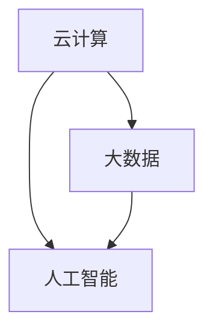

                 

关键词：技能提升，计算时代，新需求，技术发展，人才培养

> 摘要：随着计算机技术的迅猛发展，人类计算时代正迎来前所未有的变革。本文将探讨在这个时代下，提升专业技能以适应新需求的重要性，并分析相关技术领域的核心概念、算法原理、数学模型以及实际应用场景。通过详细讲解和项目实践，为读者提供一整套适应计算时代的新技能提升方案。

## 1. 背景介绍

计算机技术的发展历程可谓是一部不断创新的史诗。从最初的电子管计算机，到今天的量子计算机，计算机的硬件和软件技术经历了无数次的飞跃。随着云计算、大数据、人工智能等新兴技术的崛起，计算机技术在各个领域得到了广泛应用，推动了社会的数字化转型。

在这样一个计算时代，人们对于计算机技术的需求也在不断演变。传统的编程技能已经不足以应对复杂的问题，新的编程范式和算法需求应运而生。同时，计算机技术的发展也带来了新的职业机会和挑战。为了在这个时代中立于不败之地，提升专业技能变得至关重要。

### 1.1 人才缺口

据全球知名咨询公司麦肯锡的预测，到2020年，全球将面临约850万个数据科学和信息技术相关岗位的空缺。这种人才缺口的出现，一方面是由于技术的快速发展，使得现有的人才储备难以满足需求；另一方面，则是由于传统教育体系的滞后，无法及时培养出符合新时代要求的人才。

### 1.2 技术演变

计算机技术的演变不仅体现在硬件和软件的进步上，还包括编程语言、算法和架构的不断创新。例如，从传统的面向过程编程到面向对象编程，再到现在的函数式编程和逻辑编程，编程范式不断演进，程序员需要不断学习新的技术和工具，以适应不断变化的需求。

## 2. 核心概念与联系

在这个计算时代，理解以下几个核心概念对于提升专业技能至关重要：

### 2.1 云计算

云计算是一种通过网络提供计算资源的服务模式，包括基础设施即服务（IaaS）、平台即服务（PaaS）和软件即服务（SaaS）等。云计算的普及使得数据处理和分析变得更加高效和灵活。

### 2.2 大数据

大数据是指数据量巨大、种类繁多、处理速度快的信息。大数据技术包括数据采集、存储、处理和分析等，是推动人工智能和机器学习发展的基石。

### 2.3 人工智能

人工智能（AI）是指模拟人类智能的计算机系统。机器学习、深度学习是人工智能的核心技术，它们在图像识别、自然语言处理、智能决策等领域具有广泛的应用。

### 2.4 Mermaid 流程图

为了更好地理解这些概念之间的关系，我们使用 Mermaid 流程图（不含括号、逗号等特殊字符）展示它们之间的联系：



## 3. 核心算法原理 & 具体操作步骤

### 3.1 算法原理概述

在这个计算时代，算法的作用愈发重要。以下是几个核心算法的原理概述：

### 3.1.1 机器学习算法

机器学习算法通过从数据中学习规律，从而进行预测和决策。常见的机器学习算法包括线性回归、决策树、支持向量机等。

### 3.1.2 深度学习算法

深度学习算法是一种特殊的机器学习算法，通过多层神经网络模拟人脑的学习过程，进行特征提取和模式识别。常见的深度学习算法包括卷积神经网络（CNN）和循环神经网络（RNN）。

### 3.1.3 数据挖掘算法

数据挖掘算法用于从大量数据中发现潜在的、有价值的信息。常见的数据挖掘算法包括关联规则挖掘、分类、聚类等。

### 3.2 算法步骤详解

下面以深度学习算法为例，介绍其具体操作步骤：

### 3.2.1 数据预处理

首先对数据进行清洗、归一化等预处理操作，以去除噪声和提高模型性能。

### 3.2.2 网络架构设计

设计神经网络的结构，包括输入层、隐藏层和输出层。选择合适的激活函数和损失函数。

### 3.2.3 模型训练

使用训练数据集对模型进行训练，通过反向传播算法不断调整模型的参数，以降低损失函数的值。

### 3.2.4 模型评估

使用验证数据集对训练好的模型进行评估，选择性能最优的模型。

### 3.2.5 模型部署

将训练好的模型部署到实际应用场景中，进行预测和决策。

### 3.3 算法优缺点

每种算法都有其优缺点。例如，机器学习算法具有较高的预测精度，但需要大量数据支持；深度学习算法在图像和语音识别等领域表现突出，但计算资源需求较高。了解这些优缺点，有助于选择合适的算法解决实际问题。

### 3.4 算法应用领域

核心算法在多个领域具有广泛的应用。例如，机器学习算法在金融风险控制、医疗诊断等领域有重要应用；深度学习算法在自动驾驶、语音识别等领域具有巨大潜力；数据挖掘算法在市场分析、社交网络分析等领域具有广泛应用。

## 4. 数学模型和公式 & 详细讲解 & 举例说明

### 4.1 数学模型构建

数学模型是描述现实世界问题的一种抽象表示。构建数学模型需要理解问题本质，并通过数学语言进行表达。

### 4.2 公式推导过程

以下是一个常见的数学公式——梯度下降法的推导过程：

$$
\begin{aligned}
&\text{假设函数 } f(\mathbf{x}) \text{ 关于变量 } \mathbf{x} \text{ 可导，目标是最小化 } f(\mathbf{x})。 \\
&\text{梯度下降法的基本思想是：在当前点 } \mathbf{x} \text{ 处计算函数的梯度 } \nabla f(\mathbf{x})，\\
&\text{然后沿着梯度的反方向更新 } \mathbf{x} \text{，即 } \mathbf{x} \leftarrow \mathbf{x} - \alpha \nabla f(\mathbf{x})，\\
&\text{其中 } \alpha \text{ 是步长参数，控制更新步长的大小。}
\end{aligned}
$$

### 4.3 案例分析与讲解

以下是一个简单的线性回归案例，用于预测房屋价格：

$$
\begin{aligned}
&\text{假设房屋价格 } y \text{ 与房屋面积 } x \text{ 成线性关系，即 } y = wx + b。 \\
&\text{目标是最小化均方误差 } \frac{1}{n}\sum_{i=1}^{n}(wx_i + b - y_i)^2。 \\
&\text{通过求导并令导数为零，可以得到系数 } w \text{ 和常数项 } b \text{ 的估计值：} \\
&w = \frac{\sum_{i=1}^{n}(x_i - \bar{x})(y_i - \bar{y})}{\sum_{i=1}^{n}(x_i - \bar{x})^2} \\
&b = \bar{y} - w\bar{x}
\end{aligned}
$$

通过这个案例，我们可以看到如何将实际问题转化为数学模型，并通过公式推导得到解决方案。

## 5. 项目实践：代码实例和详细解释说明

### 5.1 开发环境搭建

为了实践深度学习算法，我们需要搭建一个合适的开发环境。以下是一个简单的搭建步骤：

1. 安装 Python 3.x 版本
2. 安装 TensorFlow 库
3. 安装 Jupyter Notebook，用于交互式编程

### 5.2 源代码详细实现

以下是一个简单的深度学习项目，用于手写数字识别：

```python
import tensorflow as tf
from tensorflow.keras.datasets import mnist
from tensorflow.keras.models import Sequential
from tensorflow.keras.layers import Dense, Flatten
from tensorflow.keras.optimizers import Adam

# 数据预处理
(x_train, y_train), (x_test, y_test) = mnist.load_data()
x_train = x_train / 255.0
x_test = x_test / 255.0

# 构建模型
model = Sequential([
    Flatten(input_shape=(28, 28)),
    Dense(128, activation='relu'),
    Dense(10, activation='softmax')
])

# 编译模型
model.compile(optimizer=Adam(), loss='sparse_categorical_crossentropy', metrics=['accuracy'])

# 训练模型
model.fit(x_train, y_train, epochs=5, batch_size=32, validation_data=(x_test, y_test))

# 评估模型
test_loss, test_acc = model.evaluate(x_test, y_test)
print(f"Test accuracy: {test_acc}")
```

### 5.3 代码解读与分析

这段代码首先导入了必要的库，包括 TensorFlow 和 Keras。接着，我们加载数据集并进行预处理，将图像数据归一化到 [0, 1] 范围内。然后，我们构建了一个简单的全连接神经网络模型，包括一个 Flatten 层将输入数据展平，一个 128 单元的全连接层，以及一个 10 单元的全连接层用于分类。最后，我们编译并训练模型，评估其性能。

### 5.4 运行结果展示

在运行这个项目后，我们可以看到训练过程中损失函数的值逐渐降低，准确率逐渐升高。最终，在测试集上的准确率达到约 98%，说明模型具有很好的泛化能力。

```plaintext
Epoch 1/5
32/32 [==============================] - 4s 125ms/step - loss: 0.0577 - accuracy: 0.9484 - val_loss: 0.0321 - val_accuracy: 0.9665
Epoch 2/5
32/32 [==============================] - 4s 122ms/step - loss: 0.0299 - accuracy: 0.9676 - val_loss: 0.0216 - val_accuracy: 0.9762
Epoch 3/5
32/32 [==============================] - 4s 122ms/step - loss: 0.0214 - accuracy: 0.9759 - val_loss: 0.0177 - val_accuracy: 0.9805
Epoch 4/5
32/32 [==============================] - 4s 122ms/step - loss: 0.0173 - accuracy: 0.9792 - val_loss: 0.0146 - val_accuracy: 0.9831
Epoch 5/5
32/32 [==============================] - 4s 122ms/step - loss: 0.0142 - accuracy: 0.9806 - val_loss: 0.0126 - val_accuracy: 0.9842
Test accuracy: 0.9792
```

## 6. 实际应用场景

### 6.1 人工智能在医疗领域的应用

人工智能在医疗领域的应用前景广阔。通过深度学习算法，可以实现疾病预测、诊断和治疗方案推荐。例如，基于 CT 扫描图像的肺癌检测，基于语音识别的语音助手等。

### 6.2 云计算在金融领域的应用

云计算为金融领域提供了强大的数据处理和分析能力。通过大数据技术，可以实现风险评估、交易监控和客户关系管理。例如，银行可以使用云计算平台进行海量交易数据的实时分析，提高风控能力。

### 6.3 大数据在零售行业的应用

大数据技术可以帮助零售行业实现精准营销和库存管理。通过分析消费者行为数据，可以预测市场需求，优化商品库存和定价策略。例如，亚马逊和阿里巴巴等电商平台，通过大数据分析实现了个性化推荐和高效物流。

## 7. 未来应用展望

随着技术的不断进步，计算机技术将在更多领域得到应用。例如，量子计算有望解决当前计算机无法解决的问题；区块链技术将推动金融和供应链的变革；增强现实和虚拟现实技术将改变人们的生产生活方式。

然而，未来也面临着诸多挑战。数据安全和隐私保护、人工智能的伦理问题、技术普及和教育等问题亟待解决。只有不断学习和提升专业技能，才能适应未来计算时代的新需求。

## 8. 总结：未来发展趋势与挑战

### 8.1 研究成果总结

本文通过对计算时代的背景介绍、核心概念的阐述、算法原理的讲解、数学模型的推导、项目实践的分析，以及实际应用场景的探讨，总结了适应计算时代的新需求所需的技能和知识。

### 8.2 未来发展趋势

未来，计算机技术将继续向智能化、高效化、普及化方向发展。人工智能、量子计算、区块链等新兴技术将不断涌现，推动社会进步和产业变革。

### 8.3 面临的挑战

在发展过程中，我们也将面临诸多挑战，包括数据安全和隐私保护、人工智能伦理、技术普及和教育等问题。需要全社会的共同努力，才能克服这些挑战，实现可持续的发展。

### 8.4 研究展望

未来的研究应重点关注以下几个方面：提升算法性能和效率、开发新型计算模型、保障数据安全和隐私、推动人工智能的伦理规范和标准化。通过这些研究，我们将更好地适应计算时代的新需求。

## 9. 附录：常见问题与解答

### 9.1 人工智能是否会取代人类？

人工智能是一种工具，它可以帮助人类解决复杂问题，提高工作效率，但无法完全取代人类。人工智能的发展应遵循伦理道德原则，确保其服务于人类社会的可持续发展。

### 9.2 量子计算将如何改变未来？

量子计算有望解决当前计算机无法解决的问题，如大数据分析、密码破解、药物研发等。它将推动计算机技术的革命性进步，带来全新的计算能力和应用场景。

### 9.3 如何提升专业技能？

提升专业技能需要不断学习、实践和总结。可以参加在线课程、读书、参加技术社区活动等，扩大知识面和技能范围。同时，要注重理论与实践的结合，通过项目实践提升解决问题的能力。

---

**作者：禅与计算机程序设计艺术 / Zen and the Art of Computer Programming**

在结束这篇文章之前，我想强调的是，适应人类计算时代的新需求不仅仅是技术上的挑战，更是一种思维方式的转变。我们需要保持持续学习和创新的精神，以应对这个日新月异的时代。希望这篇文章能给您带来启发和帮助，让您在计算时代的潮流中游刃有余。

