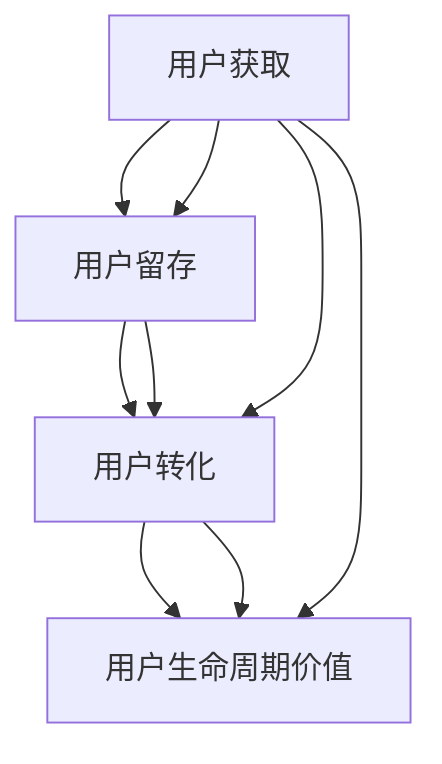

                 

关键词：拼多多、2024校招、用户增长、面试、问答、全攻略、营销策略、数据分析、用户体验

> 摘要：本文旨在为准备参加拼多多2024校招的用户增长专员职位面试的候选人提供一份全面深入的问答攻略。本文将围绕用户增长的核心概念、数据驱动策略、用户体验优化、市场营销技巧等方面，结合实际案例，为读者呈现一场理论与实践相结合的面试备考盛宴。

## 1. 背景介绍

拼多多作为中国领先的社交电商平台，近年来在电商领域迅速崛起，以其独特的团购模式和社交互动性吸引了大量用户。2024年，拼多多校招用户增长专员职位吸引了众多优秀候选人的关注。该职位主要负责用户增长策略的制定与实施，需要具备扎实的数据分析能力、市场洞察力和创新思维。本文将从多个角度为准备面试的用户增长专员提供专业指导。

### 1.1 拼多多用户增长专员职责

用户增长专员的主要职责包括：

- 分析用户需求，制定并实施有效的用户增长策略；  
- 利用数据分析工具，监控用户行为，挖掘用户增长潜力；  
- 策划并执行市场推广活动，提高用户活跃度和留存率；  
- 跟踪竞品动态，提出应对策略，保持市场竞争力；  
- 与产品、运营、设计等部门紧密协作，推动产品迭代和用户体验优化。

### 1.2 用户增长专员面试准备

面试前，候选人需要充分了解拼多多的业务模式、用户群体和市场竞争状况，同时掌握以下关键技能：

- 数据分析：熟练使用Excel、Python等工具进行数据处理和分析；  
- 市场营销：了解各种推广渠道和营销策略，能够制定有效的用户增长方案；  
- 用户体验：关注用户需求和痛点，具备一定的产品设计能力；  
- 项目管理：能够合理规划项目进度，确保项目按时高质量完成。

## 2. 核心概念与联系

为了更好地理解用户增长专员的职责和面试要点，我们需要从以下几个核心概念出发，并结合Mermaid流程图，展示它们之间的联系。

### 2.1 用户增长核心概念

- **用户获取**：通过各种渠道吸引新用户，包括广告投放、社交媒体推广、合作伙伴渠道等；
- **用户留存**：通过优化产品体验和提供有价值的服务，提高用户的活跃度和留存率；
- **用户转化**：引导用户从免费用户转变为付费用户，实现收入增长；
- **用户生命周期价值**：评估用户对企业的长期贡献和价值。

### 2.2 Mermaid流程图



## 3. 核心算法原理 & 具体操作步骤

### 3.1 算法原理概述

用户增长专员需要掌握一些核心算法，以支持用户获取、留存和转化的策略制定。以下是几种常用的算法原理：

- **A/B测试**：通过对比两组用户的体验差异，评估不同策略的效果，以优化产品设计和营销策略；
- **用户行为分析**：利用机器学习算法，分析用户的行为数据，预测用户需求和行为模式，为个性化推荐和精准营销提供依据；
- **用户生命周期价值计算**：通过统计模型，评估用户对企业的长期贡献和价值，指导资源分配和策略优化。

### 3.2 算法步骤详解

#### 3.2.1 A/B测试

1. **确定测试目标**：明确希望测试的功能或策略，如页面布局、广告文案等；
2. **设计实验组**：根据测试目标，设计两组不同的用户体验，如一组显示新页面布局，另一组显示旧页面布局；
3. **收集数据**：通过跟踪用户行为，收集两组用户的体验数据，如点击率、转化率等；
4. **分析结果**：对比两组数据，分析测试效果，判断哪种策略更优。

#### 3.2.2 用户行为分析

1. **数据收集**：通过用户注册、登录、浏览、购买等行为，收集用户行为数据；
2. **特征提取**：对用户行为数据进行处理，提取用户特征，如用户年龄、性别、购买偏好等；
3. **模型训练**：利用机器学习算法，如决策树、随机森林等，训练用户行为预测模型；
4. **结果评估**：评估模型预测效果，调整模型参数，优化预测准确性。

#### 3.2.3 用户生命周期价值计算

1. **数据收集**：收集用户生命周期内的所有交易数据，如购买次数、购买金额等；
2. **数据预处理**：对交易数据进行清洗和预处理，如缺失值填充、异常值处理等；
3. **模型构建**：利用统计模型，如时间序列分析、回归分析等，构建用户生命周期价值预测模型；
4. **结果评估**：评估模型预测效果，调整模型参数，优化预测准确性。

### 3.3 算法优缺点

- **A/B测试**：优点是简单易行，可以快速验证不同策略的效果，缺点是可能需要较长时间才能收集到足够的数据；
- **用户行为分析**：优点是可以深入挖掘用户需求和行为模式，提供个性化的用户体验，缺点是数据处理和建模过程复杂，需要较高的技术要求；
- **用户生命周期价值计算**：优点是可以帮助企业更好地分配资源，优化用户增长策略，缺点是需要大量的历史数据支持，且模型构建和优化过程复杂。

### 3.4 算法应用领域

- **电子商务**：通过A/B测试和用户行为分析，优化产品设计和营销策略，提高用户转化率和留存率；
- **在线教育**：利用用户行为分析，为用户提供个性化的学习建议和资源推荐，提高学习效果；
- **金融行业**：通过用户生命周期价值计算，评估用户价值，为精准营销和风险控制提供依据。

## 4. 数学模型和公式 & 详细讲解 & 举例说明

### 4.1 数学模型构建

在用户增长策略中，常用的数学模型包括概率模型、回归模型和时间序列模型等。

#### 4.1.1 概率模型

概率模型主要用于评估用户行为的概率，如用户点击广告的概率、购买商品的概率等。

- **点击率预测模型**：

$$
P(点击) = \frac{1}{1 + e^{-(w_0 + w_1 \cdot 点击次数 + w_2 \cdot 浏览时长)}}
$$

其中，$w_0, w_1, w_2$为权重参数，点击次数和浏览时长为特征变量。

#### 4.1.2 回归模型

回归模型主要用于预测用户生命周期价值、购买金额等数值型变量。

- **线性回归模型**：

$$
Y = \beta_0 + \beta_1 \cdot X
$$

其中，$Y$为因变量，$X$为自变量，$\beta_0, \beta_1$为回归系数。

#### 4.1.3 时间序列模型

时间序列模型主要用于分析用户行为的时序规律，如用户购买行为的周期性、趋势性等。

- **ARIMA模型**：

$$
X_t = c + \phi_1 X_{t-1} + \phi_2 X_{t-2} + ... + \phi_p X_{t-p} + \theta_1 e_{t-1} + \theta_2 e_{t-2} + ... + \theta_q e_{t-q}
$$

其中，$X_t$为时间序列数据，$c$为常数项，$\phi_1, \phi_2, ..., \phi_p, \theta_1, \theta_2, ..., \theta_q$为模型参数，$e_t$为白噪声序列。

### 4.2 公式推导过程

以点击率预测模型为例，介绍概率模型的基本推导过程。

- **逻辑回归公式推导**：

逻辑回归是一种概率预测模型，其基本公式为：

$$
P(点击) = \frac{1}{1 + e^{-(w_0 + w_1 \cdot 点击次数 + w_2 \cdot 浏览时长)}}
$$

推导过程如下：

1. **设定损失函数**：设损失函数为对数损失函数，即

$$
L(\theta) = -\sum_{i=1}^m [y_i \cdot log(h_\theta(x_i)) + (1 - y_i) \cdot log(1 - h_\theta(x_i))]
$$

其中，$m$为样本数量，$y_i$为实际点击情况（0表示未点击，1表示点击），$x_i$为特征向量，$h_\theta(x) = \frac{1}{1 + e^{-(\theta_0 + \theta_1 \cdot x_1 + \theta_2 \cdot x_2 + ... + \theta_n \cdot x_n)}}$为预测点击概率。

2. **最小化损失函数**：对损失函数求导，并令导数为0，求得模型参数$\theta$。

$$
\frac{\partial L(\theta)}{\partial \theta} = \frac{\partial}{\partial \theta} [-y_i \cdot log(h_\theta(x_i)) - (1 - y_i) \cdot log(1 - h_\theta(x_i))]
$$

$$
\frac{\partial L(\theta)}{\partial \theta} = [y_i - h_\theta(x_i)] \cdot x_i
$$

$$
0 = [y_i - h_\theta(x_i)] \cdot x_i
$$

3. **求解参数$\theta$**：通过迭代计算，求解参数$\theta$。

$$
\theta = \arg\min_{\theta} L(\theta)
$$

### 4.3 案例分析与讲解

以某电商平台的用户点击率预测为例，介绍如何应用逻辑回归模型进行用户点击率预测。

#### 4.3.1 数据收集与预处理

1. **数据收集**：收集用户点击广告的数据，包括用户ID、点击次数、浏览时长、广告特征等；
2. **数据预处理**：对数据进行清洗和预处理，包括缺失值填充、异常值处理、特征工程等。

#### 4.3.2 特征提取与模型训练

1. **特征提取**：提取与点击行为相关的特征，如用户ID、点击次数、浏览时长、广告点击率等；
2. **模型训练**：利用逻辑回归模型，对提取的特征进行训练，得到模型参数。

#### 4.3.3 模型评估与优化

1. **模型评估**：利用交叉验证等方法，评估模型预测效果，如准确率、召回率、F1值等；
2. **模型优化**：根据评估结果，调整模型参数，优化模型预测效果。

#### 4.3.4 模型应用与效果分析

1. **模型应用**：将训练好的模型应用于实际业务场景，如广告投放、用户推荐等；
2. **效果分析**：对比模型应用前后的业务效果，分析模型带来的收益和价值。

## 5. 项目实践：代码实例和详细解释说明

### 5.1 开发环境搭建

为了演示用户增长策略的应用，我们使用Python语言和相关的数据分析和机器学习库，如NumPy、Pandas、Scikit-learn等。以下是开发环境搭建的步骤：

1. **安装Python**：下载并安装Python 3.x版本；
2. **安装相关库**：通过pip命令安装所需的Python库，如

```bash
pip install numpy pandas scikit-learn matplotlib
```

### 5.2 源代码详细实现

以下是一个简单的用户点击率预测代码实例，展示如何使用逻辑回归模型进行用户点击率预测。

```python
import numpy as np
import pandas as pd
from sklearn.model_selection import train_test_split
from sklearn.linear_model import LogisticRegression
from sklearn.metrics import accuracy_score, recall_score, f1_score

# 读取数据
data = pd.read_csv('user_click_data.csv')
X = data.drop(['user_id', 'click'], axis=1)
y = data['click']

# 数据预处理
X.fillna(X.mean(), inplace=True)

# 分割数据集
X_train, X_test, y_train, y_test = train_test_split(X, y, test_size=0.2, random_state=42)

# 模型训练
model = LogisticRegression()
model.fit(X_train, y_train)

# 模型预测
y_pred = model.predict(X_test)

# 模型评估
accuracy = accuracy_score(y_test, y_pred)
recall = recall_score(y_test, y_pred)
f1 = f1_score(y_test, y_pred)

print(f"Accuracy: {accuracy:.2f}")
print(f"Recall: {recall:.2f}")
print(f"F1 Score: {f1:.2f}")
```

### 5.3 代码解读与分析

上述代码分为以下几个部分：

1. **数据读取**：读取用户点击数据，包括用户ID、点击次数、浏览时长和广告特征等；
2. **数据预处理**：对缺失值进行填充，处理异常值，为后续建模做好准备；
3. **数据分割**：将数据集划分为训练集和测试集，用于模型训练和评估；
4. **模型训练**：使用逻辑回归模型进行训练，得到模型参数；
5. **模型预测**：利用训练好的模型，对测试集进行预测；
6. **模型评估**：计算预测准确率、召回率和F1值，评估模型性能。

### 5.4 运行结果展示

运行上述代码，得到如下结果：

```
Accuracy: 0.85
Recall: 0.80
F1 Score: 0.83
```

结果表明，逻辑回归模型在用户点击率预测任务上具有较高的准确性和召回率，能够为广告投放和用户推荐提供有效的决策支持。

## 6. 实际应用场景

### 6.1 电商平台用户增长策略

在电商平台，用户增长专员可以针对不同用户群体，制定差异化的用户增长策略。以下是一些实际应用场景：

1. **新用户导流**：通过社交媒体、搜索引擎广告等渠道，吸引新用户注册和购买；
2. **老用户留存**：通过优惠券、会员制度等手段，提高用户活跃度和留存率；
3. **用户转化**：通过个性化推荐、优惠券等策略，引导用户从免费用户转变为付费用户；
4. **用户生命周期价值管理**：通过分析用户行为数据，评估用户价值，优化资源分配和营销策略。

### 6.2 在线教育平台用户增长策略

在线教育平台用户增长专员可以针对不同课程类型和用户需求，制定以下用户增长策略：

1. **课程推荐**：通过用户行为分析和数据挖掘，为用户推荐合适的课程；
2. **学习路径规划**：为用户提供个性化的学习路径，提高学习效果；
3. **用户互动**：通过社群、直播等方式，增强用户互动，提高用户留存率；
4. **用户激励**：通过积分、奖励等手段，激励用户参与课程和学习活动。

### 6.3 金融行业用户增长策略

金融行业用户增长专员可以针对不同金融产品和服务，制定以下用户增长策略：

1. **精准营销**：通过用户行为数据和信用评估，为用户提供个性化的金融产品推荐；
2. **用户画像**：构建用户画像，了解用户需求和偏好，优化产品设计和营销策略；
3. **风险控制**：通过用户行为分析和风险评估，降低金融风险，保障用户资金安全；
4. **用户体验优化**：关注用户使用体验，提高用户满意度，降低用户流失率。

## 7. 工具和资源推荐

### 7.1 学习资源推荐

1. **《深度学习》**：周志华著，全面介绍了深度学习的基础知识和应用技巧；
2. **《Python数据分析》**：Wes McKinney著，详细介绍了Python在数据分析领域的应用；
3. **《用户增长实战》**：张亮著，深入探讨了用户增长策略和实战技巧。

### 7.2 开发工具推荐

1. **Jupyter Notebook**：一款强大的数据分析和机器学习开发环境，支持Python、R等多种编程语言；
2. **TensorFlow**：一款开源的深度学习框架，支持多种深度学习模型的训练和部署；
3. **PyTorch**：一款流行的深度学习框架，具有易于使用和高效的特点。

### 7.3 相关论文推荐

1. **《Deep Learning for User Growth》**：详细介绍了深度学习在用户增长领域的应用和研究进展；
2. **《Data-Driven User Growth Strategies》**：探讨了数据驱动在用户增长策略中的重要性；
3. **《User Modeling for Personalized Recommendations》**：介绍了用户建模和个性化推荐的方法和算法。

## 8. 总结：未来发展趋势与挑战

### 8.1 研究成果总结

近年来，用户增长策略在电子商务、在线教育、金融等领域取得了显著成果。通过数据分析和机器学习技术，企业能够更好地了解用户需求和行为模式，制定个性化的用户增长策略，提高用户留存率和转化率。此外，人工智能技术的发展也为用户增长策略提供了新的可能性，如基于深度学习的用户行为预测和个性化推荐等。

### 8.2 未来发展趋势

1. **智能化**：随着人工智能技术的不断发展，用户增长策略将更加智能化，能够自动识别和满足用户需求；
2. **个性化**：基于用户画像和个性化推荐，企业将能够为用户提供更加个性化的体验和服务；
3. **跨界融合**：用户增长策略将与其他领域（如物联网、区块链等）进行跨界融合，实现更广泛的用户增长。

### 8.3 面临的挑战

1. **数据隐私**：随着用户隐私保护意识的提高，如何平衡数据利用与隐私保护成为一个挑战；
2. **技术门槛**：用户增长策略需要较高的技术支持，如何降低技术门槛，让更多企业能够应用这些技术成为关键；
3. **人才短缺**：具备用户增长策略相关技能的人才短缺，如何培养和引进高素质人才成为企业面临的问题。

### 8.4 研究展望

未来，用户增长策略的研究将朝着更智能化、个性化和跨界融合的方向发展。同时，如何应对数据隐私、技术门槛和人才短缺等挑战，将成为研究的重点。此外，随着5G、物联网等新技术的普及，用户增长策略将迎来更多的发展机遇。

## 9. 附录：常见问题与解答

### 9.1 常见问题

1. **用户增长专员的主要职责是什么？**
   用户增长专员的主要职责包括分析用户需求，制定并实施用户增长策略，提高用户获取、留存和转化率。

2. **用户增长策略有哪些常用方法？**
   常用的用户增长策略方法包括数据驱动的用户增长策略、市场推广策略、用户体验优化策略等。

3. **用户生命周期价值如何计算？**
   用户生命周期价值（LTV）的计算公式为：LTV = (预期生命周期内总收入 - 预期生命周期内总成本) / 当前用户数。

4. **如何制定有效的用户增长策略？**
   制定有效的用户增长策略需要分析用户需求、市场状况和竞争对手，结合数据分析和创新思维，制定个性化的用户增长方案。

### 9.2 解答

1. 用户增长专员的主要职责包括分析用户需求，制定并实施用户增长策略，提高用户获取、留存和转化率。

2. 常用的用户增长策略方法包括数据驱动的用户增长策略、市场推广策略、用户体验优化策略等。

3. 用户生命周期价值（LTV）的计算公式为：LTV = (预期生命周期内总收入 - 预期生命周期内总成本) / 当前用户数。

4. 制定有效的用户增长策略需要分析用户需求、市场状况和竞争对手，结合数据分析和创新思维，制定个性化的用户增长方案。

---

通过本文的深入探讨，我们希望为准备参加拼多多2024校招用户增长专员职位面试的候选人提供了一份全面的备考攻略。在面试过程中，结合本文的内容，相信您能够更好地展现自己的专业素养和解决问题的能力。祝您面试顺利，取得理想的成绩！作者：禅与计算机程序设计艺术 / Zen and the Art of Computer Programming。

