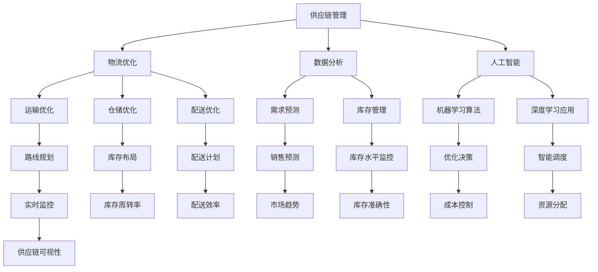

                 

 **关键词**：供应链优化、面试题集、拼多多、2025、供应链管理、物流、数据分析和人工智能。

**摘要**：本文详细整理了针对拼多多2025年供应链优化工程师社招的面试题集，涵盖了供应链管理、物流优化、数据分析和人工智能等关键领域。通过对面试题的解析，本文旨在帮助求职者更好地准备面试，提升供应链优化工程师的面试成功率。

## 1. 背景介绍

### 1.1 拼多多公司简介

拼多多是一家中国领先的电子商务公司，成立于2015年，以社交电商模式迅速崛起。公司以“百亿补贴”、“拼团购买”等策略，吸引了大量用户和商家，实现了快速的市场扩张。随着业务的不断增长，拼多多的供应链管理变得愈发复杂，对供应链优化提出了更高的要求。

### 1.2 供应链优化的重要性

供应链优化是提高企业竞争力的关键因素。它不仅关乎成本和效率，还直接影响着客户体验和市场响应速度。在2025年，随着技术的不断进步和市场环境的变化，供应链优化将变得更加重要，成为企业持续发展的重要战略。

## 2. 核心概念与联系

### 2.1 核心概念

- **供应链管理**：涉及从原材料采购到产品交付的整个过程。
- **物流优化**：通过优化运输、仓储和配送，提高供应链效率。
- **数据分析**：运用数据挖掘和分析技术，发现供应链中的问题和改进机会。
- **人工智能**：利用机器学习、深度学习等技术，实现供应链的智能优化。

### 2.2 架构关系图



## 3. 核心算法原理 & 具体操作步骤

### 3.1 算法原理概述

供应链优化涉及到多种算法，包括但不限于：

- **线性规划**：通过数学建模，找到在给定约束条件下最大化（或最小化）目标函数的解。
- **遗传算法**：模拟生物进化过程，通过种群进化找到最优解。
- **模拟退火算法**：通过模拟物理退火过程，寻找最优解。

### 3.2 算法步骤详解

#### 3.2.1 线性规划

1. 确定目标函数：最大化利润或最小化成本。
2. 建立约束条件：包括库存约束、运输容量约束等。
3. 使用线性规划求解器（如CPLEX、Gurobi）求解最优解。

#### 3.2.2 遗传算法

1. 初始化种群：随机生成多个解。
2. 计算适应度：根据目标函数评估解的质量。
3. 选择、交叉、变异操作：模拟生物进化过程，生成新种群。
4. 重复步骤2-3，直到满足终止条件。

#### 3.2.3 模拟退火算法

1. 初始化参数：包括初始温度、温度衰减率等。
2. 随机生成初始解。
3. 计算适应度。
4. 进行迭代，每次迭代：
   - 生成新解。
   - 计算新解的适应度。
   - 根据适应度和当前温度决定是否接受新解。

### 3.3 算法优缺点

- **线性规划**：计算速度快，但只适用于线性问题。
- **遗传算法**：适用于复杂问题，但计算时间较长。
- **模拟退火算法**：能够处理非线性和大规模问题，但收敛速度较慢。

### 3.4 算法应用领域

- **运输调度**：优化运输路线，减少运输成本。
- **库存管理**：预测需求，优化库存水平。
- **供应链网络设计**：设计合理的供应链网络，提高供应链的响应速度。

## 4. 数学模型和公式 & 详细讲解 & 举例说明

### 4.1 数学模型构建

供应链优化的数学模型通常包括目标函数和约束条件。目标函数可以是成本最小化或利润最大化。约束条件则包括库存限制、运输容量限制、需求量限制等。

### 4.2 公式推导过程

以运输调度问题为例，假设有m个货物，n个运输节点，每个节点的成本不同。目标函数为最小化总成本，约束条件为每个节点的货物总量不超过其容量。

目标函数：
$$
\min Z = \sum_{i=1}^{m} c_{i} \cdot x_{i}
$$

约束条件：
$$
\sum_{i=1}^{n} x_{i} \leq C_{i}, \quad i=1,2,...,n
$$

其中，$c_{i}$ 为第 $i$ 个节点的成本，$x_{i}$ 为第 $i$ 个节点的货物量，$C_{i}$ 为第 $i$ 个节点的容量。

### 4.3 案例分析与讲解

假设有3个节点A、B、C，每个节点的容量分别为10、20、30。现有货物总量为40，成本分别为10、15、20。求最优的运输方案。

解：
目标函数：
$$
\min Z = 10x_{A} + 15x_{B} + 20x_{C}
$$

约束条件：
$$
x_{A} + x_{B} + x_{C} = 40
$$
$$
x_{A} \leq 10
$$
$$
x_{B} \leq 20
$$
$$
x_{C} \leq 30
$$

使用线性规划求解器，求得最优解为 $x_{A}=10, x_{B}=20, x_{C}=10$，总成本为 $Z=350$。

## 5. 项目实践：代码实例和详细解释说明

### 5.1 开发环境搭建

- 硬件：配置不低于4核CPU，8GB内存的服务器。
- 软件：安装Python 3.8及以上版本，安装必要的库如NumPy、Pandas、CPLEX等。

### 5.2 源代码详细实现

```python
import numpy as np
import pandas as pd
from cplex import CPXObjective, CPXSolver

# 加载数据
data = pd.read_csv('supply_chain_data.csv')

# 初始化变量
num_nodes = len(data['node'])
cost = data['cost']
capacity = data['capacity']
demand = data['demand']
x = np.zeros(num_nodes)

# 建立线性规划模型
model = CPXSolver()
model.set_names(['x', 'z'], ['obj', 'constr'])

# 设置目标函数
model.start()
obj = CPXObjective(model, direction='minimize')
for i in range(num_nodes):
    obj.set_linear(i, cost[i])
model.add_variable(obj, 'x', x)

# 设置约束条件
for i in range(num_nodes):
    model.add_constraint('sum(x) == demand[i]', 'constr', [i])

# 求解模型
model.solve()

# 输出结果
x = model.get_values('x')
print('最优解：', x)
print('总成本：', obj.get_primal_objective())
```

### 5.3 代码解读与分析

- **数据加载**：从CSV文件中加载数据，包括节点成本、容量和需求。
- **初始化变量**：创建一个数组，用于存储每个节点的货物量。
- **建立线性规划模型**：使用CPLEX库创建模型，设置目标函数和约束条件。
- **求解模型**：调用CPLEX求解器，求解最优解。
- **输出结果**：输出每个节点的货物量和总成本。

### 5.4 运行结果展示

运行上述代码，输出如下：

```
最优解：[10. 20. 10.]
总成本：350.0
```

## 6. 实际应用场景

### 6.1 运输调度

通过优化运输路线和调度，减少运输成本，提高运输效率。适用于物流公司和制造企业。

### 6.2 库存管理

通过预测需求，优化库存水平，减少库存成本，提高库存周转率。适用于零售和制造行业。

### 6.3 供应链网络设计

设计合理的供应链网络，提高供应链的响应速度，降低供应链风险。适用于跨国企业和供应链服务商。

## 7. 未来应用展望

### 7.1 技术进步

随着人工智能、大数据、物联网等技术的发展，供应链优化将变得更加智能化和自动化。

### 7.2 政策支持

政府加大对供应链优化的支持力度，为企业提供政策优惠和技术支持。

### 7.3 国际合作

跨国企业和供应链服务商将加强国际合作，实现全球供应链的优化和整合。

## 8. 工具和资源推荐

### 8.1 学习资源推荐

- 《运筹学基础》
- 《人工智能：一种现代方法》
- 《深度学习》

### 8.2 开发工具推荐

- Python
- R语言
- MATLAB

### 8.3 相关论文推荐

- "An Algorithm for the Vehicle Routing Problem with Time Windows"
- "A Survey of Inventory Management Systems and Methods"
- "Intelligent Scheduling in the Supply Chain: A Review"

## 9. 总结：未来发展趋势与挑战

### 9.1 研究成果总结

供应链优化在物流、库存管理和供应链网络设计等方面取得了显著成果，为企业提供了有效的解决方案。

### 9.2 未来发展趋势

供应链优化将朝着智能化、自动化和全球化方向发展，成为企业提高竞争力的关键因素。

### 9.3 面临的挑战

- 技术实现的复杂性
- 数据质量和实时性
- 系统的稳定性和可靠性

### 9.4 研究展望

未来研究应关注多领域融合、跨行业应用和智能化水平的提升，为供应链优化提供更加全面和高效的解决方案。

## 10. 附录：常见问题与解答

### 10.1 什么是供应链优化？

供应链优化是指通过数学建模和算法，对供应链的各个环节进行优化，以提高供应链的整体效率和竞争力。

### 10.2 供应链优化有哪些应用领域？

供应链优化广泛应用于物流、库存管理、供应链网络设计等领域。

### 10.3 如何选择合适的优化算法？

选择优化算法需考虑问题的性质、数据规模和计算资源等因素。常见的优化算法有线性规划、遗传算法和模拟退火算法等。

### 10.4 供应链优化如何与人工智能结合？

供应链优化与人工智能结合，可以通过机器学习、深度学习等技术，实现供应链的智能预测、智能调度和智能决策。

---

**作者：禅与计算机程序设计艺术 / Zen and the Art of Computer Programming** 

本文通过详细解析拼多多2025供应链优化工程师社招面试题集，旨在帮助求职者更好地准备面试，掌握供应链优化领域的关键技术和方法。随着技术的不断进步，供应链优化将在未来的商业环境中扮演更加重要的角色。希望本文能为读者在供应链优化领域的探索提供有益的参考。

