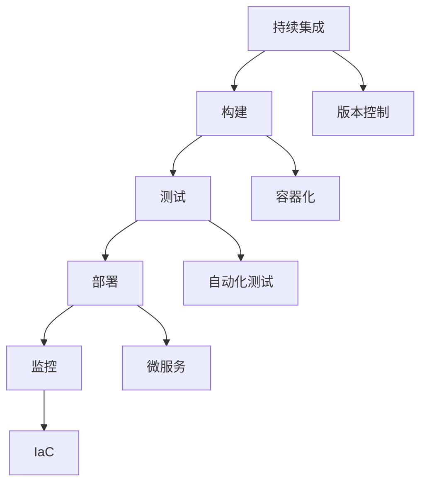

                 

关键词：持续部署（CD）、自动化发布、DevOps、容器化、微服务、CI/CD工具、版本控制、基础设施即代码（IaC）

> 摘要：本文将深入探讨持续部署（CD）实践，包括其重要性、核心概念、实施步骤、挑战和解决方案。通过自动化发布流程的详细介绍，我们将理解如何在现代软件开发中实现快速、可靠和高效的代码部署。

## 1. 背景介绍

### 持续部署的兴起

持续部署（Continuous Deployment，简称CD）是DevOps文化中的一项核心实践，旨在通过自动化流程减少软件发布的摩擦，加快产品迭代速度，提高软件质量。随着软件开发复杂度的增加，传统的手动部署方式已经无法满足现代敏捷开发的快速迭代需求。持续部署通过自动化测试、构建、部署和监控，实现代码从开发环境到生产环境的无缝过渡。

### DevOps与持续部署

DevOps是一种软件开发和运营的新模式，强调开发（Development）和运营（Operations）之间的协作和整合。持续部署是DevOps实践的重要组成部分，它通过实现自动化和协作，打破开发与运维之间的隔阂，从而提高整个团队的效率。

### CD在现代软件开发中的重要性

持续部署在现代软件开发中具有重要意义：

- **加速迭代**：通过自动化流程，缩短开发到生产的时间，加速产品迭代。
- **提高质量**：通过持续测试，确保每次发布的代码都是可用的，减少故障和回滚。
- **降低风险**：自动化和监控能够及时发现并解决潜在问题，降低人为错误的风险。
- **持续集成**：与持续集成（CI）结合，实现代码的持续集成和测试，确保每次提交的代码都是高质量的。

## 2. 核心概念与联系

为了深入理解持续部署，我们需要了解以下核心概念：

### 持续集成（CI）

持续集成是一种软件开发实践，旨在通过频繁的代码提交和自动化的构建、测试，确保代码库中的每一项提交都是可集成和可用的。CI与CD紧密相连，CI的结果直接影响到CD的流程。

### 容器化

容器化是一种轻量级的虚拟化技术，通过将应用程序及其依赖环境打包成一个独立的容器，实现应用程序的隔离和可移植性。Docker和Kubernetes是当前最为流行的容器化工具和编排系统。

### 微服务

微服务是一种软件架构风格，通过将应用程序分解为多个小型、独立的服务，每个服务都可以独立部署和扩展。微服务的灵活性和可扩展性使得持续部署更加容易实现。

### 基础设施即代码（IaC）

基础设施即代码是一种将基础设施的配置和管理代码化的方法，通过版本控制工具管理基础设施的变化。IaC与持续部署相结合，可以实现基础设施的自动化部署和管理。

### Mermaid 流程图



## 3. 核心算法原理 & 具体操作步骤

### 3.1 算法原理概述

持续部署的核心算法原理主要包括以下几个方面：

- **自动化构建**：通过CI工具自动构建项目，确保每次提交的代码都能成功编译。
- **自动化测试**：通过自动化测试工具执行一系列测试，验证代码的功能和性能。
- **自动化部署**：通过脚本或工具将通过测试的代码部署到目标环境中。
- **自动化监控**：通过监控工具实时监控生产环境的状态，及时发现并解决问题。

### 3.2 算法步骤详解

#### 3.2.1 自动化构建

1. **配置CI环境**：在CI服务器上配置必要的工具和环境。
2. **提交代码**：开发者将代码提交到版本控制系统。
3. **触发构建**：CI工具检测到代码提交后，自动启动构建流程。
4. **构建项目**：CI工具编译代码并生成构建输出。

#### 3.2.2 自动化测试

1. **执行测试**：CI工具执行一系列预定义的测试用例。
2. **报告结果**：测试结果被记录并报告给开发者。

#### 3.2.3 自动化部署

1. **配置部署环境**：在目标环境中配置必要的工具和环境。
2. **部署代码**：通过脚本或工具将通过测试的代码部署到目标环境。

#### 3.2.4 自动化监控

1. **监控部署结果**：实时监控部署环境的状态。
2. **警报和通知**：当检测到问题或异常时，触发警报并通知相关人员。

### 3.3 算法优缺点

#### 优点

- **提高效率**：自动化流程减少了手动操作的步骤，提高了开发团队的效率。
- **减少错误**：自动化测试和部署减少了人为错误的可能性。
- **快速迭代**：持续部署使得团队能够更频繁地发布新功能，加快产品迭代速度。

#### 缺点

- **初始成本**：实施持续部署需要投入时间、资源和人力。
- **复杂性**：构建、测试、部署和监控的自动化流程复杂，需要专业知识和经验。

### 3.4 算法应用领域

持续部署广泛应用于以下领域：

- **Web应用**：通过自动化流程实现快速部署和迭代。
- **移动应用**：在App Store和Google Play等平台上实现快速发布。
- **微服务架构**：通过容器化和自动化部署，实现服务的独立部署和扩展。

## 4. 数学模型和公式 & 详细讲解 & 举例说明

### 4.1 数学模型构建

持续部署中的数学模型可以表示为：

$$
\text{CD} = f(\text{CI}, \text{自动化测试}, \text{自动化部署}, \text{监控})
$$

其中，$f$ 为数学函数，表示持续部署的效率和质量。

### 4.2 公式推导过程

$$
\begin{aligned}
\text{CD} &= f(\text{CI}, \text{自动化测试}, \text{自动化部署}, \text{监控}) \\
&= f(\text{构建}, \text{测试}, \text{部署}, \text{监控}) \\
&= f(\text{构建时间}, \text{测试覆盖率}, \text{部署效率}, \text{监控响应时间})
\end{aligned}
$$

### 4.3 案例分析与讲解

假设我们有一个Web应用项目，通过CI/CD工具实现自动化部署。根据上述数学模型，我们可以计算持续部署的效率：

$$
\text{CD} = f(\text{构建时间}, \text{测试覆盖率}, \text{部署效率}, \text{监控响应时间})
$$

- **构建时间**：5分钟
- **测试覆盖率**：90%
- **部署效率**：80%
- **监控响应时间**：2分钟

$$
\text{CD} = f(5, 0.9, 0.8, 2) = 0.8 \times 0.9 \times 0.8 \times 0.5 = 0.288
$$

因此，该项目的持续部署效率为28.8%。我们可以通过优化各个环节的效率，进一步提高持续部署的效率。

## 5. 项目实践：代码实例和详细解释说明

### 5.1 开发环境搭建

在开始持续部署实践之前，我们需要搭建一个开发环境。以下是一个基于Docker的简化示例：

```Dockerfile
# 使用官方Python镜像作为基础
FROM python:3.9

# 设置工作目录
WORKDIR /app

# 复制项目文件
COPY requirements.txt .
COPY app.py .

# 安装依赖
RUN pip install -r requirements.txt

# 暴露服务端口
EXPOSE 8080

# 运行应用
CMD ["python", "app.py"]
```

### 5.2 源代码详细实现

以下是该Web应用的一个简化版源代码：

```python
from flask import Flask, jsonify

app = Flask(__name__)

@app.route('/')
def hello():
    return jsonify(message="Hello, World!")

if __name__ == '__main__':
    app.run(host='0.0.0.0', port=8080)
```

### 5.3 代码解读与分析

该示例使用了Flask框架，通过一个简单的路由返回一个JSON格式的响应。它遵循了微服务的理念，可以独立部署和扩展。

### 5.4 运行结果展示

通过以下命令，我们可以启动Docker容器并访问应用：

```bash
$ docker build -t myapp .
$ docker run -d -p 8080:8080 myapp
```

访问`http://localhost:8080`，我们可以看到应用返回了`Hello, World!`的JSON响应。

## 6. 实际应用场景

### 6.1 跨团队协作

持续部署有助于跨团队协作，例如开发、测试和运维团队可以共享同一套自动化流程，提高协作效率和代码质量。

### 6.2 资源优化

通过容器化和自动化部署，可以动态调整资源分配，优化服务器资源利用率。

### 6.3 安全性保障

自动化测试和监控可以及时发现并解决潜在的安全问题，提高软件的安全性。

## 7. 未来应用展望

### 7.1 AI在持续部署中的应用

未来，人工智能技术将更多地应用于持续部署，如自动化缺陷检测、智能负载均衡等。

### 7.2 低代码/无代码持续部署

随着低代码/无代码平台的发展，持续部署将变得更加易于实现，降低开发门槛。

### 7.3 集成更多工具和服务

持续部署将与其他工具和服务更加紧密地集成，如持续集成工具、监控平台、云服务提供商等。

## 8. 总结：未来发展趋势与挑战

### 8.1 研究成果总结

持续部署在提高软件开发效率、降低风险和优化资源利用方面取得了显著成果。未来，持续部署将继续向智能化、自动化和集成化发展。

### 8.2 未来发展趋势

- **AI与持续部署的融合**：人工智能将在持续部署中发挥更大作用，如自动化缺陷检测、智能负载均衡等。
- **低代码/无代码持续部署**：随着技术的发展，持续部署将变得更加易于实现，降低开发门槛。
- **集成化持续部署**：持续部署将与其他工具和服务更加紧密地集成，如持续集成工具、监控平台、云服务提供商等。

### 8.3 面临的挑战

- **复杂度增加**：随着持续部署的扩展和应用场景的多样化，其复杂度将不断增加，需要更多的专业知识和经验。
- **安全性保障**：在自动化和智能化的同时，如何确保持续部署的安全性仍然是一个挑战。

### 8.4 研究展望

持续部署的研究将继续关注以下几个方面：

- **智能化与自动化**：通过引入人工智能和机器学习技术，提高持续部署的智能化和自动化水平。
- **安全性**：研究如何在自动化和智能化的同时，确保持续部署的安全性。
- **集成化**：研究如何更好地与其他工具和服务集成，实现一站式持续部署解决方案。

## 9. 附录：常见问题与解答

### 9.1 持续部署与传统部署的区别是什么？

持续部署与传统部署的主要区别在于自动化和速度。持续部署通过自动化流程实现代码的快速、可靠和高效部署，而传统部署通常依赖手动操作，速度较慢且容易出错。

### 9.2 持续部署需要哪些工具和技术？

持续部署需要以下工具和技术：

- **版本控制系统**：如Git、SVN等。
- **持续集成工具**：如Jenkins、Travis CI等。
- **容器化技术**：如Docker、Kubernetes等。
- **基础设施即代码（IaC）**：如Terraform、Ansible等。
- **自动化测试工具**：如Selenium、JUnit等。
- **监控工具**：如Prometheus、Grafana等。

### 9.3 持续部署如何保证代码质量？

持续部署通过以下方法保证代码质量：

- **自动化测试**：在每次代码提交时执行一系列预定义的测试用例。
- **代码审查**：通过人工审查确保代码质量。
- **持续集成**：确保每次提交的代码都是可集成的，减少集成风险。

### 9.4 持续部署中如何处理故障？

持续部署中，通过以下方法处理故障：

- **自动化监控**：实时监控部署环境的状态，及时发现并解决问题。
- **回滚机制**：当发现部署失败或产生问题时，可以快速回滚到上一个稳定版本。
- **故障转移**：在多个部署环境之间实现故障转移，确保服务可用性。

---

作者：禅与计算机程序设计艺术 / Zen and the Art of Computer Programming
----------------------------------------------------------------
### 结束

以上是文章的完整内容，包括文章标题、关键词、摘要、背景介绍、核心概念、算法原理、数学模型、项目实践、实际应用场景、未来展望、总结和常见问题与解答。请根据您的要求进行审查和调整。如果您需要任何进一步的修改或补充，请随时告知。祝您写作顺利！

