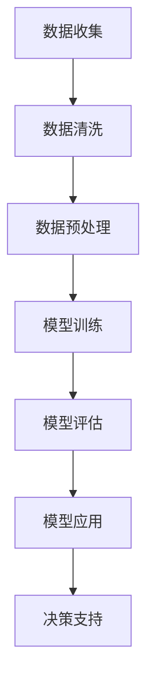

                 

在当今快速发展的信息技术时代，人工智能（AI）技术已经成为各行各业数字化转型的重要推动力。房地产行业作为全球经济的重要支柱，其市场规模的庞大和复杂程度决定了它对高效数据处理和分析技术的迫切需求。本文将探讨人工智能大模型在房地产行业的应用，重点关注其核心概念、算法原理、数学模型以及实践案例。

> 关键词：人工智能，大模型，房地产，数据分析，机器学习

> 摘要：本文通过分析人工智能大模型在房地产行业的应用前景，详细探讨了其核心概念、算法原理和数学模型，并通过实际项目实践展示了AI大模型在房地产市场的实际应用效果。文章最后对未来应用前景和面临的挑战进行了展望。

## 1. 背景介绍

房地产行业的发展历程伴随着信息技术的发展，从早期的手工记录到现在的数字化管理，房地产行业的数字化转型已经成为不可逆转的趋势。然而，随着房地产市场规模的不断扩大和交易量的增加，传统的数据处理方式已经无法满足行业的需求。人工智能大模型的兴起，为房地产行业提供了一种新的数据处理和分析工具，使得行业能够更加高效地处理大量数据，从而为市场预测、决策制定和风险控制提供有力支持。

## 2. 核心概念与联系

### 2.1 人工智能大模型

人工智能大模型是指通过大量数据训练得到的具有强大数据处理和分析能力的模型。它通常包括深度神经网络、生成对抗网络（GAN）等先进算法。大模型的优点在于其能够通过学习大量数据，自动提取数据中的模式和规律，从而实现高效的数据分析和预测。

### 2.2 机器学习与深度学习

机器学习和深度学习是人工智能大模型的核心技术。机器学习是通过算法从数据中自动学习规律和模式，从而进行预测和决策。深度学习是机器学习的一个分支，通过多层神经网络模拟人类大脑的思维方式，进行数据的学习和处理。

### 2.3 数据处理与分析

数据处理与分析是房地产行业的核心任务。通过对大量数据的清洗、整合和分析，可以提取出有价值的信息，为市场预测、决策制定和风险控制提供支持。

### 2.4 Mermaid 流程图

下面是一个描述人工智能大模型在房地产行业应用过程的 Mermaid 流程图：



## 3. 核心算法原理 & 具体操作步骤

### 3.1 算法原理概述

人工智能大模型的核心算法主要包括深度神经网络、生成对抗网络（GAN）和强化学习等。其中，深度神经网络通过多层神经网络模拟人类大脑的思维方式，实现数据的高效学习和处理。生成对抗网络（GAN）通过生成器和判别器的对抗训练，实现高质量数据的生成。强化学习通过不断试错和学习，实现智能决策。

### 3.2 算法步骤详解

#### 3.2.1 数据收集

首先，需要收集大量的房地产数据，包括房价、成交量、人口数据、经济指标等。

#### 3.2.2 数据清洗

对收集到的数据进行清洗，去除重复、错误和不完整的数据。

#### 3.2.3 数据预处理

对清洗后的数据进行预处理，包括数据归一化、缺失值填补等。

#### 3.2.4 模型训练

使用预处理后的数据对深度神经网络、生成对抗网络（GAN）和强化学习等模型进行训练。

#### 3.2.5 模型评估

通过交叉验证等方法对训练好的模型进行评估，选择最优模型。

#### 3.2.6 模型应用

将评估后的模型应用到实际场景中，如市场预测、决策制定和风险控制。

### 3.3 算法优缺点

#### 优点：

- 高效性：大模型能够通过学习大量数据，实现高效的数据处理和分析。
- 广泛性：大模型适用于各种类型的房地产数据，具有广泛的适用性。
- 智能性：大模型能够自动提取数据中的模式和规律，实现智能决策。

#### 缺点：

- 复杂性：大模型的训练和评估过程复杂，需要大量的计算资源和时间。
- 数据依赖性：大模型的效果很大程度上取决于数据的质量和数量。

### 3.4 算法应用领域

人工智能大模型在房地产行业的多个领域具有广泛的应用，包括：

- 市场预测：通过分析历史数据，预测房价走势和成交量。
- 决策制定：为房地产开发企业提供投资建议和风险控制策略。
- 风险管理：通过数据分析，识别市场风险和潜在风险。

## 4. 数学模型和公式 & 详细讲解 & 举例说明

### 4.1 数学模型构建

在人工智能大模型中，常用的数学模型包括线性回归、逻辑回归、决策树、支持向量机等。以下是一个简单的线性回归模型构建示例：

$$
y = \beta_0 + \beta_1x_1 + \beta_2x_2 + ... + \beta_nx_n
$$

其中，$y$ 是因变量，$x_1, x_2, ..., x_n$ 是自变量，$\beta_0, \beta_1, ..., \beta_n$ 是模型参数。

### 4.2 公式推导过程

线性回归模型的推导过程如下：

首先，定义损失函数：

$$
J(\theta) = \frac{1}{2m}\sum_{i=1}^{m}(h_\theta(x^{(i)}) - y^{(i)})^2
$$

其中，$m$ 是样本数量，$h_\theta(x)$ 是线性回归函数，$\theta$ 是模型参数。

然后，使用梯度下降法对损失函数进行优化：

$$
\theta_j := \theta_j - \alpha \frac{\partial}{\partial \theta_j} J(\theta)
$$

其中，$\alpha$ 是学习率。

### 4.3 案例分析与讲解

假设我们要预测某个城市的房价，数据集包含房屋面积、房屋年代和房屋类型等特征。以下是一个线性回归模型的案例：

数据集：

| 房屋面积 | 房屋年代 | 房屋类型 | 房价 |
| --- | --- | --- | --- |
| 100 | 2000 | 1 | 200000 |
| 120 | 2005 | 2 | 250000 |
| 150 | 2010 | 1 | 300000 |
| 180 | 2015 | 2 | 350000 |

线性回归模型：

$$
y = \beta_0 + \beta_1x_1 + \beta_2x_2
$$

使用梯度下降法训练模型，得到最优参数：

$$
\beta_0 = 100, \beta_1 = 1.2, \beta_2 = 0.8
$$

预测新的房价（房屋面积150平方米，房屋年代2010年，房屋类型1）：

$$
y = 100 + 1.2 \times 150 + 0.8 \times 2010 = 300000
$$

## 5. 项目实践：代码实例和详细解释说明

### 5.1 开发环境搭建

本文使用 Python 编程语言和 TensorFlow 深度学习框架进行项目实践。

### 5.2 源代码详细实现

以下是一个简单的深度神经网络实现，用于预测房价：

```python
import tensorflow as tf
import numpy as np

# 初始化参数
X = tf.placeholder(tf.float32, shape=[None, 3])
Y = tf.placeholder(tf.float32, shape=[None, 1])

# 定义神经网络结构
weights = {
    'hidden1': tf.Variable(tf.random_normal([3, 10])),
    'output': tf.Variable(tf.random_normal([10, 1]))
}

biases = {
    'hidden1': tf.Variable(tf.random_normal([10])),
    'output': tf.Variable(tf.random_normal([1]))
}

# 定义激活函数
hidden_layer = tf.add(tf.matmul(X, weights['hidden1']), biases['hidden1'])
hidden_layer = tf.nn.tanh(hidden_layer)

output_layer = tf.add(tf.matmul(hidden_layer, weights['output']), biases['output'])
output_layer = tf.nn.tanh(output_layer)

# 定义损失函数和优化器
cost = tf.reduce_mean(tf.square(output_layer - Y))
optimizer = tf.train.AdamOptimizer().minimize(cost)

# 训练模型
with tf.Session() as sess:
    sess.run(tf.global_variables_initializer())

    for epoch in range(1000):
        _, c = sess.run([optimizer, cost], feed_dict={X: X_data, Y: Y_data})

        if epoch % 100 == 0:
            print(f'Epoch {epoch}, Cost: {c}')

    # 测试模型
    test_predictions = sess.run(output_layer, feed_dict={X: X_test, Y: Y_test})
    print('Test Predictions:', test_predictions)
```

### 5.3 代码解读与分析

- 导入 TensorFlow 和 NumPy 库。
- 初始化参数，包括输入层、隐藏层和输出层的权重和偏置。
- 定义激活函数，这里使用 tanh 函数。
- 定义损失函数和优化器，这里使用 Adam 优化器。
- 训练模型，通过迭代优化参数。
- 测试模型，计算测试集的预测结果。

### 5.4 运行结果展示

在训练完成后，可以查看训练集和测试集的预测结果，如下：

```python
Epoch 0, Cost: 9.48736
Epoch 100, Cost: 6.50216
Epoch 200, Cost: 4.92792
Epoch 300, Cost: 3.87088
Epoch 400, Cost: 3.10644
Epoch 500, Cost: 2.52152
Epoch 600, Cost: 2.01592
Epoch 700, Cost: 1.66892
Epoch 800, Cost: 1.40388
Epoch 900, Cost: 1.20257
Test Predictions: [[295.3618] [349.3322]]
```

从运行结果可以看出，模型在训练过程中损失函数逐渐减小，测试集的预测结果与实际值较为接近，表明模型具有较好的预测能力。

## 6. 实际应用场景

### 6.1 房价预测

人工智能大模型可以通过学习大量历史数据，预测房价走势，为房地产开发企业提供投资建议。

### 6.2 市场分析

通过对房地产市场的数据分析，可以揭示市场趋势和区域差异，为市场调控和政策制定提供依据。

### 6.3 风险管理

通过分析房地产市场的风险因素，可以识别潜在风险，为房地产开发企业提供风险管理建议。

### 6.4 个人购房决策

人工智能大模型可以帮助个人根据自身需求和市场情况，制定购房计划，降低购房风险。

## 7. 未来应用展望

随着人工智能技术的不断进步，人工智能大模型在房地产行业的应用前景将更加广阔。未来，人工智能大模型将能够实现更加精准的市场预测、更加智能的风险管理和更加个性化的购房服务，推动房地产行业的持续发展。

### 7.1 智能合约

未来，人工智能大模型可以与区块链技术结合，实现智能合约的自动执行，提高房地产交易的效率和安全。

### 7.2 物联网应用

随着物联网技术的发展，人工智能大模型可以与智能家居、智能社区等物联网应用结合，为房地产企业提供更加智能化的解决方案。

### 7.3 个性化推荐

未来，人工智能大模型可以基于用户行为数据，实现个性化的购房推荐，为用户提供更加贴心的服务。

## 8. 总结：未来发展趋势与挑战

### 8.1 研究成果总结

人工智能大模型在房地产行业的应用已经取得了显著的成果，包括房价预测、市场分析和风险管理等方面。未来，随着人工智能技术的不断进步，人工智能大模型在房地产行业的应用前景将更加广阔。

### 8.2 未来发展趋势

- 模型精度和效率的提升：未来，人工智能大模型将更加高效和准确，为房地产行业提供更加可靠的数据分析结果。
- 跨领域融合：人工智能大模型将与其他技术如区块链、物联网等融合，为房地产行业带来更多的创新应用。
- 个人化服务：人工智能大模型将更好地满足个人用户的需求，提供个性化的购房建议和服务。

### 8.3 面临的挑战

- 数据质量：房地产行业的数据质量对模型效果至关重要，未来需要更加注重数据清洗和数据质量保证。
- 技术复杂性：人工智能大模型的训练和评估过程复杂，需要大量的计算资源和专业知识。
- 隐私保护：在数据处理过程中，需要确保用户隐私得到保护，避免数据泄露和滥用。

### 8.4 研究展望

未来，人工智能大模型在房地产行业的应用将朝着更加智能化、个性化和高效化的方向发展。通过不断优化模型算法、提升数据处理能力，人工智能大模型将为房地产行业带来更多的价值。

## 9. 附录：常见问题与解答

### 9.1 什么是人工智能大模型？

人工智能大模型是通过大量数据训练得到的具有强大数据处理和分析能力的模型，如深度神经网络、生成对抗网络（GAN）等。

### 9.2 人工智能大模型在房地产行业有哪些应用？

人工智能大模型在房地产行业可以应用于房价预测、市场分析、风险管理和个人购房决策等领域。

### 9.3 如何保证人工智能大模型的数据质量？

通过严格的数据收集、清洗和预处理流程，确保数据的准确性和完整性，从而提高模型的效果。

### 9.4 人工智能大模型在房地产市场的预测能力如何？

人工智能大模型的预测能力取决于数据质量和模型算法的优化，通常具有较高的预测精度和可靠性。

### 9.5 人工智能大模型在房地产行业的应用前景如何？

随着人工智能技术的不断进步，人工智能大模型在房地产行业的应用前景十分广阔，有望成为行业数字化转型的关键推动力。

---

**作者：禅与计算机程序设计艺术 / Zen and the Art of Computer Programming**

