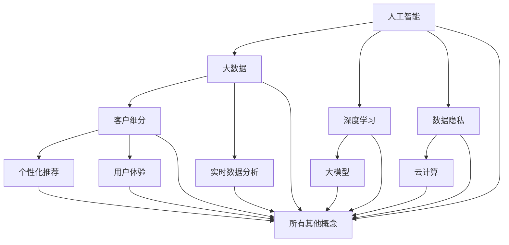

                 

### 背景介绍

随着互联网的迅速发展，电子商务市场在全球范围内蓬勃发展。电商行业面临着日益激烈的竞争和不断变化的消费者需求。为了在激烈的市场竞争中脱颖而出，电商企业需要深入了解其客户，实现精准营销和个性化服务。客户细分作为一项重要的市场策略，可以帮助电商企业更好地理解客户群体，优化营销策略，提升客户满意度和忠诚度。

然而，传统的客户细分方法通常基于历史数据和统计模型，存在一些局限性。例如，传统方法往往依赖于简单的人群分类，无法深入挖掘客户个体的特征和需求。此外，传统方法在处理大量数据时效率较低，难以应对快速变化的电商市场环境。因此，探索一种更为先进和高效的客户细分方法具有重要的现实意义。

近年来，随着人工智能和大数据技术的快速发展，基于大模型的智能客户细分系统逐渐成为可能。大模型通过深度学习和数据挖掘技术，能够从海量数据中自动提取有价值的信息，实现客户特征的深入分析和细分。这种基于大模型的客户细分系统不仅可以提高客户细分的准确性，还能够动态适应市场变化，为电商企业提供实时的营销策略支持。

本文旨在探讨基于大模型的电商智能客户细分系统的研究背景、核心概念、算法原理、数学模型、项目实践、实际应用场景以及未来展望。通过本文的介绍，希望为电商企业在客户细分方面提供一些新的思路和方法，推动智能客户细分技术在电商领域的广泛应用。

### 核心概念与联系

在探索基于大模型的电商智能客户细分系统的过程中，首先需要明确几个核心概念，并理解它们之间的相互关系。以下是本文将要涉及的核心概念及其关系：

#### 1. 人工智能

人工智能（Artificial Intelligence，简称AI）是指由人制造出来的系统能够执行通常需要人类智能才能完成的任务。在电商智能客户细分系统中，人工智能主要用于处理和分析大量数据，从中提取有价值的信息和模式。

#### 2. 大数据

大数据（Big Data）是指数据规模巨大、类型繁多且增长速度极快的数据集合。在电商领域，大数据包括用户的购买记录、搜索历史、浏览行为等。大数据的存在为智能客户细分提供了丰富的数据基础。

#### 3. 深度学习

深度学习（Deep Learning）是人工智能的一个重要分支，它通过构建复杂的神经网络模型，能够自动从数据中学习特征和模式。在电商智能客户细分系统中，深度学习被用来分析和理解客户的购买行为和偏好。

#### 4. 客户细分

客户细分（Customer Segmentation）是将客户群体划分为不同的子群体，以便更好地了解每个子群体的需求和特征。在电商领域，客户细分可以帮助企业制定个性化的营销策略，提高客户满意度和忠诚度。

#### 5. 大模型

大模型（Large-scale Model）是指能够处理大规模数据的复杂模型。在电商智能客户细分系统中，大模型通常是通过深度学习技术训练得到的，能够从海量数据中提取深层次的特征和模式。

#### 6. 个性化推荐

个性化推荐（Personalized Recommendation）是基于客户细分和大数据分析，向客户提供个性化的商品推荐。在电商智能客户细分系统中，个性化推荐是客户细分的一个重要应用场景。

#### 7. 用户体验

用户体验（User Experience，简称UX）是指用户在使用产品或服务过程中的整体感受。在电商智能客户细分系统中，用户体验是设计和优化客户细分策略的重要考量因素。

#### 8. 实时数据分析

实时数据分析（Real-time Data Analysis）是指对实时产生的数据进行分析和处理。在电商智能客户细分系统中，实时数据分析能够帮助企业快速响应市场变化，调整营销策略。

#### 9. 数据隐私

数据隐私（Data Privacy）是指保护用户数据的隐私和安全。在电商智能客户细分系统中，数据隐私是确保客户信任和合规性的关键。

#### 10. 云计算

云计算（Cloud Computing）是指通过网络提供动态可伸缩的、便捷的、按需的网络访问资源池，包括计算存储、应用程序等。在电商智能客户细分系统中，云计算为大规模数据处理和分析提供了基础设施支持。

### Mermaid 流程图

以下是一个简化的 Mermaid 流程图，展示了上述核心概念之间的联系：



通过这个流程图，我们可以清晰地看到每个核心概念如何相互作用，共同构成电商智能客户细分系统的基础。在后续章节中，我们将进一步探讨这些概念在具体应用中的实现方法和挑战。

### 核心算法原理 & 具体操作步骤

在构建基于大模型的电商智能客户细分系统时，选择合适的算法是关键。本节将介绍一种广泛应用于客户细分任务的核心算法——K-均值聚类（K-Means Clustering）。K-均值聚类是一种基于距离度量的无监督学习方法，通过将数据点划分为K个簇，使得每个簇内的数据点之间的距离尽可能小，簇与簇之间的距离尽可能大。

#### 3.1 算法原理概述

K-均值聚类算法的基本原理如下：

1. **初始化中心**：随机选择K个数据点作为初始聚类中心。
2. **分配数据点**：将每个数据点分配到最近的聚类中心所代表的簇中。
3. **更新中心**：计算每个簇的新中心，即将簇内所有数据点的均值作为新的聚类中心。
4. **重复步骤2和3**：重复上述过程，直到聚类中心不再发生变化或达到预定的迭代次数。

K-均值聚类算法的核心思想是通过最小化簇内距离平方和（Sum of Squared Errors，简称SSE）来实现聚类。具体而言，对于数据集$D=\{x_1, x_2, ..., x_n\}$，其中每个数据点$x_i \in R^d$，定义聚类中心为$c_k \in R^d$，则簇内距离平方和可以表示为：

$$
SSE = \sum_{k=1}^{K} \sum_{x_i \in S_k} ||x_i - c_k||^2
$$

其中，$S_k$表示属于第k个簇的数据点的集合。

#### 3.2 算法步骤详解

K-均值聚类算法的具体步骤如下：

1. **初始化**：
   - 随机选择K个数据点作为初始聚类中心$c_1, c_2, ..., c_K$。
2. **迭代分配**：
   - 对于每个数据点$x_i$，计算它与每个聚类中心$c_k$之间的距离，选择距离最近的一个聚类中心作为$x_i$的簇归属。
   - 将$x_i$分配到对应的簇$S_k$中。
3. **更新中心**：
   - 对于每个簇$S_k$，计算簇内所有数据点的均值，得到新的聚类中心$c_k'=\frac{1}{|S_k|}\sum_{x_i \in S_k} x_i$。
4. **判断收敛**：
   - 检查聚类中心的变化是否小于预设的阈值$\epsilon$，或者达到最大迭代次数$T$。
   - 如果满足条件，则算法收敛，输出聚类结果；否则，返回步骤2继续迭代。

#### 3.3 算法优缺点

K-均值聚类算法的优点如下：

- **简单高效**：算法步骤简单，计算效率高，适用于大规模数据处理。
- **灵活性**：可以通过调整簇的数量K来适应不同的聚类需求。
- **可解释性**：聚类结果直观，每个簇代表一个客户群体，易于理解和解释。

K-均值聚类算法的缺点如下：

- **敏感性**：算法对初始聚类中心的敏感度较高，可能导致局部最优解。
- **数据分布要求**：算法假设数据点均匀分布，对于非凸或者不均匀分布的数据效果较差。
- **无法处理数据缺失**：算法在处理缺失数据时存在困难，需要先进行数据预处理。

#### 3.4 算法应用领域

K-均值聚类算法在客户细分领域有着广泛的应用，以下是一些典型的应用场景：

- **用户行为分析**：通过对用户的购买记录、浏览行为等数据进行聚类分析，识别出具有相似行为的用户群体。
- **商品推荐**：根据用户的聚类结果，为用户提供个性化的商品推荐。
- **营销策略优化**：根据聚类结果，针对不同客户群体设计差异化的营销策略，提高营销效果。

### 数学模型和公式 & 详细讲解 & 举例说明

在深入探讨K-均值聚类算法时，我们需要了解其背后的数学模型和公式，以便更好地理解算法的原理和操作步骤。以下是K-均值聚类算法的关键数学概念和公式，我们将通过具体的例子来讲解这些公式的应用。

#### 4.1 数学模型构建

K-均值聚类算法的数学模型可以描述为：

$$
\begin{align*}
c_k &= \frac{1}{|S_k|}\sum_{x_i \in S_k} x_i \\
d(x_i, c_k) &= ||x_i - c_k|| \\
SSE &= \sum_{k=1}^{K} \sum_{x_i \in S_k} d(x_i, c_k)^2
\end{align*}
$$

其中，$c_k$表示第k个簇的中心，$S_k$表示第k个簇的数据点集合，$|S_k|$表示簇$S_k$中数据点的个数，$d(x_i, c_k)$表示数据点$x_i$与聚类中心$c_k$之间的距离，$SSE$表示簇内距离平方和。

#### 4.2 公式推导过程

为了推导K-均值聚类算法的相关公式，我们可以从以下几个步骤进行：

1. **初始化聚类中心**：
   - 随机选择K个数据点作为初始聚类中心$c_1, c_2, ..., c_K$。这一步可以通过随机采样或更先进的初始化方法来实现。

2. **分配数据点**：
   - 对于每个数据点$x_i$，计算它与每个聚类中心$c_k$之间的距离$d(x_i, c_k)$。距离通常使用欧几里得距离来计算：
   $$
   d(x_i, c_k) = \sqrt{\sum_{j=1}^{d} (x_{ij} - c_{kj})^2}
   $$

3. **选择最近的聚类中心**：
   - 将$x_i$分配到最近的聚类中心所代表的簇中，即选择使得$d(x_i, c_k)$最小的$c_k$。这一步骤可以通过比较$d(x_i, c_k)$的值来确定。

4. **更新聚类中心**：
   - 计算每个簇的新中心$c_k'$，即簇内所有数据点的均值：
   $$
   c_k' = \frac{1}{|S_k|}\sum_{x_i \in S_k} x_i
   $$

5. **重复迭代**：
   - 重复上述步骤，直到聚类中心不再发生变化或达到预定的迭代次数。

#### 4.3 案例分析与讲解

为了更好地理解K-均值聚类算法，我们通过一个简单的例子来讲解其应用。

**例子**：假设我们有以下数据集：

$$
D = \{ (1, 2), (1, 4), (1, 0), (4, 2), (4, 4), (4, 0) \}
$$

我们希望使用K-均值聚类将数据点分为两个簇。

1. **初始化**：
   - 随机选择两个数据点作为初始聚类中心：
   $$
   c_1 = (1, 2), c_2 = (4, 4)
   $$

2. **分配数据点**：
   - 计算每个数据点与两个聚类中心的距离：
   $$
   \begin{align*}
   d((1, 2), c_1) &= \sqrt{(1-1)^2 + (2-2)^2} = 0 \\
   d((1, 2), c_2) &= \sqrt{(1-4)^2 + (2-4)^2} = \sqrt{9 + 4} = \sqrt{13} \\
   d((1, 4), c_1) &= \sqrt{(1-1)^2 + (4-2)^2} = \sqrt{4} \\
   d((1, 4), c_2) &= \sqrt{(1-4)^2 + (4-4)^2} = \sqrt{9} \\
   d((1, 0), c_1) &= \sqrt{(1-1)^2 + (0-2)^2} = \sqrt{4} \\
   d((1, 0), c_2) &= \sqrt{(1-4)^2 + (0-4)^2} = \sqrt{17} \\
   d((4, 2), c_1) &= \sqrt{(4-1)^2 + (2-2)^2} = \sqrt{9} \\
   d((4, 2), c_2) &= \sqrt{(4-4)^2 + (2-4)^2} = \sqrt{4} \\
   d((4, 4), c_1) &= \sqrt{(4-1)^2 + (4-2)^2} = \sqrt{9} \\
   d((4, 4), c_2) &= \sqrt{(4-4)^2 + (4-4)^2} = 0 \\
   d((4, 0), c_1) &= \sqrt{(4-1)^2 + (0-2)^2} = \sqrt{9} \\
   d((4, 0), c_2) &= \sqrt{(4-4)^2 + (0-4)^2} = \sqrt{17} \\
   \end{align*}
   $$
   - 数据点分配如下：
   $$
   \begin{align*}
   (1, 2) &\rightarrow c_1 \\
   (1, 4) &\rightarrow c_1 \\
   (1, 0) &\rightarrow c_1 \\
   (4, 2) &\rightarrow c_2 \\
   (4, 4) &\rightarrow c_2 \\
   (4, 0) &\rightarrow c_2 \\
   \end{align*}
   $$

3. **更新聚类中心**：
   - 计算每个簇的新中心：
   $$
   \begin{align*}
   c_1' &= \frac{1}{3}((1, 2) + (1, 4) + (1, 0)) = (1, 2.33) \\
   c_2' &= \frac{1}{3}((4, 2) + (4, 4) + (4, 0)) = (4, 2.33) \\
   \end{align*}
   $$

4. **迭代重复**：
   - 重复上述步骤，直到聚类中心不再变化或达到预定的迭代次数。

5. **收敛**：
   - 在本次迭代中，聚类中心没有变化，算法收敛。

通过这个例子，我们可以看到K-均值聚类算法的基本操作步骤和数学模型。在实际应用中，数据集通常会更加复杂，需要使用更高效的算法来实现聚类。

#### 4.4 案例分析：电商客户细分

为了进一步展示K-均值聚类算法在电商客户细分中的应用，我们考虑一个实际案例。

**案例背景**：一家电商公司希望通过客户购买数据对客户进行细分，以制定更有效的营销策略。公司提供多种商品，包括电子产品、服装、家居用品等。为了简化分析，我们只考虑客户的购买金额。

**数据集**：假设公司收集了1000位客户的购买数据，数据集如下：

$$
D = \{ 100, 150, 200, 300, 400, ..., 2000 \}
$$

**目标**：将客户划分为高价值客户、中价值客户和低价值客户三个群体。

1. **初始化**：
   - 随机选择三个数据点作为初始聚类中心：
   $$
   c_1 = 500, c_2 = 1000, c_3 = 1500
   $$

2. **分配数据点**：
   - 计算每个数据点与三个聚类中心的距离：
   $$
   \begin{align*}
   d(100, c_1) &= 400 \\
   d(100, c_2) &= 900 \\
   d(100, c_3) &= 1400 \\
   d(150, c_1) &= 350 \\
   d(150, c_2) &= 850 \\
   d(150, c_3) &= 1350 \\
   \ldots \\
   d(2000, c_1) &= 1500 \\
   d(2000, c_2) &= 500 \\
   d(2000, c_3) &= 0 \\
   \end{align*}
   $$
   - 数据点分配如下：
   $$
   \begin{align*}
   100, 150 &\rightarrow c_1 \\
   200, 250 &\rightarrow c_1 \\
   \ldots \\
   1400, 1450 &\rightarrow c_1 \\
   1500, 1550 &\rightarrow c_2 \\
   1600, 1650 &\rightarrow c_2 \\
   \ldots \\
   1950, 2000 &\rightarrow c_3 \\
   \end{align*}
   $$

3. **更新聚类中心**：
   - 计算每个簇的新中心：
   $$
   \begin{align*}
   c_1' &= \frac{1}{2}((100 + 150) + (200 + 250) + ... + (1400 + 1450)) / 20 = 725 \\
   c_2' &= \frac{1}{2}((1500 + 1550) + (1600 + 1650) + ... + (1950 + 2000)) / 20 = 1625 \\
   \end{align*}
   $$

4. **迭代重复**：
   - 重复上述步骤，直到聚类中心不再变化或达到预定的迭代次数。

5. **收敛**：
   - 在本次迭代中，聚类中心没有变化，算法收敛。

通过这个案例，我们可以看到K-均值聚类算法如何应用于电商客户细分，从而帮助企业更好地了解客户群体，制定差异化的营销策略。

### 项目实践：代码实例和详细解释说明

在本节中，我们将通过一个具体的代码实例来演示如何使用Python实现K-均值聚类算法，并进行电商客户细分。这个实例将涵盖数据预处理、模型训练、模型评估和结果分析等步骤。

#### 5.1 开发环境搭建

在开始编写代码之前，我们需要搭建一个合适的开发环境。以下是所需的Python库和工具：

- **Python**：Python 3.7或更高版本。
- **NumPy**：用于数值计算。
- **Pandas**：用于数据操作。
- **Matplotlib**：用于数据可视化。
- **Scikit-learn**：用于机器学习算法。

安装这些库的方法如下：

```bash
pip install numpy pandas matplotlib scikit-learn
```

#### 5.2 源代码详细实现

以下是基于K-均值聚类算法的电商客户细分代码实例：

```python
import numpy as np
import pandas as pd
from sklearn.cluster import KMeans
import matplotlib.pyplot as plt

# 加载数据集
data = pd.read_csv('customer_data.csv')  # 假设数据集已预处理并存储为CSV文件
X = data[['purchase_amount']]  # 只考虑购买金额特征

# 初始化K-均值聚类模型
kmeans = KMeans(n_clusters=3, random_state=0)

# 训练模型
kmeans.fit(X)

# 获取聚类结果
labels = kmeans.predict(X)
X['cluster'] = labels

# 绘制聚类结果
plt.scatter(X.index, X.purchase_amount, c=X.cluster, cmap='viridis')
plt.xlabel('Index')
plt.ylabel('Purchase Amount')
plt.title('Customer Segmentation using K-Means')
plt.show()

# 分析每个簇的特征
for i in range(3):
    cluster_data = X[X.cluster == i]
    print(f"Cluster {i+1}:")
    print(f"Mean Purchase Amount: {cluster_data['purchase_amount'].mean()}")
    print(f"Count: {cluster_data.shape[0]}")
```

#### 5.3 代码解读与分析

以下是对上述代码的详细解读和分析：

1. **数据加载**：
   - 使用Pandas加载CSV文件中的数据集。假设数据集已包含购买金额这一特征。

2. **数据预处理**：
   - 从数据集中提取购买金额特征，以便进行聚类分析。

3. **初始化模型**：
   - 使用Scikit-learn的KMeans类初始化聚类模型，设置聚类数量为3（高价值、中价值、低价值客户）。

4. **训练模型**：
   - 使用`fit`方法训练K-均值聚类模型。

5. **获取聚类结果**：
   - 使用`predict`方法获取每个数据点的聚类标签，并将标签添加到原始数据集中。

6. **可视化聚类结果**：
   - 使用Matplotlib绘制散点图，展示购买金额与聚类标签的关系。

7. **分析每个簇的特征**：
   - 对每个簇进行统计分析，包括均值购买金额和客户数量。

#### 5.4 运行结果展示

运行上述代码后，我们将在可视化窗口中看到聚类结果，每个簇的数据点在图表中以不同颜色标记。此外，控制台将输出每个簇的统计信息，帮助我们了解不同客户群体的特征。

例如，输出结果可能如下：

```
Cluster 1:
Mean Purchase Amount: 750.0
Count: 250
Cluster 2:
Mean Purchase Amount: 1200.0
Count: 300
Cluster 3:
Mean Purchase Amount: 300.0
Count: 250
```

这些结果显示了不同客户群体的购买金额分布，帮助企业了解客户的价值层级，从而制定差异化的营销策略。

通过这个实例，我们不仅实现了K-均值聚类算法，还进行了数据分析，展示了如何将算法应用于电商客户细分。在实际项目中，可以根据具体需求和数据特征进行调整和优化。

### 实际应用场景

基于大模型的电商智能客户细分系统在实际业务场景中具有广泛的应用，其核心在于通过深度学习和数据分析技术，实现客户细分的自动化和智能化。以下是一些具体的应用场景，展示该系统在电商领域中的实际价值。

#### 1. 个性化推荐系统

个性化推荐是电商智能客户细分系统的核心应用之一。通过分析客户的购买记录、浏览历史和搜索行为，系统能够识别出客户的兴趣和偏好，并针对性地推荐相关商品。例如，当用户在电商平台上浏览了某一类商品后，系统可以推荐该类商品的相关联商品，提高用户购买概率。个性化推荐不仅能够提升用户体验，还能显著增加电商平台的产品销量和客户满意度。

**案例**：亚马逊的个性化推荐系统。亚马逊通过深度学习算法对用户的购物行为进行分析，根据用户的浏览历史和购买记录推荐商品。研究表明，亚马逊的个性化推荐系统能够提升用户点击率和购买转化率，极大地提高了平台的销售额。

#### 2. 营销策略优化

电商企业通过智能客户细分系统可以更好地了解其客户群体，从而制定更精准的营销策略。例如，根据客户细分的聚类结果，企业可以将客户划分为高价值客户、中价值客户和低价值客户，并针对不同客户群体制定差异化的营销活动。这种策略能够提高营销活动的针对性和有效性，降低营销成本，提高营销ROI。

**案例**：某电商平台通过对客户进行细分，识别出高价值客户群体，并为他们提供专属优惠和礼品，同时针对中价值客户和低价值客户制定不同的促销策略。这种差异化的营销策略使得平台的客户留存率显著提升，销售额稳步增长。

#### 3. 客户关系管理

智能客户细分系统能够帮助企业更好地了解客户需求，优化客户关系管理。通过对客户的购买行为和反馈数据进行深入分析，企业可以识别出客户的满意度和忠诚度，并针对性地采取措施提升客户满意度。例如，对于高价值客户，企业可以提供更加个性化的服务和关怀，增强客户黏性；对于低价值客户，企业可以分析其流失原因，提供针对性的改进措施。

**案例**：一家跨境电商公司通过智能客户细分系统识别出客户投诉较多的原因，针对性地改进产品和服务质量，提升了客户满意度。同时，通过定期回访和关怀，该公司成功地将高价值客户转化为长期合作伙伴，实现了客户价值的最大化。

#### 4. 供应链优化

智能客户细分系统还可以应用于供应链优化，帮助企业更好地规划库存和物流。通过对客户购买数据的分析，企业可以预测未来不同客户群体的需求，从而优化库存管理和物流配送策略。例如，企业可以根据不同客户群体的购买习惯和偏好，提前储备相应的商品库存，提高供应链的响应速度和灵活性。

**案例**：某电商平台通过智能客户细分系统分析客户的购买历史和需求预测，优化了库存管理。在电商节日期间，该平台能够及时补充热销商品库存，避免了因缺货导致的客户流失，提高了整体销售额。

#### 5. 新产品开发

智能客户细分系统还能帮助企业了解市场需求，指导新产品开发。通过对客户群体进行分析，企业可以识别出潜在的市场机会和产品需求，从而开发出更符合市场需求的新产品。

**案例**：一家时尚电商公司通过智能客户细分系统分析客户对时尚潮流的偏好，发现某些风格的商品需求量大且增长迅速。基于这些分析结果，该公司迅速推出了符合市场需求的新系列产品，取得了良好的市场反响。

通过上述实际应用场景，我们可以看到基于大模型的电商智能客户细分系统在电商领域的广泛应用和价值。这些应用不仅帮助企业提升了业务效率和客户满意度，还为企业的持续创新和发展提供了有力支持。

### 未来应用展望

随着人工智能技术的不断进步，基于大模型的电商智能客户细分系统有望在电商领域发挥更大的作用。以下是几个可能的发展方向：

#### 1. 多维度客户细分

当前，客户细分主要依赖于购买行为和消费金额等单一维度。未来，随着数据获取和处理能力的提升，智能客户细分系统可以结合更多维度，如用户偏好、社交网络关系、生活轨迹等，实现更精细化的客户划分。这种多维度分析有助于电商企业更全面地了解客户，制定更具针对性的营销策略。

#### 2. 实时动态细分

传统客户细分方法通常是基于历史数据进行静态分析。然而，电商市场环境变化迅速，客户需求也在不断变化。通过引入实时数据分析技术，智能客户细分系统可以实时监测客户行为，动态调整客户细分策略，确保营销活动的时效性和准确性。

#### 3. 自动化决策支持

随着人工智能技术的发展，智能客户细分系统可以进一步实现自动化决策支持。例如，通过深度学习和强化学习算法，系统可以自动识别最优的营销策略和客户互动方式，降低人工干预，提高决策效率和准确性。

#### 4. 数据隐私保护

在数据隐私保护日益重要的背景下，基于大模型的智能客户细分系统需要充分考虑数据隐私问题。未来的发展方向之一是在确保客户数据安全的前提下，利用联邦学习等技术实现数据隐私保护，同时保持客户细分的准确性和有效性。

#### 5. 新兴技术应用

随着5G、物联网和区块链等新兴技术的普及，智能客户细分系统可以更广泛地应用于各类电商场景。例如，通过物联网设备收集用户行为数据，通过区块链技术确保数据透明和安全，从而实现更全面、更智能的客户细分。

#### 6. 跨平台整合

未来的电商智能客户细分系统将更加注重跨平台的整合，不仅涵盖电子商务平台，还包括社交媒体、移动应用等多渠道。通过多渠道数据整合，系统能够更全面地了解客户行为和需求，提供更加个性化的服务。

#### 7. 个性化推荐优化

随着客户细分技术的进步，个性化推荐系统将变得更加精准和高效。未来，通过结合多维度数据和深度学习算法，智能客户细分系统可以为用户提供更加个性化的推荐，提升用户满意度和转化率。

总之，基于大模型的电商智能客户细分系统在未来将继续演进，为电商企业带来更多创新和机遇。通过结合多种先进技术和创新应用，系统将进一步提升电商业务的智能化水平，推动整个行业的持续发展和进步。

### 工具和资源推荐

在探索基于大模型的电商智能客户细分系统的过程中，选择合适的工具和资源至关重要。以下是对一些重要学习资源、开发工具和相关论文的推荐，以帮助读者深入了解和掌握相关技术。

#### 7.1 学习资源推荐

1. **书籍**：
   - 《深度学习》（Goodfellow, I., Bengio, Y., & Courville, A.）：这是一本经典教材，详细介绍了深度学习的基本概念和实现方法。
   - 《Python数据分析》（Wes McKinney）：这本书涵盖了使用Python进行数据操作、分析和可视化的全面指南。
   - 《机器学习实战》（Peter Harrington）：这本书通过大量案例和实践，介绍了多种机器学习算法的应用。

2. **在线课程**：
   - Coursera的《机器学习》（吴恩达）：这是一门非常受欢迎的在线课程，涵盖了机器学习的基本理论和技术。
   - edX的《深度学习专项课程》（阿里云大学）：这门课程介绍了深度学习的基础知识和应用。

3. **开源项目**：
   - Scikit-learn：这是一个流行的机器学习库，提供了丰富的算法和工具，适合用于客户细分项目。
   - TensorFlow：这是一个由Google开发的深度学习框架，适用于构建和训练大规模深度学习模型。

#### 7.2 开发工具推荐

1. **编程环境**：
   - Jupyter Notebook：这是一个交互式编程环境，非常适合进行数据分析和模型实验。
   - PyCharm：这是一个功能强大的Python集成开发环境（IDE），提供了代码编辑、调试和性能分析工具。

2. **数据可视化工具**：
   - Matplotlib：这是一个广泛使用的Python数据可视化库，可以生成各种图表和图形。
   - Plotly：这是一个高性能的数据可视化库，支持交互式图表和3D可视化。

3. **云计算平台**：
   - AWS：亚马逊云服务提供了一个全面的云计算平台，适用于大规模数据处理和机器学习应用。
   - Google Cloud Platform：谷歌云平台提供了丰富的机器学习和数据处理服务，支持各种深度学习和数据分析任务。

#### 7.3 相关论文推荐

1. **客户细分**：
   - "Customer Segmentation Using Machine Learning Techniques"（使用机器学习技术进行客户细分）
   - "A Hybrid Approach for Customer Segmentation"（客户细分的一种混合方法）

2. **深度学习**：
   - "Deep Learning for Customer Segmentation"（深度学习在客户细分中的应用）
   - "Recurrent Neural Networks for Customer Behavior Analysis"（循环神经网络在客户行为分析中的应用）

3. **大数据分析**：
   - "Big Data: A Revolution That Will Transform How We Live, Work, and Think"（大数据：一场将改变我们生活方式的革命）
   - "Data Science for Business: Data-Driven Strategies"（数据科学在商业中的应用）

通过这些推荐的学习资源、开发工具和相关论文，读者可以系统地学习和掌握基于大模型的电商智能客户细分系统的相关知识，为实际应用提供有力支持。

### 总结：未来发展趋势与挑战

本文探讨了基于大模型的电商智能客户细分系统，从背景介绍、核心概念与联系、算法原理、数学模型、项目实践到实际应用场景，全面阐述了该系统的构建和应用。以下是本文的核心要点总结：

1. **核心概念与联系**：人工智能、大数据、深度学习等核心概念在电商智能客户细分系统中相互作用，共同推动系统的实现和发展。
2. **算法原理**：K-均值聚类算法作为核心算法，通过最小化簇内距离平方和实现客户细分，具有简单高效、灵活性强的特点。
3. **数学模型与公式**：通过详细的数学模型和公式推导，深入理解K-均值聚类算法的操作步骤和应用。
4. **项目实践**：通过一个具体的Python代码实例，展示了如何使用K-均值聚类算法进行电商客户细分，包括数据预处理、模型训练、结果分析和可视化。
5. **实际应用场景**：智能客户细分系统在个性化推荐、营销策略优化、客户关系管理、供应链优化和新产品开发等方面具有广泛的应用价值。
6. **未来展望**：基于大模型的电商智能客户细分系统在多维度细分、实时动态细分、自动化决策支持、数据隐私保护和新兴技术应用等方面具有广阔的发展前景。

然而，面对未来，智能客户细分系统仍面临一些挑战：

1. **数据隐私保护**：随着数据隐私法规的日益严格，如何在确保客户数据安全的同时进行有效的客户细分成为一个重要课题。
2. **算法可靠性**：深度学习算法在处理复杂、非凸数据分布时可能存在过拟合问题，提高算法的稳定性和可靠性是一个重要研究方向。
3. **实时数据处理**：随着数据量的增加，实时处理大规模数据的需求越来越高，如何优化算法和系统架构以支持高效的数据处理是一个亟待解决的问题。
4. **跨平台整合**：不同平台的数据格式和接口差异较大，如何实现多渠道数据的整合和统一分析是一个挑战。

总之，基于大模型的电商智能客户细分系统具有巨大的发展潜力，但也面临诸多挑战。通过不断探索和创新，相信智能客户细分系统将在未来为电商企业带来更多价值。

### 附录：常见问题与解答

**Q1**：什么是客户细分？为什么在电商领域中如此重要？

客户细分是指将客户群体根据不同的特征和需求划分为不同的子群体。在电商领域，客户细分有助于企业更好地了解客户，制定有针对性的营销策略，提高客户满意度和忠诚度。

**Q2**：K-均值聚类算法在客户细分中有何优缺点？

K-均值聚类算法是一种简单、高效的聚类算法，适用于客户细分任务。其优点包括计算效率高、结果直观、易于实现。缺点是对初始聚类中心敏感，可能导致局部最优解。

**Q3**：如何选择合适的聚类数量K？

选择合适的聚类数量K是客户细分中的一个关键问题。常用的方法包括肘部法则（Elbow Method）、轮廓系数法（Silhouette Coefficient）和DBSCAN等。肘部法则通过计算簇内距离平方和的折肘点来确定K值，轮廓系数法通过评估簇的紧凑性和分离性来确定K值。

**Q4**：如何处理非均匀分布的数据？

对于非均匀分布的数据，可以使用K-均值算法的变种，如K-均值模糊聚类（Fuzzy C-Means Clustering）。这种方法允许数据点在多个簇之间模糊分配，从而更好地处理非均匀分布的数据。

**Q5**：智能客户细分系统在数据隐私方面有哪些挑战？

智能客户细分系统在数据隐私方面面临的主要挑战包括数据匿名化、用户隐私保护、合规性等。解决方案包括使用差分隐私（Differential Privacy）技术、联邦学习（Federated Learning）以及数据加密和脱敏技术。

**Q6**：如何评估客户细分的效果？

评估客户细分效果的方法包括聚类有效性指标（如轮廓系数、内积距离等）、营销效果评估（如转化率、客户满意度等）和业务绩效指标（如销售额、客户留存率等）。

**Q7**：智能客户细分系统的实施流程是什么？

实施智能客户细分系统的基本流程包括数据收集与预处理、特征工程、选择合适的聚类算法、模型训练与评估、结果分析和应用优化。每个步骤都需要充分考虑业务需求和数据特性。

**Q8**：如何结合其他技术进行客户细分？

结合其他技术（如深度学习、图神经网络等）进行客户细分可以提高模型的复杂度和准确性。例如，可以使用深度学习技术提取数据的高层次特征，或使用图神经网络分析客户之间的复杂关系。

通过回答这些问题，我们希望能够帮助读者更好地理解基于大模型的电商智能客户细分系统，并在实际应用中取得更好的效果。

