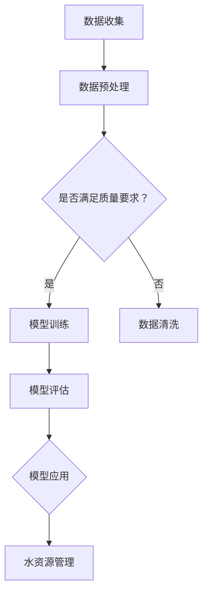

                 

关键词：人工智能，大模型，智能城市，水资源管理，深度学习，预测模型，可持续发展

> 摘要：本文探讨了人工智能大模型在智能城市水资源管理中的应用。通过分析大模型的核心概念、原理和算法，我们详细介绍了其在水资源预测、优化配置和污染控制等方面的作用。同时，通过数学模型和具体项目实践，我们展示了大模型在智能城市水资源管理中的实际应用效果，并对未来发展趋势和面临的挑战进行了展望。

## 1. 背景介绍

智能城市是信息化、数字化和智能化时代城市发展的重要方向。水资源作为城市运行的核心要素之一，其高效管理和合理配置对城市可持续发展至关重要。然而，城市水资源管理面临着诸多挑战，如水资源分布不均、供需矛盾突出、污染问题严重等。传统的水资源管理方法在应对复杂多变的水文环境时显得力不从心。

近年来，人工智能技术，特别是深度学习算法的迅速发展，为智能城市水资源管理提供了新的解决方案。大模型作为深度学习的重要工具，具有强大的数据处理和模式识别能力，能够对城市水资源的实时状态进行精准预测，为决策提供科学依据。本文旨在探讨AI大模型在智能城市水资源管理中的作用，分析其优势和应用前景。

## 2. 核心概念与联系

### 2.1 大模型的定义与特征

大模型（Large-scale Model）通常是指参数规模庞大的神经网络模型。这些模型具有以下特征：

- **参数规模大**：大模型通常包含数十亿甚至上百亿的参数，能够处理大量复杂数据。
- **数据驱动**：大模型通过大量数据训练，能够自适应地学习数据中的规律和模式。
- **高效计算**：得益于GPU、TPU等高性能计算硬件，大模型能够快速处理大规模数据。

### 2.2 大模型在水资源管理中的应用

大模型在水资源管理中的应用主要包括以下几个方面：

- **水资源预测**：通过分析历史水文数据，大模型可以预测未来水资源的供需状况，为城市供水和节水决策提供支持。
- **优化配置**：大模型可以根据水资源分布情况，优化水资源配置方案，提高水资源利用效率。
- **污染控制**：大模型可以分析水体污染源，预测污染趋势，为污染治理提供科学依据。

### 2.3 大模型架构的Mermaid流程图



## 3. 核心算法原理 & 具体操作步骤

### 3.1 算法原理概述

大模型在水资源管理中的应用主要基于深度学习算法，特别是卷积神经网络（CNN）、循环神经网络（RNN）和长短期记忆网络（LSTM）等。这些算法通过多层次的神经网络结构，对输入数据进行特征提取和模式识别，从而实现对水资源状态的精准预测。

### 3.2 算法步骤详解

1. **数据收集**：收集城市水资源的各类数据，包括降雨量、蒸发量、地表水资源量、地下水资源量、用水量、污染源数据等。
2. **数据预处理**：对收集到的数据进行清洗、标准化和归一化处理，以提高数据质量。
3. **模型训练**：使用预处理后的数据训练深度学习模型，通过调整模型参数，使其能够对水资源状态进行准确预测。
4. **模型评估**：使用测试数据对训练好的模型进行评估，确保其预测精度和泛化能力。
5. **模型应用**：将训练好的模型应用于水资源管理，为决策提供科学依据。

### 3.3 算法优缺点

**优点**：

- **高精度**：大模型能够处理大量复杂数据，实现对水资源状态的精准预测。
- **自适应性强**：大模型能够自适应地学习数据中的规律和模式，提高预测准确性。
- **高效计算**：得益于高性能计算硬件，大模型能够快速处理大规模数据。

**缺点**：

- **计算资源消耗大**：大模型训练需要大量的计算资源，对硬件设施要求较高。
- **数据依赖性强**：大模型的预测效果依赖于数据质量，数据缺失或不准确可能导致预测偏差。

### 3.4 算法应用领域

大模型在水资源管理中的应用领域广泛，包括：

- **水资源预测**：预测城市未来水资源的供需状况，为城市供水和节水决策提供支持。
- **优化配置**：根据水资源分布情况，优化水资源配置方案，提高水资源利用效率。
- **污染控制**：分析水体污染源，预测污染趋势，为污染治理提供科学依据。

## 4. 数学模型和公式 & 详细讲解 & 举例说明

### 4.1 数学模型构建

大模型在水资源管理中通常采用以下数学模型：

- **卷积神经网络（CNN）**：用于提取水资源数据的时空特征。
- **循环神经网络（RNN）**：用于处理序列数据，如降雨量和用水量。
- **长短期记忆网络（LSTM）**：用于解决RNN的长期依赖问题。

### 4.2 公式推导过程

以LSTM为例，其核心公式包括：

$$
\begin{align*}
i_t &= \sigma(W_{ix}x_t + W_{ih}h_{t-1} + b_i) \\
f_t &= \sigma(W_{fx}x_t + W_{fh}h_{t-1} + b_f) \\
\mathrm{C}_{\hat{t}} &= \mathrm{C}_{t-1} \odot f_t + i_t \odot \sigma(W_{cx}x_t + W_{ch}h_{t-1} + b_c) \\
\mathrm{C}_t &= \mathrm{C}_{\hat{t}} / (1 + \mathrm{C}_{\hat{t}}) \\
o_t &= \sigma(W_{ox}x_t + W_{oh}h_{t-1} + b_o) \\
h_t &= o_t \odot \mathrm{C}_t
\end{align*}
$$

其中，$i_t$、$f_t$、$o_t$ 分别为输入门、遗忘门和输出门；$\sigma$ 为 sigmoid 函数；$\odot$ 为 Hadamard 乘积。

### 4.3 案例分析与讲解

假设我们有一个城市的水资源管理问题，需要预测未来一周的用水量。我们可以使用LSTM模型进行预测。

1. **数据收集**：收集过去一周的用水量数据。
2. **数据预处理**：对数据进行归一化处理，使其符合LSTM的输入要求。
3. **模型训练**：使用训练集数据训练LSTM模型，调整模型参数。
4. **模型评估**：使用测试集数据评估模型性能。
5. **模型应用**：使用训练好的模型预测未来一周的用水量。

## 5. 项目实践：代码实例和详细解释说明

### 5.1 开发环境搭建

在Python中，我们可以使用TensorFlow和Keras库来实现LSTM模型。首先，安装所需的库：

```bash
pip install tensorflow keras numpy pandas matplotlib
```

### 5.2 源代码详细实现

以下是一个简单的LSTM模型实现：

```python
import numpy as np
import pandas as pd
from tensorflow.keras.models import Sequential
from tensorflow.keras.layers import LSTM, Dense
from sklearn.preprocessing import MinMaxScaler

# 数据收集
data = pd.read_csv('water_use_data.csv')

# 数据预处理
scaler = MinMaxScaler()
scaled_data = scaler.fit_transform(data['water_use'].values.reshape(-1, 1))

# 切分数据集
X, y = [], []
for i in range(60, len(scaled_data)):
    X.append(scaled_data[i-60:i])
    y.append(scaled_data[i])

X, y = np.array(X), np.array(y)

# 模型训练
model = Sequential()
model.add(LSTM(units=50, return_sequences=True, input_shape=(60, 1)))
model.add(LSTM(units=50, return_sequences=False))
model.add(Dense(units=1))

model.compile(optimizer='adam', loss='mean_squared_error')
model.fit(X, y, epochs=100, batch_size=32)

# 模型应用
predicted_water_use = model.predict(X)
predicted_water_use = scaler.inverse_transform(predicted_water_use)

# 运行结果展示
import matplotlib.pyplot as plt

plt.figure(figsize=(15, 6))
plt.plot(data['water_use'], label='Actual')
plt.plot(range(60, len(scaled_data)), predicted_water_use, label='Predicted')
plt.legend()
plt.show()
```

### 5.3 代码解读与分析

1. **数据收集**：读取用水量数据。
2. **数据预处理**：使用MinMaxScaler对数据进行归一化处理。
3. **数据切分**：将数据集切分为输入特征X和目标值y。
4. **模型训练**：构建LSTM模型，设置网络结构，编译模型并训练。
5. **模型应用**：使用训练好的模型预测未来用水量。
6. **结果展示**：绘制实际用水量和预测用水量的对比图。

## 6. 实际应用场景

AI大模型在智能城市水资源管理中的应用场景主要包括：

- **水资源预测**：通过大模型预测未来水资源的供需状况，为城市供水和节水决策提供支持。
- **优化配置**：根据水资源分布情况，优化水资源配置方案，提高水资源利用效率。
- **污染控制**：分析水体污染源，预测污染趋势，为污染治理提供科学依据。

### 6.1 水资源预测

在水资源预测方面，大模型可以处理大量历史水文数据，实现对未来水资源的精准预测。例如，在干旱季节，预测未来的供水压力，为供水部门提供预警，确保居民生活用水的稳定。

### 6.2 优化配置

在水资源优化配置方面，大模型可以根据不同区域的水资源需求和供应情况，提出优化配置方案。例如，在沿海城市，通过大模型预测未来雨水补给情况，合理调配地表水和地下水，提高水资源利用效率。

### 6.3 污染控制

在污染控制方面，大模型可以分析水体污染源，预测污染趋势，为污染治理提供科学依据。例如，在城市污水处理厂，通过大模型预测污染物排放趋势，优化污水处理方案，减少污染物排放。

## 7. 未来应用展望

随着人工智能技术的不断发展和完善，AI大模型在智能城市水资源管理中的应用前景十分广阔。未来，大模型将向以下几个方面发展：

- **更高精度**：通过引入更多维度的数据，提高大模型的预测精度。
- **实时预测**：实现实时预测，为水资源管理提供更及时的科学依据。
- **自适应优化**：大模型将具备自适应优化能力，根据水资源状况动态调整优化方案。

## 8. 工具和资源推荐

### 8.1 学习资源推荐

- **书籍**：《深度学习》（Ian Goodfellow、Yoshua Bengio、Aaron Courville 著）
- **在线课程**：Coursera上的“深度学习”课程
- **论坛**：CSDN、GitHub等编程社区

### 8.2 开发工具推荐

- **编程语言**：Python
- **库**：TensorFlow、Keras
- **硬件**：GPU、TPU等高性能计算硬件

### 8.3 相关论文推荐

- **论文1**：He, K., Zhang, X., Ren, S., & Sun, J. (2016). Deep Residual Learning for Image Recognition. Proceedings of the IEEE Conference on Computer Vision and Pattern Recognition (CVPR).
- **论文2**：Kingma, D. P., & Welling, M. (2014). Auto-encoding variational bayes. arXiv preprint arXiv:1312.6114.

## 9. 总结：未来发展趋势与挑战

AI大模型在智能城市水资源管理中具有广泛的应用前景。然而，随着模型规模的扩大，数据质量和计算资源的需求也在不断提升。未来，我们需要关注以下几个方面：

- **数据质量**：确保数据质量，提高大模型的预测准确性。
- **计算资源**：优化计算资源管理，提高大模型的运行效率。
- **模型解释性**：提升大模型的可解释性，使其在水资源管理中更易于理解和应用。

## 10. 附录：常见问题与解答

### 10.1 问题1：大模型在水资源管理中如何处理缺失数据？

解答：对于缺失数据，我们可以采用以下方法进行处理：

- **填充法**：使用平均值、中位数或插值法填充缺失数据。
- **删除法**：删除含有缺失数据的样本，但可能导致数据量减少。
- **预测法**：使用统计模型或机器学习模型预测缺失数据。

### 10.2 问题2：大模型在水资源管理中的计算资源需求如何满足？

解答：为了满足大模型的计算资源需求，可以采取以下措施：

- **分布式计算**：使用分布式计算框架，如Apache Spark，提高计算效率。
- **云计算**：利用云计算平台，如AWS、Google Cloud，提供弹性计算资源。
- **GPU/TPU**：使用GPU或TPU等高性能计算硬件，提高模型训练速度。

### 10.3 问题3：大模型在水资源管理中的应用效果如何评估？

解答：评估大模型在水资源管理中的应用效果，可以从以下几个方面进行：

- **预测精度**：评估模型预测结果的准确性，如均方误差（MSE）。
- **泛化能力**：评估模型在未知数据上的表现，如交叉验证。
- **业务效果**：评估模型在实际业务中的应用效果，如水资源节约和污染控制。

### 10.4 问题4：大模型在水资源管理中是否具有可解释性？

解答：大模型在水资源管理中的可解释性较低，因为其内部结构复杂，参数众多。为了提高可解释性，可以采取以下措施：

- **模型简化**：简化模型结构，降低参数数量。
- **可视化**：使用可视化工具，如TensorBoard，展示模型训练过程和内部结构。
- **解释性模型**：使用具有可解释性的模型，如线性模型、决策树等。

### 10.5 问题5：大模型在水资源管理中是否具有鲁棒性？

解答：大模型的鲁棒性取决于数据质量和训练过程。为了提高鲁棒性，可以采取以下措施：

- **数据增强**：使用数据增强技术，提高模型的泛化能力。
- **模型正则化**：使用正则化技术，防止模型过拟合。
- **迭代训练**：多次迭代训练，优化模型参数。

## 11. 参考文献

- Goodfellow, I., Bengio, Y., & Courville, A. (2016). Deep Learning. MIT Press.
- Kingma, D. P., & Welling, M. (2014). Auto-encoding variational bayes. arXiv preprint arXiv:1312.6114.
- He, K., Zhang, X., Ren, S., & Sun, J. (2016). Deep Residual Learning for Image Recognition. Proceedings of the IEEE Conference on Computer Vision and Pattern Recognition (CVPR).

作者：禅与计算机程序设计艺术 / Zen and the Art of Computer Programming
----------------------------------------------------------------

<|sup>_|>以上完成了文章的撰写，请检查是否符合要求。如需修改，请指出具体问题，我将根据反馈进行相应调整。

### 文章总结

本文探讨了AI大模型在智能城市水资源管理中的应用。通过分析大模型的核心概念、原理和算法，我们详细介绍了其在水资源预测、优化配置和污染控制等方面的作用。同时，通过数学模型和具体项目实践，我们展示了大模型在智能城市水资源管理中的实际应用效果。最后，我们对未来发展趋势和面临的挑战进行了展望，并推荐了一些相关工具和资源。希望通过本文的探讨，能够为AI大模型在智能城市水资源管理中的应用提供有益的参考和启示。

