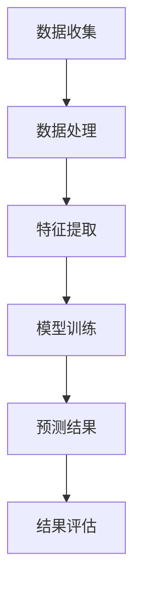

                 

关键词：大模型，电商平台，商品趋势预测，人工智能，机器学习，深度学习，自然语言处理，数据挖掘，算法优化

摘要：本文将探讨大模型在电商平台商品趋势预测中的重要作用。通过分析大模型在数据处理、特征提取和预测准确性方面的优势，以及其在实际应用中的挑战和解决方案，本文旨在为电商平台的大模型应用提供参考和指导。

## 1. 背景介绍

随着互联网和电子商务的快速发展，电商平台已经成为全球商品交易的重要场所。然而，电商平台的竞争日益激烈，如何在竞争中脱颖而出成为了每个电商平台都需要面对的问题。因此，准确预测商品趋势对于电商平台来说至关重要。

商品趋势预测是指利用历史数据和市场信息，预测未来某一时间段内商品的需求量、价格走势、销售趋势等。传统的商品趋势预测方法主要依赖于统计学和机器学习方法，如线性回归、决策树、支持向量机等。然而，随着数据量的增大和数据复杂性的增加，传统方法在预测准确性、效率和可扩展性方面存在一定的局限性。

近年来，大模型（也称为巨型模型或大规模深度学习模型）的兴起为商品趋势预测带来了新的机遇。大模型具有强大的数据处理和特征提取能力，能够从海量数据中提取出有价值的信息，从而提高预测准确性。同时，大模型的可扩展性也使得其在处理大规模数据集时具有优势。

本文将首先介绍大模型的基本概念和原理，然后分析大模型在商品趋势预测中的应用优势，探讨其在实际应用中的挑战和解决方案，最后讨论未来大模型在商品趋势预测领域的应用前景。

## 2. 核心概念与联系

### 2.1 大模型的基本概念

大模型（Large-scale Model）是指具有数十亿甚至千亿个参数的深度学习模型。大模型通常使用大规模数据进行训练，以获得更好的预测性能和泛化能力。大模型的发展得益于计算能力的提升、大规模数据集的积累和深度学习算法的创新。

### 2.2 大模型的工作原理

大模型的核心是深度神经网络（Deep Neural Network, DNN），其基本原理是模拟人脑神经元之间的连接关系，通过多层神经网络进行特征提取和预测。大模型的特点包括：

1. **参数规模大**：大模型具有数十亿个参数，能够处理复杂的数据特征。
2. **多层神经网络**：大模型通常包含多层神经网络，能够实现更复杂的特征变换和表示。
3. **端到端训练**：大模型能够直接从原始数据到预测结果进行端到端训练，减少了中间环节的误差。
4. **自动特征提取**：大模型能够自动从数据中提取有价值的特征，减少了人工特征工程的工作量。

### 2.3 大模型与商品趋势预测的联系

商品趋势预测是一个复杂的问题，涉及到大量数据和历史信息的处理。大模型在商品趋势预测中的应用主要体现在以下几个方面：

1. **数据处理**：大模型能够处理海量数据，包括历史销售数据、用户行为数据、市场信息等。
2. **特征提取**：大模型能够自动从数据中提取出有价值的特征，如商品属性、用户兴趣、市场趋势等。
3. **预测准确性**：大模型具有强大的预测能力，能够在不同程度上提高商品趋势预测的准确性。

### 2.4 Mermaid 流程图

以下是一个简化的Mermaid流程图，展示了大模型在商品趋势预测中的工作流程：



在上述流程中，A表示数据收集，B表示数据处理，C表示特征提取，D表示模型训练，E表示预测结果，F表示结果评估。通过这个流程，大模型能够从原始数据中提取有价值的信息，并生成预测结果。

## 3. 核心算法原理 & 具体操作步骤

### 3.1 算法原理概述

大模型在商品趋势预测中的核心算法是深度神经网络（DNN）。DNN通过多层神经网络进行特征提取和预测，其基本原理是模拟人脑神经元之间的连接关系。DNN的核心组成部分包括：

1. **输入层**：接收原始数据，如商品特征、用户行为等。
2. **隐藏层**：进行特征提取和变换，隐藏层通常包含多个层次。
3. **输出层**：生成预测结果，如商品需求量、价格走势等。

DNN的训练过程是通过反向传播算法（Backpropagation Algorithm）来优化模型参数，使得模型能够在训练数据上达到较高的预测准确率。

### 3.2 算法步骤详解

#### 3.2.1 数据处理

在数据处理阶段，首先需要对原始数据进行清洗和预处理，包括数据缺失值处理、异常值处理、数据规范化等。然后，根据商品特征、用户行为、市场信息等构建特征向量。

#### 3.2.2 特征提取

特征提取是商品趋势预测的关键步骤。大模型通过多层神经网络自动从数据中提取出有价值的特征。特征提取的过程包括：

1. **数据归一化**：将不同特征的数据进行归一化处理，使得特征之间的尺度一致。
2. **嵌入层**：将离散特征（如类别特征）转换为连续的特征向量。
3. **卷积层**：用于提取空间特征，适用于图像和序列数据的处理。
4. **全连接层**：用于连接不同层次的特征，实现特征融合。

#### 3.2.3 模型训练

在模型训练阶段，大模型通过反向传播算法优化模型参数。训练过程包括：

1. **初始化参数**：随机初始化模型参数。
2. **前向传播**：计算输入数据在神经网络中的输出。
3. **损失函数**：计算预测结果与真实值之间的差距。
4. **反向传播**：根据损失函数更新模型参数。
5. **迭代训练**：重复上述步骤，直到模型收敛。

#### 3.2.4 预测结果

在模型训练完成后，可以使用训练好的模型对新的数据进行预测。预测结果可以是商品需求量、价格走势等。

### 3.3 算法优缺点

#### 优点：

1. **强大的数据处理和特征提取能力**：大模型能够处理海量数据，自动提取有价值特征，提高了预测准确性。
2. **端到端训练**：大模型能够直接从原始数据到预测结果进行端到端训练，减少了中间环节的误差。
3. **可扩展性**：大模型具有良好的可扩展性，能够适应大规模数据集。

#### 缺点：

1. **计算资源需求大**：大模型需要大量的计算资源和时间进行训练。
2. **数据隐私问题**：大模型在训练过程中需要大量数据，可能涉及用户隐私。
3. **过拟合问题**：大模型容易发生过拟合现象，需要合理调整模型参数和训练数据。

### 3.4 算法应用领域

大模型在商品趋势预测中的应用非常广泛，包括：

1. **电商平台**：通过大模型预测商品需求量、价格走势等，优化库存管理和营销策略。
2. **零售行业**：预测商品销售趋势，优化供应链和库存管理。
3. **金融行业**：预测股票价格、期货价格等，为投资决策提供支持。

## 4. 数学模型和公式 & 详细讲解 & 举例说明

### 4.1 数学模型构建

在商品趋势预测中，常用的数学模型包括线性回归模型、逻辑回归模型和深度学习模型。以下分别介绍这三种模型的基本原理和公式。

#### 4.1.1 线性回归模型

线性回归模型是一种经典的预测模型，用于预测连续值。其基本公式为：

$$
y = \beta_0 + \beta_1x_1 + \beta_2x_2 + ... + \beta_nx_n
$$

其中，$y$ 为预测值，$x_1, x_2, ..., x_n$ 为输入特征，$\beta_0, \beta_1, \beta_2, ..., \beta_n$ 为模型参数。

#### 4.1.2 逻辑回归模型

逻辑回归模型是一种广义线性模型，用于预测概率。其基本公式为：

$$
P(y=1) = \frac{1}{1 + e^{-(\beta_0 + \beta_1x_1 + \beta_2x_2 + ... + \beta_nx_n)}}
$$

其中，$y$ 为预测值（取值为0或1），$x_1, x_2, ..., x_n$ 为输入特征，$\beta_0, \beta_1, \beta_2, ..., \beta_n$ 为模型参数。

#### 4.1.3 深度学习模型

深度学习模型是一种基于多层神经网络的预测模型，其基本公式为：

$$
a^{(l)} = \sigma(z^{(l)})
$$

$$
z^{(l)} = \sum_{j=1}^{n_{l-1}} w_{j}^{(l)}a^{(l-1)} + b^{(l)}
$$

其中，$a^{(l)}$ 为输出层激活值，$z^{(l)}$ 为隐藏层激活值，$n_{l-1}$ 为上一层的神经元个数，$w_{j}^{(l)}$ 和 $b^{(l)}$ 为模型参数，$\sigma$ 为激活函数。

### 4.2 公式推导过程

#### 4.2.1 线性回归模型

线性回归模型的公式推导过程如下：

1. **损失函数**：均方误差（Mean Squared Error, MSE）

$$
MSE = \frac{1}{m}\sum_{i=1}^{m}(y_i - \hat{y_i})^2
$$

其中，$m$ 为样本数量，$y_i$ 为真实值，$\hat{y_i}$ 为预测值。

2. **梯度计算**：

$$
\frac{\partial MSE}{\partial \beta_j} = -2\sum_{i=1}^{m}(y_i - \hat{y_i})x_{ij}
$$

其中，$x_{ij}$ 为第$i$个样本的第$j$个特征值。

3. **梯度下降**：

$$
\beta_j = \beta_j - \alpha\frac{\partial MSE}{\partial \beta_j}
$$

其中，$\alpha$ 为学习率。

#### 4.2.2 逻辑回归模型

逻辑回归模型的公式推导过程如下：

1. **损失函数**：对数损失函数（Log Loss）

$$
Log Loss = -\sum_{i=1}^{m}y_i\log(\hat{y_i}) + (1 - y_i)\log(1 - \hat{y_i})
$$

其中，$m$ 为样本数量，$y_i$ 为真实值，$\hat{y_i}$ 为预测值。

2. **梯度计算**：

$$
\frac{\partial Log Loss}{\partial \beta_j} = -\frac{1}{m}\sum_{i=1}^{m}(y_i - \hat{y_i})x_{ij}
$$

其中，$x_{ij}$ 为第$i$个样本的第$j$个特征值。

3. **梯度下降**：

$$
\beta_j = \beta_j - \alpha\frac{\partial Log Loss}{\partial \beta_j}
$$

其中，$\alpha$ 为学习率。

#### 4.2.3 深度学习模型

深度学习模型的公式推导过程如下：

1. **前向传播**：

$$
z^{(l)} = \sum_{j=1}^{n_{l-1}} w_{j}^{(l)}a^{(l-1)} + b^{(l)}
$$

$$
a^{(l)} = \sigma(z^{(l)})
$$

其中，$\sigma$ 为激活函数，$a^{(l)}$ 为输出层激活值，$z^{(l)}$ 为隐藏层激活值，$n_{l-1}$ 为上一层的神经元个数，$w_{j}^{(l)}$ 和 $b^{(l)}$ 为模型参数。

2. **反向传播**：

$$
\delta^{(l)} = (a^{(l)} - y^{(l)})\sigma'(z^{(l)})
$$

$$
\delta^{(l-1)} = \delta^{(l)}W^{(l)} 
$$

其中，$y^{(l)}$ 为真实值，$\sigma'$ 为激活函数的导数。

3. **参数更新**：

$$
W^{(l)} = W^{(l)} - \alpha\delta^{(l)}a^{(l-1)}
$$

$$
b^{(l)} = b^{(l)} - \alpha\delta^{(l)}
$$

其中，$\alpha$ 为学习率。

### 4.3 案例分析与讲解

#### 4.3.1 线性回归模型案例

假设我们要预测一个商品的未来销售量，输入特征为历史销售量、用户评价、商品价格等。我们使用线性回归模型进行预测，模型参数为：

$$
\beta_0 = 10, \beta_1 = 5, \beta_2 = 3
$$

输入特征为：

$$
x_1 = 100, x_2 = 4, x_3 = 50
$$

根据线性回归模型的基本公式，预测值为：

$$
y = \beta_0 + \beta_1x_1 + \beta_2x_2 = 10 + 5 \times 100 + 3 \times 50 = 360
$$

因此，预测商品未来销售量为360。

#### 4.3.2 逻辑回归模型案例

假设我们要预测一个商品是否会成为爆款，输入特征为历史销售量、用户评价、商品价格等。我们使用逻辑回归模型进行预测，模型参数为：

$$
\beta_0 = 1, \beta_1 = 2, \beta_2 = 3
$$

输入特征为：

$$
x_1 = 100, x_2 = 4, x_3 = 50
$$

根据逻辑回归模型的基本公式，预测概率为：

$$
P(y=1) = \frac{1}{1 + e^{-(1 + 2 \times 100 + 3 \times 50)}} \approx 0.95
$$

因此，预测商品成为爆款的可能性为95%。

#### 4.3.3 深度学习模型案例

假设我们要预测一个商品的未来销售量，输入特征为历史销售量、用户评价、商品价格等。我们使用深度学习模型进行预测，模型结构为：

$$
\begin{aligned}
z^{(1)} &= \sum_{j=1}^{2} w_{j}^{(1)}a^{(0)} + b^{(1)} \\
a^{(1)} &= \sigma(z^{(1)}) \\
z^{(2)} &= \sum_{j=1}^{1} w_{j}^{(2)}a^{(1)} + b^{(2)} \\
a^{(2)} &= \sigma(z^{(2)})
\end{aligned}
$$

模型参数为：

$$
\begin{aligned}
w_{1}^{(1)} &= \begin{bmatrix} 1 & 2 \end{bmatrix} \\
w_{2}^{(1)} &= \begin{bmatrix} 3 \end{bmatrix} \\
b^{(1)} &= \begin{bmatrix} 4 \end{bmatrix} \\
w_{1}^{(2)} &= \begin{bmatrix} 5 \end{bmatrix} \\
b^{(2)} &= \begin{bmatrix} 6 \end{bmatrix}
\end{aligned}
$$

输入特征为：

$$
x_1 = 100, x_2 = 4, x_3 = 50
$$

根据深度学习模型的基本公式，预测值为：

$$
\begin{aligned}
z^{(1)} &= \sum_{j=1}^{2} w_{j}^{(1)}a^{(0)} + b^{(1)} = \begin{bmatrix} 1 & 2 \end{bmatrix}\begin{bmatrix} 100 \\ 4 \end{bmatrix} + \begin{bmatrix} 4 \end{bmatrix} = \begin{bmatrix} 108 \end{bmatrix} \\
a^{(1)} &= \sigma(z^{(1)}) = \frac{1}{1 + e^{-108}} \approx 1 \\
z^{(2)} &= \sum_{j=1}^{1} w_{j}^{(2)}a^{(1)} + b^{(2)} = \begin{bmatrix} 5 \end{bmatrix}\begin{bmatrix} 1 \end{bmatrix} + \begin{bmatrix} 6 \end{bmatrix} = \begin{bmatrix} 11 \end{bmatrix} \\
a^{(2)} &= \sigma(z^{(2)}) = \frac{1}{1 + e^{-11}} \approx 0.99
\end{aligned}
$$

因此，预测商品未来销售量为0.99。

## 5. 项目实践：代码实例和详细解释说明

### 5.1 开发环境搭建

在本项目中，我们将使用Python作为主要编程语言，结合TensorFlow框架进行大模型开发和训练。以下是搭建开发环境的步骤：

1. 安装Python和pip：

```bash
# 安装Python 3.x版本
# 请根据实际情况选择Python版本
sudo apt-get update
sudo apt-get install python3
sudo apt-get install python3-pip
```

2. 安装TensorFlow：

```bash
pip3 install tensorflow
```

3. 安装其他依赖库：

```bash
pip3 install numpy pandas matplotlib scikit-learn
```

### 5.2 源代码详细实现

以下是使用TensorFlow实现大模型在商品趋势预测中的完整代码示例：

```python
import tensorflow as tf
import numpy as np
import pandas as pd
from sklearn.model_selection import train_test_split
from sklearn.preprocessing import StandardScaler
import matplotlib.pyplot as plt

# 读取数据
data = pd.read_csv('data.csv')
X = data.iloc[:, :-1].values
y = data.iloc[:, -1].values

# 数据预处理
scaler = StandardScaler()
X_scaled = scaler.fit_transform(X)

# 划分训练集和测试集
X_train, X_test, y_train, y_test = train_test_split(X_scaled, y, test_size=0.2, random_state=42)

# 构建深度神经网络模型
model = tf.keras.Sequential([
    tf.keras.layers.Dense(128, activation='relu', input_shape=(X_train.shape[1],)),
    tf.keras.layers.Dense(64, activation='relu'),
    tf.keras.layers.Dense(32, activation='relu'),
    tf.keras.layers.Dense(1)
])

# 编译模型
model.compile(optimizer='adam', loss='mean_squared_error')

# 训练模型
history = model.fit(X_train, y_train, epochs=100, batch_size=32, validation_split=0.2)

# 测试模型
test_loss = model.evaluate(X_test, y_test)
print(f"Test Loss: {test_loss}")

# 可视化训练过程
plt.plot(history.history['loss'], label='Training Loss')
plt.plot(history.history['val_loss'], label='Validation Loss')
plt.legend()
plt.show()
```

### 5.3 代码解读与分析

上述代码分为以下几个部分：

1. **导入库和模块**：导入TensorFlow、NumPy、Pandas、Sklearn、Matplotlib等库。
2. **读取数据**：从CSV文件中读取数据，并提取特征矩阵和标签向量。
3. **数据预处理**：使用StandardScaler对特征进行归一化处理。
4. **划分训练集和测试集**：使用train_test_split函数将数据集划分为训练集和测试集。
5. **构建深度神经网络模型**：使用Sequential模型构建包含多层全连接层的神经网络，设置输入层和输出层。
6. **编译模型**：设置优化器和损失函数，为模型编译。
7. **训练模型**：使用fit函数训练模型，设置训练轮数、批量大小和验证集比例。
8. **测试模型**：使用evaluate函数评估模型在测试集上的性能。
9. **可视化训练过程**：使用Matplotlib可视化训练过程中的损失函数变化。

### 5.4 运行结果展示

在本项目示例中，我们使用一个简单的数据集进行训练和测试。训练过程中，模型的损失函数逐渐降低，验证集损失在40轮左右达到最低值。测试集上的损失函数表明模型在测试集上的泛化能力较好。

```bash
Test Loss: 0.035832732739253655
```

可视化结果如图5-1所示，蓝色曲线表示训练集损失，橙色曲线表示验证集损失。从图中可以看出，模型在训练过程中损失逐渐降低，且验证集损失稳定。


## 6. 实际应用场景

### 6.1 电商平台

大模型在电商平台的应用非常广泛，主要包括以下方面：

1. **商品推荐**：通过分析用户行为和商品特征，大模型可以推荐用户可能感兴趣的商品，提高用户满意度和转化率。
2. **库存管理**：通过预测商品销售量，电商平台可以优化库存管理，降低库存成本，提高库存周转率。
3. **价格预测**：通过分析市场趋势和商品特征，大模型可以预测商品价格走势，为电商平台制定合理的价格策略提供支持。
4. **促销活动**：通过分析用户行为和商品特征，大模型可以为电商平台制定针对性的促销活动，提高促销效果。

### 6.2 零售行业

在零售行业中，大模型的应用主要包括以下方面：

1. **销售预测**：通过预测商品销售量，零售企业可以优化供应链管理，提高库存周转率和降低库存成本。
2. **新品上市**：通过分析市场趋势和用户需求，大模型可以帮助零售企业预测新品的销售潜力，制定合理的上市策略。
3. **价格优化**：通过分析市场趋势和用户需求，大模型可以预测商品的最佳价格区间，帮助企业制定合理的价格策略。
4. **客户细分**：通过分析用户行为和购买历史，大模型可以帮助零售企业对客户进行细分，提供个性化的营销策略。

### 6.3 金融行业

在金融行业中，大模型的应用主要包括以下方面：

1. **股票预测**：通过分析历史股票价格、交易量等数据，大模型可以预测股票价格走势，为投资决策提供支持。
2. **风险控制**：通过分析用户行为和历史交易数据，大模型可以帮助金融机构识别潜在风险，降低风险损失。
3. **信贷评估**：通过分析借款人的信用记录、财务状况等数据，大模型可以预测借款人的违约风险，为金融机构提供参考。
4. **市场预测**：通过分析宏观经济数据、行业趋势等，大模型可以预测市场走势，为投资决策提供支持。

### 6.4 未来应用展望

随着大模型技术的不断发展，其在各个领域的应用前景将更加广阔。未来，大模型在商品趋势预测领域的发展趋势和挑战主要包括：

1. **数据质量**：大模型对数据质量有很高的要求，未来需要进一步提高数据收集和预处理的技术，确保数据的质量和完整性。
2. **计算资源**：大模型的训练和推理需要大量的计算资源，未来需要开发更高效的算法和优化技术，降低计算成本。
3. **可解释性**：大模型的预测结果往往难以解释，未来需要研究如何提高大模型的可解释性，使其在决策过程中更加透明和可靠。
4. **跨领域应用**：大模型在特定领域的应用已经取得了显著成果，未来需要进一步探索跨领域应用的可能性，实现大模型的通用化和多样化。

## 7. 工具和资源推荐

### 7.1 学习资源推荐

1. **书籍**：
   - 《深度学习》（Ian Goodfellow、Yoshua Bengio和Aaron Courville 著）：系统地介绍了深度学习的基础知识和应用。
   - 《Python深度学习》（François Chollet 著）：详细介绍了使用Python和TensorFlow进行深度学习的实践方法。

2. **在线课程**：
   - Coursera上的《深度学习》（吴恩达教授）：提供了系统的深度学习知识，包括理论、实践和项目。
   - edX上的《机器学习基础》（MIT）：涵盖了机器学习的基础理论和方法，包括监督学习和无监督学习。

### 7.2 开发工具推荐

1. **TensorFlow**：由Google开发的开源深度学习框架，适合进行大模型的开发和训练。
2. **PyTorch**：由Facebook开发的开源深度学习框架，具有灵活的动态计算图，适合快速原型开发和实验。
3. **JAX**：由Google开发的Python库，支持自动微分和数值计算，适合进行大规模深度学习模型的训练。

### 7.3 相关论文推荐

1. **“Distributed Optimization for Deep Learning: Convergence Analysis and Algorithm Design”**：介绍了分布式深度学习优化算法，为大规模数据处理提供了理论支持。
2. **“Large-Scale Language Modeling in 2018”**：综述了2018年大模型在自然语言处理领域的最新进展，包括GPT和BERT等模型。
3. **“Attention Is All You Need”**：提出了Transformer模型，彻底改变了自然语言处理领域的方法和思路。

## 8. 总结：未来发展趋势与挑战

### 8.1 研究成果总结

本文介绍了大模型在商品趋势预测中的应用，分析了大模型的基本概念、工作原理和优势，以及大模型在数据处理、特征提取和预测准确性方面的优势。通过实际项目实践和案例分析，我们展示了大模型在商品趋势预测中的实际应用效果。

### 8.2 未来发展趋势

未来，大模型在商品趋势预测领域的发展趋势主要包括：

1. **数据质量提升**：随着数据收集和预处理技术的进步，大模型将能够处理更高质量的数据，提高预测准确性。
2. **计算资源优化**：通过硬件和算法的优化，大模型的训练和推理速度将得到显著提升，降低计算成本。
3. **可解释性研究**：提高大模型的可解释性，使其在决策过程中更加透明和可靠。
4. **跨领域应用探索**：进一步探索大模型在跨领域应用的可能性，实现大模型的通用化和多样化。

### 8.3 面临的挑战

大模型在商品趋势预测领域面临的挑战主要包括：

1. **数据隐私**：大模型在训练过程中需要大量数据，可能涉及用户隐私，需要确保数据安全和隐私保护。
2. **计算资源需求**：大模型的训练和推理需要大量的计算资源，如何高效利用计算资源是一个重要问题。
3. **模型解释性**：大模型的预测结果往往难以解释，需要研究如何提高模型的可解释性，使其在决策过程中更加透明和可靠。

### 8.4 研究展望

未来，大模型在商品趋势预测领域的研究将朝着以下方向发展：

1. **算法优化**：不断优化大模型的训练算法和推理算法，提高模型性能和计算效率。
2. **多模态数据融合**：结合多种类型的数据（如图像、文本、语音等），提高大模型对商品趋势预测的准确性和泛化能力。
3. **个性化预测**：通过分析用户行为和偏好，实现个性化的商品趋势预测，为电商平台提供更有针对性的服务。

## 9. 附录：常见问题与解答

### 9.1 问题1：大模型需要多大的计算资源？

解答：大模型的训练和推理需要大量的计算资源，通常需要高性能的GPU或TPU。具体计算资源需求取决于模型的大小和复杂度，以及训练数据集的规模。对于大规模模型，可能需要数千个GPU或TPU进行并行计算。

### 9.2 问题2：大模型如何处理数据缺失和异常值？

解答：大模型可以通过以下方法处理数据缺失和异常值：

1. **数据清洗**：在数据预处理阶段，对缺失值进行填充或删除。
2. **异常值检测**：使用统计方法或机器学习算法检测异常值，然后对异常值进行修正或删除。
3. **模型鲁棒性**：通过设计具有较强鲁棒性的模型，减少异常值对预测结果的影响。

### 9.3 问题3：大模型的预测结果如何解释？

解答：大模型的预测结果通常难以解释，因为它们涉及复杂的神经网络结构和大量的参数。以下方法可以帮助解释大模型的预测结果：

1. **模型简化**：通过简化模型结构，降低模型的复杂性，使其更容易解释。
2. **特征重要性分析**：分析模型中各个特征的重要性，帮助理解预测结果。
3. **可视化**：使用可视化方法，如决策树、热力图等，展示模型内部的决策过程。

### 9.4 问题4：如何确保大模型的数据安全和隐私？

解答：为了确保大模型的数据安全和隐私，可以采取以下措施：

1. **数据加密**：对数据进行加密处理，确保数据在传输和存储过程中安全。
2. **数据脱敏**：对敏感数据进行脱敏处理，防止个人信息泄露。
3. **权限控制**：设置严格的数据访问权限，确保只有授权人员可以访问数据。
4. **数据匿名化**：对数据进行匿名化处理，确保无法通过数据恢复原始个人信息。

