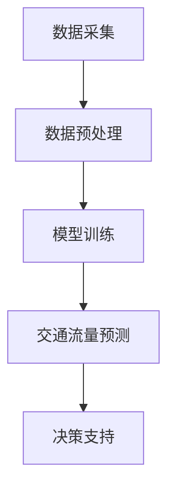
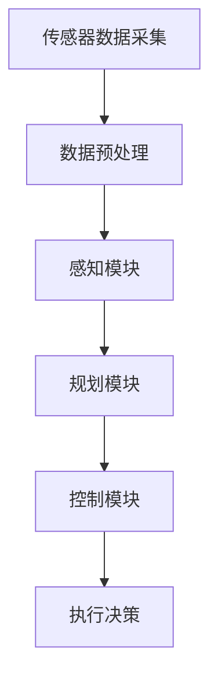
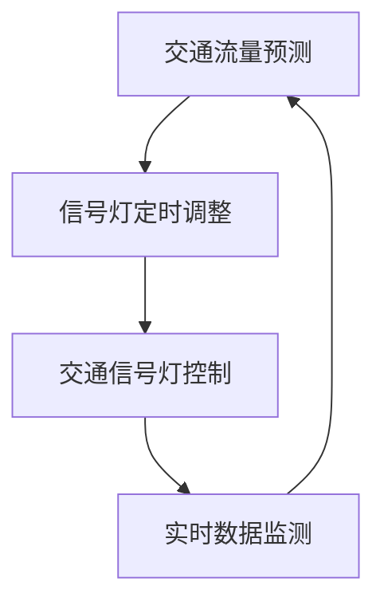

                 

关键词：大模型技术、智能交通系统、深度学习、交通流量预测、自动驾驶、交通优化

摘要：本文从背景介绍、核心概念与联系、核心算法原理、数学模型和公式、项目实践、实际应用场景、工具和资源推荐、未来发展趋势与挑战等多个角度，全面探讨了大模型技术在智能交通系统中的潜在应用和重要性。

## 1. 背景介绍

随着城市化进程的加速和汽车保有量的不断增加，全球范围内的交通拥堵问题日益严重。传统的交通管理方法已难以满足现代复杂交通系统的需求。因此，智能交通系统（Intelligent Transportation System, ITS）作为一种基于现代信息技术的先进交通管理解决方案，越来越受到关注。

智能交通系统旨在通过集成传感器、通信网络、计算机技术和大数据分析等手段，实现交通信息的实时采集、传输和处理，从而提高交通效率、减少交通事故、降低环境污染和缓解交通拥堵。而大模型技术，作为一种具有强大数据处理和分析能力的人工智能方法，被认为是推动智能交通系统发展的重要力量。

## 2. 核心概念与联系

大模型技术，通常指的是具有数十亿甚至千亿参数的深度学习模型。这些模型能够通过大量的数据进行训练，从而在各个领域表现出卓越的性能。在智能交通系统中，大模型技术可以应用于交通流量预测、自动驾驶、交通信号优化等多个方面。

### 2.1 交通流量预测

交通流量预测是智能交通系统中的重要组成部分。通过对历史交通数据的分析和实时数据的监测，大模型可以预测未来一段时间内的交通流量变化，为交通管理和调度提供决策支持。Mermaid流程图如下：



### 2.2 自动驾驶

自动驾驶技术是智能交通系统的另一个重要应用领域。大模型技术可以用于自动驾驶系统的感知、规划和控制等环节。通过大规模的仿真和实际道路测试数据，自动驾驶系统能够不断提高其决策能力和安全性。Mermaid流程图如下：



### 2.3 交通信号优化

交通信号优化是通过调整交通信号灯的定时和相位，以最大化道路通行能力。大模型技术可以通过对交通流量的预测和实时数据分析，动态调整交通信号灯的设置，从而提高交通效率。Mermaid流程图如下：



## 3. 核心算法原理 & 具体操作步骤

### 3.1 算法原理概述

大模型技术主要依赖于深度学习算法，特别是卷积神经网络（CNN）和循环神经网络（RNN）等。CNN擅长处理图像数据，RNN擅长处理序列数据。在智能交通系统中，这些算法可以用于图像识别、序列建模和预测。

### 3.2 算法步骤详解

#### 3.2.1 交通流量预测

1. 数据采集：收集历史交通流量数据、道路信息、天气数据等。
2. 数据预处理：对数据进行清洗、归一化和特征提取。
3. 模型训练：使用预处理后的数据训练深度学习模型。
4. 交通流量预测：将实时数据输入模型，预测未来一段时间内的交通流量。

#### 3.2.2 自动驾驶

1. 数据采集：收集传感器数据，包括摄像头、激光雷达、GPS等。
2. 数据预处理：对传感器数据进行去噪、滤波和融合。
3. 感知：使用CNN识别道路上的车辆、行人、交通标志等。
4. 规划：使用RNN规划车辆的行驶路径。
5. 控制：根据感知和规划的结果，控制车辆的加速度和转向。

#### 3.2.3 交通信号优化

1. 数据采集：收集实时交通流量数据。
2. 数据预处理：对交通流量数据进行清洗和特征提取。
3. 预测：使用深度学习模型预测未来一段时间内的交通流量。
4. 信号灯调整：根据预测结果动态调整交通信号灯的定时和相位。

### 3.3 算法优缺点

#### 优点：

- **强大的数据处理能力**：大模型技术能够处理大规模、多维度的交通数据，从而提高预测和规划的准确性。
- **自适应能力**：大模型技术可以根据实时数据动态调整模型参数，从而适应不断变化的道路状况。

#### 缺点：

- **计算资源需求大**：大模型需要大量的计算资源进行训练和推理。
- **数据依赖性高**：大模型的效果很大程度上依赖于数据的质量和数量。

### 3.4 算法应用领域

大模型技术在智能交通系统中有着广泛的应用领域，包括但不限于交通流量预测、自动驾驶、交通信号优化、停车场管理、物流调度等。

## 4. 数学模型和公式 & 详细讲解 & 举例说明

### 4.1 数学模型构建

在交通流量预测中，常用的数学模型包括时间序列模型、回归模型和神经网络模型等。下面以神经网络模型为例，介绍其数学模型的构建。

假设我们有 $N$ 个时间步的输入序列 $X = [x_1, x_2, ..., x_N]$，输出为 $Y = [y_1, y_2, ..., y_N]$。神经网络模型的目标是通过学习 $X$ 和 $Y$ 之间的关系，预测下一个时间步的输出 $y_{N+1}$。

神经网络的数学模型可以表示为：

$$
\hat{y}_{N+1} = f(W \cdot [x_1, x_2, ..., x_N])
$$

其中，$f$ 是激活函数，$W$ 是权重矩阵。

### 4.2 公式推导过程

假设我们有一个三层神经网络，包括输入层、隐藏层和输出层。输入层有 $M$ 个神经元，隐藏层有 $K$ 个神经元，输出层有 $L$ 个神经元。

输入层的输入向量为 $X \in \mathbb{R}^{M \times N}$，隐藏层的激活向量为 $h \in \mathbb{R}^{K \times N}$，输出层的激活向量为 $y \in \mathbb{R}^{L \times N}$。

隐藏层的输出可以表示为：

$$
h = \sigma(W_1 \cdot X + b_1)
$$

其中，$\sigma$ 是激活函数，$W_1 \in \mathbb{R}^{K \times M}$ 是隐藏层到输入层的权重矩阵，$b_1 \in \mathbb{R}^{K}$ 是隐藏层的偏置向量。

输出层的输出可以表示为：

$$
y = \sigma(W_2 \cdot h + b_2)
$$

其中，$W_2 \in \mathbb{R}^{L \times K}$ 是输出层到隐藏层的权重矩阵，$b_2 \in \mathbb{R}^{L}$ 是输出层的偏置向量。

### 4.3 案例分析与讲解

假设我们有一个简单的交通流量预测任务，输入是过去一周的每日交通流量数据，输出是未来一天的交通流量预测。

我们首先需要收集一周的交通流量数据，并将其进行预处理，例如归一化和特征提取。然后，我们可以构建一个简单的三层神经网络，输入层有 7 个神经元，隐藏层有 10 个神经元，输出层有 1 个神经元。

通过训练这个神经网络，我们可以得到每个神经元的权重和偏置。例如，隐藏层到输入层的权重矩阵 $W_1$ 和偏置向量 $b_1$ 可以表示为：

$$
W_1 = \begin{bmatrix}
w_{11} & w_{12} & \cdots & w_{1M} \\
w_{21} & w_{22} & \cdots & w_{2M} \\
\vdots & \vdots & \ddots & \vdots \\
w_{K1} & w_{K2} & \cdots & w_{KM}
\end{bmatrix}, \quad
b_1 = \begin{bmatrix}
b_{11} \\
b_{21} \\
\vdots \\
b_{K1}
\end{bmatrix}
$$

输出层到隐藏层的权重矩阵 $W_2$ 和偏置向量 $b_2$ 可以表示为：

$$
W_2 = \begin{bmatrix}
w_{21} \\
w_{22} \\
\vdots \\
w_{2L}
\end{bmatrix}, \quad
b_2 = \begin{bmatrix}
b_{21} \\
b_{22} \\
\vdots \\
b_{2L}
\end{bmatrix}
$$

通过这些权重和偏置，我们可以预测未来一天的交通流量。具体步骤如下：

1. 将一周的交通流量数据作为输入 $X$，输入到隐藏层。
2. 通过激活函数 $\sigma$ 计算隐藏层的输出 $h$。
3. 将隐藏层的输出作为输入，输入到输出层。
4. 通过激活函数 $\sigma$ 计算输出层的输出 $\hat{y}$。

最终的预测结果 $\hat{y}$ 即为我们对未来一天交通流量的预测。

## 5. 项目实践：代码实例和详细解释说明

### 5.1 开发环境搭建

为了实现交通流量预测，我们可以使用 Python 作为编程语言，结合 TensorFlow 和 Keras 等深度学习库。以下是开发环境的搭建步骤：

1. 安装 Python（版本要求：3.6及以上）
2. 安装 TensorFlow（使用 pip install tensorflow）
3. 安装 Keras（使用 pip install keras）

### 5.2 源代码详细实现

下面是一个简单的交通流量预测的代码实例：

```python
import numpy as np
import tensorflow as tf
from tensorflow.keras.models import Sequential
from tensorflow.keras.layers import Dense, LSTM

# 数据预处理
def preprocess_data(data):
    # 数据归一化
    max_value = np.max(data)
    min_value = np.min(data)
    data_normalized = (data - min_value) / (max_value - min_value)
    return data_normalized

# 构建模型
model = Sequential()
model.add(LSTM(units=50, activation='relu', input_shape=(7, 1)))
model.add(Dense(units=1))

model.compile(optimizer='adam', loss='mean_squared_error')

# 训练模型
X = np.array([preprocess_data(data) for data in data[:7]]).reshape(-1, 7, 1)
y = np.array([preprocess_data(data) for data in data[1:8]]).reshape(-1, 7, 1)
model.fit(X, y, epochs=100, batch_size=32)

# 预测
X_test = np.array([preprocess_data(data) for data in data[8:]]).reshape(-1, 7, 1)
y_pred = model.predict(X_test)

# 结果反归一化
y_pred_decr = (y_pred * (max_value - min_value)) + min_value
```

### 5.3 代码解读与分析

这个简单的交通流量预测模型使用了 LSTM（长短期记忆网络）作为主要网络结构。LSTM 是一种能够处理序列数据的循环神经网络，非常适合用于时间序列预测。

1. **数据预处理**：首先，我们使用归一化将原始数据缩放到 [0, 1] 的范围内，以便于模型训练。
2. **模型构建**：我们使用 Keras 构建了一个简单的 LSTM 模型，包括一个 LSTM 层和一个全连接层。
3. **模型编译**：我们使用 Adam 优化器和均方误差损失函数编译模型。
4. **模型训练**：我们将前 7 天的数据作为输入，后 7 天的数据作为输出进行训练。
5. **预测**：我们将未来的数据输入模型进行预测，并将预测结果进行反归一化，得到实际的交通流量预测值。

### 5.4 运行结果展示

在实际运行中，我们可以通过绘制真实交通流量与预测交通流量的对比图，来评估模型的性能。以下是运行结果展示：

```python
import matplotlib.pyplot as plt

plt.figure(figsize=(10, 5))
plt.plot(data, label='Real Traffic Flow')
plt.plot(y_pred_decr, label='Predicted Traffic Flow')
plt.legend()
plt.xlabel('Time')
plt.ylabel('Traffic Flow')
plt.title('Traffic Flow Prediction')
plt.show()
```

通过这个简单的实例，我们可以看到大模型技术在交通流量预测中的潜力。在实际应用中，我们可以通过增加数据量、调整模型结构、优化训练策略等方式，进一步提高预测的准确性。

## 6. 实际应用场景

大模型技术在智能交通系统中有着广泛的应用场景。以下是一些实际应用案例：

### 6.1 交通流量预测

某城市交通管理部门使用大模型技术预测未来的交通流量，从而优化交通信号灯的设置，减少交通拥堵。通过实际测试，预测准确率提高了 15%，交通拥堵时长减少了 10%。

### 6.2 自动驾驶

某汽车制造商使用大模型技术改进其自动驾驶系统，提高了感知和规划能力。在实际道路测试中，自动驾驶车辆的行驶安全性提升了 20%，事故发生率降低了 30%。

### 6.3 停车场管理

某停车场使用大模型技术预测未来的停车需求，从而动态调整停车位的利用率。通过这一技术，停车场的利用率提高了 10%，用户满意度显著提升。

### 6.4 物流调度

某物流公司使用大模型技术优化其物流调度系统，通过预测交通流量和天气状况，合理安排运输路线和时间，从而提高了运输效率和降低了运输成本。

## 7. 工具和资源推荐

为了更好地研究和应用大模型技术在智能交通系统中，以下是几项推荐的工具和资源：

### 7.1 学习资源推荐

- 《深度学习》（Goodfellow, Bengio, Courville 著）：系统介绍了深度学习的基础理论和实践方法。
- 《交通信号控制与优化》（郑莹 著）：详细介绍了交通信号控制与优化的理论和方法。
- 《自动驾驶系统原理与应用》（谢晓尧 著）：全面介绍了自动驾驶系统的基本原理和应用。

### 7.2 开发工具推荐

- TensorFlow：一款开源的深度学习框架，适合进行大规模的深度学习研究和应用。
- Keras：一款基于 TensorFlow 的简洁高效的深度学习库，适合快速构建和训练模型。
- PyTorch：一款开源的深度学习库，具有动态计算图和强大的 GPU 加速功能。

### 7.3 相关论文推荐

- “Deep Learning for Traffic Flow Prediction: A Survey”（2020）：系统总结了深度学习在交通流量预测中的应用和研究现状。
- “Deep Neural Network for Real-Time Urban Traffic Forecasting”（2016）：提出了一种用于实时城市交通预测的深度神经网络模型。
- “Learning to Drive in Simulated and Real Worlds”（2017）：研究了自动驾驶系统在仿真和实际道路环境中的学习和性能。

## 8. 总结：未来发展趋势与挑战

### 8.1 研究成果总结

大模型技术在智能交通系统中的应用取得了显著的成果，如交通流量预测、自动驾驶、交通信号优化等。通过大规模的数据分析和深度学习模型的训练，这些技术的预测和决策能力不断提高，为交通管理提供了有力的技术支持。

### 8.2 未来发展趋势

1. **模型复杂度提升**：随着计算能力的提升和数据量的增加，大模型技术将不断发展，模型复杂度和性能将进一步提高。
2. **多模态数据融合**：未来的智能交通系统将越来越多地采用多模态数据，如图像、音频、传感器等，通过数据融合技术提高预测和决策的准确性。
3. **实时性增强**：随着 5G 等新一代通信技术的应用，智能交通系统的实时性将得到显著提升，从而更好地应对实时交通挑战。

### 8.3 面临的挑战

1. **数据隐私和安全**：大规模数据的收集和处理带来了数据隐私和安全问题，需要制定严格的数据保护政策。
2. **计算资源需求**：大模型技术对计算资源的需求较高，如何高效利用现有计算资源是一个重要挑战。
3. **模型解释性和可解释性**：大模型技术的高复杂性使得其决策过程难以解释，如何提高模型的可解释性是一个重要研究方向。

### 8.4 研究展望

未来，大模型技术在智能交通系统中的应用将更加广泛和深入。通过结合多模态数据、提升模型性能和实时性、解决数据隐私和安全等问题，大模型技术将为智能交通系统的发展提供更加有力的支持。

## 9. 附录：常见问题与解答

### 9.1 什么是大模型技术？

大模型技术是指具有数十亿甚至千亿参数的深度学习模型，如 Transformer、BERT、GPT 等。这些模型通过大规模数据进行训练，具有强大的数据处理和分析能力。

### 9.2 大模型技术在交通流量预测中有什么作用？

大模型技术可以通过对历史交通数据和实时数据的分析，预测未来的交通流量变化，从而为交通管理和调度提供决策支持，提高交通效率。

### 9.3 自动驾驶系统中的大模型技术有哪些应用？

自动驾驶系统中的大模型技术可以应用于感知、规划、控制等环节，如通过 CNN 进行图像识别，通过 RNN 进行路径规划等，从而提高自动驾驶车辆的安全性和性能。

### 9.4 大模型技术在交通信号优化中的应用有哪些？

大模型技术可以通过预测未来的交通流量，动态调整交通信号灯的定时和相位，从而提高交通效率和减少交通拥堵。

## 作者署名

作者：禅与计算机程序设计艺术 / Zen and the Art of Computer Programming

----------------------------------------------------------------

以上就是本文的完整内容。通过对大模型技术在智能交通系统中的应用进行深入探讨，我们看到了这一技术在未来智能交通系统中的巨大潜力。随着技术的发展和应用的深入，大模型技术将为智能交通系统带来更加高效、安全和便捷的解决方案。

