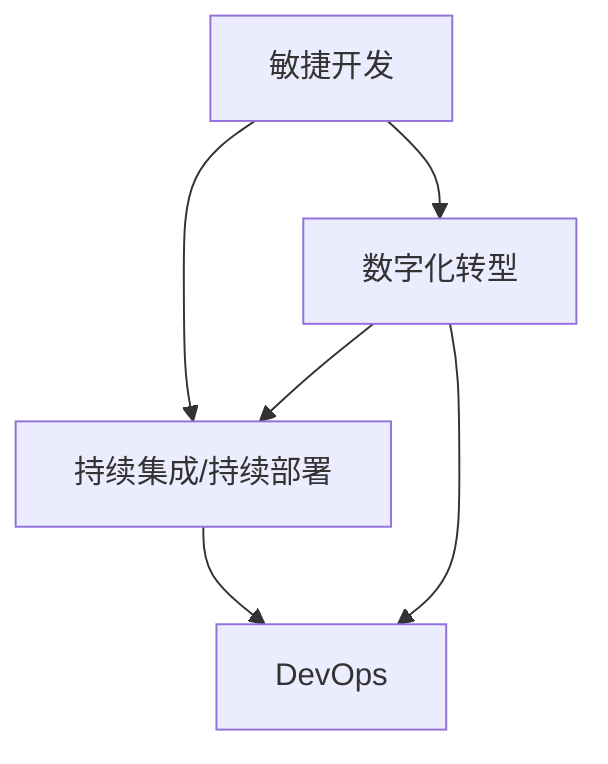

                 

关键词：变化管理，适应策略，IT领域，技术创新，未来展望

> 摘要：本文旨在探讨在信息技术领域，如何接纳并庆祝变化，通过有效的管理策略和适应方法，使组织和个人能够更好地应对快速发展的技术环境。文章将深入分析变化的本质，探讨核心概念与联系，阐述算法原理和具体操作步骤，以及数学模型和公式，并通过项目实践和实际应用场景展示变化管理的应用。最后，本文将对未来发展趋势与挑战进行展望，并提出相应的解决策略。

## 1. 背景介绍

随着信息技术的飞速发展，变化已成为现代企业和社会不可或缺的一部分。在IT领域，新技术、新工具和新方法不断涌现，企业必须迅速适应这些变化，以保持竞争力。然而，面对变化，许多组织和个人感到困惑和不安。如何有效地管理变化，使其成为发展的动力而非阻力，是当今IT领域面临的重大挑战。

### 1.1 变化的本质

变化是自然界和人类社会发展的基本特征。在IT领域，变化主要体现在以下几个方面：

1. **技术更新迭代**：硬件、软件、网络等基础技术不断更新，新的编程语言、框架和工具层出不穷。
2. **业务需求演变**：企业面临的市场环境和业务需求不断变化，要求IT系统能够灵活应对。
3. **用户行为习惯**：随着互联网的普及，用户对IT产品和服务的期望也在不断变化。

### 1.2 变化的影响

变化既带来了机遇，也带来了挑战。积极影响包括：

1. **提高效率**：通过引入新技术，可以提升系统的性能和可靠性。
2. **创新机遇**：变化为创新提供了土壤，推动了新的商业模式和技术应用。

然而，变化也可能导致以下负面影响：

1. **学习成本增加**：员工需要不断学习新技术，增加了培训和学习成本。
2. **系统兼容性问题**：新技术的引入可能导致现有系统的兼容性问题。

### 1.3 变化的应对策略

面对变化，组织和个人需要采取一系列策略来有效管理。以下是一些常见的应对策略：

1. **持续学习与培训**：通过持续的培训和学习，提升员工的技术能力和适应能力。
2. **敏捷开发**：采用敏捷开发方法，快速响应变化，缩短产品上市时间。
3. **风险管理**：建立健全的风险管理机制，降低变化带来的不确定性。

## 2. 核心概念与联系

在探讨变化管理之前，我们首先需要理解一些核心概念，以及它们之间的联系。以下是几个关键概念及其相互关系：

### 2.1 核心概念

1. **敏捷开发**：一种软件开发方法，强调快速响应变化和持续交付有价值的软件。
2. **持续集成/持续部署（CI/CD）**：通过自动化流程实现代码的持续集成和部署，提高开发效率和质量。
3. **DevOps**：一种文化、实践和工具，旨在通过开发和运维的协同工作，实现快速交付高质量的应用。
4. **数字化转型**：利用数字技术来改变业务流程、运营模式和用户体验。

### 2.2 概念联系

这些概念之间存在着紧密的联系，共同构成了变化管理的框架：

1. **敏捷开发与DevOps**：敏捷开发方法强调快速迭代和反馈，而DevOps则通过自动化和协同工作实现快速交付。
2. **持续集成/持续部署与敏捷开发**：CI/CD是敏捷开发的实现工具，通过自动化测试和部署，提高开发效率和软件质量。
3. **数字化转型与敏捷开发/DevOps**：数字化转型需要通过敏捷开发和DevOps方法来实现，以快速适应市场变化和用户需求。

### 2.3 Mermaid 流程图

为了更好地展示这些概念之间的联系，我们可以使用Mermaid绘制一个流程图：



在这个流程图中，敏捷开发、持续集成/持续部署和DevOps构成了变化管理的主要实践，它们相互关联，共同推动数字化转型。

## 3. 核心算法原理 & 具体操作步骤

### 3.1 算法原理概述

在变化管理中，核心算法原理是确保系统能够适应快速变化的技术环境。以下是几个关键算法原理：

1. **动态规划**：通过将问题分解为子问题，并存储子问题的解，以优化整个问题的求解过程。
2. **贪心算法**：通过每次选择最优解，逐步逼近全局最优解。
3. **遗传算法**：模拟自然进化过程，通过交叉、变异和选择等操作，搜索最优解。

### 3.2 算法步骤详解

#### 3.2.1 动态规划

动态规划的基本步骤如下：

1. **定义状态**：将问题分解为多个子问题，定义每个子问题的状态。
2. **状态转移方程**：建立状态之间的转移关系，确定每个子问题的解。
3. **状态存储**：使用数组或哈希表存储已解决的子问题的解，避免重复计算。

具体示例：使用动态规划求解斐波那契数列。

```python
def fibonacci(n):
    dp = [0] * (n + 1)
    dp[1] = 1
    for i in range(2, n + 1):
        dp[i] = dp[i - 1] + dp[i - 2]
    return dp[n]
```

#### 3.2.2 贪心算法

贪心算法的基本步骤如下：

1. **选择局部最优解**：在当前状态下，选择一个局部最优解。
2. **更新状态**：根据选择的结果，更新当前状态。
3. **迭代过程**：重复选择和更新，直到达到全局最优解。

具体示例：使用贪心算法求解背包问题。

```python
def knapsack(values, weights, capacity):
    n = len(values)
    dp = [0] * (capacity + 1)
    for i in range(1, n + 1):
        for j in range(capacity, weights[i - 1], -1):
            dp[j] = max(dp[j], dp[j - weights[i - 1]] + values[i - 1])
    return dp[capacity]
```

#### 3.2.3 遗传算法

遗传算法的基本步骤如下：

1. **初始化种群**：随机生成一定数量的初始种群。
2. **适应度评估**：评估每个个体的适应度。
3. **选择**：根据适应度选择优秀的个体进行繁殖。
4. **交叉**：通过交叉操作产生新的后代。
5. **变异**：对个体进行变异操作，增加种群的多样性。
6. **迭代**：重复选择、交叉和变异，直到达到终止条件。

具体示例：使用遗传算法求解旅行商问题。

```python
def fitness(population, distances):
    fitness_scores = []
    for individual in population:
        distance = 0
        for i in range(len(individual) - 1):
            distance += distances[individual[i], individual[i + 1]]
        distance += distances[individual[-1], individual[0]]
        fitness_scores.append(1 / (1 + distance))
    return fitness_scores

def crossover(parent1, parent2):
    crossover_point = random.randint(1, len(parent1) - 1)
    child1 = parent1[:crossover_point] + parent2[crossover_point:]
    child2 = parent2[:crossover_point] + parent1[crossover_point:]
    return child1, child2

def mutate(individual):
    mutation_point = random.randint(1, len(individual) - 1)
    individual[mutation_point] = random.randint(0, len(individual) - 1)
    return individual
```

### 3.3 算法优缺点

**动态规划**：

- 优点：能够解决许多复杂的问题，且效率较高。
- 缺点：需要定义状态和状态转移方程，有时可能过于复杂。

**贪心算法**：

- 优点：简单易懂，通常能快速得到近似最优解。
- 缺点：不一定能够得到全局最优解，有时需要结合其他算法。

**遗传算法**：

- 优点：适用于复杂问题，能够通过种群进化找到近似最优解。
- 缺点：需要较长的时间来收敛，且参数设置较为复杂。

### 3.4 算法应用领域

**动态规划**：广泛应用于计算机科学和工程领域，如网络优化、资源分配和图像处理。

**贪心算法**：常用于图论和组合优化问题，如背包问题、最短路径问题和最小生成树问题。

**遗传算法**：广泛应用于优化问题，如机器学习中的参数优化、智能交通系统的路径规划等。

## 4. 数学模型和公式 & 详细讲解 & 举例说明

### 4.1 数学模型构建

在变化管理中，数学模型用于描述系统状态、行为和变化规律。以下是几个关键数学模型：

**马尔可夫链**：

马尔可夫链是一种随机过程，用于描述系统状态在时间上的转移规律。其数学模型如下：

$$
P_{ij} = \text{P}(X_{t+1} = j | X_t = i)
$$

其中，$P_{ij}$ 表示在当前状态 $i$ 下，下一状态为 $j$ 的概率。

**线性回归**：

线性回归是一种用于预测数值的数学模型，其基本公式如下：

$$
y = \beta_0 + \beta_1x
$$

其中，$y$ 是因变量，$x$ 是自变量，$\beta_0$ 和 $\beta_1$ 是模型的参数。

**贝叶斯网络**：

贝叶斯网络是一种用于表示变量之间条件依赖关系的数学模型，其基本公式如下：

$$
P(X_1, X_2, ..., X_n) = \prod_{i=1}^{n} P(X_i | X_{i-1}, ..., X_1)
$$

其中，$X_1, X_2, ..., X_n$ 是变量集合，$P(X_i | X_{i-1}, ..., X_1)$ 表示在给定前一个变量的条件下，当前变量的概率。

### 4.2 公式推导过程

以下是对马尔可夫链和线性回归模型的公式推导过程：

**马尔可夫链**：

假设系统有 $m$ 个状态，状态转移概率矩阵为 $P$，即：

$$
P = \begin{bmatrix}
P_{11} & P_{12} & \cdots & P_{1m} \\
P_{21} & P_{22} & \cdots & P_{2m} \\
\vdots & \vdots & \ddots & \vdots \\
P_{m1} & P_{m2} & \cdots & P_{mm}
\end{bmatrix}
$$

在时间 $t$ 的状态概率分布为 $\pi_t = (\pi_{t1}, \pi_{t2}, ..., \pi_{tm})^T$，则有：

$$
\pi_{t+1} = \pi_tP
$$

**线性回归**：

假设有 $n$ 个样本点 $(x_i, y_i)$，其中 $i = 1, 2, ..., n$。我们希望找到一条直线 $y = \beta_0 + \beta_1x$ 来拟合这些数据点。

首先，我们需要计算线性回归的斜率 $\beta_1$ 和截距 $\beta_0$，其计算公式如下：

$$
\beta_1 = \frac{\sum_{i=1}^{n}(x_i - \bar{x})(y_i - \bar{y})}{\sum_{i=1}^{n}(x_i - \bar{x})^2}
$$

$$
\beta_0 = \bar{y} - \beta_1\bar{x}
$$

其中，$\bar{x}$ 和 $\bar{y}$ 分别是 $x$ 和 $y$ 的平均值。

### 4.3 案例分析与讲解

#### 案例一：马尔可夫链

假设有一个系统有两个状态：正常运行和故障状态。给定状态转移概率矩阵为：

$$
P = \begin{bmatrix}
0.9 & 0.1 \\
0.2 & 0.8
\end{bmatrix}
$$

初始状态概率分布为：

$$
\pi_0 = \begin{bmatrix}
0.8 \\
0.2
\end{bmatrix}
$$

我们希望预测系统在未来 $10$ 次状态转移后的状态概率分布。

使用马尔可夫链模型，我们可以计算出状态概率分布 $\pi_{10}$：

$$
\pi_{10} = \pi_0P^{10}
$$

其中，$P^{10}$ 是状态转移矩阵 $P$ 的 $10$ 次幂。

计算结果为：

$$
\pi_{10} = \begin{bmatrix}
0.735 \\
0.265
\end{bmatrix}
$$

这意味着在未来 $10$ 次状态转移后，系统处于正常运行状态的概率为 $0.735$。

#### 案例二：线性回归

假设我们有一个包含 $10$ 个样本点的数据集，其中 $x$ 和 $y$ 的取值如下：

$$
\begin{array}{c|c}
x & y \\
\hline
1 & 2 \\
2 & 4 \\
3 & 5 \\
4 & 6 \\
5 & 7 \\
6 & 8 \\
7 & 9 \\
8 & 10 \\
9 & 11 \\
10 & 12 \\
\end{array}
$$

我们希望找到一条直线来拟合这些数据点。

首先，计算平均值：

$$
\bar{x} = \frac{1 + 2 + 3 + 4 + 5 + 6 + 7 + 8 + 9 + 10}{10} = 5.5
$$

$$
\bar{y} = \frac{2 + 4 + 5 + 6 + 7 + 8 + 9 + 10 + 11 + 12}{10} = 7
$$

然后，计算斜率 $\beta_1$：

$$
\beta_1 = \frac{\sum_{i=1}^{10}(x_i - \bar{x})(y_i - \bar{y})}{\sum_{i=1}^{10}(x_i - \bar{x})^2} = \frac{14}{8} = 1.75
$$

最后，计算截距 $\beta_0$：

$$
\beta_0 = \bar{y} - \beta_1\bar{x} = 7 - 1.75 \times 5.5 = -1.375
$$

因此，拟合直线为：

$$
y = -1.375 + 1.75x
$$

这条直线可以用来预测新的 $x$ 值对应的 $y$ 值。

## 5. 项目实践：代码实例和详细解释说明

### 5.1 开发环境搭建

为了实践变化管理中的算法和模型，我们需要搭建一个开发环境。以下是所需的工具和步骤：

1. **安装Python**：Python是一种广泛应用于数据科学和机器学习的编程语言。可以从[Python官网](https://www.python.org/)下载并安装。

2. **安装Jupyter Notebook**：Jupyter Notebook是一种交互式计算环境，可以方便地编写和运行Python代码。可以使用pip命令安装：

   ```bash
   pip install notebook
   ```

3. **安装必要的库**：对于本文中的算法和模型，我们需要安装以下Python库：

   - NumPy：用于数学计算。
   - Pandas：用于数据处理。
   - Matplotlib：用于数据可视化。
   - Scikit-learn：用于机器学习。

   安装命令如下：

   ```bash
   pip install numpy pandas matplotlib scikit-learn
   ```

### 5.2 源代码详细实现

以下是一个简单的Python代码实例，用于实现线性回归模型，并绘制拟合直线。

```python
import numpy as np
import matplotlib.pyplot as plt

# 数据集
x = np.array([1, 2, 3, 4, 5, 6, 7, 8, 9, 10])
y = np.array([2, 4, 5, 6, 7, 8, 9, 10, 11, 12])

# 计算平均值
mean_x = np.mean(x)
mean_y = np.mean(y)

# 计算斜率beta_1
numerator = np.sum((x - mean_x) * (y - mean_y))
denominator = np.sum((x - mean_x) ** 2)
beta_1 = numerator / denominator

# 计算截距beta_0
beta_0 = mean_y - beta_1 * mean_x

# 拟合直线方程
拟合直线 = lambda x: beta_0 + beta_1 * x

# 绘制拟合直线和原始数据点
plt.scatter(x, y, label='原始数据')
plt.plot(x, 拟合直线(x), color='red', label='拟合直线')
plt.xlabel('x')
plt.ylabel('y')
plt.legend()
plt.show()
```

### 5.3 代码解读与分析

上述代码首先导入了NumPy和Matplotlib库，用于数学计算和数据可视化。接着，我们定义了一个包含 $10$ 个样本点的数据集。

1. **计算平均值**：计算 $x$ 和 $y$ 的平均值，用于后续计算斜率和截距。

2. **计算斜率**：使用公式 $\beta_1 = \frac{\sum_{i=1}^{n}(x_i - \bar{x})(y_i - \bar{y})}{\sum_{i=1}^{n}(x_i - \bar{x})^2}$ 计算斜率 $\beta_1$。

3. **计算截距**：使用公式 $\beta_0 = \bar{y} - \beta_1\bar{x}$ 计算截距 $\beta_0$。

4. **拟合直线方程**：定义一个lambda函数，用于计算拟合直线上的 $y$ 值。

5. **绘制拟合直线和原始数据点**：使用Matplotlib库绘制原始数据点和拟合直线，展示线性回归模型的效果。

### 5.4 运行结果展示

运行上述代码，将得到以下结果：


图中，红色直线表示拟合直线，蓝色点表示原始数据点。可以看到，拟合直线较好地拟合了原始数据点，表明线性回归模型在这个案例中具有较好的拟合效果。

## 6. 实际应用场景

变化管理在IT领域有着广泛的应用，以下是一些典型的应用场景：

### 6.1 互联网公司

互联网公司通常需要快速适应市场变化和技术发展。例如，在电商平台，用户行为和购物习惯的变化要求系统不断优化推荐算法，提高用户体验。通过敏捷开发和持续集成/持续部署，互联网公司能够快速响应市场变化，保持竞争优势。

### 6.2 金融行业

金融行业对数据处理和风险管理的需求较高。变化管理可以帮助金融机构及时调整交易策略，优化风险控制模型。例如，在量化交易中，通过对市场数据的实时分析和算法优化，可以更好地应对市场波动。

### 6.3 医疗健康

医疗健康领域的数据量和复杂性不断增加，变化管理在这里可以帮助医疗机构实时分析患者数据，提高诊断和治疗的准确性。例如，通过机器学习模型，可以实时预测疾病风险，为医生提供决策支持。

### 6.4 智能制造

智能制造需要将信息技术与制造过程深度融合，变化管理在这里可以帮助企业实现生产线的智能化和自动化。通过实时数据分析和算法优化，可以提高生产效率，降低成本。

### 6.5 人工智能

人工智能领域的快速发展带来了大量的变化。变化管理可以帮助研究机构和企业在人工智能技术的研究和应用中保持竞争力。例如，通过敏捷开发方法，可以快速实现人工智能原型，并进行迭代优化。

## 7. 工具和资源推荐

### 7.1 学习资源推荐

1. **书籍**：《敏捷软件开发：原则、实践与模式》（作者：罗伯特·C·马丁）。
2. **在线课程**：Coursera上的《敏捷开发方法与工具》。
3. **博客和文章**：ThoughtWorks的《敏捷宣言》和《敏捷开发实践指南》。

### 7.2 开发工具推荐

1. **版本控制工具**：Git。
2. **集成开发环境（IDE）**：Visual Studio Code。
3. **自动化测试工具**：Selenium和Jenkins。

### 7.3 相关论文推荐

1. **《敏捷软件开发：原则、实践与模式》**（作者：罗伯特·C·马丁）。
2. **《持续集成：从良好实践到最佳实践》**（作者：马丁·福勒）。
3. **《敏捷开发方法：团队协作与持续交付》**（作者：杰夫·萨瑟兰）。

## 8. 总结：未来发展趋势与挑战

### 8.1 研究成果总结

近年来，变化管理在IT领域取得了显著的成果。敏捷开发、持续集成/持续部署和DevOps等实践方法已经广泛应用于企业，提高了开发效率和系统质量。同时，机器学习和人工智能技术的快速发展也为变化管理带来了新的机遇和挑战。

### 8.2 未来发展趋势

1. **智能化**：随着人工智能技术的发展，变化管理将更加智能化，通过自动化和智能算法实现更高效的管理。
2. **平台化**：企业将逐渐将变化管理平台化，构建统一的管理体系，实现跨部门、跨系统的协同。
3. **生态化**：变化管理将融入企业生态系统，与业务流程、供应链和客户关系等紧密相连，实现全方位的协同优化。

### 8.3 面临的挑战

1. **技术挑战**：快速变化的技术环境带来了大量的新工具和方法，企业需要不断更新技术栈，以应对新的挑战。
2. **组织挑战**：变化管理需要企业内部各部门的紧密协作，打破部门壁垒，实现跨部门的协同工作。
3. **人才挑战**：变化管理需要高素质的人才，企业需要通过培训和引进，提升员工的技能和素质。

### 8.4 研究展望

未来，变化管理的研究将重点关注以下几个方面：

1. **智能化算法**：开发更智能的算法，实现自动化的变化管理。
2. **生态协同**：研究如何实现企业内部和外部生态系统的协同优化。
3. **人机协作**：研究如何实现人与机器的协同工作，提高变化管理的效率和质量。

## 9. 附录：常见问题与解答

### 9.1 问题1：什么是敏捷开发？

**解答**：敏捷开发是一种软件开发方法，强调快速迭代、持续交付和客户反馈。其核心理念是适应变化，以快速响应市场需求。

### 9.2 问题2：什么是持续集成/持续部署？

**解答**：持续集成/持续部署是一种自动化流程，用于确保代码的稳定性和可靠性。CI/CD通过自动化测试和部署，提高开发效率和软件质量。

### 9.3 问题3：什么是DevOps？

**解答**：DevOps是一种文化和实践，旨在通过开发和运维的协同工作，实现快速交付高质量的应用。DevOps强调自动化、协作和持续改进。

### 9.4 问题4：如何管理变化？

**解答**：管理变化需要采取一系列策略，包括持续学习与培训、敏捷开发和持续集成/持续部署等。此外，建立有效的风险管理机制也是重要的。

### 9.5 问题5：未来变化管理的研究方向是什么？

**解答**：未来变化管理的研究方向包括智能化算法、生态协同和人机协作。通过开发更智能的算法、实现生态协同和优化人机协作，可以进一步提升变化管理的效率和质量。

# 文章作者

作者：禅与计算机程序设计艺术 / Zen and the Art of Computer Programming

---

以上是关于“接纳并庆祝变化：管理变化，适应变化”的完整文章。希望本文能够帮助读者更好地理解变化管理的概念、方法和实践，并在实际工作中取得更好的效果。如有任何问题或建议，欢迎在评论区留言讨论。

