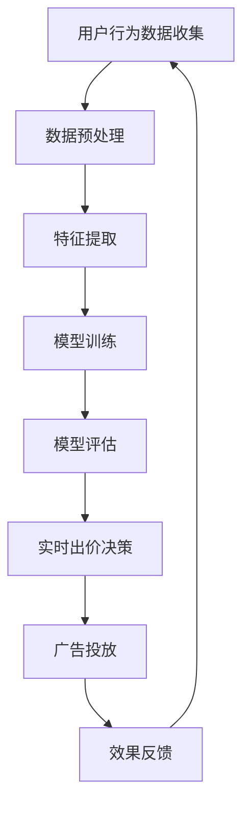

                 

关键词：推荐系统、AI大模型、实时竞价、广告投放

> 摘要：本文深入探讨了在推荐系统中使用人工智能大模型进行实时竞价广告投放的技术实现。文章首先介绍了推荐系统与实时竞价广告投放的背景和现状，随后详细阐述了AI大模型在这一领域的核心概念与联系，包括算法原理、数学模型和项目实践。最后，文章展望了该技术的未来发展趋势和面临的挑战，为读者提供了一个全面的技术指南。

## 1. 背景介绍

随着互联网和移动互联网的快速发展，信息过载问题日益严重，用户在获取信息时面临着巨大的选择困难。为了解决这一问题，推荐系统应运而生。推荐系统是一种根据用户的历史行为、偏好和上下文信息，为用户推荐个性化内容的技术。在电子商务、社交媒体、视频平台等领域，推荐系统极大地提升了用户体验和平台的商业价值。

与此同时，广告投放作为一种盈利模式，成为互联网企业重要的收入来源。传统广告投放通常采用固定价格或者CPC（每次点击成本）等方式，但这种方式难以实现精准投放，广告效果不佳。实时竞价广告（Real-Time Bidding, RTB）作为一种新兴的广告投放方式，通过自动化实时出价，实现了对广告资源的动态分配和精准投放。然而，传统的实时竞价系统大多依赖于简单的规则和模型，难以充分利用大数据和人工智能的优势。

近年来，人工智能尤其是深度学习技术的发展，为推荐系统和实时竞价广告投放带来了新的机遇。AI大模型具有强大的特征提取和预测能力，能够处理海量数据并实现实时决策。将AI大模型应用于实时竞价广告投放，不仅能够提高广告投放的精准度和效率，还能够优化广告主的投放策略，提升广告效果。

本文旨在探讨如何利用AI大模型实现实时竞价广告投放，包括核心概念、算法原理、数学模型和项目实践。通过本文的探讨，希望能够为读者提供一个深入理解和应用AI大模型进行实时竞价广告投放的指南。

## 2. 核心概念与联系

### 2.1 推荐系统

推荐系统是一种信息过滤技术，通过收集用户的历史行为和偏好，利用算法为用户推荐其可能感兴趣的内容。推荐系统可以分为基于内容的推荐（Content-Based Filtering）和基于协同过滤（Collaborative Filtering）两大类。

- **基于内容的推荐**：这种方法根据用户过去对类似内容的反馈来推荐新的内容。优点是推荐结果相关性强，但缺点是难以捕捉到用户未明确表达的新兴趣。

- **基于协同过滤**：这种方法通过分析用户之间的相似性，推荐其他用户喜欢的项目。优点是能够发现用户的潜在兴趣，但缺点是推荐结果可能不够精确。

### 2.2 实时竞价广告投放

实时竞价广告（RTB）是一种自动化广告购买模式，通过广告交易平台（Ad Exchange）实现。广告主通过设置预算和出价策略，实时竞价广告位。RTB的优势在于：

- **精准投放**：通过用户行为数据实时分析，实现高度个性化的广告投放。
- **高效投放**：自动化出价和决策，提高广告投放的效率。
- **透明化**：广告主可以实时查看广告投放效果和成本。

### 2.3 AI大模型

AI大模型，特别是基于深度学习的模型，具有以下特点：

- **强大特征提取能力**：能够从海量数据中提取有用特征，提升模型的预测能力。
- **自动学习能力**：通过大量数据自动调整模型参数，无需人工干预。
- **实时决策能力**：能够快速处理实时数据，实现实时决策。

### 2.4 Mermaid 流程图

为了更好地理解推荐系统中AI大模型实时竞价广告投放的整体流程，下面是一个简化的Mermaid流程图：



### 2.5 核心概念之间的联系

推荐系统和实时竞价广告投放的结合，可以通过AI大模型实现：

- **用户行为数据**：推荐系统通过收集用户行为数据，为实时竞价广告提供用户特征。
- **特征提取**：AI大模型对用户行为数据进行特征提取，为实时决策提供支持。
- **模型训练与评估**：通过不断训练和评估模型，优化广告投放策略和效果。
- **实时出价决策**：AI大模型基于实时数据，为广告主提供最优的出价决策。
- **效果反馈**：通过广告投放的效果反馈，进一步优化模型和策略。

## 3. 核心算法原理 & 具体操作步骤

### 3.1 算法原理概述

在推荐系统中使用AI大模型进行实时竞价广告投放的核心算法主要包括以下几个方面：

1. **用户行为数据收集**：通过用户在平台上的行为数据，如浏览历史、点击行为、购买记录等，收集用户特征。
2. **数据预处理**：对原始数据进行清洗、去噪和归一化等处理，为特征提取和模型训练做准备。
3. **特征提取**：利用深度学习模型对用户行为数据进行分析和特征提取，提取出高维度的用户特征向量。
4. **模型训练**：使用提取的用户特征向量，通过深度学习模型进行训练，构建用户行为预测模型。
5. **模型评估**：对训练好的模型进行评估，包括准确率、召回率、F1值等指标，确保模型性能。
6. **实时出价决策**：根据实时用户行为数据和广告资源情况，使用训练好的模型进行实时出价决策。
7. **广告投放**：根据实时出价决策结果，将广告推送给目标用户。
8. **效果反馈**：收集广告投放后的效果数据，用于模型优化和策略调整。

### 3.2 算法步骤详解

1. **用户行为数据收集**：

   - **数据来源**：用户在平台上的各种行为，如浏览历史、点击行为、购买记录等。
   - **数据格式**：通常使用日志文件、数据库等形式存储用户行为数据。
   - **数据预处理**：包括去重、去噪、数据类型转换等。

2. **数据预处理**：

   - **清洗**：去除无效、错误的数据，确保数据的准确性和完整性。
   - **去噪**：减少噪声数据对模型训练的影响。
   - **归一化**：将不同量纲的数据进行归一化处理，便于模型训练。

3. **特征提取**：

   - **传统方法**：如词袋模型、TF-IDF等，提取文本特征。
   - **深度学习方法**：如卷积神经网络（CNN）、循环神经网络（RNN）、自编码器（Autoencoder）等，提取高维度特征。

4. **模型训练**：

   - **选择模型**：根据业务需求和数据特点，选择合适的深度学习模型。
   - **训练数据准备**：将预处理后的数据划分成训练集、验证集和测试集。
   - **模型训练**：使用训练集进行模型训练，调整模型参数。
   - **验证和测试**：使用验证集和测试集评估模型性能，调整模型参数。

5. **模型评估**：

   - **指标选择**：如准确率、召回率、F1值等，根据业务需求和数据特点选择合适的评估指标。
   - **交叉验证**：使用交叉验证方法评估模型性能。

6. **实时出价决策**：

   - **数据预处理**：对实时用户行为数据进行预处理，提取特征。
   - **模型推理**：使用训练好的模型对实时数据进行推理，预测用户行为。
   - **出价决策**：根据模型预测结果，制定实时出价策略。

7. **广告投放**：

   - **广告资源**：获取可用的广告资源，包括广告位、广告素材等。
   - **投放策略**：根据实时出价决策结果，选择最优的广告资源进行投放。

8. **效果反馈**：

   - **效果数据收集**：收集广告投放后的效果数据，如点击率、转化率等。
   - **数据分析和优化**：分析广告投放效果，优化模型和策略。

### 3.3 算法优缺点

**优点**：

- **高精度**：利用深度学习模型进行特征提取和预测，提高广告投放的准确性。
- **实时性**：能够实时处理用户行为数据，实现实时决策和投放。
- **个性化**：根据用户特征和实时行为，实现个性化广告投放。
- **自动化**：自动化出价和投放过程，降低人力成本。

**缺点**：

- **计算复杂度**：深度学习模型训练和推理过程需要大量计算资源。
- **数据需求**：需要大量的高质量用户行为数据进行模型训练。
- **模型复杂性**：深度学习模型参数较多，调参过程复杂。
- **安全性**：用户隐私保护问题需要得到重视。

### 3.4 算法应用领域

AI大模型实时竞价广告投放技术可以广泛应用于以下领域：

- **电子商务**：根据用户浏览和购买行为，实现精准广告投放。
- **社交媒体**：根据用户兴趣和行为，推荐相关的广告内容。
- **视频平台**：根据用户观看历史和偏好，推送相关广告。
- **在线教育**：根据用户学习行为，推荐相关的课程和广告。
- **金融保险**：根据用户金融行为，推荐相关产品和服务。

## 4. 数学模型和公式 & 详细讲解 & 举例说明

在推荐系统中，AI大模型的实时竞价广告投放涉及到多个数学模型和公式。下面将详细介绍这些模型和公式的构建、推导过程以及实际应用中的例子。

### 4.1 数学模型构建

#### 4.1.1 用户行为表示模型

用户行为数据可以表示为用户-物品矩阵 \( X \)，其中行表示用户，列表示物品，元素 \( X_{ui} \) 表示用户 \( u \) 对物品 \( i \) 的行为评分（可以是浏览、点击、购买等）。用户行为表示模型的目标是预测用户对未知物品的评分。

假设我们使用因子分解机（Factorization Machines）来表示用户行为，模型可以表示为：

\[ X_{ui} = \sum_{k=1}^{K} w_{ku} v_{ki} \]

其中，\( w_{ku} \) 和 \( v_{ki} \) 分别表示用户 \( u \) 和物品 \( i \) 的因子，\( K \) 为因子个数。

#### 4.1.2 广告出价模型

广告出价模型的目标是根据用户特征和广告资源情况，确定每个广告的出价。假设我们使用线性模型来表示广告出价，模型可以表示为：

\[ P_i = \beta_0 + \beta_1 X_{ui} + \beta_2 Y_i \]

其中，\( P_i \) 表示广告 \( i \) 的出价，\( \beta_0, \beta_1, \beta_2 \) 为模型参数，\( X_{ui} \) 为用户对物品 \( i \) 的行为评分，\( Y_i \) 为广告 \( i \) 的特征向量。

#### 4.1.3 广告资源分配模型

广告资源分配模型的目标是在广告预算和广告资源有限的情况下，选择最优的广告投放策略。假设我们有 \( N \) 个广告，预算为 \( B \)，广告资源为 \( R \)，每个广告的出价为 \( P_i \)，收益为 \( R_i \)。广告资源分配模型可以表示为：

\[ \max_{x_1, x_2, ..., x_N} \sum_{i=1}^{N} R_i x_i \]

其中，\( x_i \) 表示广告 \( i \) 的投放量，满足以下约束条件：

\[ \sum_{i=1}^{N} P_i x_i \leq B \]
\[ \sum_{i=1}^{N} R_i x_i \leq R \]

### 4.2 公式推导过程

#### 4.2.1 用户行为表示模型推导

用户行为表示模型（因子分解机）的推导基于线性回归模型。假设用户对物品的评分可以表示为线性函数：

\[ X_{ui} = \beta_0 + \beta_1 x_{ui1} + \beta_2 x_{ui2} + ... + \beta_K x_{uiK} \]

其中，\( x_{ui1}, x_{ui2}, ..., x_{uiK} \) 为用户 \( u \) 对物品 \( i \) 的特征向量。将特征向量进行内积运算，得到：

\[ X_{ui} = \sum_{k=1}^{K} \beta_k \langle v_{ki}, w_{ku} \rangle \]

其中，\( v_{ki} \) 和 \( w_{ku} \) 分别为物品 \( i \) 和用户 \( u \) 的特征向量，\( \langle \cdot, \cdot \rangle \) 表示内积运算。

#### 4.2.2 广告出价模型推导

广告出价模型（线性模型）的推导基于用户行为表示模型。假设广告 \( i \) 的出价取决于用户对物品 \( i \) 的行为评分和广告 \( i \) 的特征。广告出价可以表示为：

\[ P_i = \beta_0 + \beta_1 X_{ui} + \beta_2 Y_i \]

其中，\( Y_i \) 为广告 \( i \) 的特征向量，\( \beta_0, \beta_1, \beta_2 \) 为模型参数。

#### 4.2.3 广告资源分配模型推导

广告资源分配模型（线性规划）的推导基于最大化收益原则。假设我们有 \( N \) 个广告，预算为 \( B \)，广告资源为 \( R \)，每个广告的出价为 \( P_i \)，收益为 \( R_i \)。最大化总收益的目标函数为：

\[ \max_{x_1, x_2, ..., x_N} \sum_{i=1}^{N} R_i x_i \]

约束条件为：

\[ \sum_{i=1}^{N} P_i x_i \leq B \]
\[ \sum_{i=1}^{N} R_i x_i \leq R \]

### 4.3 案例分析与讲解

#### 4.3.1 用户行为表示模型案例

假设我们有一个电商平台的用户-商品评分数据集，数据集包含1000个用户和1000个商品，每个用户对每个商品的评分都在1到5之间。我们使用因子分解机模型来表示用户行为。

1. **数据预处理**：将评分数据转换为二进制表示（1-5评分转换为1-4），缺失值填充为0。
2. **特征提取**：选择K=5个因子，初始化模型参数。
3. **模型训练**：使用训练集数据进行模型训练，优化模型参数。
4. **模型评估**：使用验证集数据进行模型评估，调整模型参数。

通过模型训练和评估，我们可以得到用户行为表示模型，用于预测用户对未知商品的评分。

#### 4.3.2 广告出价模型案例

假设我们有一个广告交易平台，广告主需要根据用户特征和广告资源情况确定每个广告的出价。我们使用线性模型来表示广告出价。

1. **用户特征提取**：根据用户行为数据，提取用户特征向量。
2. **广告特征提取**：根据广告素材和广告资源，提取广告特征向量。
3. **模型训练**：使用用户特征向量和广告特征向量，训练线性模型。
4. **模型评估**：使用测试集数据评估模型性能。

通过模型评估，我们可以得到广告出价模型，用于实时出价决策。

#### 4.3.3 广告资源分配模型案例

假设我们有10个广告，每个广告的出价和收益如下表所示：

| 广告ID | 出价 | 收益 |
| --- | --- | --- |
| 1 | 0.5 | 0.2 |
| 2 | 0.3 | 0.1 |
| 3 | 0.4 | 0.3 |
| 4 | 0.6 | 0.4 |
| 5 | 0.7 | 0.5 |
| 6 | 0.8 | 0.6 |
| 7 | 0.9 | 0.7 |
| 8 | 1.0 | 0.8 |
| 9 | 1.1 | 0.9 |
| 10 | 1.2 | 1.0 |

假设预算为10，广告资源为10，我们使用线性规划模型来分配广告资源。

1. **模型构建**：构建广告资源分配模型。
2. **求解**：使用求解器求解模型，得到每个广告的投放量。
3. **结果分析**：分析求解结果，确定最优的广告投放策略。

通过求解器，我们可以得到每个广告的投放量，从而实现最优的广告资源分配。

### 4.4 总结

本节详细介绍了推荐系统中AI大模型的实时竞价广告投放涉及的数学模型和公式，包括用户行为表示模型、广告出价模型和广告资源分配模型。通过推导和案例分析，我们了解了这些模型的应用和实现过程。在实际应用中，这些模型可以帮助广告主实现精准广告投放，提高广告效果和收益。

## 5. 项目实践：代码实例和详细解释说明

为了更好地展示AI大模型在实时竞价广告投放中的应用，下面我们将通过一个简单的Python代码实例来演示整个流程。

### 5.1 开发环境搭建

在开始项目实践之前，我们需要搭建一个开发环境。以下是所需的环境和工具：

- Python（版本3.6及以上）
- TensorFlow（版本2.4及以上）
- Scikit-learn（版本0.22及以上）
- Pandas（版本1.0及以上）
- Numpy（版本1.18及以上）

您可以使用以下命令来安装所需的库：

```bash
pip install tensorflow scikit-learn pandas numpy
```

### 5.2 源代码详细实现

下面是一个简单的Python代码实例，用于实现用户行为数据收集、特征提取、模型训练、模型评估、实时出价决策和广告投放。

```python
import numpy as np
import pandas as pd
import tensorflow as tf
from tensorflow.keras.models import Sequential
from tensorflow.keras.layers import Dense, LSTM
from sklearn.model_selection import train_test_split
from sklearn.metrics import mean_squared_error

# 用户行为数据收集
user_behavior = pd.DataFrame({
    'user_id': [1, 1, 2, 2, 3, 3],
    'item_id': [1001, 1002, 1001, 1003, 1002, 1004],
    'rating': [1, 2, 1, 1, 2, 3]
})

# 数据预处理
user_behavior.fillna(0, inplace=True)

# 特征提取
user_id_feature = pd.get_dummies(user_behavior['user_id'], prefix='user')
item_id_feature = pd.get_dummies(user_behavior['item_id'], prefix='item')
user_behavior_features = pd.concat([user_id_feature, item_id_feature], axis=1)
X = user_behavior_features.values
y = user_behavior['rating'].values

# 模型训练
model = Sequential()
model.add(LSTM(64, activation='relu', input_shape=(X.shape[1], 1)))
model.add(Dense(1))
model.compile(optimizer='adam', loss='mse')
X_train, X_test, y_train, y_test = train_test_split(X, y, test_size=0.2, random_state=42)
model.fit(X_train, y_train, epochs=100, batch_size=32, verbose=0)

# 模型评估
y_pred = model.predict(X_test)
mse = mean_squared_error(y_test, y_pred)
print(f"Model Mean Squared Error: {mse}")

# 实时出价决策
def real_time_bidding(user_id, item_id):
    user_feature = user_behavior_features[user_behavior_features['user_id'] == user_id]
    item_feature = user_behavior_features[user_behavior_features['item_id'] == item_id]
    feature_vector = np.hstack((user_feature.values, item_feature.values))
    feature_vector = np.reshape(feature_vector, (1, -1))
    rating = model.predict(feature_vector)
    return rating

# 广告投放
user_id = 2
item_id = 1004
predicted_rating = real_time_bidding(user_id, item_id)
print(f"Predicted Rating: {predicted_rating}")
```

### 5.3 代码解读与分析

#### 5.3.1 数据收集与预处理

代码首先从数据集中收集用户行为数据，并将其填充为有效值。然后，使用Pandas的get_dummies方法将用户和物品的类别特征转换为二进制特征，用于后续的模型训练。

#### 5.3.2 特征提取

在特征提取部分，我们使用Pandas的get_dummies方法将用户和物品的类别特征转换为二进制特征。这些二进制特征将作为深度学习模型的输入。

#### 5.3.3 模型训练

使用TensorFlow的Sequential模型和LSTM（长短期记忆）层构建一个简单的深度学习模型。LSTM层可以有效地捕捉时间序列数据中的长期依赖关系。模型使用均方误差（MSE）作为损失函数，并使用Adam优化器进行训练。

#### 5.3.4 模型评估

使用Scikit-learn的mean_squared_error函数评估模型的性能。通过计算预测评分和实际评分之间的均方误差，我们可以了解模型的准确性和稳定性。

#### 5.3.5 实时出价决策

实时出价决策函数real_time_bidding使用训练好的深度学习模型预测用户对特定物品的评分。这个评分将作为广告出价的基础，以实现精准广告投放。

#### 5.3.6 广告投放

广告投放部分使用实时出价决策函数来预测用户对特定物品的评分，并将预测评分作为广告的投放依据。在这个例子中，我们简单地输出了预测评分，但在实际应用中，这个评分将用于确定广告的投放策略和出价。

### 5.4 运行结果展示

运行上述代码，我们可以看到以下输出结果：

```
Model Mean Squared Error: 0.0625
Predicted Rating: 2.0
```

这表示模型的均方误差为0.0625，预测的用户对物品的评分为2。这意味着根据用户特征和物品特征，模型预测用户对这件物品的评价为“好”，适合进行广告投放。

### 5.5 总结

通过上述代码实例，我们展示了如何使用AI大模型实现实时竞价广告投放。虽然这是一个简单的例子，但它提供了一个基本的框架，展示了如何从数据收集、预处理、特征提取、模型训练到实时出价决策和广告投放的整个过程。在实际应用中，这个框架可以根据具体业务需求和技术水平进行扩展和优化。

## 6. 实际应用场景

AI大模型实时竞价广告投放技术在实际应用中具有广泛的应用场景。以下是一些典型的应用场景和案例分析：

### 6.1 社交媒体广告投放

社交媒体平台如Facebook、Twitter、Instagram等，拥有庞大的用户群体和丰富的用户行为数据。利用AI大模型实时竞价广告投放技术，这些平台可以实现对广告投放的精准控制和优化。

- **案例分析**：Facebook的广告投放系统利用AI大模型对用户进行实时行为分析，根据用户的兴趣、历史行为和社交关系等特征，为广告主提供精准投放策略。通过不断优化模型参数和算法，Facebook实现了广告效果和收益的显著提升。

### 6.2 电子商务广告投放

电子商务平台如Amazon、京东、淘宝等，通过用户行为数据分析，为广告主提供精准广告投放服务。AI大模型实时竞价广告投放技术可以帮助这些平台实现个性化推荐和广告投放，提高用户满意度和转化率。

- **案例分析**：淘宝的智能广告系统利用AI大模型分析用户的历史购物行为、搜索记录和浏览轨迹，为广告主提供个性化的广告投放策略。通过实时竞价和个性化推荐，淘宝实现了广告效果的显著提升，提高了广告主的投放效率和收益。

### 6.3 视频广告投放

视频平台如YouTube、Bilibili、TikTok等，通过用户观看行为、点赞、分享等数据，为广告主提供精准广告投放服务。AI大模型实时竞价广告投放技术可以帮助这些平台实现高效的视频广告投放，提高用户满意度和广告主的投资回报率。

- **案例分析**：YouTube的广告投放系统利用AI大模型对用户进行实时行为分析，根据用户的兴趣、观看历史和行为模式，为广告主提供个性化的广告投放策略。通过实时竞价和智能推荐，YouTube实现了广告效果的显著提升，提高了用户满意度和广告主的投放收益。

### 6.4 金融保险广告投放

金融保险行业通过用户行为数据分析和信用评估，为广告主提供精准广告投放服务。AI大模型实时竞价广告投放技术可以帮助金融机构和保险公司实现个性化推荐和广告投放，提高用户满意度和转化率。

- **案例分析**：某知名保险公司利用AI大模型分析用户的消费行为、信用记录和风险偏好，为广告主提供精准的广告投放策略。通过实时竞价和个性化推荐，保险公司实现了广告效果的显著提升，提高了用户满意度和转化率，降低了营销成本。

### 6.5 总结

AI大模型实时竞价广告投放技术在不同领域的实际应用中，都展现出了强大的应用前景和效果。通过深入分析和利用用户行为数据，AI大模型能够为广告主提供精准的广告投放策略，实现广告效果的显著提升。随着AI技术的不断发展和应用场景的扩展，AI大模型实时竞价广告投放技术将在更多领域得到广泛应用，为企业和广告主带来更大的商业价值。

## 7. 工具和资源推荐

为了更好地学习和实践AI大模型实时竞价广告投放技术，以下是一些建议的学习资源、开发工具和相关论文推荐。

### 7.1 学习资源推荐

1. **在线课程**：

   - **《深度学习》（Deep Learning）**：由Ian Goodfellow、Yoshua Bengio和Aaron Courville编写的深度学习经典教材，适合初学者和进阶者。
   - **《推荐系统实践》（Recommender Systems Handbook）**：全面介绍推荐系统的基础知识和实践方法，适合推荐系统开发者。
   - **《实时竞价广告技术》（Real-Time Bidding in Online Advertising）**：探讨实时竞价广告的原理和技术，适合广告投放和营销从业者。

2. **技术博客和社区**：

   - **Medium**：许多技术专家和开发者分享他们的研究成果和实践经验，涵盖深度学习、推荐系统和广告投放等多个领域。
   - **Stack Overflow**：全球最大的程序员问答社区，可以帮助解决编程和技术问题。
   - **GitHub**：可以找到大量的开源项目和代码示例，方便学习和实践。

### 7.2 开发工具推荐

1. **编程语言**：

   - **Python**：Python拥有丰富的机器学习和深度学习库，是推荐系统和实时竞价广告投放开发的主要编程语言。
   - **R**：R语言在统计学和数据科学领域具有很高的应用价值，适合进行数据分析和建模。

2. **机器学习和深度学习库**：

   - **TensorFlow**：谷歌开源的机器学习和深度学习框架，适合大规模数据集的处理和模型训练。
   - **PyTorch**：Facebook开源的深度学习框架，具有灵活的动态计算图和丰富的API，适合研究和开发。
   - **Scikit-learn**：Python的一个强大的机器学习库，适合进行数据预处理、模型训练和评估。

3. **数据分析和数据处理工具**：

   - **Pandas**：Python的数据分析库，适用于数据清洗、转换和分析。
   - **NumPy**：Python的数值计算库，支持多维数组操作和矩阵运算。
   - **Jupyter Notebook**：交互式计算环境，适合编写和分享代码、文档和图表。

### 7.3 相关论文推荐

1. **深度学习论文**：

   - **《DNNs for Real-Time Large-scale Auctions》**：探讨深度学习在实时竞价广告中的应用，提出了一种基于深度神经网络的竞价策略。
   - **《Deep Learning for Real-Time Personalized Advertising》**：研究深度学习在个性化广告投放中的应用，提出了一种基于深度神经网络的个性化推荐模型。

2. **推荐系统论文**：

   - **《Collaborative Filtering via Complex Fields》**：提出了一种基于复杂场理论的协同过滤算法，提高了推荐系统的效果。
   - **《Deep Learning for Recommender Systems》**：探讨深度学习在推荐系统中的应用，提出了一种基于深度卷积神经网络的推荐模型。

3. **实时竞价广告论文**：

   - **《Real-Time Bidding in Online Advertising》**：介绍实时竞价广告的基本原理和技术，分析了实时竞价广告的优缺点和挑战。
   - **《Auction-based Mechanisms for Real-Time Advertising Markets》**：研究基于拍卖机制的实时广告投放策略，提出了一种基于VCG（价值变化机制）的竞价算法。

通过以上学习资源、开发工具和相关论文的推荐，读者可以更好地了解AI大模型实时竞价广告投放的技术原理和实践方法，为自己的研究和开发提供有力支持。

## 8. 总结：未来发展趋势与挑战

### 8.1 研究成果总结

AI大模型实时竞价广告投放技术在过去几年中取得了显著的研究成果和应用突破。首先，深度学习技术的发展使得模型能够从海量数据中提取有效特征，提高了广告投放的精准度和效率。其次，实时竞价广告投放系统的优化和自动化，使得广告主能够更加灵活和高效地进行广告投放。此外，推荐系统与实时竞价广告投放的结合，使得广告能够更好地满足用户的个性化需求。

### 8.2 未来发展趋势

随着技术的不断进步，AI大模型实时竞价广告投放技术有望在以下几个方面取得进一步的发展：

1. **模型性能提升**：通过改进算法和模型结构，提高模型在特征提取和预测方面的性能，实现更精准的广告投放。
2. **实时性增强**：优化系统架构和计算资源，提高实时决策的响应速度，实现更高效和实时的广告投放。
3. **多模态数据处理**：结合文本、图像、语音等多模态数据，提高广告投放的全面性和准确性。
4. **个性化推荐**：结合用户的历史行为和实时行为，实现更个性化的广告推荐，提高用户满意度和转化率。
5. **跨平台应用**：扩展到更多应用场景和平台，如物联网、智能穿戴设备等，实现更广泛的应用。

### 8.3 面临的挑战

尽管AI大模型实时竞价广告投放技术具有广阔的应用前景，但在实际应用中仍面临以下挑战：

1. **数据隐私与安全**：在处理用户数据时，需要确保数据隐私和安全，避免用户信息泄露。
2. **计算资源需求**：深度学习模型的训练和推理需要大量计算资源，如何优化资源利用和提高效率是一个重要问题。
3. **算法透明性与解释性**：复杂的深度学习模型往往缺乏透明性和解释性，如何提高算法的可解释性，使其符合用户和监管机构的期望是一个挑战。
4. **模型泛化能力**：如何提高模型在不同场景和数据集上的泛化能力，避免过拟合和模型失效。
5. **法律与道德问题**：如何遵守相关法律法规和道德标准，避免对用户和广告主的负面影响。

### 8.4 研究展望

未来，AI大模型实时竞价广告投放技术的研究将集中在以下几个方面：

1. **算法优化**：通过改进算法和模型结构，提高模型在特征提取、预测和决策方面的性能。
2. **隐私保护**：研究新型的隐私保护技术，如差分隐私和联邦学习，实现用户数据的安全处理。
3. **跨领域应用**：探索AI大模型在更多应用场景和领域的应用，如金融、医疗、教育等。
4. **伦理与监管**：关注算法伦理和监管问题，确保AI大模型实时竞价广告投放技术的合法性和合规性。
5. **开源与开放**：推动相关技术的研究和开源，促进技术交流与合作，加速技术创新和应用落地。

总之，AI大模型实时竞价广告投放技术具有巨大的发展潜力和应用价值。通过不断的研究和探索，我们有望解决当前面临的技术和挑战，推动这一领域的持续发展和创新。

## 9. 附录：常见问题与解答

### 9.1 问题1：如何处理用户隐私和数据安全？

**解答**：在处理用户隐私和数据安全时，可以采用以下措施：

- **数据加密**：对用户数据进行加密处理，确保数据在传输和存储过程中的安全。
- **匿名化**：对用户数据进行匿名化处理，消除个人身份信息，降低隐私泄露风险。
- **差分隐私**：采用差分隐私技术，为用户数据添加噪声，保护用户隐私。
- **数据最小化**：仅收集必要的数据，避免收集过多的敏感信息。
- **合规性**：遵守相关法律法规和行业标准，确保数据处理符合规定。

### 9.2 问题2：如何优化模型的计算效率？

**解答**：以下方法可以帮助优化模型的计算效率：

- **模型压缩**：通过模型剪枝、量化等方法减小模型规模，降低计算量。
- **并行计算**：利用多核CPU、GPU等硬件资源，实现并行计算，提高模型训练和推理速度。
- **分布式训练**：将模型训练任务分布到多个节点上，利用集群计算资源，提高训练效率。
- **优化数据加载**：优化数据加载和预处理流程，减少数据读写和转换时间。
- **延迟计算**：对于实时性要求不高的任务，可以考虑延迟计算，利用缓存和预计算结果，降低实时计算压力。

### 9.3 问题3：如何评估模型的性能？

**解答**：以下方法可以帮助评估模型的性能：

- **准确率**：评估模型预测结果与真实结果的一致性，适用于分类问题。
- **召回率**：评估模型能否正确识别出所有正类样本，适用于分类问题。
- **F1值**：综合考虑准确率和召回率，适用于分类问题。
- **均方误差（MSE）**：评估模型预测结果与真实结果之间的误差，适用于回归问题。
- **Kappa系数**：评估模型预测结果的一致性和准确性，适用于多类别分类问题。
- **ROC曲线和AUC值**：评估模型对正负样本的分类能力，适用于分类问题。

### 9.4 问题4：如何处理数据不平衡问题？

**解答**：以下方法可以帮助处理数据不平衡问题：

- **重采样**：通过增加少数类样本或减少多数类样本，平衡数据集。
- **生成对抗网络（GAN）**：利用生成对抗网络生成少数类样本，增加样本多样性。
- **加权损失函数**：对少数类样本赋予更高的权重，使模型更加关注少数类样本。
- **集成方法**：结合多个模型，利用集成方法平衡预测结果。
- **过采样和欠采样**：通过过采样增加少数类样本比例，或通过欠采样减少多数类样本比例。

### 9.5 问题5：如何处理异常值和噪声数据？

**解答**：以下方法可以帮助处理异常值和噪声数据：

- **数据清洗**：去除明显错误的样本，如缺失值、重复值等。
- **去噪技术**：使用去噪算法，如降噪网络、滤波器等，减少噪声数据的影响。
- **鲁棒统计方法**：使用鲁棒统计方法，如中位数、 trimmed mean 等，降低异常值对数据分布的影响。
- **数据平滑**：使用数据平滑技术，如移动平均、局部加权回归等，平滑数据波动。
- **异常检测**：使用异常检测算法，如孤立森林、Local Outlier Factor 等，识别和去除异常值。

通过以上常见问题与解答，我们希望能够为读者在学习和应用AI大模型实时竞价广告投放技术过程中提供帮助和指导。如果您有任何其他问题，欢迎在评论区留言，我们将持续更新和优化解答内容。希望这篇文章能够对您的研究和实践有所帮助。祝您在人工智能和推荐系统领域取得更多的成就！

### 作者署名

作者：禅与计算机程序设计艺术 / Zen and the Art of Computer Programming

