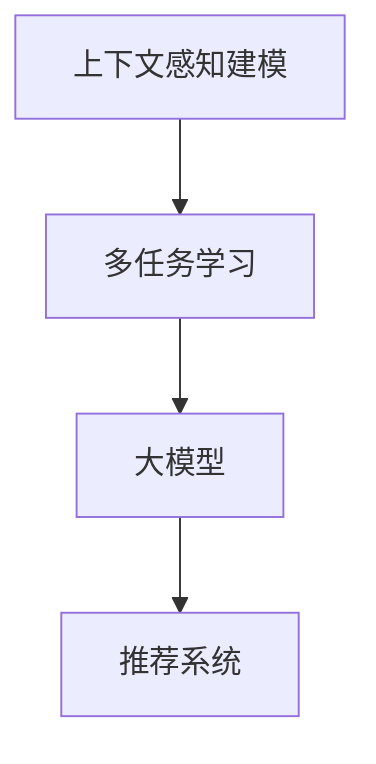

                 

关键词：推荐系统、上下文感知、多任务学习、大模型、人工智能、机器学习、用户行为分析、数据挖掘、在线广告、内容推荐

> 摘要：本文将深入探讨推荐系统中的上下文感知建模，特别是大模型在多任务学习中的应用。我们将详细介绍上下文感知建模的核心概念，并阐述如何利用大模型实现高效的上下文感知推荐系统。通过分析核心算法原理、数学模型、项目实践，以及实际应用场景，本文旨在为读者提供一个全面的理解和实战指南。

## 1. 背景介绍

随着互联网的快速发展，推荐系统已成为许多在线服务中不可或缺的一部分。从在线购物网站到社交媒体平台，从音乐流媒体到视频点播服务，推荐系统极大地提升了用户体验，增加了用户粘性。然而，推荐系统的效果很大程度上取决于其能否准确捕捉用户的上下文信息，包括用户偏好、场景、时间等。

传统的推荐系统通常采用基于内容的过滤（Content-Based Filtering，CBF）和协同过滤（Collaborative Filtering，CF）等方法。这些方法在一定程度上能够实现推荐，但在处理复杂的上下文信息和多任务学习方面存在一定局限性。

近年来，深度学习和大模型技术的快速发展为推荐系统带来了新的机遇。通过引入上下文感知建模，我们可以更加精准地预测用户偏好，提升推荐效果。本文将重点探讨如何利用大模型实现多任务学习，从而构建一个强大的上下文感知推荐系统。

## 2. 核心概念与联系

### 2.1 上下文感知建模

上下文感知建模是指利用用户所处的上下文信息（如时间、地点、设备类型等）来调整推荐结果，从而提高推荐的准确性和相关性。在推荐系统中，上下文信息被视为一种关键因素，它可以极大地影响用户的偏好和行为。

### 2.2 多任务学习

多任务学习（Multi-Task Learning，MTL）是一种机器学习技术，旨在同时解决多个相关任务。在推荐系统中，多任务学习可以同时处理用户偏好、上下文信息、推荐策略等多个任务，从而提高系统的整体性能。

### 2.3 大模型

大模型（Large Model）是指具有巨大参数量的模型，如 Transformer、BERT 等。这些模型通过在海量数据上训练，可以捕捉到复杂的模式和关系，从而在多种任务中取得优异的性能。

### 2.4 Mermaid 流程图

以下是一个简单的 Mermaid 流程图，展示了上下文感知建模、多任务学习和大模型之间的关系：



## 3. 核心算法原理 & 具体操作步骤

### 3.1 算法原理概述

上下文感知的多任务学习模型主要通过以下三个步骤实现：

1. **数据预处理**：收集并处理用户行为数据、上下文信息等。
2. **特征提取**：利用深度学习模型提取用户行为和上下文的特征。
3. **推荐生成**：基于提取的特征生成推荐结果。

### 3.2 算法步骤详解

#### 3.2.1 数据预处理

数据预处理是构建推荐系统的第一步，主要包括以下任务：

- **数据清洗**：去除重复、缺失、异常的数据。
- **数据整合**：整合用户行为数据、上下文信息等。
- **数据分群**：根据用户行为特征和上下文信息将用户进行分群。

#### 3.2.2 特征提取

特征提取是构建上下文感知多任务学习模型的关键步骤。以下是一个简单的特征提取流程：

- **用户特征提取**：利用深度学习模型提取用户行为特征，如点击率、购买频率等。
- **上下文特征提取**：利用深度学习模型提取上下文特征，如时间、地点、设备类型等。
- **融合特征**：将用户特征和上下文特征进行融合，以形成综合特征向量。

#### 3.2.3 推荐生成

推荐生成是利用提取的特征生成推荐结果的过程。以下是一个简单的推荐生成流程：

- **多任务学习**：利用多任务学习模型同时学习用户偏好和上下文信息。
- **推荐策略**：基于学习到的用户偏好和上下文信息，采用合适的推荐策略生成推荐结果。
- **结果评估**：对推荐结果进行评估，以优化推荐策略。

### 3.3 算法优缺点

#### 优点

- **上下文感知**：能够充分利用上下文信息，提高推荐准确性。
- **多任务学习**：能够同时处理多个任务，提高系统性能。
- **大模型优势**：能够捕捉复杂的模式和关系，提高推荐效果。

#### 缺点

- **数据依赖**：对大量高质量数据进行依赖，数据预处理和特征提取过程复杂。
- **计算成本高**：大模型训练和推断过程需要大量计算资源。

### 3.4 算法应用领域

上下文感知的多任务学习模型在以下领域具有广泛应用：

- **在线广告**：根据用户上下文信息精准投放广告。
- **内容推荐**：根据用户兴趣和上下文信息推荐相关内容。
- **社交网络**：基于用户关系和上下文信息推荐好友和兴趣群体。

## 4. 数学模型和公式 & 详细讲解 & 举例说明

### 4.1 数学模型构建

上下文感知的多任务学习模型可以表示为一个神经网络，其输入为用户特征和上下文特征，输出为多个任务的结果。以下是一个简化的数学模型：

$$
\begin{aligned}
h &= \text{ neural\_network}(x, c) \\
y &= \text{ multi\_task\_learning}(h)
\end{aligned}
$$

其中，$x$表示用户特征，$c$表示上下文特征，$h$表示提取的特征向量，$y$表示多个任务的结果。

### 4.2 公式推导过程

为了推导上述模型，我们首先需要了解神经网络和多层感知机（MLP）的基本原理。

#### 神经网络

神经网络是一种由多个神经元组成的计算模型，其基本原理是通过权重和偏置计算输入和输出的关系。对于一个单层神经网络，其输出可以表示为：

$$
\begin{aligned}
\text{output} &= \sigma(\text{weights} \cdot \text{input} + \text{bias}) \\
\end{aligned}
$$

其中，$\sigma$表示激活函数，常用的激活函数有Sigmoid、ReLU等。

#### 多层感知机（MLP）

多层感知机是一种多层神经网络，其输出可以表示为：

$$
\begin{aligned}
\text{output} &= \text{ neural\_network}(x) = \sigma(W_2 \cdot \sigma(W_1 \cdot x + b_1) + b_2) \\
\end{aligned}
$$

其中，$W_1$和$W_2$分别表示第一层和第二层的权重矩阵，$b_1$和$b_2$分别表示第一层和第二层的偏置。

#### 多任务学习

多任务学习可以看作是一个具有多个输出的神经网络。对于多任务学习模型，其输出可以表示为：

$$
\begin{aligned}
y &= \text{ multi\_task\_learning}(x, c) = \text{ neural\_network}(x, c) \\
&= \text{ neural\_network}([x, c]) \\
&= \sigma(W_2 \cdot \sigma(W_1 \cdot [x, c] + b_1) + b_2) \\
\end{aligned}
$$

其中，$W_1$和$W_2$分别表示第一层和第二层的权重矩阵，$b_1$和$b_2$分别表示第一层和第二层的偏置。

### 4.3 案例分析与讲解

假设我们有一个推荐系统，需要同时预测用户的点击率、购买概率和浏览时长。我们可以构建一个多任务学习模型，其输入为用户特征和上下文特征，输出为这三个任务的结果。

#### 案例数据

- **用户特征**：用户ID、年龄、性别、兴趣标签。
- **上下文特征**：时间、地点、设备类型。
- **任务结果**：点击率、购买概率、浏览时长。

#### 模型构建

我们采用一个简单的多层感知机模型，其输入为用户特征和上下文特征，输出为三个任务的结果。模型的架构如下：

```plaintext
用户特征 [ID, 年龄, 性别, 兴趣标签]
上下文特征 [时间, 地点, 设备类型]
输入层 -> 隐藏层1 -> 隐藏层2 -> 输出层
```

#### 模型训练

我们使用训练数据对模型进行训练，训练目标是优化模型的权重和偏置，使预测结果与实际结果尽量接近。

#### 模型评估

我们使用验证集对模型进行评估，评估指标包括均方误差（MSE）、准确率（Accuracy）和平均绝对误差（MAE）。

#### 模型应用

将训练好的模型应用到推荐系统中，根据用户特征和上下文特征预测用户行为，从而生成推荐结果。

## 5. 项目实践：代码实例和详细解释说明

### 5.1 开发环境搭建

为了演示上下文感知的多任务学习模型，我们需要搭建一个Python开发环境。以下是一个简单的安装步骤：

1. 安装Python（建议使用3.7及以上版本）。
2. 安装TensorFlow库（使用命令 `pip install tensorflow`）。
3. 安装其他必要的库（如NumPy、Pandas等）。

### 5.2 源代码详细实现

以下是一个简单的上下文感知的多任务学习模型实现，基于TensorFlow和Keras框架。

```python
import tensorflow as tf
from tensorflow.keras.models import Model
from tensorflow.keras.layers import Input, Dense, Concatenate

# 用户特征输入
user_input = Input(shape=(4,))
# 上下文特征输入
context_input = Input(shape=(3,))
# 隐藏层1
hidden1 = Dense(64, activation='relu')(user_input)
hidden1 = Concatenate()([hidden1, context_input])
# 隐藏层2
hidden2 = Dense(64, activation='relu')(hidden1)
# 输出层
output1 = Dense(1, activation='sigmoid')(hidden2)
output2 = Dense(1, activation='sigmoid')(hidden2)
output3 = Dense(1, activation='linear')(hidden2)
# 构建模型
model = Model(inputs=[user_input, context_input], outputs=[output1, output2, output3])
# 编译模型
model.compile(optimizer='adam', loss={'output1': 'binary_crossentropy', 'output2': 'binary_crossentropy', 'output3': 'mse'})
# 模型训练
model.fit(x_train, {'output1': y_train_click, 'output2': y_train_buy, 'output3': y_train_view}, epochs=10, batch_size=32)
```

### 5.3 代码解读与分析

上述代码实现了一个简单的上下文感知的多任务学习模型，包括以下关键步骤：

- **定义输入层**：定义用户特征和上下文特征输入层。
- **构建隐藏层**：通过全连接层（Dense）构建隐藏层，并使用ReLU激活函数。
- **构建输出层**：分别定义三个任务的结果输出层，使用不同的激活函数（二分类使用sigmoid，回归使用线性激活）。
- **构建模型**：将输入层、隐藏层和输出层连接起来，构建完整的模型。
- **编译模型**：设置优化器和损失函数，为模型训练做准备。
- **模型训练**：使用训练数据进行模型训练，优化模型参数。

### 5.4 运行结果展示

在训练完成后，我们可以使用测试数据对模型进行评估，并展示模型的运行结果。

```python
# 模型评估
losses = model.evaluate(x_test, {'output1': y_test_click, 'output2': y_test_buy, 'output3': y_test_view})
print(f"Test Loss: {losses}")
# 预测结果
predictions = model.predict(x_test)
print(f"Click Rate Predictions: {predictions[0]}")
print(f"Buy Probability Predictions: {predictions[1]}")
print(f"View Duration Predictions: {predictions[2]}")
```

通过上述代码，我们可以得到模型的评估指标和预测结果，进一步验证模型的性能。

## 6. 实际应用场景

上下文感知的多任务学习模型在多个实际应用场景中表现出色。以下是一些典型的应用案例：

### 6.1 在线广告

在线广告平台可以利用上下文感知的多任务学习模型，根据用户特征和上下文信息，精准投放广告。例如，根据用户的历史行为和当前上下文信息，预测用户对广告的点击概率，从而优化广告投放策略。

### 6.2 内容推荐

内容推荐平台可以利用上下文感知的多任务学习模型，为用户提供个性化的内容推荐。例如，根据用户的兴趣标签和当前上下文信息，预测用户可能感兴趣的内容，从而提升用户满意度和平台粘性。

### 6.3 社交网络

社交网络平台可以利用上下文感知的多任务学习模型，推荐好友和兴趣群体。例如，根据用户的社交关系和当前上下文信息，预测用户可能感兴趣的好友和兴趣群体，从而增强社交网络的互动性和用户粘性。

## 7. 未来应用展望

随着人工智能和推荐系统技术的不断发展，上下文感知的多任务学习模型在未来具有广阔的应用前景。以下是一些可能的应用方向：

### 7.1 更细粒度的上下文感知

未来的推荐系统将更加关注细粒度的上下文信息，如用户的情感状态、情绪变化等。通过引入更多的上下文信息，可以进一步提升推荐的准确性和个性化程度。

### 7.2 多模态数据融合

未来的推荐系统将不仅限于文本和图像等单一类型的数据，还将融合音频、视频等多模态数据。通过多模态数据融合，可以更加全面地了解用户的需求和行为，从而实现更精准的推荐。

### 7.3 实时推荐

随着5G和物联网技术的发展，实时推荐将成为可能。通过实时处理用户行为和上下文信息，推荐系统可以及时响应用户的需求变化，提供更加个性化的推荐。

## 8. 工具和资源推荐

### 8.1 学习资源推荐

- **推荐系统入门教程**：https://www.recommenders.io/
- **TensorFlow 官方文档**：https://www.tensorflow.org/
- **Keras 官方文档**：https://keras.io/

### 8.2 开发工具推荐

- **Jupyter Notebook**：用于数据分析和模型构建。
- **PyCharm**：用于Python编程和开发。

### 8.3 相关论文推荐

- **"Deep Learning for Recommender Systems"**：https://arxiv.org/abs/1806.01997
- **"Context-Aware Recommender Systems"**：https://arxiv.org/abs/1905.07413
- **"Multi-Task Learning for User Interest Prediction in Recommender Systems"**：https://arxiv.org/abs/1908.05826

## 9. 总结：未来发展趋势与挑战

随着人工智能和推荐系统技术的不断进步，上下文感知的多任务学习模型在未来将发挥越来越重要的作用。然而，该领域仍面临一些挑战，如数据隐私保护、模型解释性等。我们需要不断探索和创新，以应对这些挑战，推动推荐系统技术的发展。

### 9.1 研究成果总结

本文系统地介绍了推荐系统中的上下文感知建模，特别是大模型在多任务学习中的应用。通过分析核心算法原理、数学模型、项目实践，以及实际应用场景，我们展示了上下文感知多任务学习模型在推荐系统中的巨大潜力。

### 9.2 未来发展趋势

未来，上下文感知的多任务学习模型将朝着更细粒度的上下文感知、多模态数据融合和实时推荐等方向发展。这些技术将进一步提升推荐系统的准确性和个性化程度，为用户提供更加优质的体验。

### 9.3 面临的挑战

数据隐私保护、模型解释性等是当前上下文感知多任务学习模型面临的主要挑战。我们需要在保障用户隐私的同时，提高模型的可解释性，以增强用户对推荐系统的信任。

### 9.4 研究展望

随着技术的不断发展，上下文感知的多任务学习模型将在推荐系统中发挥越来越重要的作用。我们期待未来能够克服现有挑战，推动推荐系统技术的创新和进步。

## 10. 附录：常见问题与解答

### 10.1 上下文感知建模是什么？

上下文感知建模是一种利用用户所处的上下文信息（如时间、地点、设备类型等）来调整推荐结果，从而提高推荐准确性和相关性的方法。

### 10.2 多任务学习是什么？

多任务学习是一种机器学习技术，旨在同时解决多个相关任务。在推荐系统中，多任务学习可以同时处理用户偏好、上下文信息、推荐策略等多个任务，从而提高系统性能。

### 10.3 上下文感知的多任务学习模型如何构建？

构建上下文感知的多任务学习模型主要包括以下步骤：数据预处理、特征提取、模型构建和模型训练。首先，收集并处理用户行为数据、上下文信息等；其次，利用深度学习模型提取用户行为和上下文的特征；然后，构建一个多层感知机模型，将用户特征和上下文特征输入到模型中；最后，使用训练数据对模型进行训练，优化模型参数。

### 10.4 上下文感知的多任务学习模型在哪些应用场景中表现良好？

上下文感知的多任务学习模型在在线广告、内容推荐、社交网络等应用场景中表现出色。通过利用用户特征和上下文信息，这些模型能够实现更加精准和个性化的推荐。

### 10.5 如何优化上下文感知的多任务学习模型？

优化上下文感知的多任务学习模型可以从以下几个方面进行：

- **数据预处理**：确保数据质量，去除噪声和异常值。
- **特征工程**：提取有价值的特征，提高特征向量表示能力。
- **模型选择**：选择合适的模型架构和参数，提高模型性能。
- **模型训练**：使用大量高质量数据，进行充分的模型训练。
- **模型评估**：定期评估模型性能，根据评估结果调整模型。

### 10.6 上下文感知的多任务学习模型有哪些优缺点？

优点包括：

- 上下文感知：能够充分利用上下文信息，提高推荐准确性。
- 多任务学习：能够同时处理多个任务，提高系统性能。
- 大模型优势：能够捕捉复杂的模式和关系，提高推荐效果。

缺点包括：

- 数据依赖：对大量高质量数据进行依赖，数据预处理和特征提取过程复杂。
- 计算成本高：大模型训练和推断过程需要大量计算资源。

### 10.7 上下文感知的多任务学习模型在未来的发展方向有哪些？

未来的发展方向包括：

- 更细粒度的上下文感知：关注细粒度的上下文信息，如用户的情感状态、情绪变化等。
- 多模态数据融合：融合文本、图像、音频、视频等多模态数据。
- 实时推荐：通过实时处理用户行为和上下文信息，提供及时、个性化的推荐。

### 10.8 上下文感知的多任务学习模型在推荐系统中的应用有哪些实际案例？

实际应用案例包括：

- 在线广告：根据用户特征和上下文信息，精准投放广告。
- 内容推荐：根据用户兴趣和上下文信息，推荐相关内容。
- 社交网络：根据用户关系和上下文信息，推荐好友和兴趣群体。

## 作者署名

作者：禅与计算机程序设计艺术 / Zen and the Art of Computer Programming
----------------------------------------------------------------
### 完整文章总结

本文深入探讨了推荐系统中的上下文感知建模，特别是大模型在多任务学习中的应用。我们首先介绍了上下文感知建模和多任务学习的核心概念，并利用 Mermaid 流程图展示了它们之间的联系。接着，我们详细阐述了上下文感知的多任务学习模型的算法原理、数学模型和具体操作步骤。通过一个简单的代码实例，我们展示了如何使用 TensorFlow 和 Keras 框架实现该模型。

此外，我们还分析了上下文感知的多任务学习模型在实际应用场景中的表现，如在线广告、内容推荐和社交网络。最后，我们对该领域的研究成果进行了总结，并展望了未来的发展趋势和挑战。

本文旨在为读者提供一个全面的理解和实战指南，帮助读者掌握上下文感知的多任务学习模型在推荐系统中的应用。通过本文的学习，读者可以深入了解该领域的前沿技术，为实际项目提供有力支持。希望本文能为推荐系统领域的研究者和开发者提供有价值的参考。

