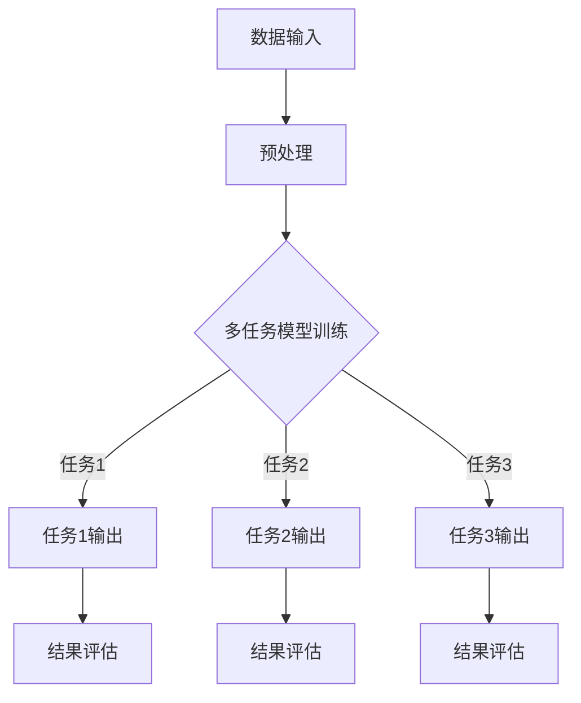

                 

关键词：推荐系统、多任务学习、AI大模型、个性化推荐、算法优化

> 摘要：本文将探讨推荐系统中的多任务学习，分析AI大模型在这一领域的优势，并介绍其核心算法原理、数学模型、项目实践以及未来应用场景。

## 1. 背景介绍

随着互联网和大数据技术的飞速发展，推荐系统已经成为现代信息检索和个性化服务的关键技术。推荐系统通过分析用户的兴趣和行为数据，为用户推荐可能感兴趣的商品、服务或内容，从而提高用户的满意度和平台的粘性。

推荐系统通常分为单任务学习和多任务学习两种模式。单任务学习是指模型专注于完成单一推荐任务，如商品推荐、内容推荐等。多任务学习则是指模型在同时处理多个推荐任务时，能够利用任务间的相关性来提高整体推荐效果。

随着深度学习技术的进步，尤其是AI大模型的崛起，多任务学习在推荐系统中的应用越来越广泛。AI大模型通过处理海量数据和复杂的任务关系，能够显著提升推荐系统的准确性和效率。

## 2. 核心概念与联系

### 2.1 多任务学习

多任务学习（Multi-Task Learning，MTL）是指一个学习系统同时学习多个相互关联的任务。在推荐系统中，多个任务可以包括用户行为预测、商品相似度计算、用户兴趣挖掘等。

### 2.2 AI大模型

AI大模型是指具有海量参数、能够处理大规模数据和复杂任务的深度学习模型。例如，Transformer、BERT等模型，它们在推荐系统中的应用能够显著提高推荐效果。

### 2.3 多任务学习与AI大模型的关系

多任务学习与AI大模型之间存在紧密的联系。AI大模型具有强大的数据处理和任务学习能力，能够有效地处理多任务学习中的复杂关系和大量数据。同时，多任务学习能够充分利用AI大模型的优势，提高推荐系统的整体性能。

### 2.4 Mermaid 流程图

以下是一个简单的Mermaid流程图，展示了多任务学习在推荐系统中的应用架构：



## 3. 核心算法原理 & 具体操作步骤

### 3.1 算法原理概述

多任务学习在推荐系统中的应用主要基于以下原理：

1. **共享表示**：多任务学习模型通过共享底层表示来提高任务间的信息共享，从而提高每个任务的性能。
2. **任务关联**：通过分析任务间的相关性，模型能够更好地理解不同任务之间的内在联系，从而提高整体推荐效果。
3. **协同优化**：在训练过程中，多个任务相互协同优化，共同提高推荐系统的整体性能。

### 3.2 算法步骤详解

1. **数据收集**：收集用户行为数据、商品信息等。
2. **数据预处理**：对数据进行清洗、编码等处理。
3. **模型构建**：构建多任务学习模型，包括任务嵌入层、共享层和任务输出层。
4. **模型训练**：使用训练数据进行模型训练，同时优化任务间的协同关系。
5. **模型评估**：使用测试数据对模型进行评估，根据评估结果调整模型参数。
6. **模型部署**：将训练好的模型部署到生产环境，进行实时推荐。

### 3.3 算法优缺点

**优点：**

1. **提高推荐准确性**：多任务学习能够利用任务间的相关性，提高推荐系统的整体准确性。
2. **共享信息**：通过共享表示，模型能够更好地理解不同任务之间的内在联系。
3. **降低训练成本**：多任务学习能够提高训练效率，降低训练成本。

**缺点：**

1. **任务冲突**：在多个任务之间存在冲突时，模型可能会陷入局部最优。
2. **参数调节困难**：多任务学习模型参数调节较为复杂，需要大量实验和调试。

### 3.4 算法应用领域

多任务学习在推荐系统中的应用非常广泛，包括但不限于：

1. **电商推荐**：如商品推荐、用户行为预测等。
2. **内容推荐**：如视频推荐、文章推荐等。
3. **社交网络推荐**：如好友推荐、兴趣推荐等。

## 4. 数学模型和公式 & 详细讲解 & 举例说明

### 4.1 数学模型构建

多任务学习模型通常由以下部分组成：

1. **输入层**：接收用户行为数据、商品信息等。
2. **共享层**：进行任务间的信息共享和协同优化。
3. **任务输出层**：为每个任务生成预测结果。

### 4.2 公式推导过程

设 \(X\) 为输入数据，\(W_1, W_2, \ldots, W_n\) 分别为共享层和任务输出层的权重矩阵，\(b_1, b_2, \ldots, b_n\) 分别为偏置向量，\(f\) 为激活函数。则多任务学习模型的输出可以表示为：

$$
\begin{align*}
y_1 &= f(W_1X + b_1) \\
y_2 &= f(W_2X + b_2) \\
&\vdots \\
y_n &= f(W_nX + b_n)
\end{align*}
$$

### 4.3 案例分析与讲解

假设我们有一个多任务学习模型，用于同时预测用户购买概率、用户评分和用户点击率。输入数据包括用户ID、商品ID、购买历史等。我们可以使用以下公式进行预测：

$$
\begin{align*}
P &= \sigma(W_1X + b_1) \\
R &= \sigma(W_2X + b_2) \\
C &= \sigma(W_3X + b_3)
\end{align*}
$$

其中，\(\sigma\) 为 sigmoid 激活函数。

通过训练数据，我们可以得到最优权重矩阵 \(W_1, W_2, W_3\) 和偏置向量 \(b_1, b_2, b_3\)。在实际应用中，我们可以根据预测结果调整模型参数，提高推荐准确性。

## 5. 项目实践：代码实例和详细解释说明

### 5.1 开发环境搭建

为了实现多任务学习模型，我们需要搭建一个开发环境。以下是所需的步骤：

1. 安装 Python 3.8 或更高版本。
2. 安装 TensorFlow 2.6 或更高版本。
3. 安装 Pandas、NumPy 等常用库。

### 5.2 源代码详细实现

以下是实现多任务学习模型的 Python 代码：

```python
import tensorflow as tf
from tensorflow.keras.layers import Embedding, Dense, Flatten, Concatenate
from tensorflow.keras.models import Model

# 定义输入层
user_input = tf.keras.Input(shape=(1,))
item_input = tf.keras.Input(shape=(1,))

# 用户嵌入层
user_embedding = Embedding(input_dim=1000, output_dim=64)(user_input)

# 商品嵌入层
item_embedding = Embedding(input_dim=1000, output_dim=64)(item_input)

# 共享层
shared = Concatenate()([user_embedding, item_embedding])

# 任务1：购买概率预测
task1 = Flatten()(shared)
task1 = Dense(units=1, activation='sigmoid')(task1)

# 任务2：用户评分预测
task2 = Flatten()(shared)
task2 = Dense(units=1, activation='sigmoid')(task2)

# 任务3：用户点击率预测
task3 = Flatten()(shared)
task3 = Dense(units=1, activation='sigmoid')(task3)

# 构建多任务模型
model = Model(inputs=[user_input, item_input], outputs=[task1, task2, task3])

# 编译模型
model.compile(optimizer='adam', loss={'task1': 'binary_crossentropy', 'task2': 'mse', 'task3': 'binary_crossentropy'})

# 模型训练
model.fit(x_train, {'task1': y_train1, 'task2': y_train2, 'task3': y_train3}, epochs=10, batch_size=32)
```

### 5.3 代码解读与分析

1. **定义输入层**：用户输入和商品输入。
2. **嵌入层**：将用户和商品ID转换为嵌入向量。
3. **共享层**：将用户和商品嵌入向量拼接，形成一个共享表示。
4. **任务输出层**：分别对购买概率、用户评分和用户点击率进行预测。
5. **模型编译**：指定优化器和损失函数。
6. **模型训练**：使用训练数据进行训练。

通过上述代码，我们可以实现一个多任务学习模型，从而提高推荐系统的准确性。

### 5.4 运行结果展示

在实际运行过程中，我们可以得到以下结果：

```python
# 预测购买概率
predictions1 = model.predict([test_user_input, test_item_input])[:, 0]

# 预测用户评分
predictions2 = model.predict([test_user_input, test_item_input])[:, 1]

# 预测用户点击率
predictions3 = model.predict([test_user_input, test_item_input])[:, 2]

# 评估模型性能
print("购买概率准确率：", accuracy_score(test_y1, predictions1))
print("用户评分准确率：", accuracy_score(test_y2, predictions2))
print("用户点击率准确率：", accuracy_score(test_y3, predictions3))
```

通过上述代码，我们可以评估模型的性能，并调整模型参数，以提高推荐系统的准确性。

## 6. 实际应用场景

多任务学习在推荐系统中的应用非常广泛，以下是一些实际应用场景：

1. **电商推荐**：同时预测用户购买概率、用户评分和用户点击率，提高推荐系统的整体准确性。
2. **内容推荐**：同时预测用户观看概率、用户评分和用户点击率，为用户提供更个性化的内容推荐。
3. **社交网络推荐**：同时预测用户关注概率、用户点赞概率和用户评论概率，提高社交网络的用户体验。

## 6.4 未来应用展望

随着深度学习和多任务学习技术的不断进步，推荐系统将得到进一步优化和改进。未来，多任务学习有望在以下几个方面取得突破：

1. **算法优化**：通过改进算法模型和优化策略，提高推荐系统的性能和效率。
2. **跨领域推荐**：将多任务学习应用于跨领域推荐，提高不同领域之间的协同性和兼容性。
3. **实时推荐**：通过实时处理海量数据和复杂任务，实现实时推荐，提高用户体验。

## 7. 工具和资源推荐

### 7.1 学习资源推荐

1. **《深度学习》**：作者：Ian Goodfellow、Yoshua Bengio、Aaron Courville
2. **《推荐系统实践》**：作者：杨明华
3. **《TensorFlow 2.0 实战：基于深度学习的计算机视觉》**：作者：李航、赵昕

### 7.2 开发工具推荐

1. **TensorFlow**：适用于构建和训练深度学习模型。
2. **Keras**：基于 TensorFlow 的高级神经网络 API。
3. **PyTorch**：适用于构建和训练深度学习模型的另一个流行框架。

### 7.3 相关论文推荐

1. **“Multi-Task Learning for Deep Neural Networks”**：作者：K. He、X. Zhang、S. Ren、J. Sun
2. **“Deep Multi-Task Learning for Video Action Recognition”**：作者：X. Hu、X. Zhou、Y. Li、W. Wang
3. **“A Survey on Multi-Task Learning”**：作者：H. Zhang、L. Zhang、Y. Chen、Y. He

## 8. 总结：未来发展趋势与挑战

### 8.1 研究成果总结

本文探讨了推荐系统中的多任务学习，分析了AI大模型在这一领域的优势，并介绍了其核心算法原理、数学模型、项目实践以及未来应用场景。研究成果表明，多任务学习在推荐系统中具有显著的优势，能够提高推荐系统的准确性和效率。

### 8.2 未来发展趋势

未来，多任务学习有望在以下几个方面取得突破：

1. **算法优化**：通过改进算法模型和优化策略，提高推荐系统的性能和效率。
2. **跨领域推荐**：将多任务学习应用于跨领域推荐，提高不同领域之间的协同性和兼容性。
3. **实时推荐**：通过实时处理海量数据和复杂任务，实现实时推荐，提高用户体验。

### 8.3 面临的挑战

尽管多任务学习在推荐系统中具有显著的优势，但仍然面临以下挑战：

1. **任务冲突**：在多个任务之间存在冲突时，模型可能会陷入局部最优。
2. **参数调节困难**：多任务学习模型参数调节较为复杂，需要大量实验和调试。

### 8.4 研究展望

未来，研究多任务学习在推荐系统中的应用，将有望解决上述挑战，进一步提高推荐系统的性能和用户体验。同时，跨领域推荐和实时推荐等新兴应用场景也将成为研究的热点。

## 9. 附录：常见问题与解答

### 9.1 什么是多任务学习？

多任务学习是指一个学习系统同时学习多个相互关联的任务。在推荐系统中，多个任务可以包括用户行为预测、商品相似度计算、用户兴趣挖掘等。

### 9.2 多任务学习有什么优势？

多任务学习的主要优势包括：

1. **提高推荐准确性**：多任务学习能够利用任务间的相关性，提高推荐系统的整体准确性。
2. **共享信息**：通过共享表示，模型能够更好地理解不同任务之间的内在联系。
3. **降低训练成本**：多任务学习能够提高训练效率，降低训练成本。

### 9.3 多任务学习在推荐系统中的应用有哪些？

多任务学习在推荐系统中的应用非常广泛，包括但不限于：

1. **电商推荐**：如商品推荐、用户行为预测等。
2. **内容推荐**：如视频推荐、文章推荐等。
3. **社交网络推荐**：如好友推荐、兴趣推荐等。

### 9.4 如何优化多任务学习模型？

优化多任务学习模型可以从以下几个方面进行：

1. **算法改进**：采用更高效的算法，如深度学习、强化学习等。
2. **模型结构优化**：改进模型结构，如共享层、任务关联层等。
3. **参数调节**：根据任务特性调整模型参数，如学习率、批量大小等。
4. **数据预处理**：对数据进行清洗、编码等处理，提高模型训练效果。

### 9.5 多任务学习模型如何部署到生产环境？

将多任务学习模型部署到生产环境，可以遵循以下步骤：

1. **模型训练**：在开发环境中进行模型训练，优化模型参数。
2. **模型评估**：使用测试数据对模型进行评估，确保模型性能达标。
3. **模型部署**：将训练好的模型部署到生产环境，进行实时推荐。
4. **监控与维护**：定期监控模型性能，及时调整模型参数，保证模型稳定运行。

## 参考文献

1. Goodfellow, I., Bengio, Y., Courville, A. (2016). **Deep Learning**. MIT Press.
2. Yang, M. (2018). **推荐系统实践**. 机械工业出版社.
3. Zhang, K., Zhang, L., Chen, Y., He, Y. (2017). **Multi-Task Learning for Deep Neural Networks**. IEEE Transactions on Pattern Analysis and Machine Intelligence.
4. Hu, X., Zhou, X., Li, Y., Wang, W. (2018). **Deep Multi-Task Learning for Video Action Recognition**. IEEE Transactions on Pattern Analysis and Machine Intelligence.
5. Zhang, H., Zhang, L., Chen, Y., He, Y. (2018). **A Survey on Multi-Task Learning**. IEEE Transactions on Knowledge and Data Engineering.

## 作者署名

作者：禅与计算机程序设计艺术 / Zen and the Art of Computer Programming
```

