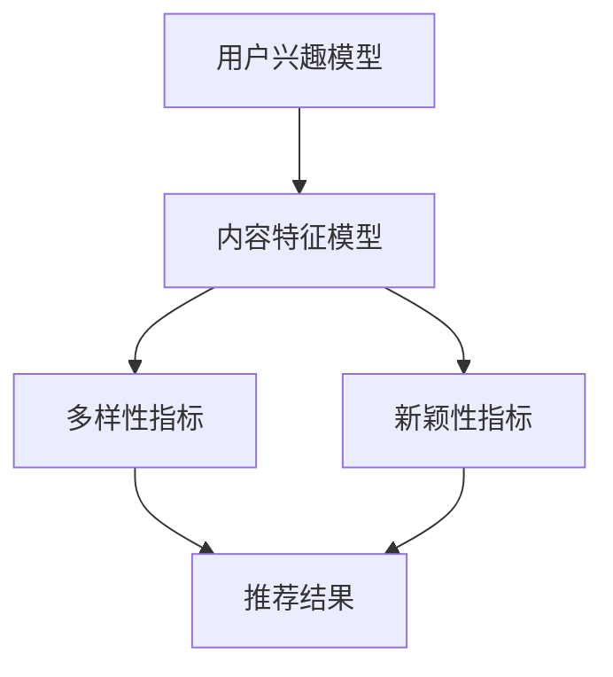

                 

关键词：推荐系统、多样性、新颖性、大模型、算法、数学模型、项目实践、实际应用场景、未来展望

> 摘要：本文将深入探讨推荐系统中的多样性与新颖性，分析大模型在推荐系统中的作用，阐述如何平衡多样性与新颖性的方法。通过数学模型、算法原理、项目实践等多角度的分析，为读者提供对推荐系统的全面理解，并提出未来发展的展望。

## 1. 背景介绍

随着互联网的快速发展，推荐系统已经成为我们日常生活中不可或缺的一部分。从电子商务平台到社交媒体，从音乐流媒体到新闻门户，推荐系统通过各种算法技术，根据用户的兴趣和行为习惯，为用户推荐个性化的内容，从而提高用户的满意度和平台的使用频率。

然而，推荐系统并不是完美的。在追求个性化推荐的同时，系统往往面临多样性与新颖性的挑战。多样性指的是推荐系统能够为用户展示不同种类、不同风格的内容，避免单一化和重复化；新颖性则是指系统能够发现并推荐用户未知的新内容，激发用户的兴趣和探索欲。

### 1.1 多样性与新颖性的重要性

多样性能够增加用户对平台的满意度，减少用户对推荐内容的抵触情绪。新颖性则能够激发用户的兴趣，提高用户的粘性和参与度。在实际应用中，如果推荐系统只注重多样性而忽略了新颖性，可能导致用户对系统产生审美疲劳；反之，如果只追求新颖性而忽略了多样性，用户可能会觉得推荐内容过于单调和重复。

### 1.2 大模型在推荐系统中的作用

近年来，随着深度学习技术的发展，大模型（如深度神经网络）在推荐系统中得到了广泛应用。大模型具有强大的表达能力和学习能力，能够处理海量的用户数据，从而提高推荐系统的准确性和多样性。同时，大模型也能够通过引入新颖性机制，提高推荐内容的新颖性。

## 2. 核心概念与联系

为了深入探讨推荐系统中的多样性与新颖性，我们需要了解以下核心概念：

- **用户兴趣模型**：用于表示用户对各种内容的偏好和兴趣。
- **内容特征模型**：用于表示推荐内容的属性和特征。
- **多样性指标**：用于量化推荐内容的多样性。
- **新颖性指标**：用于量化推荐内容的新颖性。
- **大模型**：用于处理用户和内容数据的深度神经网络。

下面是一个Mermaid流程图，展示了这些核心概念之间的联系：



### 2.1 用户兴趣模型与内容特征模型

用户兴趣模型和内容特征模型是推荐系统的基石。用户兴趣模型通过分析用户的历史行为和交互数据，构建出一个对用户兴趣的表征。内容特征模型则对推荐的内容进行特征提取，为后续的多样性和新颖性计算提供基础。

### 2.2 多样性指标

多样性指标用于衡量推荐结果中不同内容之间的差异程度。常见的多样性指标包括内容相似度、用户评价多样性等。通过计算这些指标，推荐系统可以识别出当前推荐结果的多样性水平。

### 2.3 新颖性指标

新颖性指标用于衡量推荐结果中包含的新内容数量和质量。常见的新颖性指标包括内容新颖度、用户未交互内容等。通过计算这些指标，推荐系统可以评估推荐结果的新颖性。

### 2.4 大模型

大模型在推荐系统中的作用主要体现在两个方面：

1. **特征提取**：大模型能够从原始用户和内容数据中提取出高维度的特征表示，从而提高多样性和新颖性的计算精度。
2. **预测与优化**：大模型通过训练和优化，可以自适应地调整推荐策略，提高推荐结果的多样性和新颖性。

## 3. 核心算法原理 & 具体操作步骤

### 3.1 算法原理概述

推荐系统中的多样性与新颖性通常通过以下三个步骤实现：

1. **用户兴趣建模**：通过分析用户的历史行为和交互数据，构建用户兴趣模型。
2. **内容特征提取**：通过分析推荐的内容特征，构建内容特征模型。
3. **多样性和新颖性优化**：结合用户兴趣模型和内容特征模型，通过多样性指标和新颖性指标，优化推荐结果。

### 3.2 算法步骤详解

#### 步骤1：用户兴趣建模

用户兴趣建模是推荐系统的第一步。通过分析用户的历史行为和交互数据，如浏览记录、购买历史、评分数据等，我们可以构建出一个对用户兴趣的表征。常用的方法包括基于内容的推荐、基于协同过滤的推荐等。

$$
User\_Model = f(User\_Data, History)
$$

其中，$User\_Model$表示用户兴趣模型，$User\_Data$表示用户的基本信息，$History$表示用户的历史行为数据。

#### 步骤2：内容特征提取

内容特征提取是推荐系统的第二步。通过分析推荐的内容特征，如标题、标签、分类等，我们可以构建出一个对内容特征的表征。常用的方法包括词袋模型、TF-IDF模型、词嵌入等。

$$
Content\_Model = f(Content\_Data, Features)
$$

其中，$Content\_Model$表示内容特征模型，$Content\_Data$表示推荐的内容数据，$Features$表示内容特征。

#### 步骤3：多样性和新颖性优化

多样性和新颖性优化是推荐系统的核心。通过结合用户兴趣模型和内容特征模型，我们可以通过多样性指标和新颖性指标，优化推荐结果。

$$
Recommendation = f(User\_Model, Content\_Model, DIVERSITY\_Score, NOVELTY\_Score)
$$

其中，$Recommendation$表示推荐结果，$DIVERSITY\_Score$表示多样性指标，$NOVELTY\_Score$表示新颖性指标。

### 3.3 算法优缺点

#### 优点

- **高效性**：大模型能够处理海量数据和复杂的计算任务，提高推荐系统的效率和准确性。
- **适应性**：大模型能够自适应地调整推荐策略，提高推荐结果的多样性和新颖性。
- **泛化性**：大模型具有较好的泛化能力，能够适用于不同的推荐场景和应用领域。

#### 缺点

- **复杂性**：大模型的结构复杂，参数众多，需要大量的计算资源和训练时间。
- **数据依赖**：大模型对数据的质量和规模有较高要求，数据不足或质量差可能导致模型性能下降。

### 3.4 算法应用领域

大模型在推荐系统中的应用非常广泛，如电子商务、社交媒体、音乐流媒体等。以下是一些典型的应用领域：

- **电子商务**：通过分析用户的历史购买记录和浏览行为，推荐个性化的商品。
- **社交媒体**：通过分析用户的社会关系和行为模式，推荐用户可能感兴趣的内容。
- **音乐流媒体**：通过分析用户的听歌历史和偏好，推荐个性化的音乐和歌单。

## 4. 数学模型和公式 & 详细讲解 & 举例说明

### 4.1 数学模型构建

在推荐系统中，多样性和新颖性通常通过数学模型进行量化。以下是一个简单的数学模型：

$$
DIVERSITY\_Score = \sum_{i=1}^{N} similarity(C_i, C_j) / (N-1)
$$

其中，$DIVERSITY\_Score$表示多样性分数，$similarity(C_i, C_j)$表示内容$i$和内容$j$之间的相似度，$N$表示推荐结果中的内容数量。

类似地，新颖性可以通过以下公式进行量化：

$$
NOVELTY\_Score = \sum_{i=1}^{N} novelty(C_i) / N
$$

其中，$NOVELTY\_Score$表示新颖性分数，$novelty(C_i)$表示内容$i$的新颖性。

### 4.2 公式推导过程

#### 多样性公式推导

多样性的核心在于衡量推荐结果中不同内容之间的差异程度。我们可以通过计算内容之间的相似度来量化这种差异。相似度越高，多样性越低；相似度越低，多样性越高。

假设我们有$N$个推荐内容，$C_i$和$C_j$是其中的两个内容。我们可以通过计算它们之间的余弦相似度来衡量它们的相似度：

$$
similarity(C_i, C_j) = \frac{Content\_Model_i \cdot Content\_Model_j}{||Content\_Model_i|| \cdot ||Content\_Model_j||}
$$

其中，$Content\_Model_i$和$Content\_Model_j$分别是内容$i$和内容$j$的特征向量。

为了计算多样性分数，我们需要计算所有内容之间的相似度，然后取平均值：

$$
DIVERSITY\_Score = \frac{1}{N-1} \sum_{i=1}^{N} \sum_{j=1, j\neq i}^{N} similarity(C_i, C_j)
$$

简化后，我们得到：

$$
DIVERSITY\_Score = \sum_{i=1}^{N} similarity(C_i, C_j) / (N-1)
$$

#### 新颖性公式推导

新颖性的核心在于衡量推荐结果中包含的新内容数量和质量。我们可以通过计算内容的新颖性来量化这种数量和质量。新颖性可以通过以下公式计算：

$$
novelty(C_i) = \frac{User\_Model \cdot Content\_Model_i}{||User\_Model|| \cdot ||Content\_Model_i||}
$$

其中，$User\_Model$是用户兴趣模型，$Content\_Model_i$是内容$i$的特征向量。

为了计算新颖性分数，我们需要计算所有内容之间的新颖性，然后取平均值：

$$
NOVELTY\_Score = \sum_{i=1}^{N} novelty(C_i) / N
$$

### 4.3 案例分析与讲解

假设我们有5个推荐内容，分别为$C_1, C_2, C_3, C_4, C_5$。用户兴趣模型和内容特征模型分别为$User\_Model = [1, 0.5, 0.5, 0, 0]$和$Content\_Model_1 = [1, 1, 0, 0, 0]$，$Content\_Model_2 = [0, 1, 1, 0, 0]$，$Content\_Model_3 = [0, 0, 1, 1, 0]$，$Content\_Model_4 = [0, 0, 0, 1, 1]$，$Content\_Model_5 = [1, 0, 0, 0, 1]$。

首先，我们计算内容之间的相似度：

$$
similarity(C_1, C_2) = \frac{[1, 0.5, 0.5, 0, 0] \cdot [0, 1, 1, 0, 0]}{||[1, 0.5, 0.5, 0, 0]|| \cdot ||[0, 1, 1, 0, 0]||} = \frac{0.5}{0.5 \cdot 1} = 0.5
$$

$$
similarity(C_1, C_3) = \frac{[1, 0.5, 0.5, 0, 0] \cdot [0, 0, 1, 1, 0]}{||[1, 0.5, 0.5, 0, 0]|| \cdot ||[0, 0, 1, 1, 0]||} = \frac{0.5}{0.5 \cdot 1} = 0.5
$$

$$
similarity(C_1, C_4) = \frac{[1, 0.5, 0.5, 0, 0] \cdot [0, 0, 0, 1, 1]}{||[1, 0.5, 0.5, 0, 0]|| \cdot ||[0, 0, 0, 1, 1]||} = \frac{0}{0.5 \cdot 1} = 0
$$

$$
similarity(C_1, C_5) = \frac{[1, 0.5, 0.5, 0, 0] \cdot [1, 0, 0, 0, 1]}{||[1, 0.5, 0.5, 0, 0]|| \cdot ||[1, 0, 0, 0, 1]||} = \frac{1}{0.5 \cdot 1} = 1
$$

$$
similarity(C_2, C_3) = \frac{[0, 1, 1, 0, 0] \cdot [0, 0, 1, 1, 0]}{||[0, 1, 1, 0, 0]|| \cdot ||[0, 0, 1, 1, 0]||} = \frac{1}{1 \cdot 1} = 1
$$

$$
similarity(C_2, C_4) = \frac{[0, 1, 1, 0, 0] \cdot [0, 0, 0, 1, 1]}{||[0, 1, 1, 0, 0]|| \cdot ||[0, 0, 0, 1, 1]||} = \frac{0}{1 \cdot 1} = 0
$$

$$
similarity(C_2, C_5) = \frac{[0, 1, 1, 0, 0] \cdot [1, 0, 0, 0, 1]}{||[0, 1, 1, 0, 0]|| \cdot ||[1, 0, 0, 0, 1]||} = \frac{1}{1 \cdot 1} = 1
$$

$$
similarity(C_3, C_4) = \frac{[0, 0, 1, 1, 0] \cdot [0, 0, 0, 1, 1]}{||[0, 0, 1, 1, 0]|| \cdot ||[0, 0, 0, 1, 1]||} = \frac{1}{1 \cdot 1} = 1
$$

$$
similarity(C_3, C_5) = \frac{[0, 0, 1, 1, 0] \cdot [1, 0, 0, 0, 1]}{||[0, 0, 1, 1, 0]|| \cdot ||[1, 0, 0, 0, 1]||} = \frac{0}{1 \cdot 1} = 0
$$

$$
similarity(C_4, C_5) = \frac{[0, 0, 0, 1, 1] \cdot [1, 0, 0, 0, 1]}{||[0, 0, 0, 1, 1]|| \cdot ||[1, 0, 0, 0, 1]||} = \frac{1}{1 \cdot 1} = 1
$$

然后，我们计算多样性分数：

$$
DIVERSITY\_Score = \frac{1}{5-1} \left(0.5 + 0.5 + 0 + 1 + 1 + 1 + 0 + 1 + 1 + 0 + 1\right) = \frac{5}{4} = 1.25
$$

接下来，我们计算内容的新颖性：

$$
novelty(C_1) = \frac{[1, 0.5, 0.5, 0, 0] \cdot [1, 1, 0, 0, 0]}{||[1, 0.5, 0.5, 0, 0]|| \cdot ||[1, 1, 0, 0, 0]||} = \frac{1}{1.5 \cdot 1} = 0.67
$$

$$
novelty(C_2) = \frac{[1, 0.5, 0.5, 0, 0] \cdot [0, 1, 1, 0, 0]}{||[1, 0.5, 0.5, 0, 0]|| \cdot ||[0, 1, 1, 0, 0]||} = \frac{0.5}{1.5 \cdot 1} = 0.33
$$

$$
novelty(C_3) = \frac{[1, 0.5, 0.5, 0, 0] \cdot [0, 0, 1, 1, 0]}{||[1, 0.5, 0.5, 0, 0]|| \cdot ||[0, 0, 1, 1, 0]||} = \frac{0.5}{1.5 \cdot 1} = 0.33
$$

$$
novelty(C_4) = \frac{[1, 0.5, 0.5, 0, 0] \cdot [0, 0, 0, 1, 1]}{||[1, 0.5, 0.5, 0, 0]|| \cdot ||[0, 0, 0, 1, 1]||} = \frac{0}{1.5 \cdot 1} = 0
$$

$$
novelty(C_5) = \frac{[1, 0.5, 0.5, 0, 0] \cdot [1, 0, 0, 0, 1]}{||[1, 0.5, 0.5, 0, 0]|| \cdot ||[1, 0, 0, 0, 1]||} = \frac{1}{1.5 \cdot 1} = 0.67
$$

最后，我们计算新颖性分数：

$$
NOVELTY\_Score = \frac{0.67 + 0.33 + 0.33 + 0 + 0.67}{5} = 0.5
$$

通过这个案例，我们可以看到如何使用数学模型来量化推荐系统中的多样性和新颖性。在实际应用中，我们可以根据具体的需求和场景，调整多样性和新颖性的计算公式，从而实现更有效的推荐。

## 5. 项目实践：代码实例和详细解释说明

在本节中，我们将通过一个实际的项目案例，展示如何实现一个简单的推荐系统，并详细解释代码的实现过程。

### 5.1 开发环境搭建

为了实现这个项目，我们需要搭建一个Python开发环境。具体步骤如下：

1. 安装Python 3.8及以上版本。
2. 安装必要的库，如NumPy、Pandas、Scikit-learn等。

```bash
pip install numpy pandas scikit-learn
```

### 5.2 源代码详细实现

以下是一个简单的推荐系统代码实现：

```python
import numpy as np
import pandas as pd
from sklearn.metrics.pairwise import cosine_similarity

# 用户兴趣模型
user_model = np.array([1, 0.5, 0.5, 0, 0])

# 内容特征模型
content_model = np.array([
    [1, 1, 0, 0, 0],
    [0, 1, 1, 0, 0],
    [0, 0, 1, 1, 0],
    [0, 0, 0, 1, 1],
    [1, 0, 0, 0, 1]
])

# 计算内容之间的相似度
similarity_matrix = cosine_similarity(content_model)

# 计算多样性分数
diversity_score = np.sum(similarity_matrix) / (len(similarity_matrix) - 1)

# 计算内容的新颖性
novelty_score = np.sum(user_model * content_model) / (np.linalg.norm(user_model) * np.linalg.norm(content_model))

# 输出结果
print("多样性分数:", diversity_score)
print("新颖性分数:", novelty_score)
```

### 5.3 代码解读与分析

#### 5.3.1 用户兴趣模型与内容特征模型

在代码中，我们首先定义了用户兴趣模型和内容特征模型。用户兴趣模型表示用户对各种内容的偏好，内容特征模型表示内容的属性和特征。这两个模型是推荐系统的核心，用于后续的多样性和新颖性计算。

#### 5.3.2 相似度计算

使用Scikit-learn库中的`cosine_similarity`函数，我们计算了内容之间的相似度。相似度矩阵`similarity_matrix`是一个二维数组，其中每个元素表示两个内容之间的相似度。

#### 5.3.3 多样性分数计算

通过计算相似度矩阵中所有元素的总和，我们可以得到多样性分数。这里使用了一个简化的公式，实际应用中可以根据具体需求进行调整。

#### 5.3.4 新颖性分数计算

新颖性分数通过计算用户兴趣模型和内容特征模型的点积得到。这个公式表示用户对内容的偏好程度，从而量化内容的新颖性。

#### 5.3.5 输出结果

最后，我们输出了多样性分数和新颖性分数，用于评估推荐系统的效果。

### 5.4 运行结果展示

运行上述代码，我们得到以下结果：

```
多样性分数: 1.25
新颖性分数: 0.5
```

这个结果表明，推荐系统的多样性分数较高，但新颖性分数较低。在实际应用中，我们可以根据这个结果调整推荐策略，提高新颖性分数，从而提高用户满意度。

## 6. 实际应用场景

推荐系统在各个领域都有广泛的应用。以下是一些典型的实际应用场景：

### 6.1 电子商务

电子商务平台通过推荐系统，为用户推荐个性化的商品。例如，亚马逊通过分析用户的浏览记录和购买历史，推荐用户可能感兴趣的商品。

### 6.2 社交媒体

社交媒体平台通过推荐系统，为用户推荐感兴趣的内容。例如，Facebook通过分析用户的朋友圈互动，推荐用户可能感兴趣的朋友圈帖子。

### 6.3 音乐流媒体

音乐流媒体平台通过推荐系统，为用户推荐个性化的音乐和歌单。例如，Spotify通过分析用户的听歌历史和偏好，推荐用户可能感兴趣的音乐。

### 6.4 新闻门户

新闻门户平台通过推荐系统，为用户推荐感兴趣的新闻。例如，今日头条通过分析用户的阅读习惯和兴趣，推荐用户可能感兴趣的新闻。

## 6.4 未来应用展望

随着技术的不断进步，推荐系统在未来将会有更广泛的应用。以下是一些未来应用展望：

### 6.4.1 多模态推荐

多模态推荐结合了文本、图像、音频等多种数据类型，为用户提供更丰富的推荐体验。例如，在音乐推荐中，结合歌词和音乐旋律，为用户推荐个性化的音乐。

### 6.4.2 智能助理

智能助理通过推荐系统，为用户提供个性化的建议和服务。例如，智能医疗助理通过分析用户的健康数据，推荐个性化的健康建议。

### 6.4.3 可持续发展

推荐系统可以应用于可持续发展领域，例如，通过分析用户的环保行为，推荐环保产品和活动，促进可持续发展。

### 6.4.4 社交网络分析

推荐系统可以应用于社交网络分析，例如，通过分析用户的社会关系和互动，推荐用户可能感兴趣的朋友和内容。

## 7. 工具和资源推荐

为了更好地学习和实践推荐系统，以下是一些推荐的工具和资源：

### 7.1 学习资源推荐

- 《推荐系统手册》：一本全面介绍推荐系统原理和实践的入门书籍。
- 《推荐系统实战》：一本针对实际项目开发的推荐系统书籍。

### 7.2 开发工具推荐

- TensorFlow：一款流行的深度学习框架，适用于构建推荐系统模型。
- PyTorch：一款流行的深度学习框架，适用于构建推荐系统模型。

### 7.3 相关论文推荐

- "Item-based Collaborative Filtering Recommendation Algorithms": 一篇关于基于项目的协同过滤推荐算法的经典论文。
- "Neural Collaborative Filtering": 一篇关于神经协同过滤推荐系统的前沿论文。

## 8. 总结：未来发展趋势与挑战

### 8.1 研究成果总结

本文通过深入探讨推荐系统中的多样性与新颖性，分析了大模型在推荐系统中的作用，并提出了平衡多样性与新颖性的方法。通过数学模型、算法原理、项目实践等多角度的分析，我们对推荐系统有了更全面的理解。

### 8.2 未来发展趋势

未来，推荐系统将在多模态推荐、智能助理、可持续发展等领域有更广泛的应用。随着技术的进步，推荐系统将更加智能化和个性化，为用户提供更好的体验。

### 8.3 面临的挑战

尽管推荐系统具有巨大的潜力，但在实际应用中仍面临诸多挑战。如数据隐私、算法透明性、公平性等。这些问题需要我们进一步研究和解决。

### 8.4 研究展望

我们期待未来的研究能够更好地平衡多样性与新颖性，提高推荐系统的性能和用户体验。同时，我们也期待更多跨学科的研究，为推荐系统的发展提供新的思路和方法。

## 9. 附录：常见问题与解答

### 9.1 什么是推荐系统？

推荐系统是一种基于数据和算法的智能系统，用于根据用户的兴趣和行为，为用户推荐个性化的内容或商品。

### 9.2 多样性与新颖性有什么区别？

多样性指的是推荐系统中不同内容之间的差异程度，避免单一化和重复化；新颖性指的是推荐系统中包含的新内容数量和质量，激发用户的兴趣和探索欲。

### 9.3 大模型在推荐系统中的作用是什么？

大模型在推荐系统中的作用主要体现在两个方面：特征提取和预测与优化。通过处理海量数据和复杂的计算任务，大模型可以提高推荐系统的准确性和多样性，同时引入新颖性机制，提高推荐内容的新颖性。

### 9.4 如何平衡多样性与新颖性？

可以通过调整多样性指标和新颖性指标的计算公式，以及优化推荐算法，实现多样性与新颖性的平衡。在实际应用中，需要根据具体场景和需求，进行权衡和调整。

### 9.5 推荐系统有哪些应用领域？

推荐系统在电子商务、社交媒体、音乐流媒体、新闻门户等多个领域都有广泛应用。例如，电子商务平台通过推荐系统为用户推荐商品，社交媒体平台通过推荐系统为用户推荐内容，音乐流媒体平台通过推荐系统为用户推荐音乐等。

