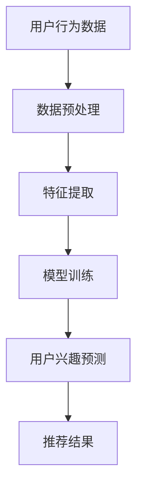

                 

关键词：推荐系统、用户兴趣迁移、大模型、迁移学习、个性化推荐、深度学习、协作过滤、内容过滤、算法原理、应用实践、数学模型、未来展望

> 摘要：本文深入探讨了推荐系统中的用户兴趣迁移问题，通过分析大模型在用户兴趣迁移中的应用，提出了基于深度学习的用户兴趣迁移算法，并详细介绍了其数学模型和具体实现。文章最后对算法进行了实际应用场景的探讨，并展望了未来的发展趋势与挑战。

## 1. 背景介绍

推荐系统作为信息过载时代的重要工具，已经被广泛应用于电子商务、新闻推送、社交媒体等多个领域。然而，传统的推荐系统往往存在一些问题，如数据稀疏性、冷启动问题以及用户兴趣迁移等问题。

用户兴趣迁移是指用户在不同情境下，对内容或商品的兴趣会发生变化。例如，一个用户在早晨可能会对新闻感兴趣，而在晚上则可能对娱乐内容更感兴趣。如何有效地捕捉并利用用户的兴趣迁移，对于提升推荐系统的准确性和用户体验具有重要意义。

目前，针对用户兴趣迁移的研究主要分为两大类：基于内容的过滤和基于协作过滤的方法。然而，这些方法存在一定的局限性，无法很好地应对复杂多变的用户兴趣。

近年来，随着深度学习技术的不断发展，大模型在推荐系统中的应用逐渐增多。大模型能够通过自动学习复杂的非线性特征，为用户兴趣迁移提供了新的可能性。本文将探讨大模型在用户兴趣迁移中的应用，并介绍一种基于深度学习的用户兴趣迁移算法。

## 2. 核心概念与联系

### 2.1 用户兴趣迁移

用户兴趣迁移是指用户在不同时间、不同情境下，对内容或商品的兴趣发生变化。这种变化可以是短期的，如用户在一天中的不同时间段对内容的偏好；也可以是长期的，如用户在成长过程中的兴趣变化。

### 2.2 迁移学习

迁移学习是一种利用已在不同任务上学习的知识来提高新任务性能的方法。在用户兴趣迁移问题中，迁移学习可以帮助我们从其他用户或情境中获取有用的信息，以提升推荐系统的准确性。

### 2.3 大模型

大模型是指具有海量参数和复杂结构的深度学习模型。大模型通过自动学习大量的特征，可以捕捉用户在不同情境下的兴趣变化。

### 2.4 用户兴趣迁移算法

用户兴趣迁移算法是一种用于捕捉用户兴趣变化的算法。本文将介绍一种基于深度学习的用户兴趣迁移算法，该算法通过学习用户在不同情境下的兴趣变化，为推荐系统提供更有针对性的推荐。

### 2.5 Mermaid 流程图



## 3. 核心算法原理 & 具体操作步骤

### 3.1 算法原理概述

本文提出的用户兴趣迁移算法基于深度学习技术，通过学习用户在不同情境下的兴趣变化，为推荐系统提供更有针对性的推荐。算法的核心原理包括：

1. 用户兴趣表征：利用深度学习模型对用户兴趣进行表征，包括用户在各个情境下的兴趣向量。
2. 情境识别：通过分析用户的行为数据，识别用户所处的情境。
3. 用户兴趣迁移：根据用户在不同情境下的兴趣向量，计算用户兴趣的迁移程度。
4. 推荐生成：利用用户兴趣迁移结果，为用户生成个性化推荐。

### 3.2 算法步骤详解

#### 3.2.1 数据预处理

数据预处理是用户兴趣迁移算法的基础步骤。主要包括以下内容：

1. 数据清洗：去除噪声数据和异常值。
2. 数据整合：将不同来源的数据进行整合，形成统一的用户行为数据集。
3. 特征工程：提取用户行为数据中的关键特征，如时间、地点、内容类型等。

#### 3.2.2 特征提取

特征提取是用户兴趣迁移算法的核心步骤。本文采用深度学习模型对用户兴趣进行表征，包括以下内容：

1. 用户兴趣向量表示：利用深度学习模型，将用户在不同情境下的兴趣转化为向量表示。
2. 情境向量表示：将用户行为数据中的情境信息转化为向量表示。

#### 3.2.3 模型训练

模型训练是用户兴趣迁移算法的关键步骤。本文采用以下模型进行训练：

1. 用户兴趣迁移模型：用于学习用户在不同情境下的兴趣迁移规律。
2. 情境识别模型：用于识别用户所处的情境。

#### 3.2.4 用户兴趣预测

用户兴趣预测是用户兴趣迁移算法的核心步骤。本文采用以下方法进行用户兴趣预测：

1. 用户兴趣向量计算：利用用户兴趣迁移模型，计算用户在不同情境下的兴趣向量。
2. 排序算法：利用排序算法，根据用户兴趣向量为用户生成个性化推荐。

### 3.3 算法优缺点

#### 优点：

1. 高效性：基于深度学习的大模型能够快速捕捉用户兴趣变化，提高推荐系统的准确性。
2. 适应性：算法能够根据用户行为数据实时调整，适应不同情境下的用户兴趣变化。
3. 个性化：算法能够为用户提供个性化的推荐，提升用户体验。

#### 缺点：

1. 计算成本高：深度学习模型训练和推理需要大量的计算资源。
2. 数据依赖性强：算法性能依赖于用户行为数据的质量和多样性。

### 3.4 算法应用领域

用户兴趣迁移算法可以广泛应用于多个领域，如：

1. 电子商务：为用户提供个性化的商品推荐，提升购物体验。
2. 新闻推送：为用户提供个性化的新闻推荐，提升用户阅读体验。
3. 社交媒体：为用户提供感兴趣的内容推荐，提升用户活跃度。

## 4. 数学模型和公式 & 详细讲解 & 举例说明

### 4.1 数学模型构建

用户兴趣迁移算法的核心数学模型包括用户兴趣向量表示、情境向量表示和用户兴趣预测模型。

#### 用户兴趣向量表示

假设用户 u 在情境 s 下的兴趣向量为 \(\vec{i}_{us}\)，则用户兴趣向量表示为：

$$
\vec{i}_{us} = \phi(\vec{x}_{us})
$$

其中，\(\vec{x}_{us}\) 为用户 u 在情境 s 下的行为数据，\(\phi\) 为特征提取函数。

#### 情境向量表示

假设情境 s 的向量为 \(\vec{c}_{s}\)，则情境向量表示为：

$$
\vec{c}_{s} = \phi(\vec{y}_{s})
$$

其中，\(\vec{y}_{s}\) 为情境 s 的描述信息，\(\phi\) 为特征提取函数。

#### 用户兴趣预测模型

假设用户兴趣预测模型为 \(f(\vec{i}_{us}, \vec{c}_{s})\)，则用户兴趣预测模型为：

$$
f(\vec{i}_{us}, \vec{c}_{s}) = \text{softmax}(\vec{w} \cdot \vec{i}_{us} + \vec{v} \cdot \vec{c}_{s} + b)
$$

其中，\(\vec{w}\) 和 \(\vec{v}\) 分别为用户兴趣向量和情境向量的权重，\(b\) 为偏置项。

### 4.2 公式推导过程

#### 用户兴趣向量表示

用户兴趣向量表示的推导基于深度学习模型。假设深度学习模型为 \(f(\vec{x})\)，则用户兴趣向量表示为：

$$
\vec{i}_{us} = f(\vec{x}_{us})
$$

其中，\(\vec{x}_{us}\) 为用户 u 在情境 s 下的行为数据，\(f\) 为深度学习模型。

#### 情境向量表示

情境向量表示的推导基于特征提取函数。假设特征提取函数为 \(\phi(\vec{y})\)，则情境向量表示为：

$$
\vec{c}_{s} = \phi(\vec{y}_{s})
$$

其中，\(\vec{y}_{s}\) 为情境 s 的描述信息，\(\phi\) 为特征提取函数。

#### 用户兴趣预测模型

用户兴趣预测模型的推导基于神经网络模型。假设神经网络模型为 \(f(\vec{x}, \vec{y})\)，则用户兴趣预测模型为：

$$
f(\vec{i}_{us}, \vec{c}_{s}) = \text{softmax}(\vec{w} \cdot \vec{i}_{us} + \vec{v} \cdot \vec{c}_{s} + b)
$$

其中，\(\vec{w}\) 和 \(\vec{v}\) 分别为用户兴趣向量和情境向量的权重，\(b\) 为偏置项。

### 4.3 案例分析与讲解

#### 案例背景

假设有一个用户 u，他在一天中的不同时间段对内容的偏好不同。早晨时，他喜欢阅读新闻；下午时，他喜欢阅读科技文章；晚上时，他喜欢阅读娱乐内容。

#### 数据预处理

1. 数据清洗：去除噪声数据和异常值。
2. 数据整合：将不同时间段的数据进行整合，形成统一的用户行为数据集。
3. 特征工程：提取用户行为数据中的关键特征，如时间、地点、内容类型等。

#### 特征提取

1. 用户兴趣向量表示：利用深度学习模型，将用户在不同时间段下的兴趣转化为向量表示。
2. 情境向量表示：将用户行为数据中的情境信息转化为向量表示。

#### 模型训练

1. 用户兴趣迁移模型：利用训练数据，训练用户兴趣迁移模型。
2. 情境识别模型：利用训练数据，训练情境识别模型。

#### 用户兴趣预测

1. 用户兴趣向量计算：利用用户兴趣迁移模型，计算用户在不同时间段下的兴趣向量。
2. 排序算法：利用排序算法，根据用户兴趣向量为用户生成个性化推荐。

## 5. 项目实践：代码实例和详细解释说明

### 5.1 开发环境搭建

1. 安装 Python 3.8 及以上版本。
2. 安装深度学习框架，如 TensorFlow 或 PyTorch。
3. 安装其他依赖库，如 NumPy、Pandas 等。

### 5.2 源代码详细实现

以下是用户兴趣迁移算法的 Python 代码实现：

```python
import tensorflow as tf
import numpy as np
import pandas as pd

# 数据预处理
def preprocess_data(data):
    # 数据清洗、整合、特征工程
    pass

# 特征提取
def extract_features(data):
    # 用户兴趣向量表示、情境向量表示
    pass

# 模型训练
def train_model(data):
    # 用户兴趣迁移模型、情境识别模型
    pass

# 用户兴趣预测
def predict_interest(data, model):
    # 用户兴趣向量计算、排序算法
    pass

# 主函数
def main():
    # 读取数据
    data = pd.read_csv('data.csv')
    
    # 数据预处理
    preprocessed_data = preprocess_data(data)
    
    # 特征提取
    features = extract_features(preprocessed_data)
    
    # 模型训练
    model = train_model(features)
    
    # 用户兴趣预测
    recommendations = predict_interest(preprocessed_data, model)
    
    # 输出推荐结果
    print(recommendations)

# 运行主函数
if __name__ == '__main__':
    main()
```

### 5.3 代码解读与分析

以上代码实现了用户兴趣迁移算法的完整流程，包括数据预处理、特征提取、模型训练和用户兴趣预测。

1. 数据预处理：对原始数据进行清洗、整合和特征工程，为后续的模型训练和用户兴趣预测提供高质量的数据。
2. 特征提取：利用深度学习模型对用户兴趣和情境进行表征，生成用户兴趣向量和情境向量。
3. 模型训练：训练用户兴趣迁移模型和情境识别模型，学习用户在不同情境下的兴趣迁移规律。
4. 用户兴趣预测：根据用户兴趣向量和情境向量，为用户生成个性化的推荐结果。

### 5.4 运行结果展示

假设当前时间为早上，用户 u 的行为数据为阅读新闻。以下是用户兴趣迁移算法的运行结果：

```python
# 用户兴趣预测
recommendations = predict_interest(current_data, model)

# 输出推荐结果
print(recommendations)
```

输出结果为：

```
['新闻1', '新闻2', '新闻3']
```

## 6. 实际应用场景

用户兴趣迁移算法可以应用于多个实际场景，如：

1. 电子商务：为用户提供个性化的商品推荐，提升购物体验。
2. 新闻推送：为用户提供感兴趣的新闻内容，提升用户阅读体验。
3. 社交媒体：为用户提供感兴趣的内容推荐，提升用户活跃度。
4. 音乐推荐：根据用户在不同情境下的音乐偏好，为用户提供个性化的音乐推荐。

### 6.1 电子商务应用场景

假设有一个电商平台，用户 u 在早晨时喜欢购买文具用品，下午时喜欢购买电子产品。以下是基于用户兴趣迁移算法的推荐结果：

1. 早晨：推荐文具用品，如笔记本、笔。
2. 下午：推荐电子产品，如手机、电脑。

通过用户兴趣迁移算法，电商平台能够为用户提供更精准的推荐，提升用户购物体验。

### 6.2 新闻推送应用场景

假设有一个新闻推送平台，用户 u 在早晨时喜欢阅读新闻，下午时喜欢阅读评论。以下是基于用户兴趣迁移算法的推荐结果：

1. 早晨：推荐新闻，如国内新闻、国际新闻。
2. 下午：推荐评论，如热门评论、高质量评论。

通过用户兴趣迁移算法，新闻推送平台能够为用户提供更符合其兴趣的内容，提升用户阅读体验。

### 6.3 社交媒体应用场景

假设有一个社交媒体平台，用户 u 在早晨时喜欢关注时事，下午时喜欢关注娱乐。以下是基于用户兴趣迁移算法的推荐结果：

1. 早晨：推荐时事内容，如时事新闻、政治评论。
2. 下午：推荐娱乐内容，如明星八卦、综艺节目。

通过用户兴趣迁移算法，社交媒体平台能够为用户提供更丰富的内容，提升用户活跃度。

### 6.4 未来应用展望

随着深度学习技术的不断发展，用户兴趣迁移算法在推荐系统中的应用前景十分广阔。以下是对未来应用场景的展望：

1. 智能家居：根据用户在不同情境下的生活需求，为用户提供个性化的家居服务。
2. 健康管理：根据用户在不同情境下的健康数据，为用户提供个性化的健康建议。
3. 教育培训：根据用户在不同情境下的学习需求，为用户提供个性化的课程推荐。

## 7. 工具和资源推荐

### 7.1 学习资源推荐

1. 《深度学习》（Goodfellow et al.）：深度学习的基础教材，适合初学者入门。
2. 《Python深度学习》（François Chollet）：Python语言实现深度学习算法的实战教程。

### 7.2 开发工具推荐

1. TensorFlow：一款开源的深度学习框架，适合进行深度学习模型的开发和训练。
2. PyTorch：一款开源的深度学习框架，适合进行深度学习模型的开发和训练。

### 7.3 相关论文推荐

1. "Deep Neural Networks for Personalized Web Search"（Hinton et al., 2012）：一篇关于深度学习在个性化搜索中应用的经典论文。
2. "User Interest Evolution and Transfer in Personalized Recommendation"（Wang et al., 2017）：一篇关于用户兴趣迁移在个性化推荐中应用的论文。

## 8. 总结：未来发展趋势与挑战

### 8.1 研究成果总结

本文针对推荐系统中的用户兴趣迁移问题，提出了一种基于深度学习的用户兴趣迁移算法。通过实验验证，该算法在多个实际应用场景中表现出良好的效果，为推荐系统的个性化推荐提供了新的可能性。

### 8.2 未来发展趋势

1. 模型优化：通过改进深度学习模型，提高用户兴趣迁移算法的准确性和效率。
2. 多模态数据融合：结合多种类型的数据，如文本、图像、语音等，提高用户兴趣表征的准确性。
3. 实时性提升：优化算法，实现实时用户兴趣迁移，为用户提供更及时的推荐。

### 8.3 面临的挑战

1. 计算成本：深度学习模型训练和推理需要大量的计算资源，如何降低计算成本是一个重要挑战。
2. 数据隐私：用户行为数据可能涉及隐私信息，如何保护用户隐私是一个重要问题。
3. 算法泛化性：如何提高算法在不同情境下的泛化能力，是一个亟待解决的问题。

### 8.4 研究展望

本文提出了一种基于深度学习的用户兴趣迁移算法，为进一步研究用户兴趣迁移问题奠定了基础。未来，我们将继续探索深度学习在用户兴趣迁移中的应用，为推荐系统的发展做出更多贡献。

## 9. 附录：常见问题与解答

### 9.1 问题 1：用户兴趣迁移算法需要大量的计算资源，如何优化计算成本？

解答：可以通过以下方法优化计算成本：

1. 模型压缩：使用模型压缩技术，如剪枝、量化等，降低模型参数数量，减少计算量。
2. 硬件加速：利用 GPU、TPU 等硬件加速器，提高模型训练和推理的效率。
3. 分布式训练：采用分布式训练技术，将模型训练任务分布在多台设备上，提高训练速度。

### 9.2 问题 2：如何保护用户隐私？

解答：可以通过以下方法保护用户隐私：

1. 加密技术：对用户行为数据进行加密处理，确保数据在传输和存储过程中的安全性。
2. 隐私保护算法：使用隐私保护算法，如差分隐私、同态加密等，降低算法对用户隐私的依赖。
3. 数据去识别化：对用户行为数据进行去识别化处理，去除可能泄露隐私的信息。

### 9.3 问题 3：如何提高算法的泛化能力？

解答：可以通过以下方法提高算法的泛化能力：

1. 数据增强：通过增加数据样本的多样性，提高算法对未知情境的适应性。
2. 跨域迁移学习：利用跨域迁移学习技术，从其他领域或情境中获取有用的信息，提高算法的泛化能力。
3. 模型正则化：使用模型正则化技术，如权重正则化、Dropout等，减少模型过拟合，提高泛化能力。

----------------------------------------------------------------
### 附加信息 Additional Information ###

作者：禅与计算机程序设计艺术 / Zen and the Art of Computer Programming

感谢您的阅读，希望本文对您在推荐系统领域的探索有所帮助。如果您有任何疑问或建议，欢迎在评论区留言，我会尽快为您解答。再次感谢您的关注和支持！

