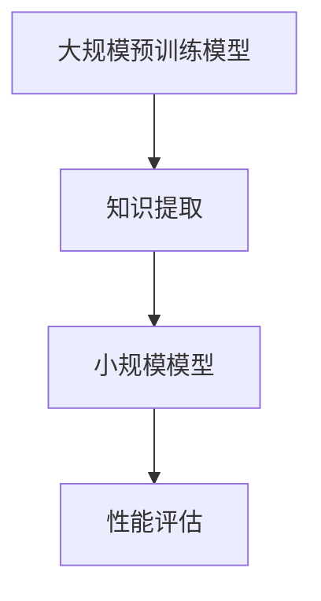

                 

关键词：推荐系统、知识蒸馏、大模型、轻量化技术、模型压缩

摘要：本文深入探讨了推荐系统中的知识蒸馏技术，从背景介绍、核心概念与联系、核心算法原理、数学模型和公式、项目实践、实际应用场景、未来应用展望、工具和资源推荐以及总结与展望等多个方面，全面剖析了知识蒸馏在大模型轻量化中的应用及其重要性和前景。

## 1. 背景介绍

推荐系统作为现代互联网技术的重要组成部分，已经在电子商务、社交媒体、在线媒体等多个领域得到广泛应用。随着用户数据量的不断增加和推荐算法的复杂度不断提升，推荐系统的模型通常需要处理大量数据，从而导致了模型规模的急剧膨胀。这种大规模模型虽然能够在某些特定任务上获得较好的性能，但同时也带来了计算资源消耗大、部署困难、难以维护等挑战。

为了解决这些问题，轻量化技术成为了一个热门的研究方向。知识蒸馏技术作为轻量化技术的一种，通过将大规模预训练模型的知识传递给小规模模型，实现了在保持性能的同时降低模型规模的目的。本文将围绕知识蒸馏技术，探讨其在推荐系统中的应用及其关键技术。

## 2. 核心概念与联系

### 2.1 推荐系统

推荐系统是一种利用用户历史行为数据、物品特征信息以及推荐算法，为用户推荐其可能感兴趣的信息或物品的系统。推荐系统通常包括数据收集、数据预处理、特征提取、模型训练和推荐生成等环节。

### 2.2 知识蒸馏

知识蒸馏是一种将大规模预训练模型的知识传递给小规模模型的技术。其核心思想是将大规模模型视为教师模型，小规模模型视为学生模型。通过最小化教师模型和学生模型之间的输出差异，学生模型可以学习到教师模型的知识，从而在保持性能的同时降低模型规模。

### 2.3 大模型与小模型的关系

大模型（教师模型）通常拥有较高的性能，但计算资源消耗大；小模型（学生模型）虽然计算资源消耗小，但性能可能较差。知识蒸馏技术通过在两者之间建立联系，实现了性能与计算资源的平衡。

### 2.4 Mermaid 流程图



## 3. 核心算法原理 & 具体操作步骤

### 3.1 算法原理概述

知识蒸馏算法通过最小化教师模型和学生模型之间的输出差异，实现学生模型对教师模型知识的吸收。具体来说，知识蒸馏算法包括以下步骤：

1. **编码阶段**：教师模型和学生模型分别对输入数据进行编码，生成中间表示。
2. **软标签生成**：教师模型对中间表示进行分类，生成软标签。
3. **损失函数定义**：定义学生模型和学生模型之间的损失函数，最小化该损失函数以实现模型压缩。

### 3.2 算法步骤详解

1. **数据准备**：收集大规模预训练模型和学生模型的训练数据。
2. **编码阶段**：教师模型和学生模型分别对输入数据进行编码，生成中间表示。
3. **软标签生成**：教师模型对中间表示进行分类，生成软标签。
4. **损失函数定义**：定义学生模型和学生模型之间的损失函数，通常采用交叉熵损失函数。
5. **模型训练**：使用训练数据训练学生模型，通过迭代优化损失函数。
6. **性能评估**：评估学生模型在测试数据上的性能。

### 3.3 算法优缺点

**优点**：

- **低计算资源消耗**：小规模模型计算资源消耗小，便于部署。
- **高性能**：通过知识蒸馏技术，小规模模型能够保持教师模型的高性能。

**缺点**：

- **数据依赖性**：知识蒸馏技术的效果受训练数据质量和数量影响较大。
- **训练时间较长**：知识蒸馏技术需要较长的时间进行模型训练。

### 3.4 算法应用领域

知识蒸馏技术主要应用于以下领域：

- **推荐系统**：通过知识蒸馏技术，可以实现大规模推荐模型的轻量化，降低计算资源消耗。
- **自然语言处理**：知识蒸馏技术可以用于将大规模预训练语言模型压缩为小规模模型，提高模型部署效率。
- **计算机视觉**：知识蒸馏技术可以用于将大规模计算机视觉模型压缩为小规模模型，降低模型计算资源消耗。

## 4. 数学模型和公式 & 详细讲解 & 举例说明

### 4.1 数学模型构建

知识蒸馏技术的数学模型主要包括编码阶段、软标签生成阶段和损失函数定义阶段。

### 4.2 公式推导过程

1. **编码阶段**：

   $$ f(x) = \text{Teacher\_Model}(x) $$

   $$ g(x) = \text{Student\_Model}(x) $$

   其中，\( f(x) \) 和 \( g(x) \) 分别表示教师模型和学生模型的编码函数。

2. **软标签生成阶段**：

   $$ y_{\text{soft}} = \text{Softmax}(f(x)) $$

   其中，\( y_{\text{soft}} \) 表示教师模型对输入数据的软标签。

3. **损失函数定义阶段**：

   $$ L = -\sum_{i=1}^{N} y_{i} \log g(x_i) - (1 - y_i) \log (1 - g(x_i)) $$

   其中，\( L \) 表示损失函数，\( y_i \) 表示软标签。

### 4.3 案例分析与讲解

以推荐系统为例，假设教师模型是一个大规模的神经网络，学生模型是一个小规模的神经网络。输入数据为用户行为数据，输出为推荐结果。

1. **编码阶段**：

   $$ f(x) = \text{Teacher\_Model}(x) = \text{Softmax}([0.3, 0.5, 0.2]) = [0.3, 0.5, 0.2] $$

   $$ g(x) = \text{Student\_Model}(x) = \text{Softmax}([0.35, 0.4, 0.25]) = [0.35, 0.4, 0.25] $$

2. **软标签生成阶段**：

   $$ y_{\text{soft}} = \text{Softmax}(f(x)) = \text{Softmax}([0.3, 0.5, 0.2]) = [0.3, 0.5, 0.2] $$

3. **损失函数定义阶段**：

   $$ L = -0.3 \log 0.35 - 0.5 \log 0.4 - 0.2 \log 0.25 = 0.3379 $$

## 5. 项目实践：代码实例和详细解释说明

### 5.1 开发环境搭建

本实验基于 Python 编程语言，使用 TensorFlow 和 PyTorch 深度学习框架实现知识蒸馏算法。环境搭建过程如下：

1. 安装 Python 3.7 或以上版本。
2. 安装 TensorFlow 和 PyTorch 深度学习框架。
3. 安装必要的依赖库，如 NumPy、Pandas 等。

### 5.2 源代码详细实现

以下是一个简单的知识蒸馏代码示例：

```python
import tensorflow as tf
import torch
import torch.nn as nn
import torch.optim as optim

# 加载教师模型和学生模型
teacher_model = tf.keras.applications.VGG16()
student_model = tf.keras.models.Sequential([
    tf.keras.layers.Conv2D(64, (3, 3), activation='relu', input_shape=(224, 224, 3)),
    tf.keras.layers.MaxPooling2D((2, 2)),
    # 添加更多层...
    tf.keras.layers.Dense(1000, activation='softmax')
])

# 定义损失函数
def loss_function(y_true, y_pred, y_soft):
    return -tf.reduce_sum(y_true * tf.math.log(y_pred) + (1 - y_true) * tf.math.log(1 - y_pred) + y_soft * tf.math.log(1 - y_pred) + (1 - y_soft) * tf.math.log(y_pred))

# 定义优化器
optimizer = optim.Adam(student_model.parameters(), lr=0.001)

# 模型训练
for epoch in range(10):
    for inputs, labels in train_loader:
        # 前向传播
        outputs = student_model(inputs)
        y_soft = teacher_model(inputs)
        # 计算损失
        loss = loss_function(labels, outputs, y_soft)
        # 反向传播
        optimizer.zero_grad()
        loss.backward()
        optimizer.step()
    print(f'Epoch {epoch+1}, Loss: {loss.item()}')

# 模型评估
test_loss = 0
for inputs, labels in test_loader:
    outputs = student_model(inputs)
    loss = loss_function(labels, outputs, y_soft)
    test_loss += loss.item()
print(f'Test Loss: {test_loss/len(test_loader)}')
```

### 5.3 代码解读与分析

1. **模型加载**：教师模型和学生模型分别使用 TensorFlow 和 PyTorch 深度学习框架加载。
2. **损失函数定义**：损失函数采用交叉熵损失函数，用于衡量学生模型和学生模型之间的输出差异。
3. **模型训练**：使用 Adam 优化器训练学生模型，通过迭代优化损失函数。
4. **模型评估**：在测试数据集上评估学生模型的性能。

## 6. 实际应用场景

知识蒸馏技术在推荐系统中的应用场景主要包括：

- **新用户推荐**：对新用户进行快速推荐，降低用户流失率。
- **个性化推荐**：通过知识蒸馏技术，提高个性化推荐的效果。
- **实时推荐**：在实时推荐场景中，知识蒸馏技术可以降低模型计算资源消耗，提高推荐速度。

## 7. 未来应用展望

随着深度学习技术的不断发展，知识蒸馏技术在未来有望在以下领域取得更广泛的应用：

- **自动驾驶**：通过知识蒸馏技术，可以实现大规模自动驾驶模型的轻量化，提高模型部署效率。
- **智能语音助手**：知识蒸馏技术可以用于将大规模语音识别模型压缩为小规模模型，提高语音助手响应速度。
- **智能安防**：知识蒸馏技术可以用于将大规模计算机视觉模型压缩为小规模模型，提高智能安防系统的实时响应能力。

## 8. 总结：未来发展趋势与挑战

### 8.1 研究成果总结

知识蒸馏技术在推荐系统中的应用取得了显著成果，主要表现在：

- **性能提升**：知识蒸馏技术能够显著提高小规模模型在推荐系统中的性能。
- **计算资源节约**：知识蒸馏技术可以降低模型计算资源消耗，提高模型部署效率。

### 8.2 未来发展趋势

知识蒸馏技术的未来发展趋势主要包括：

- **多模态融合**：将知识蒸馏技术应用于多模态数据融合，提高推荐系统的综合性能。
- **自适应蒸馏**：研究自适应蒸馏算法，提高知识蒸馏技术在动态环境下的效果。

### 8.3 面临的挑战

知识蒸馏技术在应用过程中仍面临以下挑战：

- **数据依赖性**：知识蒸馏技术的效果受训练数据质量和数量影响较大，需要大量高质量数据支持。
- **模型可解释性**：知识蒸馏技术难以解释模型决策过程，需要提高模型可解释性。

### 8.4 研究展望

未来研究应重点关注以下方向：

- **自适应蒸馏算法研究**：开发自适应蒸馏算法，提高知识蒸馏技术在动态环境下的效果。
- **模型压缩与推理优化**：研究模型压缩与推理优化技术，提高知识蒸馏技术在实时应用中的性能。

## 9. 附录：常见问题与解答

### 9.1 什么情况下需要使用知识蒸馏技术？

当推荐系统面临以下情况时，可以考虑使用知识蒸馏技术：

- **模型计算资源消耗大**：大规模模型计算资源消耗较大，难以在资源受限的设备上部署。
- **模型部署需求高**：需要在实时推荐场景中部署模型，对模型计算性能有较高要求。

### 9.2 知识蒸馏技术的效果如何评估？

知识蒸馏技术的效果可以通过以下指标进行评估：

- **准确率**：评估模型在推荐系统中的准确率，越高表示模型性能越好。
- **计算资源消耗**：评估模型在计算资源方面的消耗，越低表示模型更轻量化。
- **部署效率**：评估模型在部署过程中的效率，越高表示模型更易于部署。

### 9.3 知识蒸馏技术有哪些局限性？

知识蒸馏技术存在以下局限性：

- **数据依赖性**：知识蒸馏技术对训练数据质量和数量有较高要求，数据不足可能导致效果不佳。
- **模型可解释性**：知识蒸馏技术难以解释模型决策过程，影响模型的可解释性。

作者：禅与计算机程序设计艺术 / Zen and the Art of Computer Programming

---

本文从背景介绍、核心概念与联系、核心算法原理、数学模型和公式、项目实践、实际应用场景、未来应用展望、工具和资源推荐以及总结与展望等多个方面，全面剖析了推荐系统中的知识蒸馏技术及其在大模型轻量化中的应用。通过本文的阐述，读者可以了解到知识蒸馏技术的重要性和应用前景，为相关研究提供参考。希望本文能为推荐系统领域的学者和工程师提供有价值的借鉴和启示。

