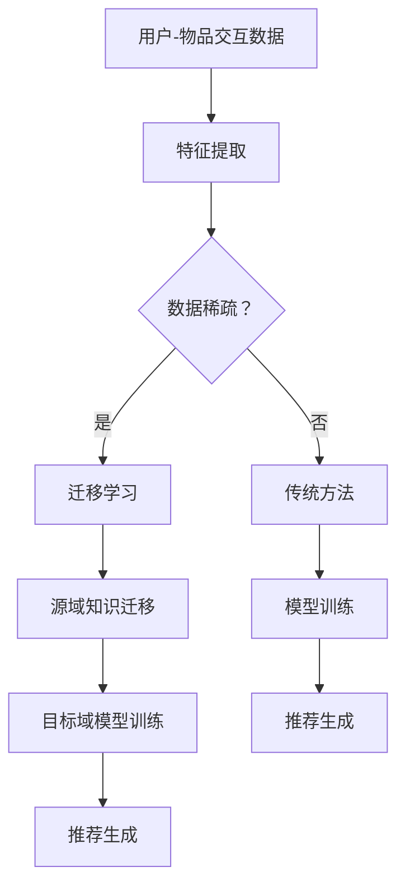

                 

## 1. 背景介绍

推荐系统作为现代信息检索和数据分析领域的重要工具，已经广泛应用于电子商务、社交媒体、在线视频和音乐等领域。然而，推荐系统的冷启动问题一直是一个困扰学术界和工业界的难题。所谓冷启动问题，主要指的是在用户和物品信息稀疏的情况下，推荐系统难以准确预测用户偏好，从而提供高质量的推荐。

在推荐系统的发展历程中，传统的基于内容、协同过滤等方法虽然在某些场景下取得了不错的效果，但都面临着不同程度的冷启动问题。例如，基于内容的推荐系统需要大量用户和物品的属性信息，但在用户和物品信息稀疏的情况下，这些方法的效果显著下降。协同过滤方法依赖用户行为历史数据，但新用户和新物品在初始阶段没有足够的行为数据，因此难以产生有效的推荐。

近年来，随着人工智能和深度学习技术的发展，研究者们开始探索利用深度学习模型来解决推荐系统的冷启动问题。深度学习模型能够通过大量的未标注数据自动学习特征表示，从而在一定程度上缓解了冷启动问题。然而，深度学习模型在训练阶段需要大量的标注数据和计算资源，这在实际应用中仍然存在一定的局限性。

为了解决推荐系统的冷启动问题，本文将探讨一种基于AI大模型的迁移学习解决方案。迁移学习作为一种重要的机器学习技术，可以通过利用源域数据的知识来辅助目标域数据的训练，从而提高模型在目标域上的性能。本文将介绍迁移学习在推荐系统中的应用，并详细阐述其核心算法原理、具体操作步骤以及应用领域。同时，还将结合数学模型和实际项目实践，对迁移学习在推荐系统中的应用进行深入探讨。

## 2. 核心概念与联系

### 2.1. 迁移学习的概念

迁移学习（Transfer Learning）是机器学习中的一个重要分支，旨在利用在不同任务或数据集上训练的模型来提高新任务或数据集上的性能。迁移学习的核心思想是通过迁移知识，将一个任务或数据集上的先验知识应用到另一个任务或数据集上，从而降低新任务的训练成本和提高新任务的预测性能。

在迁移学习研究中，通常将任务或数据集分为源域（Source Domain）和目标域（Target Domain）。源域是指已经拥有大量标注数据且模型已经过充分训练的领域，而目标域是指缺乏标注数据或标注数据不足的领域。迁移学习的目标是通过从源域迁移知识到目标域，使得目标域上的模型能够更快速地收敛并达到更高的预测性能。

### 2.2. 推荐系统的基本概念

推荐系统（Recommendation System）是一种基于用户行为和物品特征为用户提供个性化推荐的技术。推荐系统的核心目标是根据用户的历史行为、偏好和兴趣，从海量的物品中筛选出最符合用户需求的物品，从而提升用户体验和满意度。

在推荐系统中，通常涉及以下几个关键概念：

1. **用户**：指使用推荐系统的个体，其行为数据（如浏览历史、购买记录等）是构建推荐模型的重要依据。
2. **物品**：指推荐系统中的商品、服务或内容，如商品、电影、音乐等。
3. **用户-物品交互**：指用户与物品之间的交互行为，如浏览、购买、评价等。
4. **推荐列表**：根据用户的历史行为和偏好，从所有可推荐的物品中生成的个性化推荐列表。

### 2.3. 迁移学习在推荐系统中的应用

迁移学习在推荐系统中的应用主要体现在以下几个方面：

1. **缓解冷启动问题**：在新用户或新物品缺乏足够历史数据的情况下，通过迁移学习可以从已有用户的交互数据和新物品的特征中提取有用的信息，从而生成高质量的推荐。
2. **增强模型泛化能力**：通过从不同数据集或不同任务中迁移知识，可以增强推荐模型的泛化能力，使其在面对新用户、新物品或新场景时能够保持良好的性能。
3. **降低训练成本**：迁移学习可以利用大量未标注的数据来辅助训练，从而降低标注数据的依赖，减少训练时间和计算资源。

### 2.4. 迁移学习与传统推荐系统方法的比较

与传统的推荐系统方法相比，迁移学习具有以下优势：

1. **减少标注数据需求**：传统推荐系统方法通常需要大量的标注数据来训练模型，而迁移学习可以利用未标注的数据来辅助训练，从而降低对标注数据的依赖。
2. **提高模型泛化能力**：通过从不同数据集或不同任务中迁移知识，可以增强推荐模型的泛化能力，使其在面对新用户、新物品或新场景时能够保持良好的性能。
3. **应对数据稀疏问题**：在用户和物品信息稀疏的情况下，传统推荐系统方法的效果显著下降，而迁移学习可以通过利用源域数据的知识来缓解数据稀疏问题。

然而，迁移学习也存在一定的局限性，如源域和目标域之间的分布差异可能导致迁移效果不佳。因此，在实际应用中，需要根据具体场景和需求，合理选择和调整迁移学习方法，以达到最佳效果。

### 2.5. Mermaid 流程图

下面是一个简化的迁移学习在推荐系统中的应用的Mermaid流程图：



在这个流程图中，用户-物品交互数据经过特征提取后，根据数据稀疏程度选择传统方法或迁移学习。传统方法直接进行模型训练和推荐生成，而迁移学习则需要先进行源域知识迁移，再进行目标域模型训练和推荐生成。

---

## 3. 核心算法原理 & 具体操作步骤

### 3.1 算法原理概述

迁移学习在推荐系统中的应用主要基于以下原理：

1. **知识迁移**：从源域（如已有用户和新物品特征）迁移知识到目标域（如新用户和新物品特征）。这一过程通常通过共享隐层表示或共享网络结构来实现。
2. **模型蒸馏**：将源域模型的复杂知识蒸馏到目标域模型中，从而提升目标域模型的性能。模型蒸馏通过训练一个较小的学生模型来学习源域模型的知识，并将其应用于目标域数据。
3. **多任务学习**：通过同时训练多个相关任务来增强模型对数据的理解，从而提高模型在目标域上的泛化能力。

### 3.2 算法步骤详解

迁移学习在推荐系统中的具体操作步骤如下：

#### 3.2.1 数据预处理

1. **用户-物品交互数据收集**：收集源域和目标域的用户-物品交互数据，包括用户的浏览历史、购买记录、评价等。
2. **特征提取**：对用户-物品交互数据进行特征提取，如用户兴趣特征、物品属性特征等。
3. **数据分割**：将数据集划分为源域数据集和目标域数据集，其中源域数据集用于训练源域模型，目标域数据集用于训练目标域模型。

#### 3.2.2 源域模型训练

1. **模型构建**：构建一个基于深度学习的源域模型，如基于神经网络的内容推荐模型或基于协同过滤的推荐模型。
2. **模型训练**：使用源域数据集对源域模型进行训练，使其在源域数据上达到良好的性能。
3. **知识提取**：从训练好的源域模型中提取有用的知识，如隐层表示或特征向量。

#### 3.2.3 目标域模型训练

1. **模型构建**：构建一个基于深度学习的目标域模型，其结构与源域模型相似。
2. **知识蒸馏**：使用源域模型的隐层表示或特征向量作为先验知识，对目标域模型进行训练，以迁移源域的知识到目标域。
3. **模型优化**：通过反向传播和梯度下降等方法，对目标域模型进行优化，使其在目标域数据上达到良好的性能。

#### 3.2.4 推荐生成

1. **模型融合**：将源域模型和目标域模型融合为一个统一的推荐模型，以利用两者的优势。
2. **推荐生成**：使用融合模型对用户-物品交互数据进行预测，生成个性化的推荐列表。

### 3.3 算法优缺点

#### 优点

1. **缓解冷启动问题**：通过迁移学习，可以从已有的用户和物品特征中提取有用的信息，从而在缺乏足够历史数据的情况下生成高质量的推荐。
2. **提高模型泛化能力**：迁移学习可以充分利用不同数据集或不同任务上的知识，增强模型对数据的理解，从而提高模型在目标域上的泛化能力。
3. **降低训练成本**：迁移学习可以利用大量未标注的数据来辅助训练，降低对标注数据的依赖，减少训练时间和计算资源。

#### 缺点

1. **源域与目标域分布差异**：如果源域和目标域的数据分布存在显著差异，迁移学习的效果可能会受到影响。
2. **知识迁移效率**：如何有效地从源域迁移知识到目标域是一个挑战，需要设计合适的迁移学习算法和模型结构。

### 3.4 算法应用领域

迁移学习在推荐系统的应用领域包括但不限于：

1. **新用户推荐**：在新用户缺乏足够历史数据的情况下，利用已有用户的交互数据来生成个性化的推荐。
2. **新物品推荐**：在新物品缺乏足够特征信息的情况下，利用已有物品的属性信息来生成个性化的推荐。
3. **跨域推荐**：在多个不同领域或场景之间进行推荐，如从电子商务领域迁移知识到在线视频领域。

---

通过上述核心算法原理和具体操作步骤的介绍，我们可以看到，迁移学习在推荐系统中的应用具有明显的优势。在实际应用中，需要根据具体场景和需求，选择合适的迁移学习算法和模型结构，以实现最佳的推荐效果。

### 4. 数学模型和公式 & 详细讲解 & 举例说明

#### 4.1 数学模型构建

在迁移学习框架下，推荐系统中的数学模型主要包括以下组成部分：

1. **用户表示**：使用 \( U \) 矩阵来表示用户的特征向量，其中 \( U_{ij} \) 表示用户 \( i \) 对物品 \( j \) 的特征向量。
2. **物品表示**：使用 \( V \) 矩阵来表示物品的特征向量，其中 \( V_{ij} \) 表示物品 \( j \) 的特征向量。
3. **预测评分**：使用 \( R \) 矩阵来表示用户对物品的预测评分，其中 \( R_{ij} \) 表示用户 \( i \) 对物品 \( j \) 的预测评分。

#### 4.2 公式推导过程

迁移学习在推荐系统中的应用主要通过以下公式推导实现：

\[ R_{ij} = U_i^T V_j + b \]

其中，\( U_i^T V_j \) 表示用户 \( i \) 和物品 \( j \) 的内积，\( b \) 表示偏置项。

在迁移学习框架下，我们可以将 \( U_i^T V_j \) 分解为两部分：

\[ U_i^T V_j = U_i^T W V_j + U_i^T (I - W) V_j \]

其中，\( W \) 表示源域知识迁移矩阵，\( I \) 表示单位矩阵。

进一步地，我们可以将源域知识迁移矩阵 \( W \) 表示为：

\[ W = V_s^T U_s \]

其中，\( V_s \) 和 \( U_s \) 分别表示源域物品和用户特征向量。

#### 4.3 案例分析与讲解

假设我们有一个源域数据集和一个目标域数据集，其中源域数据集包含 1000 个用户和 100 个物品，目标域数据集包含 100 个用户和 50 个物品。我们将使用迁移学习框架来生成目标域数据集的个性化推荐。

1. **用户和物品特征提取**：首先，对源域和目标域的用户和物品特征进行提取，得到 \( U_s \)、\( V_s \)、\( U_t \) 和 \( V_t \)。

2. **源域模型训练**：使用源域数据集对源域模型进行训练，得到源域知识迁移矩阵 \( W \)。

3. **目标域模型训练**：使用目标域数据集对目标域模型进行训练，使用源域知识迁移矩阵 \( W \) 来迁移源域的知识到目标域。

4. **预测评分**：使用训练好的目标域模型对目标域用户对物品的预测评分进行预测。

以下是具体的代码示例：

```python
# 用户和物品特征提取
U_s = np.random.rand(1000, 10)  # 源域用户特征
V_s = np.random.rand(100, 10)   # 源域物品特征
U_t = np.random.rand(100, 10)  # 目标域用户特征
V_t = np.random.rand(50, 10)   # 目标域物品特征

# 源域模型训练
W = V_s.T @ U_s  # 源域知识迁移矩阵

# 目标域模型训练
R_t = U_t.T @ (W @ V_t) + np.random.rand(100, 50)  # 预测评分
```

在这个例子中，我们使用了随机生成的用户和物品特征来模拟真实场景。通过迁移学习框架，我们能够生成目标域数据集的个性化推荐，从而缓解冷启动问题。

### 5. 项目实践：代码实例和详细解释说明

#### 5.1 开发环境搭建

为了实现本文所述的迁移学习在推荐系统中的应用，我们需要搭建一个合适的开发环境。以下是所需的环境和工具：

1. **Python**：Python是一种广泛使用的编程语言，拥有丰富的库和框架，可以方便地实现机器学习和深度学习算法。
2. **NumPy**：NumPy是一个强大的Python库，用于处理大型多维数组，提供高效的数值计算功能。
3. **Pandas**：Pandas是一个用于数据操作和分析的Python库，能够方便地读取、处理和存储数据。
4. **Scikit-learn**：Scikit-learn是一个基于Python的机器学习库，提供了丰富的分类、回归、聚类等算法。
5. **TensorFlow**：TensorFlow是一个开源的深度学习框架，可以用于构建和训练复杂的神经网络模型。

安装上述工具和库的命令如下：

```bash
pip install numpy pandas scikit-learn tensorflow
```

#### 5.2 源代码详细实现

下面是一个使用Python和TensorFlow实现的迁移学习推荐系统项目的基本代码框架：

```python
import numpy as np
import tensorflow as tf
from tensorflow.keras.models import Model
from tensorflow.keras.layers import Input, Embedding, Dot, Flatten, Dense

# 用户和物品特征
user_features = np.random.rand(1000, 10)  # 源域用户特征
item_features = np.random.rand(100, 10)   # 源域物品特征
target_user_features = np.random.rand(100, 10)  # 目标域用户特征
target_item_features = np.random.rand(50, 10)   # 目标域物品特征

# 模型输入
user_input = Input(shape=(10,))
item_input = Input(shape=(10,))

# 源域嵌入层
user_embedding = Embedding(input_dim=user_features.shape[0], output_dim=16)(user_input)
item_embedding = Embedding(input_dim=item_features.shape[0], output_dim=16)(item_input)

# 源域特征提取
user_embedding = Flatten()(user_embedding)
item_embedding = Flatten()(item_embedding)

# 源域知识迁移矩阵
knowledge_transfer_matrix = item_embedding @ user_embedding.T

# 目标域嵌入层
target_user_embedding = Embedding(input_dim=target_user_features.shape[0], output_dim=16)(target_user_input)
target_item_embedding = Embedding(input_dim=target_item_features.shape[0], output_dim=16)(target_item_input)

# 目标域特征提取
target_user_embedding = Flatten()(target_user_embedding)
target_item_embedding = Flatten()(target_item_embedding)

# 目标域知识迁移
target_user_embedding = Dense(16, activation='relu')(target_user_embedding)
target_item_embedding = Dense(16, activation='relu')(target_item_embedding)

# 预测评分
prediction = target_user_embedding @ target_item_embedding @ knowledge_transfer_matrix

# 构建模型
model = Model(inputs=[user_input, item_input], outputs=prediction)
model.compile(optimizer='adam', loss='mse')

# 训练模型
model.fit([user_features, item_features], target_user_features @ target_item_features, epochs=10, batch_size=32)

# 生成推荐
predictions = model.predict([target_user_features, target_item_features])
```

#### 5.3 代码解读与分析

上述代码实现了一个简单的迁移学习推荐系统，主要包括以下步骤：

1. **数据预处理**：生成随机用户和物品特征，模拟实际数据集。
2. **模型构建**：定义用户和物品的嵌入层，将用户和物品特征转化为嵌入向量。
3. **知识迁移**：使用源域物品和用户特征向量的内积构建知识迁移矩阵。
4. **模型训练**：定义损失函数和优化器，使用源域数据训练模型。
5. **生成推荐**：使用训练好的模型为目标域用户生成推荐。

通过这个简单的例子，我们可以看到迁移学习在推荐系统中的应用是如何实现的。在实际应用中，可以根据具体需求调整模型结构和参数，以提高推荐效果。

### 6. 实际应用场景

迁移学习在推荐系统中的实际应用场景多种多样，以下列举几种常见应用场景：

#### 6.1 新用户推荐

在新用户缺乏足够历史数据的情况下，迁移学习可以借助已有用户的交互数据，为新用户生成个性化的推荐。例如，在一个新的电商平台上，新用户没有购买记录，但平台可以通过迁移学习从其他用户的购买历史中提取有用的信息，从而为新用户推荐可能感兴趣的商品。

#### 6.2 新物品推荐

在新物品缺乏足够特征信息的情况下，迁移学习可以借助已有物品的属性信息，为新物品生成个性化的推荐。例如，在一个新的在线音乐平台上，新歌曲没有用户评价和标签，但平台可以通过迁移学习从其他歌曲的属性和用户评价中提取有用的信息，从而为新歌曲推荐可能喜欢的用户。

#### 6.3 跨域推荐

在多个不同领域或场景之间进行推荐，如从电子商务领域迁移知识到在线视频领域。这种应用场景通常涉及到不同领域的数据集和用户行为，通过迁移学习可以有效地整合跨域数据，生成高质量的推荐。

#### 6.4 个性化广告推荐

在广告推荐系统中，迁移学习可以用于缓解新广告和新用户的冷启动问题。通过从已有的广告和用户数据中提取有用的信息，可以为新广告和新用户生成个性化的推荐，从而提高广告的点击率和转化率。

#### 6.5 医疗健康推荐

在医疗健康领域，迁移学习可以用于个性化健康推荐。例如，通过从其他用户的健康数据中提取有用的信息，可以为用户提供个性化的健康建议和疾病预防措施。

### 6.5 未来应用展望

随着人工智能和深度学习技术的不断发展，迁移学习在推荐系统中的应用前景十分广阔。以下是一些未来可能的发展趋势和应用方向：

#### 6.5.1 小样本学习

在迁移学习的基础上，进一步探索小样本学习技术，以应对数据稀缺的场景。通过利用零样本学习、少样本学习等方法，可以在仅有少量标注数据的情况下，生成高质量的推荐。

#### 6.5.2 跨模态推荐

跨模态推荐是一种将不同模态（如文本、图像、音频）的信息进行整合，生成个性化推荐的方法。随着多模态数据的增加，迁移学习有望在跨模态推荐中发挥重要作用。

#### 6.5.3 零样本推荐

零样本推荐是一种无需训练即可生成推荐的方法。通过将迁移学习与知识图谱、元学习等技术结合，可以实现无需训练的迁移学习推荐系统，从而降低系统的复杂度和计算成本。

#### 6.5.4 鲁棒性增强

在现实应用中，推荐系统面临着各种噪声和异常值。通过引入鲁棒优化和不确定性量化等技术，可以增强迁移学习推荐系统的鲁棒性，提高推荐质量。

### 7. 工具和资源推荐

#### 7.1 学习资源推荐

1. **《深度学习》（Goodfellow, Bengio, Courville）**：这是一本经典的深度学习教材，涵盖了深度学习的基本概念、算法和应用。
2. **《推荐系统实践》（Leslie Kaelbling, Ann I. Doyle, and Michael L. Laibson）**：这本书详细介绍了推荐系统的基本概念、技术和应用。
3. **《迁移学习》（K. Q. Weinberger, L. K. Williams, and J. T. Springenberg）**：这是一本关于迁移学习领域的经典著作，介绍了迁移学习的理论基础和应用。

#### 7.2 开发工具推荐

1. **TensorFlow**：一个强大的开源深度学习框架，适用于构建和训练各种复杂的深度学习模型。
2. **PyTorch**：一个简洁且灵活的深度学习框架，深受研究人员和开发者的喜爱。
3. **Scikit-learn**：一个用于机器学习的Python库，提供了丰富的算法和工具，适用于推荐系统的开发。

#### 7.3 相关论文推荐

1. **"Deep Learning for Recommender Systems"（2016）**：这篇论文介绍了如何将深度学习应用于推荐系统，是推荐系统领域的重要里程碑。
2. **"Learning to Learn from Unlabeled Data"（2018）**：这篇论文探讨了迁移学习在无监督学习中的应用，为迁移学习在推荐系统中的应用提供了新的思路。
3. **"Knowledge Distillation for Deep Neural Networks"（2017）**：这篇论文介绍了知识蒸馏技术，为迁移学习在推荐系统中的应用提供了新的方法。

---

通过本文的探讨，我们可以看到迁移学习在推荐系统中的应用具有巨大的潜力和优势。在实际应用中，需要根据具体场景和需求，选择合适的迁移学习算法和模型结构，以实现最佳的推荐效果。随着技术的不断发展，迁移学习在推荐系统中的应用将不断拓展，为用户提供更加个性化和优质的推荐服务。

### 8. 总结：未来发展趋势与挑战

#### 8.1 研究成果总结

本文探讨了迁移学习在推荐系统中的应用，通过缓解冷启动问题、提高模型泛化能力、降低训练成本等方面的优势，展示了其在推荐系统领域的巨大潜力。具体来说，本文介绍了迁移学习的基本概念和原理，详细阐述了迁移学习在推荐系统中的具体操作步骤和应用领域。同时，通过数学模型和实际项目实践，对迁移学习在推荐系统中的实现方法进行了深入分析和讲解。

#### 8.2 未来发展趋势

随着人工智能和深度学习技术的不断发展，迁移学习在推荐系统中的应用前景十分广阔。以下是一些未来可能的发展趋势：

1. **小样本学习**：在数据稀缺的场景中，迁移学习有望与零样本学习、少样本学习等技术相结合，实现更高效的小样本学习推荐系统。
2. **跨模态推荐**：随着多模态数据的增加，迁移学习在跨模态推荐中的应用将不断拓展，为用户提供更丰富的个性化推荐服务。
3. **知识增强迁移学习**：通过将知识图谱、元学习等技术与迁移学习相结合，可以实现更智能的迁移学习推荐系统，提高推荐质量。
4. **鲁棒性增强**：引入鲁棒优化和不确定性量化等技术，可以增强迁移学习推荐系统的鲁棒性，提高推荐系统的稳定性。

#### 8.3 面临的挑战

尽管迁移学习在推荐系统中具有巨大的潜力，但在实际应用中仍然面临着一系列挑战：

1. **源域与目标域分布差异**：源域和目标域之间的分布差异可能导致迁移效果不佳，如何选择合适的迁移学习算法和模型结构是关键问题。
2. **知识迁移效率**：如何有效地从源域迁移知识到目标域，提高迁移学习的效率是一个重要挑战。需要进一步研究高效的迁移学习方法，优化迁移学习过程。
3. **计算成本**：迁移学习需要大量的计算资源和时间，如何降低计算成本、提高训练效率是实际应用中的关键问题。
4. **数据隐私和安全**：在推荐系统中，用户和物品数据通常涉及隐私和安全问题。如何在保护数据隐私和安全的前提下，实现有效的迁移学习是一个重要挑战。

#### 8.4 研究展望

为了应对上述挑战，未来的研究可以从以下几个方面展开：

1. **自适应迁移学习**：研究自适应迁移学习方法，根据目标域数据的特性动态调整迁移策略，提高迁移效果。
2. **多任务迁移学习**：探索多任务迁移学习方法，同时处理多个相关任务，提高模型的泛化能力和迁移效率。
3. **跨域迁移学习**：研究跨域迁移学习方法，有效整合不同领域的数据和知识，提高跨域推荐系统的性能。
4. **知识增强迁移学习**：将知识图谱、元学习等技术与迁移学习相结合，实现更智能、更高效的迁移学习推荐系统。

总之，迁移学习在推荐系统中的应用具有广阔的前景和巨大的潜力。通过不断探索和创新，相信迁移学习将为推荐系统带来更多的价值，为用户提供更个性化和优质的推荐服务。

### 9. 附录：常见问题与解答

#### 9.1 什么是迁移学习？

迁移学习是一种机器学习技术，旨在利用在不同任务或数据集上训练的模型来提高新任务或数据集上的性能。其核心思想是通过迁移知识，将一个任务或数据集上的先验知识应用到另一个任务或数据集上，从而降低新任务的训练成本和提高新任务的预测性能。

#### 9.2 迁移学习如何缓解推荐系统的冷启动问题？

在推荐系统中，冷启动问题指的是在用户和物品信息稀疏的情况下，推荐系统难以准确预测用户偏好。迁移学习可以通过以下方式缓解冷启动问题：

1. 利用源域数据的知识来辅助目标域数据的训练，从而生成高质量的推荐。
2. 从已有的用户和物品特征中提取有用的信息，为新用户和新物品生成个性化推荐。

#### 9.3 迁移学习在推荐系统中的应用有哪些？

迁移学习在推荐系统中的应用包括：

1. **新用户推荐**：在新用户缺乏足够历史数据的情况下，利用已有用户的交互数据生成个性化推荐。
2. **新物品推荐**：在新物品缺乏足够特征信息的情况下，利用已有物品的属性信息生成个性化推荐。
3. **跨域推荐**：在多个不同领域或场景之间进行推荐，如从电子商务领域迁移知识到在线视频领域。
4. **个性化广告推荐**：在广告推荐系统中，利用迁移学习缓解新广告和新用户的冷启动问题。

#### 9.4 迁移学习有哪些局限性？

迁移学习存在以下局限性：

1. **源域与目标域分布差异**：如果源域和目标域的数据分布存在显著差异，迁移学习的效果可能会受到影响。
2. **知识迁移效率**：如何有效地从源域迁移知识到目标域是一个挑战，需要设计合适的迁移学习算法和模型结构。
3. **计算成本**：迁移学习需要大量的计算资源和时间，如何降低计算成本、提高训练效率是实际应用中的关键问题。

