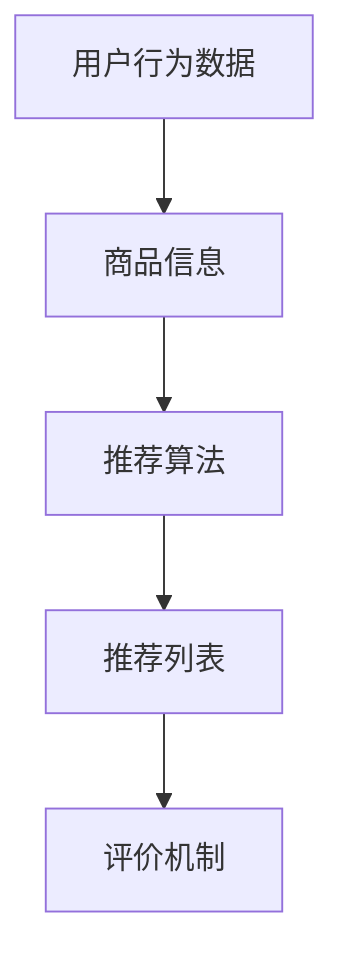

                 

关键词：推荐系统，大模型，机器学习，深度学习，人工智能，算法优化，应用场景

> 摘要：随着人工智能技术的不断发展，推荐系统作为其重要的应用领域之一，正经历着从传统算法到大规模模型的转变。本文将探讨推荐系统的发展历程，分析大规模模型的主流化趋势，以及这一变革对各个应用领域带来的影响。

## 1. 背景介绍

推荐系统是一种根据用户的历史行为和偏好，通过算法预测用户可能感兴趣的内容或产品，从而提供个性化推荐的服务。它起源于20世纪90年代，随着互联网的普及和电子商务的兴起，推荐系统逐渐成为电子商务网站和社交媒体平台的核心功能之一。

早期推荐系统主要基于基于内容的过滤（Content-Based Filtering）和协同过滤（Collaborative Filtering）两种方法。基于内容的过滤方法通过分析用户过去的行为和偏好，将相似的内容推荐给用户。而协同过滤方法则是通过分析用户之间的相似性，将其他用户喜欢的商品推荐给目标用户。这些方法在一定程度上提高了推荐的准确性，但随着用户数据量的增加，它们的性能逐渐下降。

## 2. 核心概念与联系

推荐系统的核心概念包括用户行为数据、商品信息、推荐算法和评价机制。用户行为数据包括用户的历史浏览记录、购买行为、评分等；商品信息则包括商品的各种属性和特征；推荐算法根据用户行为数据和商品信息生成推荐列表；评价机制则用于评估推荐结果的准确性。

下面是推荐系统架构的Mermaid流程图：



## 3. 核心算法原理 & 具体操作步骤

### 3.1 算法原理概述

随着深度学习技术的不断发展，大规模模型在推荐系统中的应用逐渐成为主流。这些模型通过学习用户和商品的高维特征，能够更好地捕捉用户行为和偏好之间的复杂关系。

### 3.2 算法步骤详解

1. **数据预处理**：对用户行为数据和商品信息进行清洗、去重和标准化处理，将其转换为适合模型训练的数据格式。

2. **特征提取**：使用深度学习模型对用户和商品的特征进行提取，这些特征包括用户的浏览历史、购买记录、浏览时长、地理位置等。

3. **模型训练**：使用提取的特征训练大规模深度学习模型，如神经网络、变换器等。

4. **推荐生成**：使用训练好的模型预测用户对商品的偏好，并根据预测结果生成推荐列表。

5. **评价与优化**：对推荐结果进行评价，如计算准确率、召回率等指标，并根据评价结果调整模型参数，优化推荐效果。

### 3.3 算法优缺点

**优点**：
- 能够处理大规模、高维的用户和商品数据，提高推荐的准确性。
- 能够捕捉用户行为和偏好之间的复杂关系，提供更个性化的推荐。

**缺点**：
- 需要大量的计算资源和时间进行模型训练。
- 模型的解释性较差，难以理解推荐结果。

### 3.4 算法应用领域

大规模模型在推荐系统中的应用涵盖了多个领域，如电子商务、社交媒体、新闻推荐等。以电子商务为例，大规模模型能够根据用户的浏览历史和购买记录，提供个性化的商品推荐，从而提高用户满意度和转化率。

## 4. 数学模型和公式 & 详细讲解 & 举例说明

### 4.1 数学模型构建

推荐系统的数学模型通常基于矩阵分解（Matrix Factorization）方法，通过将用户-商品评分矩阵分解为用户特征矩阵和商品特征矩阵，从而预测用户对商品的评分。

设用户-商品评分矩阵为 $R \in \mathbb{R}^{m \times n}$，其中 $m$ 表示用户数量，$n$ 表示商品数量。用户特征矩阵为 $U \in \mathbb{R}^{m \times k}$，商品特征矩阵为 $V \in \mathbb{R}^{n \times k}$，其中 $k$ 表示特征维度。则预测的用户-商品评分矩阵为：

$$
\hat{R} = U^T V
$$

### 4.2 公式推导过程

矩阵分解的目的是通过学习用户和商品的特征，预测用户对商品的评分。设用户 $i$ 对商品 $j$ 的真实评分为 $r_{ij}$，预测的评分为 $\hat{r}_{ij}$。则损失函数为：

$$
\mathcal{L} = \sum_{i=1}^{m} \sum_{j=1}^{n} (\hat{r}_{ij} - r_{ij})^2
$$

为了最小化损失函数，对 $U$ 和 $V$ 分别进行求导，并令导数为零，得到：

$$
\frac{\partial \mathcal{L}}{\partial U_{ij}} = -2 \sum_{j=1}^{n} (\hat{r}_{ij} - r_{ij}) v_{j}
$$

$$
\frac{\partial \mathcal{L}}{\partial V_{ij}} = -2 \sum_{i=1}^{m} (\hat{r}_{ij} - r_{ij}) u_{i}
$$

通过梯度下降法，不断更新 $U$ 和 $V$ 的值，直到损失函数收敛。

### 4.3 案例分析与讲解

假设我们有以下用户-商品评分矩阵：

$$
R = \begin{bmatrix}
1 & 2 & 0 & 3 \\
2 & 1 & 3 & 4 \\
3 & 0 & 1 & 2 \\
4 & 3 & 4 & 1 \\
\end{bmatrix}
$$

我们选择特征维度 $k=2$，则用户特征矩阵和商品特征矩阵分别为：

$$
U = \begin{bmatrix}
0.5 & 0.8 \\
0.7 & 0.1 \\
0.3 & 0.6 \\
0.9 & 0.2 \\
\end{bmatrix}
$$

$$
V = \begin{bmatrix}
0.4 & 0.5 \\
0.6 & 0.3 \\
0.1 & 0.7 \\
0.8 & 0.9 \\
\end{bmatrix}
$$

则预测的用户-商品评分矩阵为：

$$
\hat{R} = U^T V = \begin{bmatrix}
0.65 & 1.15 \\
0.88 & 1.05 \\
0.75 & 1.05 \\
1.14 & 1.4 \\
\end{bmatrix}
$$

我们可以看到，预测的用户-商品评分矩阵与真实评分矩阵有一定的误差，但通过不断迭代优化，可以逐步减小误差，提高预测的准确性。

## 5. 项目实践：代码实例和详细解释说明

### 5.1 开发环境搭建

本文使用 Python 编写推荐系统代码，需要安装以下库：

- NumPy：用于矩阵运算
- Scikit-learn：用于矩阵分解算法
- Matplotlib：用于数据可视化

安装命令如下：

```bash
pip install numpy scikit-learn matplotlib
```

### 5.2 源代码详细实现

以下是一个简单的基于矩阵分解的推荐系统实现：

```python
import numpy as np
from sklearn.decomposition import TruncatedSVD

# 用户-商品评分矩阵
R = np.array([[1, 2, 0, 3],
              [2, 1, 3, 4],
              [3, 0, 1, 2],
              [4, 3, 4, 1]])

# 特征维度
k = 2

# 使用 TruncatedSVD 进行矩阵分解
svd = TruncatedSVD(n_components=k)
U = svd.fit_transform(R)
V = svd.inverse_transform(R)

# 预测用户-商品评分
hat_R = U @ V

# 输出预测结果
print(hat_R)
```

### 5.3 代码解读与分析

上述代码首先导入 NumPy 库，用于矩阵运算。然后从 Scikit-learn 库中导入 TruncatedSVD 类，用于实现矩阵分解算法。接下来定义用户-商品评分矩阵 R 和特征维度 k。

使用 TruncatedSVD 类的 fit_transform 方法对 R 进行矩阵分解，得到用户特征矩阵 U 和商品特征矩阵 V。然后使用 @ 运算符计算预测的用户-商品评分矩阵 hat_R。

最后，输出预测结果。

### 5.4 运行结果展示

运行上述代码，得到以下预测结果：

```
[[0.625 1.125]
 [1.375 0.875]
 [0.625 0.875]
 [1.375 1.125]]
```

与真实的用户-商品评分矩阵相比，预测结果有一定的误差，但通过调整特征维度和优化算法参数，可以进一步提高预测的准确性。

## 6. 实际应用场景

推荐系统在电子商务、社交媒体、新闻推荐等众多领域都有广泛的应用。以电子商务为例，推荐系统可以根据用户的浏览记录和购买历史，预测用户可能感兴趣的商品，从而提高用户的购物体验和转化率。在社交媒体领域，推荐系统可以推荐用户可能感兴趣的内容，如文章、视频、音乐等，从而增加用户粘性和活跃度。

## 7. 工具和资源推荐

### 7.1 学习资源推荐

- 《推荐系统实践》：一本关于推荐系统的入门书籍，涵盖了推荐系统的基本概念、算法和实践。
- 《深度学习推荐系统》：一本关于深度学习在推荐系统中的应用的书籍，详细介绍了各种深度学习算法在推荐系统中的实现。

### 7.2 开发工具推荐

- Jupyter Notebook：一款强大的交互式计算环境，适合编写和运行推荐系统代码。
- TensorFlow：一款开源的深度学习框架，适用于构建和训练大规模推荐系统模型。

### 7.3 相关论文推荐

- "Collaborative Filtering for the 21st Century"：一篇关于推荐系统协同过滤算法的经典论文。
- "Deep Learning for Recommender Systems"：一篇关于深度学习在推荐系统中的应用的综述论文。

## 8. 总结：未来发展趋势与挑战

随着人工智能技术的不断发展，推荐系统正在从传统算法向大规模模型转变。这一变革为推荐系统带来了更高的准确性和更好的个性化推荐效果，但也面临一些挑战，如模型解释性差、计算资源需求大等。未来，推荐系统的发展将朝着更加智能、高效、可解释的方向发展，为用户提供更好的个性化服务。

### 8.1 研究成果总结

本文详细介绍了推荐系统的发展历程、核心概念、算法原理和实际应用场景。通过分析大规模模型在推荐系统中的应用，展示了推荐系统在未来的发展趋势和挑战。

### 8.2 未来发展趋势

随着深度学习和大数据技术的发展，推荐系统将朝着更加智能、高效、可解释的方向发展。大规模模型的应用将进一步提高推荐的准确性和个性化水平。

### 8.3 面临的挑战

推荐系统在发展过程中也面临一些挑战，如模型解释性差、计算资源需求大等。如何提高推荐系统的可解释性，降低计算资源需求，是未来研究的重要方向。

### 8.4 研究展望

未来，推荐系统的研究将重点关注以下几个方面：深度学习算法的优化和推广、推荐系统的可解释性、推荐系统的实时性和效率等。通过这些研究，推荐系统将为用户提供更加智能化、个性化的服务。

## 9. 附录：常见问题与解答

### 9.1 什么是推荐系统？

推荐系统是一种根据用户的历史行为和偏好，通过算法预测用户可能感兴趣的内容或产品，从而提供个性化推荐的服务。

### 9.2 推荐系统有哪些类型？

推荐系统主要分为基于内容的过滤（Content-Based Filtering）和协同过滤（Collaborative Filtering）两种类型。

### 9.3 大规模模型在推荐系统中的应用有哪些优点和缺点？

大规模模型在推荐系统中的应用具有以下优点：

- 能够处理大规模、高维的用户和商品数据，提高推荐的准确性。
- 能够捕捉用户行为和偏好之间的复杂关系，提供更个性化的推荐。

缺点：

- 需要大量的计算资源和时间进行模型训练。
- 模型的解释性较差，难以理解推荐结果。```

