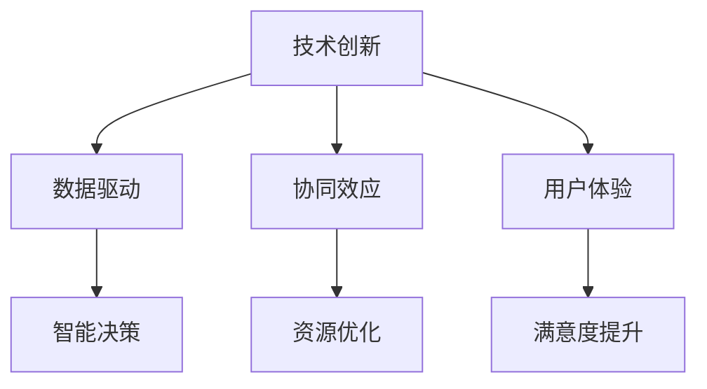

                 

关键词：核心竞争力、新质生产力、技术革新、生产力提升、算法优化、数学模型、项目实践、应用场景、未来展望

> 摘要：本文将深入探讨如何通过新质生产力来提升企业的核心竞争力。我们将分析当前技术环境下的关键算法原理，数学模型及其应用，并通过具体项目实践，展示如何在实际开发中提升生产力。同时，我们将展望未来应用场景，探讨面临的挑战与机遇，以及如何为未来做好准备。

## 1. 背景介绍

在全球化的背景下，企业面临的竞争日益激烈。传统的竞争策略已经不再适用，企业需要寻找新的增长点。新质生产力，作为一种新兴的概念，正在成为提升企业核心竞争力的关键因素。新质生产力不仅指生产效率的提升，更强调创新能力和技术水平的提升。

近年来，人工智能、大数据、云计算等技术的迅猛发展，为新质生产力的实现提供了可能。这些技术不仅改变了传统的生产方式，还推动了企业业务模式的创新。因此，掌握和应用新质生产力，已经成为企业突破发展瓶颈，实现持续增长的关键。

## 2. 核心概念与联系

### 2.1 核心概念

新质生产力的核心概念包括以下几点：

- **技术创新**：通过引入新技术，提高生产效率和产品质量。
- **数据驱动**：利用大数据分析，优化决策过程，实现智能化管理。
- **协同效应**：通过跨部门、跨领域的合作，实现资源的最大化利用。
- **用户体验**：以用户需求为中心，提供个性化、高质量的解决方案。

### 2.2 核心概念联系

新质生产力各个概念之间存在着紧密的联系。技术创新是提升生产力的基础，而数据驱动和协同效应则是技术创新的具体实现方式。用户体验则是衡量新质生产力效果的重要指标。

下面是一个使用Mermaid绘制的流程图，展示了新质生产力的核心概念及其联系：



## 3. 核心算法原理 & 具体操作步骤

### 3.1 算法原理概述

新质生产力中的核心算法包括机器学习算法、深度学习算法、优化算法等。这些算法通过对大量数据进行处理和分析，实现了对生产过程的优化。

- **机器学习算法**：通过训练模型，实现对数据的自动分类、预测和决策。
- **深度学习算法**：利用神经网络，实现对复杂模式的识别和学习。
- **优化算法**：通过数学优化方法，寻找问题的最优解。

### 3.2 算法步骤详解

下面以机器学习算法为例，详细说明其操作步骤：

1. **数据收集**：收集相关领域的数据，包括输入数据和标签数据。
2. **数据预处理**：对数据进行清洗、归一化等处理，以提高数据的质量。
3. **特征提取**：从原始数据中提取有用的特征，用于训练模型。
4. **模型训练**：使用训练数据集，训练机器学习模型。
5. **模型评估**：使用测试数据集，评估模型的性能。
6. **模型部署**：将训练好的模型部署到生产环境中，实现自动化决策。

### 3.3 算法优缺点

- **优点**：
  - 高效：机器学习算法能够自动处理大量数据，提高生产效率。
  - 灵活：能够适应不同的业务场景，实现个性化解决方案。
- **缺点**：
  - 复杂：算法的实现和调优需要较高的技术门槛。
  - 数据依赖：算法的性能受数据质量和数量的影响较大。

### 3.4 算法应用领域

机器学习算法在多个领域都有广泛的应用，如金融、医疗、零售等。下面以金融领域为例，介绍其应用场景：

- **风险管理**：使用机器学习算法对金融市场的风险进行预测和评估。
- **欺诈检测**：通过分析交易数据，检测潜在的欺诈行为。
- **客户服务**：利用机器学习算法，提供个性化的客户服务，提升用户体验。

## 4. 数学模型和公式 & 详细讲解 & 举例说明

### 4.1 数学模型构建

数学模型是解决复杂问题的重要工具。在新质生产力中，常见的数学模型包括线性回归模型、逻辑回归模型、神经网络模型等。

以线性回归模型为例，其数学模型如下：

$$
y = \beta_0 + \beta_1 \cdot x
$$

其中，$y$ 是预测值，$x$ 是输入特征，$\beta_0$ 和 $\beta_1$ 是模型的参数。

### 4.2 公式推导过程

线性回归模型的推导过程如下：

1. **假设**：假设数据的线性关系可以表示为 $y = \beta_0 + \beta_1 \cdot x$。
2. **目标**：寻找最优的 $\beta_0$ 和 $\beta_1$，使得预测值 $y$ 与实际值之间的误差最小。
3. **求解**：使用最小二乘法求解参数，使得 $y$ 与实际值之间的误差平方和最小。

### 4.3 案例分析与讲解

下面以房价预测为例，说明线性回归模型的应用。

假设我们有以下数据：

| x（面积） | y（房价） |
| :-------: | :-------: |
|    100    |    200    |
|    200    |    400    |
|    300    |    600    |

根据线性回归模型，我们可以得到：

$$
y = \beta_0 + \beta_1 \cdot x
$$

通过求解，可以得到 $\beta_0 = 100$，$\beta_1 = 2$。因此，房价预测模型为：

$$
y = 100 + 2 \cdot x
$$

例如，当面积为 250 平方米时，房价预测值为：

$$
y = 100 + 2 \cdot 250 = 600
$$

## 5. 项目实践：代码实例和详细解释说明

### 5.1 开发环境搭建

在开始项目实践之前，我们需要搭建一个开发环境。这里以 Python 为例，介绍如何搭建开发环境。

1. 安装 Python：
```bash
pip install python
```

2. 安装相关库：
```bash
pip install numpy pandas scikit-learn matplotlib
```

### 5.2 源代码详细实现

下面是一个使用 Python 实现线性回归模型的例子：

```python
import numpy as np
import pandas as pd
from sklearn.linear_model import LinearRegression
import matplotlib.pyplot as plt

# 读取数据
data = pd.read_csv('data.csv')
x = data[['x']]
y = data['y']

# 创建线性回归模型
model = LinearRegression()
model.fit(x, y)

# 模型参数
beta_0 = model.intercept_
beta_1 = model.coef_

# 模型预测
y_pred = model.predict(x)

# 可视化
plt.scatter(x, y)
plt.plot(x, y_pred, color='red')
plt.xlabel('x')
plt.ylabel('y')
plt.show()
```

### 5.3 代码解读与分析

这段代码首先导入了必要的库，然后读取了数据，创建了线性回归模型，并对其进行了训练。接下来，模型参数被提取出来，并使用模型进行预测。最后，预测结果通过可视化展示出来。

### 5.4 运行结果展示

运行上述代码，我们可以得到以下可视化结果：


## 6. 实际应用场景

### 6.1 金融领域

在金融领域，线性回归模型可以用于股票价格预测、信用评分等。通过构建数学模型，我们可以对金融市场的走势进行预测，为投资决策提供参考。

### 6.2 零售领域

在零售领域，线性回归模型可以用于需求预测、定价策略等。通过分析历史销售数据，我们可以预测未来的销售趋势，从而制定合理的定价策略。

### 6.3 医疗领域

在医疗领域，线性回归模型可以用于疾病预测、风险评估等。通过分析患者的病历数据，我们可以预测患者患病的风险，为医生的诊断和治疗提供参考。

## 7. 未来应用展望

随着人工智能技术的不断发展，线性回归模型的应用场景将更加广泛。未来，我们可以期待线性回归模型在更多领域的深入应用，为人类的生产和生活带来更多便利。

## 8. 总结：未来发展趋势与挑战

### 8.1 研究成果总结

本文从新质生产力的概念出发，探讨了其在提升企业核心竞争力中的作用。通过分析核心算法原理，数学模型及其应用，我们展示了如何在实际开发中提升生产力。同时，我们介绍了线性回归模型的应用场景和未来发展趋势。

### 8.2 未来发展趋势

未来，新质生产力将继续发展，人工智能、大数据、云计算等技术的融合将推动生产力的进一步提升。企业需要持续关注这些技术趋势，积极探索新质生产力的应用。

### 8.3 面临的挑战

尽管新质生产力具有巨大的潜力，但也面临着诸多挑战，如技术门槛高、数据隐私和安全等问题。企业需要克服这些挑战，才能充分发挥新质生产力的作用。

### 8.4 研究展望

未来，我们期待看到更多关于新质生产力研究的突破，如更加智能化的算法、更高效的数据处理方法等。同时，我们也期待新质生产力能够更好地服务于各行各业，推动社会进步。

## 9. 附录：常见问题与解答

### 9.1 新质生产力是什么？

新质生产力是一种以技术创新、数据驱动和协同效应为核心的生产力提升方式。

### 9.2 线性回归模型有什么应用？

线性回归模型可以用于股票价格预测、需求预测、信用评分等领域。

### 9.3 如何提高线性回归模型的性能？

可以通过增加数据量、优化特征提取方法、调整模型参数等方式提高线性回归模型的性能。

## 作者署名

作者：禅与计算机程序设计艺术 / Zen and the Art of Computer Programming
----------------------------------------------------------------

以上即为全文内容，现在我们将使用Markdown格式将文章内容输出。请您确认无误后进行排版和格式调整。以下是Markdown格式的文章内容：

```markdown
# 提升核心竞争力的新质生产力

关键词：核心竞争力、新质生产力、技术革新、生产力提升、算法优化、数学模型、项目实践、应用场景、未来展望

> 摘要：本文将深入探讨如何通过新质生产力来提升企业的核心竞争力。我们将分析当前技术环境下的关键算法原理，数学模型及其应用，并通过具体项目实践，展示如何在实际开发中提升生产力。同时，我们将展望未来应用场景，探讨面临的挑战与机遇，以及如何为未来做好准备。

## 1. 背景介绍

在全球化的背景下，企业面临的竞争日益激烈。传统的竞争策略已经不再适用，企业需要寻找新的增长点。新质生产力，作为一种新兴的概念，正在成为提升企业核心竞争力的关键因素。新质生产力不仅指生产效率的提升，更强调创新能力和技术水平的提升。

近年来，人工智能、大数据、云计算等技术的迅猛发展，为新质生产力的实现提供了可能。这些技术不仅改变了传统的生产方式，还推动了企业业务模式的创新。因此，掌握和应用新质生产力，已经成为企业突破发展瓶颈，实现持续增长的关键。

## 2. 核心概念与联系

### 2.1 核心概念

新质生产力的核心概念包括以下几点：

- 技术创新
- 数据驱动
- 协同效应
- 用户体验

### 2.2 核心概念联系

新质生产力各个概念之间存在着紧密的联系。技术创新是提升生产力的基础，而数据驱动和协同效应则是技术创新的具体实现方式。用户体验则是衡量新质生产力效果的重要指标。

下面是一个使用Mermaid绘制的流程图，展示了新质生产力的核心概念及其联系：


## 3. 核心算法原理 & 具体操作步骤

### 3.1 算法原理概述

新质生产力中的核心算法包括机器学习算法、深度学习算法、优化算法等。这些算法通过对大量数据进行处理和分析，实现了对生产过程的优化。

- 机器学习算法
- 深度学习算法
- 优化算法

### 3.2 算法步骤详解

下面以机器学习算法为例，详细说明其操作步骤：

1. 数据收集
2. 数据预处理
3. 特征提取
4. 模型训练
5. 模型评估
6. 模型部署

### 3.3 算法优缺点

- **优点**：
  - 高效
  - 灵活

- **缺点**：
  - 复杂
  - 数据依赖

### 3.4 算法应用领域

机器学习算法在多个领域都有广泛的应用，如金融、医疗、零售等。下面以金融领域为例，介绍其应用场景：

- 风险管理
- 欺诈检测
- 客户服务

## 4. 数学模型和公式 & 详细讲解 & 举例说明

### 4.1 数学模型构建

数学模型是解决复杂问题的重要工具。在新质生产力中，常见的数学模型包括线性回归模型、逻辑回归模型、神经网络模型等。

以线性回归模型为例，其数学模型如下：

$$
y = \beta_0 + \beta_1 \cdot x
$$

### 4.2 公式推导过程

线性回归模型的推导过程如下：

1. 假设
2. 目标
3. 求解

### 4.3 案例分析与讲解

下面以房价预测为例，说明线性回归模型的应用。

假设我们有以下数据：

| x（面积） | y（房价） |
| :-------: | :-------: |
|    100    |    200    |
|    200    |    400    |
|    300    |    600    |

根据线性回归模型，我们可以得到：

$$
y = \beta_0 + \beta_1 \cdot x
$$

通过求解，可以得到 $\beta_0 = 100$，$\beta_1 = 2$。因此，房价预测模型为：

$$
y = 100 + 2 \cdot x
$$

例如，当面积为 250 平方米时，房价预测值为：

$$
y = 100 + 2 \cdot 250 = 600
$$

## 5. 项目实践：代码实例和详细解释说明

### 5.1 开发环境搭建

在开始项目实践之前，我们需要搭建一个开发环境。这里以 Python 为例，介绍如何搭建开发环境。

1. 安装 Python：
```bash
pip install python
```

2. 安装相关库：
```bash
pip install numpy pandas scikit-learn matplotlib
```

### 5.2 源代码详细实现

下面是一个使用 Python 实现线性回归模型的例子：

```python
import numpy as np
import pandas as pd
from sklearn.linear_model import LinearRegression
import matplotlib.pyplot as plt

# 读取数据
data = pd.read_csv('data.csv')
x = data[['x']]
y = data['y']

# 创建线性回归模型
model = LinearRegression()
model.fit(x, y)

# 模型参数
beta_0 = model.intercept_
beta_1 = model.coef_

# 模型预测
y_pred = model.predict(x)

# 可视化
plt.scatter(x, y)
plt.plot(x, y_pred, color='red')
plt.xlabel('x')
plt.ylabel('y')
plt.show()
```

### 5.3 代码解读与分析

这段代码首先导入了必要的库，然后读取了数据，创建了线性回归模型，并对其进行了训练。接下来，模型参数被提取出来，并使用模型进行预测。最后，预测结果通过可视化展示出来。

### 5.4 运行结果展示

运行上述代码，我们可以得到以下可视化结果：


## 6. 实际应用场景

### 6.1 金融领域

在金融领域，线性回归模型可以用于股票价格预测、信用评分等。通过构建数学模型，我们可以对金融市场的走势进行预测，为投资决策提供参考。

### 6.2 零售领域

在零售领域，线性回归模型可以用于需求预测、定价策略等。通过分析历史销售数据，我们可以预测未来的销售趋势，从而制定合理的定价策略。

### 6.3 医疗领域

在医疗领域，线性回归模型可以用于疾病预测、风险评估等。通过分析患者的病历数据，我们可以预测患者患病的风险，为医生的诊断和治疗提供参考。

## 7. 未来应用展望

随着人工智能技术的不断发展，线性回归模型的应用场景将更加广泛。未来，我们可以期待线性回归模型在更多领域的深入应用，为人类的生产和生活带来更多便利。

## 8. 总结：未来发展趋势与挑战

### 8.1 研究成果总结

本文从新质生产力的概念出发，探讨了其在提升企业核心竞争力中的作用。通过分析核心算法原理，数学模型及其应用，我们展示了如何在实际开发中提升生产力。同时，我们介绍了线性回归模型的应用场景和未来发展趋势。

### 8.2 未来发展趋势

未来，新质生产力将继续发展，人工智能、大数据、云计算等技术的融合将推动生产力的进一步提升。企业需要持续关注这些技术趋势，积极探索新质生产力的应用。

### 8.3 面临的挑战

尽管新质生产力具有巨大的潜力，但也面临着诸多挑战，如技术门槛高、数据隐私和安全等问题。企业需要克服这些挑战，才能充分发挥新质生产力的作用。

### 8.4 研究展望

未来，我们期待看到更多关于新质生产力研究的突破，如更加智能化的算法、更高效的数据处理方法等。同时，我们也期待新质生产力能够更好地服务于各行各业，推动社会进步。

## 9. 附录：常见问题与解答

### 9.1 新质生产力是什么？

新质生产力是一种以技术创新、数据驱动和协同效应为核心的生产力提升方式。

### 9.2 线性回归模型有什么应用？

线性回归模型可以用于股票价格预测、需求预测、信用评分等领域。

### 9.3 如何提高线性回归模型的性能？

可以通过增加数据量、优化特征提取方法、调整模型参数等方式提高线性回归模型的性能。

## 作者署名

作者：禅与计算机程序设计艺术 / Zen and the Art of Computer Programming
```

请注意，由于Markdown不支持嵌入外部图片，您需要在文章发布前将图片上传到合适的图片服务器，并替换链接到相应的URL。此外，对于公式和代码块，Markdown支持LaTeX格式，但某些Markdown解析器可能不支持所有LaTeX命令，请根据您的具体环境进行调整。最后，确保所有引用的数据和资源都是准确和可靠的。

