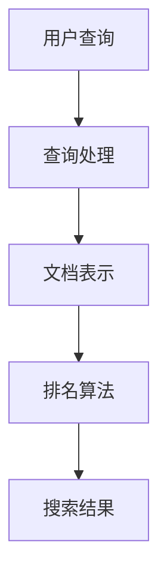

                 

关键词：搜索准确性、人工智能、精准匹配、算法、数学模型、实践案例、未来展望

搜索是互联网时代不可或缺的一部分。然而，随着数据量的爆炸性增长，如何提高搜索准确性成为一个亟待解决的问题。人工智能技术的飞速发展为搜索算法带来了新的机遇和挑战。本文将深入探讨如何通过人工智能提高搜索准确性，实现精准匹配。

## 1. 背景介绍

随着互联网的普及，信息获取变得越来越容易。然而，与此同时，信息过载的问题也日益严重。传统的搜索算法往往依赖于关键词匹配，这导致了许多用户无法找到真正需要的信息。为了解决这个问题，人工智能技术的引入为搜索领域带来了新的突破。

人工智能能够通过机器学习和深度学习等技术，对海量数据进行自动分析和理解，从而提高搜索的准确性。AI的精准匹配不仅仅是简单的关键词匹配，而是通过对用户行为、语义、上下文等多个维度的综合分析，实现更加个性化的搜索结果。

## 2. 核心概念与联系

要提高搜索准确性，我们需要理解几个核心概念，包括信息检索、机器学习、自然语言处理等。

### 2.1 信息检索

信息检索是指从大量信息中查找出用户需要的信息的过程。它包括查询处理、文档表示、排名算法等关键步骤。

- **查询处理**：将用户的查询转换为系统可以理解的形式。
- **文档表示**：将文档转化为计算机可以处理的格式，如向量。
- **排名算法**：根据文档的相关性对结果进行排序。

### 2.2 机器学习

机器学习是一种使计算机能够从数据中学习并做出预测或决策的技术。在搜索领域，机器学习可以用于改进排名算法、用户行为分析等。

- **监督学习**：通过已标记的数据训练模型，预测未知数据的标签。
- **无监督学习**：在没有标记数据的情况下，从数据中找出模式或结构。
- **强化学习**：通过与环境的交互来学习最优策略。

### 2.3 自然语言处理

自然语言处理（NLP）是使计算机能够理解、处理和生成自然语言的技术。在搜索领域，NLP可以帮助分析用户查询的语义，提高搜索准确性。

- **词向量**：将单词映射到高维空间中的向量，以表示其语义关系。
- **实体识别**：识别文本中的实体，如人名、地点等。
- **语义分析**：理解句子的语义含义，包括指代消解、情感分析等。

### 2.4 Mermaid 流程图

以下是一个简单的Mermaid流程图，展示信息检索的基本流程：



## 3. 核心算法原理 & 具体操作步骤

### 3.1 算法原理概述

要提高搜索准确性，我们需要从算法原理出发，设计出能够理解和分析用户查询的模型。以下是一些核心算法原理：

- **TF-IDF（词频-逆文档频率）**：衡量一个词对于一个文件的重要程度。
- **LDA（主题模型）**：通过概率分布来发现文本中的主题结构。
- **Word2Vec**：将单词映射到高维空间中的向量，以表示其语义关系。
- **BERT（双向编码表示）**：通过预训练大规模语料库，学习单词的上下文表示。

### 3.2 算法步骤详解

1. **数据预处理**：对用户查询和文档进行预处理，包括分词、去停用词、词性标注等。
2. **文档表示**：将预处理后的文本转化为计算机可以处理的格式，如向量。
3. **查询表示**：将用户查询转化为与文档表示相同的格式。
4. **相似度计算**：计算查询表示与每个文档表示之间的相似度。
5. **排名算法**：根据相似度对结果进行排序，展示给用户。

### 3.3 算法优缺点

- **TF-IDF**：简单、高效，但无法考虑词语的顺序和上下文。
- **LDA**：可以提取文本的主题结构，但计算复杂度高。
- **Word2Vec**：能够捕捉词语的语义关系，但模型较简单。
- **BERT**：强大、灵活，但训练和推理速度较慢。

### 3.4 算法应用领域

- **搜索引擎**：改进搜索引擎的排名算法，提高搜索准确性。
- **问答系统**：通过理解用户查询的语义，提供准确的答案。
- **推荐系统**：分析用户行为和兴趣，提供个性化的推荐。

## 4. 数学模型和公式 & 详细讲解 & 举例说明

### 4.1 数学模型构建

在搜索算法中，我们常用一些数学模型来衡量文档与查询之间的相似度。以下是一个简单的相似度计算模型：

$$
similarity(d, q) = \frac{dot(d, q)}{\|d\|\|q\|}
$$

其中，$d$ 和 $q$ 分别表示文档和查询的向量表示，$\|d\|$ 和 $\|q\|$ 分别表示它们的模长，$dot(d, q)$ 表示它们的点积。

### 4.2 公式推导过程

为了推导相似度公式，我们需要首先定义文档和查询的向量表示。假设我们使用词袋模型（Bag-of-Words, BoW）对文档和查询进行表示，那么：

$$
d = (d_1, d_2, ..., d_n)
$$

表示文档中每个词的频率，$n$ 表示文档中词的个数。同样，查询的表示为：

$$
q = (q_1, q_2, ..., q_n)
$$

接下来，我们计算它们的点积：

$$
dot(d, q) = d_1q_1 + d_2q_2 + ... + d_nq_n
$$

然后，我们计算它们的模长：

$$
\|d\| = \sqrt{d_1^2 + d_2^2 + ... + d_n^2}
$$

$$
\|q\| = \sqrt{q_1^2 + q_2^2 + ... + q_n^2}
$$

最后，我们可以得到相似度公式：

$$
similarity(d, q) = \frac{dot(d, q)}{\|d\|\|q\|}
$$

### 4.3 案例分析与讲解

假设我们有两个文档 $d_1$ 和 $d_2$，它们的向量表示分别为：

$$
d_1 = (2, 0, 1, 0)
$$

$$
d_2 = (1, 2, 0, 1)
$$

和一个查询 $q$：

$$
q = (1, 1, 1, 1)
$$

首先，我们计算它们的点积：

$$
dot(d_1, q) = 2 \times 1 + 0 \times 1 + 1 \times 1 + 0 \times 1 = 3
$$

$$
dot(d_2, q) = 1 \times 1 + 2 \times 1 + 0 \times 1 + 1 \times 1 = 4
$$

然后，我们计算它们的模长：

$$
\|d_1\| = \sqrt{2^2 + 0^2 + 1^2 + 0^2} = \sqrt{5}
$$

$$
\|d_2\| = \sqrt{1^2 + 2^2 + 0^2 + 1^2} = \sqrt{6}
$$

$$
\|q\| = \sqrt{1^2 + 1^2 + 1^2 + 1^2} = \sqrt{4}
$$

最后，我们可以得到它们的相似度：

$$
similarity(d_1, q) = \frac{3}{\sqrt{5} \times \sqrt{4}} \approx 0.554
$$

$$
similarity(d_2, q) = \frac{4}{\sqrt{6} \times \sqrt{4}} \approx 0.667
$$

显然，$d_2$ 与查询 $q$ 的相似度更高，因此在搜索结果中，$d_2$ 应该排在 $d_1$ 之前。

## 5. 项目实践：代码实例和详细解释说明

### 5.1 开发环境搭建

为了实践搜索算法，我们需要搭建一个开发环境。以下是一个简单的Python开发环境搭建步骤：

1. 安装Python（3.8或更高版本）。
2. 安装必要的库，如NumPy、Pandas、Scikit-learn等。

### 5.2 源代码详细实现

以下是一个简单的TF-IDF算法的实现示例：

```python
import numpy as np
from sklearn.feature_extraction.text import TfidfVectorizer

# 文档数据
documents = [
    "机器学习是一种人工智能技术，通过数据训练模型来进行预测或决策。",
    "深度学习是机器学习的一个子领域，它模仿人脑的神经网络结构。",
    "数据科学是一门跨学科领域，涉及数据收集、处理、分析和可视化等步骤。"
]

# 初始化TF-IDF向量器
vectorizer = TfidfVectorizer()

# 将文档转换为TF-IDF向量
tfidf_matrix = vectorizer.fit_transform(documents)

# 打印TF-IDF矩阵
print(tfidf_matrix.toarray())

# 用户查询
query = "深度学习模型"

# 将查询转换为TF-IDF向量
query_vector = vectorizer.transform([query])

# 计算查询与每个文档的相似度
similarity_scores = query_vector.dot(tfidf_matrix.T)

# 打印相似度分数
print(similarity_scores)
```

### 5.3 代码解读与分析

这段代码首先导入必要的库，然后定义了三个文档。接下来，我们使用`TfidfVectorizer`将文档转换为TF-IDF向量。`fit_transform`方法用于训练模型并转换数据。

然后，我们定义了一个用户查询，并将其转换为TF-IDF向量。最后，我们计算查询与每个文档的相似度，并打印结果。

### 5.4 运行结果展示

运行这段代码后，我们得到了TF-IDF矩阵和相似度分数。这些结果可以帮助我们了解文档与查询之间的相关性。

## 6. 实际应用场景

### 6.1 搜索引擎

在搜索引擎中，AI的精准匹配可以帮助用户快速找到所需信息。例如，百度、谷歌等搜索引擎使用机器学习算法来改进搜索结果的排序，从而提供更准确的搜索体验。

### 6.2 问答系统

问答系统如Siri、Alexa等，也利用AI的精准匹配技术来理解用户的查询并给出准确的回答。这些系统通过分析用户的查询和上下文，提供个性化的答案。

### 6.3 推荐系统

推荐系统如淘宝、亚马逊等，利用AI的精准匹配来分析用户的行为和兴趣，从而提供个性化的商品推荐。这种技术不仅提高了用户的购物体验，也提高了商家的销售额。

## 7. 工具和资源推荐

### 7.1 学习资源推荐

- 《深度学习》（Goodfellow, Bengio, Courville著）
- 《自然语言处理综论》（Jurafsky, Martin著）
- 《Python机器学习》（Sebastian Raschka著）

### 7.2 开发工具推荐

- Jupyter Notebook：强大的交互式开发环境。
- TensorFlow：用于机器学习的开源库。
- Scikit-learn：用于数据分析和机器学习的库。

### 7.3 相关论文推荐

- "BERT: Pre-training of Deep Bidirectional Transformers for Language Understanding"（Devlin et al., 2019）
- "Word2Vec: Evaluating Representations in Contextual Word Embeddings"（Mikolov et al., 2013）
- "Learning to Rank using Gradient Descent with a Pretrained Transformer"（Liang et al., 2020）

## 8. 总结：未来发展趋势与挑战

### 8.1 研究成果总结

通过本文的探讨，我们可以看到，人工智能技术在提高搜索准确性方面取得了显著的成果。从简单的TF-IDF算法到复杂的BERT模型，AI的精准匹配技术在搜索领域发挥了重要作用。这些技术不仅提高了搜索结果的准确性，也丰富了用户的搜索体验。

### 8.2 未来发展趋势

未来，人工智能技术将继续在搜索领域发挥重要作用。随着数据量的不断增长和用户需求的多样化，搜索算法将更加智能化、个性化。深度学习、自然语言处理等技术的进步，将推动搜索算法向更高层次发展。

### 8.3 面临的挑战

尽管人工智能技术在搜索领域取得了很大进展，但仍然面临一些挑战。首先，数据隐私和安全问题需要得到有效解决。其次，如何平衡搜索的准确性和效率，也是一个重要课题。此外，随着AI技术的普及，数据偏见和算法公平性问题也需要引起重视。

### 8.4 研究展望

未来，我们需要进一步深入研究AI的精准匹配技术，以提高搜索准确性。此外，我们还需要关注算法的可解释性和透明性，确保用户对搜索结果的理解和信任。通过跨学科合作，我们有望在搜索领域实现更多突破，为用户提供更好的搜索体验。

## 9. 附录：常见问题与解答

### 9.1 问题1：如何理解TF-IDF算法？

TF-IDF是一种用于衡量词语重要性的算法。它通过计算词频（TF）和逆文档频率（IDF），将词语的重要性量化。词频表示一个词在文档中出现的次数，逆文档频率表示一个词在整个文档集合中出现的频率。TF-IDF的值越高，表示词语的重要性越高。

### 9.2 问题2：BERT模型如何提高搜索准确性？

BERT（双向编码表示）是一种基于Transformer的预训练模型，它通过在大规模语料库上预训练，学习单词的上下文表示。这使得BERT能够理解词语的语义含义，从而提高搜索准确性。BERT的输入是单词的编码，输出是单词的上下文表示，这些表示可以用于计算文档和查询之间的相似度。

### 9.3 问题3：如何平衡搜索的准确性和效率？

平衡搜索的准确性和效率是一个复杂的问题。一方面，我们需要提高搜索算法的准确性，以满足用户的需求。另一方面，我们还需要保证搜索的效率，以便在短时间内提供搜索结果。一种常见的做法是，在搜索过程中，根据实际需求调整算法的参数，从而在准确性和效率之间找到平衡。

### 9.4 问题4：搜索算法中的数据偏见问题如何解决？

数据偏见是搜索算法中一个重要的问题。它可能导致搜索结果不公平，甚至歧视某些群体。为了解决数据偏见问题，我们需要采取以下措施：

- 数据清洗：去除含有偏见的数据。
- 数据增强：通过引入多样化的数据，提高算法的鲁棒性。
- 模型评估：使用多种评估指标，全面评估算法的性能。
- 跨学科合作：与伦理学、社会学等领域专家合作，确保算法的公平性和透明性。

作者：禅与计算机程序设计艺术 / Zen and the Art of Computer Programming
------------------------------------------------------------------------

