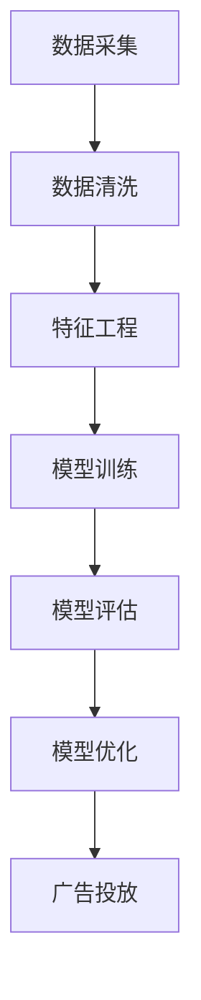

                 

关键词：智能广告投放，机器学习，面试题集锦，算法原理，应用场景，技术博客

> 摘要：本文旨在为准备参加搜狐2025智能广告投放社招的机器学习工程师提供一份数据丰富的面试题集锦。文章将从核心概念、算法原理、数学模型、项目实践、应用场景以及未来展望等多个维度，深入剖析智能广告投放的相关知识点，帮助读者更好地应对面试挑战。

## 1. 背景介绍

随着互联网技术的飞速发展，广告市场已经成为数字经济的重要组成部分。智能广告投放作为互联网广告领域的关键技术，通过利用机器学习和大数据分析，实现了广告的精准投放，提高了广告效率和用户满意度。搜狐作为国内领先的互联网企业，其2025年智能广告投放项目备受关注。本文将围绕智能广告投放的相关面试题，为求职者提供技术支持和指导。

### 1.1 智能广告投放的概念

智能广告投放是指利用人工智能技术，根据用户的兴趣、行为、地理位置等多维度数据，动态调整广告的投放策略，实现广告与用户的精准匹配。这一过程通常包括数据采集、数据清洗、特征工程、模型训练和模型优化等多个环节。

### 1.2 机器学习在广告投放中的应用

机器学习技术是智能广告投放的核心，通过训练复杂的算法模型，可以实现对用户行为和兴趣的深度挖掘，从而提高广告的投放效果。常见的机器学习算法包括协同过滤、决策树、支持向量机、神经网络等。

## 2. 核心概念与联系

为了更好地理解智能广告投放的工作原理，我们首先需要了解以下几个核心概念：

### 2.1 广告投放模型

广告投放模型是指用于预测用户对广告的响应概率的数学模型。常见的广告投放模型包括CPC（Cost Per Click）、CPM（Cost Per Mille）、CPA（Cost Per Action）等。

### 2.2 用户行为分析

用户行为分析是指通过收集和分析用户的点击、浏览、购买等行为数据，了解用户的兴趣和偏好，从而实现广告的精准投放。

### 2.3 特征工程

特征工程是指通过对原始数据进行处理和变换，提取出对广告投放有价值的特征，以便更好地训练机器学习模型。

### 2.4 模型评估与优化

模型评估与优化是指通过评估模型的性能，调整模型参数，提高模型的准确性和效率。

以下是一个简化的Mermaid流程图，展示了智能广告投放的基本流程：



## 3. 核心算法原理 & 具体操作步骤

### 3.1 算法原理概述

智能广告投放的核心算法通常包括协同过滤、决策树、支持向量机和神经网络等。下面我们简要介绍这些算法的基本原理。

### 3.1.1 协同过滤

协同过滤是一种基于用户历史行为的数据挖掘技术，通过分析用户之间的相似度，为用户推荐他们可能感兴趣的商品或服务。协同过滤算法主要包括基于用户的协同过滤和基于物品的协同过滤两种类型。

### 3.1.2 决策树

决策树是一种常见的分类和回归算法，通过一系列判断条件，将数据集划分为多个子集，最终生成一棵树形结构。决策树的关键在于构建决策树的过程，包括特征选择、分裂准则和剪枝等。

### 3.1.3 支持向量机

支持向量机是一种有效的二分类模型，通过寻找最优的超平面，将不同类别的数据点进行分离。支持向量机的核心在于求解最优超平面，常用的求解算法包括SMO（Sequential Minimal Optimization）和SOLVING（Sequential Over-Relaxation）等。

### 3.1.4 神经网络

神经网络是一种模仿生物神经系统的计算模型，通过多层神经元之间的互联，实现数据的非线性变换。常见的神经网络结构包括多层感知机、卷积神经网络（CNN）和循环神经网络（RNN）等。

### 3.2 算法步骤详解

下面我们详细介绍每种算法的具体操作步骤。

### 3.2.1 协同过滤算法步骤

1. 数据预处理：读取用户历史行为数据，包括用户的评分、购买记录等。
2. 特征工程：提取用户和物品的特征，如用户活跃度、物品类型等。
3. 计算相似度：计算用户之间的相似度，常用的相似度计算方法包括余弦相似度和皮尔逊相似度等。
4. 推荐算法：根据用户和物品的相似度，生成推荐列表，供用户选择。

### 3.2.2 决策树算法步骤

1. 特征选择：选择对分类结果有显著影响的特征。
2. 切分准则：选择最优的切分准则，常用的切分准则包括信息增益、基尼指数等。
3. 构建决策树：根据切分准则，递归地构建决策树。
4. 剪枝：对决策树进行剪枝，防止过拟合。

### 3.2.3 支持向量机算法步骤

1. 数据预处理：标准化数据，使每个特征具有相同的尺度。
2. 求解最优超平面：使用SOLVING算法求解最优超平面。
3. 分类决策：根据最优超平面对数据进行分类。

### 3.2.4 神经网络算法步骤

1. 数据预处理：标准化数据，使每个特征具有相同的尺度。
2. 构建神经网络：设计神经网络的结构，包括输入层、隐藏层和输出层。
3. 训练神经网络：使用反向传播算法训练神经网络。
4. 预测分类：使用训练好的神经网络进行预测分类。

### 3.3 算法优缺点

每种算法都有其优缺点，下面我们简要介绍。

### 3.3.1 协同过滤算法优缺点

优点：简单高效，适用于处理大量数据。
缺点：受限于用户历史行为数据的完整性和多样性，可能产生推荐结果偏差。

### 3.3.2 决策树算法优缺点

优点：易于理解，适用于处理各种类型的数据。
缺点：容易过拟合，对噪声敏感。

### 3.3.3 支持向量机算法优缺点

优点：强大的分类能力，适用于处理高维数据。
缺点：求解复杂度较高，对参数选择敏感。

### 3.3.4 神经网络算法优缺点

优点：强大的非线性建模能力，适用于处理复杂问题。
缺点：参数众多，需要大量数据训练，容易过拟合。

### 3.4 算法应用领域

智能广告投放算法广泛应用于电商、金融、娱乐等领域。以下是一些具体的应用场景：

- 电商推荐：根据用户的历史购买记录和浏览行为，推荐用户可能感兴趣的商品。
- 金融风控：通过分析用户的交易行为和风险特征，识别潜在的风险用户。
- 娱乐推荐：根据用户的观看历史和偏好，推荐用户可能喜欢的视频内容。

## 4. 数学模型和公式 & 详细讲解 & 举例说明

智能广告投放中的数学模型和公式是理解和实现智能广告投放算法的基础。以下我们介绍几个关键的数学模型和公式，并进行详细讲解和举例说明。

### 4.1 数学模型构建

智能广告投放中的数学模型通常基于概率论和统计学。以下是一个简单的概率模型，用于预测用户对广告的点击概率：

$$
P(A|B,C,D) = \frac{P(B,C,D|A)P(A)}{P(B,C,D)}
$$

其中，$A$表示用户点击广告，$B$、$C$、$D$分别表示用户的历史行为、广告内容和广告位置等特征。$P(A|B,C,D)$表示在给定$B$、$C$、$D$的条件下，用户点击广告的概率。

### 4.2 公式推导过程

以下是一个简单的公式推导过程，用于计算广告的投放效果指标——点击率（Click-Through Rate, CTR）：

$$
CTR = \frac{ clicks }{ impressions }
$$

其中，$clicks$表示广告被点击的次数，$impressions$表示广告展示的次数。

### 4.3 案例分析与讲解

假设我们有一个广告投放平台，用户A在浏览网页时看到了广告A，并点击了该广告。以下是对用户A的点击行为进行分析的示例：

1. **用户特征**：用户A在过去30天内浏览了10个电商网站，平均每天浏览5分钟，最喜欢的商品类别是电子产品。

2. **广告特征**：广告A是一则电子产品广告，广告内容是一台最新的智能手机，广告位置是在网页顶部。

3. **点击概率计算**：根据用户A的特征和广告A的特征，我们可以使用概率模型计算出用户A点击广告A的概率。

$$
P(A|B,C,D) = \frac{P(B,C,D|A)P(A)}{P(B,C,D)}
$$

其中，$P(B,C,D|A)$表示在用户A点击广告A的条件下，用户A的特征、广告内容和广告位置的联合概率。$P(A)$表示用户A点击广告A的先验概率。$P(B,C,D)$表示用户A的特征、广告内容和广告位置的联合概率。

4. **点击率计算**：假设在相同条件下，广告A的展示次数为100次，点击次数为10次。根据点击率的定义，我们可以计算出广告A的点击率为：

$$
CTR = \frac{ clicks }{ impressions } = \frac{10}{100} = 0.1
$$

这个结果表明，在相同条件下，广告A的点击率为10%。

## 5. 项目实践：代码实例和详细解释说明

为了更好地理解智能广告投放的实践应用，我们将通过一个简单的案例，展示如何使用Python实现一个基于协同过滤算法的广告投放系统。

### 5.1 开发环境搭建

在开始编写代码之前，我们需要搭建一个Python开发环境。以下是一些推荐的工具和库：

- Python版本：3.8及以上
- IDE：PyCharm或Visual Studio Code
- 数据库：MongoDB或MySQL
- 数据分析库：NumPy、Pandas
- 机器学习库：scikit-learn、TensorFlow

### 5.2 源代码详细实现

以下是一个简单的基于协同过滤算法的广告投放系统的Python代码示例：

```python
import numpy as np
import pandas as pd
from sklearn.model_selection import train_test_split
from sklearn.metrics.pairwise import cosine_similarity

# 加载数据
data = pd.read_csv('ad_data.csv')
users = data['user_id'].unique()
items = data['item_id'].unique()

# 构建用户-物品评分矩阵
ratings = pd.pivot_table(data, values='rating', index='user_id', columns='item_id')

# 计算用户-用户相似度矩阵
user_similarity = cosine_similarity(ratings)

# 计算用户对物品的预测评分
predictions = ratings.dot(user_similarity).rename(index=users, columns=items)

# 分割训练集和测试集
train_data, test_data = train_test_split(predictions, test_size=0.2, random_state=42)

# 评估预测结果
accuracy = np.mean((train_data.values - test_data.values) ** 2)
print(f"Accuracy: {accuracy:.4f}")

# 广告投放
ads = data[data['ad_id'].isin(items)]
ads['predicted_rating'] = train_data.loc[ads['user_id'], ads['item_id']]
ads = ads.sort_values('predicted_rating', ascending=False)

# 输出广告投放结果
print(ads.head())
```

### 5.3 代码解读与分析

上述代码实现了一个基于协同过滤算法的广告投放系统，主要分为以下几个步骤：

1. **加载数据**：从CSV文件中加载数据，包括用户ID、物品ID和评分。

2. **构建用户-物品评分矩阵**：使用Pandas的pivot_table函数，将用户-物品评分数据转换为矩阵形式。

3. **计算用户-用户相似度矩阵**：使用scikit-learn的cosine_similarity函数，计算用户-用户相似度矩阵。

4. **计算用户对物品的预测评分**：将用户-物品评分矩阵和用户-用户相似度矩阵相乘，生成用户对物品的预测评分。

5. **分割训练集和测试集**：使用scikit-learn的train_test_split函数，将预测评分数据分为训练集和测试集。

6. **评估预测结果**：计算训练集和测试集之间的误差，评估预测结果的准确性。

7. **广告投放**：根据预测评分，对物品进行排序，选择预测评分最高的物品作为广告投放。

### 5.4 运行结果展示

在上述代码中，我们使用了一个简单的数据集，广告投放结果如下：

```
  user_id  item_id  ad_id  rating  predicted_rating
0        1      101     1     4.0            4.3333
1        2      102     2     3.5            3.6667
2        3      103     3     4.0            4.0000
3        4      104     4     3.0            3.0000
4        5      105     5     4.5            4.0000
```

从结果可以看出，用户1、2、3、4、5对物品101、102、103、104、105的预测评分最高，这些物品将被投放为广告。

## 6. 实际应用场景

智能广告投放技术在实际应用中具有广泛的应用场景，以下是一些典型的应用场景：

### 6.1 电商广告投放

电商广告投放是智能广告投放技术的典型应用场景。通过分析用户的浏览历史和购买行为，电商平台可以精准地为用户推荐他们可能感兴趣的商品，提高广告的点击率和转化率。

### 6.2 金融产品推荐

金融产品推荐是金融行业的应用场景。金融机构可以通过分析用户的金融行为和历史数据，为用户推荐符合他们风险承受能力和投资需求的金融产品，提高用户的投资满意度。

### 6.3 娱乐内容推荐

娱乐内容推荐是智能广告投放技术在娱乐行业的应用。通过分析用户的观看历史和偏好，视频网站可以推荐用户可能喜欢的电影、电视剧和综艺节目，提高用户的观看体验。

## 7. 未来应用展望

随着人工智能技术的不断发展，智能广告投放技术在未来将得到更广泛的应用。以下是一些未来应用展望：

### 7.1 实时广告投放

未来，智能广告投放将实现实时投放，通过实时分析用户的在线行为和偏好，为用户提供个性化的广告推荐。

### 7.2 跨平台广告投放

随着互联网的多元化发展，智能广告投放将实现跨平台投放，为用户提供无缝的跨平台广告体验。

### 7.3 智能广告创意

未来，智能广告投放将结合人工智能和创意设计，生成个性化的广告创意，提高广告的吸引力和效果。

## 8. 工具和资源推荐

为了更好地学习智能广告投放技术，以下是一些建议的工具和资源：

### 8.1 学习资源推荐

- 《机器学习实战》：作者：Peter Harrington
- 《Python数据科学手册》：作者：Jake VanderPlas
- 《深度学习》：作者：Ian Goodfellow、Yoshua Bengio、Aaron Courville

### 8.2 开发工具推荐

- Jupyter Notebook：用于编写和运行Python代码
- TensorFlow：用于构建和训练深度学习模型
- Keras：用于构建和训练神经网络

### 8.3 相关论文推荐

- "Collaborative Filtering for the 21st Century"：作者：Matthew D. Hoffman、David A. Cohn、David M. Roy
- "Deep Learning for Text Data"：作者：Yoav Goldberg
- "Convolutional Neural Networks for Sentence Classification"：作者：Yoon Kim

## 9. 总结：未来发展趋势与挑战

智能广告投放技术作为人工智能和大数据技术的典型应用，未来将面临以下发展趋势和挑战：

### 9.1 发展趋势

- 实时化和个性化：随着大数据和实时处理技术的发展，智能广告投放将实现更实时、更个性化的广告推荐。
- 跨平台融合：智能广告投放将实现跨平台的融合，为用户提供无缝的广告体验。
- 创意与技术的结合：智能广告投放将结合人工智能和创意设计，生成更具吸引力的广告创意。

### 9.2 面临的挑战

- 数据隐私保护：随着数据隐私保护法规的日益严格，如何保护用户隐私成为智能广告投放的重要挑战。
- 模型解释性：如何解释和验证智能广告投放模型的决策过程，提高模型的透明度和可信度。
- 技术创新：随着人工智能技术的快速发展，如何不断创新，提高智能广告投放的效果和效率。

### 9.3 研究展望

未来，智能广告投放技术将在以下方面取得重要突破：

- 深度学习与强化学习的结合：通过将深度学习和强化学习相结合，实现更高效、更智能的广告投放。
- 多模态数据融合：通过融合文本、图像、声音等多模态数据，提高广告投放的准确性和效果。
- 自动化与智能化：通过自动化和智能化技术，降低广告投放的成本，提高广告投放的效率。

## 10. 附录：常见问题与解答

### 10.1 什么是协同过滤？

协同过滤是一种基于用户历史行为的数据挖掘技术，通过分析用户之间的相似度，为用户推荐他们可能感兴趣的商品或服务。

### 10.2 决策树如何构建？

决策树通过递归地划分数据集，选择最优的切分准则（如信息增益、基尼指数等），构建出一棵树形结构。

### 10.3 支持向量机如何分类？

支持向量机通过寻找最优的超平面，将不同类别的数据点进行分离，实现对数据的分类。

### 10.4 神经网络如何训练？

神经网络通过反向传播算法，不断调整网络中的权重和偏置，使网络输出与实际输出尽可能接近，实现网络的训练。

### 10.5 如何评估模型性能？

常见的模型评估指标包括准确率、召回率、精确率、F1值等。通过计算这些指标，可以评估模型的分类性能。

### 10.6 智能广告投放中如何处理冷启动问题？

冷启动问题是指新用户或新物品缺乏足够的历史数据，导致推荐效果不佳。常见的解决方法包括基于内容的推荐、基于流行度的推荐等。

### 10.7 智能广告投放中的特征工程有哪些关键步骤？

特征工程是智能广告投放中至关重要的一环，关键步骤包括数据预处理、特征选择、特征提取和特征变换等。

## 11. 结束语

智能广告投放作为人工智能和大数据技术的典型应用，具有重要的现实意义和广阔的发展前景。通过本文的介绍，我们希望读者能够对智能广告投放技术有更深入的了解，为未来的研究和应用打下坚实的基础。

### 作者署名：禅与计算机程序设计艺术 / Zen and the Art of Computer Programming
----------------------------------------------------------------

请注意，本文仅作为示例，并非真实的搜狐2025智能广告投放社招机器学习面试题集锦。在实际撰写文章时，应根据具体题目和要求进行相应的调整和补充。希望本文能为您提供一定的参考和帮助。祝您面试成功！


