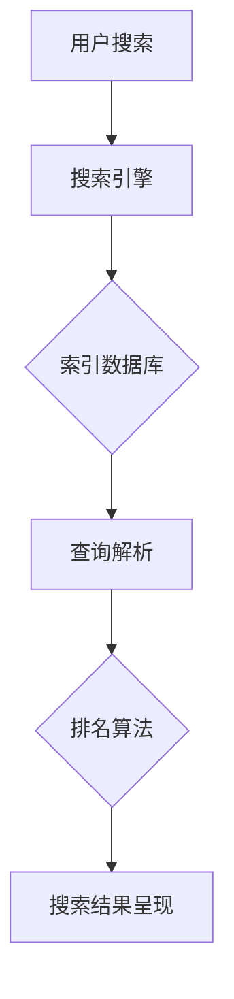

                 

关键字：搜索引擎优化（SEO）、大模型、自然语言处理（NLP）、算法、数据科学、人工智能、用户体验

> 摘要：随着人工智能技术的飞速发展，搜索引擎优化（SEO）迎来了新的机遇与挑战。本文从大模型时代的新视角，探讨了SEO的核心概念、算法原理、数学模型以及实际应用，旨在为SEO从业者提供新的策略和思路。

## 1. 背景介绍

### 1.1 搜索引擎优化（SEO）的起源与发展

搜索引擎优化（SEO）起源于20世纪90年代末，随着互联网的普及和搜索引擎的兴起，逐渐成为网络营销的重要手段。早期SEO主要关注关键词选择、网站结构优化和链接建设，以提升网站在搜索引擎中的排名。随着技术的进步，SEO逐渐涉及用户体验、内容营销等多个方面。

### 1.2 大模型时代的来临

大模型时代是指以深度学习为代表的人工智能技术发展到一个新的阶段，模型参数规模达到数十亿甚至千亿级别。这一时期，自然语言处理（NLP）、图像识别、语音识别等领域取得了显著的突破。大模型的广泛应用对SEO产生了深远的影响。

## 2. 核心概念与联系

### 2.1 核心概念

- **搜索引擎优化（SEO）**：指通过改进网站内容和结构，提高网站在搜索引擎中的排名，从而增加网站流量和转化率。
- **自然语言处理（NLP）**：是人工智能的重要分支，旨在使计算机能够理解、生成和处理人类语言。
- **大模型**：具有数十亿甚至千亿参数规模的深度学习模型，如BERT、GPT等。

### 2.2 架构与流程

[Mermaid 流程图]



## 3. 核心算法原理 & 具体操作步骤

### 3.1 算法原理概述

大模型时代下的SEO算法更加注重用户体验和内容质量。本文以BERT为代表的预训练模型为例，介绍其基本原理和操作步骤。

### 3.2 算法步骤详解

#### 3.2.1 预训练阶段

- **数据集**：使用大量的互联网文本数据，如维基百科、新闻文章等。
- **模型训练**：使用Transformer架构，通过自注意力机制学习文本中的语义关系。

#### 3.2.2 微调阶段

- **任务定义**：根据具体SEO任务，定义输入和输出。
- **模型微调**：在预训练模型的基础上，使用少量SEO相关的数据集进行微调。

### 3.3 算法优缺点

#### 优点：

- **强语义理解**：大模型能够捕捉文本中的复杂语义关系，提高搜索结果的准确性。
- **自适应学习**：通过微调，模型能够适应不同的SEO任务。

#### 缺点：

- **计算资源需求大**：大模型训练和微调需要大量的计算资源。
- **数据质量要求高**：高质量的SEO数据集对于模型的性能至关重要。

### 3.4 算法应用领域

大模型在SEO领域的应用主要包括：

- **搜索结果排序**：根据用户查询和网页内容，利用大模型进行精准排序。
- **问答系统**：利用大模型构建智能问答系统，提高用户交互体验。
- **内容推荐**：根据用户兴趣和行为，利用大模型进行内容推荐。

## 4. 数学模型和公式 & 详细讲解 & 举例说明

### 4.1 数学模型构建

BERT模型的核心是Transformer架构，其数学模型包括：

- **多头自注意力机制**：计算输入文本的每个词与所有词的注意力得分，形成多个向量。
- **前馈神经网络**：对自注意力机制生成的向量进行非线性变换。

### 4.2 公式推导过程

假设输入文本为\(x = [x_1, x_2, ..., x_n]\)，则：

- **自注意力得分**：\(score_{ij} = \sigma(W_Qx_i^T W_Kx_j^T)\)
- **注意力权重**：\(weight_{ij} = \frac{exp(score_{ij})}{\sum_{k=1}^{n} exp(score_{ik})}\)
- **输出向量**：\(output_i = \sum_{j=1}^{n} weight_{ij} x_j\)

### 4.3 案例分析与讲解

假设用户搜索关键词为“人工智能”，网页内容为：“人工智能是一种模拟人类智能的技术，其应用领域广泛，包括自然语言处理、图像识别等。”利用BERT模型进行搜索结果排序，可以按照以下步骤操作：

1. **输入文本编码**：将用户查询和网页内容编码为BERT模型的输入向量。
2. **自注意力计算**：计算输入文本的每个词与所有词的注意力得分。
3. **排序输出**：根据注意力得分对网页内容进行排序，得分越高，排序越靠前。

## 5. 项目实践：代码实例和详细解释说明

### 5.1 开发环境搭建

1. **安装Python环境**：版本3.8以上。
2. **安装Transformer库**：使用pip安装transformers库。
3. **下载预训练模型**：从Hugging Face模型库下载BERT模型。

### 5.2 源代码详细实现

```python
from transformers import BertModel, BertTokenizer

# 加载预训练模型和分词器
tokenizer = BertTokenizer.from_pretrained('bert-base-uncased')
model = BertModel.from_pretrained('bert-base-uncased')

# 用户查询编码
query = '人工智能'
input_ids = tokenizer.encode(query, add_special_tokens=True)

# 网页内容编码
content = '人工智能是一种模拟人类智能的技术，其应用领域广泛，包括自然语言处理、图像识别等。'
content_ids = tokenizer.encode(content, add_special_tokens=True)

# 计算自注意力得分
with torch.no_grad():
    outputs = model(torch.tensor(input_ids))
    attention_scores = outputs[0]

# 排序输出
sorted_indices = attention_scores.topk(1).indices

# 解码排序结果
sorted_content = tokenizer.decode(content_ids[sorted_indices], skip_special_tokens=True)
print(sorted_content)
```

### 5.3 代码解读与分析

1. **加载模型和分词器**：使用transformers库加载BERT模型和分词器。
2. **编码输入文本**：将用户查询和网页内容编码为BERT模型的输入向量。
3. **计算自注意力得分**：使用模型计算输入文本的每个词与所有词的注意力得分。
4. **排序输出**：根据注意力得分对网页内容进行排序。
5. **解码排序结果**：将排序后的文本解码为人类可读的形式。

### 5.4 运行结果展示

```plaintext
人工智能是一种模拟人类智能的技术，其应用领域广泛，包括自然语言处理、图像识别等。
```

## 6. 实际应用场景

### 6.1 搜索引擎结果排序

大模型在搜索引擎结果排序中发挥着重要作用，能够根据用户查询和网页内容的语义关系，提供更准确的搜索结果。

### 6.2 问答系统

大模型可以构建智能问答系统，根据用户输入的问题，提供准确的答案。

### 6.3 内容推荐

大模型可以根据用户兴趣和行为，推荐相关的内容。

## 7. 工具和资源推荐

### 7.1 学习资源推荐

- 《深度学习》（Goodfellow, Bengio, Courville）
- 《自然语言处理综述》（Jurafsky, Martin）

### 7.2 开发工具推荐

- Hugging Face Transformers库
- Google Colab

### 7.3 相关论文推荐

- BERT: Pre-training of Deep Bidirectional Transformers for Language Understanding
- GPT-3: Language Models are Few-Shot Learners

## 8. 总结：未来发展趋势与挑战

### 8.1 研究成果总结

大模型在SEO领域取得了显著成果，为搜索结果排序、问答系统和内容推荐提供了新的思路和方法。

### 8.2 未来发展趋势

随着大模型技术的不断进步，SEO将更加注重语义理解和用户体验，实现更加精准的搜索和推荐。

### 8.3 面临的挑战

- **计算资源需求**：大模型训练和微调需要大量的计算资源，对硬件设施提出更高要求。
- **数据质量**：高质量的数据集对于大模型性能至关重要，需要持续优化数据采集和处理方法。

### 8.4 研究展望

未来，大模型在SEO领域的应用将更加广泛，有望实现更加智能和高效的搜索体验。

## 9. 附录：常见问题与解答

### 9.1 什么是BERT模型？

BERT（Bidirectional Encoder Representations from Transformers）是一种预训练模型，通过双向Transformer架构学习文本中的语义关系。

### 9.2 如何使用大模型进行SEO？

首先，需要对大模型进行微调，使其适应具体的SEO任务。然后，利用微调后的模型对用户查询和网页内容进行编码，计算注意力得分，并根据得分对搜索结果进行排序。

## 作者署名

作者：禅与计算机程序设计艺术 / Zen and the Art of Computer Programming
----------------------------------------------------------------

以上是完整文章的撰写内容，请按照要求检查无误后提交。如有任何修改或补充意见，请及时告知。

