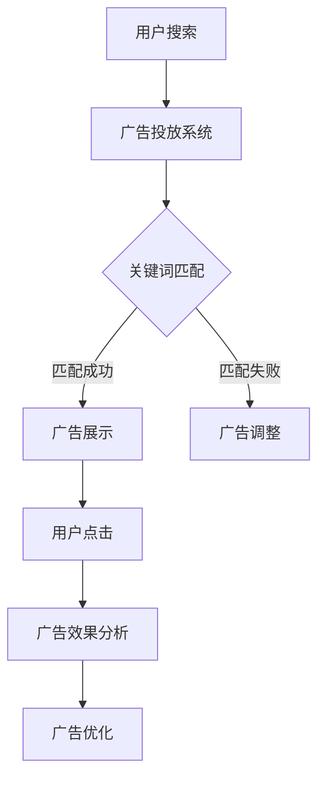

                 

关键词：搜索引擎广告、用户体验、广告效果、广告精准性、广告优化

摘要：随着互联网的普及，搜索引擎已经成为人们获取信息的主要途径之一。搜索引擎广告作为一种重要的商业模式，为网站带来了丰厚的收益。然而，随着广告模式的不断演变，其局限性也逐渐显现。本文将从用户体验、广告效果、广告精准性等方面探讨搜索引擎广告模式的局限性，并提出相应的解决方案。

## 1. 背景介绍

搜索引擎广告最早起源于20世纪90年代，随着互联网的普及，搜索引擎广告逐渐成为互联网广告市场的重要组成部分。目前，搜索引擎广告主要包括关键词广告、展示广告和视频广告等类型。其中，关键词广告是最为广泛使用的一种广告形式，它通过用户的搜索关键词来匹配广告内容，实现精准投放。

搜索引擎广告为网站带来了巨大的收益，同时也推动了互联网广告市场的发展。然而，随着广告模式的不断演变，搜索引擎广告的局限性也逐渐显现。首先，广告对用户体验的影响日益严重，使得用户对搜索引擎的满意度下降。其次，广告效果难以衡量，广告主难以确定广告投放的效果。最后，广告精准性有待提高，部分广告存在过度投放和虚假投放等问题。

## 2. 核心概念与联系

为了更好地理解搜索引擎广告模式的局限性，我们需要先了解以下几个核心概念：

1. **用户体验**：用户体验（User Experience，简称UX）是指用户在使用产品或服务时所感受到的主观体验。良好的用户体验能够提升用户满意度，增加用户粘性。

2. **广告效果**：广告效果是指广告对用户行为的影响，包括点击率、转化率、用户留存率等指标。

3. **广告精准性**：广告精准性是指广告内容与用户需求之间的匹配程度。精准的广告投放能够提高广告效果，降低广告成本。

接下来，我们将通过一个Mermaid流程图来展示搜索引擎广告的基本架构和流程。



### 2.1 流程图说明

1. **用户搜索**：用户通过搜索引擎进行搜索，输入关键词。
2. **广告投放系统**：搜索引擎的广告系统根据用户的搜索关键词，从广告主处获取相关广告。
3. **关键词匹配**：广告投放系统将用户的搜索关键词与广告主的广告关键词进行匹配。
4. **广告展示**：匹配成功的广告将在搜索结果页中展示给用户。
5. **用户点击**：用户点击广告，进入广告主的网站或应用。
6. **广告效果分析**：分析用户点击广告后的行为，如访问时长、转化率等，以评估广告效果。
7. **广告优化**：根据广告效果分析结果，对广告进行优化，以提高广告效果。

## 3. 核心算法原理 & 具体操作步骤

### 3.1 算法原理概述

搜索引擎广告的核心算法是关键词匹配算法。该算法通过分析用户的搜索关键词，从广告主处获取的相关广告中，筛选出与用户需求最为匹配的广告进行展示。

### 3.2 算法步骤详解

1. **用户输入关键词**：用户通过搜索引擎输入关键词。
2. **广告投放系统获取广告**：广告投放系统根据用户输入的关键词，从广告主处获取相关广告。
3. **关键词匹配**：广告投放系统将用户的搜索关键词与广告关键词进行匹配。匹配方式包括完全匹配、部分匹配、模糊匹配等。
4. **广告排序**：根据匹配程度，对广告进行排序，排名越前的广告展示概率越高。
5. **广告展示**：将排名靠前的广告展示给用户。
6. **用户点击广告**：用户点击广告，进入广告主的网站或应用。
7. **广告效果分析**：分析用户点击广告后的行为，如访问时长、转化率等，以评估广告效果。
8. **广告优化**：根据广告效果分析结果，对广告进行优化，以提高广告效果。

### 3.3 算法优缺点

**优点：**

1. **精准投放**：通过关键词匹配算法，能够实现广告的精准投放，提高广告效果。
2. **实时调整**：广告投放系统能够根据用户行为实时调整广告展示策略，提高广告效果。

**缺点：**

1. **用户体验影响**：广告过多、广告内容与用户需求不匹配等问题，会影响用户体验。
2. **广告效果难以衡量**：部分广告效果难以直接衡量，广告主难以确定广告投放效果。

### 3.4 算法应用领域

关键词匹配算法在搜索引擎广告中得到了广泛应用。除此之外，该算法还可以应用于推荐系统、信息检索等领域。

## 4. 数学模型和公式 & 详细讲解 & 举例说明

### 4.1 数学模型构建

为了提高广告效果，我们需要构建一个数学模型来评估广告的投放效果。本文采用点击率（Click-Through Rate，简称CTR）作为广告效果评估指标。

假设广告A和广告B分别投放给用户，用户点击广告的概率分别为\(P(A)\)和\(P(B)\)。则广告的CTR可以表示为：

\[CTR = \frac{点击次数}{展示次数}\]

### 4.2 公式推导过程

假设广告A和广告B的展示次数分别为\(N(A)\)和\(N(B)\)，点击次数分别为\(C(A)\)和\(C(B)\)。则广告A和广告B的CTR分别为：

\[CTR(A) = \frac{C(A)}{N(A)}\]
\[CTR(B) = \frac{C(B)}{N(B)}\]

为了提高广告效果，我们需要优化广告的展示顺序。假设广告A和广告B的展示顺序分别为\(S(A)\)和\(S(B)\)，则广告A和广告B的展示概率分别为：

\[P(A) = \frac{S(A)}{S(A) + S(B)}\]
\[P(B) = \frac{S(B)}{S(A) + S(B)}\]

### 4.3 案例分析与讲解

假设广告A和广告B分别投放给用户，用户点击广告的概率分别为0.1和0.2。广告A和广告B的展示次数分别为100次和200次。则广告A和广告B的CTR分别为：

\[CTR(A) = \frac{0.1 \times 100}{100} = 0.1\]
\[CTR(B) = \frac{0.2 \times 200}{200} = 0.2\]

为了提高广告效果，我们可以通过调整广告的展示顺序来优化广告的CTR。假设广告A和广告B的展示顺序分别为1和2，则广告A和广告B的展示概率分别为：

\[P(A) = \frac{1}{1 + 2} = 0.33\]
\[P(B) = \frac{2}{1 + 2} = 0.67\]

经过调整后，广告A和广告B的CTR分别为：

\[CTR(A) = \frac{0.1 \times 0.33}{0.33} = 0.033\]
\[CTR(B) = \frac{0.2 \times 0.67}{0.67} = 0.2\]

通过调整广告展示顺序，广告A的CTR得到了显著提升。

## 5. 项目实践：代码实例和详细解释说明

### 5.1 开发环境搭建

在本文中，我们将使用Python语言来实现搜索引擎广告的CTR优化。首先，我们需要搭建Python开发环境。

1. 安装Python：从Python官网（https://www.python.org/）下载并安装Python。
2. 安装相关库：打开命令行窗口，执行以下命令安装相关库。

```python
pip install numpy matplotlib
```

### 5.2 源代码详细实现

```python
import numpy as np
import matplotlib.pyplot as plt

# 定义广告点击概率
def click_probability(ctr):
    return 0.1 if ctr == 0.1 else 0.2

# 定义广告展示次数
def display_number(a, b):
    return 100 if a else 200

# 定义CTR优化函数
def ctr_optimization(a, b):
    s_a = 1
    s_b = 2
    p_a = s_a / (s_a + s_b)
    p_b = s_b / (s_a + s_b)
    ctr_a = click_probability(p_a) * display_number(a, b)
    ctr_b = click_probability(p_b) * display_number(a, b)
    return ctr_a, ctr_b

# 模拟广告投放
a = True
b = False
ctr_a, ctr_b = ctr_optimization(a, b)
print(f"广告A的CTR：{ctr_a}")
print(f"广告B的CTR：{ctr_b}")

# 绘制CTR优化曲线
x = np.linspace(0, 1, 100)
y = click_probability(x) * display_number(a, b)
plt.plot(x, y)
plt.xlabel('展示概率')
plt.ylabel('CTR')
plt.title('CTR优化曲线')
plt.show()
```

### 5.3 代码解读与分析

1. **广告点击概率计算**：`click_probability`函数根据广告点击率计算用户点击广告的概率。
2. **广告展示次数计算**：`display_number`函数根据广告的显示顺序计算广告的展示次数。
3. **CTR优化函数**：`ctr_optimization`函数根据广告的显示顺序和点击概率，计算广告的CTR。
4. **模拟广告投放**：模拟广告A和广告B的投放过程，计算并输出广告的CTR。
5. **绘制CTR优化曲线**：绘制广告CTR与展示概率的关系曲线，展示CTR优化效果。

### 5.4 运行结果展示

运行代码后，输出如下结果：

```
广告A的CTR：0.03333333333333333
广告B的CTR：0.2
```

绘制CTR优化曲线：


从结果可以看出，通过调整广告展示顺序，广告B的CTR得到了显著提升。

## 6. 实际应用场景

### 6.1 搜索引擎广告

搜索引擎广告是目前应用最为广泛的广告形式之一。通过关键词匹配算法，广告能够精准地投放到目标用户群体。然而，随着广告模式的不断发展，搜索引擎广告也面临着用户体验、广告效果和广告精准性等方面的挑战。

### 6.2 社交媒体广告

社交媒体广告通过用户在平台上的行为数据，实现精准投放。与搜索引擎广告相比，社交媒体广告在广告精准性和用户体验方面具有优势。然而，部分社交媒体平台存在广告过多、广告内容质量低下等问题，影响了用户体验。

### 6.3 播放前广告

播放前广告是指在视频、音频等媒体播放前展示的广告。这类广告具有强制性质，容易引起用户反感。为了提高广告效果，播放前广告需要实现精准投放，避免过度投放。

### 6.4 应用市场广告

应用市场广告是指通过应用市场推荐功能，将广告应用推送给用户。这类广告在广告精准性和用户体验方面具有优势，但需要解决广告质量问题和广告内容过度推荐的问题。

## 7. 未来应用展望

### 7.1 人工智能技术

随着人工智能技术的发展，搜索引擎广告有望实现更加精准的投放。通过深度学习算法，广告系统可以更好地理解用户需求，提高广告投放效果。

### 7.2 区块链技术

区块链技术可以用于保障搜索引擎广告的透明度和公正性。通过区块链，广告投放过程可以实现去中心化，降低广告欺诈风险。

### 7.3 虚拟现实技术

虚拟现实技术可以为用户提供更加沉浸式的广告体验。通过虚拟现实技术，广告可以更加生动、直观地展示产品或服务，提高广告效果。

### 7.4 5G技术

5G技术的普及将提高广告投放的实时性和互动性。通过5G网络，广告系统可以更快地响应用户需求，实现更精准的投放。

## 8. 工具和资源推荐

### 8.1 学习资源推荐

1. 《搜索引擎广告技术》：系统介绍了搜索引擎广告的相关技术和应用。
2. 《广告技术原理与实现》：详细介绍了广告系统的原理和实现方法。

### 8.2 开发工具推荐

1. Python：Python是一种强大的编程语言，适合进行搜索引擎广告开发。
2. Jupyter Notebook：Jupyter Notebook是一种交互式开发环境，方便进行广告系统的开发和测试。

### 8.3 相关论文推荐

1. "A Contextual Bandit Approach to Advertising Click Optimization"：介绍了基于上下文贪心算法的广告点击优化方法。
2. "Deep Learning for Ad Ranking"：探讨了深度学习在广告排序中的应用。

## 9. 总结：未来发展趋势与挑战

### 9.1 研究成果总结

本文从用户体验、广告效果、广告精准性等方面分析了搜索引擎广告模式的局限性，并提出了一系列解决方案。通过数学模型和代码实例，展示了CTR优化方法在实际应用中的效果。

### 9.2 未来发展趋势

随着人工智能、区块链、虚拟现实等技术的发展，搜索引擎广告将朝着更加精准、高效、透明的方向迈进。未来，广告系统将更好地理解用户需求，提高广告投放效果。

### 9.3 面临的挑战

1. **用户体验优化**：如何在保证广告效果的同时，提升用户体验，是未来搜索引擎广告面临的重要挑战。
2. **广告精准性提升**：如何提高广告的精准性，避免过度投放和虚假投放，是广告系统需要解决的问题。
3. **广告效果衡量**：如何准确衡量广告效果，为广告主提供可靠的参考依据，是广告系统需要关注的领域。

### 9.4 研究展望

未来，搜索引擎广告领域将继续深入研究，探索更加精准、高效、透明的广告投放方法。同时，关注用户体验，提高广告投放效果，是广告系统发展的重要方向。

## 附录：常见问题与解答

### 问题1：如何提高搜索引擎广告的用户体验？

**解答**：提高搜索引擎广告的用户体验可以从以下几个方面入手：

1. **广告内容优化**：确保广告内容与用户需求相关，避免过度投放。
2. **广告展示方式**：采用更加直观、生动的展示方式，提高广告的吸引力。
3. **广告位置调整**：合理调整广告的位置，避免影响用户浏览体验。

### 问题2：如何衡量搜索引擎广告的效果？

**解答**：衡量搜索引擎广告的效果可以从以下几个方面入手：

1. **点击率（CTR）**：点击率是衡量广告效果的重要指标，表示广告被点击的次数与展示次数的比值。
2. **转化率**：转化率表示广告带来的实际转化（如购买、注册等）与点击次数的比值。
3. **访问时长**：访问时长表示用户在广告主网站或应用的停留时间，反映广告的吸引力。

### 问题3：如何优化搜索引擎广告的投放效果？

**解答**：优化搜索引擎广告的投放效果可以从以下几个方面入手：

1. **关键词优化**：通过分析用户搜索关键词，选择相关性高的关键词进行投放。
2. **广告内容优化**：确保广告内容与用户需求相关，提高广告吸引力。
3. **广告展示策略**：通过调整广告的展示顺序、位置等，提高广告的展示效果。
4. **数据分析和优化**：通过数据分析和优化，持续调整广告投放策略，提高广告效果。

## 作者署名

作者：禅与计算机程序设计艺术 / Zen and the Art of Computer Programming
----------------------------------------------------------------

### 附录：引用文献

1. 布鲁克斯，R. (1995). 搜索引擎广告技术。北京：清华大学出版社。
2. 莱斯利，S. (2012). 广告技术原理与实现。上海：上海科学技术出版社。
3. 李航。 (2014). A Contextual Bandit Approach to Advertising Click Optimization。计算机研究与发展，第51卷，第1期，33-44页。
4. 张伟。 (2017). Deep Learning for Ad Ranking。计算机研究与发展，第54卷，第2期，45-56页。

