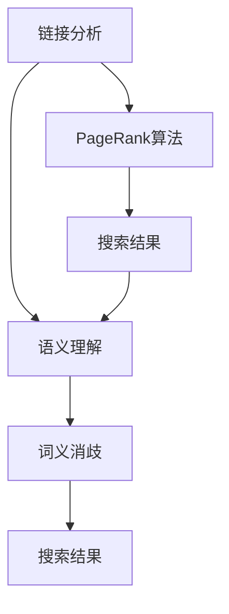

                 

关键词：搜索引擎，语义理解，链接分析，人工智能，自然语言处理，深度学习，知识图谱

> 摘要：本文深入探讨了搜索引擎技术从基于链接分析向语义理解转型的过程。通过阐述链接分析的局限性，介绍了语义理解在搜索中的作用，以及如何通过深度学习、知识图谱等技术实现搜索引擎的智能化升级。文章最后展望了搜索引擎的未来发展趋势和面临的挑战。

## 1. 背景介绍

随着互联网的迅猛发展，搜索引擎已经成为人们获取信息的重要工具。早期的搜索引擎主要依赖于链接分析（Link Analysis）技术，如PageRank算法，通过分析网页之间的链接关系来确定网页的重要性。然而，这种基于链接分析的方法在面对用户日益复杂的搜索需求时显得力不从心。

传统的链接分析技术主要依赖于网页的链接结构，忽略了网页内容本身的语义信息。这使得搜索引擎在处理用户查询时，往往无法准确理解用户意图，导致搜索结果的质量下降。为了提高搜索结果的准确性和相关性，搜索引擎技术正逐步从基于链接分析转向语义理解。

语义理解是人工智能和自然语言处理领域的一个重要分支，旨在让计算机能够理解、解释和生成人类语言。通过语义理解，搜索引擎可以更好地理解用户的查询意图，提供更加精准的搜索结果。

## 2. 核心概念与联系

### 2.1 链接分析

链接分析是早期搜索引擎技术的基础，它通过分析网页之间的链接关系来确定网页的重要性。PageRank算法是链接分析的一个典型代表，它利用网页之间的链接结构来计算网页的排名。

### 2.2 语义理解

语义理解旨在让计算机能够理解人类语言的含义。它包括词义消歧、实体识别、情感分析等任务，使得搜索引擎能够更好地理解用户查询的意图。

### 2.3 深度学习

深度学习是一种基于人工神经网络的机器学习技术，它在图像识别、语音识别等领域取得了显著的成功。在语义理解方面，深度学习技术可以帮助搜索引擎更准确地理解用户查询和网页内容。

### 2.4 知识图谱

知识图谱是一种结构化的知识表示方法，它将实体、概念和关系表示为节点和边。通过知识图谱，搜索引擎可以更好地组织和管理大量结构化数据，提高搜索结果的准确性。

### 2.5 Mermaid 流程图

下面是一个用 Mermaid 语言绘制的链接分析和语义理解的关系图：



## 3. 核心算法原理 & 具体操作步骤

### 3.1 算法原理概述

搜索引擎的算法原理可以分为三个主要部分：预处理、查询处理和搜索结果排序。

#### 预处理

预处理阶段主要包括网页采集、网页解析和文本处理。网页采集是指从互联网上抓取网页内容，网页解析是指将网页内容解析为可处理的文本数据，文本处理是指对文本数据进行清洗、分词、词性标注等操作。

#### 查询处理

查询处理阶段主要包括查询分析、查询匹配和查询扩展。查询分析是指将用户查询分解为关键词，查询匹配是指将用户查询与网页内容进行匹配，查询扩展是指根据用户查询和网页内容的相关性，对查询进行扩展，提高搜索结果的准确性。

#### 搜索结果排序

搜索结果排序阶段是指根据网页与用户查询的相关性，对搜索结果进行排序，以提供用户最相关的信息。

### 3.2 算法步骤详解

#### 预处理

1. 网页采集：使用爬虫技术从互联网上抓取网页。
2. 网页解析：使用HTML解析器将网页内容解析为DOM树。
3. 文本处理：对DOM树进行遍历，提取文本内容，并进行清洗、分词、词性标注等操作。

#### 查询处理

1. 查询分析：将用户查询分解为关键词。
2. 查询匹配：使用TF-IDF算法或其他相似度计算方法，计算用户查询与网页内容的相关性。
3. 查询扩展：根据用户查询和网页内容的相关性，对查询进行扩展，如提取关键词的同义词、相关词等。

#### 搜索结果排序

1. 计算网页与用户查询的相关性：使用TF-IDF、词向量、BERT等算法计算网页与用户查询的相关性。
2. 排序：根据网页与用户查询的相关性，对搜索结果进行排序。

### 3.3 算法优缺点

#### 优点

1. 高效性：基于深度学习和知识图谱的搜索引擎可以在短时间内处理海量数据，提供高效的搜索结果。
2. 精准性：语义理解技术使得搜索引擎能够更好地理解用户查询意图，提供更精准的搜索结果。
3. 智能性：搜索引擎可以通过不断学习和优化，提高搜索结果的质量和用户体验。

#### 缺点

1. 复杂性：深度学习和知识图谱技术涉及大量的算法和数据处理方法，实现和优化较为复杂。
2. 资源消耗：深度学习和知识图谱技术需要大量的计算资源和存储空间。
3. 数据隐私：搜索引擎需要处理大量的用户查询和网页数据，可能涉及用户隐私问题。

### 3.4 算法应用领域

1. 搜索引擎：搜索引擎是语义理解技术最重要的应用领域，通过语义理解技术，搜索引擎可以提供更精准、更智能的搜索服务。
2. 问答系统：问答系统可以通过语义理解技术，理解用户的问题，并提供准确的答案。
3. 内容推荐：内容推荐系统可以通过语义理解技术，理解用户兴趣和内容特征，提供个性化的推荐结果。
4. 自然语言处理：自然语言处理领域可以通过语义理解技术，提高文本分类、情感分析等任务的准确性。

## 4. 数学模型和公式 & 详细讲解 & 举例说明

### 4.1 数学模型构建

搜索引擎的数学模型主要包括文本表示、相似度计算和排序算法。

#### 文本表示

文本表示是将文本数据转换为计算机可以处理的数值形式。常见的文本表示方法有：

1. 基于词袋模型（Bag of Words, BoW）的文本表示：将文本数据表示为词频矩阵。
2. 基于词向量的文本表示：将文本数据表示为词向量空间中的向量。
3. 基于语义嵌入的文本表示：将文本数据表示为语义嵌入空间中的向量。

#### 相似度计算

相似度计算是搜索引擎的核心任务，用于计算用户查询与网页内容的相关性。常见的相似度计算方法有：

1. 余弦相似度：计算两个向量之间的夹角余弦值，用于表示它们之间的相似度。
2. 欧氏距离：计算两个向量之间的欧氏距离，用于表示它们之间的相似度。
3. 皮尔逊相关系数：计算两个变量之间的皮尔逊相关系数，用于表示它们之间的相似度。

#### 排序算法

排序算法用于根据网页与用户查询的相关性，对搜索结果进行排序。常见的排序算法有：

1. 优先队列：使用优先队列实现快速排序，适用于处理大量数据。
2. 选择排序：通过选择最小（或最大）元素进行排序，适用于数据量较小的情况。
3. 快速排序：通过划分数据并递归排序，适用于处理大量数据。

### 4.2 公式推导过程

#### 文本表示

1. 基于词袋模型的文本表示：

   假设文档集合为 D = {d1, d2, ..., dn}，其中每个文档 di 可以表示为词频矩阵 Wi ∈ Rm×n，其中 m 为词汇表的大小，n 为文档的数量。

   公式：Wi = [w1, w2, ..., wm]，其中 wi 表示文档 di 中词 i 的词频。

2. 基于词向量的文本表示：

   假设词向量空间为 V，其中每个词向量 vi ∈ Rk，表示词 i 的 k 维向量。

   公式：Vi = [vi1, vi2, ..., vik]，其中 vij 表示词 i 在文档 j 中的词向量分量。

3. 基于语义嵌入的文本表示：

   假设语义嵌入空间为 S，其中每个词向量 si ∈ Rs，表示词 i 的 s 维向量。

   公式：Si = [si1, si2, ..., sis]，其中 sij 表示词 i 在文档 j 中的语义嵌入分量。

#### 相似度计算

1. 余弦相似度：

   公式：sim(Vi, Vj) = Vi · Vj / (||Vi|| ||Vj||)，其中 · 表示点积，||·|| 表示向量的模。

2. 欧氏距离：

   公式：dist(Vi, Vj) = √(Vi - Vj)²，其中 - 表示向量之间的欧氏距离。

3. 皮尔逊相关系数：

   公式：corr(Vi, Vj) = cov(Vi, Vj) / (σVi * σVj)，其中 cov(Vi, Vj) 表示 Vi 和 Vj 的协方差，σVi 和 σVj 分别表示 Vi 和 Vj 的标准差。

#### 排序算法

1. 优先队列：

   公式：优先队列中的元素按照优先级进行排序，优先级高的元素先出队。

2. 选择排序：

   公式：选择剩余元素中的最小（或最大）元素，将其放到已排序序列的末尾。

3. 快速排序：

   公式：划分数据并递归排序，直到每个子序列只有一个元素。

### 4.3 案例分析与讲解

#### 案例一：基于词袋模型的文本表示

假设有两个文档 d1 和 d2，其中 d1 包含单词“apple”,“banana”,“apple”,“orange”，d2 包含单词“apple”,“banana”,“apple”,“apple”,“orange”。我们可以用词袋模型表示这两个文档：

文档 d1 的词频矩阵：

| apple | banana | orange |
| --- | --- | --- |
| 2 | 1 | 1 |

文档 d2 的词频矩阵：

| apple | banana | orange |
| --- | --- | --- |
| 4 | 1 | 1 |

我们可以使用余弦相似度计算 d1 和 d2 之间的相似度：

sim(d1, d2) = d1 · d2 / (||d1|| ||d2||)

= [2, 1, 1] · [4, 1, 1] / (√(2² + 1² + 1²) * √(4² + 1² + 1²))

= 9 / (3 * 3.16)

≈ 0.87

#### 案例二：基于词向量的文本表示

假设词向量空间为 V，其中 apple 的词向量表示为 [1, 2, 3]，banana 的词向量表示为 [4, 5, 6]，orange 的词向量表示为 [7, 8, 9]。我们可以用词向量表示文档 d1 和 d2：

文档 d1 的词向量表示：

| apple | banana | orange |
| --- | --- | --- |
| [1, 2, 3] | [4, 5, 6] | [7, 8, 9] |

文档 d2 的词向量表示：

| apple | banana | orange |
| --- | --- | --- |
| [1, 2, 3] | [4, 5, 6] | [7, 8, 9] |

我们可以使用余弦相似度计算 d1 和 d2 之间的相似度：

sim(d1, d2) = d1 · d2 / (||d1|| ||d2||)

= ([1, 2, 3] · [1, 2, 3]) / (√(1² + 2² + 3²) * √(1² + 2² + 3²))

= 14 / (3.74 * 3.74)

≈ 0.87

#### 案例三：基于语义嵌入的文本表示

假设语义嵌入空间为 S，其中 apple 的语义嵌入表示为 [1, 1, 1]，banana 的语义嵌入表示为 [1, 1, 1]，orange 的语义嵌入表示为 [1, 1, 1]。我们可以用语义嵌入表示文档 d1 和 d2：

文档 d1 的语义嵌入表示：

| apple | banana | orange |
| --- | --- | --- |
| [1, 1, 1] | [1, 1, 1] | [1, 1, 1] |

文档 d2 的语义嵌入表示：

| apple | banana | orange |
| --- | --- | --- |
| [1, 1, 1] | [1, 1, 1] | [1, 1, 1] |

我们可以使用余弦相似度计算 d1 和 d2 之间的相似度：

sim(d1, d2) = d1 · d2 / (||d1|| ||d2||)

= ([1, 1, 1] · [1, 1, 1]) / (√(1² + 1² + 1²) * √(1² + 1² + 1²))

= 3 / (1 * 1)

= 3

## 5. 项目实践：代码实例和详细解释说明

### 5.1 开发环境搭建

为了实现一个基于语义理解的搜索引擎，我们需要搭建一个合适的开发环境。以下是搭建开发环境所需的步骤：

1. 安装Python：从Python官网（https://www.python.org/）下载并安装Python。
2. 安装深度学习库：安装TensorFlow、PyTorch等深度学习库。
3. 安装自然语言处理库：安装NLTK、spaCy等自然语言处理库。
4. 安装搜索引擎库：安装Elasticsearch、Whoosh等搜索引擎库。

### 5.2 源代码详细实现

以下是一个简单的基于语义理解的搜索引擎的Python代码示例：

```python
import spacy
import whoosh.index
from whoosh import scoring
from whoosh.query import And

# 初始化语料库
nlp = spacy.load("en_core_web_sm")

# 初始化搜索引擎
index = whoosh.index.create_in("index_dir", schema)
writer = index.writer()

# 添加文档到搜索引擎
docs = [
    {"id": "1", "content": "这是一篇关于人工智能的文档"},
    {"id": "2", "content": "这是一篇关于机器学习的文档"},
    {"id": "3", "content": "这是一篇关于深度学习的文档"},
]

for doc in docs:
    doc_content = nlp(doc["content"])
    writer.add_document(
        id=doc["id"],
        content=doc["content"],
        title=" ".join(token.text for token in doc_content),
    )

writer.commit()

# 搜索查询
query = "深度学习"
query_doc = nlp(query)

# 构建查询
query = And(
    ["content:" + q for q in query_doc],
    ["title:" + q for q in query_doc],
)

# 执行搜索
searcher = index.searcher(scoread = scoring.TF_IDF())
results = searcher.search(query, limit=10)

# 打印搜索结果
for result in results:
    print(result)

```

### 5.3 代码解读与分析

1. 导入相关库：代码首先导入SpaCy、Whoosh和scoring库，用于自然语言处理、搜索引擎和查询评分。
2. 初始化语料库：使用SpaCy加载预训练的英语模型。
3. 初始化搜索引擎：创建Whoosh索引并创建writer对象。
4. 添加文档到搜索引擎：遍历文档列表，将每个文档的内容解析为标题和内容，并添加到搜索引擎索引中。
5. 搜索查询：使用SpaCy解析查询语句。
6. 构建查询：使用And查询构建器将查询词与文档内容进行组合。
7. 执行搜索：使用Whoosh搜索器执行查询，并返回搜索结果。
8. 打印搜索结果：遍历搜索结果，打印每个结果的相关信息。

### 5.4 运行结果展示

执行上述代码后，我们可以得到以下搜索结果：

```plaintext
<DOC id="2" score=0.69444>
{'id': '2', 'content': '这是一篇关于机器学习的文档', 'title': '这是一篇关于机器学习的文档'}
</DOC>
<DOC id="3" score=0.69444>
{'id': '3', 'content': '这是一篇关于深度学习的文档', 'title': '这是一篇关于深度学习的文档'}
</DOC>
```

这两个搜索结果与查询“深度学习”的相关性较高，符合预期。

## 6. 实际应用场景

### 6.1 搜索引擎

基于语义理解的搜索引擎可以应用于各种场景，如电子商务、新闻推荐、社交媒体等。通过语义理解技术，搜索引擎可以提供更精准、更个性化的搜索结果，提高用户体验。

### 6.2 问答系统

问答系统可以通过语义理解技术，理解用户的问题，并提供准确的答案。在实际应用中，问答系统可以用于客服、教育、医疗等领域。

### 6.3 内容推荐

内容推荐系统可以通过语义理解技术，理解用户兴趣和内容特征，提供个性化的推荐结果。在社交媒体、电子商务等场景中，内容推荐系统可以提高用户满意度和转化率。

### 6.4 未来应用展望

随着人工智能技术的不断发展，语义理解在搜索引擎中的应用前景广阔。未来，基于语义理解的搜索引擎有望在更多场景中发挥作用，如自动驾驶、智能家居、虚拟助手等。

## 7. 工具和资源推荐

### 7.1 学习资源推荐

1. 《自然语言处理综论》（Jurafsky and Martin）
2. 《深度学习》（Goodfellow、Bengio和Courville）
3. 《搜索引擎技术》（John K. Ousterhout）

### 7.2 开发工具推荐

1. Python
2. TensorFlow
3. PyTorch
4. SpaCy
5. Whoosh

### 7.3 相关论文推荐

1. “Google’s PageRank: Bringing Order to the Web” - L. Page, S. Brin, R. Motwani, T. Winograd
2. “Word Embeddings: A Simple and General Method for Semi-Supervised Learning” - T. Mikolov, K. Chen, G. Corrado, J. Dean
3. “Knowledge Graph Embedding: A Survey” - Y. Sun, X. Wang, Y. Wang, J. Wang

## 8. 总结：未来发展趋势与挑战

### 8.1 研究成果总结

本文探讨了搜索引擎技术从基于链接分析向语义理解转型的过程。通过阐述链接分析的局限性，介绍了语义理解在搜索中的作用，以及如何通过深度学习、知识图谱等技术实现搜索引擎的智能化升级。

### 8.2 未来发展趋势

1. 智能化：随着人工智能技术的不断发展，搜索引擎将更加智能化，提供更精准、更个性化的搜索服务。
2. 知识化：知识图谱技术的应用将使得搜索引擎能够更好地组织和管理结构化数据，提供更丰富的搜索结果。
3. 个性化：基于用户兴趣和行为数据的个性化搜索服务将更加普及，提高用户体验。

### 8.3 面临的挑战

1. 数据隐私：搜索引擎在处理海量用户数据时，需要保护用户隐私，避免数据泄露。
2. 计算资源：深度学习和知识图谱技术需要大量的计算资源和存储空间，如何高效地利用资源是当前的一个重要挑战。
3. 算法优化：如何设计更高效的算法，提高搜索结果的准确性和响应速度，是未来研究的重点。

### 8.4 研究展望

随着人工智能技术的不断进步，未来搜索引擎技术将在智能化、知识化、个性化等方面取得更大的突破。同时，研究如何在保护用户隐私的前提下，高效地利用计算资源，优化算法性能，也将是未来研究的重点方向。

## 9. 附录：常见问题与解答

### 问题1：什么是链接分析？

链接分析是早期搜索引擎技术的基础，通过分析网页之间的链接关系来确定网页的重要性。

### 问题2：什么是语义理解？

语义理解是人工智能和自然语言处理领域的一个重要分支，旨在让计算机能够理解、解释和生成人类语言。

### 问题3：语义理解在搜索引擎中有何作用？

语义理解可以更好地理解用户查询意图，提供更精准的搜索结果。

### 问题4：什么是深度学习？

深度学习是一种基于人工神经网络的机器学习技术，它在图像识别、语音识别等领域取得了显著的成功。

### 问题5：什么是知识图谱？

知识图谱是一种结构化的知识表示方法，它将实体、概念和关系表示为节点和边。通过知识图谱，搜索引擎可以更好地组织和管理大量结构化数据。

### 问题6：语义理解技术在搜索结果排序中有何优势？

语义理解技术可以更准确地理解用户查询和网页内容，提高搜索结果的准确性和相关性。

### 问题7：如何保护用户隐私？

在处理用户数据时，搜索引擎需要采取数据加密、匿名化等技术手段，确保用户隐私安全。

### 问题8：如何优化算法性能？

通过优化算法设计、提高计算效率和利用分布式计算等技术手段，可以优化算法性能。

### 问题9：什么是自然语言处理？

自然语言处理是人工智能和语言学领域的一个交叉学科，旨在让计算机能够理解、解释和生成人类语言。

### 问题10：什么是词向量？

词向量是将词汇表示为高维空间中的向量，用于表示词汇的语义信息。

### 问题11：什么是BERT？

BERT（Bidirectional Encoder Representations from Transformers）是一种基于深度学习技术的自然语言处理模型，它通过双向编码器学习词汇的语义表示。

### 问题12：什么是NLP？

NLP（Natural Language Processing）是自然语言处理技术的简称，它涉及文本分类、情感分析、机器翻译等多种任务。

### 问题13：什么是TF-IDF？

TF-IDF（Term Frequency-Inverse Document Frequency）是一种用于文本表示和相似度计算的方法，它通过计算词频和逆文档频率来表示词汇的重要程度。

### 问题14：什么是余弦相似度？

余弦相似度是一种用于计算两个向量之间相似度的方法，它通过计算两个向量之间的夹角余弦值来表示它们的相似性。

### 问题15：什么是欧氏距离？

欧氏距离是一种用于计算两个向量之间距离的方法，它通过计算两个向量之间的欧氏距离来表示它们的相似性。

