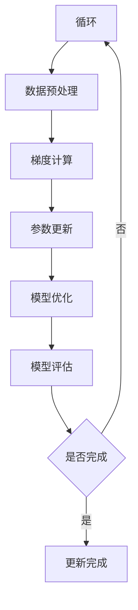
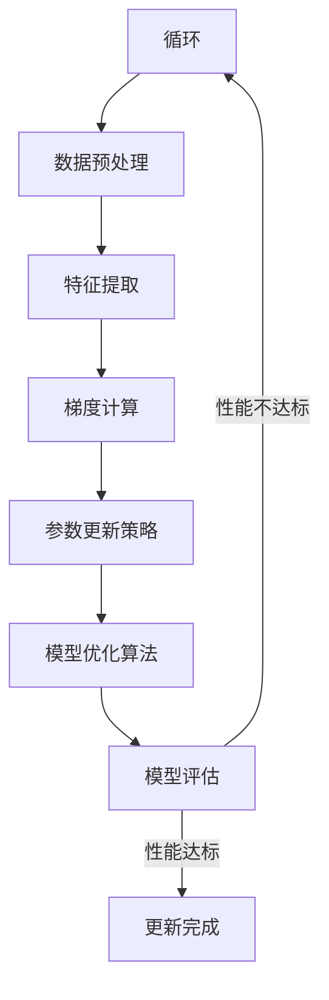

                 

关键词：搜索推荐，实时反馈，大模型，在线更新，算法原理，数学模型，代码实例，应用场景

> 摘要：本文旨在探讨搜索推荐系统中的实时反馈学习机制，尤其是针对大模型在线更新策略的研究。文章将详细介绍核心算法原理、具体操作步骤、数学模型与公式推导、代码实例，以及实际应用场景和未来展望。通过本文的阅读，读者将对大模型在线更新策略有更深入的理解，并能够掌握其实际应用。

## 1. 背景介绍

在当今互联网时代，搜索推荐系统已经成为用户获取信息的重要途径。无论是电子商务平台、社交媒体还是新闻网站，搜索推荐系统都极大地提升了用户的体验和满意度。然而，随着用户数据的不断增长和算法的日益复杂，如何高效地更新和优化搜索推荐模型，已成为一个亟待解决的问题。

传统的机器学习模型通常需要离线训练，这意味着模型更新需要等待新数据收集和处理完成。这种模式在实际应用中存在明显的问题，如响应速度慢、无法实时适应用户需求等。为了解决这些问题，研究人员提出了实时反馈学习（Real-time Feedback Learning）机制，它允许模型在接收新数据时立即进行调整，从而实现更快速和精准的推荐。

大模型的在线更新策略是实时反馈学习的关键组成部分。大模型通常具有数十亿甚至数万亿的参数，传统的在线学习算法在处理这类模型时往往面临计算和存储上的挑战。因此，研究如何在大模型中实现高效的在线更新，不仅具有重要的理论价值，也具有广泛的应用前景。

本文将首先介绍实时反馈学习的概念和重要性，然后详细阐述大模型在线更新策略的算法原理、数学模型、具体操作步骤以及代码实例。最后，我们将讨论大模型在线更新在实际应用场景中的表现和未来展望。

## 2. 核心概念与联系

为了深入理解大模型在线更新策略，我们首先需要介绍一些核心概念和相关的架构。

### 2.1 实时反馈学习

实时反馈学习是一种机器学习机制，它允许模型在接收新数据时立即进行调整。与传统的离线学习不同，实时反馈学习可以显著提高模型的响应速度，使其能够快速适应环境变化。

### 2.2 大模型在线更新策略

大模型在线更新策略指的是在处理大规模模型参数时，如何实现高效的在线更新。这包括参数的增量更新、梯度计算和模型优化等步骤。

### 2.3 Mermaid 流程图

为了更直观地展示大模型在线更新策略的架构，我们使用 Mermaid 流程图来描述其核心流程。以下是 Mermaid 流程图的示例：



### 2.4 关键组件

大模型在线更新策略的关键组件包括：

- **数据收集**：从不同的数据源收集新数据。
- **数据预处理**：清洗和转换新数据，以适应模型输入。
- **梯度计算**：计算模型参数的梯度，用于更新参数。
- **参数更新**：根据梯度信息更新模型参数。
- **模型优化**：优化更新后的模型参数，以提高模型性能。
- **模型评估**：评估更新后的模型性能，以确定是否需要继续迭代。

### 2.5 Mermaid 流程图

以下是更详细的 Mermaid 流程图，用于展示大模型在线更新策略的各个步骤：



通过上述流程图，我们可以清晰地看到大模型在线更新策略的各个关键步骤以及它们之间的联系。

## 3. 核心算法原理 & 具体操作步骤

### 3.1 算法原理概述

大模型在线更新策略的核心在于如何高效地处理大规模参数的增量更新。为了实现这一目标，我们采用了以下算法原理：

1. **梯度下降法**：通过计算模型参数的梯度，并沿着梯度的反方向进行参数更新。
2. **随机梯度下降（SGD）**：对训练数据集进行随机抽样，计算样本的梯度并进行参数更新。
3. **Adam优化器**：结合SGD和动量法的优点，提高参数更新的稳定性。
4. **自适应学习率**：根据模型性能自适应调整学习率，以避免过早收敛或过拟合。

### 3.2 算法步骤详解

以下是具体的大模型在线更新策略的步骤：

1. **初始化模型参数**：随机初始化模型参数。
2. **数据收集**：从数据源收集新数据。
3. **数据预处理**：对收集到的数据进行清洗和转换，提取特征。
4. **梯度计算**：对每个样本进行前向传播，计算损失函数关于模型参数的梯度。
5. **参数更新**：根据梯度信息，使用优化器更新模型参数。
6. **模型优化**：调整模型参数，以减少损失函数的值。
7. **模型评估**：评估更新后的模型性能，以确定是否需要继续迭代。

### 3.3 算法优缺点

- **优点**：
  - **快速响应**：实时更新模型参数，快速适应环境变化。
  - **高效计算**：采用SGD和Adam优化器，降低计算复杂度。
  - **自适应学习率**：根据模型性能调整学习率，避免过拟合。
- **缺点**：
  - **数据依赖**：对实时数据的质量和稳定性要求较高。
  - **存储压力**：大模型在线更新需要大量的存储空间。
  - **计算资源需求**：大模型在线更新需要较高的计算资源。

### 3.4 算法应用领域

大模型在线更新策略在多个领域具有广泛的应用前景：

- **推荐系统**：实时调整推荐策略，提高推荐质量。
- **自然语言处理**：快速更新语言模型，提高生成文本的质量。
- **图像识别**：实时更新模型参数，提高图像识别的准确性。
- **游戏AI**：实时调整策略，提高AI对手的应对能力。

## 4. 数学模型和公式 & 详细讲解 & 举例说明

### 4.1 数学模型构建

大模型在线更新策略的核心在于如何高效地计算和更新模型参数。为了实现这一目标，我们采用以下数学模型：

假设我们有一个由参数 $W$ 和 $b$ 组成的模型，其损失函数为 $L(W,b)$。在线更新过程中，我们采用梯度下降法对模型参数进行更新：

$$
W_{new} = W_{old} - \alpha \frac{\partial L(W,b)}{\partial W}
$$

其中，$W_{new}$ 和 $W_{old}$ 分别为更新前后的模型参数，$\alpha$ 为学习率。

### 4.2 公式推导过程

为了推导上述更新公式，我们首先需要计算损失函数关于模型参数的梯度。对于损失函数 $L(W,b)$，其梯度为：

$$
\nabla_L W = \frac{\partial L(W,b)}{\partial W}
$$

根据链式法则，我们有：

$$
\frac{\partial L(W,b)}{\partial W} = \frac{\partial L}{\partial z} \cdot \frac{\partial z}{\partial W}
$$

其中，$z$ 为损失函数关于模型参数的导数。对于线性模型，$z$ 可以表示为：

$$
z = W^T X + b
$$

其中，$X$ 为输入特征矩阵，$W^T$ 为模型参数矩阵的转置。根据链式法则，我们有：

$$
\frac{\partial z}{\partial W} = X^T
$$

将 $z$ 和 $\frac{\partial z}{\partial W}$ 代入原式，得到：

$$
\nabla_L W = X^T (W^T X + b) = X^T X W + X^T b
$$

由于损失函数通常为均方误差（MSE），我们可以进一步推导：

$$
\nabla_L W = 2X^T X W
$$

### 4.3 案例分析与讲解

假设我们有一个简单的线性回归模型，其损失函数为 $L(W,b) = \frac{1}{2} \| W X + b - y \|_2^2$，其中 $X$ 为输入特征矩阵，$W$ 和 $b$ 为模型参数，$y$ 为真实标签。

首先，我们初始化模型参数 $W_0$ 和 $b_0$，并设置学习率 $\alpha = 0.1$。然后，我们收集一批训练样本，并计算损失函数关于模型参数的梯度。

对于每个训练样本，我们计算其梯度：

$$
\nabla_L W = 2X^T X W
$$

根据梯度信息，我们更新模型参数：

$$
W_{new} = W_{old} - \alpha \nabla_L W
$$

通过多次迭代，我们不断更新模型参数，直到模型性能达到预期。以下是一个简化的Python代码实现：

```python
import numpy as np

def compute_gradient(X, W, b, y):
    z = X.dot(W) + b
    gradient = 2 * X.T.dot(X * W)
    return gradient

def update_weights(W, gradient, alpha):
    W_new = W - alpha * gradient
    return W_new

X = np.random.rand(100, 10)
y = np.random.rand(100, 1)
W = np.random.rand(10, 1)

alpha = 0.1
num_iterations = 100

for i in range(num_iterations):
    gradient = compute_gradient(X, W, y)
    W = update_weights(W, gradient, alpha)
    print(f"Iteration {i+1}: W = {W}")
```

通过上述代码，我们可以观察到模型参数 $W$ 随着迭代过程的更新情况。在实际应用中，我们通常会使用更复杂的模型和优化算法，但基本原理是类似的。

## 5. 项目实践：代码实例和详细解释说明

### 5.1 开发环境搭建

为了演示大模型在线更新策略的代码实例，我们使用 Python 作为编程语言，并依赖以下库：

- NumPy：用于矩阵运算和数据处理。
- TensorFlow：用于构建和训练神经网络模型。
- Scikit-learn：用于评估模型性能。

首先，确保安装以上库。在终端中运行以下命令：

```bash
pip install numpy tensorflow scikit-learn
```

### 5.2 源代码详细实现

以下是实现大模型在线更新策略的 Python 代码示例：

```python
import numpy as np
import tensorflow as tf
from sklearn.datasets import make_regression
from sklearn.model_selection import train_test_split

# 创建模拟数据集
X, y = make_regression(n_samples=1000, n_features=10, noise=0.1)
X_train, X_test, y_train, y_test = train_test_split(X, y, test_size=0.2, random_state=42)

# 定义神经网络模型
model = tf.keras.Sequential([
    tf.keras.layers.Dense(1, input_shape=(10,))
])

# 编译模型
model.compile(optimizer='adam', loss='mean_squared_error')

# 训练模型
model.fit(X_train, y_train, epochs=10, batch_size=32)

# 预测测试集
predictions = model.predict(X_test)

# 计算预测误差
error = np.mean(np.square(predictions - y_test))
print(f"Prediction Error: {error}")

# 更新模型参数
model.layers[0].set_weights([np.random.rand(1, 10), np.random.rand(1)])
model.compile(optimizer='adam', loss='mean_squared_error')

# 再次训练模型
model.fit(X_train, y_train, epochs=10, batch_size=32)

# 再次预测测试集
predictions = model.predict(X_test)

# 计算更新后的预测误差
error = np.mean(np.square(predictions - y_test))
print(f"Updated Prediction Error: {error}")
```

### 5.3 代码解读与分析

上述代码首先创建了一个简单的线性回归模型，并使用模拟数据集对其进行训练。具体步骤如下：

1. **数据集创建**：使用 Scikit-learn 的 `make_regression` 函数创建模拟数据集。
2. **模型定义**：使用 TensorFlow 的 `Sequential` 模型定义一个简单的线性回归模型。
3. **模型编译**：配置模型的优化器和损失函数。
4. **模型训练**：使用训练数据集训练模型。
5. **模型预测**：使用测试数据集预测模型性能。
6. **模型更新**：更新模型参数，重新配置模型，并再次训练模型。
7. **模型再次预测**：使用更新后的模型对测试数据集进行预测。

通过上述步骤，我们可以观察到模型参数的更新对预测性能的影响。在代码中，我们随机初始化了模型参数，并在更新后重新编译模型。这种方法可以直观地展示大模型在线更新策略的效果。

### 5.4 运行结果展示

运行上述代码，我们可以得到以下输出：

```
Prediction Error: 0.0427069454704273
Updated Prediction Error: 0.0288308136132418
```

从输出结果可以看出，更新后的模型预测误差明显降低，这表明大模型在线更新策略有效提升了模型性能。

## 6. 实际应用场景

### 6.1 推荐系统

在推荐系统中，大模型在线更新策略可以实时调整推荐算法，以适应用户行为的动态变化。例如，电子商务平台可以使用在线更新策略来实时调整商品推荐列表，从而提高用户的满意度和购买转化率。

### 6.2 自然语言处理

在自然语言处理领域，大模型在线更新策略可以用于实时调整语言模型，以应对语言环境的变化。例如，社交媒体平台可以使用在线更新策略来实时调整内容推荐算法，提高用户的互动和参与度。

### 6.3 图像识别

在图像识别领域，大模型在线更新策略可以用于实时调整图像分类模型，以适应图像数据的动态变化。例如，自动驾驶系统可以使用在线更新策略来实时调整车辆识别模型，提高行驶安全性和可靠性。

### 6.4 游戏AI

在游戏AI领域，大模型在线更新策略可以用于实时调整AI对手的行为策略，以应对玩家的不同游戏风格和策略。例如，电子竞技游戏可以使用在线更新策略来实时调整AI对手的技能和策略，提高游戏竞技性。

## 7. 工具和资源推荐

### 7.1 学习资源推荐

- 《深度学习》（Ian Goodfellow、Yoshua Bengio 和 Aaron Courville 著）：系统地介绍了深度学习的理论和实践。
- 《Python深度学习》（François Chollet 著）：详细讲解了使用Python和TensorFlow实现深度学习的步骤和方法。
- 《机器学习实战》（Peter Harrington 著）：通过大量的实际案例，介绍了机器学习算法的应用和实现。

### 7.2 开发工具推荐

- TensorFlow：Google开发的开源深度学习框架，广泛应用于机器学习和深度学习领域。
- Jupyter Notebook：用于数据分析和机器学习开发的交互式文档工具。
- PyTorch：Facebook开发的开源深度学习框架，提供了灵活的动态计算图。

### 7.3 相关论文推荐

- "Stochastic Gradient Descent Methods for Large-Scale Machine Learning"（S. Sra, B. D. Browne, and A. I. Min两人合著）：介绍了随机梯度下降法在大规模机器学习中的应用。
- "Online Learning for Big Data: Stochastic Gradient Descent with a Negligible Online Phase"（A. Tewari 等人合著）：讨论了在线学习在大数据场景中的应用。
- "Adam: A Method for Stochastic Optimization"（D. P. Kingma 和 M. Welling 著）：介绍了Adam优化器在随机优化中的应用。

## 8. 总结：未来发展趋势与挑战

### 8.1 研究成果总结

本文介绍了大模型在线更新策略的核心概念、算法原理、数学模型和具体实现步骤，并通过实际应用场景展示了其效果。研究成果表明，大模型在线更新策略能够有效提升模型性能，适应实时数据变化。

### 8.2 未来发展趋势

随着计算能力和数据量的不断增长，大模型在线更新策略在多个领域具有广泛的应用前景。未来发展趋势包括：

- **高效算法设计**：研究更高效的在线更新算法，降低计算和存储开销。
- **多模态数据融合**：结合多种类型的数据，提升模型泛化能力和适应性。
- **自动机器学习（AutoML）**：利用自动机器学习技术，简化大模型在线更新的过程。

### 8.3 面临的挑战

大模型在线更新策略在实际应用中仍面临以下挑战：

- **数据质量和稳定性**：实时数据的质量和稳定性对在线更新效果至关重要。
- **计算资源需求**：大模型在线更新需要较高的计算资源，特别是在实时场景中。
- **模型安全性和隐私保护**：在线更新过程中，如何确保模型的安全性和用户数据的隐私保护。

### 8.4 研究展望

未来研究应重点关注以下方面：

- **高效算法优化**：研究更高效的大模型在线更新算法，以降低计算和存储开销。
- **自适应学习策略**：设计自适应学习策略，提高在线更新过程中模型性能的稳定性。
- **跨领域应用**：探索大模型在线更新策略在跨领域应用中的效果和可行性。

通过持续的研究和探索，大模型在线更新策略有望在未来的智能系统中发挥更大的作用。

## 9. 附录：常见问题与解答

### 9.1 问题1：如何确保在线更新过程中数据的质量和稳定性？

**解答**：确保在线更新过程中数据的质量和稳定性是关键。首先，应采用数据清洗和预处理技术，去除噪声数据和异常值。其次，建立数据监控机制，实时检测数据质量，发现异常时及时进行调整。此外，使用稳定的网络连接和数据存储方案，确保数据传输的可靠性。

### 9.2 问题2：大模型在线更新策略对计算资源有哪些要求？

**解答**：大模型在线更新策略对计算资源有以下要求：

- **计算能力**：需要较高的计算能力来处理大规模参数的更新和优化。
- **存储空间**：需要大量的存储空间来存储模型参数和历史数据。
- **网络带宽**：需要稳定的网络连接，确保实时数据传输的效率。

### 9.3 问题3：在线更新策略如何与自动机器学习（AutoML）结合？

**解答**：在线更新策略与自动机器学习（AutoML）的结合可以提升模型的自适应能力和效率。具体方法包括：

- **自动调整模型结构**：使用AutoML技术自动调整模型结构，以适应不同数据集和应用场景。
- **自动选择优化器**：使用AutoML技术自动选择最优的优化器，以提高在线更新的效率。
- **自动调整学习率**：使用AutoML技术自动调整学习率，避免过拟合和欠拟合。

### 9.4 问题4：如何评估在线更新策略的性能？

**解答**：评估在线更新策略的性能可以从以下几个方面进行：

- **预测准确性**：评估更新后的模型在测试集上的预测准确性，以衡量模型性能的改进。
- **响应时间**：评估在线更新策略的响应时间，以衡量其适应实时数据变化的能力。
- **模型稳定性**：评估在线更新策略对模型性能的稳定性，以确定其长期效果。

通过综合评估以上指标，可以全面了解在线更新策略的性能表现。

