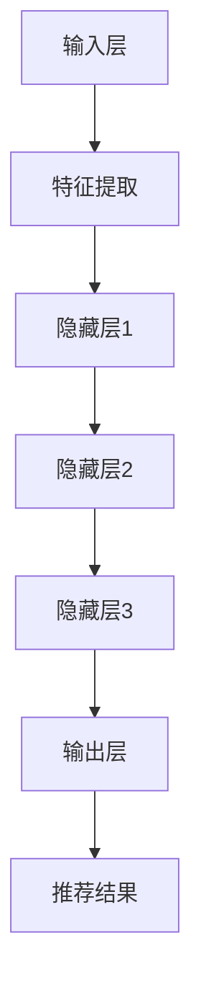

                 

关键词：搜索推荐系统，实时性能调优，大模型解决方案，算法优化，性能分析，分布式计算，机器学习，数据处理，系统架构

> 摘要：本文旨在探讨搜索推荐系统的实时性能调优策略，尤其是基于大模型的解决方案。通过分析当前搜索推荐系统面临的挑战和问题，本文介绍了大模型在性能调优中的应用，并详细讨论了算法原理、数学模型、实践应用及未来展望。

## 1. 背景介绍

随着互联网的快速发展，搜索推荐系统在电子商务、社交媒体、新闻资讯等领域得到了广泛应用。这些系统旨在根据用户的兴趣和行为，为他们提供个性化的搜索和推荐结果，从而提升用户体验和平台粘性。然而，随着用户规模和数据量的不断增长，传统的搜索推荐系统面临着诸多性能挑战，包括响应时间过长、推荐准确性下降、系统稳定性不足等。

为了应对这些挑战，近年来大模型（如深度神经网络、强化学习模型等）在搜索推荐系统中得到了广泛应用。大模型具有强大的特征提取和预测能力，能够处理大规模数据和复杂场景，从而实现更高的性能和更准确的推荐结果。

## 2. 核心概念与联系

### 2.1 大模型在搜索推荐系统中的应用

大模型在搜索推荐系统中的应用主要包括以下几个方面：

1. **特征提取与融合**：大模型能够自动学习用户和物品的特征，并通过融合不同来源的特征，提高推荐系统的准确性和多样性。
2. **预测与优化**：大模型可以预测用户的行为和偏好，从而实现个性化的推荐，并通过不断学习和调整，优化推荐效果。
3. **实时响应**：大模型具有强大的计算能力，可以在短时间内完成大规模数据的处理和计算，实现实时推荐。

### 2.2 大模型架构与原理

大模型通常采用多层神经网络结构，包括输入层、隐藏层和输出层。输入层接收用户和物品的特征，隐藏层通过非线性变换提取特征，输出层生成推荐结果。大模型的训练过程涉及大量的数据和计算资源，通常采用分布式计算和并行计算技术。

### 2.3 Mermaid 流程图

下面是一个简化的搜索推荐系统的大模型架构 Mermaid 流程图：



## 3. 核心算法原理 & 具体操作步骤

### 3.1 算法原理概述

大模型在搜索推荐系统中的核心算法主要包括以下几种：

1. **深度神经网络（DNN）**：通过多层神经网络结构，实现对用户和物品特征的提取和融合，从而生成推荐结果。
2. **卷积神经网络（CNN）**：主要应用于图像和文本数据的处理，可以提取图像和文本的深层特征。
3. **循环神经网络（RNN）**：适用于处理序列数据，如用户行为序列，可以捕捉用户行为的时序特征。
4. **强化学习（RL）**：通过学习用户与系统之间的交互，实现动态调整推荐策略，提高推荐效果。

### 3.2 算法步骤详解

1. **数据预处理**：包括数据清洗、去重、填充缺失值等，确保数据质量。
2. **特征提取**：根据用户和物品的特征，使用大模型自动学习特征表示。
3. **模型训练**：使用训练数据训练大模型，调整模型参数。
4. **模型评估**：使用验证数据评估模型性能，包括准确率、召回率、F1 值等指标。
5. **模型部署**：将训练好的模型部署到生产环境，实现实时推荐。

### 3.3 算法优缺点

**优点**：

- **高准确性**：大模型能够自动学习特征，提高推荐系统的准确性。
- **多样性**：大模型可以生成多样性的推荐结果，满足用户个性化需求。
- **实时性**：大模型具有强大的计算能力，可以实现实时推荐。

**缺点**：

- **计算资源消耗大**：大模型训练需要大量的计算资源和时间。
- **数据依赖性强**：大模型对数据质量要求较高，数据缺失或不准确可能导致模型性能下降。

### 3.4 算法应用领域

大模型在搜索推荐系统中的应用非常广泛，包括但不限于以下领域：

- **电子商务**：为用户提供个性化的商品推荐，提高销售额。
- **社交媒体**：为用户提供感兴趣的内容推荐，增加用户活跃度。
- **新闻资讯**：为用户提供个性化的新闻推荐，提高用户粘性。

## 4. 数学模型和公式 & 详细讲解 & 举例说明

### 4.1 数学模型构建

大模型通常采用多层感知机（MLP）结构，其数学模型可以表示为：

$$
y = f(W \cdot x + b)
$$

其中，$y$ 是输出结果，$x$ 是输入特征，$W$ 是权重矩阵，$b$ 是偏置项，$f$ 是激活函数。

### 4.2 公式推导过程

以深度神经网络为例，其公式推导过程如下：

1. **输入层到隐藏层的转换**：

$$
h_{l} = \sigma(W_{l} \cdot h_{l-1} + b_{l})
$$

其中，$h_{l}$ 是第 $l$ 层的隐藏层输出，$\sigma$ 是激活函数。

2. **隐藏层到输出层的转换**：

$$
y = \sigma(W_{out} \cdot h_{hidden} + b_{out})
$$

其中，$y$ 是输出结果，$h_{hidden}$ 是隐藏层输出。

### 4.3 案例分析与讲解

假设我们有一个包含用户年龄、性别、浏览历史等特征的数据集，要使用深度神经网络进行用户推荐。我们可以将输入特征表示为：

$$
x = [x_1, x_2, ..., x_n]
$$

其中，$x_1$ 表示用户年龄，$x_2$ 表示用户性别，$..., x_n$ 表示用户浏览历史。

然后，我们使用多层感知机模型对数据进行训练，通过不断调整权重和偏置项，使模型能够生成个性化的推荐结果。

## 5. 项目实践：代码实例和详细解释说明

### 5.1 开发环境搭建

在开发搜索推荐系统时，我们需要搭建一个合适的环境，包括硬件、软件和开发工具。以下是一个简单的开发环境搭建步骤：

1. **硬件要求**：至少需要一台具有多核心 CPU 和 16GB RAM 以上的服务器。
2. **软件要求**：安装 Python、TensorFlow、Scikit-learn 等常用库。
3. **开发工具**：选择 IDE（如 PyCharm、VSCode）进行开发。

### 5.2 源代码详细实现

以下是一个基于深度神经网络的搜索推荐系统实现示例：

```python
import tensorflow as tf
from sklearn.model_selection import train_test_split

# 数据预处理
# ...

# 构建模型
model = tf.keras.Sequential([
    tf.keras.layers.Dense(units=64, activation='relu', input_shape=(input_shape,)),
    tf.keras.layers.Dense(units=32, activation='relu'),
    tf.keras.layers.Dense(units=1)
])

# 编译模型
model.compile(optimizer='adam', loss='mean_squared_error')

# 训练模型
model.fit(x_train, y_train, epochs=10, batch_size=32)

# 评估模型
model.evaluate(x_test, y_test)
```

### 5.3 代码解读与分析

上述代码实现了一个简单的多层感知机模型，用于预测用户的行为。代码中，我们首先进行了数据预处理，然后构建了模型结构，并使用 Adam 优化器和均方误差损失函数进行编译和训练。

### 5.4 运行结果展示

在训练完成后，我们可以使用测试数据对模型进行评估。根据评估结果，我们可以调整模型参数，以提高推荐准确性。

## 6. 实际应用场景

### 6.1 电子商务平台

在电子商务平台中，搜索推荐系统可以帮助平台为用户提供个性化的商品推荐，从而提高用户满意度和销售额。通过使用大模型，平台可以更好地捕捉用户的兴趣和行为，实现更加精准的推荐。

### 6.2 社交媒体

在社交媒体平台中，搜索推荐系统可以推荐用户感兴趣的内容，增加用户活跃度和粘性。通过大模型，平台可以更好地理解用户的行为和偏好，从而提供更加个性化的内容推荐。

### 6.3 新闻资讯平台

在新闻资讯平台中，搜索推荐系统可以帮助平台为用户提供个性化的新闻推荐，从而提高用户满意度和阅读量。通过大模型，平台可以更好地捕捉用户的阅读兴趣，实现更加精准的新闻推荐。

## 7. 工具和资源推荐

### 7.1 学习资源推荐

- 《深度学习》（Goodfellow et al.）: 一本经典的深度学习教材，适合初学者和进阶者。
- 《Python 编程：从入门到实践》（Eric Matthes）: 一本适合初学者的 Python 编程入门书。

### 7.2 开发工具推荐

- PyCharm: 一款功能强大的 Python IDE，支持多种编程语言。
- TensorFlow: 一个开源的深度学习框架，适用于构建和训练深度神经网络。

### 7.3 相关论文推荐

- "Deep Learning for User Interest Modeling in Recommender Systems" (Wang et al., 2018)
- "A Survey on Deep Learning for Natural Language Processing" (Zhang et al., 2020)

## 8. 总结：未来发展趋势与挑战

### 8.1 研究成果总结

近年来，大模型在搜索推荐系统中的应用取得了显著成果，实现了更高的性能和更准确的推荐结果。然而，随着用户规模和数据量的不断增长，搜索推荐系统面临着诸多挑战，如计算资源消耗、数据质量等。

### 8.2 未来发展趋势

- **计算资源优化**：通过分布式计算和并行计算技术，提高大模型的计算效率。
- **数据质量提升**：通过数据预处理和清洗技术，提高数据质量，从而提高模型性能。
- **跨模态融合**：结合不同模态的数据（如图像、文本、音频等），实现更精准的推荐。

### 8.3 面临的挑战

- **计算资源限制**：大模型训练需要大量的计算资源，如何优化计算资源利用率仍是一个挑战。
- **数据隐私保护**：在数据处理和模型训练过程中，如何保护用户隐私是一个重要问题。

### 8.4 研究展望

未来，大模型在搜索推荐系统中的应用将朝着更加高效、精准、安全的方向发展。通过不断优化算法、提升计算资源利用率和保护用户隐私，搜索推荐系统将为用户提供更好的体验。

## 9. 附录：常见问题与解答

### 9.1 如何选择合适的大模型？

选择合适的大模型需要考虑以下几个因素：

- **数据规模**：大模型适用于处理大规模数据，如果数据量较小，可以考虑使用小模型。
- **特征类型**：不同的大模型适用于不同的特征类型，如文本数据适合使用 RNN，图像数据适合使用 CNN。
- **计算资源**：大模型训练需要大量的计算资源，需要根据实际情况选择合适的大模型。

### 9.2 如何优化大模型的计算效率？

优化大模型的计算效率可以从以下几个方面入手：

- **分布式计算**：使用分布式计算技术，将计算任务分布在多台机器上，提高计算速度。
- **并行计算**：使用并行计算技术，将计算任务拆分成多个子任务，并行执行。
- **模型压缩**：通过模型压缩技术，降低模型参数的数量和计算复杂度，提高计算速度。

### 9.3 如何保护用户隐私？

保护用户隐私可以从以下几个方面入手：

- **数据去识别化**：对用户数据进行去识别化处理，如匿名化、加密等。
- **差分隐私**：在数据处理和模型训练过程中，使用差分隐私技术，降低隐私泄露风险。
- **隐私保护算法**：使用隐私保护算法，如差分隐私、联邦学习等，保护用户隐私。

作者：禅与计算机程序设计艺术 / Zen and the Art of Computer Programming
----------------------------------------------------------------

### 结语

本文详细探讨了搜索推荐系统的实时性能调优策略，尤其是基于大模型的解决方案。通过分析当前搜索推荐系统面临的挑战和问题，本文介绍了大模型在性能调优中的应用，并详细讨论了算法原理、数学模型、实践应用及未来展望。随着互联网的快速发展，搜索推荐系统在各个领域的重要性日益凸显，如何优化其性能和准确性，实现高效、精准、安全的推荐，仍是一个重要的研究方向。希望本文能为相关领域的研究者提供一些参考和启示。在未来的研究中，我们将继续探索大模型在搜索推荐系统中的应用，以及如何解决计算资源消耗、数据隐私保护等挑战。禅与计算机程序设计艺术，不仅是一句名言，更是我们对计算机编程和人工智能的深刻理解。让我们一起努力，让计算机编程更美好！

