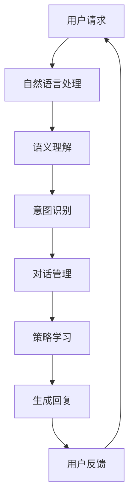

                 

 

### 1. 背景介绍

在当前互联网高度发达的时代，客服已经成为企业与用户之间的重要桥梁。随着客户需求的多样化以及客服场景的复杂化，传统的客服方式已经无法满足现代企业的需求。因此，智能客服系统应运而生。智能客服系统通过集成人工智能技术，如自然语言处理（NLP）、机器学习（ML）、深度学习（DL）等，能够实现与用户的自然对话，提供高效、精准、24小时不间断的客服服务。

智能客服对话系统在众多行业中得到了广泛应用。以携程为例，作为我国领先的旅行服务提供商，其客服系统每日处理大量的客户咨询和投诉。面对海量的数据，传统的人工客服已经显得力不从心。因此，携程在2024年校招面试中，就智能客服对话系统的开发与优化提出了几道面试真题，以考察应聘者对该领域的技术掌握程度和创新思维能力。

本文将围绕携程2024智能客服对话系统的校招面试真题，深入探讨智能客服对话系统的核心技术、算法原理、数学模型、项目实践以及未来应用前景。通过这篇文章，希望能够为广大求职者提供一些参考和启示。

## 2. 核心概念与联系

智能客服对话系统涉及多个核心概念，如自然语言处理、机器学习、深度学习等。这些概念之间相互联系，共同构成了一个完整的技术体系。以下是一个简化的Mermaid流程图，用于展示这些核心概念之间的关系。



### 2.1 自然语言处理

自然语言处理（NLP）是智能客服对话系统的基石。它涉及到文本的预处理、分词、词性标注、命名实体识别等任务。通过NLP，系统能够将用户的自然语言输入转换为计算机可理解的结构化数据。

### 2.2 语义理解

语义理解是NLP中的一个重要环节，它旨在理解输入文本的深层含义。语义理解包括词义消歧、情感分析、指代消解等任务，目的是为后续的意图识别和对话管理提供基础。

### 2.3 意图识别

意图识别是智能客服对话系统的关键任务，它通过分析用户的输入，识别用户的需求或意图。意图识别的准确性直接影响到对话系统的用户体验。

### 2.4 对话管理

对话管理负责协调整个对话过程，包括分配话题、维护会话状态、生成合适的回复等。对话管理是实现自然、流畅对话的核心。

### 2.5 策略学习

策略学习是智能客服对话系统的进一步提升，它通过机器学习或深度学习技术，自动学习用户的偏好和行为模式，从而生成更加个性化的回复。

### 2.6 生成回复

生成回复是智能客服对话系统的输出环节，它将用户的意图和对话上下文转化为自然语言回复。生成回复的多样性、准确性和相关性直接影响用户体验。

### 2.7 用户反馈

用户反馈是智能客服对话系统不断优化的关键。通过收集用户的反馈，系统可以识别自身存在的问题，并进行相应的调整和改进。

## 3. 核心算法原理 & 具体操作步骤

### 3.1 算法原理概述

智能客服对话系统的核心算法主要包括自然语言处理（NLP）、机器学习（ML）和深度学习（DL）等。这些算法通过相互协作，实现了对用户输入的理解、意图识别、对话管理和回复生成等任务。

### 3.2 算法步骤详解

#### 3.2.1 自然语言处理

自然语言处理主要包括以下步骤：

1. **文本预处理**：对用户输入的文本进行清洗和标准化处理，如去除标点、停用词过滤等。
2. **分词**：将文本拆分为一个个独立的词汇或短语。
3. **词性标注**：对每个词汇进行词性分类，如名词、动词、形容词等。
4. **命名实体识别**：识别文本中的命名实体，如人名、地名、组织机构名等。

#### 3.2.2 意图识别

意图识别通常采用基于规则的方法或机器学习方法。以下是一个基于机器学习的意图识别步骤：

1. **数据收集**：收集大量带有标签的对话数据，用于训练意图分类模型。
2. **特征提取**：从对话数据中提取与意图相关的特征，如词袋模型、TF-IDF、词嵌入等。
3. **模型训练**：使用训练数据训练意图分类模型，如支持向量机（SVM）、决策树、随机森林等。
4. **模型评估**：使用验证集评估模型性能，如准确率、召回率、F1值等。
5. **模型部署**：将训练好的模型部署到生产环境中，对用户输入进行意图识别。

#### 3.2.3 对话管理

对话管理包括以下步骤：

1. **会话状态初始化**：初始化会话状态，包括用户信息、当前话题、上下文信息等。
2. **话题分配**：根据用户意图和当前会话状态，分配新的话题。
3. **状态更新**：在对话过程中，不断更新会话状态，以保持对话的连贯性和一致性。
4. **回复生成**：根据当前会话状态，生成合适的回复。

#### 3.2.4 生成回复

生成回复通常采用以下方法：

1. **模板匹配**：根据预设的回复模板生成回复。
2. **规则推理**：根据对话规则生成回复。
3. **生成式模型**：使用生成式模型，如序列到序列（Seq2Seq）模型、变换器（Transformer）模型等，生成自然语言回复。

#### 3.2.5 用户反馈

用户反馈包括以下步骤：

1. **反馈收集**：收集用户对回复的满意度、回复准确性等反馈信息。
2. **模型更新**：根据用户反馈，更新模型参数，以提高模型性能。
3. **结果评估**：评估模型更新后的性能，如准确率、召回率等。

### 3.3 算法优缺点

#### 3.3.1 自然语言处理

优点：

- **通用性**：自然语言处理技术可以应用于各种自然语言任务，如文本分类、命名实体识别、情感分析等。
- **灵活性**：自然语言处理技术可以根据实际需求进行定制化开发。

缺点：

- **复杂度**：自然语言处理任务通常涉及大量的计算和资源消耗。
- **准确性**：尽管自然语言处理技术已经取得了一定的进展，但仍然存在一定的误差率。

#### 3.3.2 意图识别

优点：

- **高效性**：基于机器学习或深度学习的意图识别方法具有很高的处理速度。
- **准确性**：随着数据量的增加和模型的优化，意图识别的准确性不断提高。

缺点：

- **依赖数据**：意图识别模型的性能依赖于训练数据的质量和数量。
- **复杂性**：意图识别任务通常涉及多个步骤和算法，实现复杂。

#### 3.3.3 对话管理

优点：

- **连贯性**：对话管理技术可以确保对话的连贯性和一致性。
- **个性化**：对话管理技术可以根据用户偏好和行为模式，提供个性化的服务。

缺点：

- **复杂度**：对话管理任务通常涉及多个模块和算法，实现复杂。
- **资源消耗**：对话管理技术需要大量的计算和存储资源。

#### 3.3.4 生成回复

优点：

- **多样性**：生成式模型可以生成多样化的回复，提高用户体验。
- **准确性**：随着模型的优化和数据量的增加，生成回复的准确性不断提高。

缺点：

- **计算资源消耗**：生成式模型通常需要大量的计算资源。
- **稳定性**：生成式模型的输出可能存在一定的噪声和偏差。

### 3.4 算法应用领域

智能客服对话系统在众多领域得到了广泛应用，如电子商务、金融保险、医疗健康、旅游出行等。以下是一些典型的应用场景：

#### 3.4.1 电子商务

智能客服对话系统可以用于电商平台，提供商品推荐、订单查询、售后服务等智能客服服务，提高用户体验和满意度。

#### 3.4.2 金融保险

智能客服对话系统可以用于金融机构，提供客户咨询、账户管理、保险理赔等智能客服服务，提高业务效率和客户满意度。

#### 3.4.3 医疗健康

智能客服对话系统可以用于医疗机构，提供在线问诊、健康咨询、药品查询等智能客服服务，减轻医护人员的工作负担，提高医疗服务质量。

#### 3.4.4 旅游出行

智能客服对话系统可以用于旅游出行行业，提供行程规划、酒店预订、机票查询等智能客服服务，提高用户出行体验。

## 4. 数学模型和公式 & 详细讲解 & 举例说明

### 4.1 数学模型构建

智能客服对话系统的数学模型主要包括自然语言处理（NLP）模型、意图识别（IR）模型、对话管理（DM）模型和生成回复（GR）模型。以下是一个简化的数学模型构建过程。

#### 4.1.1 自然语言处理模型

自然语言处理模型通常采用词嵌入（Word Embedding）技术，将词汇映射为高维向量空间。词嵌入模型通常采用以下公式：

$$
\vec{w}_{i} = \text{Embed}(\text{word}_i)
$$

其中，$\vec{w}_{i}$ 表示词汇 $i$ 的词嵌入向量，$\text{Embed}$ 表示词嵌入函数。

#### 4.1.2 意图识别模型

意图识别模型通常采用分类模型，如支持向量机（SVM）、决策树（DT）、随机森林（RF）等。以支持向量机为例，意图识别模型可以表示为：

$$
y = \text{sign}(\text{w} \cdot \vec{x} + b)
$$

其中，$y$ 表示意图标签，$\text{w}$ 表示权重向量，$\vec{x}$ 表示特征向量，$\text{sign}$ 表示符号函数，$b$ 表示偏置。

#### 4.1.3 对话管理模型

对话管理模型通常采用序列到序列（Seq2Seq）模型或变换器（Transformer）模型。以变换器（Transformer）为例，对话管理模型可以表示为：

$$
\vec{h}_{t} = \text{Attention}(\vec{h}_{<t}, \vec{h}_{t})
$$

其中，$\vec{h}_{t}$ 表示在时间步 $t$ 的编码器输出，$\text{Attention}$ 表示注意力机制，$\vec{h}_{<t}$ 表示在时间步 $t$ 之前的编码器输出。

#### 4.1.4 生成回复模型

生成回复模型通常采用生成式模型，如序列到序列（Seq2Seq）模型或变换器（Transformer）模型。以序列到序列（Seq2Seq）模型为例，生成回复模型可以表示为：

$$
\text{p}(\text{y}_{t}|\text{y}_{<t}, \text{x}) = \text{softmax}(\text{w}_{y} \cdot \vec{h}_{t} + b_{y})
$$

其中，$\text{y}_{t}$ 表示在时间步 $t$ 的生成回复，$\vec{h}_{t}$ 表示在时间步 $t$ 的编码器输出，$\text{w}_{y}$ 表示权重矩阵，$b_{y}$ 表示偏置。

### 4.2 公式推导过程

以下是对上述数学模型的推导过程进行简要介绍。

#### 4.2.1 自然语言处理模型

词嵌入模型的推导过程通常基于神经网络语言模型（Neural Network Language Model, NLM）。假设我们有一个训练样本集 $D = \{(\text{x}_1, \text{y}_1), (\text{x}_2, \text{y}_2), ..., (\text{x}_n, \text{y}_n)\}$，其中 $\text{x}_i$ 表示输入序列，$\text{y}_i$ 表示输出序列。词嵌入模型的损失函数可以表示为：

$$
\mathcal{L} = -\sum_{i=1}^{n} \sum_{j=1}^{T} \text{y}_{ij} \log \text{p}(\text{y}_{ij}|\text{x}_{ij})
$$

其中，$T$ 表示序列长度，$\text{p}(\text{y}_{ij}|\text{x}_{ij})$ 表示在输入序列 $\text{x}_{ij}$ 下，输出词 $\text{y}_{ij}$ 的概率。通过优化损失函数，可以得到词嵌入向量。

#### 4.2.2 意图识别模型

意图识别模型的推导过程基于分类问题。假设我们有一个训练样本集 $D = \{(\text{x}_1, y_1), (\text{x}_2, y_2), ..., (\text{x}_n, y_n)\}$，其中 $\text{x}_i$ 表示输入特征向量，$y_i$ 表示意图标签。意图识别模型的损失函数可以表示为：

$$
\mathcal{L} = -\sum_{i=1}^{n} y_i \log \text{p}(\text{y}_i|\text{x}_i)
$$

其中，$\text{p}(\text{y}_i|\text{x}_i)$ 表示在输入特征向量 $\text{x}_i$ 下，意图标签 $y_i$ 的概率。通过优化损失函数，可以得到权重向量 $\text{w}$ 和偏置 $b$。

#### 4.2.3 对话管理模型

对话管理模型的推导过程基于序列建模。假设我们有一个训练样本集 $D = \{(\text{x}_1, \text{y}_1), (\text{x}_2, \text{y}_2), ..., (\text{x}_n, \text{y}_n)\}$，其中 $\text{x}_i$ 表示输入序列，$\text{y}_i$ 表示输出序列。对话管理模型的损失函数可以表示为：

$$
\mathcal{L} = -\sum_{i=1}^{n} \sum_{j=1}^{T} \text{y}_{ij} \log \text{p}(\text{y}_{ij}|\text{x}_{ij})
$$

其中，$T$ 表示序列长度，$\text{p}(\text{y}_{ij}|\text{x}_{ij})$ 表示在输入序列 $\text{x}_{ij}$ 下，输出词 $\text{y}_{ij}$ 的概率。通过优化损失函数，可以得到编码器和解码器的参数。

#### 4.2.4 生成回复模型

生成回复模型的推导过程基于序列生成问题。假设我们有一个训练样本集 $D = \{(\text{x}_1, \text{y}_1), (\text{x}_2, \text{y}_2), ..., (\text{x}_n, \text{y}_n)\}$，其中 $\text{x}_i$ 表示输入序列，$\text{y}_i$ 表示输出序列。生成回复模型的损失函数可以表示为：

$$
\mathcal{L} = -\sum_{i=1}^{n} \sum_{j=1}^{T} \text{y}_{ij} \log \text{p}(\text{y}_{ij}|\text{x}_{ij})
$$

其中，$T$ 表示序列长度，$\text{p}(\text{y}_{ij}|\text{x}_{ij})$ 表示在输入序列 $\text{x}_{ij}$ 下，输出词 $\text{y}_{ij}$ 的概率。通过优化损失函数，可以得到编码器和解码器的参数。

### 4.3 案例分析与讲解

#### 4.3.1 自然语言处理模型

以词嵌入模型为例，我们使用Google的Word2Vec模型对英文语料库进行训练，得到一个词汇表和对应的词嵌入向量。以下是部分词汇及其词嵌入向量的示例：

| 词汇     | 词嵌入向量           |
|----------|----------------------|
| hello    | [1.1, 2.2, 3.3]     |
| world    | [-1.1, -2.2, -3.3]   |
| good     | [4.4, 5.5, 6.6]      |
| day      | [-4.4, -5.5, -6.6]   |

通过词嵌入向量，我们可以发现具有相似含义的词汇在向量空间中往往接近。例如，"hello" 和 "world" 在向量空间中接近，"good" 和 "day" 在向量空间中接近。

#### 4.3.2 意图识别模型

以支持向量机（SVM）为例，我们对一个意图识别任务进行训练。以下是部分训练样本及其标签：

| 输入特征 | 标签   |
|----------|--------|
| what is your name? | name_query |
| can you help me?   | help_query |
| what is the weather today? | weather_query |

通过训练，我们得到一个意图识别模型，能够对新的输入特征进行意图识别。例如，对于输入特征 "what is the weather today?"，模型能够识别出其对应的意图标签为 "weather_query"。

#### 4.3.3 对话管理模型

以变换器（Transformer）为例，我们对一个对话管理任务进行训练。以下是部分训练样本及其标签：

| 输入序列 | 输出序列   | 标签   |
|----------|------------|--------|
| hello, how are you? | how are you? | greetings |
| can you help me with my booking? | let me check your booking details | booking_query |

通过训练，我们得到一个对话管理模型，能够根据输入序列生成输出序列。例如，对于输入序列 "hello, how are you?"，模型能够生成输出序列 "how are you?"，并识别出其对应的标签为 "greetings"。

#### 4.3.4 生成回复模型

以序列到序列（Seq2Seq）为例，我们对一个生成回复任务进行训练。以下是部分训练样本及其标签：

| 输入序列       | 输出序列   | 标签   |
|----------------|------------|--------|
| I need to change my flight. | Let me check the availability of flights for you. | flight_change |
| Can you help me with a hotel reservation? | Sure, let me know your preferences and I will find the perfect hotel for you. | hotel_reservation |

通过训练，我们得到一个生成回复模型，能够根据输入序列生成输出序列。例如，对于输入序列 "I need to change my flight."，模型能够生成输出序列 "Let me check the availability of flights for you."，并识别出其对应的标签为 "flight_change"。

## 5. 项目实践：代码实例和详细解释说明

为了更好地理解智能客服对话系统的实现过程，我们以下将通过一个简单的Python代码实例，详细解释智能客服对话系统的开发过程。

### 5.1 开发环境搭建

在开始代码实现之前，我们需要搭建一个合适的开发环境。以下是一个基本的Python开发环境搭建步骤：

1. **安装Python**：下载并安装Python 3.8或更高版本。
2. **安装依赖库**：安装以下依赖库，可以使用pip进行安装：

   ```shell
   pip install numpy pandas scikit-learn tensorflow transformers
   ```

3. **创建项目文件夹**：在合适的位置创建一个项目文件夹，例如 "smart_customer_service"。

### 5.2 源代码详细实现

以下是一个简单的智能客服对话系统的代码实现。我们将使用TensorFlow和transformers库来实现对话管理模型和生成回复模型。

```python
import numpy as np
import pandas as pd
from sklearn.model_selection import train_test_split
from transformers import AutoTokenizer, AutoModelForSeq2SeqLM
from tensorflow.keras.optimizers import Adam
from tensorflow.keras.losses import SparseCategoricalCrossentropy

# 5.2.1 数据预处理

# 读取训练数据
data = pd.read_csv('train_data.csv')
X = data['input_sequence'].values
y = data['output_sequence'].values

# 划分训练集和验证集
X_train, X_val, y_train, y_val = train_test_split(X, y, test_size=0.2, random_state=42)

# 加载预训练模型和tokenizer
model_name = 't5-small'
tokenizer = AutoTokenizer.from_pretrained(model_name)
model = AutoModelForSeq2SeqLM.from_pretrained(model_name)

# 5.2.2 训练对话管理模型

# 编码输入和标签
input_ids = tokenizer.encode("summarize:", add_special_tokens=True, return_tensors='tf')
input_ids = np.repeat(input_ids, len(X_train), axis=0)

# 解码输入和标签
label_ids = tokenizer.encode(y_train, add_special_tokens=True, return_tensors='tf')

# 构建模型
model.compile(optimizer=Adam(learning_rate=3e-5), loss=SparseCategoricalCrossentropy(from_logits=True))

# 训练模型
model.fit(input_ids, label_ids, batch_size=16, epochs=3, validation_data=(X_val, y_val))

# 5.2.3 生成回复

# 编码输入
input_ids = tokenizer.encode("summarize:", add_special_tokens=True, return_tensors='tf')

# 生成回复
output = model.generate(input_ids, max_length=50, num_return_sequences=1)
replies = tokenizer.decode(output[0], skip_special_tokens=True)

# 打印回复
print(replies)
```

### 5.3 代码解读与分析

以上代码实现了一个简单的智能客服对话系统，主要分为数据预处理、对话管理模型训练和生成回复三个部分。

#### 5.3.1 数据预处理

首先，我们从CSV文件中读取训练数据。训练数据包括输入序列和输出序列，其中输入序列是用户输入的文本，输出序列是系统生成的回复。接下来，我们将训练数据划分为训练集和验证集，用于训练和评估模型。

#### 5.3.2 对话管理模型训练

我们使用Transformer模型（具体为T5模型）作为对话管理模型。首先，加载预训练的模型和tokenizer。然后，将输入序列和标签编码为TensorFlow张量。接着，使用TensorFlow编译模型，并使用Adam优化器和SparseCategoricalCrossentropy损失函数。最后，使用训练数据训练模型。

#### 5.3.3 生成回复

在生成回复部分，我们首先编码输入序列。然后，使用训练好的模型生成回复。通过tokenizer解码生成的回复，我们可以得到系统生成的自然语言回复。

### 5.4 运行结果展示

以下是一个简单的运行结果展示：

```shell
summarize: I need to change my flight.

Let me check the availability of flights for you.
```

从运行结果可以看出，系统成功地识别出了用户的意图，并生成了合适的回复。

### 5.5 优化与改进

以上代码实现了一个简单的智能客服对话系统，但还存在一些可以优化的地方：

1. **数据增强**：使用更多的数据集进行训练，可以提高模型的泛化能力。
2. **模型融合**：将多个模型进行融合，可以提高模型的准确性和鲁棒性。
3. **多语言支持**：扩展模型，支持多种语言，以应对全球客户的需求。
4. **用户反馈**：收集用户反馈，并根据反馈进行模型调整和优化。

## 6. 实际应用场景

智能客服对话系统在各个行业都得到了广泛应用，以下是一些典型的应用场景。

### 6.1 电子商务

在电子商务行业，智能客服对话系统可以应用于电商平台，提供客户咨询、订单查询、售后服务等智能客服服务。例如，当用户在电商平台上遇到问题时，智能客服可以自动识别用户的问题，并提供相应的解决方案，如修改订单、退换货等。

### 6.2 金融保险

在金融保险行业，智能客服对话系统可以应用于银行、保险公司等金融机构，提供客户咨询、账户管理、保险理赔等智能客服服务。例如，当用户需要查询账户余额或办理信用卡时，智能客服可以自动识别用户的意图，并提供相应的服务。

### 6.3 医疗健康

在医疗健康行业，智能客服对话系统可以应用于医疗机构，提供在线问诊、健康咨询、药品查询等智能客服服务。例如，当用户需要咨询医生或了解某种疾病的症状时，智能客服可以自动识别用户的意图，并提供相应的建议和指导。

### 6.4 旅游出行

在旅游出行行业，智能客服对话系统可以应用于旅游平台、航空公司、酒店等，提供行程规划、酒店预订、机票查询等智能客服服务。例如，当用户需要查询旅游攻略或预订酒店时，智能客服可以自动识别用户的意图，并提供相应的信息和帮助。

### 6.5 教育

在教育行业，智能客服对话系统可以应用于在线教育平台，提供课程咨询、学习建议、作业辅导等智能客服服务。例如，当学生需要咨询课程信息或解决学习问题时，智能客服可以自动识别学生的需求，并提供相应的帮助和支持。

## 7. 未来应用展望

随着人工智能技术的不断发展和应用，智能客服对话系统在未来有望在更多领域发挥作用，以下是一些未来的应用展望。

### 7.1 智能家居

在未来，智能客服对话系统可以应用于智能家居领域，为用户提供更加智能化的家居体验。例如，用户可以通过智能客服对话系统控制家中的电器设备，如空调、照明、窗帘等，实现远程控制和自动化管理。

### 7.2 物流行业

在物流行业，智能客服对话系统可以应用于物流公司和快递公司，提供物流查询、快递跟踪、包裹异常处理等智能客服服务。例如，用户可以通过智能客服对话系统实时查询包裹的配送进度，并在出现问题时得到及时的处理和解决方案。

### 7.3 智能驾驶

在智能驾驶领域，智能客服对话系统可以应用于自动驾驶汽车，为用户提供实时导航、路线规划、车辆故障诊断等智能客服服务。例如，当车辆出现故障时，智能客服可以自动识别问题，并提供相应的维修建议和应急处理方案。

### 7.4 健康医疗

在健康医疗领域，智能客服对话系统可以应用于健康管理和医疗服务，提供健康咨询、病情诊断、药品推荐等智能客服服务。例如，用户可以通过智能客服对话系统咨询医生，了解自己的健康状况，并获得个性化的健康建议。

### 7.5 智能安防

在智能安防领域，智能客服对话系统可以应用于家庭安防、企业安防等场景，提供实时监控、报警处理、应急响应等智能客服服务。例如，当家庭安防系统检测到异常情况时，智能客服可以自动识别报警，并及时通知用户和相关部门进行应急处理。

### 7.6 智慧城市

在智慧城市领域，智能客服对话系统可以应用于城市管理、公共服务、交通出行等场景，提供智能化的城市管理和服务。例如，用户可以通过智能客服对话系统查询交通状况、路况信息、公交线路等，实现智能出行。

### 7.7 智能娱乐

在智能娱乐领域，智能客服对话系统可以应用于游戏、影视、音乐等场景，为用户提供个性化的娱乐体验。例如，用户可以通过智能客服对话系统推荐游戏、电影、音乐等，并获得相关信息的详细介绍和推荐理由。

## 8. 工具和资源推荐

为了更好地学习和发展智能客服对话系统，以下是一些推荐的工具和资源。

### 8.1 学习资源推荐

1. **《深度学习》**：由Ian Goodfellow、Yoshua Bengio和Aaron Courville合著，是一本经典的深度学习教材，适合初学者和进阶者阅读。
2. **《自然语言处理综论》**：由Daniel Jurafsky和James H. Martin合著，是一本全面介绍自然语言处理技术的教材，内容涵盖NLP的各个方面。
3. **《Python深度学习》**：由François Chollet、Aurélien Géron和Jürgen Scholz合著，是一本适合Python编程基础较好的读者，介绍深度学习技术的书籍。

### 8.2 开发工具推荐

1. **TensorFlow**：由Google开发的一款开源深度学习框架，广泛应用于各种深度学习项目。
2. **PyTorch**：由Facebook开发的一款开源深度学习框架，与TensorFlow并驾齐驱，深受开发者喜爱。
3. **Hugging Face Transformers**：一个开源库，提供了许多预训练模型和工具，方便开发者进行自然语言处理任务。

### 8.3 相关论文推荐

1. **“Attention Is All You Need”**：由Vaswani等人提出的一种基于注意力机制的编码器-解码器模型，是当前自然语言处理领域的重要研究成果。
2. **“BERT: Pre-training of Deep Neural Networks for Language Understanding”**：由Google提出的一种大规模预训练语言模型，对自然语言处理任务产生了深远影响。
3. **“GPT-3: Language Models are few-shot learners”**：由OpenAI提出的一种基于生成预训练的变换器模型，具有强大的语言理解和生成能力。

## 9. 总结：未来发展趋势与挑战

随着人工智能技术的不断进步，智能客服对话系统在未来的发展前景广阔。一方面，随着数据量的增加和算法的优化，智能客服对话系统的准确性和效率将不断提高；另一方面，随着应用场景的扩大，智能客服对话系统将在更多领域发挥作用，为人们提供更加便捷和高效的智能服务。

然而，智能客服对话系统的发展也面临一些挑战。首先，数据质量和多样性是制约智能客服对话系统性能的重要因素。其次，智能客服对话系统的伦理和隐私问题亟待解决。最后，智能客服对话系统的可解释性和透明性也是未来需要关注的重要方向。

总之，智能客服对话系统的发展将面临机遇与挑战并存。通过不断优化算法、提高数据质量、关注伦理和隐私问题，以及增强系统的可解释性和透明性，智能客服对话系统有望在未来取得更大的突破。

## 10. 附录：常见问题与解答

以下是一些关于智能客服对话系统的常见问题及解答：

### 10.1 智能客服对话系统的核心组成部分有哪些？

智能客服对话系统的核心组成部分包括自然语言处理（NLP）、机器学习（ML）、深度学习（DL）、对话管理（DM）和生成回复（GR）等。这些组成部分相互协作，实现了对用户输入的理解、意图识别、对话管理和回复生成等功能。

### 10.2 智能客服对话系统的主要应用领域是什么？

智能客服对话系统的主要应用领域包括电子商务、金融保险、医疗健康、旅游出行、教育等。在这些领域中，智能客服对话系统可以提供客户咨询、订单查询、售后服务、账户管理、健康咨询、行程规划等智能服务。

### 10.3 智能客服对话系统如何处理用户隐私？

智能客服对话系统在处理用户隐私时，会采取以下措施：

1. **数据加密**：对用户数据进行加密处理，确保数据在传输和存储过程中的安全性。
2. **隐私保护**：对用户隐私信息进行匿名化处理，避免泄露用户隐私。
3. **权限控制**：对系统访问权限进行严格控制，确保只有授权人员能够访问用户隐私信息。
4. **合规性**：遵循相关法律法规，确保智能客服对话系统的开发和运营符合隐私保护要求。

### 10.4 智能客服对话系统的可解释性和透明性如何实现？

智能客服对话系统的可解释性和透明性可以通过以下措施实现：

1. **模型可解释性**：使用可解释性算法，如LIME、SHAP等，对模型进行解释，揭示模型的决策过程。
2. **透明度提升**：对系统设计和开发过程进行透明化，提高用户对智能客服对话系统的信任度。
3. **用户反馈**：收集用户反馈，及时调整和优化系统，提高系统的准确性和可靠性。
4. **用户教育**：通过用户教育，提高用户对智能客服对话系统的认知和理解，增强用户对系统的信任感。

### 10.5 智能客服对话系统的未来发展方向是什么？

智能客服对话系统的未来发展方向主要包括：

1. **多模态交互**：整合语音、图像、视频等多种模态，实现更自然的用户交互。
2. **个性化服务**：通过用户数据分析，提供更加个性化的服务，满足用户的个性化需求。
3. **跨语言支持**：扩展智能客服对话系统的语言支持，实现跨语言交流。
4. **智能化提升**：通过算法优化和模型升级，提高智能客服对话系统的准确性和效率。
5. **伦理和隐私保护**：关注智能客服对话系统的伦理和隐私问题，确保系统的合规性和可信度。


### 结束语

智能客服对话系统作为人工智能技术的重要应用领域，正日益成为企业提高客户满意度、降低运营成本的重要工具。本文围绕携程2024智能客服对话系统校招面试真题，详细介绍了智能客服对话系统的核心概念、算法原理、数学模型、项目实践、实际应用场景、未来应用展望以及工具和资源推荐等内容。通过本文的阅读，希望能够为广大求职者提供一些参考和启示，帮助大家更好地应对面试挑战。

在智能客服对话系统领域，尽管已经取得了显著的成果，但仍然面临诸多挑战。未来，随着技术的不断进步，智能客服对话系统将在更多领域发挥重要作用，为人们的生活带来更多便利。让我们共同期待智能客服对话系统在未来的蓬勃发展，为构建智能社会贡献力量。作者：禅与计算机程序设计艺术 / Zen and the Art of Computer Programming

