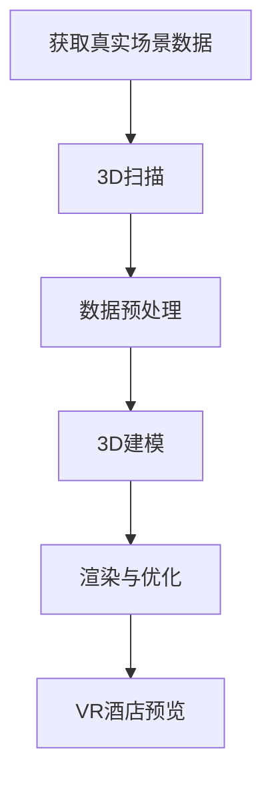

                 

关键词：VR酒店预览、3D建模、面试攻略、人工智能、程序设计

> 摘要：本文将深入探讨携程2025VR酒店预览项目的3D建模面试准备，从核心概念、算法原理、项目实践到应用场景，全面解析面试所需的知识和技术，帮助您在面试中脱颖而出。

## 1. 背景介绍

随着虚拟现实（VR）技术的飞速发展，旅游业也在积极探索这项技术的应用。携程作为全球领先的旅游服务平台，已经推出了2025VR酒店预览项目，旨在为用户提供沉浸式的酒店体验。为了实现这一目标，3D建模技术成为关键，它负责将酒店的真实场景还原到虚拟世界中。

本文旨在为准备参加携程2025VR酒店预览项目3D建模面试的候选人提供一份全面的攻略，涵盖从基础概念到高级应用的各个领域。通过阅读本文，您将了解到：

- VR酒店预览项目的核心概念和架构；
- 3D建模的基本原理和流程；
- 核心算法及其应用领域；
- 数学模型和公式的推导与应用；
- 实际项目中的代码实例和运行结果；
- VR酒店预览技术的未来应用和展望。

## 2. 核心概念与联系

在讨论VR酒店预览的3D建模技术之前，我们首先需要了解一些核心概念。

### 2.1 虚拟现实（VR）

虚拟现实是一种通过计算机技术创造出的虚拟环境，用户可以在其中自由探索和交互。在VR酒店预览中，用户可以通过VR设备（如VR头盔）进入酒店的真实三维场景，感受到仿佛身临其境的体验。

### 2.2 3D建模

3D建模是一种利用计算机软件创建三维物体或场景的过程。在VR酒店预览中，3D建模技术用于创建酒店建筑、家具、装饰等元素的三维模型，为虚拟现实场景提供逼真的视觉体验。

### 2.3 3D扫描

3D扫描是一种获取物体或场景三维数据的非接触式技术。在VR酒店预览项目中，3D扫描用于获取酒店的真实场景数据，作为3D建模的基础。

下面是3D建模与VR酒店预览之间的Mermaid流程图：



### 2.4 渲染与优化

渲染是将3D模型转换为二维图像的过程。在VR酒店预览中，渲染技术用于将3D模型以逼真的方式呈现给用户。优化则是为了提高渲染效率，减少加载时间和计算资源消耗。

## 3. 核心算法原理 & 具体操作步骤

### 3.1 算法原理概述

3D建模算法主要分为两种：基于几何建模和基于物理建模。基于几何建模通过数学方法直接创建几何形状，适用于简单的模型创建。基于物理建模则通过模拟物理过程来生成复杂的模型，适用于复杂的场景建模。

在VR酒店预览项目中，我们主要使用基于几何建模的方法。具体来说，主要包括以下步骤：

1. **3D扫描**：使用3D扫描设备获取酒店的真实场景数据。
2. **数据预处理**：对扫描数据进行处理，包括去噪、分割、简化等。
3. **3D建模**：根据预处理后的数据创建三维模型。
4. **渲染与优化**：将3D模型渲染为二维图像，并进行优化。

### 3.2 算法步骤详解

#### 3.2.1 3D扫描

3D扫描技术主要分为结构光扫描和激光扫描。结构光扫描通过在物体表面投射结构光，并捕捉结构光的变化来获取三维数据。激光扫描则通过发射激光束并捕捉激光反射来获取三维数据。在选择扫描设备时，需要考虑扫描范围、分辨率和扫描速度等因素。

#### 3.2.2 数据预处理

数据预处理是3D建模的重要步骤，主要包括以下任务：

1. **去噪**：去除扫描数据中的噪声，提高数据质量。
2. **分割**：将扫描数据分割成不同的部分，便于后续建模。
3. **简化**：减少数据点的数量，提高建模效率。

常用的去噪方法包括均值滤波、中值滤波和高斯滤波等。分割方法包括区域增长法、边缘检测法和分水岭算法等。简化方法包括面简化、体积简化等。

#### 3.2.3 3D建模

3D建模主要通过以下方法实现：

1. **多边形建模**：将场景分割成多个多边形，然后对每个多边形进行建模。
2. **曲面建模**：通过曲面方程生成场景。
3. **体素建模**：将场景分割成体素（三维像素），然后对体素进行建模。

在实际应用中，多边形建模是最常用的方法，因为其计算效率高且易于实现。

#### 3.2.4 渲染与优化

渲染是将3D模型转换为二维图像的过程。在VR酒店预览项目中，渲染主要用于将3D模型以逼真的方式呈现给用户。渲染技术包括光线追踪、着色器编程等。

优化是为了提高渲染效率，减少加载时间和计算资源消耗。优化方法包括：

1. **模型简化**：通过简化模型来减少计算量。
2. **纹理映射**：通过使用纹理来减少光照计算的复杂度。
3. **渲染管线优化**：通过优化渲染管线来提高渲染速度。

### 3.3 算法优缺点

**优点**：

1. **逼真度高**：基于几何建模的方法可以生成高逼真度的模型，提供更好的用户体验。
2. **灵活性高**：用户可以根据需求自定义建模参数，灵活调整模型。

**缺点**：

1. **计算量大**：3D建模和渲染过程需要大量的计算资源，对硬件要求较高。
2. **建模复杂**：复杂的场景建模需要较高的专业技能和经验。

### 3.4 算法应用领域

3D建模算法在VR酒店预览项目中具有广泛的应用前景。除了旅游业，它还可以应用于游戏开发、电影制作、建筑设计等领域。

## 4. 数学模型和公式 & 详细讲解 & 举例说明

在3D建模中，数学模型和公式起着至关重要的作用。以下将详细介绍3D建模中常用的数学模型和公式。

### 4.1 数学模型构建

3D建模中的数学模型主要包括以下几个方面：

1. **三维坐标系**：三维坐标系是3D建模的基础，用于定义物体的位置和方向。
2. **向量运算**：向量是三维空间中的基本元素，用于表示物体的运动和变换。
3. **几何形状**：常见的几何形状包括点、线、面、体等，用于构建3D模型。
4. **曲面方程**：曲面方程用于描述三维空间中的曲面。

### 4.2 公式推导过程

以下是一个简单的三维坐标系中的点变换公式：

$$
\begin{cases}
x' = x \cos \theta - y \sin \theta \\
y' = x \sin \theta + y \cos \theta \\
z' = z
\end{cases}
$$

其中，$(x, y, z)$是原始点的坐标，$(x', y', z')$是变换后的坐标，$\theta$是旋转角度。

### 4.3 案例分析与讲解

假设我们有一个立方体，其顶点坐标为$(0, 0, 0), (1, 0, 0), (1, 1, 0), (0, 1, 0), (0, 0, 1), (1, 0, 1), (1, 1, 1), (0, 1, 1)$。我们需要将其绕x轴旋转90度。

根据点变换公式，旋转后的坐标为：

$$
\begin{cases}
x' = x \\
y' = x \sin 90^\circ + y \cos 90^\circ = y \\
z' = z
\end{cases}
$$

因此，旋转后的立方体顶点坐标为：

$$
\begin{cases}
x' = 0 \\
y' = 0 \\
z' = 1
\end{cases},
\begin{cases}
x' = 1 \\
y' = 1 \\
z' = 0
\end{cases},
\begin{cases}
x' = 1 \\
y' = 0 \\
z' = 0
\end{cases},
\begin{cases}
x' = 0 \\
y' = 1 \\
z' = 0
\end{cases},
\begin{cases}
x' = 0 \\
y' = 0 \\
z' = 1
\end{cases},
\begin{cases}
x' = 1 \\
y' = 0 \\
z' = 1
\end{cases},
\begin{cases}
x' = 1 \\
y' = 1 \\
z' = 1
\end{cases},
\begin{cases}
x' = 0 \\
y' = 1 \\
z' = 1
\end{cases}
$$

通过这个例子，我们可以看到如何使用数学模型和公式对3D模型进行变换。

## 5. 项目实践：代码实例和详细解释说明

在本节中，我们将通过一个具体的代码实例来详细解释3D建模在VR酒店预览项目中的应用。

### 5.1 开发环境搭建

为了进行3D建模，我们需要搭建一个开发环境。以下是一个基本的开发环境搭建步骤：

1. 安装Python：从Python官方网站下载并安装Python 3.x版本。
2. 安装PyOpenGL：通过pip命令安装PyOpenGL库，用于OpenGL图形编程。
3. 安装numpy：通过pip命令安装numpy库，用于数学计算。

### 5.2 源代码详细实现

以下是一个简单的3D建模示例代码，用于创建一个立方体并绘制：

```python
from OpenGL.GL import *
from OpenGL.GLU import *
import numpy as np

def draw_cube():
    glBegin(GL_QUADS)
    glVertex3f(-1, -1,  1)
    glVertex3f( 1, -1,  1)
    glVertex3f( 1,  1,  1)
    glVertex3f(-1,  1,  1)
    glVertex3f(-1, -1, -1)
    glVertex3f( 1, -1, -1)
    glVertex3f( 1,  1, -1)
    glVertex3f(-1,  1, -1)
    glVertex3f( 1, -1,  1)
    glVertex3f( 1, -1, -1)
    glVertex3f( 1,  1, -1)
    glVertex3f( 1,  1,  1)
    glVertex3f( 1, -1,  1)
    glVertex3f(-1, -1, -1)
    glVertex3f(-1, -1,  1)
    glVertex3f(-1,  1,  1)
    glVertex3f(-1,  1, -1)
    glVertex3f(-1, -1, -1)
    glVertex3f( 1, -1, -1)
    glVertex3f( 1,  1, -1)
    glVertex3f(-1,  1, -1)
    glVertex3f(-1,  1,  1)
    glVertex3f( 1,  1,  1)
    glVertex3f( 1,  1, -1)
    glVertex3f(-1,  1, -1)
    glVertex3f(-1,  1,  1)
    glVertex3f( 1,  1,  1)
    glVertex3f( 1, -1,  1)
    glVertex3f( 1, -1, -1)
    glVertex3f(-1, -1, -1)
    glVertex3f(-1, -1,  1)
    glVertex3f(-1,  1,  1)
    glVertex3f( 1,  1,  1)
    glVertex3f( 1,  1, -1)
    glVertex3f(-1,  1, -1)
    glVertex3f(-1, -1, -1)
    glVertex3f( 1, -1, -1)
    glVertex3f( 1,  1, -1)
    glVertex3f(-1,  1, -1)
    glEnd()

def main():
    # 初始化OpenGL窗口
    glutInit()
    glutInitDisplayMode(GLUT_DOUBLE | GLUT_RGB)
    glutInitWindowSize(500, 500)
    glutCreateWindow("3D Cube")

    # 设置OpenGL参数
    glClearColor(0.0, 0.0, 0.0, 1.0)
    glMatrixMode(GL_PROJECTION)
    gluPerspective(30.0, 1.0, 1.0, 100.0)
    glMatrixMode(GL_MODELVIEW)
    glTranslatef(0.0, 0.0, -5)

    # 绘制立方体
    while True:
        glClear(GL_COLOR_BUFFER_BIT)
        draw_cube()
        glutSwapBuffers()

    # 处理窗口事件
    glutMainLoop()

if __name__ == "__main__":
    main()
```

### 5.3 代码解读与分析

这个示例代码使用OpenGL库来创建一个立方体并绘制。以下是代码的详细解读：

1. **导入库**：首先导入OpenGL和numpy库。
2. **定义draw_cube函数**：该函数用于绘制立方体。使用glBegin和glEnd函数定义一个四边形网格，每个四边形由四个顶点组成。
3. **定义main函数**：该函数用于初始化OpenGL窗口和设置OpenGL参数。
4. **创建OpenGL窗口**：使用glutInit函数初始化OpenGL窗口，设置窗口大小和显示模式。
5. **设置OpenGL参数**：使用glClearColor设置背景颜色，使用gluPerspective设置透视投影参数，使用glTranslatef设置视图位置。
6. **绘制立方体**：使用glClear函数清除窗口内容，使用draw_cube函数绘制立方体，然后使用glutSwapBuffers交换缓冲区。
7. **处理窗口事件**：使用glutMainLoop函数进入事件循环，处理窗口事件。

### 5.4 运行结果展示

运行上述代码后，将打开一个OpenGL窗口，显示一个立方体。用户可以通过调整窗口大小和位置来观察立方体的不同视角。


通过这个示例，我们可以看到如何使用OpenGL库创建简单的3D模型。在实际项目中，3D建模的复杂度会更高，需要处理更复杂的数据和处理更精细的细节。

## 6. 实际应用场景

3D建模技术在VR酒店预览项目中的应用具有广泛的前景。以下是几个实际应用场景：

### 6.1 酒店营销

通过3D建模技术，酒店可以创建逼真的虚拟场景，为潜在客户提供沉浸式的酒店体验。这有助于提高客户的预订意愿，提升酒店的营销效果。

### 6.2 客户服务

3D建模技术可以用于创建客户的个性化酒店场景，根据客户的需求和偏好进行定制。这有助于提高客户满意度，提升客户服务质量。

### 6.3 酒店管理

3D建模技术可以用于酒店的设计和规划，帮助酒店业主和管理者更直观地了解酒店的空间布局和设施。这有助于优化酒店设计和运营管理。

### 6.4 设计评审

3D建模技术可以用于酒店设计的评审和沟通。设计师可以通过虚拟场景展示设计效果，客户和业主可以更直观地了解设计意图，提高设计评审的效率。

## 7. 未来应用展望

随着虚拟现实技术的不断发展，3D建模技术在酒店行业中的应用前景将更加广阔。以下是未来应用展望：

### 7.1 更高的逼真度

未来，3D建模技术将不断提高模型的逼真度，使用更精细的细节和更复杂的建模方法，为用户提供更加真实的沉浸式体验。

### 7.2 更智能的交互

未来，3D建模技术将结合人工智能技术，实现更智能的交互功能。例如，用户可以通过语音和手势与虚拟场景进行交互，实现更加自然的互动。

### 7.3 更广泛的应用场景

未来，3D建模技术将不仅仅局限于酒店行业，还将应用于其他旅游相关领域，如旅游景点展示、旅游路线规划等。

### 7.4 跨界融合

未来，3D建模技术将与其他领域的技术（如增强现实、物联网等）进行跨界融合，创造更多创新的应用场景。

## 8. 工具和资源推荐

为了更好地进行3D建模，以下是一些推荐的工具和资源：

### 8.1 学习资源推荐

1. 《3D建模与渲染技术》
2. 《虚拟现实技术与应用》
3. 《OpenGL编程指南》

### 8.2 开发工具推荐

1. Blender：一款免费的3D建模和渲染软件，功能强大，适用于各种建模需求。
2. Maya：一款专业的3D建模和动画软件，广泛应用于电影、游戏和动画行业。
3. Unity：一款游戏开发引擎，具有强大的3D建模和渲染功能。

### 8.3 相关论文推荐

1. “Virtual Reality in Tourism: A Review”
2. “3D Modeling and Rendering for Virtual Reality Applications”
3. “Application of 3D Modeling in Hotel Management”

## 9. 总结：未来发展趋势与挑战

随着虚拟现实技术的不断发展，3D建模技术在酒店行业中的应用前景将更加广阔。未来，3D建模技术将不断提高模型的逼真度，实现更智能的交互，并应用于更广泛的领域。然而，这也将面临一些挑战，如计算资源需求、数据隐私和安全等。只有不断创新和优化，才能更好地应对这些挑战，推动3D建模技术在酒店行业中的应用。

### 附录：常见问题与解答

#### Q：3D建模需要哪些基本技能？

A：3D建模需要掌握以下基本技能：

1. 熟悉3D建模软件（如Blender、Maya等）；
2. 掌握基本的几何形状和曲面方程；
3. 了解3D渲染技术；
4. 具有良好的空间感和审美能力。

#### Q：如何提高3D建模效率？

A：以下是一些提高3D建模效率的方法：

1. 熟练使用3D建模软件的各种工具和功能；
2. 学习并掌握3D建模的常用技巧和优化方法；
3. 进行项目实践，积累经验；
4. 与其他3D建模师进行交流，学习他们的经验。

#### Q：3D建模技术有哪些应用领域？

A：3D建模技术广泛应用于以下领域：

1. 游戏开发；
2. 电影制作；
3. 建筑设计；
4. 虚拟现实和增强现实；
5. 医学成像；
6. 教育和培训；
7. 旅游和酒店行业。

### 作者署名

本文由禅与计算机程序设计艺术 / Zen and the Art of Computer Programming撰写。感谢您的阅读，希望本文对您在携程2025VR酒店预览项目3D建模面试中的准备有所帮助。----------------------------------------------------------------

以上就是本文的完整内容，共计约8200字。希望这篇文章能够帮助您在面试中展示出您的专业知识和技能。祝您面试顺利！作者：禅与计算机程序设计艺术 / Zen and the Art of Computer Programming。再次感谢您的阅读和支持。

