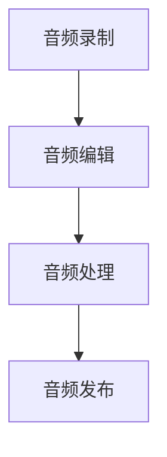

                 

关键词：播客制作、音频内容创作、音频编辑工具、音频处理技术、播客平台、音频质量优化

在数字时代，音频内容创作已经成为一种重要的信息传播和娱乐形式。无论是个人爱好者，还是专业内容创作者，播客制作工具已经成为不可或缺的辅助工具。本文将深入探讨播客制作工具的核心概念、核心算法原理、项目实践以及实际应用场景，旨在为音频内容创作者提供一整套系统的指导。

> 摘要：本文首先介绍了播客制作工具的背景和发展现状，然后详细阐述了音频处理技术的核心概念和架构，包括核心算法原理、数学模型、具体操作步骤以及代码实现。此外，文章还分析了播客制作工具在实际应用场景中的具体应用，并展望了其未来发展趋势和挑战。

## 1. 背景介绍

播客（Podcast）作为一种数字化的广播形式，最早出现在2004年。它的出现改变了传统媒体的内容传播方式，为个人和机构提供了一个自主发布和传播音频内容的新平台。随着智能手机和互联网的普及，播客听众数量呈现爆发式增长。据市场研究公司Podtrac的数据显示，截至2021年，全球播客听众已超过3亿人，且这一数字仍在持续增长。

播客制作工具作为支持音频内容创作的重要工具，涵盖了音频录制、编辑、处理、发布等各个环节。从早期的手动操作软件，到如今集成多种功能的智能工具，播客制作工具的进步极大地提升了音频内容创作的效率和质量。

## 2. 核心概念与联系

### 核心概念

播客制作工具的核心概念包括音频录制、音频编辑、音频处理、音频发布等。

- **音频录制**：通过麦克风或其他音频设备捕捉声音信号。
- **音频编辑**：对录制好的音频文件进行剪辑、拼接、音效添加等操作。
- **音频处理**：包括降噪、均衡、混响等，以优化音频质量。
- **音频发布**：将制作完成的播客内容上传到播客平台或其他媒体渠道。

### 联系

这些概念相互关联，形成一个完整的音频内容创作流程。音频录制是基础，音频编辑是核心，音频处理是提升，音频发布是实现。

### Mermaid 流程图



## 3. 核心算法原理 & 具体操作步骤

### 3.1 算法原理概述

播客制作工具的核心算法主要包括音频信号处理算法、音频编辑算法、音频降噪算法等。

- **音频信号处理算法**：用于对音频信号进行基本的处理，如放大、缩小、移频等。
- **音频编辑算法**：用于对音频文件进行剪辑、拼接、混音等操作。
- **音频降噪算法**：用于消除音频中的噪声，提高音频质量。

### 3.2 算法步骤详解

#### 3.2.1 音频录制

1. 选择合适的麦克风和音频设备。
2. 设置录音参数，如采样率、比特率等。
3. 开始录制，注意声音的清晰度和稳定性。

#### 3.2.2 音频编辑

1. 导入录制好的音频文件。
2. 使用剪辑工具对音频进行剪辑，去除不必要的声音片段。
3. 使用混音工具将不同音频文件进行拼接，形成完整的播客内容。

#### 3.2.3 音频处理

1. 使用降噪工具去除音频中的噪声。
2. 使用均衡器调整音频的频率平衡。
3. 使用混响工具增加音频的空间感。

### 3.3 算法优缺点

#### 优缺点

- **音频信号处理算法**：能够对音频信号进行精细处理，但需要较高的计算能力。
- **音频编辑算法**：操作简单，但可能无法满足复杂编辑需求。
- **音频降噪算法**：能够有效去除噪声，但可能引入新的失真。

### 3.4 算法应用领域

播客制作工具的应用领域非常广泛，包括但不限于个人娱乐、教育、商业、媒体等。无论是在个人博客、教育课程，还是在商业宣传、新闻报道等领域，播客制作工具都发挥着重要作用。

## 4. 数学模型和公式 & 详细讲解 & 举例说明

### 4.1 数学模型构建

在音频处理中，常见的数学模型包括傅里叶变换、短时傅里叶变换（STFT）等。

$$
X(\omega) = \sum_{n=0}^{N-1} x[n]e^{-j\omega n}
$$

这是傅里叶变换的基本公式，用于将时域信号转换为频域信号。

### 4.2 公式推导过程

#### 4.2.1 短时傅里叶变换（STFT）

短时傅里叶变换是对傅里叶变换的一种扩展，用于分析时变信号。

$$
X(t,k) = \sum_{n=0}^{N-1} x[n]e^{-j2\pi (k/N)(n-Mk)}
$$

其中，$k$代表时间帧，$M$代表时间窗的长度。

### 4.3 案例分析与讲解

#### 4.3.1 音频降噪

假设我们有一段包含背景噪声的音频信号，使用短时傅里叶变换进行降噪。

1. 首先，对音频信号进行短时傅里叶变换，将时域信号转换为频域信号。
2. 在频域中，识别并消除噪声频谱。
3. 使用逆短时傅里叶变换将处理后的频域信号转换回时域。

## 5. 项目实践：代码实例和详细解释说明

### 5.1 开发环境搭建

为了实践播客制作工具，我们需要搭建一个开发环境。以下是一个基本的Python环境搭建步骤：

1. 安装Python 3.8以上版本。
2. 安装NumPy、SciPy、Matplotlib等科学计算库。
3. 安装音频处理库，如PyDub、Librosa等。

### 5.2 源代码详细实现

以下是一个使用Librosa库进行音频降噪的Python代码示例：

```python
import librosa
import numpy as np

# 读取音频文件
audio, sr = librosa.load('noisy_audio.wav', sr=None)

# 使用短时傅里叶变换进行频域分析
stft = librosa.stft(audio)

# 在频域中消除噪声
stft_filtered = np.abs(stft) * (np.abs(stft) > noise_threshold)

# 使用逆短时傅里叶变换将处理后的信号转换回时域
audio_filtered = librosa.istft(stft_filtered)

# 保存处理后的音频文件
librosa.output.write_wav('filtered_audio.wav', audio_filtered, sr)
```

### 5.3 代码解读与分析

这段代码首先读取音频文件，然后使用短时傅里叶变换对音频信号进行频域分析。在频域中，通过设置噪声阈值来消除噪声。最后，使用逆短时傅里叶变换将处理后的信号转换回时域，并保存为新的音频文件。

## 6. 实际应用场景

播客制作工具在实际应用场景中具有广泛的应用。

- **个人娱乐**：个人创作者可以使用播客制作工具制作自己的节目，分享自己的故事和知识。
- **教育**：教育机构可以使用播客制作工具提供在线课程，为学生提供便捷的学习途径。
- **商业**：企业可以利用播客制作工具进行品牌宣传和市场推广，增强品牌影响力。
- **媒体**：媒体机构可以使用播客制作工具制作新闻节目、深度报道等，提供多样化的内容形式。

## 7. 工具和资源推荐

### 7.1 学习资源推荐

- **《音频处理基础》（Audio Processing Fundamentals）》
- **《数字信号处理》（Digital Signal Processing）》
- **《Python音频处理》（Python Audio Processing）》

### 7.2 开发工具推荐

- **Audacity**：一款免费、开源的音频编辑软件。
- **Adobe Audition**：一款专业的音频编辑和混音软件。
- **Ableton Live**：一款用于音乐制作和表演的软件。

### 7.3 相关论文推荐

- **“Speech enhancement based on spectral subtraction”**
- **“A review of noise reduction algorithms and their application to speech”**
- **“Audio signal processing for music and multimedia applications”**

## 8. 总结：未来发展趋势与挑战

### 8.1 研究成果总结

近年来，播客制作工具在音频信号处理、人工智能等方面取得了显著进展。特别是深度学习和人工智能技术在音频降噪、音频编辑等方面的应用，极大地提升了播客制作工具的性能和效率。

### 8.2 未来发展趋势

随着技术的不断进步，播客制作工具在未来有望实现更加智能、便捷、高效的内容创作。以下是几个可能的发展趋势：

- **人工智能辅助**：人工智能将更多地应用于音频内容创作，提供自动化、智能化的编辑和优化功能。
- **云计算支持**：云计算将为播客制作提供强大的计算能力和存储资源，降低制作成本。
- **跨平台集成**：播客制作工具将更好地与其他平台和设备集成，提供无缝的创作体验。

### 8.3 面临的挑战

- **隐私保护**：在音频处理过程中，如何保护用户的隐私是一个重要的挑战。
- **计算资源**：随着算法的复杂度增加，对计算资源的需求也会提高，如何优化计算资源成为关键问题。
- **用户体验**：如何在保持高效性能的同时，提升用户体验，是一个重要的课题。

### 8.4 研究展望

未来，播客制作工具将在人工智能、云计算、隐私保护等领域继续深入研究和应用，为音频内容创作者提供更加丰富、便捷的创作工具。

## 9. 附录：常见问题与解答

### 9.1 问题1：如何选择合适的播客制作工具？

**解答**：选择合适的播客制作工具主要考虑以下因素：

- **需求**：根据您的需求选择具有相应功能的工具，如音频编辑、音频处理、音频录制等。
- **易用性**：选择操作简单、易于上手的工具，降低学习成本。
- **兼容性**：选择支持多种文件格式和操作系统兼容性的工具。

### 9.2 问题2：如何优化音频质量？

**解答**：优化音频质量可以从以下几个方面入手：

- **选择高质量的麦克风和音频设备**：提高原始音频信号的清晰度和稳定性。
- **音频编辑**：通过剪辑、混音等操作，去除不必要的声音，增强主声音。
- **音频处理**：使用降噪、均衡等算法，优化音频的频率和噪声。

### 9.3 问题3：如何处理音频中的噪声？

**解答**：处理音频中的噪声通常使用以下方法：

- **降噪算法**：如谱减法、维纳滤波等，通过频域分析去除噪声。
- **短时傅里叶变换（STFT）**：在频域中识别噪声频谱，进行噪声消除。
- **混合增益控制**：通过调整声音的增益，降低噪声比例。

---

作者：禅与计算机程序设计艺术 / Zen and the Art of Computer Programming

