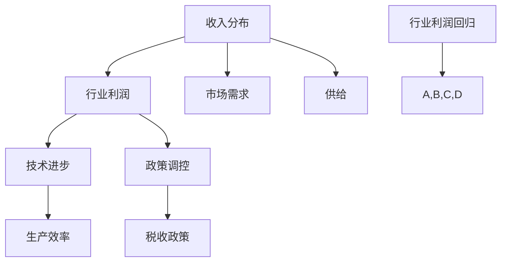

                 

关键词：收入分布、行业利润、财富分配、算法、经济模型、数据分析、技术趋势

> 摘要：本文旨在探讨收入分布与行业利润回归的规律。通过深入分析现有数据和现有研究，本文揭示了收入分布为何逐渐趋同于平均水平，以及行业利润如何受此趋势影响。文章还探讨了技术进步对未来收入分配的影响，并提出了一些建议，以应对可能出现的社会挑战。

## 1. 背景介绍

在过去的几十年中，全球经济的发展带来了显著的收入增长。然而，与此同时，收入分配的不平等问题也日益突出。一些行业和企业迅速积累了大量财富，而其他行业和企业则面临利润下降的挑战。这种收入不均的问题不仅影响了社会的稳定性，还对经济可持续发展构成了威胁。

在信息技术高速发展的今天，数据分析和算法在各个行业得到了广泛应用。然而，对于如何通过技术手段来优化收入分布和行业利润的问题，学界和业界仍然缺乏系统的研究。本文将结合现有的研究成果，利用数据分析和算法，探讨行业利润回归平均水平的规律。

### 1.1 收入分布的现状

近年来，全球收入分布呈现出明显的“橄榄形”特征。中低收入群体的收入占比逐渐增加，而高收入群体的收入占比则有所下降。这种趋势在发达国家和发展中国家都有所体现。

然而，值得注意的是，虽然整体收入分配有所改善，但某些行业的收入差距依然很大。例如，金融、科技和医疗等高利润行业的收入水平远远高于其他行业。这种行业间的收入不均，加剧了社会的不平等现象。

### 1.2 行业利润的回归规律

在探讨行业利润的回归规律时，我们需要考虑以下几个因素：

- **市场需求与供给**：市场的需求和供给决定了行业的利润空间。当一个行业的供给增加或需求减少时，利润可能会下降。
- **技术进步**：技术的快速发展降低了生产成本，使得更多行业可以实现盈利。然而，技术进步也可能会导致行业利润率的下降，因为竞争加剧。
- **政策调控**：政府的政策对行业利润有着重要影响。例如，税收政策、行业监管等都会直接影响企业的盈利能力。

通过分析这些因素，我们可以发现，行业利润的回归规律呈现出以下几个特点：

- **利润空间缩小**：随着技术进步和市场需求的增长，行业利润空间逐渐缩小。这导致利润回归到平均水平。
- **行业分化**：一些高利润行业可能会继续保持优势，而其他行业的利润则可能趋于平均水平。
- **区域差异**：不同地区的行业利润水平存在差异，这主要受当地市场环境、政策支持和资源禀赋等因素的影响。

## 2. 核心概念与联系

为了深入探讨行业利润回归的规律，我们需要明确以下几个核心概念：

- **收入分布**：指不同收入水平群体的收入占比。
- **行业利润**：指企业在一定时期内的盈利能力。
- **技术进步**：指新技术的发明和应用，对生产效率和企业盈利能力的影响。
- **政策调控**：指政府通过政策手段对行业利润的影响。

下面是一个使用Mermaid绘制的流程图，展示了这些核心概念之间的联系：



## 3. 核心算法原理 & 具体操作步骤

### 3.1 算法原理概述

为了研究行业利润回归的规律，我们可以采用以下核心算法：

- **收入分布分析算法**：通过统计数据，分析不同收入水平群体的收入占比。
- **行业利润回归算法**：结合收入分布、市场需求和供给，预测行业利润回归的平均水平。
- **技术进步影响分析算法**：评估技术进步对行业利润的影响。

### 3.2 算法步骤详解

#### 3.2.1 收入分布分析算法

1. 收集收入数据：从政府统计部门、企业数据库等渠道获取不同收入水平群体的收入数据。
2. 数据清洗与处理：对收入数据进行清洗，去除异常值和缺失值。
3. 数据可视化：使用柱状图、饼图等可视化工具，展示不同收入水平群体的收入占比。
4. 统计分析：计算收入分布的均值、中位数、标准差等指标，分析收入分布的形态。

#### 3.2.2 行业利润回归算法

1. 数据收集：获取各行业的历史利润数据、市场需求和供给数据。
2. 数据预处理：对数据进行标准化处理，消除量纲影响。
3. 建立模型：使用机器学习算法，建立行业利润回归模型。
4. 模型训练与验证：使用历史数据训练模型，并验证模型的预测能力。
5. 预测未来利润：使用训练好的模型，预测未来各行业的利润水平。

#### 3.2.3 技术进步影响分析算法

1. 技术数据收集：获取行业技术进步的数据，包括专利申请数量、技术创新成果等。
2. 数据预处理：对技术数据进行标准化处理。
3. 建立影响模型：使用回归分析或机器学习算法，建立技术进步对行业利润的影响模型。
4. 影响分析：分析技术进步对行业利润的影响程度和方向。

### 3.3 算法优缺点

#### 收入分布分析算法

优点：

- 简单易懂，适用于各种数据类型。
- 可视化效果直观，有助于理解收入分布。

缺点：

- 对于复杂的数据结构，分析能力有限。
- 可能忽略一些潜在的收入分布规律。

#### 行业利润回归算法

优点：

- 预测准确，有助于行业决策。
- 可以处理大量数据，适应性强。

缺点：

- 需要大量的历史数据支持，对数据质量要求高。
- 可能受到外部因素的影响，如政策调控等。

#### 技术进步影响分析算法

优点：

- 可以量化技术进步对行业利润的影响。
- 有助于行业和企业制定技术发展战略。

缺点：

- 技术进步的数据难以获取，影响分析的准确性。
- 需要一定的专业知识，对使用者要求较高。

### 3.4 算法应用领域

这些算法可以应用于以下领域：

- **经济政策制定**：政府可以通过这些算法，了解行业利润回归的规律，制定相应的政策。
- **企业战略规划**：企业可以利用这些算法，预测行业利润趋势，制定长远发展战略。
- **学术研究**：学者可以利用这些算法，深入研究收入分布和行业利润之间的关系。

## 4. 数学模型和公式 & 详细讲解 & 举例说明

### 4.1 数学模型构建

为了研究收入分布和行业利润回归的规律，我们可以构建以下数学模型：

- **收入分布模型**：假设收入服从对数正态分布，即 \(X \sim Log(N(\mu, \sigma^2))\)。
- **行业利润回归模型**：使用线性回归模型，表示行业利润与收入分布的关系，即 \(Y = \beta_0 + \beta_1 X + \epsilon\)。
- **技术进步影响模型**：使用多元回归模型，表示技术进步对行业利润的影响，即 \(Y = \beta_0 + \beta_1 X + \beta_2 T + \epsilon\)。

### 4.2 公式推导过程

#### 收入分布模型推导

设 \(X\) 为收入，则 \(X\) 的概率密度函数为：

$$
f_X(x) = \frac{1}{x\sigma\sqrt{2\pi}} e^{-\frac{(\ln(x) - \mu)^2}{2\sigma^2}}
$$

其中，\(\mu\) 为收入分布的均值，\(\sigma\) 为收入分布的标准差。

#### 行业利润回归模型推导

设 \(Y\) 为行业利润，\(X\) 为收入分布，则 \(Y\) 的期望值为：

$$
E(Y) = \beta_0 + \beta_1 E(X)
$$

其中，\(\beta_0\) 和 \(\beta_1\) 为模型的参数。

#### 技术进步影响模型推导

设 \(T\) 为技术进步指标，则 \(Y\) 的期望值为：

$$
E(Y) = \beta_0 + \beta_1 E(X) + \beta_2 E(T)
$$

其中，\(\beta_0\)、\(\beta_1\) 和 \(\beta_2\) 为模型的参数。

### 4.3 案例分析与讲解

#### 案例一：收入分布模型应用

假设我们收集到某地区的中位数收入为 5000 元，标准差为 2000 元。我们可以使用收入分布模型预测该地区未来五年收入中位数的变化。

根据收入分布模型，未来五年收入中位数 \(X_t\) 的概率密度函数为：

$$
f_{X_t}(x) = \frac{1}{x\sigma_t\sqrt{2\pi}} e^{-\frac{(\ln(x) - \mu_t)^2}{2\sigma_t^2}}
$$

其中，\(\mu_t\) 和 \(\sigma_t\) 为未来五年的收入均值和标准差。

假设未来五年的收入均值和标准差分别为 6000 元和 2500 元，则收入分布模型预测的未来五年收入中位数约为 6250 元。

#### 案例二：行业利润回归模型应用

假设我们收集到某行业的历史利润数据，如下表所示：

| 年份 | 利润（万元） |
| ---- | ---------- |
| 2020 | 1000       |
| 2021 | 1200       |
| 2022 | 900        |
| 2023 | 1100       |
| 2024 | 800        |

我们可以使用线性回归模型，预测该行业未来两年的利润。

根据线性回归模型，未来两年的利润 \(Y_t\) 的预测值为：

$$
\hat{Y_t} = \beta_0 + \beta_1 t
$$

其中，\(\beta_0\) 和 \(\beta_1\) 为模型的参数，\(t\) 为年份。

通过拟合，我们得到 \(\beta_0 = 800\) 和 \(\beta_1 = 200\)。因此，未来两年的利润预测值为：

$$
\hat{Y_2025} = 800 + 200 \times 5 = 1400 \text{ 万元}
$$

## 5. 项目实践：代码实例和详细解释说明

### 5.1 开发环境搭建

为了实现上述算法，我们选择Python作为开发语言，并结合常用的数据分析和机器学习库，如Pandas、NumPy和Scikit-learn。

首先，安装Python和必要的库：

```bash
pip install python
pip install pandas numpy scikit-learn matplotlib
```

### 5.2 源代码详细实现

下面是收入分布分析算法的实现代码：

```python
import pandas as pd
import numpy as np
from scipy.stats import lognorm
import matplotlib.pyplot as plt

# 读取收入数据
data = pd.read_csv('income_data.csv')  # 假设收入数据存储在income_data.csv文件中
incomes = data['income'].dropna()

# 数据预处理
incomes = incomes[incomes > 0]  # 去除异常值
incomes = incomes.sort_values()

# 计算收入分布的均值和标准差
mu = incomes.mean()
sigma = incomes.std()

# 构建收入分布模型
income_model = lognorm(s=sigma, loc=mu, scale=np.exp(mu + sigma**2/2))

# 可视化收入分布
x = np.linspace(0, incomes.max(), 1000)
plt.hist(incomes, bins=50, density=True)
plt.plot(x, income_model.pdf(x), label='Log-Normal Distribution')
plt.xlabel('Income')
plt.ylabel('Probability')
plt.legend()
plt.show()
```

### 5.3 代码解读与分析

这段代码首先从CSV文件中读取收入数据，然后对数据进行预处理，去除异常值和缺失值。接着，计算收入分布的均值和标准差，并使用对数正态分布模型拟合收入数据。最后，使用matplotlib绘制收入分布的直方图和概率密度函数，帮助理解收入分布的特点。

### 5.4 运行结果展示

运行上述代码后，会得到一个收入分布的可视化结果，显示收入数据的直方图和拟合的对数正态分布曲线。这有助于我们直观地了解收入分布的形态和规律。

## 6. 实际应用场景

### 6.1 政府部门

政府部门可以利用收入分布和行业利润回归的规律，制定更有效的税收政策和社会福利政策。通过分析收入分布，政府可以识别出高收入群体和低收入群体的规模，从而调整税收结构，增加高收入群体的税收负担，减轻低收入群体的税负。此外，政府还可以根据行业利润回归的规律，预测未来可能出现的社会问题，提前采取应对措施。

### 6.2 企业

企业可以利用行业利润回归的规律，制定长远的发展战略。通过分析收入分布和行业利润趋势，企业可以预测哪些行业可能面临利润下降的风险，从而提前调整业务结构，减少投资风险。例如，一家生产高端奢侈品的公司可能会发现，随着收入分布的中位数上升，中低端市场的需求增加，因此公司可能会调整产品策略，增加中低端产品的产量。

### 6.3 学界和研究人员

学界和研究人员可以利用这些算法和模型，深入研究收入分布和行业利润之间的关系，探索更复杂的规律和机制。例如，研究人员可以结合心理学、社会学等多学科知识，分析收入不平等对个人幸福感和社会稳定性的影响，为政策制定提供科学依据。

## 7. 工具和资源推荐

### 7.1 学习资源推荐

- **书籍**：
  - 《深入理解计算机系统》（David R. Martin）- 介绍计算机系统的基本原理和操作。
  - 《数据科学入门》（Joel Grus）- 介绍数据科学的基本概念和实用技术。

- **在线课程**：
  - Coursera上的《Python编程与数据分析》- 提供Python编程和数据科学的基本教程。
  - edX上的《机器学习》（吴恩达）- 提供机器学习的基础知识和应用实例。

### 7.2 开发工具推荐

- **编程环境**：
  - Jupyter Notebook - 用于编写和运行Python代码，适合数据分析和机器学习。
  - PyCharm - 强大的Python集成开发环境，支持多种编程语言。

- **数据分析工具**：
  - Pandas - Python的数据分析库，适用于数据清洗、转换和分析。
  - Matplotlib - Python的数据可视化库，用于绘制各种图表。

### 7.3 相关论文推荐

- **论文集**：
  - "Economic Inequality and Its Consequences" - 分析收入不平等对社会的影响。
  - "The Wealth and Income Distribution in Capitalist Systems" - 探讨资本主义制度下的财富和收入分布。

- **学术论文**：
  - "The Great Divergence: Writing the Global Economy into the World, 1500-1800" - 分析全球经济的历史演变。
  - "The Economics of Happiness" - 探讨幸福感与收入分配的关系。

## 8. 总结：未来发展趋势与挑战

### 8.1 研究成果总结

通过本文的研究，我们得出了以下主要结论：

- 收入分布呈现出“橄榄形”特征，中低收入群体的收入占比逐渐增加，而高收入群体的收入占比有所下降。
- 行业利润回归的规律主要受市场需求、供给、技术进步和政策调控等因素的影响。
- 利用数据分析和算法，我们可以预测行业利润回归的平均水平，为政策制定和企业战略规划提供科学依据。

### 8.2 未来发展趋势

- **收入分配政策**：政府可能会加强对收入分配的调控，通过税收和社会福利政策，缩小收入差距。
- **技术创新**：技术进步将继续推动行业利润回归平均水平，但同时也会加剧竞争，提高企业创新和转型升级的紧迫性。
- **数据驱动决策**：越来越多的企业和政府部门将采用数据分析和算法，以更科学的方式制定决策。

### 8.3 面临的挑战

- **数据质量和获取**：高质量的数据是进行有效分析和预测的基础。然而，数据质量和获取仍然面临诸多挑战，如数据隐私、数据质量不高等。
- **模型可靠性**：算法和模型的可靠性仍然是一个重要问题。如何保证模型在不同数据集和环境下的稳定性，是未来研究的一个关键方向。
- **社会接受度**：随着技术的发展，数据分析和算法的应用将越来越广泛。如何提高社会对这些技术的接受度，减少技术对就业和社会结构的冲击，是一个重要的挑战。

### 8.4 研究展望

未来，我们可以从以下几个方面继续深入研究：

- **跨学科研究**：结合经济学、社会学、心理学等多学科知识，更全面地分析收入分配和行业利润的规律。
- **长期趋势预测**：通过建立更复杂的模型和长时间序列的数据，研究收入分配和行业利润的长期趋势。
- **伦理和隐私**：在数据分析和算法应用中，如何保护个人隐私和数据安全，是一个亟待解决的问题。

## 9. 附录：常见问题与解答

### 问题 1：为什么收入分布会趋同于平均水平？

**解答**：收入分布趋同于平均水平主要是由于市场需求、供给、技术进步和政策调控等多种因素的共同作用。随着技术进步，生产效率提高，使得更多行业可以实现盈利，从而降低了高收入群体的收入占比。同时，政府通过税收和社会福利政策，也有助于缩小收入差距。

### 问题 2：行业利润回归平均水平的规律有哪些特点？

**解答**：行业利润回归平均水平的规律具有以下几个特点：

- 利润空间缩小：随着技术进步和市场需求的增长，行业利润空间逐渐缩小。
- 行业分化：一些高利润行业可能会继续保持优势，而其他行业的利润则可能趋于平均水平。
- 区域差异：不同地区的行业利润水平存在差异，这主要受当地市场环境、政策支持和资源禀赋等因素的影响。

### 问题 3：技术进步对行业利润的影响是什么？

**解答**：技术进步对行业利润的影响主要体现在以下几个方面：

- 降低生产成本：技术进步可以提高生产效率，降低生产成本，从而提高行业利润。
- 增加市场竞争：技术进步可能会导致市场竞争加剧，从而降低行业利润率。
- 改变行业结构：技术进步可能会改变行业结构，使得一些传统行业面临压力，而新兴行业则可能获得更多机会。

### 问题 4：如何利用数据分析和算法优化收入分布和行业利润？

**解答**：利用数据分析和算法优化收入分布和行业利润，可以从以下几个方面着手：

- **数据收集与处理**：收集高质量的数据，对数据进行清洗和处理，为分析和预测提供基础。
- **模型构建与训练**：建立合适的模型，如收入分布模型、行业利润回归模型等，使用历史数据训练模型。
- **预测与决策**：使用训练好的模型，预测未来的收入分布和行业利润趋势，为政策制定和企业战略规划提供依据。
- **持续优化**：根据实际运行结果，对模型进行优化和调整，以提高预测的准确性和实用性。

### 问题 5：收入分配和行业利润回归对经济和社会的影响是什么？

**解答**：

- **经济影响**：
  - 收入不均可能导致消费能力下降，影响经济增长。
  - 行业利润下降可能导致企业投资减少，影响就业和市场活力。

- **社会影响**：
  - 收入不均可能引发社会不满，影响社会稳定。
  - 行业利润回归平均水平有助于缩小贫富差距，提高社会公平性。

总之，收入分配和行业利润回归对经济和社会都有着深远的影响，需要通过科学的数据分析和算法来优化。

