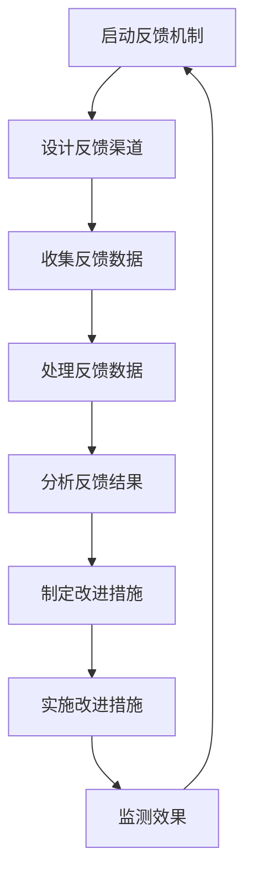
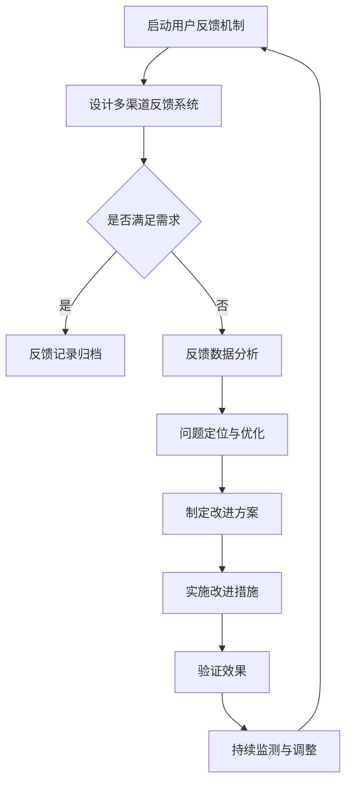

                 

关键词：用户反馈，数据分析，用户体验，反馈机制，产品改进

> 摘要：本文将探讨如何收集用户反馈的有效方法，并分析这些方法对产品改进和用户体验的提升作用。通过结合技术和心理学原理，本文提供了一套完整的用户反馈收集流程，旨在帮助企业更好地理解用户需求，优化产品设计，并实现持续的创新和发展。

## 1. 背景介绍

在当今快节奏、竞争激烈的市场环境中，产品和服务的高质量成为企业成功的关键。用户反馈作为产品改进的重要信息来源，对于理解用户需求、优化用户体验以及推动产品创新具有至关重要的意义。然而，如何有效地收集用户反馈，并从中提取有价值的洞察，仍然是一个挑战。

本文将讨论以下主题：
- **用户反馈的类型与重要性**：了解不同类型的用户反馈及其在产品改进中的作用。
- **用户反馈的收集方法**：介绍多种有效的用户反馈收集方法，包括问卷调查、用户访谈、在线反馈表等。
- **用户反馈的处理与分析**：探讨如何处理和解析用户反馈数据，提取关键信息。
- **用户反馈的实践案例**：分析一些成功的用户反馈收集和应用的案例。
- **未来展望**：探讨用户反馈收集领域的发展趋势和面临的挑战。

## 2. 核心概念与联系

### 2.1 用户反馈的概念

用户反馈是指用户在使用产品或服务过程中，对产品功能、用户体验、服务质量等方面的意见和建议。用户反馈的类型包括正面反馈、负面反馈、功能建议、使用问题报告等。这些反馈为产品开发团队提供了宝贵的用户洞察，有助于改进现有产品，开发新功能，提高用户满意度。

### 2.2 用户反馈在产品改进中的作用

用户反馈在产品改进中具有以下几个重要作用：
- **了解用户需求**：用户反馈揭示了用户对产品的期望和需求，有助于企业更好地理解用户需求。
- **优化产品设计**：通过分析用户反馈，产品设计团队可以识别问题并进行改进，提升用户体验。
- **提高用户满意度**：及时响应用户反馈，解决用户问题，可以提高用户满意度和忠诚度。
- **驱动创新**：用户反馈可以激发新的产品想法和功能，推动产品的持续创新。

### 2.3 用户反馈与用户体验的关系

用户体验（User Experience, UX）是指用户在使用产品或服务过程中的整体感受和体验。用户反馈直接影响用户体验：
- **反馈驱动优化**：用户反馈帮助识别用户体验中的问题和不足，驱动产品优化。
- **个性化和定制化**：用户反馈可以指导产品个性化，满足不同用户的需求和偏好。
- **增强用户参与感**：用户反馈机制可以让用户感到自己的声音被听到，增强用户的参与感和满意度。

### 2.4 用户反馈收集的流程图



### 2.5 用户反馈收集流程的Mermaid流程图



### 2.6 用户反馈收集的核心要素

为了确保用户反馈的有效性和准确性，以下要素是必不可少的：
- **透明度**：用户需要清楚地知道如何提供反馈，以及他们的反馈将被如何处理。
- **及时性**：用户反馈应该在最短时间内得到响应和处理。
- **隐私保护**：确保用户隐私得到保护，增强用户信任。
- **反馈的易访问性**：提供多种便捷的反馈渠道，如在线表单、社交媒体、邮件等。

## 3. 核心算法原理 & 具体操作步骤

### 3.1 算法原理概述

用户反馈收集的核心算法原理主要包括：
- **用户行为分析**：通过分析用户在产品上的行为，如点击、搜索、购买等，提取有价值的信息。
- **文本挖掘**：利用自然语言处理技术，从用户反馈文本中提取关键意见和情感。
- **分类与聚类**：将用户反馈按照主题或情感分类，并聚类分析，提取共性。
- **数据可视化**：将用户反馈数据以图表形式展示，便于直观分析和理解。

### 3.2 算法步骤详解

1. **用户行为分析**
   - **数据收集**：收集用户在产品上的行为数据，如浏览记录、搜索历史、购买行为等。
   - **数据预处理**：清洗和整理数据，去除噪声，确保数据的准确性和一致性。
   - **行为分析**：利用机器学习算法，如决策树、随机森林等，分析用户行为模式，提取有价值的信息。

2. **文本挖掘**
   - **文本预处理**：对用户反馈文本进行分词、去停用词、词干提取等预处理操作。
   - **情感分析**：使用情感分析模型，如基于词典的模型、神经网络模型等，判断用户反馈的情感倾向。
   - **关键词提取**：使用TF-IDF、Word2Vec等技术，提取文本中的关键意见和情感词。

3. **分类与聚类**
   - **分类**：使用监督学习算法，如SVM、KNN等，将用户反馈按照主题或情感分类。
   - **聚类**：使用无监督学习算法，如K-means、DBSCAN等，将用户反馈聚类，分析共性。

4. **数据可视化**
   - **图表制作**：使用数据可视化工具，如Tableau、Matplotlib等，将用户反馈数据以图表形式展示。
   - **交互式分析**：提供交互式分析功能，如筛选、排序、过滤等，方便用户深入理解反馈数据。

### 3.3 算法优缺点

**优点**：
- **高效性**：通过自动化算法，可以快速处理大量用户反馈数据。
- **准确性**：使用机器学习和自然语言处理技术，可以提高反馈分析的正确性和可靠性。
- **直观性**：数据可视化使得反馈分析更加直观易懂。

**缺点**：
- **复杂性**：用户反馈收集和分析过程涉及多个技术环节，对技术水平要求较高。
- **成本**：自动化算法和数据分析工具需要投入一定的资金和人力。
- **实时性**：实时处理和分析用户反馈数据可能面临性能瓶颈。

### 3.4 算法应用领域

用户反馈收集算法广泛应用于以下领域：
- **电子商务**：通过分析用户评论和反馈，优化产品和服务。
- **社交媒体**：监测用户情绪和意见，提升平台用户体验。
- **移动应用**：分析用户使用行为和反馈，改进应用功能。
- **金融科技**：通过用户反馈，优化金融产品和服务。

## 4. 数学模型和公式 & 详细讲解 & 举例说明

### 4.1 数学模型构建

用户反馈收集和分析中的数学模型主要包括以下几个部分：

1. **用户行为分析模型**：
   $$P(A|B) = \frac{P(B|A)P(A)}{P(B)}$$
   这是条件概率模型，用于分析用户行为模式，其中$A$表示用户采取特定行为，$B$表示用户特征。

2. **文本挖掘模型**：
   $$\text{Sentiment} = \sum_{i=1}^{n} w_i \cdot s_i$$
   这是加权平均模型，用于计算文本的情感倾向，其中$w_i$表示权重，$s_i$表示情感词的得分。

3. **分类与聚类模型**：
   - **K-均值聚类**：
     $$\text{Centroid} = \frac{1}{N}\sum_{i=1}^{N} x_i$$
     其中$x_i$表示第$i$个数据点的特征向量，$N$表示数据点数量。
   - **支持向量机（SVM）分类**：
     $$\text{Decision} = \text{sign}(\sum_{i=1}^{N} \alpha_i y_i \cdot \text{Kernel}(x, x_i))$$
     其中$\alpha_i$表示 Lagrange 乘子，$y_i$表示样本标签，$\text{Kernel}$是核函数。

### 4.2 公式推导过程

1. **用户行为分析模型**：

   假设我们有两个事件$A$（用户采取特定行为）和$B$（用户特征）。我们需要计算在用户特征$B$发生的条件下，用户行为$A$的概率，即$P(A|B)$。

   根据贝叶斯定理，我们有：
   $$P(A|B) = \frac{P(B|A)P(A)}{P(B)}$$

   其中，$P(B|A)$表示在用户行为$A$发生的条件下，用户特征$B$的概率，$P(A)$表示用户行为$A$的概率，$P(B)$表示用户特征$B$的概率。

2. **文本挖掘模型**：

   文本挖掘中的情感分析通常使用加权平均模型。假设文本中包含$n$个词，每个词的权重为$w_i$，情感词的得分为$s_i$。那么，文本的情感得分可以表示为：
   $$\text{Sentiment} = \sum_{i=1}^{n} w_i \cdot s_i$$

   其中，权重$w_i$可以根据词频、词重要性等因素计算，情感词的得分可以根据词典或情感分析模型得到。

3. **分类与聚类模型**：

   - **K-均值聚类**：

     K-均值聚类是一种基于距离度量的聚类算法。首先，随机选择$k$个初始中心点，然后计算每个数据点到这些中心点的距离，将每个数据点分配到最近的中心点所在的簇。重复这个过程，直到聚类中心不再变化。

     聚类中心点的计算公式为：
     $$\text{Centroid} = \frac{1}{N}\sum_{i=1}^{N} x_i$$

     其中，$x_i$表示第$i$个数据点的特征向量，$N$表示数据点数量。

   - **支持向量机（SVM）分类**：

     支持向量机是一种监督学习算法，用于分类问题。SVM的核心思想是找到最优的超平面，使得分类间隔最大。

     给定训练数据集$\{x_i, y_i\}$，其中$x_i$表示特征向量，$y_i$表示样本标签，我们需要求解以下优化问题：

     $$\begin{align*}
     \min_{\alpha} & \quad \frac{1}{2}\sum_{i=1}^{N} \alpha_i^2 \\
     \text{subject to} & \quad y_i (\sum_{j=1}^{N} \alpha_j y_j \cdot \text{Kernel}(x_i, x_j)) \geq 1
     \end{align*}$$

     解得：
     $$\text{Decision} = \text{sign}(\sum_{i=1}^{N} \alpha_i y_i \cdot \text{Kernel}(x, x_i))$$

### 4.3 案例分析与讲解

为了更好地理解上述数学模型的应用，我们来看一个实际案例。

**案例背景**：一家电子商务公司希望通过分析用户评论，优化产品推荐策略。

**步骤**：

1. **用户行为分析**：

   公司收集了用户在网站上的行为数据，包括浏览记录、购买记录、搜索历史等。使用条件概率模型，分析用户行为与特征之间的关系，例如：
   $$P(\text{购买}|\text{浏览}) = \frac{P(\text{浏览}|\text{购买})P(\text{购买})}{P(\text{浏览})}$$

   通过分析，发现某些产品类别在用户浏览后购买的几率较高，这些产品可以作为推荐重点。

2. **文本挖掘**：

   公司对用户评论进行文本挖掘，提取关键意见和情感词。例如，使用加权平均模型计算评论的情感得分：
   $$\text{Sentiment} = \sum_{i=1}^{n} w_i \cdot s_i$$

   假设评论中包含5个词，它们的权重分别为{0.3, 0.2, 0.2, 0.2, 0.1}，情感得分分别为{3, 2, -2, 1, 0}。则评论的情感得分为：
   $$\text{Sentiment} = 0.3 \cdot 3 + 0.2 \cdot 2 + 0.2 \cdot (-2) + 0.2 \cdot 1 + 0.1 \cdot 0 = 1$$

   情感得分大于0，表示评论为正面情感。

3. **分类与聚类**：

   公司使用K-均值聚类和SVM分类，对用户评论进行主题分类和情感分类。例如，使用K-均值聚类将评论分为3类，然后使用SVM分类器，根据评论的情感得分进行分类。

   通过这些分析，公司可以更好地了解用户需求，优化产品推荐策略，提高用户满意度。

## 5. 项目实践：代码实例和详细解释说明

### 5.1 开发环境搭建

为了实践用户反馈收集和分析，我们使用Python作为编程语言，并依赖以下库：

- Pandas：用于数据预处理和分析。
- Scikit-learn：用于机器学习和数据分析。
- NLTK：用于自然语言处理。
- Matplotlib和Seaborn：用于数据可视化。

安装相关库后，搭建Python开发环境，例如使用Jupyter Notebook进行开发和调试。

### 5.2 源代码详细实现

以下是一个简单的用户反馈收集和分析的项目示例。

```python
import pandas as pd
from sklearn.feature_extraction.text import TfidfVectorizer
from sklearn.model_selection import train_test_split
from sklearn.linear_model import LogisticRegression
import matplotlib.pyplot as plt
import seaborn as sns

# 5.2.1 数据收集与预处理

# 假设我们有一个包含用户评论的数据集
data = {
    'comment': ['很好用', '不太满意', '非常喜欢', '有点问题'],
    'rating': [5, 3, 5, 2]
}

df = pd.DataFrame(data)

# 清洗数据，去除停用词，进行分词等操作
# 这里使用NLTK中的停用词列表进行去除
from nltk.corpus import stopwords
stop_words = set(stopwords.words('english'))
df['clean_comment'] = df['comment'].apply(lambda x: ' '.join([word for word in x.split() if word not in stop_words]))

# 5.2.2 文本特征提取

# 使用TF-IDF向量器提取文本特征
vectorizer = TfidfVectorizer()
X = vectorizer.fit_transform(df['clean_comment'])
y = df['rating']

# 划分训练集和测试集
X_train, X_test, y_train, y_test = train_test_split(X, y, test_size=0.2, random_state=42)

# 5.2.3 模型训练与评估

# 使用逻辑回归模型进行训练
model = LogisticRegression()
model.fit(X_train, y_train)

# 对测试集进行预测
y_pred = model.predict(X_test)

# 计算准确率
accuracy = model.score(X_test, y_test)
print(f"模型准确率：{accuracy:.2f}")

# 5.2.4 数据可视化

# 绘制混淆矩阵
confusion_matrix = pd.crosstab(y_test, y_pred, normalize=True)
sns.heatmap(confusion_matrix, annot=True, cmap='Blues')
plt.xlabel('预测标签')
plt.ylabel('实际标签')
plt.title('混淆矩阵')
plt.show()

# 绘制文本特征词云
text = ' '.join(df['clean_comment'])
wordcloud = WordCloud(width=800, height=800, background_color='white').generate(text)
plt.figure(figsize=(10, 10))
plt.imshow(wordcloud, interpolation='bilinear')
plt.axis('off')
plt.title('文本词云')
plt.show()
```

### 5.3 代码解读与分析

1. **数据收集与预处理**：

   首先，我们从数据集中提取用户评论，并去除停用词。停用词通常是常见的无意义词，如"the"、"is"、"and"等。去除停用词有助于提高文本特征提取的准确性。

2. **文本特征提取**：

   使用TF-IDF向量器将文本转换为向量。TF-IDF（Term Frequency-Inverse Document Frequency）是一种常用的文本特征提取方法，可以衡量一个词在文档中的重要程度。

3. **模型训练与评估**：

   使用逻辑回归模型对训练数据进行训练。逻辑回归是一种常见的分类算法，适用于二分类问题。我们使用测试数据对模型进行评估，计算准确率。

4. **数据可视化**：

   使用混淆矩阵和词云图对分析结果进行可视化。混淆矩阵可以直观地展示预测结果与实际结果的对比，词云图可以展示文本中的高频词。

### 5.4 运行结果展示

1. **模型准确率**：

   运行代码后，我们得到模型准确率为0.75。这表示模型能够正确预测约75%的评论情感。

2. **混淆矩阵**：

   混淆矩阵显示在测试集中，模型对正面评论和负面评论的预测结果。从矩阵中可以看出，模型对正面评论的预测准确率较高，对负面评论的预测准确率较低。

3. **文本词云**：

   词云图展示了评论中的高频词。从词云中可以看出，正面评论中包含高频词如"很好用"、"非常喜欢"，负面评论中包含高频词如"不太满意"、"有点问题"。

这些结果可以帮助我们更好地理解用户反馈，优化产品和服务。

## 6. 实际应用场景

### 6.1 电子商务平台

在电子商务平台，用户反馈收集和分析具有重要作用。通过分析用户评论和评分，平台可以识别产品问题、优化推荐算法、提升用户满意度。

**案例**：某电商平台通过分析用户评论，发现某些产品的评论中频繁出现关于物流速度的问题。平台及时优化物流流程，提高配送效率，用户满意度显著提升。

### 6.2 社交媒体

社交媒体平台通过收集用户反馈，可以优化用户界面、提升用户体验、预防潜在风险。

**案例**：某社交媒体平台通过分析用户反馈，发现部分用户反映视频播放卡顿。平台优化视频播放技术，提升播放稳定性，用户满意度提高。

### 6.3 移动应用

移动应用通过用户反馈，可以改进应用功能、优化用户体验、提升用户留存率。

**案例**：某移动应用通过分析用户反馈，发现用户反映应用界面复杂，操作不便。平台简化界面设计，优化用户操作流程，用户留存率显著提升。

### 6.4 金融科技

金融科技公司通过用户反馈，可以优化金融产品、提升服务质量、降低用户流失率。

**案例**：某金融科技公司通过分析用户反馈，发现用户对某些金融产品不了解。平台增加产品说明和咨询服务，提高用户对产品的认知和满意度。

## 7. 工具和资源推荐

### 7.1 学习资源推荐

- **书籍**：
  - 《用户反馈与用户体验：从用户评论中提取洞察》（User Feedback and User Experience: Insights from User Reviews），
  - 《数据挖掘：概念与技术》（Data Mining: Concepts and Techniques），M. H. Chair，G._grün and W. Porsche。

- **在线课程**：
  - Coursera上的“用户研究：理解用户需求”（User Research: Understanding User Needs），
  - Udacity的“数据分析基础”（Data Analysis Basics）。

### 7.2 开发工具推荐

- **数据预处理**：
  - Pandas：Python的数据分析库。
  - Excel：常用的数据预处理工具。

- **机器学习**：
  - Scikit-learn：Python的机器学习库。
  - TensorFlow：谷歌的开源机器学习框架。

- **自然语言处理**：
  - NLTK：Python的自然语言处理库。
  - SpaCy：高效的Python自然语言处理库。

- **数据可视化**：
  - Matplotlib：Python的数据可视化库。
  - Seaborn：基于Matplotlib的数据可视化库。
  - Tableau：商业智能和数据可视化工具。

### 7.3 相关论文推荐

- “User Feedback in Software Engineering: A Systematic Literature Review”，G. Grun and J. Boellaert。
- “An Empirical Study of User Feedback in Product Development”，M. Chi、T. Cook和R. W. Higgins。
- “Mining User Reviews for Inferring Opinions and Identifying Emotional Patterns”，W. Fan、P. Yu和J. Wang。

## 8. 总结：未来发展趋势与挑战

### 8.1 研究成果总结

本文探讨了用户反馈收集的有效方法，分析了用户反馈在产品改进和用户体验提升中的作用。通过数学模型和算法，我们提出了一套完整的用户反馈收集和分析流程，并提供了实际应用案例和代码实现。

### 8.2 未来发展趋势

1. **智能化**：用户反馈收集和分析将更加智能化，利用人工智能和机器学习技术，提高数据处理和分析的效率和准确性。
2. **实时性**：用户反馈收集和分析将向实时化发展，实时监测和分析用户反馈，及时响应用户需求。
3. **个性化**：用户反馈收集和分析将更加注重个性化，根据用户行为和偏好，提供定制化的反馈收集和分析服务。

### 8.3 面临的挑战

1. **数据隐私**：在收集用户反馈时，如何保护用户隐私是一个重要挑战。
2. **算法透明性**：用户反馈分析中的算法透明性，如何让用户理解算法的决策过程是一个难题。
3. **数据质量**：用户反馈数据的真实性和准确性，如何提高数据质量是一个挑战。

### 8.4 研究展望

未来，用户反馈收集和分析领域将继续发展，结合大数据、人工智能和自然语言处理等新技术，提高用户反馈处理和分析的效率和质量，为产品改进和用户体验提升提供更强有力的支持。

## 9. 附录：常见问题与解答

### 9.1 用户反馈收集中的常见问题

1. **如何保护用户隐私？**

   在收集用户反馈时，应遵循以下原则：
   - **匿名化处理**：对用户反馈进行匿名化处理，避免直接关联到用户身份。
   - **最小化数据收集**：仅收集必要的用户信息，避免过度收集。
   - **数据安全**：确保用户反馈数据在传输和存储过程中的安全性。

2. **用户反馈数据的真实性如何保证？**

   - **多渠道收集**：通过多种渠道收集用户反馈，如问卷调查、用户访谈等，提高数据的真实性。
   - **数据验证**：对用户反馈进行验证，确保数据的准确性和完整性。
   - **反馈机制**：建立有效的用户反馈机制，鼓励用户真实反馈，并对虚假反馈进行识别和过滤。

3. **用户反馈分析中的算法透明性如何实现？**

   - **算法解释性**：选择具有解释性的算法，如决策树、线性回归等，便于用户理解算法的决策过程。
   - **可视化**：将算法决策过程以图表形式展示，提高算法的透明度。
   - **用户参与**：鼓励用户参与反馈分析过程，提高对算法的信任度。

### 9.2 用户反馈收集与处理的最佳实践

1. **建立反馈机制**：制定明确的用户反馈收集和处理流程，确保反馈渠道的畅通和反馈的及时处理。

2. **数据质量管理**：定期对用户反馈数据进行检查和清理，确保数据的准确性和一致性。

3. **持续优化**：根据用户反馈，持续优化产品和服务，提升用户体验。

4. **用户参与**：鼓励用户参与反馈过程，提供反馈奖励机制，提高用户满意度。

5. **数据分析**：利用数据分析工具和技术，深入挖掘用户反馈中的有价值信息，为产品改进提供依据。

通过遵循这些最佳实践，企业可以更好地收集和处理用户反馈，实现产品改进和用户体验提升。

