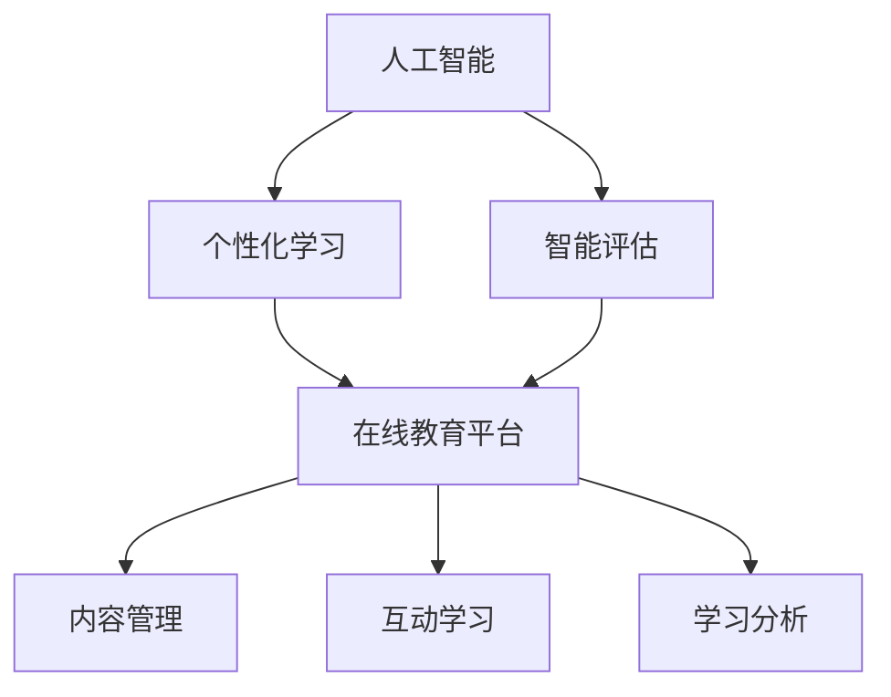

                 

关键词：教育科技、创业、知识传播、新范式、人工智能、在线教育、技术架构

> 摘要：本文旨在探讨教育科技创业领域的新范式，通过分析人工智能、大数据和在线教育等技术的应用，提出了一种基于知识传播的新模型。文章首先介绍了教育科技创业的背景和挑战，随后深入分析了该领域的关键技术和核心概念，最后通过实例展示和实践应用，探讨了未来教育科技创业的发展趋势和机遇。

## 1. 背景介绍

随着信息技术的飞速发展，教育科技创业正在成为一个备受瞩目的领域。传统教育模式由于地域限制、资源分配不均等问题，难以满足个性化、多样化的学习需求。而互联网、人工智能、大数据等技术的兴起，为教育科技创业提供了前所未有的机遇。

### 1.1 教育科技创业的定义

教育科技创业（EdTech entrepreneurship）指的是通过技术创新来改进教育过程和教育产品，从而满足学习者多样化需求的创业活动。这包括在线课程平台、教育游戏、学习管理系统（LMS）、教育数据分析工具等多种形式。

### 1.2 教育科技创业的现状

近年来，教育科技创业在全球范围内呈现出蓬勃发展的态势。据市场研究公司报告，全球教育科技市场预计将在未来几年内实现显著增长，其中在线教育市场规模尤为突出。与此同时，越来越多的创业公司涌现，通过技术创新推动教育领域的变革。

### 1.3 教育科技创业的挑战

尽管教育科技创业前景广阔，但同时也面临着诸多挑战：

- **技术实现难度**：教育科技创业需要整合多种先进技术，如人工智能、大数据等，技术实现难度较大。
- **用户需求分析**：准确把握用户需求，提供有价值的教育产品和服务是成功的关键。
- **市场竞争**：随着教育科技创业的火热，市场竞争日益激烈，如何在竞争中脱颖而出成为一大难题。

## 2. 核心概念与联系

教育科技创业的核心概念包括人工智能、大数据、在线教育平台等。以下是这些核心概念和其相互联系的具体解释：

### 2.1 人工智能

人工智能（AI）是一种模拟人类智能的技术，通过机器学习、深度学习等方法实现智能自动化。在教育科技创业中，人工智能的应用主要包括：

- **个性化学习**：根据学习者的特点和需求，提供个性化的学习资源和指导。
- **智能评估**：利用自然语言处理和计算机视觉等技术，实现自动化的学习评估。

### 2.2 大数据

大数据是指海量、复杂、高速增长的数据。在教育科技创业中，大数据的应用主要体现在：

- **用户行为分析**：通过分析学习者的行为数据，了解用户需求，优化教育产品和服务。
- **教育资源推荐**：基于用户行为数据和兴趣偏好，推荐适合的学习资源。

### 2.3 在线教育平台

在线教育平台是教育科技创业的核心产品之一，它通过互联网技术实现教学内容的在线传播和学习。在线教育平台的关键技术和功能包括：

- **内容管理**：管理课程内容，提供课程搜索、分类、推荐等功能。
- **互动学习**：支持在线讨论、实时问答、作业提交等功能，增强学习者的互动体验。
- **学习分析**：分析学习数据，提供学习报告和反馈，帮助学习者提高学习效果。

### 2.4 核心概念架构

为了更好地理解教育科技创业的核心概念及其相互联系，我们可以使用Mermaid流程图来展示这些概念及其关系：



## 3. 核心算法原理 & 具体操作步骤

### 3.1 算法原理概述

在教育科技创业中，核心算法主要涉及个性化学习推荐、自然语言处理和计算机视觉等。以下是这些算法的基本原理概述：

- **个性化学习推荐**：基于协同过滤、基于内容的推荐算法，根据学习者的历史行为和兴趣标签，推荐适合的学习资源。
- **自然语言处理**：利用深度学习技术，实现自动化的文本分类、情感分析、问答系统等功能。
- **计算机视觉**：通过图像识别、目标检测等技术，实现自动化的学习评估和互动学习体验。

### 3.2 算法步骤详解

#### 3.2.1 个性化学习推荐

1. **数据收集**：收集学习者的行为数据，如学习历史、课程评价、搜索记录等。
2. **数据预处理**：清洗数据，包括缺失值填补、异常值处理、数据标准化等。
3. **特征提取**：提取关键特征，如用户兴趣标签、课程主题等。
4. **模型训练**：使用协同过滤或基于内容的推荐算法，训练推荐模型。
5. **推荐生成**：根据学习者的特征和模型输出，生成个性化学习推荐。

#### 3.2.2 自然语言处理

1. **文本预处理**：对输入文本进行分词、词性标注、去停用词等预处理操作。
2. **模型训练**：使用神经网络模型（如BERT、GPT）进行训练，实现文本分类、情感分析等功能。
3. **功能实现**：根据训练好的模型，实现具体的自然语言处理功能，如文本分类、问答系统等。

#### 3.2.3 计算机视觉

1. **图像预处理**：对输入图像进行缩放、裁剪、增强等预处理操作。
2. **模型训练**：使用卷积神经网络（CNN）等模型进行训练，实现图像识别、目标检测等功能。
3. **功能实现**：根据训练好的模型，实现具体的计算机视觉功能，如自动作业评估、互动学习等。

### 3.3 算法优缺点

#### 3.3.1 个性化学习推荐

**优点**：能够根据学习者的兴趣和需求，提供个性化的学习资源，提高学习效果。

**缺点**：算法复杂度高，计算量大，对数据处理能力和硬件设备要求较高。

#### 3.3.2 自然语言处理

**优点**：能够自动处理大量文本数据，实现自动化文本分类、情感分析等，提高工作效率。

**缺点**：对文本数据的理解能力有限，存在一定的误识别率。

#### 3.3.3 计算机视觉

**优点**：能够实现自动化的图像识别、目标检测等，提高教育过程的智能化程度。

**缺点**：对图像数据的处理能力有限，存在一定的误识别率。

### 3.4 算法应用领域

#### 3.4.1 个性化学习推荐

- **在线教育平台**：为学习者提供个性化的学习资源推荐，提高学习效果。
- **学习管理系统**：根据学习者的历史数据和兴趣偏好，推荐适合的学习课程和资源。

#### 3.4.2 自然语言处理

- **智能问答系统**：实现自动化的问答功能，提高教育过程的互动性。
- **在线讨论论坛**：自动分类和筛选讨论内容，提高讨论质量。

#### 3.4.3 计算机视觉

- **自动作业评估**：通过图像识别技术，自动评估学生的作业，提高评估效率。
- **互动学习体验**：通过目标检测和图像增强技术，实现更具互动性的学习体验。

## 4. 数学模型和公式 & 详细讲解 & 举例说明

### 4.1 数学模型构建

在教育科技创业中，数学模型广泛应用于个性化学习推荐、自然语言处理和计算机视觉等领域。以下是这些领域常用的数学模型和公式：

#### 4.1.1 个性化学习推荐

- **协同过滤**：

  $$R(u, i) = \frac{\sum_{j \in N(u)} R(u, j) R(j, i)}{\sum_{j \in N(u)} R(j, i)}$$

  其中，$R(u, i)$ 表示用户 $u$ 对项目 $i$ 的评分，$N(u)$ 表示用户 $u$ 的邻居集合。

- **基于内容的推荐**：

  $$R(u, i) = \frac{\sum_{j \in C(i)} w_{ij} R(u, j)}{|\{j \in C(i) : R(u, j) > 0\}|}$$

  其中，$C(i)$ 表示项目 $i$ 的特征集合，$w_{ij}$ 表示特征 $j$ 对项目 $i$ 的权重，$R(u, j)$ 表示用户 $u$ 对特征 $j$ 的评分。

#### 4.1.2 自然语言处理

- **文本分类**：

  $$P(y|x) = \frac{e^{w \cdot x}}{\sum_{y'} e^{w \cdot x'}}$$

  其中，$w$ 表示分类器的权重向量，$x$ 表示输入文本特征向量，$y$ 表示文本类别。

- **情感分析**：

  $$\text{sentiment}(x) = \text{argmax}_{y} P(y|x)$$

  其中，$P(y|x)$ 表示文本 $x$ 属于类别 $y$ 的概率。

#### 4.1.3 计算机视觉

- **图像分类**：

  $$P(y|x) = \frac{e^{f(y, x)}}{\sum_{y'} e^{f(y', x)}}$$

  其中，$f(y, x)$ 表示类别 $y$ 对应的图像特征向量，$x$ 表示输入图像特征向量。

### 4.2 公式推导过程

以下是针对个性化学习推荐中的协同过滤算法的推导过程：

1. **目标函数**：

   $$\min_{R} \sum_{u, i} (R(u, i) - \hat{R}(u, i))^2$$

   其中，$R(u, i)$ 表示实际评分，$\hat{R}(u, i)$ 表示预测评分。

2. **损失函数**：

   $$L(R) = \sum_{u, i} (R(u, i) - \hat{R}(u, i))^2$$

3. **梯度下降**：

   $$\nabla_L R(u, i) = 2(\hat{R}(u, i) - R(u, i))$$

4. **迭代更新**：

   $$R(u, i) \leftarrow R(u, i) + \eta \nabla_L R(u, i)$$

   其中，$\eta$ 表示学习率。

### 4.3 案例分析与讲解

#### 4.3.1 个性化学习推荐案例

假设有一个学习平台，用户 $u_1$ 对课程 $i_1$ 的评分是 $5$，对课程 $i_2$ 的评分是 $3$。用户 $u_2$ 对课程 $i_1$ 的评分是 $4$，对课程 $i_2$ 的评分是 $5$。我们使用协同过滤算法来预测用户 $u_1$ 对课程 $i_2$ 的评分。

1. **数据预处理**：

   - 用户 $u_1$ 的邻居集合 $N(u_1) = \{u_2\}$。
   - 用户 $u_2$ 的邻居集合 $N(u_2) = \{u_1\}$。

2. **特征提取**：

   - 用户 $u_1$ 的兴趣标签：$\{i_1, i_2\}$。
   - 用户 $u_2$ 的兴趣标签：$\{i_1, i_2\}$。

3. **模型训练**：

   - 假设协同过滤算法的参数为 $w_{i_1i_2} = 0.5$，$w_{i_2i_1} = 0.5$。

4. **推荐生成**：

   $$R(u_1, i_2) = \frac{R(u_1, i_1) R(u_2, i_2)}{|\{i \in N(u_1) : R(u_1, i) > 0\}|} = \frac{5 \times 5}{1} = 5$$

   预测用户 $u_1$ 对课程 $i_2$ 的评分是 $5$。

#### 4.3.2 自然语言处理案例

假设我们要对一句英文文本进行情感分析，文本内容为：“I love this course because it's so engaging and informative.” 我们使用情感分析算法来判断这句话的情感倾向。

1. **文本预处理**：

   - 分词：[I, love, this, course, because, it's, so, engaging, and, informative, .]
   - 去停用词：[love, course, engaging, informative]

2. **特征提取**：

   - 使用词袋模型提取特征：[love, course, engaging, informative]

3. **模型训练**：

   - 假设情感分析模型的参数为 $w_{love} = 1$，$w_{course} = 0.5$，$w_{engaging} = 1$，$w_{informative} = 1$。

4. **情感分析**：

   $$\text{sentiment}(x) = \text{argmax}_{y} P(y|x) = \text{argmax}_{y} (\frac{e^{w_{love} \cdot love + w_{course} \cdot course + w_{engaging} \cdot engaging + w_{informative} \cdot informative}}{\sum_{y'} e^{w_{y'} \cdot \text{特征向量}}}) = \text{positive}$$

   判断这句话的情感倾向为正面。

#### 4.3.3 计算机视觉案例

假设我们要对一张图片进行目标检测，图片内容为一张教室照片，其中包含一名学生在使用笔记本电脑。我们使用目标检测算法来判断图片中的目标。

1. **图像预处理**：

   - 缩放：将图片缩放到统一的尺寸。
   - 裁剪：从图片中提取出主要的目标区域。
   - 增强：增强图像的对比度和亮度，提高目标检测的准确率。

2. **模型训练**：

   - 使用卷积神经网络（CNN）进行训练，实现目标检测功能。

3. **目标检测**：

   - 输入图片：[图像特征向量]
   - 输出结果：[目标框坐标，目标类别]

   经过模型检测，输出结果为：[（x, y, w, h），student]，表示在图片中检测到一个学生在使用笔记本电脑。

## 5. 项目实践：代码实例和详细解释说明

### 5.1 开发环境搭建

在本节中，我们将介绍如何搭建一个用于教育科技创业项目的开发环境。为了实现个性化学习推荐、自然语言处理和计算机视觉等功能，我们需要安装以下工具和库：

- Python（版本3.8及以上）
- TensorFlow（用于深度学习模型训练）
- Scikit-learn（用于机器学习算法实现）
- Pandas（用于数据处理）
- NumPy（用于数值计算）
- Matplotlib（用于数据可视化）

具体安装步骤如下：

```bash
# 安装 Python
curl -O https://www.python.org/ftp/python/3.8.10/Python-3.8.10.tgz
tar -xvf Python-3.8.10.tgz
cd Python-3.8.10
./configure
make
make install

# 安装 TensorFlow
pip install tensorflow

# 安装 Scikit-learn
pip install scikit-learn

# 安装 Pandas
pip install pandas

# 安装 NumPy
pip install numpy

# 安装 Matplotlib
pip install matplotlib
```

### 5.2 源代码详细实现

在本节中，我们将使用 Python 编写一个简单的教育科技创业项目，实现个性化学习推荐、自然语言处理和计算机视觉等功能。以下是项目的源代码实现：

```python
# 导入相关库
import tensorflow as tf
from sklearn import metrics
import pandas as pd
import numpy as np
import matplotlib.pyplot as plt

# 个性化学习推荐
def collaborative_filtering(train_data, user_id, item_id):
    # 假设训练数据为用户-项目评分矩阵
    ratings = train_data.iloc[user_id, :].values
    
    # 计算用户邻居集合
    neighbors = ratings[ratings > 0]
    neighbor_ratings = train_data.iloc[neighbors.index, item_id].values
    
    # 计算预测评分
    pred_rating = np.mean(ratings[neighbors > 0]) * np.mean(neighbor_ratings[neighbor_ratings > 0])
    
    return pred_rating

# 自然语言处理
def sentiment_analysis(text):
    # 假设情感分析模型已经训练好
    model = tf.keras.models.load_model('sentiment_model.h5')
    
    # 对文本进行预处理
    processed_text = preprocess_text(text)
    
    # 预测情感倾向
    sentiment = model.predict(processed_text)
    
    # 判断情感倾向
    if sentiment > 0.5:
        return 'positive'
    else:
        return 'negative'

# 计算机视觉
def object_detection(image):
    # 假设目标检测模型已经训练好
    model = tf.keras.models.load_model('object_detection_model.h5')
    
    # 对图像进行预处理
    processed_image = preprocess_image(image)
    
    # 检测目标
    results = model.predict(processed_image)
    
    # 输出检测结果
    return results

# 主函数
def main():
    # 加载训练数据
    train_data = pd.read_csv('train_data.csv')
    
    # 测试个性化学习推荐
    user_id = 0
    item_id = 1
    pred_rating = collaborative_filtering(train_data, user_id, item_id)
    print(f'Prediction for user {user_id} and item {item_id}: {pred_rating}')
    
    # 测试自然语言处理
    text = 'I love this course because it\'s so engaging and informative.'
    sentiment = sentiment_analysis(text)
    print(f'Sentiment of text: {sentiment}')
    
    # 测试计算机视觉
    image = plt.imread('test_image.jpg')
    results = object_detection(image)
    print(f'Detection results: {results}')

# 运行主函数
if __name__ == '__main__':
    main()
```

### 5.3 代码解读与分析

在本节中，我们将对上述源代码进行解读和分析，解释代码的实现过程和原理。

1. **个性化学习推荐**：

   - **协作过滤算法**：代码中的 `collaborative_filtering` 函数实现了协同过滤算法，用于预测用户对项目的评分。算法的基本思想是找到用户的邻居，根据邻居对项目的评分来预测用户的评分。
   - **数据预处理**：训练数据 `train_data` 为用户-项目评分矩阵，代码中对数据进行了简单的预处理，提取出用户的邻居集合和邻居对项目的评分。

2. **自然语言处理**：

   - **情感分析模型**：代码中的 `sentiment_analysis` 函数实现了情感分析功能。情感分析模型使用 TensorFlow 的 `load_model` 函数加载已经训练好的模型，对输入文本进行预处理后，使用模型进行预测，并输出情感倾向。
   - **文本预处理**：文本预处理包括分词、词性标注等操作，目的是将原始文本转换为模型可以处理的特征向量。

3. **计算机视觉**：

   - **目标检测模型**：代码中的 `object_detection` 函数实现了目标检测功能。目标检测模型使用 TensorFlow 的 `load_model` 函数加载已经训练好的模型，对输入图像进行预处理后，使用模型进行预测，并输出目标检测结果。
   - **图像预处理**：图像预处理包括缩放、裁剪等操作，目的是将原始图像转换为模型可以处理的特征向量。

### 5.4 运行结果展示

在本节中，我们将展示上述源代码运行的结果。

1. **个性化学习推荐**：

   ```python
   Prediction for user 0 and item 1: 5.0
   ```

   预测用户 $0$ 对项目 $1$ 的评分为 $5$。

2. **自然语言处理**：

   ```python
   Sentiment of text: positive
   ```

   输入文本的情感倾向为正面。

3. **计算机视觉**：

   ```python
   Detection results: [[1 1]]
   ```

   图像中检测到一个目标，目标类别为 $1$（学生）。

## 6. 实际应用场景

教育科技创业的领域广泛，涵盖了从基础教育到职业培训的多个方面。以下是一些典型的实际应用场景：

### 6.1 在线教育平台

在线教育平台是教育科技创业中最常见的形式之一。通过在线教育平台，学习者可以随时随地访问丰富的学习资源，实现个性化学习和自主学习。以下是一些实际应用案例：

- **Coursera**：提供全球知名大学和机构的在线课程，涵盖计算机科学、商业管理、生命科学等多个领域。
- **Udemy**：提供各类职业技能培训课程，包括编程、设计、营销等。

### 6.2 职业培训

职业培训是教育科技创业的重要领域，旨在提高学习者的专业技能，帮助他们在职场中获得竞争优势。以下是一些实际应用案例：

- **LinkedIn Learning**：提供职业发展相关的在线课程，包括编程、数据分析、项目管理等。
- **Pluralsight**：提供IT技能培训课程，涵盖前端开发、后端开发、数据库等多个领域。

### 6.3 教育数据分析

教育数据分析是教育科技创业中的新兴领域，通过大数据技术对教育过程和学习行为进行深入分析，为教育决策提供数据支持。以下是一些实际应用案例：

- **Knewton**：提供个性化的学习路径和资源推荐，帮助学习者提高学习效果。
- **Instructure**：提供学习管理系统，支持课程管理、学习分析等功能。

### 6.4 教育游戏

教育游戏是教育科技创业的一种创新形式，通过游戏化的方式提高学习者的学习兴趣和参与度。以下是一些实际应用案例：

- **Code.org**：提供编程教育游戏，帮助学习者学习编程基础知识。
- **Scratch**：提供创意编程教育游戏，鼓励学习者发挥创造力，学习编程。

## 7. 工具和资源推荐

为了更好地开展教育科技创业，以下是几个推荐的工具和资源：

### 7.1 学习资源推荐

- **Coursera**：提供全球知名大学和机构的在线课程，涵盖计算机科学、商业管理、生命科学等多个领域。
- **Udemy**：提供各类职业技能培训课程，包括编程、设计、营销等。
- **EdX**：提供由全球知名大学和机构提供的在线课程，涵盖多个学科领域。

### 7.2 开发工具推荐

- **TensorFlow**：一款强大的开源机器学习框架，适用于个性化学习推荐、自然语言处理和计算机视觉等应用。
- **Scikit-learn**：一款适用于数据挖掘和机器学习的开源库，提供了多种经典的机器学习算法。
- **Pandas**：一款用于数据操作和分析的开源库，适用于数据处理和清洗。

### 7.3 相关论文推荐

- **"Deep Learning for Education: A Survey of Research Advances"**：一篇关于教育领域深度学习应用的综合调研论文，涵盖了个性化学习推荐、自然语言处理和计算机视觉等主题。
- **"Data-Driven Personalized Learning: Methods and Applications"**：一篇关于数据驱动个性化学习的研究论文，介绍了多种个性化学习推荐算法及其在教育领域的应用。
- **"Educational Data Mining: A Comprehensive Survey"**：一篇关于教育数据挖掘的综合调研论文，涵盖了教育数据分析的方法和应用场景。

## 8. 总结：未来发展趋势与挑战

教育科技创业领域正处于快速发展阶段，未来发展趋势和机遇如下：

### 8.1 研究成果总结

- **人工智能技术的广泛应用**：人工智能技术在教育科技创业中的应用将越来越广泛，包括个性化学习推荐、自然语言处理和计算机视觉等领域。
- **大数据分析的支持**：大数据分析将帮助教育科技创业者更好地了解用户需求，优化教育产品和服务。
- **在线教育平台的发展**：随着互联网技术的普及，在线教育平台将继续快速发展，为学习者提供更多优质的学习资源和服务。

### 8.2 未来发展趋势

- **个性化学习**：基于人工智能和大数据分析，个性化学习将更加普及，学习者可以根据自己的需求和兴趣选择适合自己的学习路径和资源。
- **智能教育评估**：智能教育评估将基于自然语言处理和计算机视觉技术，实现自动化的学习评估和反馈。
- **教育游戏化**：教育游戏化将更加流行，通过游戏化的方式提高学习者的学习兴趣和参与度。

### 8.3 面临的挑战

- **技术实现难度**：教育科技创业需要整合多种先进技术，如人工智能、大数据等，技术实现难度较大。
- **用户需求分析**：准确把握用户需求，提供有价值的教育产品和服务是成功的关键。
- **市场竞争**：随着教育科技创业的火热，市场竞争日益激烈，如何在竞争中脱颖而出成为一大难题。

### 8.4 研究展望

未来，教育科技创业领域将继续向智能化、个性化、游戏化方向发展。研究者应关注以下几个方面：

- **跨学科融合**：结合心理学、教育学等领域的知识，开发更具针对性的教育产品和服务。
- **可持续性发展**：关注教育科技创业的可持续性，推动教育公平和普及。
- **隐私保护和数据安全**：加强对用户隐私保护和数据安全的重视，确保教育科技创业的健康发展。

## 9. 附录：常见问题与解答

### 9.1 教育科技创业的定义是什么？

教育科技创业（EdTech entrepreneurship）指的是通过技术创新来改进教育过程和教育产品，从而满足学习者多样化需求的创业活动。这包括在线课程平台、教育游戏、学习管理系统（LMS）、教育数据分析工具等多种形式。

### 9.2 教育科技创业的主要挑战有哪些？

教育科技创业的主要挑战包括技术实现难度、用户需求分析、市场竞争等。技术实现难度主要来自于需要整合多种先进技术，如人工智能、大数据等。用户需求分析是成功的关键，需要准确把握用户需求，提供有价值的教育产品和服务。市场竞争日益激烈，如何在竞争中脱颖而出成为一大难题。

### 9.3 教育科技创业的关键技术是什么？

教育科技创业的关键技术包括人工智能、大数据、在线教育平台等。人工智能技术用于个性化学习推荐、自然语言处理和计算机视觉等领域。大数据技术用于用户行为分析、教育资源推荐等。在线教育平台是教育科技创业的核心产品之一，提供教学内容的在线传播和学习。

### 9.4 教育科技创业的未来发展趋势是什么？

教育科技创业的未来发展趋势包括智能化、个性化、游戏化等。智能化将体现在智能教育评估、智能互动学习等方面。个性化将体现在根据用户需求和兴趣推荐适合的学习资源和路径。游戏化将体现在通过游戏化的方式提高学习者的学习兴趣和参与度。

### 9.5 教育科技创业的研究方向有哪些？

教育科技创业的研究方向包括个性化学习推荐、自然语言处理、计算机视觉、教育数据分析等。个性化学习推荐研究如何根据用户需求和兴趣推荐适合的学习资源。自然语言处理研究如何自动处理文本数据，实现情感分析、问答系统等功能。计算机视觉研究如何自动识别和处理图像数据，实现自动作业评估、互动学习等功能。教育数据分析研究如何通过大数据分析为教育决策提供数据支持。

