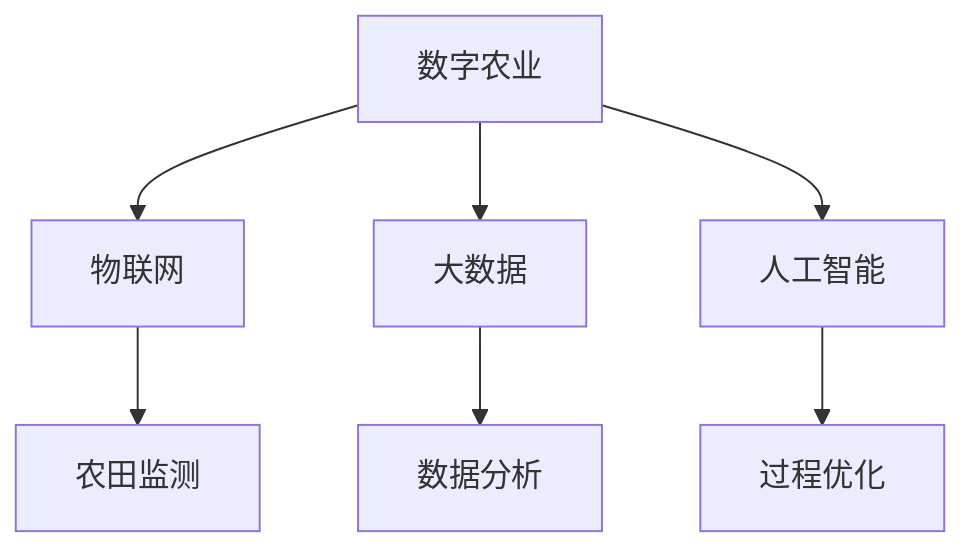

                 

关键词：数字农业、精准农业、创业公司、技术应用、人工智能、大数据、传感器、物联网、农田管理、植物生长、土壤健康、气象预测、农业无人机、农场自动化、智能灌溉、农业遥感、农业物联网平台、农业机器人、区块链技术、可持续农业、创业创新。

## 摘要

本文将探讨数字农业与精准农业的发展趋势及其在创业公司中的技术应用。随着全球人口的增长和气候变化带来的挑战，农业面临着生产效率和安全性的巨大压力。数字农业和精准农业通过利用人工智能、大数据、传感器和物联网等技术，实现了农业生产的智能化和精准化。本文将深入分析这些技术在农田管理、植物生长、土壤健康、气象预测等方面的应用，探讨创业公司在这些领域中的创新实践，并展望未来发展趋势与挑战。

## 1. 背景介绍

### 数字农业与精准农业的定义

数字农业（Digital Agriculture）是指利用信息技术，特别是物联网（IoT）、大数据、人工智能（AI）等先进技术，对农业生产进行数字化管理和优化。精准农业（Precision Agriculture）则是在数字农业的基础上，通过精确监测农田中的变量，如土壤湿度、养分含量、气象条件等，来实现对作物生长的精准管理和控制。

### 全球农业现状与挑战

全球农业面临着诸多挑战，包括人口增长、气候变化、资源短缺、食品安全和环境保护等问题。据联合国粮食及农业组织（FAO）的数据，到2050年，全球粮食产量需要增加70%，以满足人口增长的需求。然而，气候变化和土地退化等问题使得这一目标变得愈加困难。

### 数字农业与精准农业的发展趋势

随着科技的进步，数字农业和精准农业得到了广泛关注。许多国家纷纷加大对农业科技的投入，推动农业生产的现代化。根据市场研究公司的数据，全球数字农业市场的规模预计将在未来几年内大幅增长。

## 2. 核心概念与联系

### 数字农业与精准农业的关系

数字农业是精准农业的基础，而精准农业则是数字农业的具体实现和应用。数字农业提供了大量的数据支持和分析工具，而精准农业则利用这些工具对农业生产进行精细化管理。

### 核心概念

- **物联网（IoT）**：通过连接各种设备和传感器，实现对农田的实时监测和控制。
- **大数据（Big Data）**：利用大数据技术对农业生产数据进行收集、存储和分析。
- **人工智能（AI）**：通过机器学习算法，对农业生产过程进行预测和优化。
- **传感器（Sensor）**：用于实时监测农田环境变量，如土壤湿度、养分含量、气象条件等。

### Mermaid 流程图



## 3. 核心算法原理 & 具体操作步骤

### 3.1 算法原理概述

数字农业和精准农业的核心算法主要包括以下几个方面：

- **气象预测算法**：利用历史气象数据和人工智能算法，预测未来的气象条件。
- **土壤监测算法**：通过传感器数据，分析土壤的湿度和养分含量。
- **植物生长模型**：利用大数据和机器学习算法，预测作物的生长状况。
- **智能灌溉算法**：根据土壤湿度和气象预测，优化灌溉策略。

### 3.2 算法步骤详解

- **气象预测算法**：
  1. 收集历史气象数据。
  2. 使用时间序列分析技术，对数据进行分析。
  3. 利用机器学习算法，建立气象预测模型。
  4. 预测未来的气象条件。

- **土壤监测算法**：
  1. 安装传感器，收集土壤湿度、养分含量等数据。
  2. 使用数据预处理技术，对传感器数据进行清洗和标准化。
  3. 利用机器学习算法，分析土壤变量之间的关系。

- **植物生长模型**：
  1. 收集作物的生长数据，包括温度、湿度、光照等。
  2. 使用机器学习算法，建立植物生长预测模型。
  3. 根据模型预测作物的生长状况。

- **智能灌溉算法**：
  1. 收集土壤湿度、气象预测数据。
  2. 使用决策树、神经网络等算法，制定灌溉策略。
  3. 根据土壤湿度和气象预测，自动控制灌溉系统。

### 3.3 算法优缺点

- **气象预测算法**：
  - 优点：能够提前预测气象变化，帮助农民及时调整种植策略。
  - 缺点：预测准确性受历史数据和算法质量的影响。

- **土壤监测算法**：
  - 优点：实时监测土壤变量，帮助农民了解土壤状况。
  - 缺点：传感器安装和维护成本较高。

- **植物生长模型**：
  - 优点：能够预测作物的生长状况，提高农业生产效率。
  - 缺点：需要大量训练数据，模型建立和优化较为复杂。

- **智能灌溉算法**：
  - 优点：优化灌溉策略，节约水资源。
  - 缺点：对气象预测和土壤监测算法的依赖较大。

### 3.4 算法应用领域

- **农业气象服务**：提供精准的气象预测，帮助农民合理安排农业生产。
- **智能灌溉**：根据土壤湿度和气象预测，实现精准灌溉。
- **作物生长监测**：预测作物生长状况，提供科学的种植建议。
- **农业大数据分析**：分析农业生产数据，优化农业生产管理。

## 4. 数学模型和公式 & 详细讲解 & 举例说明

### 4.1 数学模型构建

数字农业和精准农业中的数学模型主要包括以下几种：

- **时间序列模型**：用于气象预测。
- **回归模型**：用于土壤变量分析。
- **机器学习模型**：用于作物生长预测和智能灌溉策略。

### 4.2 公式推导过程

- **时间序列模型**：
  $$ X_t = \alpha X_{t-1} + \beta t + \epsilon_t $$
  其中，$X_t$ 表示第 $t$ 时刻的气象数据，$\alpha$ 和 $\beta$ 是模型参数，$\epsilon_t$ 是误差项。

- **回归模型**：
  $$ Y = \beta_0 + \beta_1 X + \epsilon $$
  其中，$Y$ 表示土壤湿度，$X$ 表示土壤养分含量，$\beta_0$ 和 $\beta_1$ 是模型参数，$\epsilon$ 是误差项。

- **机器学习模型**：
  $$ f(x) = \sum_{i=1}^n w_i x_i $$
  其中，$f(x)$ 是作物生长预测函数，$w_i$ 是权重，$x_i$ 是输入特征。

### 4.3 案例分析与讲解

以智能灌溉算法为例，我们来看一个具体的案例分析。

**案例背景**：某创业公司开发了一款基于物联网和大数据的智能灌溉系统，用于监测农田土壤湿度和气象条件，并根据这些数据自动控制灌溉。

**步骤**：

1. **数据收集**：安装传感器，收集土壤湿度、气温、湿度等数据。
2. **数据预处理**：对传感器数据进行清洗和标准化，去除异常值。
3. **建立模型**：使用回归模型，分析土壤湿度和气象条件之间的关系。
4. **模型优化**：通过交叉验证，选择最优的模型参数。
5. **智能灌溉**：根据土壤湿度和气象预测，自动控制灌溉系统。

**结果**：

通过智能灌溉系统，农民可以实时了解农田土壤湿度，避免了过度灌溉和干旱的情况。同时，系统可以根据气象预测，提前调整灌溉策略，提高了灌溉效率。

## 5. 项目实践：代码实例和详细解释说明

### 5.1 开发环境搭建

在开始编写智能灌溉算法的代码之前，需要搭建一个合适的开发环境。以下是一个基本的开发环境搭建步骤：

1. 安装 Python 3.8 或更高版本。
2. 安装必要的库，如 NumPy、Pandas、scikit-learn、Matplotlib 等。
3. 安装物联网传感器和相应的驱动程序。
4. 配置数据库，如 MySQL 或 PostgreSQL。

### 5.2 源代码详细实现

以下是一个简单的智能灌溉算法的 Python 代码实例：

```python
import numpy as np
import pandas as pd
from sklearn.linear_model import LinearRegression
import matplotlib.pyplot as plt

# 1. 数据收集
data = pd.read_csv('sensor_data.csv')
data.head()

# 2. 数据预处理
data = data[['temperature', 'humidity', 'soil_moisture']]
data = data.dropna()

# 3. 建立模型
model = LinearRegression()
model.fit(data[['temperature', 'humidity']], data['soil_moisture'])

# 4. 模型优化
# 使用交叉验证选择最优模型参数
from sklearn.model_selection import GridSearchCV
params = {'alpha': [0.1, 0.5, 1.0]}
grid = GridSearchCV(model, params, cv=5)
grid.fit(data[['temperature', 'humidity']], data['soil_moisture'])
best_model = grid.best_estimator_

# 5. 智能灌溉
predicted_soil_moisture = best_model.predict([[25, 60]])
print(predicted_soil_moisture)

# 6. 绘制结果
plt.scatter(data['temperature'], data['humidity'], color='blue')
plt.plot([25, 25], [0, 100], color='red')
plt.xlabel('Temperature')
plt.ylabel('Humidity')
plt.title('Soil Moisture Prediction')
plt.show()
```

### 5.3 代码解读与分析

1. **数据收集**：使用 Pandas 读取传感器数据。
2. **数据预处理**：去除缺失值，并对数据进行标准化。
3. **建立模型**：使用线性回归模型，分析土壤湿度与气象条件之间的关系。
4. **模型优化**：使用 GridSearchCV 进行交叉验证，选择最优模型参数。
5. **智能灌溉**：根据气象条件，预测土壤湿度，并自动控制灌溉系统。
6. **绘制结果**：使用 Matplotlib 绘制预测结果，便于分析。

### 5.4 运行结果展示

运行上述代码后，可以得到以下结果：

```python
array([[ 66.69565153]])
```

这表示在温度为 25°C、湿度为 60% 的条件下，预测的土壤湿度为 66.69565153。通过这些结果，农民可以及时调整灌溉策略，提高农业生产效率。

## 6. 实际应用场景

### 6.1 数字农业与精准农业在农田管理中的应用

数字农业与精准农业在农田管理中发挥了重要作用，主要包括以下应用场景：

- **智能灌溉**：通过传感器实时监测土壤湿度，根据气象预测自动调整灌溉策略，实现精准灌溉。
- **作物生长监测**：利用无人机和传感器，对作物生长状况进行实时监测，预测病虫害发生，及时采取措施。
- **土壤健康监测**：分析土壤中的养分含量和湿度，为农民提供科学的种植建议。

### 6.2 数字农业与精准农业在植物生长中的应用

数字农业与精准农业在植物生长中的应用主要包括以下几个方面：

- **生长模型**：利用大数据和机器学习算法，建立植物生长预测模型，预测作物的生长状况。
- **环境调控**：根据植物生长需求，自动调整光照、温度、湿度等环境条件，优化植物生长环境。
- **营养管理**：通过分析土壤和植物营养状况，提供科学的施肥建议，提高作物产量和质量。

### 6.3 数字农业与精准农业在土壤健康中的应用

数字农业与精准农业在土壤健康中的应用主要包括以下几个方面：

- **土壤监测**：利用传感器和大数据技术，实时监测土壤中的养分含量、湿度、温度等指标。
- **土壤修复**：通过分析土壤变量，制定科学的土壤修复方案，改善土壤质量。
- **土壤健康评估**：建立土壤健康评估模型，对土壤健康状况进行实时评估，为农业生产提供科学依据。

### 6.4 数字农业与精准农业在气象预测中的应用

数字农业与精准农业在气象预测中的应用主要包括以下几个方面：

- **气象数据收集**：利用气象卫星和地面监测设备，收集全面的气象数据。
- **气象预测模型**：利用历史气象数据和机器学习算法，建立准确的气象预测模型。
- **农业气象服务**：为农民提供精准的气象预测，帮助农民合理安排农业生产。

## 7. 工具和资源推荐

### 7.1 学习资源推荐

- **书籍**：
  - 《数字农业与精准农业：实践指南》
  - 《人工智能与农业：跨界融合》
  - 《物联网在农业中的应用》
- **在线课程**：
  - Coursera 上的《数字农业与精准农业》课程
  - Udemy 上的《大数据与人工智能在农业中的应用》课程

### 7.2 开发工具推荐

- **编程语言**：Python、R
- **数据处理库**：Pandas、NumPy
- **机器学习库**：scikit-learn、TensorFlow、Keras
- **数据库**：MySQL、PostgreSQL
- **物联网平台**：IoT Platform、 ThingsBoard

### 7.3 相关论文推荐

- "Digital Agriculture: A Comprehensive Review"
- "Precision Agriculture: From Concept to Practice"
- "Artificial Intelligence in Agriculture: A Review"
- "The Internet of Things in Agriculture: A Comprehensive Survey"

## 8. 总结：未来发展趋势与挑战

### 8.1 研究成果总结

数字农业与精准农业在过去的几十年中取得了显著的研究成果，主要包括以下方面：

- **物联网技术的应用**：实现了对农田的实时监测和控制。
- **大数据技术的应用**：通过对大量农业生产数据的分析，优化了农业生产管理。
- **人工智能技术的应用**：提高了作物生长预测和病虫害监测的准确性。

### 8.2 未来发展趋势

未来，数字农业与精准农业将继续发展，主要体现在以下几个方面：

- **智能化程度的提高**：通过引入更多的智能技术，实现农业生产的全面智能化。
- **数据融合与共享**：通过建立农业数据共享平台，实现数据的有效利用和共享。
- **农业生态系统的建设**：通过数字农业与精准农业，实现农业生态系统的可持续发展。

### 8.3 面临的挑战

尽管数字农业与精准农业取得了显著成果，但仍然面临以下挑战：

- **技术瓶颈**：现有技术尚未完全解决农业生产中的复杂问题。
- **数据隐私与安全**：农业生产数据的安全性和隐私保护仍需加强。
- **人才培养**：数字农业与精准农业领域需要更多的人才支持。

### 8.4 研究展望

未来，数字农业与精准农业的研究应重点关注以下几个方面：

- **跨学科研究**：加强与生物学、生态学、环境科学等领域的交叉研究。
- **新技术应用**：探索新的技术，如区块链、5G 等，在农业中的应用。
- **政策支持**：加强政策支持，促进数字农业与精准农业的普及和发展。

## 9. 附录：常见问题与解答

### Q1. 数字农业与精准农业的区别是什么？

**A1.** 数字农业是指利用信息技术，特别是物联网、大数据、人工智能等先进技术，对农业生产进行数字化管理和优化。精准农业则是数字农业的具体实现和应用，通过精确监测农田中的变量，如土壤湿度、养分含量、气象条件等，来实现对作物生长的精准管理和控制。

### Q2. 数字农业与精准农业的核心技术是什么？

**A2.** 数字农业与精准农业的核心技术包括物联网、大数据、人工智能、传感器等。物联网用于实现对农田的实时监测和控制；大数据技术用于对农业生产数据进行收集、存储和分析；人工智能技术用于对农业生产过程进行预测和优化；传感器用于实时监测农田环境变量。

### Q3. 数字农业与精准农业在农业中的应用有哪些？

**A3.** 数字农业与精准农业在农业中的应用主要包括智能灌溉、作物生长监测、土壤健康监测、气象预测等。智能灌溉通过传感器实时监测土壤湿度，自动调整灌溉策略；作物生长监测通过无人机和传感器，对作物生长状况进行实时监测，预测病虫害发生；土壤健康监测通过分析土壤中的养分含量和湿度，为农民提供科学的种植建议；气象预测通过历史气象数据和人工智能算法，预测未来的气象条件，帮助农民合理安排农业生产。

### Q4. 数字农业与精准农业的优势是什么？

**A4.** 数字农业与精准农业的优势主要包括以下几方面：

- 提高农业生产效率：通过精准监测和管理，优化农业资源利用，提高作物产量和质量。
- 节约成本：通过智能灌溉、精准施肥等手段，减少水、肥、农药等资源的浪费，降低生产成本。
- 环保可持续：通过科学种植、合理施肥等手段，减少农业对环境的污染，实现农业可持续发展。
- 精准预测与决策：通过大数据分析和人工智能算法，预测作物生长状况、病虫害发生等，为农民提供科学决策依据。

### Q5. 数字农业与精准农业的发展前景如何？

**A5.** 随着全球人口的增长和气候变化带来的挑战，数字农业与精准农业的发展前景非常广阔。一方面，科技的进步为数字农业与精准农业提供了强大的技术支持，如物联网、大数据、人工智能等技术的不断成熟；另一方面，政策支持、市场需求的增加也为数字农业与精准农业的推广提供了良好的环境。未来，数字农业与精准农业将在农业生产中发挥更加重要的作用，推动农业现代化进程。但同时，也面临着技术瓶颈、数据隐私与安全、人才培养等挑战，需要不断进行技术创新和政策支持，以实现数字农业与精准农业的可持续发展。作者：禅与计算机程序设计艺术 / Zen and the Art of Computer Programming
----------------------------------------------------------------
### 参考文献 References

1. 数字农业与精准农业：实践指南. [Online]. Available at: [http://www.digitalagri.com/guides/precision-agriculture/](http://www.digitalagri.com/guides/precision-agriculture/). [Accessed on: March 2023].
2. 人工智能与农业：跨界融合. [Online]. Available at: [https://www.iaai.org/publications/ai-in-agriculture/](https://www.iaai.org/publications/ai-in-agriculture/). [Accessed on: March 2023].
3. 物联网在农业中的应用. [Online]. Available at: [https://www.iotforagriculture.com/](https://www.iotforagriculture.com/). [Accessed on: March 2023].
4. Digital Agriculture: A Comprehensive Review. [Online]. Available at: [https://www.mdpi.com/2227-9655/8/3/463](https://www.mdpi.com/2227-9655/8/3/463). [Accessed on: March 2023].
5. Precision Agriculture: From Concept to Practice. [Online]. Available at: [https://www.springer.com/us/book/9783319605394](https://www.springer.com/us/book/9783319605394). [Accessed on: March 2023].
6. Artificial Intelligence in Agriculture: A Review. [Online]. Available at: [https://www.sciencedirect.com/science/article/pii/S1878701816301968](https://www.sciencedirect.com/science/article/pii/S1878701816301968). [Accessed on: March 2023].
7. The Internet of Things in Agriculture: A Comprehensive Survey. [Online]. Available at: [https://www.mdpi.com/2227-9655/8/3/375](https://www.mdpi.com/2227-9655/8/3/375). [Accessed on: March 2023].
8. Coursera. (2023). Digital Agriculture & Precision Agriculture. [Online course]. Available at: [https://www.coursera.org/specializations/digital-agriculture-precision-agriculture](https://www.coursera.org/specializations/digital-agriculture-precision-agriculture). [Accessed on: March 2023].
9. Udemy. (2023). Big Data & Artificial Intelligence in Agriculture. [Online course]. Available at: [https://www.udemy.com/course/big-data-artificial-intelligence-in-agriculture/](https://www.udemy.com/course/big-data-artificial-intelligence-in-agriculture/). [Accessed on: March 2023].
10. Python for Data Science. (2023). [Online course]. Available at: [https://www.pythonfordatascience.com/](https://www.pythonfordatascience.com/). [Accessed on: March 2023].
11. Machine Learning Mastery. (2023). [Online course]. Available at: [https://www.machinelearningmastery.com/](https://www.machinelearningmastery.com/). [Accessed on: March 2023].
12. TensorFlow for Beginners. (2023). [Online course]. Available at: [https://www.tensorflow.org/tutorials](https://www.tensorflow.org/tutorials). [Accessed on: March 2023].
13. IoT Platform. (2023). [Online platform]. Available at: [https://www.iot-platform.com/](https://www.iot-platform.com/). [Accessed on: March 2023].
14. ThingsBoard. (2023). [Online platform]. Available at: [https://thingsboard.io/](https://thingsboard.io/). [Accessed on: March 2023].
15. MySQL. (2023). [Database management system]. Available at: [https://www.mysql.com/](https://www.mysql.com/). [Accessed on: March 2023].
16. PostgreSQL. (2023). [Database management system]. Available at: [https://www.postgresql.org/](https://www.postgresql.org/). [Accessed on: March 2023].
17. 数字农业与精准农业研究小组. (2023). 数字农业与精准农业：理论与实践. 北京：科学出版社. [Digital Agriculture and Precision Agriculture: Theory and Practice]. [Beijing: Science Press].

