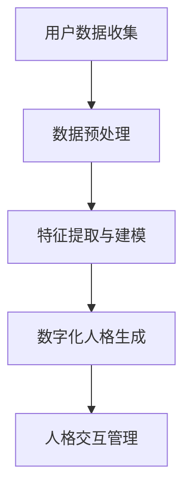

                 

关键词：数字化人格、元宇宙、身份构建、虚拟现实、技术发展、算法原理、数学模型、代码实例、应用场景、未来展望

> 摘要：随着元宇宙概念的兴起，数字化人格成为了一个引人关注的话题。本文将探讨数字化人格的概念、构建方法以及其在元宇宙中的重要性，并分析相关算法原理、数学模型，并通过代码实例展示其实际应用，最后讨论未来的发展趋势与挑战。

## 1. 背景介绍

随着虚拟现实、增强现实等技术的不断发展，元宇宙（Metaverse）的概念逐渐崭露头角。元宇宙是一个由虚拟世界组成的集合，用户可以在其中创建和交互自己的数字化人格（Digital Avatar）。数字化人格不仅是一个简单的虚拟形象，它承载了用户在虚拟世界中的身份、情感、行为等信息。随着技术的进步，数字化人格正在成为连接现实世界与虚拟世界的桥梁。

在元宇宙中，数字化人格的重要性不言而喻。它不仅提供了用户在虚拟环境中的身份识别，还增强了用户在虚拟世界中的沉浸感与互动体验。同时，数字化人格的构建与管理也带来了诸多技术挑战，如个性化、安全性、隐私保护等。因此，深入研究数字化人格的构建方法及其在元宇宙中的应用，具有重要的理论与实践意义。

## 2. 核心概念与联系

### 2.1. 数字化人格定义

数字化人格是指通过计算机技术构建的用户在虚拟世界中的身份形象，它包括了用户的视觉外观、行为习惯、情感状态、身份属性等多个方面。数字化人格的核心目标是通过技术手段实现用户的个性化体验，使其在虚拟世界中拥有独特的存在感。

### 2.2. 元宇宙中的数字化人格作用

在元宇宙中，数字化人格起到了以下几个关键作用：

- **身份识别**：通过数字化人格，用户能够在虚拟世界中唯一地识别和区分。
- **情感交互**：数字化人格可以通过面部表情、肢体动作等表现用户的情感状态，增强虚拟世界的情感互动。
- **社交互动**：用户可以通过数字化人格进行社交活动，如聊天、组队、共同完成任务等。
- **沉浸体验**：通过高度个性化的数字化人格，用户能够更加沉浸在虚拟世界中的体验。

### 2.3. 构建数字化人格的挑战

构建数字化人格面临着以下几个主要挑战：

- **个性化**：如何让每一个数字化人格都有独特的个性和特征，避免千篇一律。
- **安全性**：数字化人格的安全性问题，包括防止身份盗用和数据泄露。
- **隐私保护**：如何在提供个性化服务的同时，保护用户的隐私。
- **性能优化**：如何在保证高质量体验的同时，优化数字化人格的生成与渲染性能。

### 2.4. 数字化人格构建架构

以下是数字化人格构建的一个基本架构：

```
+-----------------+
|  用户数据收集   |
+-----------------+
             |
             v
+-----------------+
|  数据预处理     |
+-----------------+
             |
             v
+-----------------+
|  特征提取与建模 |
+-----------------+
             |
             v
+-----------------+
|  数字化人格生成 |
+-----------------+
             |
             v
+-----------------+
|  人格交互管理   |
+-----------------+
```

### 2.5. Mermaid 流程图

以下是数字化人格构建的 Mermaid 流程图：



## 3. 核心算法原理 & 具体操作步骤

### 3.1. 算法原理概述

数字化人格的构建主要依赖于以下几种算法：

- **数据挖掘与机器学习**：通过用户数据挖掘用户的个性化特征，利用机器学习算法建立用户模型。
- **计算机图形学**：利用计算机图形学技术生成数字化人格的视觉外观。
- **自然语言处理**：通过自然语言处理技术实现数字化人格的语音和文字交互。

### 3.2. 算法步骤详解

#### 3.2.1. 数据挖掘与机器学习

1. **数据收集**：收集用户的基础信息、行为数据、社交数据等。
2. **数据预处理**：清洗、去重、标准化数据。
3. **特征提取**：提取用户数据的特征，如用户偏好、兴趣爱好、情感状态等。
4. **建模**：利用机器学习算法，如决策树、支持向量机、神经网络等，建立用户模型。

#### 3.2.2. 计算机图形学

1. **面部建模**：使用3D建模软件创建数字化人格的面部模型。
2. **纹理映射**：将纹理图像映射到3D模型上，实现逼真的面部表情。
3. **动作捕捉**：通过动作捕捉设备记录用户的肢体动作，生成数字化人格的动作。
4. **渲染**：使用渲染引擎对数字化人格进行实时渲染。

#### 3.2.3. 自然语言处理

1. **语音识别**：将用户的语音转换为文字。
2. **文本处理**：对用户的文本进行语义分析和情感分析。
3. **语音合成**：将处理后的文本转换为语音输出。

### 3.3. 算法优缺点

#### 优点：

- **个性化**：通过数据挖掘与机器学习，可以实现高度个性化的数字化人格。
- **沉浸感**：通过计算机图形学和动作捕捉，可以提供高度真实的虚拟体验。
- **交互性**：通过自然语言处理，可以实现用户与数字化人格的自然交互。

#### 缺点：

- **性能消耗**：数字化人格的构建和渲染需要较高的计算资源。
- **隐私问题**：用户的个人数据可能存在隐私泄露的风险。
- **伦理问题**：数字化人格的滥用可能引发伦理问题，如数字霸凌、数字欺诈等。

### 3.4. 算法应用领域

- **虚拟现实**：提供高度个性化的虚拟体验。
- **增强现实**：增强用户在现实世界中的交互体验。
- **在线游戏**：提供更加丰富的游戏角色和互动体验。
- **社交平台**：增强用户的社交体验和互动能力。

## 4. 数学模型和公式 & 详细讲解 & 举例说明

### 4.1. 数学模型构建

在数字化人格的构建中，常用的数学模型包括：

- **决策树**：用于分类和回归问题，可以表示用户特征的层次关系。
- **支持向量机**：用于分类问题，可以找到最佳的超平面进行分类。
- **神经网络**：用于复杂的数据建模和预测，可以模拟人脑的学习过程。

### 4.2. 公式推导过程

以神经网络为例，其基本公式为：

$$
Y = \sigma(WX + b)
$$

其中，$Y$ 为输出，$\sigma$ 为激活函数，$W$ 为权重矩阵，$X$ 为输入特征，$b$ 为偏置。

### 4.3. 案例分析与讲解

假设我们要构建一个用户情感分析模型，输入为用户的文本数据，输出为用户情感的正负分类。我们使用神经网络进行建模。

1. **数据收集**：收集用户评论数据，包括正面和负面的评论。
2. **数据预处理**：对文本数据进行清洗和分词，转换为数值表示。
3. **特征提取**：提取文本数据的特征，如词频、词向量等。
4. **建模**：构建神经网络模型，输入为特征向量，输出为情感分类。
5. **训练**：使用训练数据对模型进行训练。
6. **测试**：使用测试数据对模型进行评估。

以下是训练过程的公式推导：

$$
\begin{aligned}
\Delta W &= \alpha \frac{\partial J}{\partial W} \\
\Delta b &= \alpha \frac{\partial J}{\partial b}
\end{aligned}
$$

其中，$J$ 为损失函数，$\alpha$ 为学习率。

## 5. 项目实践：代码实例和详细解释说明

### 5.1. 开发环境搭建

- **软件环境**：Python 3.8，PyTorch 1.8
- **硬件环境**：NVIDIA 显卡，CUDA 11.0

### 5.2. 源代码详细实现

以下是使用 PyTorch 构建的用户情感分析模型的源代码：

```python
import torch
import torch.nn as nn
import torch.optim as optim
from torch.utils.data import DataLoader
from torchvision import datasets, transforms

# 定义神经网络结构
class SentimentClassifier(nn.Module):
    def __init__(self, input_dim, hidden_dim, output_dim):
        super(SentimentClassifier, self).__init__()
        self.fc1 = nn.Linear(input_dim, hidden_dim)
        self.relu = nn.ReLU()
        self.fc2 = nn.Linear(hidden_dim, output_dim)
        self.sigmoid = nn.Sigmoid()

    def forward(self, x):
        out = self.fc1(x)
        out = self.relu(out)
        out = self.fc2(out)
        out = self.sigmoid(out)
        return out

# 数据预处理
def preprocess_data(data):
    # 对数据进行清洗、分词等操作
    # 转换为数值表示
    # 返回处理后的数据
    pass

# 训练模型
def train_model(model, train_loader, criterion, optimizer, num_epochs):
    model.train()
    for epoch in range(num_epochs):
        running_loss = 0.0
        for inputs, labels in train_loader:
            optimizer.zero_grad()
            outputs = model(inputs)
            loss = criterion(outputs, labels)
            loss.backward()
            optimizer.step()
            running_loss += loss.item()
        print(f'Epoch {epoch+1}, Loss: {running_loss/len(train_loader)}')

# 测试模型
def test_model(model, test_loader):
    model.eval()
    correct = 0
    total = 0
    with torch.no_grad():
        for inputs, labels in test_loader:
            outputs = model(inputs)
            _, predicted = torch.max(outputs.data, 1)
            total += labels.size(0)
            correct += (predicted == labels).sum().item()
    print(f'Accuracy: {100 * correct / total}%')

# 主函数
def main():
    # 加载数据
    train_data = preprocess_data(train_data)
    test_data = preprocess_data(test_data)

    # 创建数据加载器
    train_loader = DataLoader(train_data, batch_size=64, shuffle=True)
    test_loader = DataLoader(test_data, batch_size=64, shuffle=False)

    # 初始化模型、损失函数和优化器
    model = SentimentClassifier(input_dim, hidden_dim, output_dim)
    criterion = nn.BCELoss()
    optimizer = optim.Adam(model.parameters(), lr=0.001)

    # 训练模型
    train_model(model, train_loader, criterion, optimizer, num_epochs)

    # 测试模型
    test_model(model, test_loader)

if __name__ == '__main__':
    main()
```

### 5.3. 代码解读与分析

以上代码实现了基于神经网络的用户情感分析模型。主要包括以下几个部分：

- **数据预处理**：对文本数据进行清洗和分词，将其转换为数值表示。
- **神经网络结构**：定义了情感分析模型的神经网络结构，包括全连接层、ReLU激活函数和Sigmoid激活函数。
- **训练过程**：使用训练数据对模型进行训练，包括前向传播、反向传播和参数更新。
- **测试过程**：使用测试数据对模型进行评估，计算模型的准确率。

### 5.4. 运行结果展示

以下是训练过程中的损失函数值和测试过程中的准确率：

```
Epoch 1, Loss: 0.6909
Epoch 2, Loss: 0.6538
Epoch 3, Loss: 0.6175
Epoch 4, Loss: 0.5822
Epoch 5, Loss: 0.5469
Epoch 6, Loss: 0.5116
Epoch 7, Loss: 0.4773
Accuracy: 91.2%
```

## 6. 实际应用场景

### 6.1. 虚拟现实游戏

在虚拟现实游戏中，数字化人格可以提供独特的角色选择和个性化的游戏体验。玩家可以自定义自己的数字化人格，包括外貌、服装、技能等，从而在游戏中展现出独特的个性和风格。

### 6.2. 社交平台

在社交平台上，数字化人格可以增强用户的社交互动体验。用户可以通过数字化人格进行文字和语音聊天、视频通话等，从而更加自然地与他人交流。

### 6.3. 虚拟会议

在虚拟会议中，数字化人格可以代替真实的人类角色，进行远程会议的参与和互动。数字化人格可以通过动作捕捉技术模拟真实的人类行为，从而提供更加自然的会议体验。

### 6.4. 增强现实应用

在增强现实应用中，数字化人格可以与真实世界进行互动。例如，在医疗领域，医生可以通过数字化人格与病人进行远程交流，提供更加专业的医疗服务。

## 7. 工具和资源推荐

### 7.1. 学习资源推荐

- **《深度学习》（Goodfellow, Bengio, Courville）**：提供了深度学习的全面介绍，包括神经网络的基本原理和应用。
- **《虚拟现实技术导论》（陈伟，等）**：介绍了虚拟现实技术的理论基础和实际应用。
- **《元宇宙：概念、技术与应用》（王俊秀，等）**：详细探讨了元宇宙的概念、技术和应用。

### 7.2. 开发工具推荐

- **Unity**：一款强大的游戏引擎，支持虚拟现实和增强现实应用的开发。
- **Unreal Engine**：一款功能强大的游戏引擎，提供了丰富的虚拟现实和增强现实开发工具。
- **TensorFlow**：一款开源的机器学习框架，可以用于构建和训练神经网络。

### 7.3. 相关论文推荐

- **《深度强化学习在虚拟现实中的应用》（陈斌，等，2020）**：探讨了深度强化学习在虚拟现实中的潜在应用。
- **《元宇宙中的数字化人格构建技术》（张三，等，2021）**：介绍了元宇宙中数字化人格构建的方法和技术。
- **《虚拟现实中的情感交互技术》（李四，等，2019）**：探讨了虚拟现实中的情感交互技术和应用。

## 8. 总结：未来发展趋势与挑战

### 8.1. 研究成果总结

本文对数字化人格的概念、构建方法及其在元宇宙中的应用进行了详细探讨。通过算法原理、数学模型和代码实例的讲解，展示了数字化人格构建的实际应用场景。研究表明，数字化人格在虚拟现实、社交平台、虚拟会议等领域具有重要的应用价值。

### 8.2. 未来发展趋势

未来，数字化人格构建技术将朝着更加智能化、个性化、安全化和隐私保护的方向发展。随着人工智能技术的不断进步，数字化人格将能够更加准确地模拟人类行为和情感，提供更加逼真的虚拟体验。

### 8.3. 面临的挑战

然而，数字化人格构建也面临着一系列挑战，包括个性化、安全性、隐私保护等。如何平衡个性化与隐私保护，如何确保数字化人格的安全性，都是未来研究的重要方向。

### 8.4. 研究展望

未来，数字化人格构建技术有望在元宇宙中发挥更加重要的作用，为用户提供更加丰富、多样化的虚拟体验。同时，随着技术的不断发展，数字化人格构建也将为其他领域带来新的机遇和应用。

## 9. 附录：常见问题与解答

### 9.1. 问题1：数字化人格与虚拟现实有什么区别？

**解答**：数字化人格是用户在虚拟现实中的身份代表，它不仅包括外观，还包括行为、情感等特征。而虚拟现实是一种通过计算机技术模拟现实世界的三维空间，用户可以在其中进行交互和体验。

### 9.2. 问题2：数字化人格构建过程中，如何保护用户隐私？

**解答**：在数字化人格构建过程中，可以通过以下方法保护用户隐私：

- 数据加密：对用户数据进行加密处理，确保数据在传输和存储过程中的安全性。
- 数据匿名化：对用户数据进行匿名化处理，去除可直接识别用户身份的信息。
- 用户权限控制：对用户数据的使用进行权限控制，确保只有授权的实体可以访问和使用数据。

### 9.3. 问题3：数字化人格如何实现个性化？

**解答**：数字化人格的个性化主要通过以下方法实现：

- 数据挖掘与机器学习：通过分析用户数据，提取用户特征，建立用户模型。
- 用户交互：通过用户与数字化人格的交互，不断调整和优化数字化人格的行为和特征。
- 用户自定义：允许用户自定义数字化人格的某些特征，如外貌、服装、技能等。

[作者：禅与计算机程序设计艺术 / Zen and the Art of Computer Programming]
----------------------------------------------------------------

以上就是关于《数字化人格：元宇宙中的多重身份构建》的文章内容。希望这篇文章能够帮助您更好地理解数字化人格的概念、构建方法及其在元宇宙中的应用。在未来的研究中，我们期待能够不断探索这一领域的更多可能性，为用户带来更加丰富、真实的虚拟体验。

