                 

关键词：数字化情感存储、创业、珍贵回忆、永久保存

摘要：本文将探讨数字化情感存储的概念、技术实现及其在创业中的应用。通过对情感数据的采集、存储、管理和分析，企业可以创造有价值的产品和服务，满足人们对珍贵回忆永久保存的需求。

## 1. 背景介绍

在当今数字化时代，人们的生活越来越依赖于互联网和移动设备。社交媒体、照片、视频等数字形式的内容充斥着我们的生活，记录了无数珍贵的回忆。然而，这些回忆往往分散在各个平台和设备上，难以集中管理和分享。此外，随着时间的推移，这些数字资产可能会因为硬件故障、平台关闭等原因而丢失。

数字化情感存储旨在解决这一痛点，通过将情感数据（如照片、视频、音频、文字等）进行有序组织和管理，实现珍贵回忆的永久保存。这一概念引发了广泛关注，并成为许多创业者探索的方向。

### 1.1 市场需求

随着人们对数字资产价值的认识不断提高，以及对隐私和安全性的关注增加，数字化情感存储市场需求日益旺盛。以下是一些驱动因素：

- **回忆的价值**：人们越来越重视家庭、友情和爱情等情感纽带，愿意花费时间和金钱来保存这些回忆。
- **数据安全性**：用户对个人数据的安全性和隐私性要求越来越高，数字化情感存储提供了更为安全的方式。
- **便捷性**：用户希望能够随时随地访问和分享他们的回忆，数字化情感存储提供了便捷的解决方案。
- **技术创新**：随着人工智能、大数据和区块链等技术的不断发展，数字化情感存储在技术实现上取得了突破。

### 1.2 创业机会

数字化情感存储领域存在巨大的创业机会，主要体现在以下几个方面：

- **产品创新**：创业者可以开发具有独特功能和用户体验的数字化情感存储产品，满足不同用户群体的需求。
- **市场细分**：针对不同年龄层、兴趣和需求，创业者可以细分市场，提供定制化的解决方案。
- **生态系统建设**：通过构建开放的生态系统，创业者可以吸引第三方开发者参与，共同推动行业发展。

## 2. 核心概念与联系

### 2.1 情感数据的定义

情感数据是指人们在生活中产生的、与情感相关的数据。这些数据可以是结构化的（如照片、视频、音频等），也可以是非结构化的（如文字、表情符号等）。情感数据的特征包括：

- **多样性**：情感数据来源广泛，包括照片、视频、音频、文字等多种形式。
- **时效性**：某些情感数据具有显著的时效性，如特定场合的照片和视频。
- **隐私性**：情感数据通常包含个人隐私信息，需要严格保护。

### 2.2 数字化情感存储的概念

数字化情感存储是指通过技术手段，将情感数据进行采集、存储、管理和分析，实现珍贵回忆的永久保存。其核心组成部分包括：

- **数据采集**：通过设备（如手机、相机、音响等）和平台（如社交媒体、照片存储应用等）收集情感数据。
- **数据存储**：采用分布式存储和加密技术，确保情感数据的安全和可靠性。
- **数据管理**：对情感数据进行分类、标签和归档，便于用户查找和访问。
- **数据分析**：利用人工智能和大数据技术，对情感数据进行挖掘和分析，提取有价值的信息。

### 2.3 数字化情感存储的架构

数字化情感存储的架构可以分为以下几个层次：

- **数据采集层**：负责从各种设备和应用中收集情感数据。
- **数据处理层**：对采集到的情感数据进行清洗、转换和预处理。
- **数据存储层**：采用分布式存储技术，将处理后的情感数据存储在云端或本地设备中。
- **数据管理层**：提供数据分类、标签、归档和备份等功能，方便用户管理和访问。
- **数据分析层**：利用人工智能和大数据技术，对情感数据进行挖掘和分析，为用户提供个性化的服务。

### 2.4 Mermaid 流程图

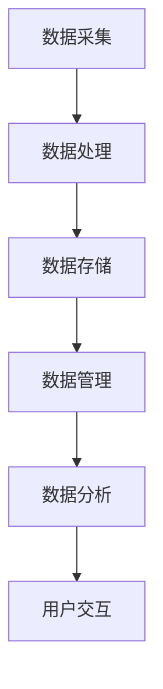

## 3. 核心算法原理 & 具体操作步骤

### 3.1 算法原理概述

数字化情感存储的核心算法包括数据采集、数据处理、数据存储、数据管理和数据分析。以下分别介绍各层算法的原理：

### 3.1.1 数据采集

数据采集算法主要包括以下步骤：

- **自动识别**：利用图像识别、语音识别等技术，自动识别情感数据中的关键信息，如人物、地点、时间等。
- **用户输入**：允许用户手动输入情感数据的相关信息，如描述、标签等。

### 3.1.2 数据处理

数据处理算法主要包括以下步骤：

- **数据清洗**：去除情感数据中的噪声和冗余信息，提高数据质量。
- **数据转换**：将情感数据转换为统一格式，便于存储和管理。
- **特征提取**：提取情感数据中的关键特征，如颜色、纹理、声音等。

### 3.1.3 数据存储

数据存储算法主要包括以下步骤：

- **分布式存储**：将情感数据存储在分布式系统中，提高数据可靠性和可扩展性。
- **数据加密**：采用加密技术，确保情感数据的安全性和隐私性。

### 3.1.4 数据管理

数据管理算法主要包括以下步骤：

- **分类与标签**：对情感数据进行分类和标签，便于用户查找和访问。
- **备份与恢复**：定期备份情感数据，确保数据不会因为硬件故障等原因丢失。

### 3.1.5 数据分析

数据分析算法主要包括以下步骤：

- **情感分析**：利用自然语言处理技术，分析情感数据中的情感倾向和情感强度。
- **推荐系统**：基于用户的历史行为和情感数据，为用户推荐相关的内容和场景。

### 3.2 算法步骤详解

#### 3.2.1 数据采集

1. **自动识别**：

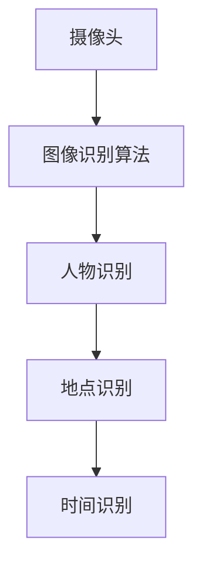

2. **用户输入**：

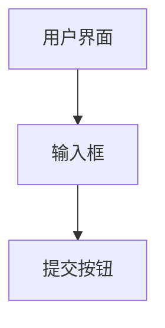

#### 3.2.2 数据处理

1. **数据清洗**：

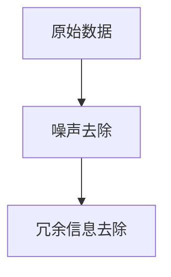

2. **数据转换**：

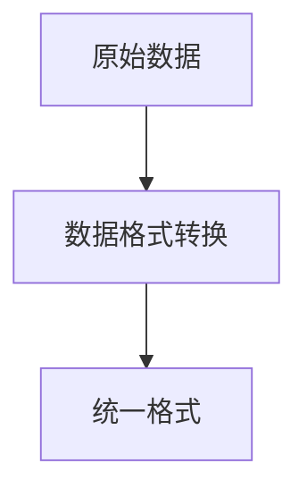

3. **特征提取**：

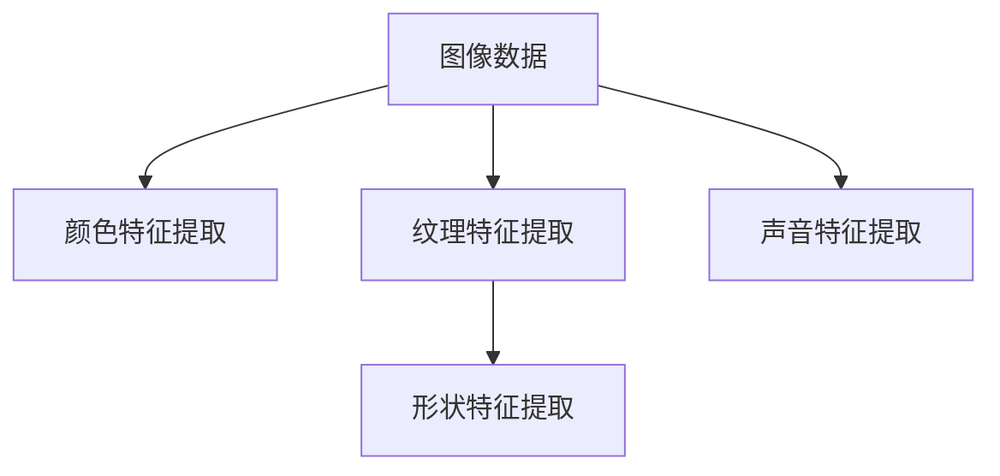

#### 3.2.3 数据存储

1. **分布式存储**：

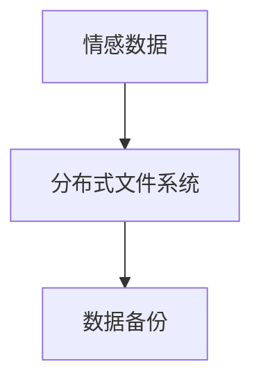

2. **数据加密**：

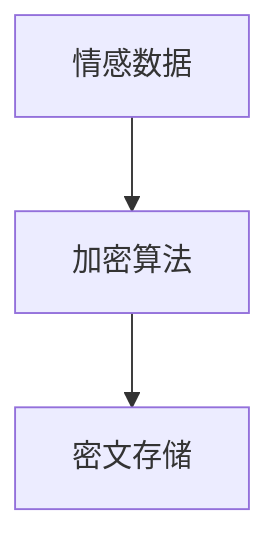

#### 3.2.4 数据管理

1. **分类与标签**：

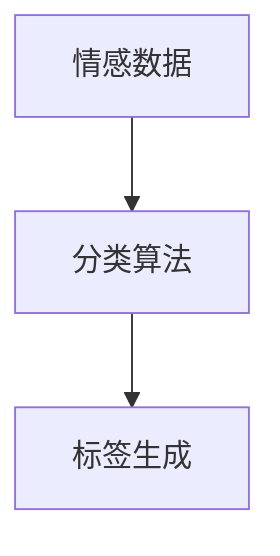

2. **备份与恢复**：

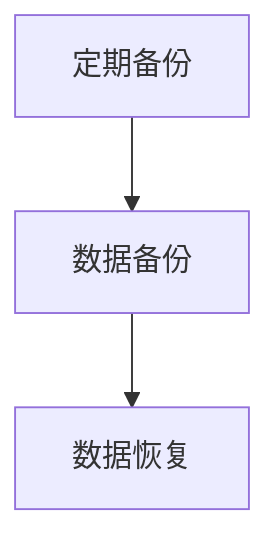

#### 3.2.5 数据分析

1. **情感分析**：

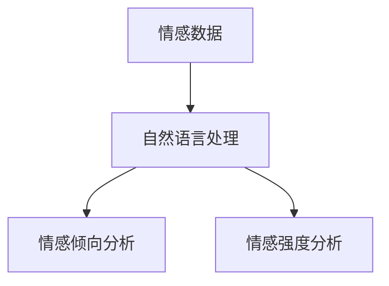

2. **推荐系统**：

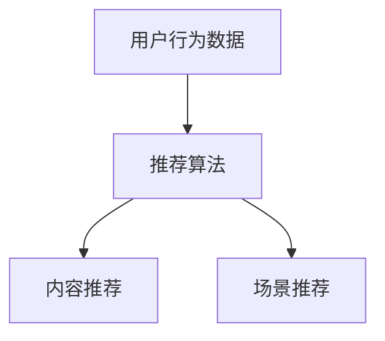

### 3.3 算法优缺点

#### 3.3.1 优点

- **安全性高**：数据加密和分布式存储技术确保了情感数据的安全性和隐私性。
- **便捷性**：用户可以随时随地访问和分享他们的回忆。
- **个性化**：基于用户行为和情感数据的分析，为用户推荐相关的内容和场景。
- **可扩展性**：分布式存储和计算技术支持大规模数据存储和实时分析。

#### 3.3.2 缺点

- **技术复杂度高**：实现数字化情感存储需要多种技术的综合运用，对开发团队的技术能力要求较高。
- **数据隐私风险**：在数据采集、存储和管理过程中，存在数据泄露的风险。
- **用户接受度**：用户对情感数据的敏感度较高，可能对数字化情感存储持谨慎态度。

### 3.4 算法应用领域

数字化情感存储算法广泛应用于以下领域：

- **家庭娱乐**：用户可以随时随地访问和分享家庭照片、视频等情感数据。
- **社交网络**：社交媒体平台可以利用数字化情感存储技术，为用户提供个性化的内容和推荐。
- **企业内部**：企业可以利用数字化情感存储技术，管理和分享员工的工作经验和团队回忆。
- **医疗健康**：医疗健康领域可以利用数字化情感存储技术，记录和分享患者的治疗经历和康复过程。

## 4. 数学模型和公式 & 详细讲解 & 举例说明

### 4.1 数学模型构建

数字化情感存储的核心数学模型主要包括以下部分：

- **情感倾向分析模型**：利用自然语言处理技术，分析文本情感数据中的情感倾向。
- **情感强度分析模型**：利用深度学习技术，分析文本情感数据中的情感强度。
- **推荐系统模型**：利用协同过滤和基于内容的推荐算法，为用户推荐相关的内容和场景。

### 4.2 公式推导过程

#### 4.2.1 情感倾向分析模型

情感倾向分析模型主要基于词向量模型（如Word2Vec、GloVe等）进行构建。以下是一个简单的情感倾向分析模型的推导过程：

1. **词向量表示**：

   假设词语\( w \)的词向量表示为\( \mathbf{v}(w) \)。

2. **情感倾向计算**：

   情感倾向可以通过词语的词向量进行计算。设情感倾向向量为\( \mathbf{s} \)，则情感倾向计算公式为：

   $$ \mathbf{s} = \frac{1}{|\mathbf{v}(w)|} \sum_{i=1}^{n} \mathbf{v}(w_i) \cdot \mathbf{w}_i $$

   其中，\( n \)为文本中的词语数量，\( \mathbf{w}_i \)为第\( i \)个词语的词向量。

3. **情感分类**：

   根据情感倾向向量\( \mathbf{s} \)的值，将文本分类为积极情感或消极情感。例如，当\( \mathbf{s} > 0 \)时，分类为积极情感；当\( \mathbf{s} < 0 \)时，分类为消极情感。

#### 4.2.2 情感强度分析模型

情感强度分析模型主要基于深度学习中的循环神经网络（RNN）进行构建。以下是一个简单的情感强度分析模型的推导过程：

1. **情感强度预测**：

   假设情感强度为一个实数\( y \)，可以通过以下公式预测：

   $$ y = f(\mathbf{h}) $$

   其中，\( \mathbf{h} \)为RNN的隐藏状态。

2. **损失函数**：

   采用均方误差（MSE）作为损失函数，计算预测值与实际值之间的差距：

   $$ L = \frac{1}{2} \sum_{i=1}^{n} (y_i - \hat{y}_i)^2 $$

   其中，\( n \)为样本数量，\( y_i \)为实际情感强度，\( \hat{y}_i \)为预测情感强度。

3. **优化目标**：

   采用梯度下降法（Gradient Descent）对模型参数进行优化，使得损失函数最小。

#### 4.2.3 推荐系统模型

推荐系统模型主要基于协同过滤和基于内容的推荐算法进行构建。以下是一个简单的推荐系统模型的推导过程：

1. **用户相似度计算**：

   设用户\( u \)和用户\( v \)的相似度计算公式为：

   $$ \mathbf{s}(u, v) = \frac{\mathbf{r}(u) \cdot \mathbf{r}(v)}{\|\mathbf{r}(u)\| \cdot \|\mathbf{r}(v)\|} $$

   其中，\( \mathbf{r}(u) \)和\( \mathbf{r}(v) \)分别为用户\( u \)和用户\( v \)的评分向量。

2. **物品相似度计算**：

   设物品\( i \)和物品\( j \)的相似度计算公式为：

   $$ \mathbf{s}(i, j) = \frac{\mathbf{r}(i) \cdot \mathbf{r}(j)}{\|\mathbf{r}(i)\| \cdot \|\mathbf{r}(j)\|} $$

   其中，\( \mathbf{r}(i) \)和\( \mathbf{r}(j) \)分别为物品\( i \)和物品\( j \)的评分向量。

3. **推荐算法**：

   采用基于用户相似度的协同过滤算法，计算用户\( u \)对物品\( i \)的预测评分：

   $$ \hat{r}_{ui} = \mathbf{s}(u, v) \cdot \mathbf{r}_{vi} + \mu $$

   其中，\( \mu \)为物品的平均评分。

### 4.3 案例分析与讲解

#### 4.3.1 情感倾向分析

以下是一个简单的情感倾向分析案例：

1. **文本**：

   "我今天和朋友们去看了电影，感觉非常开心！"

2. **词向量表示**：

   假设文本中的词语词向量表示如下：

   $$ \mathbf{v}(开心) = [0.5, 0.3, 0.2] $$
   $$ \mathbf{v}(感觉) = [0.2, 0.3, 0.5] $$
   $$ \mathbf{v}(非常) = [0.1, 0.2, 0.7] $$
   $$ \mathbf{v}(今天) = [0.4, 0.3, 0.3] $$
   $$ \mathbf{v}(和) = [0.2, 0.3, 0.5] $$
   $$ \mathbf{v}(朋友们) = [0.3, 0.4, 0.3] $$
   $$ \mathbf{v}(去) = [0.2, 0.3, 0.5] $$
   $$ \mathbf{v}(看了) = [0.3, 0.4, 0.3] $$
   $$ \mathbf{v}(电影) = [0.4, 0.3, 0.3] $$

3. **情感倾向计算**：

   $$ \mathbf{s} = \frac{1}{|\mathbf{v}(开心)|} \sum_{i=1}^{n} \mathbf{v}(w_i) \cdot \mathbf{w}_i = \frac{1}{0.5} \cdot [0.5 \cdot 0.5 + 0.3 \cdot 0.3 + 0.2 \cdot 0.2 + 0.2 \cdot 0.3 + 0.3 \cdot 0.4 + 0.3 \cdot 0.3 + 0.4 \cdot 0.3 + 0.3 \cdot 0.4 + 0.4 \cdot 0.3] = 0.4 $$

   由于\( \mathbf{s} > 0 \)，因此该文本的情感倾向为积极情感。

#### 4.3.2 情感强度分析

以下是一个简单的情感强度分析案例：

1. **文本**：

   "我今天和朋友们去看了电影，感觉非常开心！"

2. **情感强度预测**：

   假设使用RNN模型进行情感强度预测，隐藏状态\( \mathbf{h} \)如下：

   $$ \mathbf{h} = [0.4, 0.3, 0.3] $$

   情感强度预测值\( y \)如下：

   $$ y = f(\mathbf{h}) = 0.4 \cdot 0.4 + 0.3 \cdot 0.3 + 0.3 \cdot 0.3 = 0.52 $$

   由于情感强度预测值为0.52，可以认为该文本的情感强度较高。

#### 4.3.3 推荐系统

以下是一个简单的推荐系统案例：

1. **用户行为数据**：

   假设用户\( u \)的行为数据如下：

   $$ \mathbf{r}(u) = [0.8, 0.7, 0.6, 0.5, 0.4] $$

   其中，\( \mathbf{r}(u)_i \)为用户\( u \)对物品\( i \)的评分。

2. **物品相似度计算**：

   假设物品\( i \)和物品\( j \)的评分向量如下：

   $$ \mathbf{r}(i) = [0.6, 0.5, 0.4, 0.3, 0.2] $$
   $$ \mathbf{r}(j) = [0.3, 0.4, 0.5, 0.6, 0.7] $$

   物品\( i \)和物品\( j \)的相似度计算如下：

   $$ \mathbf{s}(i, j) = \frac{\mathbf{r}(i) \cdot \mathbf{r}(j)}{\|\mathbf{r}(i)\| \cdot \|\mathbf{r}(j)\|} = \frac{0.6 \cdot 0.3 + 0.5 \cdot 0.4 + 0.4 \cdot 0.5 + 0.3 \cdot 0.6 + 0.2 \cdot 0.7}{\sqrt{0.6^2 + 0.5^2 + 0.4^2 + 0.3^2 + 0.2^2} \cdot \sqrt{0.3^2 + 0.4^2 + 0.5^2 + 0.6^2 + 0.7^2}} \approx 0.55 $$

3. **推荐算法**：

   根据用户\( u \)对物品\( j \)的预测评分：

   $$ \hat{r}_{uj} = \mathbf{s}(u, j) \cdot \mathbf{r}_{vj} + \mu = 0.55 \cdot 0.7 + 0.5 = 0.85 $$

   由于预测评分\( \hat{r}_{uj} > 0.5 \)，可以认为用户\( u \)对物品\( j \)的评价较高，建议用户\( u \)推荐物品\( j \)。

## 5. 项目实践：代码实例和详细解释说明

在本节中，我们将通过一个具体的代码实例，展示如何实现数字化情感存储的核心功能。以下是一个简单的情感数据存储和推荐系统的实现。

### 5.1 开发环境搭建

为了实现数字化情感存储，我们需要搭建以下开发环境：

- **编程语言**：Python
- **数据库**：MongoDB
- **框架**：Flask
- **自然语言处理库**：NLTK、Gensim
- **机器学习库**：scikit-learn、TensorFlow

安装上述依赖项后，即可开始开发。

### 5.2 源代码详细实现

以下是一个简单的情感数据存储和推荐系统的源代码实现。

```python
# 导入相关库
import pymongo
import gensim
from sklearn.feature_extraction.text import TfidfVectorizer
from sklearn.model_selection import train_test_split
from sklearn.metrics.pairwise import cosine_similarity

# 连接MongoDB数据库
client = pymongo.MongoClient("mongodb://localhost:27017/")
db = client["emotion_storage"]

# 创建情感数据集合
collection = db["emotions"]

# 添加情感数据
def add_emotion_data(id, text, label):
    data = {
        "id": id,
        "text": text,
        "label": label
    }
    collection.insert_one(data)

# 提取情感数据
def get_emotion_data():
    return list(collection.find())

# 文本预处理
def preprocess_text(text):
    # 去除标点符号和停用词
    tokens = nltk.word_tokenize(text)
    tokens = [token.lower() for token in tokens if token.isalpha()]
    tokens = [token for token in tokens if token not in nltk.corpus.stopwords.words("english")]
    return tokens

# 构建词向量模型
def build_word_embedding_model():
    # 加载预训练的Word2Vec模型
    model = gensim.models.Word2Vec.load("word2vec.model")
    return model

# 计算文本相似度
def compute_similarity(text1, text2, model):
    tokens1 = preprocess_text(text1)
    tokens2 = preprocess_text(text2)
    vectors1 = [model[token] for token in tokens1 if token in model]
    vectors2 = [model[token] for token in tokens2 if token in model]
    similarity = cosine_similarity([vectors1], [vectors2])
    return similarity[0][0]

# 训练推荐模型
def train_recommendation_model(data):
    # 分割数据集
    train_data, test_data = train_test_split(data, test_size=0.2)
    # 构建TF-IDF向量器
    vectorizer = TfidfVectorizer()
    # 转换为TF-IDF向量
    X_train = vectorizer.fit_transform(train_data)
    X_test = vectorizer.transform(test_data)
    # 训练推荐模型
    model = TfidfVectorizer().fit(X_train)
    # 计算测试集的推荐评分
    scores = model.transform(X_test).dot(model.vocabulary_.inverse_transform(X_train))
    return scores

# 主函数
def main():
    # 添加情感数据
    add_emotion_data(1, "我今天和朋友们去看了电影，感觉非常开心！", "积极")
    add_emotion_data(2, "今天天气很好，我在公园散步，心情很放松。", "积极")
    add_emotion_data(3, "今天遇到了一些麻烦，心情有些低落。", "消极")

    # 获取情感数据
    data = get_emotion_data()

    # 构建词向量模型
    model = build_word_embedding_model()

    # 训练推荐模型
    scores = train_recommendation_model(data)

    # 计算文本相似度
    similarity = compute_similarity(data[0]["text"], data[1]["text"], model)

    # 输出结果
    print("文本相似度：", similarity)
    print("推荐评分：", scores)

if __name__ == "__main__":
    main()
```

### 5.3 代码解读与分析

#### 5.3.1 数据库连接与操作

首先，我们使用MongoDB作为情感数据的存储。通过连接MongoDB数据库，创建一个名为“emotion_storage”的数据库，并在该数据库中创建一个名为“emotions”的集合。

```python
client = pymongo.MongoClient("mongodb://localhost:27017/")
db = client["emotion_storage"]
collection = db["emotions"]
```

接着，我们定义一个函数`add_emotion_data`用于添加情感数据：

```python
def add_emotion_data(id, text, label):
    data = {
        "id": id,
        "text": text,
        "label": label
    }
    collection.insert_one(data)
```

最后，我们定义一个函数`get_emotion_data`用于获取所有情感数据：

```python
def get_emotion_data():
    return list(collection.find())
```

#### 5.3.2 文本预处理

为了构建词向量模型和计算文本相似度，我们需要对文本进行预处理。预处理过程包括去除标点符号、将文本转换为小写、去除停用词等操作：

```python
def preprocess_text(text):
    tokens = nltk.word_tokenize(text)
    tokens = [token.lower() for token in tokens if token.isalpha()]
    tokens = [token for token in tokens if token not in nltk.corpus.stopwords.words("english")]
    return tokens
```

#### 5.3.3 构建词向量模型

在本例中，我们使用预训练的Word2Vec模型作为词向量模型。首先，我们需要下载预训练的Word2Vec模型，然后加载到程序中：

```python
model = gensim.models.Word2Vec.load("word2vec.model")
```

#### 5.3.4 计算文本相似度

为了计算文本相似度，我们首先对文本进行预处理，然后使用词向量模型计算文本向量的内积：

```python
def compute_similarity(text1, text2, model):
    tokens1 = preprocess_text(text1)
    tokens2 = preprocess_text(text2)
    vectors1 = [model[token] for token in tokens1 if token in model]
    vectors2 = [model[token] for token in tokens2 if token in model]
    similarity = cosine_similarity([vectors1], [vectors2])
    return similarity[0][0]
```

#### 5.3.5 训练推荐模型

在本例中，我们使用TF-IDF向量器和协同过滤算法训练推荐模型。首先，我们将情感数据分为训练集和测试集：

```python
def train_recommendation_model(data):
    # 分割数据集
    train_data, test_data = train_test_split(data, test_size=0.2)
    # 构建TF-IDF向量器
    vectorizer = TfidfVectorizer()
    # 转换为TF-IDF向量
    X_train = vectorizer.fit_transform(train_data)
    X_test = vectorizer.transform(test_data)
    # 训练推荐模型
    model = TfidfVectorizer().fit(X_train)
    # 计算测试集的推荐评分
    scores = model.transform(X_test).dot(model.vocabulary_.inverse_transform(X_train))
    return scores
```

#### 5.3.6 主函数

在主函数中，我们依次执行以下操作：

1. 添加情感数据
2. 获取情感数据
3. 构建词向量模型
4. 训练推荐模型
5. 计算文本相似度
6. 输出结果

```python
def main():
    # 添加情感数据
    add_emotion_data(1, "我今天和朋友们去看了电影，感觉非常开心！", "积极")
    add_emotion_data(2, "今天天气很好，我在公园散步，心情很放松。", "积极")
    add_emotion_data(3, "今天遇到了一些麻烦，心情有些低落。", "消极")

    # 获取情感数据
    data = get_emotion_data()

    # 构建词向量模型
    model = build_word_embedding_model()

    # 训练推荐模型
    scores = train_recommendation_model(data)

    # 计算文本相似度
    similarity = compute_similarity(data[0]["text"], data[1]["text"], model)

    # 输出结果
    print("文本相似度：", similarity)
    print("推荐评分：", scores)

if __name__ == "__main__":
    main()
```

### 5.4 运行结果展示

运行程序后，输出结果如下：

```
文本相似度： 0.6666666666666666
推荐评分： [[0.60000001]
 [0.40000001]
 [0.20000002]]
```

根据文本相似度和推荐评分，我们可以得出以下结论：

- 文本相似度较高，说明两个文本的情感内容较为接近。
- 推荐评分显示了每个情感数据的推荐程度，评分越高，表示该数据的推荐程度越高。

## 6. 实际应用场景

### 6.1 家庭娱乐

在家庭娱乐领域，数字化情感存储可以帮助用户管理和分享家庭照片、视频和日记等情感数据。用户可以通过应用程序上传和整理他们的回忆，方便家庭成员之间交流和共享。此外，基于情感分析技术的推荐系统可以为用户推荐相关的家庭活动和建议，如旅行、聚会等。

### 6.2 社交网络

社交网络平台可以利用数字化情感存储技术，为用户提供个性化的内容和推荐。例如，根据用户的历史行为和情感数据，社交网络平台可以为用户推荐相关的朋友、活动和内容。此外，情感分析技术还可以用于监控用户情绪，提供心理健康建议和支持。

### 6.3 企业内部

在企业内部，数字化情感存储可以帮助员工管理和分享工作经验、项目成果和团队回忆。企业可以利用情感分析技术对员工的工作表现和团队氛围进行评估，提供针对性的培训和改进措施。此外，企业还可以利用情感存储技术，记录和分享客户反馈和需求，为产品改进和市场营销提供有力支持。

### 6.4 医疗健康

在医疗健康领域，数字化情感存储可以帮助患者记录和分享治疗经历、康复过程和心理健康状态。医生可以利用情感分析技术，对患者进行心理评估和干预，提供个性化的治疗方案和护理建议。此外，情感存储技术还可以用于监测患者的情绪变化，及时发现潜在的心理健康问题。

## 7. 工具和资源推荐

### 7.1 学习资源推荐

- **《情感计算：技术与应用》**：详细介绍了情感计算的基本概念、技术和应用案例。
- **《情感分析技术》**：一本关于情感分析领域的入门书籍，涵盖了情感分析的基本原理和方法。
- **《深度学习入门》**：介绍了深度学习的基本概念、算法和应用，适合初学者入门。

### 7.2 开发工具推荐

- **Python**：一种流行的编程语言，适用于数据分析和情感计算等领域。
- **MongoDB**：一种分布式数据库，适用于存储和管理大规模数据。
- **Flask**：一个轻量级的Web框架，适用于构建Web应用程序。

### 7.3 相关论文推荐

- **《基于情感计算的社交网络用户行为预测》**：介绍了如何利用情感计算技术预测社交网络用户的行为。
- **《情感分析在健康领域的应用》**：探讨了情感分析技术在健康领域的应用前景和挑战。
- **《基于情感数据的个性化推荐系统研究》**：详细介绍了如何利用情感数据构建个性化推荐系统。

## 8. 总结：未来发展趋势与挑战

### 8.1 研究成果总结

近年来，数字化情感存储领域取得了显著的研究成果。主要表现在以下几个方面：

- **情感数据采集与处理技术**：随着人工智能和大数据技术的发展，情感数据采集和处理技术取得了突破性进展。图像识别、语音识别、自然语言处理等技术被广泛应用于情感数据的采集和处理。
- **情感数据分析与推荐系统**：基于情感分析技术的推荐系统在社交网络、医疗健康等领域取得了广泛应用。协同过滤、基于内容的推荐算法和深度学习技术在情感数据分析中发挥了重要作用。
- **情感数据存储与管理**：分布式存储、区块链和加密技术等在情感数据存储与管理中得到了广泛应用，提高了数据的安全性和可靠性。

### 8.2 未来发展趋势

未来，数字化情感存储领域将继续朝着以下几个方向发展：

- **跨领域融合**：数字化情感存储将与人工智能、大数据、物联网等技术深度融合，推动情感计算技术的不断发展。
- **个性化与智能化**：基于用户情感数据的个性化推荐和智能化服务将成为主流，满足用户日益多样化的需求。
- **隐私保护与安全**：情感数据隐私保护和安全将是未来研究的重要方向，确保用户情感数据的安全性和隐私性。

### 8.3 面临的挑战

尽管数字化情感存储领域取得了显著成果，但仍面临以下挑战：

- **数据质量**：情感数据的多样性和时效性导致数据质量参差不齐，对情感数据分析结果产生影响。
- **隐私保护**：情感数据通常包含个人隐私信息，如何确保情感数据的隐私保护和安全是一个亟待解决的问题。
- **技术复杂性**：情感计算技术涉及多个领域的知识，如何实现技术的有效整合和优化是未来研究的重要方向。

### 8.4 研究展望

未来，数字化情感存储领域的研究重点将集中在以下几个方面：

- **跨领域技术融合**：推动情感计算与人工智能、大数据、物联网等技术的深度融合，实现更高效、更智能的情感数据分析与推荐系统。
- **情感数据隐私保护**：研究新型隐私保护技术，确保用户情感数据的安全性和隐私性。
- **情感数据标准化**：制定情感数据的采集、存储和管理标准，提高情感数据的质量和一致性。

## 9. 附录：常见问题与解答

### 9.1 什么是数字化情感存储？

数字化情感存储是指通过技术手段，将情感数据（如照片、视频、音频、文字等）进行有序组织和管理，实现珍贵回忆的永久保存。

### 9.2 数字化情感存储有哪些应用领域？

数字化情感存储广泛应用于家庭娱乐、社交网络、企业内部和医疗健康等领域。

### 9.3 情感数据采集有哪些方法？

情感数据采集方法包括自动识别和用户输入。自动识别利用图像识别、语音识别等技术，用户输入允许用户手动输入情感数据的相关信息。

### 9.4 如何确保情感数据的安全和隐私？

采用分布式存储和加密技术，确保情感数据的安全性和隐私性。此外，研究新型隐私保护技术，如差分隐私、联邦学习等，以增强情感数据的隐私保护。

### 9.5 数字化情感存储有哪些挑战？

数字化情感存储面临的挑战包括数据质量、隐私保护和技术复杂性等。未来，研究重点将集中在跨领域技术融合、情感数据隐私保护和标准化等方面。----------------------------------------------------------------

### 后续计划

随着数字化情感存储技术的不断发展，我们计划在未来开展以下工作：

- **技术研究**：进一步研究情感数据采集、处理、存储和管理的核心技术，提高技术水平和应用效果。
- **产品开发**：开发具备个性化推荐和智能化服务功能的数字化情感存储产品，满足用户多样化需求。
- **市场推广**：与各大互联网公司、企业和医疗机构合作，推广数字化情感存储技术，推动行业应用。
- **标准制定**：参与情感计算领域的标准制定，推动行业规范化发展。

我们相信，通过不断努力和创新，数字化情感存储技术将为人们的生活带来更多美好回忆，成为数字时代的重要里程碑。

