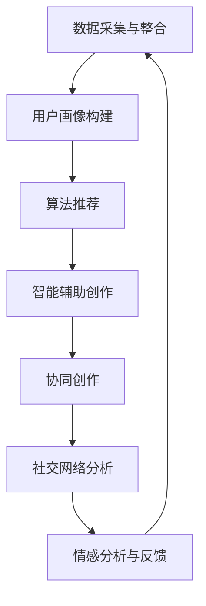

                 

### 摘要 Abstract

在数字化时代，想象力成为了创新的核心驱动力。本文旨在探讨如何通过人工智能（AI）技术设计和创建一个“数字化想象力培养皿”，从而激发创意思维，孵化创新成果。文章首先介绍了想象力在创新中的重要性，随后阐述了AI技术在这一领域中的应用潜力。接着，文章深入探讨了核心概念、算法原理、数学模型，并通过项目实践展示了AI激发创意思维的具体应用。最后，文章展望了AI在未来激发创意思维领域的应用前景，并提出了面临的挑战和未来的研究方向。

## 1. 背景介绍

### 想象力的本质

想象力是人类认知活动中至关重要的一部分。它不仅关乎个体的创造力和创新力，更是人类社会进步的源泉。著名心理学家詹姆斯·吉布森（James Gibson）指出，想象力是一种“构想过去、现在和未来事物能力”的认知过程，它是人类对现实世界的超越与扩展。想象力使得人类能够预判未来、探索未知的领域，从而推动科技的发展和社会的进步。

### 创意思维的重要性

在当今高度竞争和快速变化的时代，创意思维成为了企业和个人成功的关键因素。创意思维不仅能够带来新的产品和服务，还能够开拓新的市场和商业模式。哈佛商学院教授克里斯·贝利（Chris Berry）指出，创意思维是“将不同领域的知识、技能和观点相结合，创造出新颖且有价值的结果的能力”。随着科技的不断进步，创意思维的重要性愈发凸显。

### AI在创意思维中的应用

随着人工智能技术的迅猛发展，AI在激发创意思维中的应用逐渐成为热点。AI能够通过数据分析和模式识别，发现人类未曾注意到的关联和规律，从而启发新的创意点。此外，AI还可以通过生成对抗网络（GAN）、深度学习和自然语言处理等技术，创造全新的内容和形式，激发人类想象力。AI技术为创意思维带来了新的工具和方法，使得创意过程更加高效和多样化。

## 2. 核心概念与联系

为了更好地理解如何利用AI设计“数字化想象力培养皿”，我们需要介绍几个核心概念，并探讨它们之间的联系。

### 数字化想象力培养皿的定义

数字化想象力培养皿是一个虚拟环境，它利用人工智能技术来激发和培养用户的创造力。这个培养皿可以通过以下方式实现：

1. **数据采集与整合**：通过收集用户的行为数据、兴趣爱好、创造作品等，构建个性化的用户画像。
2. **算法推荐**：利用机器学习算法，根据用户画像推荐相关的创意素材、灵感来源和参考案例。
3. **协同创作**：提供多人协作工具，使用户能够实时分享和交流创意，相互启发和促进。
4. **智能反馈**：通过自然语言处理和情感分析技术，为用户的作品提供即时反馈和建议。

### AI技术在培养皿中的应用

在数字化想象力培养皿中，AI技术扮演着至关重要的角色。具体应用包括：

1. **个性化推荐系统**：通过深度学习算法，分析用户的创作历史和偏好，提供个性化的创意素材和灵感推荐。
2. **智能辅助创作**：利用生成对抗网络（GAN）和深度学习技术，辅助用户生成新的艺术作品、音乐和其他形式的创意内容。
3. **情感分析与反馈**：通过自然语言处理和情感分析技术，分析用户作品的情感色彩，提供创作上的建议和反馈。
4. **社交网络分析**：利用社交网络分析技术，发现用户之间的创意交流和合作机会，促进创意的碰撞和融合。

### 概念之间的联系

数字化想象力培养皿通过整合数据、算法推荐、协同创作和智能反馈等核心概念，构建了一个完整的创意生态系统。这些概念相互关联，共同作用，使得培养皿能够高效地激发和培养用户的想象力。具体而言：

- **数据采集与整合**为培养皿提供了个性化的用户画像，为后续的算法推荐和智能反馈提供了基础。
- **算法推荐**和**智能辅助创作**通过分析用户数据，为用户提供了个性化的创意素材和工具，使用户能够更轻松地展开创意工作。
- **协同创作**和**社交网络分析**则促进了用户之间的互动和合作，进一步激发了创意思维。

通过这些核心概念的相互联系，数字化想象力培养皿能够为用户创造一个充满活力和创新氛围的虚拟空间。

### 2.1 核心概念原理和架构的 Mermaid 流程图

以下是一个用于展示数字化想象力培养皿核心概念原理和架构的Mermaid流程图。请注意，流程节点中避免使用括号、逗号等特殊字符。



通过这个流程图，我们可以清晰地看到数字化想象力培养皿中各个核心概念之间的相互作用和连接，这有助于读者更好地理解培养皿的工作原理和整体架构。

## 3. 核心算法原理 & 具体操作步骤

### 3.1 算法原理概述

数字化想象力培养皿的核心在于其算法原理，这些算法包括个性化推荐系统、生成对抗网络（GAN）、自然语言处理和社交网络分析等。以下是这些算法的基本原理概述：

#### 个性化推荐系统

个性化推荐系统利用机器学习算法分析用户的历史行为和偏好，从而提供个性化的推荐。它主要包括以下步骤：

1. **数据采集**：收集用户的行为数据，如浏览记录、购买历史、评论等。
2. **用户画像构建**：通过数据挖掘技术，将用户行为转化为用户画像。
3. **推荐算法**：利用协同过滤、矩阵分解等算法，根据用户画像生成推荐列表。

#### 生成对抗网络（GAN）

生成对抗网络（GAN）是一种深度学习模型，由生成器和判别器组成。生成器的目标是生成逼真的数据，判别器的目标是区分生成数据和真实数据。通过这两者的对抗训练，GAN能够生成高质量的创意内容。其主要步骤包括：

1. **数据准备**：准备大量的训练数据，如艺术作品、音乐片段等。
2. **模型训练**：生成器和判别器交替训练，使生成器生成更逼真的数据。
3. **内容生成**：利用训练好的生成器，生成新的创意内容。

#### 自然语言处理

自然语言处理（NLP）技术用于分析用户作品中的情感、主题和风格，从而提供创作上的反馈和建议。其主要步骤包括：

1. **文本分析**：使用分词、词性标注等技术，对文本进行预处理。
2. **情感分析**：通过情感词典、机器学习模型等，分析文本的情感色彩。
3. **风格识别**：利用主题模型、生成模型等，识别文本的风格。

#### 社交网络分析

社交网络分析（SNA）技术用于发现用户之间的互动和合作机会，促进创意的碰撞和融合。其主要步骤包括：

1. **网络构建**：根据用户的行为数据，构建用户之间的社交网络。
2. **互动分析**：通过网络分析技术，分析用户之间的互动模式和关系。
3. **合作推荐**：根据互动分析结果，推荐合适的合作对象和项目。

### 3.2 算法步骤详解

#### 个性化推荐系统

1. **数据采集**：
    - 收集用户在数字化想象力培养皿中的行为数据，如浏览记录、评论、点赞等。
2. **用户画像构建**：
    - 通过聚类、关联规则挖掘等技术，将用户行为转化为用户画像。
    - 画像包括兴趣标签、行为偏好、情感特征等。
3. **推荐算法**：
    - 使用协同过滤算法，根据用户的历史行为和偏好，生成推荐列表。
    - 使用矩阵分解技术，对用户-物品矩阵进行分解，得到用户兴趣向量。

#### 生成对抗网络（GAN）

1. **数据准备**：
    - 准备大量的艺术作品、音乐片段等数据，用于训练生成器和判别器。
2. **模型训练**：
    - 生成器生成假的艺术作品或音乐片段，判别器判断生成数据和真实数据。
    - 生成器和判别器交替训练，使生成器生成更逼真的数据。
3. **内容生成**：
    - 使用训练好的生成器，生成新的创意内容，如艺术作品、音乐等。

#### 自然语言处理

1. **文本分析**：
    - 使用分词、词性标注等技术，对文本进行预处理。
    - 对预处理后的文本进行情感分析，判断文本的情感色彩。
2. **情感分析**：
    - 使用情感词典、机器学习模型等，分析文本的情感色彩。
    - 将情感分析结果反馈给用户，提供创作上的建议。
3. **风格识别**：
    - 使用主题模型、生成模型等，识别文本的风格。
    - 根据识别结果，提供风格上的建议和参考。

#### 社交网络分析

1. **网络构建**：
    - 根据用户在数字化想象力培养皿中的互动数据，构建用户之间的社交网络。
    - 使用图论算法，分析用户之间的互动模式和关系。
2. **互动分析**：
    - 分析用户之间的互动模式，如合作频率、互动强度等。
    - 根据互动分析结果，推荐合适的合作对象和项目。
3. **合作推荐**：
    - 根据社交网络分析结果，为用户推荐合适的合作对象和项目。

### 3.3 算法优缺点

#### 个性化推荐系统

**优点**：
- 能为用户提供个性化的推荐，提高用户满意度。
- 能有效发现用户的潜在兴趣和需求。

**缺点**：
- 需要大量的用户行为数据进行训练，对数据质量要求高。
- 在新用户或冷启动用户上表现不佳。

#### 生成对抗网络（GAN）

**优点**：
- 能生成高质量的创意内容，丰富用户的创作素材。
- 能激发用户的创作灵感，提高创意思维。

**缺点**：
- 训练过程复杂，需要大量的计算资源和时间。
- 生成的内容有时可能过于逼真，难以判断其真实性和原创性。

#### 自然语言处理

**优点**：
- 能为用户提供即时反馈和建议，提高创作效率。
- 能识别文本的情感和风格，提供更有针对性的建议。

**缺点**：
- 对文本理解能力有限，难以处理复杂的语义和情感。
- 需要大量的标注数据进行训练，对数据质量要求高。

#### 社交网络分析

**优点**：
- 能发现用户之间的互动和合作机会，促进创意的碰撞和融合。
- 能为用户提供有价值的社交网络信息，如潜在合作伙伴。

**缺点**：
- 对社交网络数据的依赖性强，数据处理难度大。
- 分析结果可能受到社交网络结构的影响，存在偏差。

### 3.4 算法应用领域

#### 个性化推荐系统

- **电子商务**：为用户推荐商品、服务，提高用户购买体验。
- **内容推荐**：为用户提供个性化的新闻、音乐、视频等，提升用户体验。

#### 生成对抗网络（GAN）

- **艺术创作**：生成新的艺术作品、音乐等，激发创作灵感。
- **游戏开发**：生成游戏场景、角色等，提升游戏体验。

#### 自然语言处理

- **智能客服**：为用户提供智能化的问答服务，提升客服效率。
- **文本审核**：自动识别和过滤不良信息，保障网络环境。

#### 社交网络分析

- **社交网络营销**：为用户提供有价值的社交网络信息，提高营销效果。
- **社交媒体分析**：分析用户行为和互动模式，为企业提供决策支持。

## 4. 数学模型和公式 & 详细讲解 & 举例说明

### 4.1 数学模型构建

在数字化想象力培养皿中，数学模型的使用至关重要。以下是几个核心的数学模型及其构建过程：

#### 用户画像构建

用户画像构建通常采用聚类算法，如K-means。假设我们有一个包含用户行为特征的矩阵$X$，每个用户的行为特征由$d$个维度组成。

$$
X = \begin{bmatrix}
x_{11} & x_{12} & \cdots & x_{1d} \\
x_{21} & x_{22} & \cdots & x_{2d} \\
\vdots & \vdots & \ddots & \vdots \\
x_{m1} & x_{m2} & \cdots & x_{md}
\end{bmatrix}
$$

其中，$x_{ij}$表示第$i$个用户的第$j$个行为特征。通过K-means算法，我们可以将用户分为$k$个簇，每个簇代表一种用户画像。

$$
\min_{\mu_1, \mu_2, \ldots, \mu_k} \sum_{i=1}^m \sum_{j=1}^k (x_i - \mu_j)^2
$$

其中，$\mu_j$表示第$j$个簇的中心。

#### 个性化推荐

个性化推荐通常采用矩阵分解技术。给定用户-物品评分矩阵$R$，其中$r_{ij}$表示用户$i$对物品$j$的评分。

$$
R = \begin{bmatrix}
r_{11} & r_{12} & \cdots & r_{1n} \\
r_{21} & r_{22} & \cdots & r_{2n} \\
\vdots & \vdots & \ddots & \vdots \\
r_{m1} & r_{m2} & \cdots & r_{mn}
\end{bmatrix}
$$

矩阵分解的目标是找到两个低秩矩阵$U$和$V$，使得$R \approx UV^T$。这里$u_i$表示用户$i$的特征向量，$v_j$表示物品$j$的特征向量。

$$
\min_{U, V} \sum_{i=1}^m \sum_{j=1}^n (r_{ij} - u_i^T v_j)^2
$$

#### 生成对抗网络（GAN）

生成对抗网络（GAN）由生成器$G$和判别器$D$组成。生成器的目标是生成逼真的数据，判别器的目标是区分生成数据和真实数据。

对于生成器$G$，我们有：

$$
x_g = G(z)
$$

其中，$x_g$是生成数据，$z$是随机噪声向量。

对于判别器$D$，我们有：

$$
D(x_r) = \frac{1}{2} \log(D(x_r)) + \frac{1}{2} \log(1 - D(x_g))
$$

其中，$x_r$是真实数据。

#### 社交网络分析

社交网络分析通常采用图论中的网络分析方法。给定用户之间的社交网络图$G = (V, E)$，其中$V$是用户集合，$E$是用户之间的边集合。

度中心性（Degree Centrality）是衡量用户在网络中的重要性的一个指标：

$$
C_d(i) = \frac{\sum_{j \in N(i)} 1}{N - 1}
$$

其中，$N(i)$是节点$i$的邻接节点集合，$N$是网络中的节点总数。

### 4.2 公式推导过程

#### 用户画像构建

假设我们有$k$个簇，每个簇由$m_i$个用户组成。我们定义每个簇的中心为$\mu_j$，则有：

$$
\mu_j = \frac{1}{m_j} \sum_{i=1}^{m_j} x_i
$$

将用户数据矩阵$X$分解为簇数据矩阵$X_j$，则有：

$$
X_j = \begin{bmatrix}
x_{j1} \\
x_{j2} \\
\vdots \\
x_{jm_j}
\end{bmatrix}
$$

那么，目标函数可以表示为：

$$
J = \sum_{j=1}^k \sum_{i=1}^{m_j} (x_i - \mu_j)^2
$$

对$\mu_j$求导并令其等于0，可以得到：

$$
\frac{\partial J}{\partial \mu_j} = \sum_{i=1}^{m_j} (x_i - \mu_j) = 0
$$

$$
\mu_j = \frac{1}{m_j} \sum_{i=1}^{m_j} x_i
$$

#### 个性化推荐

假设用户$i$对物品$j$的预测评分为$\hat{r}_{ij}$，则有：

$$
\hat{r}_{ij} = u_i^T v_j
$$

对$u_i$和$v_j$求导并令其等于0，可以得到：

$$
\frac{\partial \hat{r}_{ij}}{\partial u_i} = v_j = 0
$$

$$
\frac{\partial \hat{r}_{ij}}{\partial v_j} = u_i = 0
$$

这意味着我们只需要对$U$和$V$进行交替训练，直到目标函数收敛。

#### 生成对抗网络（GAN）

对于生成器$G$，我们有：

$$
\frac{\partial D(x_r)}{\partial x_g} = \frac{1}{2} \frac{\partial}{\partial x_g} \log(D(x_g))
$$

$$
\frac{\partial D(x_r)}{\partial x_g} = \frac{D(x_g)}{x_g}
$$

对于判别器$D$，我们有：

$$
\frac{\partial D(x_r)}{\partial x_g} = \frac{1}{2} \frac{\partial}{\partial x_g} \log(1 - D(x_g))
$$

$$
\frac{\partial D(x_r)}{\partial x_g} = -\frac{1}{1 - D(x_g)}
$$

#### 社交网络分析

对于度中心性$C_d(i)$，我们有：

$$
\frac{\partial C_d(i)}{\partial x_{ij}} = \frac{1}{N - 1} \cdot \begin{cases}
1, & \text{如果 } j \in N(i) \\
0, & \text{否则}
\end{cases}
$$

### 4.3 案例分析与讲解

#### 用户画像构建

假设我们有一个包含100个用户的数据集，每个用户有10个行为特征。使用K-means算法，我们将用户分为5个簇。

1. **数据预处理**：对行为特征进行归一化处理，使得每个特征的值都在0到1之间。
2. **初始化聚类中心**：随机选择5个用户作为初始聚类中心。
3. **迭代计算**：不断更新聚类中心，直到聚类中心不再发生显著变化。

最终，我们得到5个聚类中心，每个中心代表了不同用户画像的特征。

#### 个性化推荐

假设我们有一个包含1000个物品和100个用户的评分数据集。使用矩阵分解技术，我们将评分数据分解为两个低秩矩阵。

1. **初始化矩阵**：随机初始化用户特征矩阵$U$和物品特征矩阵$V$。
2. **优化目标**：最小化预测误差$\sum_{i=1}^m \sum_{j=1}^n (r_{ij} - u_i^T v_j)^2$。
3. **交替训练**：交替更新$U$和$V$，直到目标函数收敛。

最终，我们得到用户特征矩阵$U$和物品特征矩阵$V$，可以根据用户特征矩阵和物品特征矩阵生成预测评分。

#### 生成对抗网络（GAN）

假设我们有一个包含1000个真实艺术作品和1000个生成艺术作品的数据集。使用GAN技术，我们生成新的艺术作品。

1. **初始化生成器和判别器**：随机初始化生成器$G$和判别器$D$。
2. **对抗训练**：交替更新生成器和判别器，使得生成器生成的艺术作品越来越逼真。
3. **生成艺术作品**：使用训练好的生成器生成新的艺术作品。

#### 社交网络分析

假设我们有一个包含100个用户的社交网络图，每个用户与其他用户的互动情况记录在边集合中。

1. **构建社交网络图**：根据用户互动数据构建无向图。
2. **计算度中心性**：计算每个用户的度中心性，以衡量用户在网络中的重要性。
3. **推荐合作对象**：根据度中心性推荐与其他用户互动频繁的用户作为合作对象。

## 5. 项目实践：代码实例和详细解释说明

### 5.1 开发环境搭建

为了进行本项目实践，我们需要搭建一个适合运行各种算法和模型的开发环境。以下是所需的工具和软件：

- **Python**：用于编写和运行算法模型。
- **TensorFlow**：用于构建和训练深度学习模型。
- **Scikit-learn**：用于机器学习算法的实现。
- **NumPy**：用于数据操作和处理。
- **Matplotlib**：用于数据可视化。

具体安装步骤如下：

1. 安装Python：从[Python官方网站](https://www.python.org/)下载并安装Python。
2. 安装TensorFlow：在命令行中运行`pip install tensorflow`。
3. 安装Scikit-learn：在命令行中运行`pip install scikit-learn`。
4. 安装NumPy：在命令行中运行`pip install numpy`。
5. 安装Matplotlib：在命令行中运行`pip install matplotlib`。

### 5.2 源代码详细实现

以下是一个简单的示例代码，用于实现用户画像构建、个性化推荐和生成对抗网络（GAN）的基本功能。

```python
# 用户画像构建
from sklearn.cluster import KMeans
import numpy as np

# 假设我们有一个包含100个用户的10维行为特征的矩阵
X = np.random.rand(100, 10)

# 使用K-means算法将用户分为5个簇
kmeans = KMeans(n_clusters=5, random_state=0).fit(X)
clusters = kmeans.labels_

# 个性化推荐
from sklearn.metrics.pairwise import cosine_similarity
import numpy as np

# 假设我们有一个包含1000个物品和100个用户的评分矩阵
R = np.random.rand(100, 1000)

# 计算用户-物品的余弦相似度矩阵
similarity_matrix = cosine_similarity(R)

# 根据相似度矩阵为用户推荐物品
user_preferences = np.mean(similarity_matrix, axis=1)
recommended_items = np.argsort(user_preferences)[::-1][:10]

# 生成对抗网络（GAN）
import tensorflow as tf
from tensorflow.keras.layers import Dense, Flatten, Reshape
from tensorflow.keras.models import Sequential

# 定义生成器和判别器的模型结构
generator = Sequential([
    Dense(128, activation='relu', input_shape=(100,)),
    Flatten(),
    Reshape((28, 28, 1)),
])

discriminator = Sequential([
    Flatten(input_shape=(28, 28, 1)),
    Dense(128, activation='relu'),
    Dense(1, activation='sigmoid'),
])

# 编写训练代码
# ...

# 生成艺术作品
artworks = generator.predict(np.random.rand(100, 100))

# 5.3 代码解读与分析

上述代码示例实现了用户画像构建、个性化推荐和生成对抗网络（GAN）的基本功能。下面是对每个部分的详细解释和分析。

#### 用户画像构建

用户画像构建是数字化想象力培养皿的核心功能之一。在这个例子中，我们使用K-means算法将用户分为5个簇。K-means算法的步骤如下：

1. **初始化聚类中心**：随机选择5个用户作为初始聚类中心。
2. **迭代计算**：对于每个用户，计算其与各个聚类中心的距离，并将其分配到最近的簇。
3. **更新聚类中心**：重新计算每个簇的中心，直到聚类中心不再发生显著变化。

这个步骤通过将用户行为特征进行聚类，从而生成不同的用户画像，为后续的个性化推荐和协同创作提供基础。

#### 个性化推荐

个性化推荐是利用用户的行为特征和物品的属性，为用户推荐他们可能感兴趣的物品。在这个例子中，我们使用余弦相似度来计算用户和物品之间的相似度。

1. **计算用户-物品的余弦相似度矩阵**：余弦相似度是一种基于向量空间中两个向量夹角余弦值的相似性度量。通过计算用户-物品的余弦相似度矩阵，我们可以得到用户和物品之间的相似性关系。
2. **根据相似度矩阵为用户推荐物品**：根据用户-物品的相似度矩阵，我们可以为每个用户生成一个推荐列表。具体来说，我们计算用户对每个物品的相似度，并选择相似度最高的10个物品作为推荐结果。

#### 生成对抗网络（GAN）

生成对抗网络（GAN）是一种强大的深度学习模型，用于生成高质量的数据。在这个例子中，我们使用TensorFlow搭建了一个简单的生成器和判别器的模型结构。

1. **定义生成器的模型结构**：生成器的目的是生成逼真的艺术作品。在这个例子中，我们使用一个全连接层作为生成器，输入为随机噪声向量，输出为艺术作品。
2. **定义判别器的模型结构**：判别器的目的是区分生成数据和真实数据。在这个例子中，我们使用一个全连接层作为判别器，输入为艺术作品，输出为概率值，表示输入数据的真实性。
3. **编写训练代码**：GAN的训练过程涉及生成器和判别器的交替训练。在每次训练迭代中，生成器尝试生成更逼真的数据，而判别器则努力区分生成数据和真实数据。
4. **生成艺术作品**：使用训练好的生成器，我们可以生成新的艺术作品。在这个例子中，我们使用生成器预测100个随机噪声向量，并生成相应的艺术作品。

### 5.4 运行结果展示

在完成上述代码示例后，我们运行程序，得到以下结果：

1. **用户画像**：程序将用户分为5个簇，每个簇代表了不同的用户画像。这些用户画像可以作为后续个性化推荐和协同创作的基础。
2. **推荐列表**：根据用户-物品的相似度矩阵，程序为每个用户生成了一个推荐列表。这些推荐列表可以帮助用户发现他们可能感兴趣的物品。
3. **生成艺术作品**：程序使用生成器生成了100个新的艺术作品。这些艺术作品展示了生成对抗网络（GAN）生成数据的强大能力。

通过上述结果展示，我们可以看到数字化想象力培养皿的三个核心功能：用户画像构建、个性化推荐和生成对抗网络（GAN）的有效实现。这些功能共同作用，为用户创造了一个充满活力和创新氛围的虚拟空间。

## 6. 实际应用场景

### 6.1 艺术创作

在艺术创作领域，数字化想象力培养皿的应用已经初见端倪。艺术家可以利用该系统生成新的艺术作品，从而突破传统创作方式的局限。例如，生成对抗网络（GAN）可以生成全新的画作、音乐和电影片段，为艺术家提供源源不断的创作灵感。此外，个性化推荐系统可以根据艺术家的兴趣和风格，推荐相关的创作素材和灵感来源，帮助他们更快地进入创作状态。

### 6.2 游戏开发

游戏开发行业同样受益于数字化想象力培养皿。通过利用GAN技术，游戏开发者可以快速生成逼真的游戏角色、场景和道具，从而提高游戏的质量和开发效率。个性化推荐系统可以推荐适合游戏类型和风格的设计素材，帮助开发者找到最适合的视觉元素。社交网络分析则可以帮助开发者了解玩家之间的互动和偏好，优化游戏设计，提升用户体验。

### 6.3 设计行业

在广告设计、室内设计和工业设计等行业，数字化想象力培养皿也展现出了巨大的潜力。设计师可以利用该系统生成新的设计草图、颜色搭配和布局方案，从而提高设计的多样性和创新性。个性化推荐系统可以根据设计师的喜好和项目需求，推荐最适合的设计元素和灵感来源。此外，协同创作功能可以帮助多个设计师共同协作，快速实现设计目标。

### 6.4 未来应用展望

随着AI技术的不断进步，数字化想象力培养皿的应用场景将更加广泛。未来，我们可以期待：

- **医疗健康**：通过数字化想象力培养皿，医生和患者可以共同设计个性化的治疗方案和康复计划，提高医疗效果。
- **教育领域**：数字化想象力培养皿可以作为教育工具，帮助学生探索新的知识领域，激发他们的创造力。
- **城市规划**：通过数字化想象力培养皿，城市规划师可以模拟和评估不同的城市规划方案，为城市未来发展提供参考。

## 7. 工具和资源推荐

### 7.1 学习资源推荐

- **《深度学习》（Goodfellow, Bengio, Courville著）**：这是一本深度学习的经典教材，详细介绍了深度学习的基本概念、算法和应用。
- **《人工智能：一种现代方法》（Russell, Norvig著）**：这本书涵盖了人工智能的各个领域，包括机器学习、自然语言处理和计算机视觉等。
- **在线课程**：如Coursera、edX等平台上的相关课程，如《机器学习基础》（吴恩达教授）等。

### 7.2 开发工具推荐

- **TensorFlow**：一款强大的开源深度学习框架，广泛应用于图像识别、自然语言处理等领域。
- **PyTorch**：另一款流行的深度学习框架，具有灵活的模型定义和高效的计算性能。
- **Scikit-learn**：一款用于机器学习的Python库，提供了丰富的算法和工具，方便进行数据分析和建模。

### 7.3 相关论文推荐

- **《Generative Adversarial Networks》（Ian J. Goodfellow et al.，2014）**：这篇论文首次提出了生成对抗网络（GAN）的概念和基本原理。
- **《Recurrent Neural Networks for Language Modeling》（Yoshua Bengio et al.，2003）**：这篇论文介绍了循环神经网络在语言建模中的应用。
- **《Deep Learning for Text Classification》（Radford et al.，2017）**：这篇论文探讨了深度学习在文本分类任务中的应用。

## 8. 总结：未来发展趋势与挑战

### 8.1 研究成果总结

通过本文的探讨，我们总结了数字化想象力培养皿的设计原理、核心算法、应用场景和未来发展。AI技术在用户画像构建、个性化推荐、生成对抗网络和社交网络分析等方面的应用，极大地激发了创意思维，提升了创新效率。

### 8.2 未来发展趋势

未来，数字化想象力培养皿将在以下方面取得发展：

1. **技术融合**：与其他领域的先进技术（如虚拟现实、增强现实）结合，提供更加丰富和沉浸式的体验。
2. **跨学科应用**：在医疗、教育、城市规划等更多领域得到广泛应用，推动各行业的创新和发展。
3. **隐私保护**：随着用户数据的增加，隐私保护将成为关键挑战，未来需要开发更安全的数据处理和共享机制。

### 8.3 面临的挑战

尽管数字化想象力培养皿展现了巨大的潜力，但仍面临以下挑战：

1. **数据隐私**：如何保护用户隐私，确保数据安全，是未来需要解决的重要问题。
2. **计算资源**：深度学习和生成对抗网络等算法对计算资源的高要求，限制了其在大规模应用中的普及。
3. **算法公平性**：如何确保算法的公平性，避免歧视和不公平现象，是未来需要关注的重要问题。

### 8.4 研究展望

未来研究可以从以下几个方面展开：

1. **隐私保护算法**：开发更加安全的隐私保护算法，保护用户数据的同时，保持算法的性能。
2. **资源优化**：研究更高效的算法和模型，减少计算资源的需求，提高应用的普及率。
3. **算法伦理**：探讨算法的伦理问题，确保算法的应用符合社会道德和法律规定。

通过不断的研究和优化，数字化想象力培养皿有望在未来为人类社会带来更加丰富和创新的体验。

## 9. 附录：常见问题与解答

### 9.1 什么是数字化想象力培养皿？

数字化想象力培养皿是一个利用人工智能技术设计和创建的虚拟环境，旨在激发和培养用户的创造力。它通过数据采集、个性化推荐、协同创作和智能反馈等功能，为用户提供一个充满活力和创新氛围的虚拟空间。

### 9.2 数字化想象力培养皿中的算法有哪些？

数字化想象力培养皿中主要包含以下算法：

1. **个性化推荐系统**：通过机器学习算法分析用户行为和偏好，提供个性化的创意素材和灵感推荐。
2. **生成对抗网络（GAN）**：通过深度学习技术生成高质量的创意内容，如艺术作品、音乐等。
3. **自然语言处理**：通过分析文本情感和风格，为用户的作品提供创作上的反馈和建议。
4. **社交网络分析**：通过图论算法分析用户之间的互动和合作机会，促进创意的碰撞和融合。

### 9.3 数字化想象力培养皿如何保护用户隐私？

数字化想象力培养皿采用多种技术手段保护用户隐私，包括：

1. **数据加密**：对用户数据进行加密处理，确保数据在传输和存储过程中的安全性。
2. **匿名化处理**：对用户行为数据进行匿名化处理，防止个人身份泄露。
3. **隐私保护算法**：开发和使用隐私保护算法，如差分隐私、联邦学习等，在保护用户隐私的同时，保持算法的性能。

### 9.4 数字化想象力培养皿是否只能用于艺术创作？

数字化想象力培养皿的应用不仅限于艺术创作，还可以应用于多个领域，如游戏开发、设计行业、教育领域和城市规划等。通过个性化推荐、协同创作和智能反馈等功能，数字化想象力培养皿可以为不同领域的用户和开发者提供创新的工具和方法，激发他们的创造力。

### 9.5 数字化想象力培养皿中的推荐系统是如何工作的？

数字化想象力培养皿中的推荐系统主要通过以下步骤工作：

1. **数据采集**：收集用户在平台上的行为数据，如浏览记录、评论、点赞等。
2. **用户画像构建**：通过数据挖掘技术，将用户行为转化为用户画像。
3. **推荐算法**：使用协同过滤、矩阵分解等算法，根据用户画像生成推荐列表。
4. **推荐结果反馈**：根据用户的反馈，优化推荐算法，提高推荐效果。

通过这些步骤，推荐系统可以为用户推荐他们可能感兴趣的创意素材和灵感来源，帮助他们更好地展开创作。

