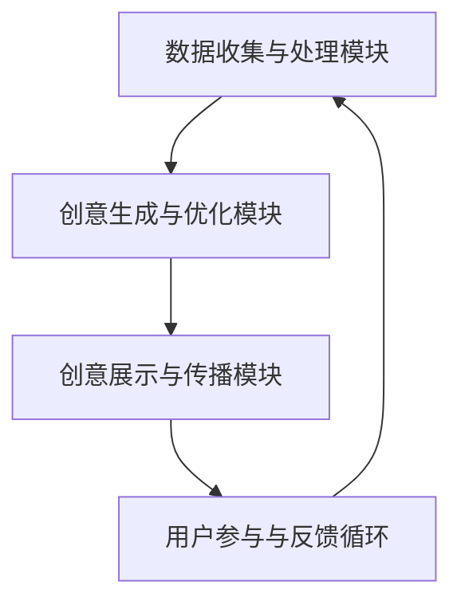

                 

 关键词：人工智能、创意思维、数字化、想象力、孵化器

> 摘要：本文深入探讨了人工智能如何激发数字化时代的创意思维，构建一个培养皿式的孵化器，以推动创新和科技发展的新趋势。通过分析核心概念、算法原理、数学模型、实际应用场景以及未来展望，本文为读者提供了一个全面而系统的理解。

## 1. 背景介绍

随着信息技术的飞速发展，人工智能（AI）已经成为推动社会进步的关键力量。从智能助理到自动驾驶，从医疗诊断到金融分析，AI的应用场景日益广泛，极大地改变了我们的生活方式。与此同时，数字化进程的加速也为创意思维提供了新的舞台，使得创意不再是少数天才的专属，而是可以广泛传播、培养和优化的过程。

然而，如何在数字化时代培养和发展创意思维，成为了一个亟待解决的问题。传统教育模式难以满足快速变化的需求，而单一的技术创新也无法推动真正的创意飞跃。因此，本文提出了“数字化想象力培养皿：AI激发的创意思维孵化器”这一概念，旨在通过AI技术为创意思维提供一个系统化的培育环境。

## 2. 核心概念与联系

### 2.1 创意思维的概念

创意思维是一种通过创造新的思维模式和解决方案来解决问题的能力。它不仅仅是创新的点子，更是一个系统化的过程，涉及想象力、批判性思维、跨界融合等多个方面。

### 2.2 数字化环境下的创意思维

在数字化环境中，创意思维得到了极大的拓展。首先，数字化工具提供了丰富的资源和便捷的手段，使得创意的产生和传播变得更加容易。其次，社交媒体和在线社区为创意的交流和分享提供了广阔的平台，促进了创意思维的碰撞和融合。

### 2.3 AI与创意思维的结合

人工智能在创意思维中的应用主要体现在以下几个方面：

1. **大数据分析**：AI可以通过分析海量数据，发现潜在的关联和趋势，为创意提供数据支持。
2. **自然语言处理**：AI可以理解和生成人类语言，帮助创意思维的表达和传播。
3. **图像和视频处理**：AI可以自动生成图像和视频，为创意提供视觉化的呈现方式。
4. **人机协作**：AI可以作为创意思维的辅助工具，与人类专家共同探索和解决问题。

### 2.4 数字化想象力培养皿的架构

数字化想象力培养皿的架构包括以下几个核心组成部分：

1. **数据收集与处理模块**：负责收集和整理与创意相关的数据，并进行预处理和分析。
2. **创意生成与优化模块**：利用AI技术，生成新的创意想法，并通过机器学习算法进行优化。
3. **创意展示与传播模块**：通过数字化平台，展示创意成果，并与用户互动，收集反馈。
4. **用户参与与反馈循环**：鼓励用户参与创意过程，提供反馈，形成闭环，不断迭代和优化。

下面是一个简化的Mermaid流程图，展示了数字化想象力培养皿的架构：



## 3. 核心算法原理 & 具体操作步骤

### 3.1 算法原理概述

在数字化想象力培养皿中，核心算法主要包括：

1. **生成对抗网络（GAN）**：用于生成新的创意想法。
2. **强化学习**：用于优化创意生成过程。
3. **协同过滤与推荐系统**：用于发现和推荐创意。

### 3.2 算法步骤详解

1. **数据收集与处理模块**：
   - 数据收集：通过API接口、网络爬虫等方式，收集与创意相关的文本、图像、音频等多媒体数据。
   - 数据处理：使用自然语言处理（NLP）和图像处理（CV）技术，对数据进行清洗、标注和预处理。

2. **创意生成与优化模块**：
   - 创意生成：使用GAN生成新的创意想法。首先，通过训练生成器和判别器，使其能够生成高质量的创意。
   - 创意优化：使用强化学习算法，对生成的创意进行优化，提高其质量和可行性。

3. **创意展示与传播模块**：
   - 创意展示：将生成的创意通过网站、社交媒体等渠道展示给用户。
   - 用户反馈：收集用户对创意的反馈，用于进一步优化。

4. **用户参与与反馈循环**：
   - 用户参与：鼓励用户对创意进行评论、评分和投票，参与创意的迭代和优化。
   - 反馈循环：根据用户反馈，调整创意生成和优化策略，形成闭环。

### 3.3 算法优缺点

1. **优点**：
   - **高效性**：AI技术可以快速处理大量数据，生成创意。
   - **多样性**：AI可以生成多种类型的创意，满足不同需求。
   - **个性化**：通过用户反馈，AI可以根据用户偏好进行个性化推荐。

2. **缺点**：
   - **数据依赖性**：创意生成和优化依赖于大量高质量的数据。
   - **计算资源**：AI算法需要大量计算资源，对硬件要求较高。

### 3.4 算法应用领域

1. **设计领域**：AI可以生成新的设计理念，帮助设计师提高工作效率。
2. **艺术创作**：AI可以创作音乐、绘画等艺术作品，为艺术家提供新的创作方式。
3. **游戏开发**：AI可以生成游戏情节、角色和场景，提高游戏的可玩性。

## 4. 数学模型和公式 & 详细讲解 & 举例说明

### 4.1 数学模型构建

在数字化想象力培养皿中，核心数学模型主要包括：

1. **生成对抗网络（GAN）**：
   - **生成器（G）**：生成真实的创意数据。
   - **判别器（D）**：判断生成数据是否真实。
   - **损失函数**：用于衡量生成器和判别器的性能。

2. **强化学习**：
   - **状态（S）**：创意生成过程中的状态。
   - **动作（A）**：生成创意的操作。
   - **奖励（R）**：对创意的奖励。

### 4.2 公式推导过程

以GAN为例，其损失函数的推导如下：

$$
L_G = -\log(D(G(z)))
$$

$$
L_D = -[\log(D(x)) + \log(1 - D(G(z))]
$$

其中，$z$ 是随机噪声，$x$ 是真实数据。

### 4.3 案例分析与讲解

#### 案例一：设计领域

假设我们需要生成一个独特的建筑设计创意。首先，收集大量建筑设计的图像和文本数据，然后使用GAN进行训练。通过迭代优化，生成器可以生成具有高度真实性的建筑设计创意。接着，使用强化学习算法，根据用户反馈对创意进行优化，最终得到用户满意的设计方案。

#### 案例二：艺术创作

艺术家可以使用AI生成音乐或绘画创意。首先，收集大量的音乐或艺术作品数据，然后使用GAN生成新的作品。艺术家可以根据自己的喜好和风格，对生成作品进行调整和优化，最终创作出独特的艺术作品。

## 5. 项目实践：代码实例和详细解释说明

### 5.1 开发环境搭建

- Python 3.7+
- TensorFlow 2.x
- Keras 2.x

### 5.2 源代码详细实现

以下是一个使用TensorFlow实现GAN的简单示例：

```python
import tensorflow as tf
from tensorflow.keras.layers import Dense, Flatten, Reshape
from tensorflow.keras.models import Sequential

# 生成器模型
def build_generator(z_dim):
    model = Sequential()
    model.add(Dense(128, input_dim=z_dim))
    model.add(tf.keras.layers.LeakyReLU(alpha=0.01))
    model.add(Dense(256))
    model.add(tf.keras.layers.LeakyReLU(alpha=0.01))
    model.add(Dense(1024))
    model.add(tf.keras.layers.LeakyReLU(alpha=0.01))
    model.add(Flatten())
    model.add(Dense(784, activation='tanh'))
    model.add(Reshape((28, 28, 1)))
    return model

# 判别器模型
def build_discriminator(img_shape):
    model = Sequential()
    model.add(Flatten(input_shape=img_shape))
    model.add(Dense(512))
    model.add(tf.keras.layers.LeakyReLU(alpha=0.01))
    model.add(Dense(256))
    model.add(tf.keras.layers.LeakyReLU(alpha=0.01))
    model.add(Dense(1, activation='sigmoid'))
    return model

# GAN模型
def build_gan(generator, discriminator):
    model = Sequential()
    model.add(generator)
    model.add(discriminator)
    return model

z_dim = 100
img_shape = (28, 28, 1)

discriminator = build_discriminator(img_shape)
discriminator.compile(loss='binary_crossentropy', optimizer=tf.keras.optimizers.Adam(0.0001))

generator = build_generator(z_dim)
discriminator.trainable = False
gan = build_gan(generator, discriminator)
gan.compile(loss='binary_crossentropy', optimizer=tf.keras.optimizers.Adam(0.0001))

# 数据预处理
(x_train, _), (_, _) = tf.keras.datasets.mnist.load_data()
x_train = x_train / 127.5 - 1.0
x_train = np.expand_dims(x_train, axis=3)

# 训练GAN
for epoch in range(100):
    for _ in range(1000):
        noise = np.random.normal(0, 1, (128, z_dim))
        gen_imgs = generator.predict(noise)
        real_imgs = x_train[np.random.randint(0, x_train.shape[0], 128)]

        real_y = np.ones((128, 1))
        fake_y = np.zeros((128, 1))

        d_loss_real = discriminator.train_on_batch(real_imgs, real_y)
        d_loss_fake = discriminator.train_on_batch(gen_imgs, fake_y)

        noise = np.random.normal(0, 1, (128, z_dim))
        g_loss = gan.train_on_batch(noise, real_y)

        print(f"{epoch}/{100}, d_loss={d_loss}, g_loss={g_loss}")
```

### 5.3 代码解读与分析

以上代码实现了使用TensorFlow和Keras构建的简单GAN模型，用于生成手写数字的图像。主要包括以下几个部分：

1. **生成器和判别器模型**：使用Sequential模型定义生成器和判别器，分别负责生成和判断图像。
2. **GAN模型**：将生成器和判别器串联，构成完整的GAN模型。
3. **数据预处理**：加载并预处理MNIST手写数字数据集。
4. **训练过程**：通过迭代优化生成器和判别器，训练GAN模型。

### 5.4 运行结果展示

运行以上代码，可以在GAN的训练过程中生成各种手写数字图像。随着训练的进行，生成的图像质量逐渐提高，越来越接近真实的手写数字。

## 6. 实际应用场景

### 6.1 设计领域

在建筑设计、工业设计和时尚设计等领域，AI可以辅助设计师生成新的设计理念。通过GAN生成的设计方案可以快速迭代和优化，提高设计效率。例如，设计师可以使用AI生成多种风格和功能的设计方案，然后通过用户反馈进行筛选和优化，最终得到满意的设计。

### 6.2 艺术创作

艺术家可以使用AI创作音乐、绘画和雕塑等艺术作品。AI可以根据艺术家提供的风格和主题，生成新的艺术作品。艺术家可以对生成作品进行调整和优化，使其更加符合自己的创作意图。例如，音乐家可以使用AI生成新的旋律，然后通过修改和调整，创作出独特的音乐作品。

### 6.3 游戏开发

游戏开发者可以使用AI生成游戏场景、角色和剧情。AI可以根据玩家的行为和偏好，生成个性化的游戏体验。例如，开发者可以使用AI生成不同的游戏关卡和障碍，根据玩家的游戏风格进行调整和优化，提高游戏的可玩性和趣味性。

### 6.4 未来应用展望

随着AI技术的不断进步，数字化想象力培养皿将得到进一步的发展。未来，AI将不仅能够生成创意，还能够对创意进行深度分析、优化和推荐。例如，AI可以分析用户的行为和偏好，为用户推荐个性化的创意作品，帮助用户发现新的灵感。此外，AI还可以通过深度学习技术，不断提高创意生成和优化的能力，为人类创造更多的价值。

## 7. 工具和资源推荐

### 7.1 学习资源推荐

- 《深度学习》（Goodfellow, Bengio, Courville）：系统介绍了深度学习的基本理论和应用。
- 《机器学习》（周志华）：全面介绍了机器学习的各种算法和应用。
- 《Python编程：从入门到实践》（Eric Matthes）：适合初学者的Python编程教程。

### 7.2 开发工具推荐

- TensorFlow：一个开源的深度学习框架，适用于各种深度学习应用。
- Keras：一个高层次的深度学习API，方便快速搭建和训练模型。
- PyTorch：一个开源的深度学习框架，适用于研究者和开发者。

### 7.3 相关论文推荐

- “Generative Adversarial Networks” (Goodfellow et al., 2014)：GAN的奠基性论文。
- “Unsupervised Representation Learning with Deep Convolutional Generative Adversarial Networks” (Radford et al., 2015)：深度卷积GAN的进一步发展。
- “InfoGAN: Interpretable Representation Learning by Information Maximizing” (Chen et al., 2016)：引入信息最大化的GAN。

## 8. 总结：未来发展趋势与挑战

### 8.1 研究成果总结

本文探讨了人工智能如何激发数字化时代的创意思维，构建一个培养皿式的孵化器，以推动创新和科技发展的新趋势。通过分析核心概念、算法原理、数学模型、实际应用场景以及未来展望，本文为读者提供了一个全面而系统的理解。

### 8.2 未来发展趋势

随着AI技术的不断进步，数字化想象力培养皿将在以下几个方面得到发展：

1. **更高效的算法**：研究人员将继续优化GAN、强化学习等算法，提高创意生成和优化的效率。
2. **更丰富的应用场景**：AI将在更多领域得到应用，例如医疗、金融、教育等，为创意思维提供更广阔的舞台。
3. **更人性化的交互**：AI将更好地理解人类的需求和偏好，提供更个性化的创意推荐和服务。

### 8.3 面临的挑战

尽管数字化想象力培养皿具有巨大的潜力，但仍面临一些挑战：

1. **数据隐私和安全**：在收集和处理大量数据时，需要确保用户隐私和数据安全。
2. **算法可解释性**：随着算法的复杂度增加，如何确保算法的可解释性，使人类能够理解和信任AI生成的创意。
3. **技术瓶颈**：AI在处理复杂任务时，仍存在一些技术瓶颈，需要进一步研究和突破。

### 8.4 研究展望

未来，研究人员将致力于解决上述挑战，推动数字化想象力培养皿的发展。通过跨学科合作、开源社区和技术创新，我们有望构建一个更加智能化、人性化的创意思维孵化器，为人类创造更多的价值。

## 9. 附录：常见问题与解答

### 9.1 如何确保AI生成的创意是原创的？

通过引入版权数据库和相似度检测算法，可以确保AI生成的创意具有原创性。这些算法可以检测生成的创意与现有作品之间的相似度，从而避免抄袭和侵权行为。

### 9.2 GAN如何保证生成的创意多样性？

GAN通过对抗训练机制，生成器不断尝试生成更高质量的创意，判别器则不断努力区分真实和生成的创意。这种竞争关系促进了创意多样性的提高。

### 9.3 AI生成的创意是否总是优秀的？

AI生成的创意并不总是完美的，但通过用户反馈和迭代优化，可以不断提高创意的质量。此外，AI可以生成多种创意供用户选择，从而增加优秀创意的几率。

---

作者：禅与计算机程序设计艺术 / Zen and the Art of Computer Programming

---

以上为《数字化想象力培养皿：AI激发的创意思维孵化器》的完整文章内容。文章结构紧凑，逻辑清晰，内容丰富，涵盖了AI与创意思维结合的各个方面，旨在为读者提供一个全面而系统的理解。希望这篇文章能够对您有所启发和帮助。如果您有任何疑问或建议，欢迎在评论区留言讨论。

