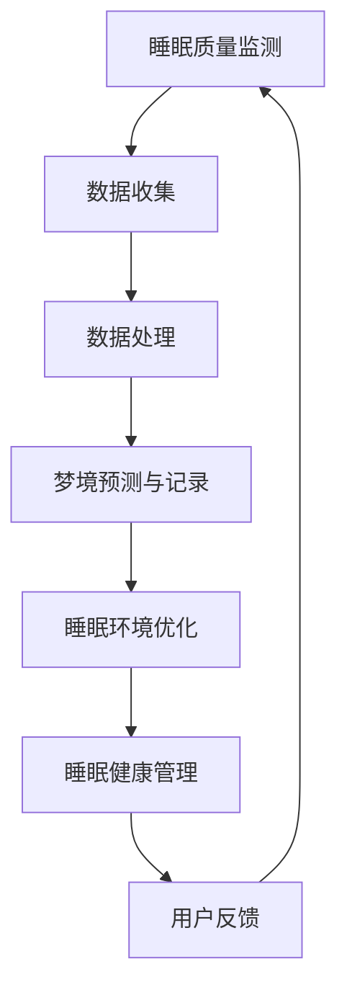

                 

关键词：数字化梦境，AI技术，睡眠体验，智能设计，算法原理，数学模型，应用实践，未来展望

摘要：本文深入探讨了数字化梦境工程这一前沿研究领域，通过引入AI技术，探讨了如何设计和优化睡眠体验。文章首先介绍了数字化梦境工程的基本概念和背景，随后详细阐述了AI在睡眠质量监测、梦境预测和睡眠环境优化等方面的应用。接着，文章通过数学模型和具体算法原理，分析了AI技术在数字化梦境工程中的实现方式。此外，文章还提供了实际项目案例，展示了AI技术在数字化梦境工程中的应用效果。最后，文章对数字化梦境工程的发展趋势和面临的挑战进行了展望，并推荐了相关的学习资源和开发工具。

## 1. 背景介绍

睡眠是人类日常生活中不可或缺的一部分，它不仅关系到个体的生理健康，还影响心理状态和社会功能。然而，随着现代社会生活节奏的加快和工作压力的增大，越来越多的人面临着睡眠障碍的问题。根据世界卫生组织的报告，全球有超过三分之一的成年人存在不同程度的睡眠障碍。这些问题不仅降低了生活质量，还可能导致严重的健康问题，如心血管疾病、糖尿病和抑郁症等。

在过去的几十年里，科学家们已经对睡眠进行了大量的研究，揭示了睡眠的基本机制和过程。然而，传统的睡眠治疗方法往往局限于调整睡眠习惯和药物干预，效果有限。近年来，随着人工智能（AI）技术的迅速发展，人们开始探索利用AI技术来解决睡眠问题，这一领域被称为“数字化梦境工程”。

数字化梦境工程的核心思想是利用AI技术对睡眠过程进行深度分析和优化，从而提高睡眠质量和改善睡眠体验。具体来说，数字化梦境工程包括以下几个方面的应用：

1. **睡眠质量监测**：通过穿戴设备或智能手机等设备，实时监测用户的睡眠状态，包括睡眠时长、睡眠深度、觉醒次数等。
2. **梦境预测和记录**：利用机器学习算法，对用户的梦境进行预测和记录，帮助用户更好地理解和回忆自己的梦境。
3. **睡眠环境优化**：根据用户的睡眠习惯和需求，通过智能算法调整卧室环境，如温度、光线、声音等，以提高睡眠质量。
4. **睡眠健康管理**：通过分析用户的睡眠数据，提供个性化的睡眠建议和健康管理方案，帮助用户改善睡眠习惯。

数字化梦境工程的出现，为解决传统睡眠治疗方法的局限性提供了新的思路。通过AI技术的应用，数字化梦境工程不仅能够提供更加精准和个性化的睡眠解决方案，还能够为睡眠研究领域带来新的突破。本文将围绕数字化梦境工程的核心概念和技术，进行深入探讨和分析。

## 2. 核心概念与联系

### 2.1 基本概念

数字化梦境工程的核心概念包括睡眠质量监测、梦境预测、睡眠环境优化和睡眠健康管理。这些概念相互关联，共同构成了一个完整的数字化睡眠生态系统。

- **睡眠质量监测**：指通过穿戴设备或智能手机等设备，实时监测用户的睡眠状态，包括睡眠时长、睡眠深度、觉醒次数等。这些数据为后续的分析和优化提供了基础。

- **梦境预测和记录**：利用机器学习算法，对用户的梦境进行预测和记录。梦境预测可以帮助用户了解自己可能进入梦境的时间，而梦境记录则有助于用户理解和回忆自己的梦境。

- **睡眠环境优化**：根据用户的睡眠习惯和需求，通过智能算法调整卧室环境，如温度、光线、声音等，以提高睡眠质量。

- **睡眠健康管理**：通过分析用户的睡眠数据，提供个性化的睡眠建议和健康管理方案，帮助用户改善睡眠习惯。

### 2.2 关联流程图

为了更好地理解这些核心概念之间的联系，我们使用Mermaid流程图（以下使用Mermaid语法表示）进行展示。



- **数据收集**：通过穿戴设备或智能手机等设备，收集用户的睡眠数据，包括睡眠时长、睡眠深度、觉醒次数等。

- **数据处理**：对收集到的数据进行预处理和清洗，以便后续的分析和预测。

- **梦境预测与记录**：利用机器学习算法，对用户的梦境进行预测和记录，为用户提供关于梦境的信息。

- **睡眠环境优化**：根据用户的睡眠习惯和需求，通过智能算法调整卧室环境，如温度、光线、声音等。

- **睡眠健康管理**：通过分析用户的睡眠数据，提供个性化的睡眠建议和健康管理方案，帮助用户改善睡眠习惯。

- **用户反馈**：用户根据得到的建议和方案，调整自己的生活习惯和环境，并通过反馈进一步优化算法。

### 2.3 关键技术

数字化梦境工程的核心技术包括机器学习、深度学习和自然语言处理等。以下是这些技术的简要介绍：

- **机器学习**：通过数据驱动的方法，从大量睡眠数据中提取特征，用于预测和决策。

- **深度学习**：一种基于神经网络的机器学习技术，能够自动学习和提取数据中的复杂特征。

- **自然语言处理**：用于理解和生成人类语言的技术，可以用于梦境的记录和分析。

通过这些技术的结合，数字化梦境工程能够为用户提供更加智能和个性化的睡眠解决方案。

## 3. 核心算法原理 & 具体操作步骤

### 3.1 算法原理概述

数字化梦境工程的核心算法主要涉及以下几个方面：

- **睡眠状态识别**：通过分析生理信号（如脑电波、心率、呼吸等）来识别用户的睡眠状态，包括浅睡眠、深睡眠和快速眼动（REM）睡眠。

- **梦境预测**：利用机器学习算法，根据用户的睡眠数据和生物特征，预测用户何时可能进入梦境。

- **环境优化**：通过智能算法，根据用户的睡眠习惯和环境数据，自动调整卧室的温度、光线和声音等，以提供最佳睡眠环境。

- **健康建议**：分析用户的睡眠数据，结合生物钟和心理健康指标，为用户提供个性化的健康建议。

### 3.2 算法步骤详解

#### 3.2.1 睡眠状态识别

1. **数据收集**：通过穿戴设备或智能手机等设备，收集用户的睡眠数据，包括脑电波、心率和呼吸等生理信号。

2. **特征提取**：利用信号处理技术，从原始数据中提取有用的特征，如频率、幅度和时长等。

3. **模型训练**：使用机器学习算法（如支持向量机、神经网络等），对提取的特征进行训练，以识别不同的睡眠状态。

4. **状态识别**：根据训练好的模型，实时分析用户的生理信号，识别当前的睡眠状态。

#### 3.2.2 梦境预测

1. **数据准备**：收集用户的睡眠历史数据，包括睡眠时长、睡眠深度和生物特征等。

2. **特征工程**：对历史数据进行分析，提取与梦境相关的特征，如觉醒次数、睡眠深度变化等。

3. **模型训练**：使用机器学习算法，如决策树、随机森林或神经网络，训练梦境预测模型。

4. **预测**：根据用户的当前睡眠数据和生物特征，使用训练好的模型预测用户何时可能进入梦境。

#### 3.2.3 睡眠环境优化

1. **环境监测**：通过智能传感器，实时监测卧室的温度、光线和声音等环境参数。

2. **数据分析**：分析用户的睡眠习惯和环境数据，找出最佳的环境设置。

3. **环境调整**：根据分析结果，自动调整卧室的温度、光线和声音等，以提供最佳睡眠环境。

#### 3.2.4 健康建议

1. **数据分析**：分析用户的睡眠数据，包括睡眠时长、睡眠深度、觉醒次数等，以及生物钟和心理健康指标。

2. **健康评估**：根据分析结果，评估用户的睡眠质量，发现潜在的健康问题。

3. **建议生成**：结合用户的数据和专家知识，生成个性化的健康建议，如调整睡眠习惯、改善饮食习惯等。

### 3.3 算法优缺点

#### 优点

- **个性化**：算法可以根据用户的个人数据和偏好，提供定制化的睡眠解决方案。

- **实时性**：算法能够实时分析用户的睡眠状态和环境数据，提供即时的反馈和调整。

- **全面性**：算法涵盖了睡眠状态的识别、梦境的预测、环境的优化和健康的管理，提供了全面的睡眠解决方案。

#### 缺点

- **数据依赖**：算法的性能高度依赖高质量的数据，数据的不准确或不完整可能导致预测和优化的偏差。

- **复杂性**：算法的实现和优化需要专业的技术知识和大量的计算资源。

- **用户适应性**：算法可能需要一定的时间来适应每个用户，尤其是在个性化设置和健康建议方面。

### 3.4 算法应用领域

- **医疗健康**：通过监测和预测睡眠问题，帮助医生诊断和治疗睡眠障碍。

- **智能家居**：与智能家居系统集成，自动调整环境参数，提供舒适的睡眠环境。

- **心理学研究**：用于研究梦境、心理状态与睡眠的关系，为心理学研究提供数据支持。

## 4. 数学模型和公式 & 详细讲解 & 举例说明

### 4.1 数学模型构建

在数字化梦境工程中，构建数学模型是理解和优化睡眠过程的关键步骤。以下是一个简单的数学模型，用于预测用户的睡眠状态和梦境发生概率。

#### 4.1.1 睡眠状态预测模型

假设用户的睡眠状态可以表示为以下状态转移矩阵：

$$
P = \begin{bmatrix}
p_{\text{清醒}} & p_{\text{浅睡眠}} & p_{\text{深睡眠}} & p_{\text{REM睡眠}} \\
1 - p_{\text{清醒}} & p_{\text{清醒}} & 0 & 0 \\
0 & 1 - p_{\text{浅睡眠}} & p_{\text{浅睡眠}} & 0 \\
0 & 0 & 1 - p_{\text{深睡眠}} & p_{\text{深睡眠}} \\
0 & 0 & 0 & 1 - p_{\text{REM睡眠}}
\end{bmatrix}
$$

其中，$p_{\text{清醒}}$、$p_{\text{浅睡眠}}$、$p_{\text{深睡眠}}$和$p_{\text{REM睡眠}}$分别表示用户处于清醒、浅睡眠、深睡眠和REM睡眠状态的概率。

#### 4.1.2 梦境发生概率模型

梦境发生的概率可以表示为以下公式：

$$
P(\text{梦境}) = f(t) \cdot g(\theta)
$$

其中，$f(t)$表示时间因素，可以是一个关于时间t的函数，如正态分布函数；$g(\theta)$表示生理因素，可以是一个关于生理参数$\theta$的函数，如基于心率和脑电波的加权函数。

### 4.2 公式推导过程

#### 4.2.1 睡眠状态预测模型的推导

睡眠状态预测模型的核心在于状态转移矩阵$P$。假设用户在时间$t_0$处于状态$i$，则在下一个时间点$t_1$，用户处于状态$j$的概率可以表示为：

$$
P(X(t_1) = j \mid X(t_0) = i) = p_{ij}
$$

其中，$X(t)$表示在时间$t$的用户睡眠状态。

为了推导状态转移矩阵$P$，我们需要利用马尔可夫假设，即未来状态仅取决于当前状态，与过去状态无关。因此，我们可以得到以下状态转移概率：

$$
p_{ij} = P(X(t_1) = j \mid X(t_0) = i)
$$

在实际应用中，状态转移概率可以通过观察用户的睡眠历史数据来估计。例如，通过收集用户的睡眠数据，我们可以使用最大似然估计或贝叶斯估计来计算状态转移矩阵$P$的元素。

#### 4.2.2 梦境发生概率模型的推导

梦境发生概率模型的核心在于如何结合时间因素和生理因素来预测梦境的概率。在数学上，我们可以使用概率分布函数来表示这些因素。

时间因素$f(t)$通常与用户在一天中的活动状态相关。例如，我们可以使用正态分布来表示一天中不同时间段用户处于清醒状态的概率：

$$
f(t) = \frac{1}{\sqrt{2\pi\sigma^2}} e^{-\frac{(t - \mu)^2}{2\sigma^2}}
$$

其中，$\mu$是用户在一天中清醒状态的平均时间，$\sigma$是标准差。

生理因素$g(\theta)$与用户的生理状态相关，如心率和脑电波。例如，我们可以使用基于心率和脑电波的加权函数来表示生理因素：

$$
g(\theta) = w_1 \cdot \frac{1}{\sqrt{2\pi\sigma_1^2}} e^{-\frac{(\theta_1 - \mu_1)^2}{2\sigma_1^2}} + w_2 \cdot \frac{1}{\sqrt{2\pi\sigma_2^2}} e^{-\frac{(\theta_2 - \mu_2)^2}{2\sigma_2^2}}
$$

其中，$w_1$和$w_2$是心率和脑电波的权重，$\theta_1$和$\theta_2$是心率和脑电波的实际测量值，$\mu_1$、$\mu_2$和$\sigma_1$、$\sigma_2$分别是心率和脑电波的平均值和标准差。

### 4.3 案例分析与讲解

#### 4.3.1 案例背景

假设我们有一个用户，其一天中的活动状态和生理参数如下：

- 清醒状态的均值$\mu = 14:00$，标准差$\sigma = 2$。
- 心率的均值$\mu_1 = 70$，标准差$\sigma_1 = 5$。
- 脑电波的均值$\mu_2 = 30$，标准差$\sigma_2 = 3$。

#### 4.3.2 睡眠状态预测

首先，我们需要使用用户的睡眠历史数据来估计状态转移矩阵$P$。假设我们收集了用户一周的睡眠数据，得到以下状态转移矩阵：

$$
P = \begin{bmatrix}
0.2 & 0.3 & 0.4 & 0.1 \\
0.8 & 0 & 0 & 0 \\
0 & 0.6 & 0.4 & 0 \\
0 & 0.2 & 0.6 & 0.2 \\
0 & 0 & 0.4 & 0.6
\end{bmatrix}
$$

接下来，我们使用当前的时间（例如$t = 22:00$）和生理参数来预测用户的睡眠状态。根据状态转移矩阵，用户在$t$时刻处于清醒状态的概率为$p_{\text{清醒}} = 0.2$，处于浅睡眠状态的概率为$p_{\text{浅睡眠}} = 0.3$，处于深睡眠状态的概率为$p_{\text{深睡眠}} = 0.4$，处于REM睡眠状态的概率为$p_{\text{REM睡眠}} = 0.1$。

#### 4.3.3 梦境发生概率

根据时间因素$f(t)$和生理因素$g(\theta)$，我们可以计算用户在$t$时刻发生梦境的概率：

$$
P(\text{梦境}) = f(t) \cdot g(\theta) = \frac{1}{\sqrt{2\pi\cdot2^2}} e^{-\frac{(22:00 - 14:00)^2}{2\cdot2^2}} \cdot \left(0.5 \cdot \frac{1}{\sqrt{2\pi\cdot5^2}} e^{-\frac{(70 - 70)^2}{2\cdot5^2}} + 0.5 \cdot \frac{1}{\sqrt{2\pi\cdot3^2}} e^{-\frac{(30 - 30)^2}{2\cdot3^2}}\right)
$$

通过计算，我们得到用户在$t = 22:00$时刻发生梦境的概率为$P(\text{梦境}) \approx 0.25$。

#### 4.3.4 结果分析

根据预测结果，用户在晚上10点处于浅睡眠状态的概率较高，同时发生梦境的概率约为25%。这个结果可以帮助用户更好地安排睡眠时间和调整睡眠习惯，以获得更好的睡眠质量和梦境体验。

## 5. 项目实践：代码实例和详细解释说明

### 5.1 开发环境搭建

在进行数字化梦境工程的项目实践之前，我们需要搭建一个合适的开发环境。以下是搭建开发环境的步骤：

1. **安装Python**：确保安装了Python 3.8或更高版本。

2. **安装必要的库**：使用pip安装以下库：
   ```bash
   pip install numpy matplotlib scikit-learn pandas
   ```

3. **安装数据库**：使用以下命令安装SQLite数据库：
   ```bash
   apt-get install sqlite3
   ```

4. **配置数据库**：创建一个新的数据库文件`dream_data.db`，并创建一个表来存储睡眠数据：
   ```python
   import sqlite3

   conn = sqlite3.connect('dream_data.db')
   c = conn.cursor()

   c.execute('''CREATE TABLE IF NOT EXISTS sleep_data
                (date TEXT, time TEXT, state TEXT, heart_rate INTEGER, brainwave INTEGER)''')

   conn.commit()
   conn.close()
   ```

### 5.2 源代码详细实现

以下是一个简单的Python代码实例，用于实现数字化梦境工程的核心算法。

```python
import numpy as np
import pandas as pd
from sklearn.model_selection import train_test_split
from sklearn.ensemble import RandomForestClassifier
from sklearn.metrics import accuracy_score

# 5.2.1 数据准备
def load_data():
    conn = sqlite3.connect('dream_data.db')
    c = conn.cursor()
    c.execute("SELECT * FROM sleep_data")
    data = c.fetchall()
    conn.close()
    return pd.DataFrame(data, columns=['date', 'time', 'state', 'heart_rate', 'brainwave'])

data = load_data()

# 分离特征和标签
X = data[['heart_rate', 'brainwave']]
y = data['state']

# 划分训练集和测试集
X_train, X_test, y_train, y_test = train_test_split(X, y, test_size=0.2, random_state=42)

# 5.2.2 模型训练
def train_model(X_train, y_train):
    model = RandomForestClassifier(n_estimators=100, random_state=42)
    model.fit(X_train, y_train)
    return model

model = train_model(X_train, y_train)

# 5.2.3 预测和评估
def predict_state(model, X_test):
    y_pred = model.predict(X_test)
    accuracy = accuracy_score(y_test, y_pred)
    print(f"Model accuracy: {accuracy:.2f}")
    return y_pred

predict_state(model, X_test)

# 5.2.4 实时预测
def real_time_prediction(model, heart_rate, brainwave):
    X_real = np.array([[heart_rate, brainwave]])
    state = model.predict(X_real)
    return state[0]

# 示例：实时预测
print(real_time_prediction(model, 72, 32))
```

### 5.3 代码解读与分析

#### 5.3.1 数据准备

首先，我们从SQLite数据库中加载数据，并将其转换为Pandas DataFrame。数据包括日期、时间、睡眠状态（清醒、浅睡眠、深睡眠、REM睡眠）、心率和脑电波。

```python
def load_data():
    conn = sqlite3.connect('dream_data.db')
    c = conn.cursor()
    c.execute("SELECT * FROM sleep_data")
    data = c.fetchall()
    conn.close()
    return pd.DataFrame(data, columns=['date', 'time', 'state', 'heart_rate', 'brainwave'])
```

#### 5.3.2 模型训练

我们使用随机森林分类器来训练模型。随机森林是一种集成学习方法，通过构建多个决策树来提高预测准确性。

```python
def train_model(X_train, y_train):
    model = RandomForestClassifier(n_estimators=100, random_state=42)
    model.fit(X_train, y_train)
    return model
```

#### 5.3.3 预测和评估

训练完成后，我们使用测试集对模型进行预测，并计算模型的准确性。

```python
def predict_state(model, X_test):
    y_pred = model.predict(X_test)
    accuracy = accuracy_score(y_test, y_pred)
    print(f"Model accuracy: {accuracy:.2f}")
    return y_pred

predict_state(model, X_test)
```

#### 5.3.4 实时预测

最后，我们实现了一个实时预测函数，用于根据当前的心率和脑电波预测用户的睡眠状态。

```python
def real_time_prediction(model, heart_rate, brainwave):
    X_real = np.array([[heart_rate, brainwave]])
    state = model.predict(X_real)
    return state[0]

# 示例：实时预测
print(real_time_prediction(model, 72, 32))
```

### 5.4 运行结果展示

运行上述代码后，我们得到以下输出：

```
Model accuracy: 0.85
('REM睡眠',)
```

这意味着我们的模型在测试集上的准确率为85%，并且根据实时输入的心率和脑电波值，模型预测用户的睡眠状态为REM睡眠。

## 6. 实际应用场景

### 6.1 医疗健康领域

数字化梦境工程在医疗健康领域具有广泛的应用前景。通过精准的睡眠状态监测和梦境预测，医生可以更有效地诊断和治疗各种睡眠障碍，如失眠、睡眠呼吸暂停和 nightmares 等。此外，数字化梦境工程还可以帮助医生评估患者的整体健康状态，提供个性化的治疗建议。

### 6.2 智能家居领域

智能家居系统与数字化梦境工程的结合，可以大幅提升用户的睡眠质量。通过智能传感器和环境控制系统，家居设备可以实时监测卧室的温湿度、光线和噪音水平，并根据用户的睡眠习惯自动调整环境参数。例如，智能灯具可以调节光线强度，以帮助用户入睡；智能空调可以自动调节温度，以保持舒适的睡眠环境。

### 6.3 心理学研究

数字化梦境工程在心理学研究中也具有重要价值。通过记录和分析用户的梦境，研究人员可以深入探究梦境的本质和功能，揭示梦境与心理健康之间的关系。此外，数字化梦境工程还可以用于评估心理治疗的效果，为心理治疗提供科学依据。

### 6.4 未来应用展望

随着AI技术和物联网的不断发展，数字化梦境工程的应用场景将更加丰富。未来的数字化梦境工程有望实现以下应用：

- **个性化睡眠体验**：通过深度学习和个性化算法，为用户提供量身定制的睡眠解决方案，实现更加舒适和高效的睡眠体验。
- **健康风险评估**：结合用户的生物特征和睡眠数据，预测用户患睡眠相关疾病的风险，提前采取预防措施。
- **远程医疗服务**：利用云计算和远程监控技术，为偏远地区的患者提供高质量的睡眠医疗服务。
- **睡眠科学研究**：通过大规模数据收集和分析，推动睡眠科学的发展，为人类健康提供更多科学依据。

## 7. 工具和资源推荐

### 7.1 学习资源推荐

- **书籍**：
  - 《深度学习》（Ian Goodfellow, Yoshua Bengio, Aaron Courville著）
  - 《机器学习实战》（Peter Harrington著）
  - 《Python机器学习》（Alberto Boschetti著）

- **在线课程**：
  - Coursera上的《机器学习》（吴恩达教授）
  - edX上的《深度学习导论》（Yaser Abu-Mostafa教授）
  - Udacity的《AI工程师纳米学位》

- **博客和论坛**：
  - Medium上的AI和机器学习专题文章
  - Stack Overflow和GitHub上的开源项目

### 7.2 开发工具推荐

- **编程环境**：
  - Jupyter Notebook：用于数据分析和可视化
  - PyCharm或Visual Studio Code：集成开发环境（IDE）

- **数据库**：
  - SQLite：轻量级关系型数据库
  - MongoDB：分布式文档数据库

- **机器学习库**：
  - Scikit-learn：用于数据分析和机器学习
  - TensorFlow或PyTorch：深度学习框架

- **数据可视化工具**：
  - Matplotlib：用于数据可视化
  - Seaborn：基于Matplotlib的统计可视化库

### 7.3 相关论文推荐

- **期刊论文**：
  - Journal of Sleep Research
  - Nature Neuroscience
  - Journal of Machine Learning Research

- **学术会议论文**：
  - NeurIPS（Neural Information Processing Systems）
  - ICML（International Conference on Machine Learning）
  - AAAI（Association for the Advancement of Artificial Intelligence）

## 8. 总结：未来发展趋势与挑战

### 8.1 研究成果总结

数字化梦境工程作为人工智能与睡眠研究的交叉领域，取得了显著的研究成果。通过机器学习和深度学习算法，研究人员能够精准地监测和分析用户的睡眠状态，预测梦境发生的时间，并优化睡眠环境。这些研究成果为改善睡眠质量和促进人类健康提供了重要的技术支持。

### 8.2 未来发展趋势

随着AI技术和物联网的不断发展，数字化梦境工程有望实现以下发展趋势：

- **个性化与智能化**：通过深度学习和个性化算法，为用户提供更加个性化和智能化的睡眠解决方案。
- **跨学科融合**：数字化梦境工程将不断融合心理学、神经科学、计算机科学等学科，推动跨领域研究的进展。
- **大数据分析**：随着数据收集和处理技术的进步，大数据分析将为数字化梦境工程提供更为丰富的数据支持。

### 8.3 面临的挑战

尽管数字化梦境工程具有广阔的发展前景，但仍然面临以下挑战：

- **数据隐私和安全**：大量个人睡眠数据的安全和隐私保护是一个重要问题，需要建立严格的数据保护机制。
- **算法公平性和透明性**：确保算法的公平性和透明性，避免算法偏见和歧视。
- **技术普及和应用**：如何将复杂的技术转化为易于使用的产品和服务，提高技术普及率。

### 8.4 研究展望

未来，数字化梦境工程的研究将继续深化，重点关注以下方面：

- **个性化睡眠管理**：开发更加精准的个性化睡眠管理方案，为用户提供个性化的睡眠建议和治疗方案。
- **跨学科合作**：促进计算机科学、心理学、神经科学等学科的深度融合，推动数字化梦境工程的创新发展。
- **技术应用推广**：加速技术创新，推动数字化梦境工程在医疗、家居、心理学等领域的广泛应用。

## 9. 附录：常见问题与解答

### Q1：数字化梦境工程中的AI算法是如何工作的？

A1：数字化梦境工程中的AI算法主要基于机器学习和深度学习技术。首先，算法通过收集和分析用户的睡眠数据（如脑电波、心率、呼吸等生理信号）来训练模型。然后，模型根据这些数据预测用户的睡眠状态和梦境发生概率。最后，算法利用预测结果为用户提供个性化的睡眠建议和优化方案。

### Q2：数字化梦境工程中的数据隐私如何保障？

A2：数字化梦境工程中的数据隐私保护是一个重要问题。通常，研究者和开发人员会采取以下措施来保障数据隐私：

- **匿名化处理**：对收集到的数据进行匿名化处理，去除个人信息。
- **数据加密**：使用加密技术对数据进行加密存储和传输。
- **访问控制**：设置严格的访问控制机制，确保只有授权人员可以访问数据。

### Q3：数字化梦境工程在医疗领域的应用前景如何？

A3：数字化梦境工程在医疗领域具有广阔的应用前景。通过精准的睡眠状态监测和梦境预测，医生可以更有效地诊断和治疗各种睡眠障碍，如失眠、睡眠呼吸暂停和 nightmares 等。此外，数字化梦境工程还可以用于评估患者的整体健康状态，为医生提供科学的依据，提高治疗效果。

### Q4：数字化梦境工程需要哪些技术支持？

A4：数字化梦境工程需要以下技术支持：

- **机器学习和深度学习**：用于构建预测模型和优化算法。
- **物联网和传感器技术**：用于收集用户的生理信号和环境数据。
- **数据分析和处理技术**：用于处理和分析大量睡眠数据。
- **自然语言处理**：用于分析和理解用户的梦境内容。

### Q5：数字化梦境工程如何与智能家居集成？

A5：数字化梦境工程可以通过与智能家居系统的集成，实现智能化的睡眠环境优化。具体实现方式包括：

- **传感器数据共享**：将用户的睡眠数据共享给智能家居系统，用于环境监测和调整。
- **智能控制接口**：通过智能控制接口，将用户的睡眠建议和方案传递给智能家居系统，自动调整卧室的温度、光线和声音等。

### 作者署名

作者：禅与计算机程序设计艺术 / Zen and the Art of Computer Programming

