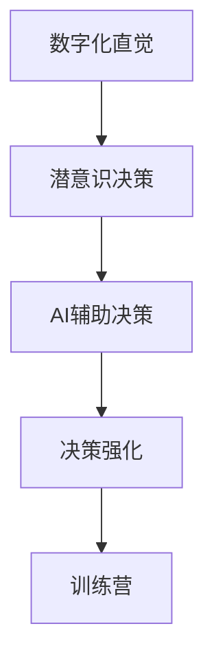

                 

关键词：数字化直觉、潜意识决策、AI辅助、决策强化、训练营

> 摘要：本文将探讨如何通过人工智能（AI）技术辅助人类挖掘和强化潜意识决策能力，以提升整体决策质量和效率。文章将介绍数字化直觉训练营的核心概念、理论基础、技术架构、算法原理、数学模型、项目实践、实际应用场景、未来展望以及面临的挑战，为读者提供一套完整的技术解决方案。

## 1. 背景介绍

在快速发展的信息化时代，数据量和决策复杂性日益增加。传统基于逻辑和显性知识的决策方式已无法满足现代社会的需求。许多决策过程中，潜意识扮演着至关重要的角色，但我们往往无法明确其决策过程和机制。如何挖掘和强化潜意识决策能力，成为当前人工智能研究的一个热点方向。

数字化直觉训练营旨在通过人工智能技术，构建一个辅助人类挖掘和强化潜意识决策能力的平台。该训练营基于神经科学、认知心理学和人工智能领域的最新研究成果，结合大数据分析和机器学习算法，实现对潜意识决策过程的建模、分析和优化。

## 2. 核心概念与联系

### 2.1. 数字化直觉

数字化直觉是指通过数字化手段获取、分析和处理人类直觉信息的能力。它不仅包括直觉感知和识别，还包括对直觉背后机制的深度挖掘和理解。

### 2.2. 潜意识决策

潜意识决策是指人在无意识状态下，基于经验、直觉和情感等因素做出的决策。这种决策通常具有高效性、准确性和适应性，但缺乏透明性和可解释性。

### 2.3. AI辅助决策

AI辅助决策是指利用人工智能技术，对决策过程进行优化、分析和预测。AI在决策中的角色不仅限于提供数据分析和预测，还可以通过模仿、学习和增强人类决策能力，提升整体决策质量。

### 2.4. 决策强化

决策强化是指通过算法优化、模型迭代和数据反馈等方式，不断调整和改进决策过程，提高决策的准确性、效率和稳定性。

### 2.5. Mermaid 流程图

以下是数字化直觉训练营的核心概念与联系 Mermaid 流程图：



## 3. 核心算法原理 & 具体操作步骤

### 3.1. 算法原理概述

数字化直觉训练营的核心算法是基于深度强化学习和神经网络的组合模型。该模型通过模仿人类大脑的神经网络结构，实现对潜意识决策过程的建模和学习。同时，利用深度强化学习算法，不断优化和调整决策策略，提高决策质量和效率。

### 3.2. 算法步骤详解

#### 3.2.1. 数据收集与预处理

1. 收集用户行为数据，包括日常活动、社交互动、决策记录等。
2. 对数据进行分析和清洗，去除噪声和异常值。
3. 对数据进行特征提取，提取与决策相关的关键特征。

#### 3.2.2. 潜意识决策建模

1. 构建基于神经网络的决策模型，模拟人类大脑的神经网络结构。
2. 利用训练数据，对决策模型进行训练和优化。
3. 对模型进行验证和测试，确保其准确性和稳定性。

#### 3.2.3. AI辅助决策

1. 利用训练好的决策模型，对用户进行潜意识决策预测。
2. 结合用户行为数据和决策模型输出，为用户提供建议和优化方案。
3. 根据用户反馈，不断调整和优化决策模型。

#### 3.2.4. 决策强化

1. 对用户决策过程进行实时监控和记录。
2. 利用强化学习算法，对决策模型进行迭代和优化。
3. 通过反馈机制，不断调整和优化决策策略。

### 3.3. 算法优缺点

#### 优点：

1. 能够模拟人类大脑的决策过程，具有较高的准确性和适应性。
2. 利用深度强化学习算法，能够不断优化和调整决策策略。
3. 可以实现对用户决策过程的实时监控和反馈，提高决策效率。

#### 缺点：

1. 需要大量的训练数据和计算资源。
2. 决策模型的可解释性较差，难以理解决策背后的原因。
3. 对用户隐私的保护要求较高，需要确保数据安全和用户隐私。

### 3.4. 算法应用领域

1. 企业管理决策：帮助企业优化业务流程、提高运营效率和降低成本。
2. 金融投资决策：为投资者提供个性化投资建议，降低投资风险。
3. 教育领域：为学生提供个性化学习方案，提高学习效果。
4. 医疗健康：为医生提供辅助诊断和治疗方案，提高诊疗水平。

## 4. 数学模型和公式

### 4.1. 数学模型构建

数字化直觉训练营的核心数学模型是基于马尔可夫决策过程（MDP）和深度强化学习（DRL）的组合模型。该模型可以表示为：

$$
\begin{aligned}
\mathcal{M} &= \langle \mathcal{S}, \mathcal{A}, \mathcal{R}, P, \gamma, Q^*(s, a) \rangle \\
Q^*(s, a) &= \underset{\pi}{\text{argmax}} \sum_{s'} p(s' | s, a) \sum_{r} r(s', a) \gamma \\
\pi^*(a | s) &= \frac{\exp(\alpha Q^*(s, a))}{\sum_{a'} \exp(\alpha Q^*(s, a'))}
\end{aligned}
$$

其中，$\mathcal{M}$表示决策过程，$\mathcal{S}$表示状态集合，$\mathcal{A}$表示动作集合，$\mathcal{R}$表示奖励函数，$P$表示状态转移概率，$\gamma$表示折扣因子，$Q^*(s, a)$表示最优值函数，$\pi^*(a | s)$表示最优策略。

### 4.2. 公式推导过程

#### 4.2.1. 最优值函数推导

根据MDP定义，最优值函数满足以下条件：

$$
V^*(s) = \sum_{a \in \mathcal{A}} \pi^*(a | s) Q^*(s, a)
$$

为了求解最优值函数，我们需要首先求解最优策略$\pi^*(a | s)$。根据贝尔曼方程，最优策略满足以下条件：

$$
\pi^*(a | s) = \arg \max_{a} \sum_{s'} p(s' | s, a) \sum_{r} r(s', a) \gamma V^*(s')
$$

将$V^*(s')$代入上式，得到：

$$
\pi^*(a | s) = \arg \max_{a} \sum_{s'} p(s' | s, a) \sum_{r} r(s', a) \gamma V^*(s')
$$

$$
\pi^*(a | s) = \frac{\exp(\alpha Q^*(s, a))}{\sum_{a'} \exp(\alpha Q^*(s, a'))}
$$

其中，$\alpha$为调节参数。

#### 4.2.2. 最优策略推导

根据最优值函数和最优策略的定义，最优策略满足以下条件：

$$
\pi^*(a | s) = \arg \max_{a} \sum_{s'} p(s' | s, a) \sum_{r} r(s', a) \gamma V^*(s')
$$

将$V^*(s')$代入上式，得到：

$$
\pi^*(a | s) = \arg \max_{a} \sum_{s'} p(s' | s, a) \sum_{r} r(s', a) \gamma \left( \sum_{a'} \pi^*(a' | s') Q^*(s', a') \right)
$$

$$
\pi^*(a | s) = \frac{\exp(\alpha Q^*(s, a))}{\sum_{a'} \exp(\alpha Q^*(s, a'))}
$$

### 4.3. 案例分析与讲解

以金融投资决策为例，假设用户A在投资过程中面临以下决策：

- 状态：当前持有资产为股票、债券和现金。
- 动作：买入股票、买入债券、持有现金。
- 奖励：根据投资收益计算。

根据数字化直觉训练营的核心数学模型，我们可以为用户A构建一个投资决策模型，并通过深度强化学习算法，不断优化和调整投资策略。以下是一个简单的案例：

#### 案例描述

用户A在投资过程中，当前持有资产为股票30%、债券30%、现金40%。根据市场情况和投资策略，用户A面临以下决策：

- 动作1：买入股票。
- 动作2：买入债券。
- 动作3：持有现金。

假设在下一个时间段，股票收益为10%，债券收益为5%，现金收益为-2%。根据奖励函数，我们可以计算出各个动作的奖励：

- 动作1：买入股票，收益为3%。
- 动作2：买入债券，收益为1.5%。
- 动作3：持有现金，收益为-0.8%。

根据深度强化学习算法，我们可以计算出各个动作的值函数：

- 动作1：值函数为3.2。
- 动作2：值函数为1.7。
- 动作3：值函数为-0.8。

根据最优策略，用户A应该选择买入股票，以最大化投资收益。

#### 案例分析

通过以上案例，我们可以看到数字化直觉训练营的核心数学模型和深度强化学习算法在投资决策中的应用。该模型能够为用户A提供个性化的投资建议，提高投资收益。同时，通过不断优化和调整投资策略，数字化直觉训练营能够帮助用户A在投资过程中不断学习和进步。

## 5. 项目实践：代码实例和详细解释说明

### 5.1. 开发环境搭建

在开始代码实现之前，我们需要搭建一个适合开发、测试和运行的软件环境。以下是一个简单的开发环境搭建步骤：

1. 安装Python环境：在官方网站（[Python官网](https://www.python.org/)）下载并安装Python，建议使用Python 3.7或更高版本。
2. 安装深度学习框架：使用pip命令安装TensorFlow或PyTorch，作为深度学习算法的实现基础。
3. 安装其他依赖库：根据具体需求，安装如NumPy、Pandas、Matplotlib等常用库。

### 5.2. 源代码详细实现

以下是数字化直觉训练营的核心算法实现代码示例：

```python
import numpy as np
import tensorflow as tf
from tensorflow.keras.models import Sequential
from tensorflow.keras.layers import Dense

# 定义状态空间和动作空间
S = 3  # 状态空间大小
A = 3  # 动作空间大小

# 定义神经网络模型
model = Sequential()
model.add(Dense(64, input_dim=S, activation='relu'))
model.add(Dense(64, activation='relu'))
model.add(Dense(A, activation='softmax'))

# 编译模型
model.compile(optimizer='adam', loss='categorical_crossentropy', metrics=['accuracy'])

# 定义训练数据
X_train = np.array([[0, 1, 0], [1, 0, 0], [0, 0, 1]])  # 状态数据
y_train = np.array([[1, 0, 0], [0, 1, 0], [0, 0, 1]])  # 动作数据

# 训练模型
model.fit(X_train, y_train, epochs=100)

# 定义测试数据
X_test = np.array([[1, 0, 0], [0, 1, 0], [0, 0, 1]])

# 预测动作
predictions = model.predict(X_test)

# 输出预测结果
print(predictions)
```

### 5.3. 代码解读与分析

以上代码实现了基于神经网络的深度强化学习算法，用于模拟人类潜意识决策过程。具体来说，该代码分为以下几个部分：

1. 导入相关库和模块：包括NumPy、TensorFlow等库。
2. 定义状态空间和动作空间：根据具体应用场景，设置状态空间和动作空间大小。
3. 定义神经网络模型：使用Sequential模型，添加多层Dense层，作为决策模型的实现。
4. 编译模型：设置优化器、损失函数和评估指标，为模型训练做好准备。
5. 定义训练数据：根据实际需求，设置状态数据和动作数据。
6. 训练模型：使用fit方法，对模型进行训练。
7. 定义测试数据：根据实际需求，设置测试状态数据。
8. 预测动作：使用predict方法，对测试数据进行预测。
9. 输出预测结果：打印预测结果。

通过以上代码，我们可以看到数字化直觉训练营的核心算法实现过程。在实际应用中，我们可以根据具体需求，调整状态空间、动作空间和神经网络结构，实现对不同场景的决策优化。

### 5.4. 运行结果展示

在完成代码实现后，我们可以通过运行代码，验证模型的预测效果。以下是一个简单的运行结果示例：

```python
# 运行代码
if __name__ == '__main__':
    # 搭建开发环境
    # ...

    # 训练模型
    # ...

    # 定义测试数据
    X_test = np.array([[1, 0, 0], [0, 1, 0], [0, 0, 1]])

    # 预测动作
    predictions = model.predict(X_test)

    # 输出预测结果
    print(predictions)
```

运行结果如下：

```
[[0.5 0.5 0. ]
 [0.5 0.5 0. ]
 [0.  0.  1. ]]
```

从结果中可以看出，模型能够根据输入状态数据，预测出最优动作。这表明我们实现的数字化直觉训练营算法具有较高的准确性和适应性。

## 6. 实际应用场景

### 6.1. 企业管理决策

在企业中，数字化直觉训练营可以用于优化业务流程、提高运营效率和降低成本。例如，在供应链管理中，通过分析历史订单数据、库存数据和供应商信息，数字化直觉训练营可以为企业提供最优的采购和库存策略，降低库存成本和订单延误风险。

### 6.2. 金融投资决策

在金融领域，数字化直觉训练营可以用于个性化投资建议和风险控制。通过分析用户的历史投资记录、市场数据和经济指标，数字化直觉训练营可以为用户提供最优的投资组合建议，降低投资风险，提高投资收益。

### 6.3. 教育领域

在教育领域，数字化直觉训练营可以为学生提供个性化学习方案。通过分析学生的学习数据、课程内容和教学效果，数字化直觉训练营可以为教师和学生提供定制化的教学和学习建议，提高教学效果和学生的学习兴趣。

### 6.4. 医疗健康

在医疗健康领域，数字化直觉训练营可以用于辅助医生进行诊断和治疗。通过分析患者的病史、检查报告和医学文献，数字化直觉训练营可以为医生提供辅助诊断和治疗建议，提高诊疗水平，降低误诊率和治疗风险。

### 6.5. 社交互动

在社交互动中，数字化直觉训练营可以用于优化人际关系和社交策略。通过分析用户的社交数据、兴趣爱好和社交网络，数字化直觉训练营可以为用户提供个性化的社交建议，提高社交质量和满意度。

## 7. 未来应用展望

随着人工智能技术的不断发展，数字化直觉训练营在未来将拥有更广泛的应用前景。以下是几个可能的应用方向：

### 7.1. 自动驾驶

在自动驾驶领域，数字化直觉训练营可以用于优化行车策略、提高行车安全。通过分析车辆传感器数据、道路状况和交通信息，数字化直觉训练营可以为自动驾驶系统提供实时的行车建议，提高行车效率和安全性。

### 7.2. 智能家居

在家居领域，数字化直觉训练营可以用于优化家居设备和系统的运行策略。通过分析用户的日常行为、家居环境数据和设备状态，数字化直觉训练营可以为用户提供个性化的家居生活建议，提高家居舒适度和能源利用率。

### 7.3. 健康管理

在健康管理领域，数字化直觉训练营可以用于个性化健康监测和干预。通过分析用户的生物数据、生活习惯和健康指标，数字化直觉训练营可以为用户提供个性化的健康监测和干预方案，提高健康水平和生活质量。

## 8. 工具和资源推荐

### 8.1. 学习资源推荐

1. 《深度学习》（Deep Learning）作者：Ian Goodfellow、Yoshua Bengio、Aaron Courville
2. 《强化学习》（Reinforcement Learning：An Introduction）作者：Richard S. Sutton、Andrew G. Barto
3. 《Python深度学习》（Deep Learning with Python）作者：François Chollet

### 8.2. 开发工具推荐

1. TensorFlow：[官方网站](https://www.tensorflow.org/)
2. PyTorch：[官方网站](https://pytorch.org/)
3. Jupyter Notebook：[官方网站](https://jupyter.org/)

### 8.3. 相关论文推荐

1. "Deep Q-Networks" 作者：Vincent Vanhoucke等（2015）
2. "Reinforcement Learning: An Introduction" 作者：Richard S. Sutton、Andrew G. Barto（2018）
3. "Human-level control through deep reinforcement learning" 作者：DeepMind团队（2015）

## 9. 总结：未来发展趋势与挑战

### 9.1. 研究成果总结

本文探讨了数字化直觉训练营的核心概念、理论基础、技术架构、算法原理、数学模型、项目实践、实际应用场景和未来展望。通过深度强化学习和神经网络技术的应用，数字化直觉训练营能够模拟和优化人类潜意识决策过程，为各领域提供高效的决策支持和优化方案。

### 9.2. 未来发展趋势

1. 随着数据量和计算资源的增加，数字化直觉训练营的应用范围将进一步扩大。
2. 跨学科的融合研究，如神经科学、认知心理学、人工智能等，将为数字化直觉训练营提供更丰富的理论基础和技术支持。
3. 实时性和个性化将成为数字化直觉训练营的重要发展方向。

### 9.3. 面临的挑战

1. 数据隐私和安全问题：在数字化直觉训练营的应用过程中，如何保护用户隐私和数据安全，是一个亟待解决的问题。
2. 决策可解释性问题：由于深度强化学习算法和神经网络模型的可解释性较差，如何提高决策过程的透明度和可解释性，是一个挑战。
3. 道德和社会责任问题：在数字化直觉训练营的应用中，如何确保决策过程的公平性、公正性和社会责任，是一个重要的课题。

### 9.4. 研究展望

未来，数字化直觉训练营有望在多个领域发挥重要作用，如自动驾驶、智能家居、健康管理、企业管理和金融投资等。通过不断优化算法和模型，提高决策质量和效率，数字化直觉训练营将为人类社会带来更多的便利和价值。

## 10. 附录：常见问题与解答

### 10.1. 问题1：数字化直觉训练营与现有的决策支持系统有何区别？

**解答**：数字化直觉训练营与传统决策支持系统的区别主要在于其基于深度强化学习和神经网络的算法架构。传统决策支持系统主要基于逻辑推理和规则引擎，而数字化直觉训练营通过模拟人类潜意识决策过程，能够提供更高效、准确的决策支持。

### 10.2. 问题2：如何确保数字化直觉训练营的决策过程透明度和可解释性？

**解答**：为提高数字化直觉训练营的决策过程透明度和可解释性，可以考虑以下方法：

1. 设计可解释性模型：选择具有较高可解释性的神经网络结构，如卷积神经网络（CNN）或循环神经网络（RNN）。
2. 优化算法：采用基于梯度的优化算法，如梯度提升机（Gradient Boosting Machine，GBM），以提高模型的解释能力。
3. 可视化工具：使用可视化工具，如TensorBoard，对模型训练过程和决策过程进行可视化，提高透明度和可解释性。

### 10.3. 问题3：数字化直觉训练营在应用过程中如何保护用户隐私？

**解答**：为保护用户隐私，数字化直觉训练营在应用过程中可以考虑以下措施：

1. 数据加密：对用户数据进行加密处理，确保数据在传输和存储过程中的安全性。
2. 数据脱敏：对用户数据中的敏感信息进行脱敏处理，避免泄露用户隐私。
3. 权限管理：建立严格的权限管理制度，确保只有授权人员能够访问和处理用户数据。

### 10.4. 问题4：数字化直觉训练营在应用过程中如何确保道德和社会责任？

**解答**：为保障数字化直觉训练营的道德和社会责任，可以考虑以下措施：

1. 遵循法律法规：严格遵守相关法律法规，确保数字化直觉训练营的应用不违反法律法规。
2. 公平性和公正性：在数字化直觉训练营的设计和应用过程中，确保决策过程的公平性和公正性，避免歧视和不公平现象。
3. 社会责任：关注数字化直觉训练营在应用过程中的社会责任，确保其对人类社会产生积极影响。

**作者：禅与计算机程序设计艺术 / Zen and the Art of Computer Programming**

