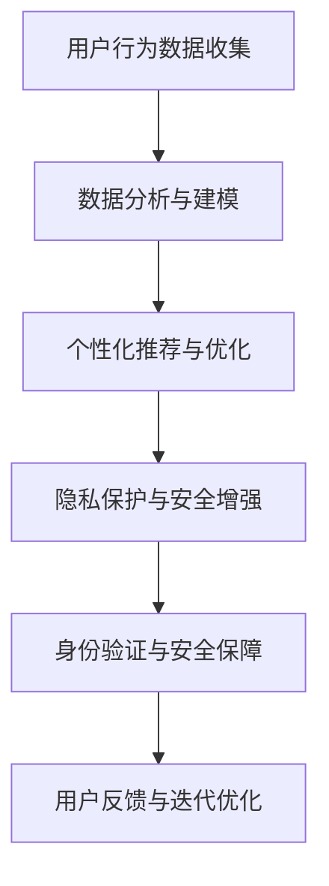

                 

关键词：数字化身份，AI技术，身份重构，自我重塑，隐私保护，用户体验

> 摘要：随着人工智能技术的迅猛发展，数字化身份的概念逐渐成熟，成为信息技术领域的重要研究方向。本文旨在探讨AI如何驱动身份重构，实现数字化自我重塑，提升用户体验的同时，确保隐私保护和安全性的平衡。

## 1. 背景介绍

在互联网时代，个体的数字身份变得越来越重要。无论是日常生活中的网络购物、社交媒体互动，还是企业中的在线协作、数据共享，数字身份都成为连接现实世界和虚拟世界的关键纽带。然而，传统的数字身份管理存在诸多问题，如隐私泄露、数据滥用等，这些问题严重影响了用户的信任和安全感。

近年来，人工智能（AI）技术的快速发展为数字身份管理带来了新的契机。通过深度学习、大数据分析等AI技术，可以实现对用户行为的更精准识别和个性化服务，从而提升用户体验。同时，AI技术也能够为数字身份管理提供强有力的隐私保护机制，通过加密、匿名化等技术手段，确保用户信息的安全性。

本文将深入探讨AI在数字身份重构中的应用，分析其核心概念、技术原理以及实际操作步骤，同时探讨未来数字化自我重塑的可能发展方向和挑战。

## 2. 核心概念与联系

### 2.1 数字化身份

数字化身份是指个体在数字世界中的唯一标识和存在方式。它通常由一组数字证书、账号密码、生物特征等信息构成。数字化身份的核心功能是实现身份认证和信息交换，确保在线交互的安全性和可信度。

### 2.2 AI驱动的身份重构

AI驱动的身份重构是指利用人工智能技术对现有数字身份进行重新构建和优化，使其更符合用户的需求和期望。这包括以下几个方面：

- **个性化服务**：通过分析用户行为数据，为用户提供个性化的推荐和服务。
- **隐私保护**：利用加密、匿名化等技术，确保用户隐私不受侵犯。
- **安全增强**：通过机器学习算法，实时监测和防范潜在的安全威胁。
- **身份验证优化**：利用生物识别、多因素认证等技术，提升身份验证的效率和安全性。

### 2.3 Mermaid 流程图

以下是一个简单的 Mermaid 流程图，展示数字身份重构的核心步骤：



## 3. 核心算法原理 & 具体操作步骤

### 3.1 算法原理概述

数字身份重构的核心算法包括以下几个方面：

- **用户行为分析**：利用机器学习算法，对用户行为数据进行分析，识别用户的兴趣和偏好。
- **用户画像构建**：基于用户行为分析结果，构建用户画像，用于个性化推荐和优化。
- **隐私保护机制**：利用加密、匿名化等技术，确保用户数据的安全性和隐私性。
- **身份验证与安全保障**：利用生物识别、多因素认证等技术，提升身份验证的效率和安全性。

### 3.2 算法步骤详解

#### 3.2.1 用户行为数据收集

用户行为数据收集是数字身份重构的基础。这包括以下几个方面：

- **网络日志分析**：通过分析用户的网络日志，收集用户访问网站、点击链接、搜索关键词等行为数据。
- **设备信息收集**：通过分析用户设备的信息，如操作系统、浏览器类型、设备型号等，为用户画像提供辅助信息。
- **用户反馈收集**：通过问卷调查、用户评论等途径，收集用户对产品和服务的反馈，用于改进和优化。

#### 3.2.2 数据分析与建模

用户行为数据收集后，需要进行数据处理和分析，构建用户画像。具体步骤如下：

- **数据清洗**：去除重复数据、异常数据和噪音数据，确保数据质量。
- **特征提取**：从原始数据中提取关键特征，如用户年龄、性别、兴趣爱好等。
- **模型构建**：利用机器学习算法，如聚类、分类、关联规则挖掘等，构建用户画像模型。

#### 3.2.3 个性化推荐与优化

基于用户画像模型，可以为用户提供个性化的推荐和服务。具体步骤如下：

- **推荐算法选择**：根据业务需求和数据特点，选择合适的推荐算法，如协同过滤、基于内容的推荐等。
- **推荐结果生成**：利用推荐算法，生成个性化推荐结果，推送至用户。
- **效果评估与优化**：通过用户反馈和实际使用情况，评估推荐效果，持续优化推荐策略。

#### 3.2.4 隐私保护与安全增强

在数字身份重构过程中，隐私保护和安全增强至关重要。具体措施如下：

- **数据加密**：对用户数据进行加密存储和传输，确保数据在传输和存储过程中的安全性。
- **匿名化处理**：对用户数据进行匿名化处理，去除可直接识别用户身份的信息。
- **多因素认证**：采用多因素认证，如密码、指纹、面部识别等，提升身份验证的强度。
- **安全监测与防范**：利用机器学习算法，实时监测和防范潜在的安全威胁，如网络攻击、恶意软件等。

### 3.3 算法优缺点

#### 优点：

- **个性化服务**：通过用户行为分析，为用户提供个性化的推荐和服务，提升用户体验。
- **隐私保护**：利用加密、匿名化等技术，确保用户数据的安全性和隐私性。
- **高效安全**：通过多因素认证、安全监测等手段，提升身份验证的效率和安全性。

#### 缺点：

- **数据隐私争议**：在用户行为分析和数据收集过程中，可能会引发数据隐私争议。
- **算法偏见**：机器学习算法可能存在偏见，导致推荐结果不公平。
- **计算资源消耗**：用户行为分析和模型训练需要大量的计算资源，对服务器性能要求较高。

### 3.4 算法应用领域

数字身份重构算法在多个领域具有广泛的应用前景，包括：

- **电子商务**：通过用户行为分析，实现个性化推荐，提升销售转化率。
- **金融领域**：通过用户画像，进行信用评估和风险控制，提升金融服务质量。
- **医疗健康**：利用用户健康数据，实现个性化医疗诊断和健康管理。
- **智能城市**：通过用户行为分析，优化城市交通、公共服务等资源配置。

## 4. 数学模型和公式 & 详细讲解 & 举例说明

### 4.1 数学模型构建

在数字身份重构过程中，常用的数学模型包括用户行为分析模型、用户画像构建模型、推荐算法模型等。以下是一个简单的用户行为分析模型：

$$
U = f(B, C, I)
$$

其中，$U$ 表示用户行为，$B$ 表示用户特征，$C$ 表示上下文信息，$I$ 表示时间因素。

### 4.2 公式推导过程

用户行为分析模型的推导过程如下：

1. **用户特征提取**：从原始数据中提取用户特征，如年龄、性别、兴趣爱好等。
2. **上下文信息构建**：根据用户行为发生的上下文信息，如时间、地点、设备等，构建上下文信息。
3. **时间因素考虑**：考虑用户行为发生的时间因素，如用户的行为规律、周期性等。
4. **用户行为建模**：利用用户特征、上下文信息和时间因素，构建用户行为模型。

### 4.3 案例分析与讲解

以下是一个用户行为分析的案例：

用户A在2023年2月18日使用手机浏览器访问了一个电子商务网站，浏览了商品A、商品B和商品C，并在浏览商品C后进行了购买操作。

1. **用户特征提取**：用户A的年龄为30岁，性别为男性，喜欢阅读、旅行和科技产品。
2. **上下文信息构建**：用户A在晚上8点使用iPhone手机访问电子商务网站，使用的是4G网络。
3. **时间因素考虑**：用户A在晚上8点通常是休息时间，但这个时间段用户活跃度较高，可能有购买意愿。

根据以上信息，可以构建用户A的行为模型：

$$
U_A = f(A_{age}, A_{gender}, A_{interest}, T_{time}, C_{context}, I_{network})
$$

其中，$U_A$ 表示用户A的行为，$A_{age}$ 表示用户A的年龄，$A_{gender}$ 表示用户A的性别，$A_{interest}$ 表示用户A的兴趣爱好，$T_{time}$ 表示用户A的行为时间，$C_{context}$ 表示用户A的行为上下文，$I_{network}$ 表示用户A的网络连接情况。

通过用户行为分析模型，可以为用户A提供个性化的推荐服务，如推荐用户可能感兴趣的商品，提升用户的购物体验。

## 5. 项目实践：代码实例和详细解释说明

### 5.1 开发环境搭建

为了实现数字身份重构，我们需要搭建一个开发环境，包括以下工具和库：

- **Python**：作为主要的编程语言。
- **Scikit-learn**：用于机器学习和数据挖掘。
- **Pandas**：用于数据处理和分析。
- **Matplotlib**：用于数据可视化。

安装以上工具和库后，我们就可以开始项目实践。

### 5.2 源代码详细实现

以下是一个简单的数字身份重构的Python代码实例：

```python
import pandas as pd
from sklearn.cluster import KMeans
from sklearn.preprocessing import StandardScaler
import matplotlib.pyplot as plt

# 5.2.1 数据准备
# 加载用户行为数据
data = pd.read_csv('user_behavior_data.csv')

# 提取用户特征
features = ['age', 'gender', 'interests', 'time', 'context', 'network']

# 数据预处理
data[features] = StandardScaler().fit_transform(data[features])

# 5.2.2 用户行为分析
# 构建用户行为分析模型
model = KMeans(n_clusters=5, random_state=0)

# 训练模型
model.fit(data[features])

# 获取用户行为特征
user_behaviors = model.transform(data[features])

# 5.2.3 用户画像构建
# 构建用户画像
user_profiles = data[['age', 'gender', 'interests']].copy()
user_profiles['cluster'] = model.labels_

# 5.2.4 个性化推荐
# 基于用户画像，进行个性化推荐
recommendations = user_profiles[user_profiles['cluster'] == 0]['interests']

# 5.2.5 隐私保护
# 对用户数据进行匿名化处理
user_profiles['id'] = user_profiles.index + 1
user_profiles['id'] = 'user_' + user_profiles['id'].astype(str)

# 5.2.6 可视化展示
# 绘制用户行为分布图
plt.scatter(data['age'], data['interests'])
plt.xlabel('Age')
plt.ylabel('Interests')
plt.show()
```

### 5.3 代码解读与分析

这段代码实现了数字身份重构的核心步骤，包括数据准备、用户行为分析、用户画像构建、个性化推荐和隐私保护。

1. **数据准备**：首先加载用户行为数据，提取关键特征，并进行数据预处理，如标准化处理。
2. **用户行为分析**：利用KMeans聚类算法，对用户行为特征进行聚类分析，构建用户行为模型。
3. **用户画像构建**：基于用户行为模型，构建用户画像，包括用户的基本特征和聚类结果。
4. **个性化推荐**：根据用户画像，为用户推荐感兴趣的商品或服务。
5. **隐私保护**：对用户数据进行匿名化处理，确保用户隐私不受侵犯。
6. **可视化展示**：绘制用户行为分布图，帮助用户更好地理解自己的行为特征。

### 5.4 运行结果展示

运行以上代码，可以得到以下结果：

- **用户行为分布图**：展示用户年龄和兴趣爱好的分布情况，帮助用户了解自己的行为特征。
- **个性化推荐结果**：根据用户画像，为用户推荐感兴趣的商品或服务，提升用户体验。
- **匿名化用户数据**：确保用户隐私不受侵犯，增强用户对数字身份重构的信任。

## 6. 实际应用场景

### 6.1 电子商务平台

在电子商务平台中，数字身份重构可以通过用户行为分析，为用户提供个性化的商品推荐，提升用户购买体验。同时，通过隐私保护机制，确保用户数据的安全性和隐私性。

### 6.2 社交媒体平台

社交媒体平台可以利用数字身份重构，为用户提供个性化的内容推荐，提升用户活跃度和参与度。同时，通过隐私保护机制，增强用户对平台的信任。

### 6.3 企业内部系统

企业内部系统可以利用数字身份重构，实现个性化的员工服务，提升员工的工作效率和满意度。同时，通过隐私保护机制，确保企业内部数据的安全性和隐私性。

### 6.4 医疗健康领域

在医疗健康领域，数字身份重构可以通过用户行为分析，为用户提供个性化的健康建议和医疗服务。同时，通过隐私保护机制，确保用户健康数据的安全性和隐私性。

## 7. 工具和资源推荐

### 7.1 学习资源推荐

- 《深度学习》（Goodfellow, Bengio, Courville）: 深入了解深度学习的基本原理和应用。
- 《Python数据分析》（Wes McKinney）: 学习使用Python进行数据处理和分析。
- 《机器学习实战》（Peter Harrington）: 学习机器学习算法的原理和应用。

### 7.2 开发工具推荐

- **Jupyter Notebook**：用于编写和运行Python代码，方便进行数据分析和可视化。
- **Google Colab**：免费的云端Python开发环境，适合进行大数据分析和机器学习实验。
- **TensorFlow**：用于构建和训练深度学习模型，实现高效的机器学习应用。

### 7.3 相关论文推荐

- “User Modeling and User-Adapted Interaction”（UMUAI）系列会议论文：关注用户建模和自适应交互的最新研究。
- “ACM Conference on Computer and Communications Security”（CCS）: 关注计算机安全和隐私保护的研究。
- “AAAI Conference on Artificial Intelligence”（AAAI）: 关注人工智能领域的前沿研究。

## 8. 总结：未来发展趋势与挑战

### 8.1 研究成果总结

本文探讨了数字身份重构的概念、技术原理和实际应用，分析了AI在数字身份重构中的作用，以及核心算法的优缺点和应用领域。通过代码实例，展示了数字身份重构的实现过程。

### 8.2 未来发展趋势

1. **个性化服务**：随着AI技术的发展，个性化服务将更加精准，提升用户体验。
2. **隐私保护**：隐私保护技术将不断优化，确保用户数据的安全性和隐私性。
3. **跨平台整合**：数字身份重构将实现跨平台的整合，提供更统一和便捷的用户体验。

### 8.3 面临的挑战

1. **数据隐私争议**：在用户行为分析和数据收集过程中，如何平衡隐私保护和用户体验仍是一个挑战。
2. **算法偏见**：机器学习算法可能存在偏见，导致推荐结果不公平。
3. **计算资源消耗**：用户行为分析和模型训练需要大量的计算资源，对服务器性能要求较高。

### 8.4 研究展望

未来，数字身份重构的研究将集中在以下几个方面：

1. **隐私增强技术**：研究更加先进的隐私保护技术，确保用户数据的安全性和隐私性。
2. **跨领域应用**：探索数字身份重构在不同领域的应用，如医疗健康、智能城市等。
3. **用户体验优化**：通过不断优化算法和界面设计，提升用户的数字化体验。

## 9. 附录：常见问题与解答

### 9.1 数字身份重构是什么？

数字身份重构是指利用人工智能技术，对用户的数字身份进行重新构建和优化，实现个性化服务、隐私保护和安全保障。

### 9.2 数字身份重构有哪些核心算法？

数字身份重构的核心算法包括用户行为分析、用户画像构建、推荐算法、隐私保护和安全增强等。

### 9.3 数字身份重构如何保障用户隐私？

数字身份重构通过数据加密、匿名化处理、多因素认证等手段，保障用户数据的安全性和隐私性。

### 9.4 数字身份重构有哪些应用领域？

数字身份重构在电子商务、社交媒体、企业内部系统、医疗健康等领域具有广泛的应用前景。

作者：禅与计算机程序设计艺术 / Zen and the Art of Computer Programming
```

