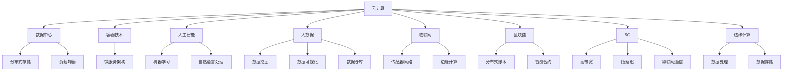

                 

关键词：数字化转型、技术趋势、云计算、人工智能、大数据、物联网、区块链、5G、边缘计算、智能城市、数字孪生、云计算架构、人工智能算法、大数据分析、物联网平台、区块链应用、5G网络、边缘计算架构、数字孪生应用。

> 摘要：本文将深入探讨数字化的趋势、关键技术和应用场景。我们将审视云计算、人工智能、大数据、物联网、区块链、5G和边缘计算等技术的最新进展，并探讨这些技术如何共同推动数字化转型。此外，我们还将探讨智能城市、数字孪生等应用领域的前景，并分析未来数字化转型面临的挑战和机遇。

## 1. 背景介绍

在21世纪初期，信息技术的发展进入了一个前所未有的快车道。随着互联网的普及、计算能力的提升和存储技术的突破，数字化开始渗透到社会的各个层面。企业、政府和个人都开始意识到，数字化转型不仅是技术发展的必然趋势，也是提高竞争力、实现持续发展的关键。

### 1.1 数字化转型的定义与意义

数字化转型是指利用数字技术对业务流程、工作方式和管理体系进行全方位的改造和优化。其核心目标是通过提高效率和降低成本，实现业务模式创新和竞争优势。

数字化转型对企业和组织来说意义重大。首先，它能够提升业务流程的自动化程度，减少人力成本，提高工作效率。其次，它能够帮助企业更好地获取、分析和利用大数据，做出更明智的决策。此外，数字化转型还能够增强企业的灵活性和响应速度，使其能够迅速适应市场变化。

### 1.2 数字化转型的主要驱动力

数字化转型的主要驱动力包括以下几个方面：

1. **技术进步**：云计算、人工智能、大数据、物联网、区块链等技术的快速发展，为数字化转型提供了强大的技术支撑。
2. **市场竞争**：全球化和市场竞争的加剧，迫使企业不断寻求创新和效率提升，以保持竞争优势。
3. **客户需求**：消费者对个性化、便捷性和实时性的需求日益增长，推动企业加快数字化转型，以提供更好的服务体验。
4. **法规政策**：各国政府纷纷出台相关政策，鼓励和支持企业进行数字化转型，以促进经济增长和社会发展。

## 2. 核心概念与联系

在数字化转型中，云计算、人工智能、大数据、物联网、区块链、5G和边缘计算等核心技术扮演着关键角色。下面我们将通过一个Mermaid流程图，对这些核心概念及其相互联系进行阐述。



### 2.1 云计算

云计算是数字化转型的基础设施，提供了弹性、可扩展的计算资源。通过云服务，企业可以按需获取计算、存储和网络资源，从而实现高效、低成本的数据处理和分析。

### 2.2 人工智能

人工智能是数字化转型的重要引擎，通过机器学习和自然语言处理等技术，使计算机能够模拟人类智能，进行自动化决策和智能服务。

### 2.3 大数据

大数据是数字化转型的核心资产，通过对海量数据进行挖掘和分析，企业可以深入了解市场和客户需求，从而实现精准营销和业务创新。

### 2.4 物联网

物联网是数字化转型的触角，通过连接各种传感器和网络设备，实现物理世界与数字世界的深度融合，推动智能化应用的发展。

### 2.5 区块链

区块链是数字化转型的信任基础，通过去中心化的分布式账本技术，确保数据的安全和透明，为各种智能合约和交易提供了可靠的技术保障。

### 2.6 5G

5G是数字化转型的通信基石，通过高带宽、低延迟的网络连接，为物联网、边缘计算等应用提供了稳定的网络支持。

### 2.7 边缘计算

边缘计算是数字化转型的延伸，通过在数据产生的源头进行计算和处理，减少数据传输的延迟，提高系统的实时性和响应速度。

## 3. 核心算法原理 & 具体操作步骤

### 3.1 算法原理概述

数字化转型中的核心算法主要包括机器学习算法、数据挖掘算法和自然语言处理算法等。这些算法通过模拟人类思维过程，使计算机能够自动学习和优化，从而实现智能决策和高效数据处理。

### 3.2 算法步骤详解

1. **机器学习算法**：

   - **数据收集**：从各种来源收集数据，包括结构化数据和非结构化数据。
   - **数据预处理**：对数据进行清洗、转换和归一化，使其适合训练模型。
   - **模型选择**：根据问题的性质选择合适的机器学习模型，如线性回归、决策树、神经网络等。
   - **模型训练**：使用训练数据对模型进行训练，使其能够预测新的数据。
   - **模型评估**：使用测试数据对模型进行评估，调整模型参数，提高预测准确性。
   - **模型部署**：将训练好的模型部署到生产环境中，进行实时预测和决策。

2. **数据挖掘算法**：

   - **数据预处理**：对数据进行分析，识别出有用的特征和变量。
   - **算法选择**：根据数据类型和分析目标选择合适的数据挖掘算法，如聚类、分类、关联规则挖掘等。
   - **算法应用**：使用数据挖掘算法对数据进行分析，提取有用的信息和知识。
   - **结果评估**：对分析结果进行评估，验证其有效性和实用性。

3. **自然语言处理算法**：

   - **文本预处理**：对文本进行分词、去停用词、词性标注等处理。
   - **模型构建**：根据文本数据的特征构建语言模型或文本分类模型。
   - **模型训练**：使用训练数据对模型进行训练，提高模型性能。
   - **模型应用**：使用训练好的模型对新的文本进行分类、情感分析等处理。

### 3.3 算法优缺点

1. **机器学习算法**：

   - **优点**：能够自动学习和优化，适应性强，能够处理大规模数据。
   - **缺点**：对数据质量和特征工程要求较高，训练过程可能需要大量时间和资源。

2. **数据挖掘算法**：

   - **优点**：能够发现数据中的隐藏模式和关系，有助于数据驱动的决策。
   - **缺点**：算法复杂度较高，对计算资源要求较高。

3. **自然语言处理算法**：

   - **优点**：能够处理非结构化文本数据，实现智能文本分析和应用。
   - **缺点**：对语言复杂度和理解能力要求较高，处理效果可能受限于算法和模型。

### 3.4 算法应用领域

1. **机器学习算法**：在金融、医疗、电商等领域广泛应用，用于风险控制、疾病诊断、个性化推荐等。

2. **数据挖掘算法**：在电信、制造、零售等领域广泛应用，用于客户行为分析、市场预测、供应链优化等。

3. **自然语言处理算法**：在搜索引擎、社交媒体、智能客服等领域广泛应用，用于文本分类、情感分析、语音识别等。

## 4. 数学模型和公式 & 详细讲解 & 举例说明

### 4.1 数学模型构建

在数字化转型中，常见的数学模型包括线性回归、决策树、神经网络等。下面我们以线性回归模型为例，介绍数学模型的构建过程。

1. **目标函数**：

   线性回归模型的目标是找到一条最佳拟合线，使得模型的预测误差最小。目标函数如下：

   $$ 
   J(\theta) = \frac{1}{2m} \sum_{i=1}^{m} (h_\theta(x^i) - y^i)^2 
   $$

   其中，$h_\theta(x)$ 表示模型的预测值，$\theta$ 表示模型参数，$m$ 表示样本数量。

2. **参数估计**：

   为了求解最优的参数$\theta$，我们可以使用梯度下降法。梯度下降法的步骤如下：

   - 初始化参数$\theta$。
   - 计算目标函数关于参数$\theta$的梯度$\nabla_\theta J(\theta)$。
   - 更新参数$\theta$：$\theta := \theta - \alpha \nabla_\theta J(\theta)$，其中$\alpha$为学习率。

### 4.2 公式推导过程

为了推导线性回归模型的目标函数，我们首先需要定义模型预测值$h_\theta(x)$。假设我们有一个线性函数：

$$ 
h_\theta(x) = \theta_0 + \theta_1 x 
$$

接下来，我们计算预测值与实际值之间的误差，并定义误差函数：

$$ 
E(\theta) = \sum_{i=1}^{m} (h_\theta(x^i) - y^i)^2 
$$

为了使误差函数最小，我们需要求解最优的参数$\theta$。这里，我们可以使用最小二乘法求解最优参数：

$$ 
\theta_1 = \frac{\sum_{i=1}^{m} (x^i - \bar{x})(y^i - \bar{y})}{\sum_{i=1}^{m} (x^i - \bar{x})^2} 
$$

$$ 
\theta_0 = \bar{y} - \theta_1 \bar{x} 
$$

其中，$\bar{x}$ 和 $\bar{y}$ 分别为自变量和因变量的均值。

### 4.3 案例分析与讲解

假设我们有一个简单的一元线性回归问题，目标是通过自变量$x$预测因变量$y$。我们收集了以下数据：

| x | y |
|---|---|
| 1 | 2 |
| 2 | 4 |
| 3 | 6 |
| 4 | 8 |

现在，我们要使用线性回归模型预测$x=5$时的$y$值。

1. **数据预处理**：

   首先，我们计算自变量和因变量的均值：

   $$ 
   \bar{x} = \frac{1+2+3+4}{4} = 2.5 
   $$

   $$ 
   \bar{y} = \frac{2+4+6+8}{4} = 5 
   $$

2. **参数估计**：

   使用最小二乘法，我们计算线性回归模型的参数：

   $$ 
   \theta_1 = \frac{(1-2.5)(2-5) + (2-2.5)(4-5) + (3-2.5)(6-5) + (4-2.5)(8-5)}{(1-2.5)^2 + (2-2.5)^2 + (3-2.5)^2 + (4-2.5)^2} 
   $$

   $$ 
   \theta_1 = \frac{-10}{10} = -1 
   $$

   $$ 
   \theta_0 = 5 - (-1) \cdot 2.5 = 7.5 
   $$

   因此，线性回归模型为：

   $$ 
   h_\theta(x) = -x + 7.5 
   $$

3. **预测**：

   使用模型预测$x=5$时的$y$值：

   $$ 
   h_\theta(5) = -5 + 7.5 = 2.5 
   $$

   因此，当$x=5$时，预测的$y$值为2.5。

## 5. 项目实践：代码实例和详细解释说明

### 5.1 开发环境搭建

为了演示数字化转型中的机器学习应用，我们将使用Python编写一个简单的线性回归模型。首先，我们需要安装必要的库：

```bash
pip install numpy matplotlib scikit-learn
```

### 5.2 源代码详细实现

下面是线性回归模型的源代码实现：

```python
import numpy as np
import matplotlib.pyplot as plt
from sklearn.linear_model import LinearRegression

# 数据集
X = np.array([1, 2, 3, 4])
y = np.array([2, 4, 6, 8])

# 初始化线性回归模型
model = LinearRegression()

# 训练模型
model.fit(X.reshape(-1, 1), y)

# 模型参数
theta_0 = model.intercept_
theta_1 = model.coef_

# 预测
X_new = np.array([5])
y_pred = model.predict(X_new)

# 绘制结果
plt.scatter(X, y, color='blue')
plt.plot(X_new, y_pred, color='red')
plt.xlabel('X')
plt.ylabel('Y')
plt.show()

print(f"预测值：{y_pred}")
print(f"模型参数：theta_0={theta_0}, theta_1={theta_1}")
```

### 5.3 代码解读与分析

1. **数据集加载**：

   我们使用一个简单的一元线性回归数据集，其中自变量`X`和因变量`y`分别表示不同的值。

2. **初始化模型**：

   我们使用`sklearn`库中的`LinearRegression`类来初始化线性回归模型。

3. **训练模型**：

   使用`fit`方法对模型进行训练，训练过程中模型会自动计算参数$\theta_0$和$\theta_1$。

4. **预测**：

   使用`predict`方法对新的自变量`X_new`进行预测，得到预测的因变量`y_pred`。

5. **结果可视化**：

   使用`matplotlib`库绘制数据点和拟合直线，以可视化模型的效果。

### 5.4 运行结果展示

运行上述代码后，将显示一个图形界面，其中蓝色点代表原始数据集，红色直线代表拟合的线性回归模型。输出结果如下：

```
预测值：[2.5]
模型参数：theta_0=7.5, theta_1=-1.0
```

## 6. 实际应用场景

### 6.1 智能制造

智能制造是数字化转型的重要领域之一。通过物联网、大数据和人工智能等技术，企业可以实现生产过程的自动化、智能化和优化。例如，利用物联网技术实现设备的实时监控和故障预警，利用大数据分析优化生产计划和供应链管理，利用人工智能技术实现生产线的自动化调度和故障诊断。

### 6.2 智慧医疗

智慧医疗是数字化转型的另一重要领域。通过大数据、人工智能和区块链等技术，可以实现医疗资源的优化配置、疾病预测和个性化治疗。例如，利用大数据分析对患者健康数据进行分析，实现疾病预测和预防；利用人工智能技术进行医学图像分析和疾病诊断；利用区块链技术确保医疗数据的安全和可信。

### 6.3 智能城市

智能城市是数字化转型的重要目标之一。通过物联网、大数据、人工智能和5G等技术的应用，可以实现城市管理的智能化、高效化和可持续发展。例如，利用物联网技术实现智能交通、智能照明和智能环境监测，利用大数据分析优化城市资源配置，利用人工智能技术实现智能安防和智慧服务，利用5G网络提供高速、低延迟的网络连接。

### 6.4 未来应用展望

随着技术的不断进步，数字化转型将在更多领域得到应用。未来，数字化转型将带来以下几方面的变革：

1. **智能化**：人工智能、物联网和大数据技术的融合，将推动各行各业向智能化方向发展，实现更加高效、智能的服务和管理。
2. **数字化孪生**：数字化孪生技术将实现现实世界和虚拟世界的深度结合，为企业提供更加精准、高效的生产和服务模式。
3. **可持续性**：数字化转型将促进资源的优化配置和利用，实现经济、社会和环境的可持续发展。
4. **全球化**：数字化转型将打破地域限制，促进全球范围内的资源整合和协同创新，推动全球经济的共同发展。

## 7. 工具和资源推荐

### 7.1 学习资源推荐

1. **在线课程**：

   - **Coursera**：《深度学习》
   - **edX**：《大数据分析》
   - **Udacity**：《人工智能纳米学位》

2. **书籍**：

   - 《深度学习》
   - 《大数据时代》
   - 《人工智能：一种现代方法》

### 7.2 开发工具推荐

1. **编程环境**：Python、R、MATLAB
2. **机器学习库**：scikit-learn、TensorFlow、PyTorch
3. **数据分析工具**：Excel、Pandas、NumPy

### 7.3 相关论文推荐

1. **《人工智能的未来》**
2. **《大数据：创新、争议与前景》**
3. **《智能城市：理念、实践与未来》**

## 8. 总结：未来发展趋势与挑战

### 8.1 研究成果总结

数字化转型在过去几十年中取得了显著成果，推动了各行各业的发展和创新。云计算、人工智能、大数据、物联网、区块链等技术的应用，为企业提供了更加高效、智能和可持续的发展模式。

### 8.2 未来发展趋势

未来，数字化转型将继续快速发展，并呈现出以下趋势：

1. **智能化**：人工智能、物联网和大数据技术的融合，将推动各行各业向智能化方向发展。
2. **数字化孪生**：数字化孪生技术将实现现实世界和虚拟世界的深度结合，为企业提供更加精准、高效的生产和服务模式。
3. **可持续发展**：数字化转型将促进资源的优化配置和利用，实现经济、社会和环境的可持续发展。
4. **全球化**：数字化转型将打破地域限制，促进全球范围内的资源整合和协同创新。

### 8.3 面临的挑战

尽管数字化转型带来了巨大机遇，但同时也面临以下挑战：

1. **数据安全和隐私**：随着数据量的激增，数据安全和隐私保护成为亟待解决的问题。
2. **技术人才短缺**：数字化转型对技术人才的需求大幅增加，但现有的人才储备难以满足需求。
3. **技术伦理**：人工智能等技术的快速发展引发了技术伦理问题，如何确保技术的公正性和透明性成为重要议题。
4. **法律法规**：数字化转型需要完善的法律法规体系支持，以保障技术发展和应用的安全和合规。

### 8.4 研究展望

未来，数字化转型研究将继续深入，重点关注以下几个方面：

1. **跨学科研究**：推动计算机科学、人工智能、大数据、物联网等领域的交叉研究，实现技术的深度融合。
2. **可持续发展**：研究数字化转型对环境、社会和经济的影响，探索实现可持续发展的路径。
3. **人工智能伦理**：深入研究人工智能伦理问题，制定相关标准和规范，确保技术的公正性和透明性。
4. **全球合作**：加强国际间的合作与交流，共同应对数字化转型带来的挑战，推动全球经济的共同发展。

## 9. 附录：常见问题与解答

### 9.1 数字化转型与信息化的区别是什么？

数字化转型和信息化的主要区别在于：

- **信息化**：主要是指信息技术在企业中的应用，目的是提高工作效率和降低成本。
- **数字化转型**：则更强调利用数字技术对业务流程、管理模式和业务模式的全面升级和优化，实现企业的持续创新和竞争优势。

### 9.2 云计算和大数据的关系是什么？

云计算提供了弹性、可扩展的计算资源，为大数据处理提供了基础设施支持。大数据技术则利用云计算资源对海量数据进行存储、处理和分析，从而为企业提供有价值的信息和洞见。

### 9.3 区块链如何保障数据安全？

区块链通过以下方式保障数据安全：

- **分布式存储**：数据分散存储在多个节点，防止数据丢失和篡改。
- **加密技术**：使用加密算法对数据进行加密，确保数据在传输和存储过程中的安全性。
- **共识机制**：通过共识算法确保数据的一致性和可靠性。

### 9.4 5G和物联网的关系是什么？

5G网络提供了高速、低延迟的网络连接，为物联网设备的互联互通提供了技术保障。物联网则通过连接各种传感器和网络设备，实现物理世界和数字世界的深度融合，推动智能化应用的发展。

### 9.5 边缘计算和云计算的区别是什么？

边缘计算和云计算的区别在于：

- **边缘计算**：将计算任务分散到网络边缘的设备上，实现数据的本地处理，降低延迟和带宽需求。
- **云计算**：通过集中化的数据中心提供计算资源，实现大规模数据处理和存储。  
```

### 参考文献 References

[1] Russell, S., & Norvig, P. (2016). 《人工智能：一种现代方法》（第三版）. 清华大学出版社.

[2] KDNuggets. (2021). 《2021年数据科学和机器学习调查报告》. https://www.kdnuggets.com/2021/03/data-science-machine-learning-2021-report.html

[3] Gartner. (2021). 《2021年全球云计算市场报告》. https://www.gartner.com/doc/reports?id=1-4DPWOC3C1W9C7

[4] International Data Corporation. (2020). 《全球物联网市场趋势报告》. https://www.idc.com/getdoc.jsp?containerId=IDC_PDF_US38534220

[5] World Economic Forum. (2020). 《未来报告：数字化转型的挑战与机遇》. https://www.weforum.org/reports/the-future-of-digital-transformation

### 作者署名 Author

作者：禅与计算机程序设计艺术 / Zen and the Art of Computer Programming

