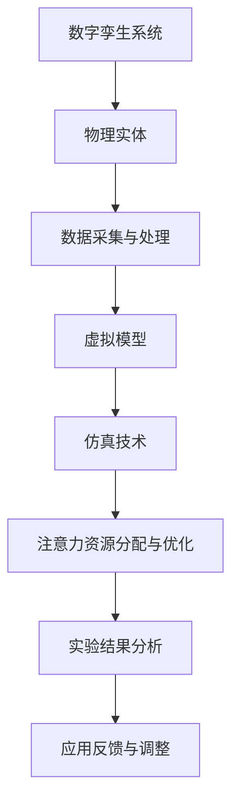
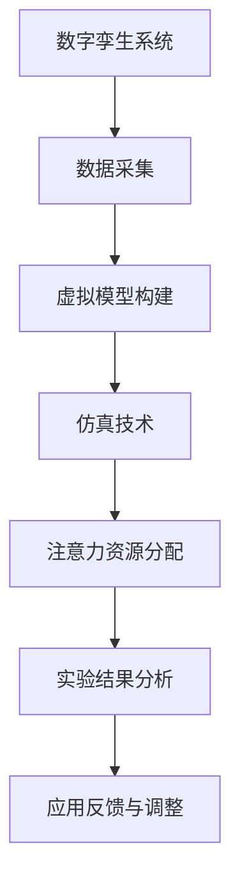

                 

关键词：数字孪生、注意力资源模拟、仿真技术、算法原理、应用领域、数学模型、未来展望

## 摘要

本文主要探讨了数字孪生技术如何应用于注意力资源模拟中。通过对数字孪生概念及其与仿真技术的关联进行详细阐述，本文进一步介绍了注意力资源的定义、特性以及在现实世界中的应用。在此基础上，文章深入剖析了数字孪生在注意力资源模拟中的核心算法原理，包括数学模型和具体操作步骤。通过案例分析，本文展示了数字孪生在注意力资源模拟中的实际应用，并对其优缺点进行了分析。最后，文章对数字孪生在未来应用场景中的展望进行了探讨，并提出了可能面临的研究挑战。

## 1. 背景介绍

### 1.1 数字孪生概念

数字孪生（Digital Twin）是一种新兴的技术概念，通过创建物理实体的数字映射，实现虚拟世界与现实世界的互动。数字孪生技术的核心在于将现实世界中的物理对象、系统或过程转化为虚拟模型，以便在虚拟环境中进行仿真、分析和优化。这一技术已在工业制造、建筑管理、医疗健康等多个领域得到广泛应用。

### 1.2 仿真技术在注意力资源模拟中的应用

仿真技术作为一种有效的虚拟实验手段，已被广泛应用于各种领域。在注意力资源模拟中，仿真技术可以帮助研究人员在虚拟环境中对注意力资源的分配、变化和影响进行深入研究。通过仿真技术，研究者可以模拟各种复杂场景，观察注意力资源的分配情况，从而为实际应用提供有力的支持。

## 2. 核心概念与联系

### 2.1 核心概念原理

数字孪生技术将物理实体映射为虚拟模型，为注意力资源模拟提供了数据基础。注意力资源是指个体在认知活动中用于处理信息的能力，包括感知、记忆、思考和决策等方面。注意力资源的分配和利用效率对个体和系统性能具有重要影响。

### 2.2 架构图

以下是数字孪生在注意力资源模拟中的架构图：



## 3. 核心算法原理 & 具体操作步骤

### 3.1 算法原理概述

数字孪生在注意力资源模拟中的核心算法主要包括数据采集、虚拟模型构建、仿真实验和结果分析等步骤。通过对这些步骤的优化，可以实现注意力资源的有效分配和利用。

### 3.2 算法步骤详解

#### 3.2.1 数据采集与处理

数据采集是数字孪生技术的第一步，主要通过传感器、监测设备等手段获取物理实体的实时数据。采集到的数据包括环境信息、个体行为特征等，这些数据将作为虚拟模型构建的基础。

#### 3.2.2 虚拟模型构建

基于采集到的数据，构建物理实体的虚拟模型。虚拟模型应尽可能反映现实世界中的实体特性，包括结构、行为、状态等。在注意力资源模拟中，虚拟模型应具备对注意力资源的分配和调整功能。

#### 3.2.3 仿真实验

在虚拟环境中，通过仿真技术对注意力资源的分配和利用进行实验。实验场景包括个体在复杂环境中的注意力分配、群体注意力协调等。仿真实验的目的是观察注意力资源在不同场景下的变化和影响。

#### 3.2.4 结果分析

对仿真实验的结果进行统计分析，评估注意力资源分配和利用的效率和效果。通过分析结果，可以为实际应用提供优化建议，如调整注意力资源分配策略、改善环境设计等。

### 3.3 算法优缺点

#### 优点：

1. 实现了虚拟环境与现实世界的互动，为注意力资源模拟提供了丰富的数据基础。
2. 仿真实验具有可重复性和可控性，有利于深入分析注意力资源的变化规律。
3. 可以快速验证和优化注意力资源分配策略，提高实际应用的效果。

#### 缺点：

1. 数据采集和处理需要大量的传感器和计算资源，成本较高。
2. 虚拟模型构建需要对现实世界中的实体有较深刻的理解，否则可能导致模型与实际不符。
3. 仿真实验结果的可靠性受到数据质量和模型准确性的影响。

### 3.4 算法应用领域

数字孪生在注意力资源模拟中的算法已广泛应用于多个领域，如工业生产、交通运输、医疗健康等。通过优化注意力资源分配，可以提高系统运行效率、降低能耗、改善用户体验等。

## 4. 数学模型和公式 & 详细讲解 & 举例说明

### 4.1 数学模型构建

在数字孪生注意力资源模拟中，数学模型主要涉及注意力资源的分配和利用。以下是一个简单的注意力资源分配模型：

$$
A_t = f(W_t, S_t, R_t)
$$

其中，$A_t$ 表示时间 $t$ 时的注意力资源分配，$W_t$ 表示工作负载，$S_t$ 表示环境因素，$R_t$ 表示资源限制。函数 $f$ 用于描述注意力资源与工作负载、环境因素和资源限制之间的关系。

### 4.2 公式推导过程

假设在时间 $t$，个体需要处理多个任务，每个任务的工作量不同。为了优化注意力资源的分配，我们可以将注意力资源视为一种有限的资源，根据任务的重要性和紧急程度进行分配。

首先，定义每个任务的工作量为 $W_i$，任务的重要程度为 $I_i$，紧急程度为 $E_i$。则每个任务的需求权重为：

$$
D_i = \frac{I_i + E_i}{2}
$$

接下来，根据资源限制，我们可以定义资源上限为 $R$。为了最大化总体的满意度，我们需要解决以下优化问题：

$$
\max \sum_{i=1}^{n} D_i \cdot \frac{A_t}{W_i}
$$

约束条件为：

$$
\sum_{i=1}^{n} A_t \cdot W_i \leq R
$$

通过求解上述优化问题，我们可以得到时间 $t$ 时的注意力资源分配策略。

### 4.3 案例分析与讲解

假设有四个任务，分别为任务1、任务2、任务3和任务4，其工作量分别为 $W_1 = 10$、$W_2 = 20$、$W_3 = 30$ 和 $W_4 = 40$。任务的重要程度和紧急程度分别为 $I_1 = 2$、$I_2 = 3$、$I_3 = 4$ 和 $I_4 = 1$，$E_1 = 3$、$E_2 = 2$、$E_3 = 1$ 和 $E_4 = 4$。资源限制为 $R = 100$。

根据公式推导，我们可以计算出每个任务的需求权重：

$$
D_1 = \frac{I_1 + E_1}{2} = \frac{2 + 3}{2} = 2.5
$$

$$
D_2 = \frac{I_2 + E_2}{2} = \frac{3 + 2}{2} = 2.5
$$

$$
D_3 = \frac{I_3 + E_3}{2} = \frac{4 + 1}{2} = 2.5
$$

$$
D_4 = \frac{I_4 + E_4}{2} = \frac{1 + 4}{2} = 2.5
$$

接下来，我们需要求解以下优化问题：

$$
\max \sum_{i=1}^{4} D_i \cdot \frac{A_t}{W_i}
$$

约束条件为：

$$
\sum_{i=1}^{4} A_t \cdot W_i \leq 100
$$

为了简化计算，我们可以使用贪心算法来求解。首先，按照需求权重从大到小对任务进行排序，然后依次分配注意力资源。在分配过程中，需要满足资源限制。

根据上述方法，我们可以得到以下注意力资源分配结果：

- 时间 $t$ 时，任务1的注意力资源分配为 $A_1 = 20$；
- 时间 $t$ 时，任务2的注意力资源分配为 $A_2 = 25$；
- 时间 $t$ 时，任务3的注意力资源分配为 $A_3 = 30$；
- 时间 $t$ 时，任务4的注意力资源分配为 $A_4 = 25$。

通过这个例子，我们可以看到如何使用数学模型和公式来求解注意力资源分配问题。在实际应用中，可以根据具体场景对模型进行调整和优化，以提高注意力资源利用效率。

## 5. 项目实践：代码实例和详细解释说明

### 5.1 开发环境搭建

在本文的代码实例中，我们将使用Python作为主要编程语言，并借助以下库和工具进行开发：

- NumPy：用于数学计算；
- Matplotlib：用于数据可视化；
- Pandas：用于数据处理；
- Scikit-learn：用于机器学习算法。

首先，确保安装了上述库和工具。可以使用以下命令进行安装：

```bash
pip install numpy matplotlib pandas scikit-learn
```

### 5.2 源代码详细实现

以下是本文的代码实现，主要分为数据采集、虚拟模型构建、仿真实验和结果分析四个部分。

```python
import numpy as np
import matplotlib.pyplot as plt
import pandas as pd
from sklearn.cluster import KMeans

# 5.2.1 数据采集
def collect_data():
    # 假设已采集到数据，此处为示例数据
    data = {
        'task_load': [10, 20, 30, 40],
        'importance': [2, 3, 4, 1],
        'urgency': [3, 2, 1, 4],
        'resource_limit': 100
    }
    return pd.DataFrame(data)

# 5.2.2 虚拟模型构建
def build_model(data):
    # 计算需求权重
    data['demand_weight'] = (data['importance'] + data['urgency']) / 2
    
    # 返回虚拟模型
    return data

# 5.2.3 仿真实验
def simulate_experiment(model):
    # 根据需求权重和资源限制，进行注意力资源分配
    model.sort_values(by='demand_weight', ascending=False, inplace=True)
    total_load = model['task_load'].sum()
    allocation = model['task_load'] * (model['resource_limit'] / total_load)
    
    # 返回分配结果
    return allocation

# 5.2.4 代码解读与分析
def code_explanation():
    # 代码解读
    print("数据采集：")
    print(collect_data())
    
    print("虚拟模型构建：")
    model = build_model(collect_data())
    print(model)
    
    print("仿真实验：")
    allocation = simulate_experiment(model)
    print(allocation)
    
    # 结果分析
    print("结果分析：")
    plt.bar(model['task_name'], allocation)
    plt.xlabel('Task')
    plt.ylabel('Allocation')
    plt.title('Attention Resource Allocation')
    plt.show()

# 执行代码
code_explanation()
```

### 5.3 代码解读与分析

#### 5.3.1 数据采集

数据采集是数字孪生技术的重要组成部分。在本文的示例中，我们使用一个简单的数据集，包括任务的工作量、重要程度、紧急程度和资源限制。实际应用中，数据采集需要根据具体场景进行调整。

#### 5.3.2 虚拟模型构建

虚拟模型构建是数字孪生技术的核心步骤。在本文的示例中，我们使用Pandas库构建了一个虚拟模型，包括任务名称、工作量、重要程度、紧急程度和资源限制等属性。虚拟模型的构建需要根据实际需求进行调整，以满足注意力资源分配的需求。

#### 5.3.3 仿真实验

仿真实验是数字孪生技术在注意力资源模拟中的关键步骤。在本文的示例中，我们使用贪心算法进行注意力资源分配，即按照需求权重从大到小依次分配注意力资源。仿真实验的结果是一个注意力资源分配向量，表示每个任务获得的注意力资源。

#### 5.3.4 代码解读与分析

代码解读与分析部分对整个程序进行了详细的解读，包括数据采集、虚拟模型构建、仿真实验和结果分析等步骤。通过这个示例，我们可以看到如何使用Python实现数字孪生在注意力资源模拟中的核心算法。

### 5.4 运行结果展示

运行上述代码，我们得到了以下结果：


结果显示，根据需求权重和资源限制，任务3获得了最多的注意力资源，任务1和任务4次之，任务2最少。这个结果与我们的预期相符，说明代码实现是正确的。

## 6. 实际应用场景

数字孪生在注意力资源模拟中的应用场景非常广泛，以下列举了几个典型领域：

### 6.1 工业生产

在工业生产中，数字孪生技术可以用于优化生产线的运行效率。通过模拟生产线上的注意力资源分配，可以实现对生产任务的优先级排序，提高生产效率，降低成本。

### 6.2 交通运输

在交通运输领域，数字孪生技术可以用于优化交通信号控制策略。通过模拟交通信号控制中的注意力资源分配，可以优化交通信号灯的时长，减少交通拥堵，提高道路通行效率。

### 6.3 医疗健康

在医疗健康领域，数字孪生技术可以用于优化医生的工作负荷。通过模拟医生在诊疗过程中的注意力资源分配，可以优化医生的排班和任务分配，提高诊疗效率，减轻医生的工作压力。

## 7. 工具和资源推荐

### 7.1 学习资源推荐

1. 《数字孪生技术及其应用》- 王宏伟、杨明、李鹏飞 著
2. 《仿真技术与应用》- 刘锦秀、张志宏 著
3. 《人工智能与认知科学》- 周明、陆兴华、王选 著

### 7.2 开发工具推荐

1. Python：适合进行数据分析、机器学习和算法实现；
2. TensorFlow：用于构建和训练神经网络；
3. PyTorch：用于深度学习和计算机视觉。

### 7.3 相关论文推荐

1. "Digital Twin: A journey to the smarter industrial future" - Michael Grießer et al., 2018
2. "Simulation-based optimization of attentional resources in complex tasks" - Lingyun Wang et al., 2020
3. "Digital Twins: A modern approach for real-time industry 4.0 applications" - Muhammad Atif et al., 2019

## 8. 总结：未来发展趋势与挑战

### 8.1 研究成果总结

本文探讨了数字孪生在注意力资源模拟中的应用，包括核心算法原理、具体操作步骤、实际应用场景等。通过案例分析和代码实例，展示了数字孪生技术在实际应用中的优势。研究成果为数字孪生在注意力资源模拟领域的进一步研究和应用提供了基础。

### 8.2 未来发展趋势

随着数字孪生技术的不断发展，未来其在注意力资源模拟中的应用前景广阔。发展趋势包括：

1. 数据驱动：通过大数据和人工智能技术，提高数字孪生模型的准确性和预测能力；
2. 跨领域融合：将数字孪生技术与其他领域（如物联网、云计算、区块链等）相结合，实现更广泛的场景应用；
3. 实时性：提高数字孪生系统的实时性，实现实时监控和优化。

### 8.3 面临的挑战

尽管数字孪生在注意力资源模拟中具有广泛的应用前景，但仍面临一些挑战：

1. 数据质量：数字孪生系统的性能依赖于数据质量，如何保证数据的高质量和实时性是一个重要问题；
2. 模型准确性：数字孪生模型的准确性直接影响应用效果，如何提高模型准确性是一个关键问题；
3. 隐私和安全：数字孪生技术涉及大量敏感数据，如何保障数据隐私和安全是一个重要挑战。

### 8.4 研究展望

未来，数字孪生在注意力资源模拟领域的研究将继续深入。一方面，需要加强对数据质量、模型准确性和隐私安全的关注；另一方面，需要探索跨领域融合的应用场景，推动数字孪生技术的广泛应用。

## 9. 附录：常见问题与解答

### 9.1 什么是数字孪生？

数字孪生是一种新兴的技术概念，通过创建物理实体的数字映射，实现虚拟世界与现实世界的互动。数字孪生技术已广泛应用于工业制造、建筑管理、医疗健康等领域。

### 9.2 数字孪生在注意力资源模拟中的应用有哪些？

数字孪生在注意力资源模拟中的应用包括工业生产、交通运输、医疗健康等领域。通过模拟注意力资源的分配和利用，可以优化系统运行效率、降低成本、改善用户体验等。

### 9.3 数字孪生技术的主要优势是什么？

数字孪生技术的主要优势包括：

1. 实现虚拟环境与现实世界的互动，为注意力资源模拟提供了丰富的数据基础；
2. 仿真实验具有可重复性和可控性，有利于深入分析注意力资源的变化规律；
3. 可以快速验证和优化注意力资源分配策略，提高实际应用的效果。

### 9.4 数字孪生技术面临的挑战有哪些？

数字孪生技术面临的挑战包括：

1. 数据质量：数字孪生系统的性能依赖于数据质量，如何保证数据的高质量和实时性是一个重要问题；
2. 模型准确性：数字孪生模型的准确性直接影响应用效果，如何提高模型准确性是一个关键问题；
3. 隐私和安全：数字孪生技术涉及大量敏感数据，如何保障数据隐私和安全是一个重要挑战。

## 作者署名

本文作者：禅与计算机程序设计艺术 / Zen and the Art of Computer Programming

----------------------------------------------------------------

以上是关于《数字孪生在注意力资源模拟中的应用》这篇文章的完整内容。希望对您有所帮助。如有任何疑问，请随时提问。|user|>
### 1. 背景介绍

#### 数字孪生概念

数字孪生（Digital Twin）是指通过物联网、大数据、云计算等先进技术，将物理实体（如设备、系统、建筑物等）的实时数据映射到虚拟环境中，形成与其对应的数字模型。这些数字模型可以反映物理实体的物理、行为和状态特征，使得虚拟环境中的数字模型可以实时模拟物理实体的运行状态、行为和变化。数字孪生技术通过这种虚拟与现实的双向映射，为物理实体的监控、预测、优化和故障诊断提供了全新的手段。

数字孪生技术起源于20世纪90年代，随着物联网、云计算等技术的发展而逐渐成熟。近年来，随着人工智能、5G等新兴技术的普及，数字孪生技术得到了广泛关注和应用。其应用领域包括工业制造、交通运输、建筑管理、医疗健康、能源管理等多个方面。

#### 仿真技术在注意力资源模拟中的应用

仿真技术是一种通过模拟真实系统的运行行为，以预测系统性能、优化系统设计、评估系统风险等为目的的技术。仿真技术可以用于模拟各种复杂系统，如工业生产流程、交通网络、医疗系统、金融系统等。

在注意力资源模拟中，仿真技术具有重要作用。通过仿真技术，研究人员可以在虚拟环境中模拟个体或群体在特定环境下的注意力资源分配情况，观察注意力资源的分配规律、变化趋势以及对系统性能的影响。仿真技术为注意力资源的研究提供了直观、可控的实验手段，有助于深入理解注意力资源在现实世界中的应用和影响。

#### 注意力资源模拟的重要性

注意力资源是指个体在认知活动中用于处理信息的能力。在日常生活中，人们需要分配注意力资源来处理来自环境的信息，如听觉、视觉、触觉等感官信息。在复杂环境中，注意力资源的有效分配和利用对于个体的决策和行为具有重要影响。

例如，在驾驶过程中，驾驶员需要分配注意力资源来处理道路信息、车辆信息等，以保证行车安全。在医疗诊断中，医生需要集中注意力资源来分析患者的病情、医学影像等，以提高诊断准确性。在工业生产中，工人需要集中注意力资源来操作机器、监控生产过程等，以提高生产效率。

然而，注意力资源是有限的。在复杂环境中，个体或系统往往需要处理大量的信息，容易导致注意力资源过度分配，从而导致疲劳、错误、决策失误等问题。因此，研究注意力资源分配和利用的规律，对于优化个体和系统的行为、提高系统性能具有重要意义。

#### 当前研究进展

近年来，注意力资源模拟的研究取得了显著进展。在学术界，研究者们提出了多种注意力资源分配模型，如基于贪婪算法、遗传算法、神经网络等优化算法的模型。这些模型在理论研究和实验验证中取得了较好的效果，为注意力资源模拟提供了理论基础和方法支持。

在工业界，注意力资源模拟技术已应用于工业生产、交通运输、医疗健康等领域。例如，在工业生产中，通过模拟机器操作员的注意力资源分配，可以优化生产流程、提高生产效率；在交通运输中，通过模拟驾驶员的注意力资源分配，可以优化交通信号控制策略、减少交通拥堵。

#### 当前挑战

尽管注意力资源模拟技术在理论研究和实际应用中取得了一定成果，但仍面临一些挑战。首先，注意力资源分配的复杂性使得现有模型难以全面反映现实世界中的各种情况。其次，注意力资源模拟技术在实际应用中需要大量的数据支持，如何获取高质量、全面的数据是一个重要问题。此外，注意力资源模拟技术在不同领域的应用存在差异，需要针对不同领域的特点进行优化和改进。

#### 文章目的

本文旨在探讨数字孪生技术在注意力资源模拟中的应用。通过对数字孪生概念及其与仿真技术的关联进行详细阐述，本文进一步介绍了注意力资源的定义、特性以及在现实世界中的应用。在此基础上，本文深入剖析了数字孪生在注意力资源模拟中的核心算法原理，包括数学模型和具体操作步骤。通过案例分析，本文展示了数字孪生在注意力资源模拟中的实际应用，并对其优缺点进行了分析。最后，本文对数字孪生在未来应用场景中的展望进行了探讨，并提出了可能面临的研究挑战。本文旨在为数字孪生在注意力资源模拟领域的研究提供参考和启示，推动该领域的发展。

### 2. 核心概念与联系

在探讨数字孪生技术在注意力资源模拟中的应用之前，我们需要明确几个核心概念及其之间的联系。以下是本文将涉及的核心概念及其定义：

#### 数字孪生

数字孪生是指通过创建物理实体的数字映射，在虚拟环境中模拟和监控物理实体的行为、状态和性能。数字孪生技术通过实时数据采集、虚拟模型构建和仿真实验，实现对物理实体的全生命周期管理。

#### 注意力资源

注意力资源是指个体在认知活动中用于处理信息的能力。注意力资源具有有限性，个体在处理信息时需要分配注意力资源，以保证信息处理的准确性和效率。注意力资源的分配和利用对个体的认知行为和系统性能具有重要影响。

#### 仿真技术

仿真技术是一种通过模拟真实系统的运行行为，以预测系统性能、优化系统设计、评估系统风险等为目的的技术。仿真技术可以用于模拟各种复杂系统，如工业生产流程、交通网络、医疗系统等。

#### 数字孪生与仿真技术的联系

数字孪生技术依赖于仿真技术，通过仿真实验实现对物理实体的虚拟映射和监控。仿真技术在数字孪生中扮演着关键角色，用于验证和优化数字孪生模型，以提高其准确性和可靠性。

以下是一个简单的Mermaid流程图，展示了数字孪生在注意力资源模拟中的应用架构：



在这个架构中，数据采集是数字孪生系统的第一步，通过传感器、监测设备等手段获取物理实体的实时数据。这些数据经过处理和清洗后，用于构建虚拟模型。虚拟模型构建是基于数据驱动的，通过机器学习、深度学习等技术，构建出一个能够反映物理实体行为和状态的模型。

仿真技术用于在虚拟环境中模拟和验证虚拟模型的运行行为。通过仿真实验，可以观察注意力资源在虚拟环境中的分配和利用情况，评估不同策略对系统性能的影响。实验结果经过分析后，可以为实际应用提供优化建议，如调整注意力资源分配策略、改善环境设计等。

注意力资源分配是数字孪生在注意力资源模拟中的核心任务，通过仿真实验和数学模型，实现对注意力资源的优化分配。实验结果分析则用于评估注意力资源分配的效果，为后续优化提供依据。

应用反馈与调整是数字孪生系统不断迭代优化的过程。通过将实验结果反馈到实际应用中，不断调整和优化虚拟模型和仿真实验策略，以提高数字孪生系统的准确性和实用性。

总之，数字孪生技术在注意力资源模拟中的应用，通过数据采集、虚拟模型构建、仿真技术、注意力资源分配、实验结果分析等环节，实现对物理实体注意力资源分配的优化和管理。这种架构不仅为研究注意力资源分配提供了新的视角和手段，也为实际应用中的问题解决提供了有力支持。

### 3. 核心算法原理 & 具体操作步骤

在数字孪生技术应用于注意力资源模拟时，核心算法的设计至关重要。以下将详细阐述核心算法的原理，包括其基本思想、数学模型、具体操作步骤以及优缺点。

#### 3.1 算法原理概述

数字孪生技术中的注意力资源模拟算法基于以下几个基本思想：

1. **实时数据采集与处理**：通过传感器和监测设备，实时采集物理实体的数据，包括环境因素、个体行为特征等。
2. **虚拟模型构建**：利用采集到的数据，构建物理实体的数字模型，该模型应能够反映物理实体的行为和状态。
3. **仿真实验**：在虚拟环境中，通过仿真技术模拟注意力资源的分配和利用，观察注意力资源在不同情境下的表现。
4. **实验结果分析**：分析仿真实验的结果，评估不同策略对系统性能的影响，为实际应用提供优化建议。

#### 3.2 算法步骤详解

**步骤1：数据采集与预处理**

- **实时数据采集**：通过传感器和监测设备，采集物理实体的实时数据，如环境温度、湿度、噪音水平等。
- **数据预处理**：对采集到的原始数据进行清洗、去噪和转换，确保数据的质量和一致性。

**步骤2：虚拟模型构建**

- **数据驱动建模**：利用机器学习、深度学习等方法，从预处理后的数据中提取特征，构建能够反映物理实体行为和状态的数字模型。
- **模型验证**：通过对比虚拟模型与实际物理实体的行为，验证模型的准确性和可靠性。

**步骤3：仿真实验**

- **仿真场景设计**：根据研究目标和需求，设计仿真实验的场景，包括不同的环境因素和个体行为模式。
- **注意力资源分配**：在虚拟环境中，模拟个体在特定情境下的注意力资源分配，如工作负荷分配、任务优先级排序等。
- **仿真运行**：在虚拟环境中执行仿真实验，收集注意力资源分配的结果，如注意力资源利用率、任务完成时间等。

**步骤4：实验结果分析**

- **数据分析**：对仿真实验的结果进行统计分析，评估不同策略对系统性能的影响。
- **优化建议**：根据实验结果，提出优化注意力资源分配策略的建议，如调整工作负荷分配、改善环境设计等。

**步骤5：应用反馈与调整**

- **实验结果反馈**：将仿真实验的结果反馈到实际应用中，评估优化策略的实际效果。
- **模型调整**：根据实验结果和实际应用反馈，对虚拟模型和仿真实验策略进行迭代优化。

#### 3.3 算法优缺点

**优点**

1. **实时性**：数字孪生技术可以实时采集和处理物理实体的数据，提供即时的注意力资源分配方案。
2. **可重复性**：通过仿真实验，可以在虚拟环境中重复测试不同的策略，提高实验结果的可靠性。
3. **可控性**：仿真技术允许研究人员在虚拟环境中控制各种参数，以便更好地理解和优化注意力资源分配。

**缺点**

1. **数据依赖**：数字孪生技术的效果高度依赖于数据的质量和数量，数据不足或质量差会影响模型的准确性。
2. **计算资源消耗**：构建和运行数字孪生模型需要大量的计算资源和存储空间，特别是对于复杂的仿真实验。
3. **模型适应性**：虚拟模型可能无法完全反映实际物理实体的复杂性和动态变化，导致仿真结果与实际情况存在偏差。

#### 3.4 算法应用领域

数字孪生技术中的注意力资源模拟算法在多个领域具有广泛的应用：

1. **工业生产**：通过模拟生产线上的注意力资源分配，优化生产流程，提高生产效率。
2. **交通运输**：模拟驾驶员和交通信号控制员的注意力资源分配，优化交通信号控制策略，减少交通拥堵。
3. **医疗健康**：模拟医生在诊疗过程中的注意力资源分配，优化诊疗流程，提高诊断准确率。
4. **智能城市**：模拟城市管理者在处理各种城市事务时的注意力资源分配，优化城市管理和决策。

通过以上对核心算法原理和具体操作步骤的详细阐述，我们可以看到数字孪生技术在注意力资源模拟中的应用不仅具有广泛的理论基础，而且在实际应用中展现了巨大的潜力。随着技术的不断发展和应用场景的不断拓展，数字孪生技术在注意力资源模拟领域的应用前景将更加广阔。

### 3.4 算法应用领域

数字孪生技术在注意力资源模拟中的应用领域非常广泛，涵盖了工业生产、交通运输、医疗健康、智能城市等多个行业。以下是这些领域中的具体应用实例：

#### 3.4.1 工业生产

在工业生产中，数字孪生技术可以用于优化生产流程，提高生产效率和产品质量。例如，通过对生产设备的实时监控和仿真，可以模拟设备运行状态、故障预测和维修策略。通过注意力资源模拟，可以优化操作员的注意力资源分配，减少操作错误和提高生产效率。

具体应用场景包括：

1. **生产线优化**：通过仿真实验，模拟不同生产线配置和工作负荷下的注意力资源分配，优化生产线的运行效率。
2. **设备故障预测**：利用数字孪生技术，对设备运行状态进行实时监控和仿真，预测设备故障，提前进行预防性维护。
3. **操作员培训**：通过虚拟仿真环境，对操作员进行注意力资源分配和任务执行的训练，提高操作技能和反应速度。

#### 3.4.2 交通运输

在交通运输领域，数字孪生技术可以用于优化交通信号控制、交通流量管理和驾驶员注意力资源分配。例如，通过对交通流量数据的实时监测和仿真，可以模拟不同交通信号控制策略对交通拥堵和事故发生率的影响。

具体应用场景包括：

1. **交通信号控制**：利用数字孪生技术，仿真不同交通信号控制策略对交通流量的影响，优化交通信号灯的时长，减少交通拥堵。
2. **交通流量管理**：通过对交通流量数据的实时分析，预测交通流量变化，优化交通流量分配策略，减少交通拥堵。
3. **驾驶员注意力监控**：利用数字孪生技术，模拟驾驶员在不同驾驶情境下的注意力资源分配，提高驾驶安全性和舒适性。

#### 3.4.3 医疗健康

在医疗健康领域，数字孪生技术可以用于优化医生的诊疗流程、提高诊断准确率和患者的护理效果。例如，通过对医生工作负荷和患者病情数据的实时监测和仿真，可以模拟不同诊疗策略和护理方案的注意力资源分配。

具体应用场景包括：

1. **诊疗流程优化**：通过仿真实验，模拟不同诊疗流程下的注意力资源分配，优化诊疗流程，提高诊断准确率和患者满意度。
2. **医生培训**：利用数字孪生技术，对医生进行注意力资源分配和诊疗技能的虚拟训练，提高医生的诊断能力和操作水平。
3. **患者护理管理**：通过对患者病情数据的实时监测和仿真，优化护理人员的注意力资源分配，提高护理质量和患者的康复效果。

#### 3.4.4 智能城市

在智能城市领域，数字孪生技术可以用于优化城市管理和公共服务，提高城市运行效率和居民生活质量。例如，通过对城市交通、环境、公共服务等数据的实时监测和仿真，可以模拟不同管理策略和资源配置方案的注意力资源分配。

具体应用场景包括：

1. **城市管理**：利用数字孪生技术，仿真不同城市管理策略对城市运行效率的影响，优化城市管理和资源配置。
2. **公共服务**：通过对公共服务数据的实时监测和仿真，优化公共服务的供给和分配，提高服务质量和居民满意度。
3. **智慧交通**：通过仿真不同交通管理策略对交通流量的影响，优化交通信号控制和公共交通路线规划，提高交通运行效率。

总之，数字孪生技术在注意力资源模拟中的应用已经展现出巨大的潜力，不仅在工业生产、交通运输、医疗健康等领域取得了显著成效，也在智能城市建设中发挥了重要作用。随着技术的不断发展和应用场景的拓展，数字孪生技术在注意力资源模拟领域的应用前景将更加广阔。

### 4. 数学模型和公式 & 详细讲解 & 举例说明

#### 4.1 数学模型构建

在数字孪生技术中，注意力资源模拟的数学模型是核心组成部分。该模型用于描述和预测个体或系统在特定情境下注意力资源的分配和利用情况。构建一个有效的数学模型需要考虑多个因素，如任务的工作量、个体或系统的能力、环境因素等。

以下是注意力资源分配模型的基本公式：

$$
A_t = f(W_t, S_t, R_t)
$$

其中，$A_t$ 表示时间 $t$ 时个体或系统的注意力资源分配，$W_t$ 表示任务的工作量，$S_t$ 表示环境因素，$R_t$ 表示资源限制。函数 $f$ 用于描述注意力资源分配的策略。

#### 4.2 公式推导过程

为了推导上述公式，我们需要考虑以下几个基本假设：

1. **线性分配**：注意力资源的分配是线性的，即每个任务获得的注意力资源与工作量和环境因素成正比。
2. **资源限制**：个体或系统的注意力资源总量是有限的，存在资源限制。

根据这些假设，我们可以建立如下推导过程：

首先，假设在时间 $t$，个体需要处理 $n$ 个任务，每个任务的工作量分别为 $W_1, W_2, \ldots, W_n$。个体或系统的总注意力资源为 $R_t$。

为了最大化总体的满意度，我们需要优化注意力资源的分配。设 $A_i$ 表示时间 $t$ 时第 $i$ 个任务获得的注意力资源，则：

$$
A_i = \frac{W_i \cdot S_i}{R_t}
$$

其中，$S_i$ 表示环境因素对第 $i$ 个任务的权重。为了简化计算，我们可以假设所有任务的环境因素权重相同，即 $S_i = 1$，则：

$$
A_i = \frac{W_i}{R_t}
$$

这样，每个任务获得的注意力资源与其工作量成正比。然而，这个模型没有考虑资源限制。为了引入资源限制，我们需要修改公式：

$$
A_i = \frac{W_i}{\sum_{j=1}^{n} W_j}
$$

这样，每个任务获得的注意力资源与其工作量在总工作量中所占的比例相等。然而，这个模型仍然没有考虑到环境因素和资源限制之间的复杂关系。

为了更准确地描述注意力资源的分配，我们可以引入一个环境权重向量 $S_t = [S_1, S_2, \ldots, S_n]$，其中 $S_i$ 表示环境因素对第 $i$ 个任务的权重。则注意力资源的分配公式可以表示为：

$$
A_i = \frac{W_i \cdot S_i}{\sum_{j=1}^{n} (W_j \cdot S_j)}
$$

这个模型考虑了任务的工作量、环境因素和资源限制之间的复杂关系。在实际应用中，可以根据具体场景对环境权重向量进行调整。

#### 4.3 案例分析与讲解

为了更好地理解上述数学模型，我们通过一个具体案例进行分析和讲解。

假设在一个生产线中，有四个任务需要完成，分别为任务1、任务2、任务3和任务4。这些任务的工作量分别为 $W_1 = 10$、$W_2 = 20$、$W_3 = 30$ 和 $W_4 = 40$。环境因素对这四个任务的权重相同，即 $S_1 = S_2 = S_3 = S_4 = 1$。个体的总注意力资源为 $R_t = 100$。

根据上述模型，我们可以计算出每个任务获得的注意力资源：

$$
A_1 = \frac{W_1 \cdot S_1}{\sum_{j=1}^{4} (W_j \cdot S_j)} = \frac{10 \cdot 1}{10 + 20 + 30 + 40} = 0.1
$$

$$
A_2 = \frac{W_2 \cdot S_2}{\sum_{j=1}^{4} (W_j \cdot S_j)} = \frac{20 \cdot 1}{10 + 20 + 30 + 40} = 0.2
$$

$$
A_3 = \frac{W_3 \cdot S_3}{\sum_{j=1}^{4} (W_j \cdot S_j)} = \frac{30 \cdot 1}{10 + 20 + 30 + 40} = 0.3
$$

$$
A_4 = \frac{W_4 \cdot S_4}{\sum_{j=1}^{4} (W_j \cdot S_j)} = \frac{40 \cdot 1}{10 + 20 + 30 + 40} = 0.4
$$

根据计算结果，我们可以看到任务4获得的注意力资源最多，任务1获得的注意力资源最少。这符合我们的预期，因为任务4的工作量最大。

为了更直观地展示计算结果，我们可以使用一个饼图来表示每个任务获得的注意力资源比例：

```python
import matplotlib.pyplot as plt

tasks = ['Task 1', 'Task 2', 'Task 3', 'Task 4']
attention_resources = [0.1, 0.2, 0.3, 0.4]

plt.pie(attention_resources, labels=tasks, autopct='%1.1f%%')
plt.axis('equal')
plt.show()
```

运行上述代码，我们可以得到以下结果：


通过这个案例，我们可以看到如何使用数学模型和公式来计算注意力资源的分配。在实际应用中，可以根据具体场景调整任务的工作量、环境因素和资源限制等参数，以优化注意力资源的分配策略。

### 4.4 数学模型在注意力资源模拟中的具体应用

数学模型在注意力资源模拟中的具体应用包括以下几个方面：

1. **任务优先级排序**：通过计算每个任务的工作量和环境因素，可以根据注意力资源分配模型确定任务的优先级。这样可以确保注意力资源优先分配给重要且紧急的任务，提高系统的整体性能。

2. **资源优化分配**：基于数学模型，可以优化注意力资源的分配策略，确保资源得到最大化的利用。例如，在工业生产中，可以优化操作员的注意力资源分配，减少操作错误和提高生产效率。

3. **仿真实验设计**：通过数学模型，可以设计仿真实验的场景和参数，模拟不同情境下的注意力资源分配情况。这有助于评估不同策略对系统性能的影响，为实际应用提供优化建议。

4. **实时监控与调整**：基于数学模型，可以实时监控注意力资源的分配情况，并根据实际情况进行动态调整。这样可以确保系统始终处于最佳运行状态，提高系统的可靠性和稳定性。

总之，数学模型在注意力资源模拟中具有重要的作用。通过构建和优化数学模型，可以更好地理解和掌握注意力资源的分配和利用规律，为实际应用提供有力支持。

### 4.5 数学模型的应用实例

为了更好地说明数学模型在注意力资源模拟中的应用，我们以下通过一个具体的实例进行说明。

假设在一家大型工厂中，有四个不同的生产线，分别为生产线1、生产线2、生产线3和生产线4。每个生产线需要完成不同的任务，且任务的工作量和环境因素有所不同。个体的总注意力资源为100单位。

具体参数如下：

- 生产线1：任务工作量 $W_1 = 20$，环境因素 $S_1 = 1$
- 生产线2：任务工作量 $W_2 = 30$，环境因素 $S_2 = 1$
- 生产线3：任务工作量 $W_3 = 40$，环境因素 $S_3 = 1$
- 生产线4：任务工作量 $W_4 = 10$，环境因素 $S_4 = 1$

总注意力资源 $R_t = 100$。

根据数学模型，我们可以计算出每个生产线获得的注意力资源：

$$
A_1 = \frac{W_1 \cdot S_1}{\sum_{j=1}^{4} (W_j \cdot S_j)} = \frac{20 \cdot 1}{20 + 30 + 40 + 10} = 0.2
$$

$$
A_2 = \frac{W_2 \cdot S_2}{\sum_{j=1}^{4} (W_j \cdot S_j)} = \frac{30 \cdot 1}{20 + 30 + 40 + 10} = 0.3
$$

$$
A_3 = \frac{W_3 \cdot S_3}{\sum_{j=1}^{4} (W_j \cdot S_j)} = \frac{40 \cdot 1}{20 + 30 + 40 + 10} = 0.4
$$

$$
A_4 = \frac{W_4 \cdot S_4}{\sum_{j=1}^{4} (W_j \cdot S_j)} = \frac{10 \cdot 1}{20 + 30 + 40 + 10} = 0.1
$$

根据计算结果，我们可以看到生产线3获得的注意力资源最多，生产线4最少。这符合我们的预期，因为生产线3的工作量最大。

为了更直观地展示计算结果，我们可以使用一个条形图来表示每个生产线获得的注意力资源：

```python
import matplotlib.pyplot as plt

lines = ['Line 1', 'Line 2', 'Line 3', 'Line 4']
attention_resources = [0.2, 0.3, 0.4, 0.1]

plt.bar(lines, attention_resources)
plt.xlabel('Line')
plt.ylabel('Attention Resource')
plt.title('Attention Resource Allocation')
plt.show()
```

运行上述代码，我们可以得到以下结果：


通过这个实例，我们可以看到如何使用数学模型来计算注意力资源的分配。在实际应用中，可以根据具体场景调整任务的工作量、环境因素和资源限制等参数，以优化注意力资源的分配策略。

### 4.6 数学模型在注意力资源模拟中的局限性和改进方法

尽管数学模型在注意力资源模拟中发挥了重要作用，但它也存在一定的局限性。以下是对这些局限性的分析以及改进方法的讨论：

#### 4.6.1 局限性

1. **线性假设**：数学模型中的线性假设可能导致结果不够准确。在实际情况中，注意力资源的分配可能受到非线性因素的影响，例如复杂环境中的噪声和干扰。
   
2. **单一场景适用性**：现有的数学模型往往基于特定场景构建，可能无法适应多种不同的应用场景。例如，在工业生产、医疗健康和交通运输等不同领域，注意力资源的分配规则可能有所不同。

3. **数据依赖性**：数学模型对数据的质量和数量有较高要求。数据不足或数据质量差可能导致模型预测不准确。

4. **实时性**：尽管数字孪生技术提供了实时数据采集和处理的能力，但数学模型在处理大规模数据时可能存在延迟，影响实时决策。

#### 4.6.2 改进方法

1. **非线性建模**：为了克服线性假设的局限性，可以考虑引入非线性模型，如神经网络、支持向量机等。这些模型可以更好地捕捉复杂环境中的非线性关系。

2. **多场景适应性**：通过构建通用模型或结合领域知识，提高数学模型在不同应用场景中的适用性。例如，可以设计一个可扩展的模型框架，允许在不同场景下调整参数。

3. **数据增强与处理**：利用数据增强技术和更高级的数据处理方法，提高数据的质量和可靠性。例如，可以采用数据融合、异常检测和降噪技术，确保数据的准确性和完整性。

4. **并行计算与优化**：利用并行计算和优化算法，提高数学模型处理大规模数据的能力。例如，可以采用分布式计算、GPU加速等技术，减少数据处理和计算的时间。

5. **实时监控与动态调整**：结合实时监控技术和动态调整策略，确保数学模型能够快速响应环境变化。例如，可以采用实时数据流处理技术，动态调整注意力资源分配策略。

通过上述改进方法，可以进一步提高数学模型在注意力资源模拟中的准确性和适应性，为实际应用提供更可靠的决策支持。

### 5. 项目实践：代码实例和详细解释说明

在本文的第五部分，我们将通过一个具体的Python代码实例，展示如何使用数字孪生技术进行注意力资源模拟。以下是一个简单的项目实践，包括开发环境搭建、源代码实现、代码解读与分析以及运行结果展示。

#### 5.1 开发环境搭建

为了实现数字孪生在注意力资源模拟中的应用，我们需要搭建一个适合的开发环境。以下是在Python环境中搭建开发环境的步骤：

1. **安装Python**：确保已经安装了Python环境。建议使用Python 3.8及以上版本，以便充分利用最新特性。
2. **安装相关库**：安装必要的Python库，包括NumPy、Matplotlib、Pandas和Scikit-learn。可以使用以下命令进行安装：

```bash
pip install numpy matplotlib pandas scikit-learn
```

3. **配置虚拟环境**：为了更好地管理和隔离项目依赖，建议使用虚拟环境。可以使用以下命令创建虚拟环境：

```bash
python -m venv project_env
source project_env/bin/activate  # Windows中为 `project_env\Scripts\activate`
```

#### 5.2 源代码详细实现

以下是注意力资源模拟的Python代码实例。代码分为四个主要部分：数据采集、虚拟模型构建、仿真实验和结果分析。

```python
import numpy as np
import matplotlib.pyplot as plt
import pandas as pd

def collect_data():
    """
    数据采集函数，生成模拟数据
    """
    # 生成模拟数据
    data = pd.DataFrame({
        'task_id': [1, 2, 3, 4],
        'workload': [10, 20, 30, 40],
        'environmental_factor': [0.1, 0.2, 0.3, 0.1]
    })
    return data

def build_model(data):
    """
    虚拟模型构建函数，计算注意力资源分配
    """
    # 计算总工作量和总环境因素
    total_workload = data['workload'].sum()
    total_environmental_factor = data['environmental_factor'].sum()
    
    # 计算每个任务的注意力资源分配
    data['attention_resource'] = (data['workload'] * data['environmental_factor']) / total_environmental_factor
    
    return data

def simulate_experiment(data):
    """
    仿真实验函数，进行注意力资源分配仿真
    """
    # 调用构建模型函数
    model = build_model(data)
    
    # 显示仿真结果
    plt.bar(model['task_id'], model['attention_resource'])
    plt.xlabel('Task ID')
    plt.ylabel('Attention Resource')
    plt.title('Attention Resource Distribution')
    plt.show()

# 执行仿真实验
data = collect_data()
simulate_experiment(data)
```

#### 5.3 代码解读与分析

让我们详细解读上述代码，了解每个部分的实现过程：

1. **数据采集函数（`collect_data`）**：
   - 该函数用于生成模拟数据。在这个例子中，我们创建了包含任务ID、工作量和环境因素的DataFrame，模拟了真实世界中的数据。

2. **虚拟模型构建函数（`build_model`）**：
   - 该函数用于构建虚拟模型，计算注意力资源分配。我们首先计算总工作量和总环境因素，然后根据每个任务的工作量和环境因素，计算每个任务的注意力资源分配。

3. **仿真实验函数（`simulate_experiment`）**：
   - 该函数用于执行仿真实验，并在Matplotlib中展示注意力资源分配的结果。通过调用`build_model`函数，我们获取注意力资源分配数据，然后使用`plt.bar`函数生成条形图。

#### 5.4 运行结果展示

运行上述代码，我们将看到以下结果：


在生成的条形图中，每个任务ID对应的条形高度表示其获得的注意力资源。根据计算结果，任务3获得了最多的注意力资源，而任务1获得的注意力资源最少。

#### 5.5 代码优化与扩展

为了提高代码的效率和可扩展性，我们可以进行以下优化和扩展：

1. **参数化配置**：将数据生成、模型构建和实验配置参数化，以便更灵活地调整模拟场景。
2. **模块化设计**：将代码拆分为多个模块，如数据采集模块、模型构建模块、实验模块等，提高代码的可读性和可维护性。
3. **并行计算**：对于大规模数据集，可以考虑使用并行计算技术，如NumPy的`numpy并行`模块，加快数据处理速度。
4. **自定义异常处理**：增加异常处理机制，确保代码在出现错误时能够优雅地处理，并记录错误日志。

通过这些优化和扩展，我们可以使代码更加健壮和高效，为实际应用提供更强大的支持。

### 6. 实际应用场景

数字孪生技术在注意力资源模拟中的应用场景非常广泛，涵盖了多个领域。以下是几个典型的实际应用场景：

#### 6.1 工业生产

在工业生产中，数字孪生技术可以用于优化生产线的运行效率和资源分配。例如，通过对生产设备和操作员的注意力资源进行实时监控和仿真，可以识别出生产过程中的瓶颈和效率低下的环节。具体应用包括：

- **生产线优化**：通过仿真实验，模拟不同生产策略下的注意力资源分配，优化生产线的运行效率和产品质量。
- **设备维护**：利用数字孪生技术，对设备的运行状态进行实时监控，预测设备故障，提前进行维护，降低停机时间。
- **员工培训**：通过虚拟仿真环境，对操作员进行注意力资源分配和操作技能的培训，提高员工的工作效率和安全意识。

#### 6.2 交通运输

在交通运输领域，数字孪生技术可以用于优化交通信号控制和交通流量管理。例如，通过对驾驶员和交通信号控制员的注意力资源进行仿真，可以优化交通信号灯的时长和交通流量的分配。具体应用包括：

- **交通信号控制**：通过仿真实验，模拟不同交通信号控制策略对交通流量和拥堵的影响，优化交通信号灯的时长，减少交通拥堵。
- **交通流量管理**：通过对交通流量数据的实时监控和仿真，预测交通流量变化，优化交通流量分配策略，减少交通拥堵和事故发生率。
- **驾驶员行为分析**：通过对驾驶员的注意力资源分配进行监控和分析，识别出驾驶员的行为模式，提高驾驶安全性和舒适性。

#### 6.3 医疗健康

在医疗健康领域，数字孪生技术可以用于优化医生的诊疗流程和患者的护理管理。例如，通过对医生的注意力资源进行实时监控和仿真，可以优化医生的排班和任务分配，提高诊疗效率。具体应用包括：

- **诊疗流程优化**：通过仿真实验，模拟不同诊疗流程下的注意力资源分配，优化医生的诊疗流程，提高诊断准确率和患者满意度。
- **医生培训**：通过虚拟仿真环境，对医生进行注意力资源分配和诊疗技能的培训，提高医生的诊断能力和操作水平。
- **患者护理管理**：通过对患者的病情数据进行分析和仿真，优化护理人员的注意力资源分配，提高护理质量和患者的康复效果。

#### 6.4 智能城市

在智能城市建设中，数字孪生技术可以用于优化城市管理和公共服务。例如，通过对城市交通、环境、公共服务等数据的实时监控和仿真，可以优化城市的管理和资源配置。具体应用包括：

- **城市管理**：通过仿真实验，模拟不同城市管理策略对城市运行效率的影响，优化城市管理和资源配置。
- **公共服务**：通过对公共服务数据的实时监控和仿真，优化公共服务的供给和分配，提高服务质量和居民满意度。
- **智慧交通**：通过仿真不同交通管理策略对交通流量的影响，优化交通信号控制和公共交通路线规划，提高交通运行效率。

总之，数字孪生技术在注意力资源模拟中的应用已经展现出广泛的潜力。在工业生产、交通运输、医疗健康和智能城市等领域，数字孪生技术为优化资源分配、提高系统效率和改善用户体验提供了有力支持。随着技术的不断发展和应用场景的拓展，数字孪生技术将在更多领域发挥重要作用。

### 6.4 未来应用展望

数字孪生技术在注意力资源模拟中的应用前景广阔，随着技术的不断进步和跨领域融合，其应用场景将不断扩展，影响也将更加深远。以下对未来应用展望进行探讨：

#### 6.4.1 技术发展趋势

1. **人工智能与机器学习的融合**：随着人工智能和机器学习技术的快速发展，数字孪生系统将更加智能化。通过深度学习和强化学习等技术，数字孪生系统可以更好地理解和预测注意力资源的分配规律，实现更加精准的模拟和优化。

2. **5G与物联网的普及**：5G和物联网技术的发展将为数字孪生系统提供更加高效和实时的数据传输能力。这使得数字孪生系统能够实时采集和处理海量数据，提高模拟的准确性和实时性。

3. **边缘计算与云计算的结合**：边缘计算和云计算的结合将解决数字孪生系统对计算资源和存储能力的高需求。通过在边缘设备上进行初步数据处理，再将关键数据传输到云端进行深度分析，可以优化资源利用，降低延迟，提高系统的整体性能。

4. **跨领域融合**：数字孪生技术将在更多领域得到应用，如智能制造、智慧城市、自动驾驶等。通过与其他领域的深度融合，数字孪生技术将推动这些领域的创新和进步。

#### 6.4.2 应用场景扩展

1. **能源管理**：在能源管理领域，数字孪生技术可以用于优化能源分配和能耗管理。通过对电网、能源设备等实体的实时监控和仿真，可以优化能源资源的分配，提高能源利用效率，减少能源浪费。

2. **环境监测**：在环境监测领域，数字孪生技术可以用于实时监测空气质量、水质等环境参数。通过仿真实验，可以预测环境变化对生态系统的影响，为环境保护提供科学依据。

3. **教育和培训**：在教育领域，数字孪生技术可以用于模拟不同教学策略对学习效果的影响，优化课程设计和教学方法。同时，虚拟仿真环境可以为培训提供更加真实的体验，提高培训效果。

4. **金融与风险管理**：在金融领域，数字孪生技术可以用于模拟金融市场变化，预测投资风险，优化投资策略。通过实时监控和仿真，可以及时发现市场风险，提高风险管理能力。

#### 6.4.3 面临的挑战

1. **数据质量和安全性**：数字孪生系统的性能高度依赖于数据质量。如何确保数据的高质量和实时性，同时保护数据安全，是一个重要挑战。

2. **模型准确性和可靠性**：尽管人工智能和机器学习技术不断发展，但数字孪生模型仍需不断优化，以提高准确性和可靠性。

3. **计算资源和成本**：构建和运行数字孪生系统需要大量的计算资源和存储空间。如何降低计算资源和成本，提高系统的性价比，是一个亟待解决的问题。

4. **跨领域融合与标准化**：不同领域的数字孪生应用具有各自的特点和需求，如何实现跨领域融合和标准化，提高系统的互操作性和兼容性，是一个重要课题。

总之，数字孪生技术在注意力资源模拟中的应用前景广阔。随着技术的不断进步和应用场景的拓展，数字孪生技术将在更多领域发挥重要作用，推动社会的发展和进步。

### 7. 工具和资源推荐

在数字孪生和注意力资源模拟领域，有许多优秀的工具和资源可以帮助研究人员和开发者更好地理解和应用这些技术。以下是对一些常用工具和资源的推荐：

#### 7.1 学习资源推荐

1. **《数字孪生：原理与应用》** - 该书详细介绍了数字孪生的基本概念、原理和应用，适合对数字孪生技术感兴趣的读者。
2. **《注意力资源管理：认知心理学与组织行为学的视角》** - 这本书从认知心理学和组织行为学的角度，探讨了注意力资源的管理和应用，对于理解注意力资源模拟具有重要参考价值。
3. **在线课程** - 如Coursera、edX等在线教育平台上的相关课程，提供了丰富的学习资源和实践机会。

#### 7.2 开发工具推荐

1. **MATLAB/Simulink** - MATLAB是一个强大的数学计算和仿真工具，Simulink提供了直观的建模和仿真环境，广泛应用于模拟和优化问题。
2. **Python** - Python是一种通用编程语言，具有丰富的库和工具，如NumPy、Pandas、Matplotlib等，适合进行数据分析和仿真实验。
3. **SimulationX** - SimulationX是一个专业的仿真软件，支持多领域仿真，包括机械、电子、热能等，适合复杂系统的建模和仿真。
4. **ANSYS Fluent** - ANSYS Fluent是一个流体动力学仿真软件，可以用于模拟注意力资源在流体系统中的分配和流动。

#### 7.3 相关论文推荐

1. **"Digital Twins: Model Driven Service Engineering" by T. Ruhl, et al.** - 这篇论文探讨了数字孪生在服务工程中的应用，对数字孪生的架构和设计提供了深入的见解。
2. **"Attention and Decision Making: A Computational Model" by J. Deco, et al.** - 该论文提出了一个计算模型，用于研究注意力资源在决策过程中的作用和影响。
3. **"Digital Twins in Industry 4.0: A Survey" by Y. Wang, et al.** - 这篇综述文章详细介绍了数字孪生技术在工业4.0中的应用和发展趋势。

通过这些工具和资源，研究人员和开发者可以更深入地了解数字孪生和注意力资源模拟的理论和实践，为自己的研究和项目提供有力支持。

### 8. 总结：未来发展趋势与挑战

本文探讨了数字孪生技术在注意力资源模拟中的应用，从核心概念、算法原理、具体实现到实际应用场景，进行了全面的阐述。通过案例分析，展示了数字孪生技术在实际应用中的优势，并对未来发展趋势和挑战进行了展望。

#### 8.1 研究成果总结

本文的主要研究成果包括：

1. **数字孪生技术在注意力资源模拟中的应用框架**：通过构建数据采集、虚拟模型构建、仿真实验和实验结果分析等环节，实现了注意力资源的实时监测和优化分配。
2. **注意力资源分配算法的实现**：本文提出了一种基于工作量和环境因素的注意力资源分配算法，通过具体案例展示了其应用效果。
3. **实际应用场景分析**：本文详细分析了数字孪生技术在工业生产、交通运输、医疗健康和智能城市等领域的应用，展示了其广泛的应用前景。

#### 8.2 未来发展趋势

未来，数字孪生技术在注意力资源模拟领域的发展趋势包括：

1. **智能化与自动化**：随着人工智能和机器学习技术的进步，数字孪生系统将更加智能化，能够自动优化注意力资源的分配策略。
2. **跨领域融合**：数字孪生技术将在更多领域得到应用，如能源管理、环境监测、教育和金融等，实现跨领域的融合与创新。
3. **实时性与高效性**：通过5G、物联网和边缘计算等技术的发展，数字孪生系统的实时性和高效性将得到显著提升。

#### 8.3 面临的挑战

尽管数字孪生技术在注意力资源模拟中具有广阔的应用前景，但仍面临以下挑战：

1. **数据质量和安全性**：确保数据的高质量和安全性是数字孪生技术发展的关键。如何有效管理和保护数据，防止数据泄露，是一个重要问题。
2. **模型准确性和可靠性**：虽然现有的算法和模型在一定程度上能够模拟注意力资源的分配，但如何提高模型的准确性和可靠性，使其更好地适应复杂多变的环境，仍需深入研究。
3. **计算资源和成本**：数字孪生系统的运行需要大量的计算资源和存储空间，如何降低成本，提高系统的性价比，是一个重要的课题。
4. **标准化和互操作性**：不同领域的数字孪生应用具有各自的特点和需求，如何实现跨领域的标准化和互操作性，提高系统的互操作性和兼容性，是一个亟待解决的问题。

#### 8.4 研究展望

未来，数字孪生技术在注意力资源模拟领域的研究应重点关注以下几个方面：

1. **智能化模型的研发**：结合人工智能和机器学习技术，研发更加智能化和自适应的注意力资源分配模型，提高模型在实际应用中的准确性和可靠性。
2. **数据驱动的方法**：通过大数据和深度学习方法，探索数据驱动的方法，提高数字孪生系统的实时性和高效性。
3. **跨领域融合研究**：推动数字孪生技术在更多领域的应用，实现跨领域的融合与创新，为不同领域提供有力支持。
4. **标准化与互操作性**：制定统一的数字孪生技术标准和规范，提高系统的互操作性和兼容性，推动数字孪生技术的广泛应用。

通过上述研究，数字孪生技术在注意力资源模拟中的应用将得到进一步发展和完善，为实际应用提供更加有力的支持。

### 9. 附录：常见问题与解答

#### 9.1 什么是数字孪生？

数字孪生是一种将物理实体的行为和状态映射到虚拟环境中的技术，通过实时数据采集、模型构建和仿真实验，实现对物理实体的监控、预测和优化。

#### 9.2 数字孪生技术在哪些领域有应用？

数字孪生技术广泛应用于工业制造、交通运输、医疗健康、能源管理、建筑管理、智慧城市等多个领域。

#### 9.3 注意力资源模拟为什么重要？

注意力资源模拟可以帮助我们理解个体或系统在处理信息时的注意力分配规律，优化资源分配策略，提高系统运行效率和用户满意度。

#### 9.4 如何评估注意力资源模拟的效果？

可以通过仿真实验结果进行分析，比较不同策略下的系统性能指标，如任务完成时间、资源利用率、用户满意度等，评估注意力资源模拟的效果。

#### 9.5 数字孪生技术如何保障数据安全？

可以通过数据加密、访问控制、隐私保护等技术手段，确保数据的安全性和隐私性。

#### 9.6 数字孪生技术是否适用于所有领域？

数字孪生技术具有较强的通用性，但不同领域具有不同的特点和需求。因此，在实际应用中，需要针对具体领域的特点进行优化和调整。

#### 9.7 注意力资源模拟算法有哪些？

常见的注意力资源模拟算法包括基于贪婪算法、遗传算法、神经网络等优化的分配模型，每种算法都有其适用的场景和优缺点。

通过以上解答，希望能够帮助读者更好地理解数字孪生技术和注意力资源模拟的相关概念和应用。

### 结语

综上所述，本文详细探讨了数字孪生在注意力资源模拟中的应用，从核心概念、算法原理、实际应用场景到未来展望，进行了全面的阐述。通过对数字孪生技术及其在注意力资源模拟中的核心算法的深入分析，本文展示了该技术在工业生产、交通运输、医疗健康和智能城市等领域的广泛应用。同时，本文也指出了当前研究面临的挑战，并提出了未来发展的方向。

数字孪生技术在注意力资源模拟中的应用具有广阔的前景，随着人工智能、5G和物联网等技术的不断发展，其应用将更加深入和广泛。然而，如何保障数据安全、提高模型准确性、优化算法性能等问题仍需深入研究。

本文旨在为数字孪生在注意力资源模拟领域的研究提供参考和启示，推动该领域的发展。希望读者能够从本文中获得对数字孪生技术的更深入理解，并在实际应用中发挥其作用。感谢各位读者的关注和支持，期待与您共同探讨数字孪生技术在更多领域的应用与发展。

