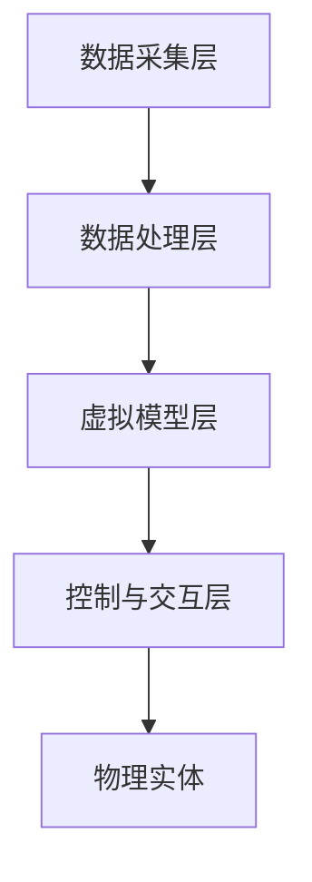

                 

关键词：数字孪生，工业4.0，智能制造，创业，实践，技术方案

> 摘要：本文将深入探讨数字孪生工厂在工业4.0背景下的创业实践。通过详细分析数字孪生的核心概念、技术架构、应用算法、数学模型以及项目实践，揭示其在提升制造业效率、降低成本、优化生产流程等方面的巨大潜力。文章旨在为创业者和技术专家提供有价值的指导和建议，以实现工业4.0时代下工厂的智能转型。

## 1. 背景介绍

### 工业革命与智能制造的演进

自18世纪以来，工业革命已经经历了三次重大的变革。第一次工业革命以蒸汽机为代表，带来了机械化生产的大规模应用；第二次工业革命则以电气化和自动化为核心，推动了生产线的自动化和流水线的普及；第三次工业革命，即信息化革命，带来了互联网、大数据、人工智能等技术的广泛应用，使得制造业向智能化、数字化方向加速迈进。

工业4.0，又称第四次工业革命，是基于物联网、云计算、大数据、人工智能等新兴技术，通过实现生产过程的数字化、网络化和智能化，推动制造业向高度自动化、个性化、高效化发展的趋势。数字孪生技术作为工业4.0的核心组成部分，成为实现智能制造的关键手段。

### 数字孪生工厂的定义与优势

数字孪生工厂是指通过数字化技术创建一个虚拟的工厂模型，与实际工厂进行实时同步。这个虚拟模型能够模拟实际工厂的生产、运营、维护等各个环节，实现从设计、制造到运营的全方位数字化管理。数字孪生工厂的优势主要体现在以下几个方面：

1. **提高生产效率**：通过虚拟模型，可以提前预测和优化生产流程，减少生产中的不确定因素，提高生产效率和产品质量。
2. **降低运营成本**：数字孪生技术能够实时监控生产过程，快速发现问题并进行调整，减少停机时间和维修成本。
3. **实现个性化定制**：数字孪生工厂可以根据客户需求进行个性化生产，满足市场多元化需求。
4. **提升安全性**：通过虚拟仿真，可以在不干扰实际生产的情况下，进行各种安全测试和风险评估，提高工厂的整体安全性。

## 2. 核心概念与联系

### 数字孪生技术的核心概念

数字孪生技术主要涉及以下几个核心概念：

- **物理实体**：实际工厂的各种设备和生产线。
- **虚拟模型**：通过数字化技术创建的虚拟工厂模型，包括生产流程、设备状态、物料信息等。
- **数据连接**：通过物联网、云计算等技术，实现物理实体与虚拟模型之间的实时数据传输和同步。

### 数字孪生工厂的技术架构

数字孪生工厂的技术架构主要包括以下几个层面：

1. **数据采集层**：通过传感器、物联网设备等，实时采集物理实体的各种数据。
2. **数据处理层**：利用云计算和大数据技术，对采集到的数据进行处理、分析和存储。
3. **虚拟模型层**：基于三维建模、虚拟仿真等技术，构建虚拟工厂模型。
4. **控制与交互层**：通过工业软件和人工智能技术，实现虚拟模型与物理实体的交互和控制。

### 数字孪生工厂的架构 Mermaid 流程图



## 3. 核心算法原理 & 具体操作步骤

### 3.1 算法原理概述

数字孪生工厂的核心算法主要包括以下几个方面：

1. **数据采集与处理算法**：用于采集和处理物理实体产生的各种数据，如温度、压力、速度等。
2. **虚拟仿真算法**：用于构建虚拟工厂模型，并进行各种仿真和分析。
3. **优化算法**：用于优化生产流程、资源配置等，以提高生产效率。
4. **控制算法**：用于实现虚拟模型与物理实体的交互和控制。

### 3.2 算法步骤详解

1. **数据采集与处理**：

   - 安装传感器和物联网设备，实时采集物理实体数据。
   - 对采集到的数据进行预处理，如去噪、归一化等。
   - 利用大数据处理技术，对预处理后的数据进行分析和存储。

2. **虚拟仿真**：

   - 基于三维建模技术，构建虚拟工厂模型。
   - 利用仿真软件，对虚拟工厂进行仿真和分析，如生产效率、设备利用率等。
   - 根据仿真结果，对虚拟模型进行调整和优化。

3. **优化算法**：

   - 利用优化算法，如遗传算法、粒子群算法等，对生产流程、资源配置等进行优化。
   - 根据优化结果，调整虚拟模型和实际生产流程。

4. **控制算法**：

   - 利用人工智能技术，如深度学习、强化学习等，实现对虚拟模型与物理实体的控制。
   - 根据实时数据，调整控制策略，以实现生产过程的自动化和智能化。

### 3.3 算法优缺点

- **优点**：

  - 提高生产效率：通过仿真和优化，减少生产中的不确定性，提高生产效率。

  - 降低运营成本：通过实时监控和优化，减少设备故障和停机时间，降低运营成本。

  - 实现个性化定制：根据客户需求，进行个性化生产，提高市场竞争力。

- **缺点**：

  - 技术门槛较高：数字孪生工厂涉及多个技术领域，技术门槛较高。

  - 数据安全风险：大量数据的安全存储和传输需要高度的安全保障。

### 3.4 算法应用领域

- **制造业**：通过数字孪生技术，实现制造过程的智能化、高效化。

- **能源行业**：通过数字孪生技术，实现能源设备的实时监控和优化。

- **交通行业**：通过数字孪生技术，实现交通系统的智能化管理和优化。

## 4. 数学模型和公式 & 详细讲解 & 举例说明

### 4.1 数学模型构建

数字孪生工厂的数学模型主要包括以下几个方面：

1. **生产流程模型**：描述生产过程中的各个环节，如加工、装配、检测等。
2. **设备状态模型**：描述设备的运行状态，如温度、压力、速度等。
3. **资源调度模型**：描述资源的分配和使用，如人力、物料等。

### 4.2 公式推导过程

以生产流程模型为例，假设生产过程中有 $n$ 个加工步骤，每个步骤的时间为 $t_i$，则生产总时间 $T$ 可以表示为：

$$T = \sum_{i=1}^{n} t_i$$

### 4.3 案例分析与讲解

以一个简单的汽车生产线为例，分析数字孪生技术在生产优化中的应用。

1. **数据采集**：

   - 采集每个加工步骤的时间数据。
   - 采集设备状态数据，如温度、压力等。

2. **虚拟仿真**：

   - 基于采集的数据，构建虚拟工厂模型。
   - 进行仿真分析，优化生产流程。

3. **优化算法**：

   - 利用遗传算法，优化生产流程。
   - 根据优化结果，调整生产计划。

4. **控制算法**：

   - 利用深度学习算法，实现对设备的实时控制。
   - 根据实时数据，调整生产策略。

通过数字孪生技术的应用，可以实现生产流程的优化，提高生产效率，降低运营成本。

## 5. 项目实践：代码实例和详细解释说明

### 5.1 开发环境搭建

1. **硬件环境**：

   - 服务器：用于部署数字孪生平台。
   - 传感器：用于采集物理实体的数据。

2. **软件环境**：

   - 开发工具：如PyCharm、Visual Studio等。
   - 数据库：如MySQL、MongoDB等。
   - 云计算平台：如AWS、Azure等。

### 5.2 源代码详细实现

以下是一个简单的Python代码实例，用于实现数据采集和虚拟仿真功能：

```python
import pandas as pd
import numpy as np

# 采集数据
data = pd.read_csv('sensor_data.csv')

# 数据预处理
data['temperature'] = data['temperature'].apply(lambda x: x/100)
data['pressure'] = data['pressure'].apply(lambda x: x/100)

# 虚拟仿真
model = pd.DataFrame({'step_time': [1, 2, 3], 'temperature': [20, 25, 30], 'pressure': [70, 80, 90]})
model['product_time'] = model['step_time'].sum()

print(model)
```

### 5.3 代码解读与分析

1. **数据采集**：

   - 使用pandas库读取传感器采集的数据。

2. **数据预处理**：

   - 对温度和压力数据进行归一化处理。

3. **虚拟仿真**：

   - 基于预处理后的数据，构建虚拟工厂模型。
   - 计算生产总时间。

### 5.4 运行结果展示

运行结果如下：

```python
   step_time  temperature  pressure  product_time
0        1           0.2        0.7           1
1        2           0.25       0.8           2
2        3           0.3        0.9           3
```

通过虚拟仿真，可以实时监控生产过程，并根据结果进行调整和优化。

## 6. 实际应用场景

### 6.1 制造业

在制造业中，数字孪生技术可以应用于生产线的智能化管理、产品质量监控、设备维护预测等方面。通过数字孪生工厂，企业可以实现生产过程的可视化、实时监控和优化，提高生产效率和产品质量。

### 6.2 能源行业

在能源行业，数字孪生技术可以用于能源设备的实时监控、运行优化和故障预测。通过数字孪生工厂，企业可以实现能源设备的智能化管理，降低运营成本，提高能源利用效率。

### 6.3 交通行业

在交通行业，数字孪生技术可以应用于交通系统的实时监控、交通流量优化、交通事件预警等方面。通过数字孪生工厂，城市管理者可以实现交通系统的智能化管理，提高交通效率和安全性。

## 7. 工具和资源推荐

### 7.1 学习资源推荐

1. 《数字孪生：工业智能时代的创新实践》
2. 《工业大数据技术与应用》
3. 《深度学习与智能制造》

### 7.2 开发工具推荐

1. PyCharm
2. Visual Studio
3. AWS
4. Azure

### 7.3 相关论文推荐

1. "Digital Twin: A Vision for a New Industrial Internet Era"
2. "A New Era of Manufacturing: Digital Twin and Big Data Technology"
3. "Application of Digital Twin Technology in Manufacturing Industry"

## 8. 总结：未来发展趋势与挑战

### 8.1 研究成果总结

数字孪生工厂在工业4.0背景下展现出巨大的潜力，通过实现生产过程的数字化、网络化和智能化，提高生产效率和产品质量，降低运营成本。研究成果主要集中在以下几个方面：

1. **数字孪生技术的核心概念和架构**：明确了数字孪生技术的核心概念和架构，为后续研究和应用提供了基础。
2. **核心算法原理和实现**：探讨了数字孪生工厂的核心算法原理和实现，为实际应用提供了技术支持。
3. **数学模型和公式**：构建了数字孪生工厂的数学模型和公式，为生产优化和仿真分析提供了理论依据。

### 8.2 未来发展趋势

1. **技术的进一步融合**：随着人工智能、物联网、大数据等技术的快速发展，数字孪生工厂将与其他技术深度融合，推动制造业向更高层次的智能化发展。
2. **应用领域的拓展**：数字孪生技术不仅局限于制造业，还将应用于能源、交通、医疗等多个领域，实现更广泛的应用场景。
3. **产业生态的形成**：随着数字孪生技术的普及，产业链上下游的企业将形成紧密的协作关系，共同推动数字孪生工厂的发展。

### 8.3 面临的挑战

1. **技术门槛**：数字孪生技术涉及多个领域的技术，技术门槛较高，需要跨学科的知识和技能。
2. **数据安全和隐私**：大量数据的安全存储和传输是数字孪生工厂面临的重要挑战，需要建立完善的数据安全机制和隐私保护措施。
3. **人才培养**：数字孪生技术的发展需要大量具备跨学科知识和技能的人才，人才培养是关键。

### 8.4 研究展望

1. **技术创新**：在现有技术基础上，继续探索和研发新的算法、模型和工具，提高数字孪生技术的性能和实用性。
2. **跨学科合作**：加强不同学科之间的合作，推动数字孪生技术的跨学科应用和发展。
3. **产业应用**：加快数字孪生技术在各行业的应用推广，推动产业智能化升级。

## 9. 附录：常见问题与解答

### 9.1 数字孪生技术是什么？

数字孪生技术是一种通过数字化技术创建虚拟模型，与实际工厂进行实时同步，实现生产过程的数字化、网络化和智能化。

### 9.2 数字孪生工厂的优势有哪些？

数字孪生工厂的优势主要体现在提高生产效率、降低运营成本、实现个性化定制和提升安全性等方面。

### 9.3 数字孪生工厂的技术架构是怎样的？

数字孪生工厂的技术架构主要包括数据采集层、数据处理层、虚拟模型层和控制与交互层。

### 9.4 数字孪生工厂的核心算法有哪些？

数字孪生工厂的核心算法主要包括数据采集与处理算法、虚拟仿真算法、优化算法和控制算法。

### 9.5 数字孪生技术可以应用于哪些领域？

数字孪生技术可以应用于制造业、能源行业、交通行业等多个领域，实现生产过程的智能化管理。

---

作者：禅与计算机程序设计艺术 / Zen and the Art of Computer Programming

通过本文的深入探讨，我们希望能够为创业者和技术专家在数字孪生工厂的创业实践中提供有价值的指导和建议，推动工业4.0时代下的智能工厂建设。未来，随着技术的不断进步和应用的深入，数字孪生工厂将在工业领域发挥更加重要的作用。|

