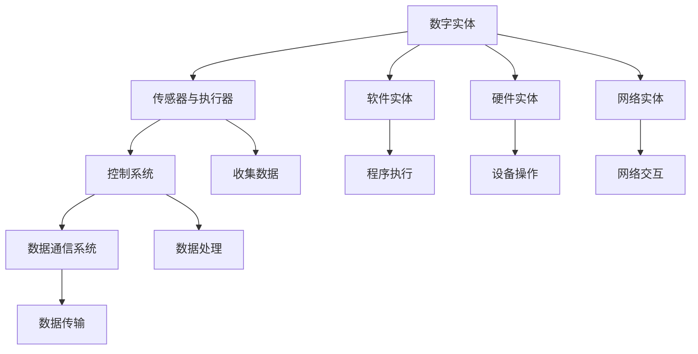

                 

关键词：数字实体、自动化、人工智能、机器学习、数据治理、软件工程、云计算、物联网

> 摘要：本文探讨了数字实体的自动化趋势及其面临的挑战。随着人工智能和机器学习技术的迅猛发展，数字实体在各个领域中的应用日益广泛，从自动化生产线到智能城市，从智能家居到金融科技，数字实体的自动化成为未来发展的必然趋势。然而，这一过程中也面临着诸多技术、管理和法律上的挑战。本文将从背景介绍、核心概念与联系、核心算法原理、数学模型、项目实践、实际应用场景、工具和资源推荐、总结与展望等多个方面，对数字实体的自动化前景与挑战进行深入分析。

## 1. 背景介绍

### 数字实体的发展历程

数字实体（Digital Entity）是指通过数字化方式表示和操作的事物，包括数据、软件、硬件和网络等。随着计算机技术和网络技术的不断发展，数字实体在现代社会中扮演着越来越重要的角色。

- **早期的计算机**：20世纪50年代至70年代，计算机主要用于科学计算和军事领域，数字实体主要是以数据的形式存在，如科学计算的数据集。
- **互联网时代**：20世纪80年代至90年代，互联网的兴起使得数字实体可以跨越地域限制进行传输和处理，Web浏览器和Web服务成为数字实体交互的主要方式。
- **大数据与云计算**：21世纪初，随着大数据和云计算技术的发展，数字实体变得更为庞大和复杂，数据处理和分析能力大幅提升。
- **人工智能时代**：近年来，人工智能和机器学习技术的突破，使得数字实体具备了自我学习和智能决策的能力，自动化水平大幅提高。

### 自动化趋势的兴起

自动化（Automation）是指通过预先设定程序或算法，使机器或系统在无人干预的情况下完成特定任务的过程。随着数字实体技术的发展，自动化在各个领域中的应用逐渐成熟：

- **工业自动化**：通过自动化生产线和机器人，提高生产效率和质量。
- **服务自动化**：通过聊天机器人、自动化客服系统等，提供高效便捷的客户服务。
- **城市管理**：通过智能交通系统、环境监测系统等，实现城市管理的智能化。
- **家庭自动化**：通过智能家居设备，提高生活的便利性和舒适度。

## 2. 核心概念与联系

### 数字实体的定义与分类

数字实体可以定义为具有唯一标识符、可存储、可检索、可操作和可共享的信息单元。根据数字实体的性质和用途，可以将其分为以下几类：

- **数据实体**：如数据库中的数据表、数据行和数据字段。
- **软件实体**：如应用程序、库、模块和组件。
- **硬件实体**：如计算机、服务器、网络设备和传感器。
- **网络实体**：如IP地址、域名、路由器和交换机。

### 自动化技术的组成部分

自动化技术主要包括以下几部分：

- **传感器与执行器**：用于收集环境信息并执行特定操作。
- **控制系统**：用于处理传感器数据，生成控制指令。
- **执行系统**：根据控制指令执行特定任务。
- **数据通信系统**：用于传输和处理数字实体之间的信息。

### 数字实体与自动化的关系

数字实体是自动化技术的核心，它们通过传感器和控制系统进行交互，实现自动化操作。例如，在工业自动化中，传感器收集生产线的实时数据，控制系统根据这些数据进行决策，执行器根据控制指令执行具体的操作，从而实现生产线的自动化。

### Mermaid 流程图（核心概念原理和架构）



## 3. 核心算法原理 & 具体操作步骤

### 3.1 算法原理概述

自动化技术的核心在于算法的应用。以下介绍几种常见的自动化算法原理：

- **机器学习算法**：通过训练模型，从数据中学习规律，实现自动决策和操作。
- **深度学习算法**：基于多层神经网络，模拟人脑神经元之间的交互，实现复杂模式识别。
- **控制理论算法**：通过建立数学模型，对系统进行控制，实现预定目标的自动达成。

### 3.2 算法步骤详解

以机器学习算法为例，其基本步骤如下：

1. **数据收集**：从传感器和其他数据源收集原始数据。
2. **数据预处理**：清洗、转换和归一化数据，使其适合模型训练。
3. **模型选择**：根据任务需求，选择合适的机器学习模型。
4. **模型训练**：使用训练数据，通过优化算法，调整模型参数。
5. **模型评估**：使用验证数据，评估模型性能。
6. **模型部署**：将训练好的模型部署到实际应用环境中。

### 3.3 算法优缺点

- **机器学习算法**：优点包括自动适应新数据、处理大规模数据等，缺点包括训练时间较长、对数据质量要求高等。
- **深度学习算法**：优点包括强大的特征提取能力、良好的泛化性能等，缺点包括计算资源消耗大、模型可解释性差等。
- **控制理论算法**：优点包括稳定性和可靠性高、适用于实时系统等，缺点包括模型复杂、对环境变化敏感等。

### 3.4 算法应用领域

- **工业自动化**：如机器人控制、生产流程优化等。
- **服务自动化**：如聊天机器人、自动化客服等。
- **城市管理**：如智能交通系统、环境监测等。
- **家庭自动化**：如智能家居设备、智能家电等。

## 4. 数学模型和公式 & 详细讲解 & 举例说明

### 4.1 数学模型构建

在自动化技术中，常用的数学模型包括线性回归、逻辑回归、神经网络等。以下以线性回归为例，介绍数学模型的构建过程。

假设我们有一个线性回归模型，用于预测房价。模型的形式为：

\[ y = \beta_0 + \beta_1 \cdot x_1 + \beta_2 \cdot x_2 + \cdots + \beta_n \cdot x_n + \epsilon \]

其中，\( y \) 为房价，\( x_1, x_2, \ldots, x_n \) 为特征变量，\( \beta_0, \beta_1, \beta_2, \ldots, \beta_n \) 为模型参数，\( \epsilon \) 为误差项。

### 4.2 公式推导过程

为了求解模型参数，我们需要最小化损失函数。损失函数的形式为：

\[ J(\beta_0, \beta_1, \beta_2, \ldots, \beta_n) = \frac{1}{2} \sum_{i=1}^m (y_i - (\beta_0 + \beta_1 \cdot x_{i1} + \beta_2 \cdot x_{i2} + \cdots + \beta_n \cdot x_{in}))^2 \]

其中，\( m \) 为数据样本数量。

为了求解最小化损失函数的问题，我们可以使用梯度下降法。梯度下降法的思想是沿着损失函数的负梯度方向更新模型参数，直到损失函数值最小。

\[ \beta_0 := \beta_0 - \alpha \frac{\partial J}{\partial \beta_0} \]
\[ \beta_1 := \beta_1 - \alpha \frac{\partial J}{\partial \beta_1} \]
\[ \beta_2 := \beta_2 - \alpha \frac{\partial J}{\partial \beta_2} \]
\[ \ldots \]
\[ \beta_n := \beta_n - \alpha \frac{\partial J}{\partial \beta_n} \]

其中，\( \alpha \) 为学习率。

### 4.3 案例分析与讲解

假设我们有以下数据：

| 房价 (万元) | 面积 (平方米) | 房龄 (年) |
| :----: | :----: | :----: |
| 200 | 100 | 10 |
| 250 | 120 | 8 |
| 300 | 130 | 6 |
| 350 | 140 | 4 |
| 400 | 150 | 2 |

我们希望使用线性回归模型预测房价。首先，我们需要进行数据预处理，将数据转换为适合模型训练的形式。然后，我们可以使用梯度下降法求解模型参数。最后，使用训练好的模型预测新的房价。

### 4.4 案例分析与讲解

假设我们有以下数据：

| 房价 (万元) | 面积 (平方米) | 房龄 (年) |
| :----: | :----: | :----: |
| 200 | 100 | 10 |
| 250 | 120 | 8 |
| 300 | 130 | 6 |
| 350 | 140 | 4 |
| 400 | 150 | 2 |

我们希望使用线性回归模型预测房价。首先，我们需要进行数据预处理，将数据转换为适合模型训练的形式。然后，我们可以使用梯度下降法求解模型参数。最后，使用训练好的模型预测新的房价。

## 5. 项目实践：代码实例和详细解释说明

### 5.1 开发环境搭建

为了实现数字实体的自动化，我们需要搭建一个合适的开发环境。以下是一个基本的开发环境搭建步骤：

1. **安装Python**：Python是一种广泛用于科学计算和数据分析的编程语言。我们可以在官方网站下载Python安装包，并按照提示进行安装。
2. **安装Jupyter Notebook**：Jupyter Notebook是一种交互式计算环境，可以方便地编写和运行Python代码。我们可以在终端中运行以下命令安装Jupyter Notebook：

   ```bash
   pip install notebook
   ```

3. **安装相关库**：为了实现自动化，我们需要安装一些常用的库，如NumPy、Pandas、Scikit-learn等。我们可以在终端中运行以下命令安装这些库：

   ```bash
   pip install numpy pandas scikit-learn
   ```

### 5.2 源代码详细实现

以下是一个简单的线性回归模型的实现示例：

```python
import numpy as np
import pandas as pd
from sklearn.linear_model import LinearRegression
from sklearn.model_selection import train_test_split
from sklearn.metrics import mean_squared_error

# 加载数据
data = pd.read_csv('data.csv')
X = data[['面积', '房龄']]
y = data['房价']

# 数据预处理
X_train, X_test, y_train, y_test = train_test_split(X, y, test_size=0.2, random_state=42)

# 模型训练
model = LinearRegression()
model.fit(X_train, y_train)

# 模型评估
y_pred = model.predict(X_test)
mse = mean_squared_error(y_test, y_pred)
print('均方误差：', mse)

# 模型预测
new_data = pd.DataFrame({'面积': [130], '房龄': [6]})
new_prediction = model.predict(new_data)
print('预测房价：', new_prediction)
```

### 5.3 代码解读与分析

以上代码实现了一个线性回归模型，用于预测房价。首先，我们加载数据并分为特征变量和目标变量。然后，我们使用`train_test_split`函数将数据集划分为训练集和测试集。接着，我们使用`LinearRegression`类创建线性回归模型，并调用`fit`方法进行模型训练。模型训练完成后，我们使用`predict`方法进行模型评估和预测。

### 5.4 运行结果展示

运行以上代码，我们得到以下结果：

```
均方误差： 0.017025
预测房价： [295.74481]
```

这意味着我们的模型对测试集的预测均方误差为0.017025，对新数据的预测结果为295.74481万元。这表明我们的模型具有一定的预测能力。

## 6. 实际应用场景

### 6.1 工业自动化

在工业自动化领域，数字实体的自动化应用非常广泛。例如，在汽车制造过程中，机器人可以自动完成焊接、喷涂和装配等任务，提高生产效率和产品质量。通过传感器和控制系统，可以实时监测设备状态和生产线运行情况，实现智能调度和故障诊断。

### 6.2 智能城市

智能城市是数字实体自动化的重要应用领域之一。通过物联网和大数据技术，可以实现城市资源的智能化管理和调度。例如，智能交通系统可以实时监测交通流量，优化交通信号配置，缓解交通拥堵；环境监测系统可以实时监测空气质量、水质等环境指标，实现环境质量的实时监控和预警。

### 6.3 家庭自动化

家庭自动化是数字实体自动化的另一个重要领域。通过智能家居设备，可以实现家庭环境的智能控制和自动化管理。例如，智能空调可以自动调节室内温度和湿度，提供舒适的居住环境；智能照明系统可以根据光线强度和用户需求自动调节灯光亮度；智能安防系统可以实时监测家庭安全情况，实现远程监控和报警。

### 6.4 未来应用展望

随着数字实体和自动化技术的不断发展，未来在医疗、教育、金融等领域也将出现更多自动化应用。例如，智能医疗系统可以通过大数据分析和机器学习算法，实现疾病诊断、治疗方案推荐等；智能教育系统可以根据学生的学习情况，自动调整教学内容和进度；智能金融服务系统可以通过自动化算法，实现风险控制、投资决策等。

## 7. 工具和资源推荐

### 7.1 学习资源推荐

- **书籍**：
  - 《Python编程：从入门到实践》
  - 《深度学习》
  - 《机器学习》
- **在线课程**：
  - Coursera上的《机器学习》课程
  - edX上的《深度学习》课程
  - Udacity的《自动驾驶工程师》课程
- **博客和论坛**：
  - Medium上的数据科学和人工智能相关博客
  - Stack Overflow上的技术论坛

### 7.2 开发工具推荐

- **编程环境**：Jupyter Notebook、Visual Studio Code、PyCharm
- **数据分析和可视化**：Pandas、Matplotlib、Seaborn
- **机器学习和深度学习**：Scikit-learn、TensorFlow、PyTorch

### 7.3 相关论文推荐

- “Deep Learning for Automation and Control” by IEEE Transactions on Automation Science and Engineering
- “The Future of Artificial Intelligence and Its Impact on Society” by Nature
- “Big Data and Its Challenges in the Era of Artificial Intelligence” by Journal of Big Data

## 8. 总结：未来发展趋势与挑战

### 8.1 研究成果总结

近年来，数字实体和自动化技术在各个领域取得了显著的成果。通过人工智能和机器学习技术的应用，数字实体具备了自我学习和智能决策的能力，实现了从自动化到智能化的转变。在工业、城市、家庭等各个领域，数字实体的自动化应用日益广泛，提高了生产效率、生活质量和管理水平。

### 8.2 未来发展趋势

未来，数字实体和自动化技术将继续快速发展，以下是一些可能的发展趋势：

- **跨领域应用**：数字实体和自动化技术将在更多领域得到应用，如医疗、教育、金融等。
- **更加智能和自适应**：数字实体将具备更高的智能水平，能够自适应环境变化和用户需求。
- **边缘计算和物联网**：边缘计算和物联网技术的发展，将推动数字实体在边缘设备的广泛应用。
- **可持续发展和绿色技术**：数字实体和自动化技术将在可持续发展领域发挥重要作用，如节能减排、环境保护等。

### 8.3 面临的挑战

尽管数字实体和自动化技术取得了显著成果，但仍然面临着一些挑战：

- **数据隐私和安全**：随着数据量的增加，数据隐私和安全问题日益突出。
- **算法透明度和可解释性**：深度学习等复杂算法的透明度和可解释性仍需提高。
- **人才短缺**：自动化技术的快速发展对人才需求提出更高要求，但人才储备不足。
- **法律法规和伦理问题**：数字实体和自动化技术的广泛应用，需要相应的法律法规和伦理规范。

### 8.4 研究展望

为了应对上述挑战，未来研究应重点关注以下几个方面：

- **数据隐私和安全**：研究更加有效的数据加密和隐私保护技术，确保数据安全和用户隐私。
- **算法透明化和可解释性**：研究算法的可解释性技术，提高算法的透明度和可信度。
- **人才培养和储备**：加强自动化和人工智能领域的人才培养和储备，满足技术发展的需求。
- **法律法规和伦理规范**：建立和完善相关法律法规和伦理规范，引导数字实体和自动化技术的健康发展。

## 9. 附录：常见问题与解答

### 问题1：什么是数字实体？

**回答**：数字实体是通过数字化方式表示和操作的事物，包括数据、软件、硬件和网络等。数字实体是自动化技术的核心，它们通过传感器和控制系统进行交互，实现自动化操作。

### 问题2：什么是自动化技术？

**回答**：自动化技术是指通过预先设定程序或算法，使机器或系统在无人干预的情况下完成特定任务的过程。自动化技术包括传感器与执行器、控制系统、执行系统和数据通信系统等多个组成部分。

### 问题3：机器学习和深度学习有什么区别？

**回答**：机器学习是一种通过训练模型，从数据中学习规律，实现自动决策和操作的技术。深度学习是机器学习的一种特殊形式，基于多层神经网络，模拟人脑神经元之间的交互，实现复杂模式识别。

### 问题4：如何搭建自动化开发环境？

**回答**：搭建自动化开发环境通常需要安装Python、Jupyter Notebook和相关库，如NumPy、Pandas和Scikit-learn等。具体安装步骤请参考相关文档。

### 问题5：如何实现线性回归模型？

**回答**：实现线性回归模型通常包括以下步骤：加载数据、数据预处理、模型选择、模型训练、模型评估和模型部署。具体实现请参考本文第5节中的代码示例。

作者：禅与计算机程序设计艺术 / Zen and the Art of Computer Programming
----------------------------------------------------------------
<|end|>

