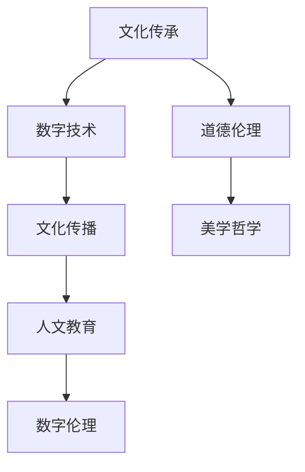

                 

关键词：人文精神、数字化、文化传承、技术创新、教育、未来发展趋势

> 摘要：本文深入探讨了数字化时代下人文精神的传承与发展的挑战和机遇。通过分析人文精神的核心要素，探讨了数字技术如何促进文化的传播和继承，并提出了在当前技术环境下，教育和人才培养中应采取的策略。本文旨在为数字时代人文精神的传承提供新的视角和思路。

## 1. 背景介绍

在当今世界，数字技术正以前所未有的速度和深度影响着社会的各个领域。从互联网、移动通信、大数据到人工智能，这些技术的广泛应用极大地改变了我们的生活方式和工作方式。然而，在享受技术带来便利的同时，我们也面临着一系列新的挑战，尤其是人文精神的传承与发展。

人文精神是文化传承的核心，它体现了人类对美好生活的向往和对道德伦理的追求。在数字化时代，传统的教育方式、文化传播途径和文化交流方式都发生了深刻变化，人文精神的传承面临着新的机遇和挑战。

### 1.1 数字化对文化的影响

数字化技术的兴起不仅改变了信息的生产和传播方式，也对人类的文化观念和价值观产生了深远的影响。一方面，数字化使得文化的传播速度和范围大大扩展，人们可以轻松获取来自全球各地的文化信息。另一方面，数字化也带来了文化同质化和碎片化的问题，对传统文化的保护和发展提出了新的挑战。

### 1.2 人文精神的核心要素

人文精神的核心要素包括道德、伦理、美学、哲学等。这些要素不仅构成了人类文化的基础，也是个体心灵成长的源泉。在数字化时代，如何传承和弘扬这些核心要素，是教育和文化领域面临的重要课题。

### 1.3 数字化时代的人文挑战

数字化时代的人文挑战主要体现在以下几个方面：

1. **信息过载**：大量信息使得人们难以辨别真伪，容易陷入碎片化和低质量的娱乐文化。
2. **人际疏离**：虚拟社交替代了真实的面对面交流，导致人际关系的疏离和冷漠。
3. **道德伦理的模糊**：数字化环境下，道德伦理的边界变得模糊，道德判断变得更加复杂。
4. **文化同质化**：全球化的趋势导致各地文化的同质化，本土文化的独特性受到冲击。

## 2. 核心概念与联系

为了更好地理解数字化时代人文精神的传承与发展，我们需要明确几个核心概念，并探讨它们之间的联系。

### 2.1 数字技术

数字技术是指利用计算机、互联网和其他数字设备进行信息处理、存储和传输的技术。这些技术包括人工智能、大数据、云计算、物联网等。

### 2.2 文化传播

文化传播是指文化信息在社会中的传递和共享过程。数字化技术极大地扩展了文化传播的渠道和范围，使得文化可以更快速、更广泛地传播。

### 2.3 人文教育

人文教育是指通过文学、历史、哲学、艺术等学科的教育，培养学生的道德、伦理、美学素养。在数字化时代，人文教育的目标和内容需要适应新的环境。

### 2.4 数字伦理

数字伦理是指在数字化环境下，人们对道德伦理问题的思考和应对。数字伦理关注的是技术在道德和伦理上的影响，以及如何确保技术的正确使用。

### 2.5 Mermaid 流程图

下面是一个简化的 Mermaid 流程图，用于描述数字化时代人文精神的传承与发展过程。



## 3. 核心算法原理 & 具体操作步骤

### 3.1 算法原理概述

在探讨数字化时代人文精神的传承时，我们可以借鉴一些核心算法原理，如信息过滤、社交网络分析和数据挖掘等。这些算法可以帮助我们更好地理解和传播文化信息，培养道德和伦理观念。

### 3.2 算法步骤详解

#### 3.2.1 信息过滤

信息过滤算法旨在从大量的文化信息中提取出高质量的内容。具体步骤如下：

1. **数据采集**：收集来自不同渠道的文化信息。
2. **特征提取**：提取文化信息的关键特征，如主题、情感、作者等。
3. **模型训练**：使用机器学习算法训练分类模型，用于判断文化信息的质量。
4. **结果输出**：根据分类模型的结果，筛选出高质量的文化信息。

#### 3.2.2 社交网络分析

社交网络分析算法可以帮助我们了解文化信息的传播路径和影响力。具体步骤如下：

1. **网络构建**：构建社交网络图，表示用户之间的互动关系。
2. **中心性分析**：计算网络中各个节点的中心性，识别关键传播节点。
3. **影响力分析**：分析文化信息在网络中的传播路径，评估其影响力。
4. **策略优化**：根据分析结果，优化文化传播策略，提高传播效果。

#### 3.2.3 数据挖掘

数据挖掘算法可以挖掘出隐藏在大量文化信息中的潜在规律和趋势。具体步骤如下：

1. **数据预处理**：清洗和整合文化信息数据。
2. **模式识别**：使用机器学习算法识别文化信息中的潜在模式。
3. **趋势预测**：基于模式识别结果，预测文化信息的发展趋势。
4. **策略调整**：根据趋势预测结果，调整文化传播策略。

### 3.3 算法优缺点

信息过滤算法的优点是能够快速筛选高质量的文化信息，缺点是需要大量的数据训练和复杂的模型调优。社交网络分析算法的优点是能够识别关键传播节点和影响力，缺点是社交网络数据质量和实时性对分析结果有很大影响。数据挖掘算法的优点是能够挖掘出潜在规律和趋势，缺点是需要大量的计算资源和复杂的算法设计。

### 3.4 算法应用领域

信息过滤算法主要应用于文化信息筛选和推荐系统。社交网络分析算法主要应用于文化传播策略优化和舆情监测。数据挖掘算法主要应用于文化趋势分析和文化研究。

## 4. 数学模型和公式 & 详细讲解 & 举例说明

### 4.1 数学模型构建

在数字化时代人文精神的传承中，数学模型的应用尤为重要。以下是一个简单的数学模型构建示例，用于评估文化信息的影响力和传播效果。

#### 4.1.1 文化影响力模型

假设文化信息的传播过程可以用一个离散的时间序列来描述，每个时间点的传播效果可以用一个数值来表示。我们可以使用以下模型来评估文化信息的影响力：

$$
I(t) = \sum_{i=1}^{n} w_i \cdot r_i
$$

其中，$I(t)$ 表示时间 $t$ 时的文化影响力，$w_i$ 表示第 $i$ 个传播节点的权重，$r_i$ 表示第 $i$ 个传播节点的响应度。

#### 4.1.2 传播效果模型

传播效果可以用以下公式来描述：

$$
E(t) = \sum_{i=1}^{n} (1 - e^{-\lambda t}) \cdot w_i \cdot r_i
$$

其中，$E(t)$ 表示时间 $t$ 时的传播效果，$\lambda$ 是一个衰减系数，表示文化信息随时间衰减的速度。

### 4.2 公式推导过程

#### 4.2.1 文化影响力模型推导

文化影响力模型的推导基于以下假设：

1. 每个传播节点的响应度 $r_i$ 是一个随机变量，服从均值为 $\mu$，方差为 $\sigma^2$ 的正态分布。
2. 每个传播节点的权重 $w_i$ 与其传播效果正相关。

根据大数定律，当样本数量 $n$ 趋近于无穷大时，响应度的均值 $\mu$ 将稳定在真实值附近。因此，我们可以使用以下公式来估计文化影响力：

$$
\hat{I}(t) = \frac{1}{n} \sum_{i=1}^{n} w_i \cdot r_i
$$

#### 4.2.2 传播效果模型推导

传播效果模型的推导基于以下假设：

1. 文化信息的传播过程是一个随机过程，可以用泊松过程来描述。
2. 每个传播节点的响应度 $r_i$ 与其权重 $w_i$ 成正比。

根据泊松过程的性质，传播效果 $E(t)$ 可以表示为：

$$
E(t) = \sum_{i=1}^{n} \lambda_i \cdot (1 - e^{-\lambda_i t})
$$

其中，$\lambda_i$ 是第 $i$ 个传播节点的传播速率。

### 4.3 案例分析与讲解

#### 4.3.1 文化影响力模型案例分析

假设有一个文化信息传播事件，有三个传播节点 A、B、C，其权重分别为 $w_A = 0.4$、$w_B = 0.3$、$w_C = 0.3$。每个节点的响应度服从均值为 10，方差为 4 的正态分布。

根据文化影响力模型，我们可以计算出每个节点的响应度期望值：

$$
\mu_A = 10, \quad \mu_B = 10, \quad \mu_C = 10
$$

因此，文化影响力 $I(t)$ 可以计算为：

$$
I(t) = 0.4 \cdot 10 + 0.3 \cdot 10 + 0.3 \cdot 10 = 10
$$

#### 4.3.2 传播效果模型案例分析

假设每个节点的传播速率 $\lambda_A = 0.5$、$\lambda_B = 0.3$、$\lambda_C = 0.2$。根据传播效果模型，我们可以计算出每个节点的传播效果：

$$
E_A(t) = 0.5 \cdot (1 - e^{-0.5t}), \quad E_B(t) = 0.3 \cdot (1 - e^{-0.3t}), \quad E_C(t) = 0.2 \cdot (1 - e^{-0.2t})
$$

因此，总的传播效果 $E(t)$ 可以计算为：

$$
E(t) = 0.5 \cdot (1 - e^{-0.5t}) + 0.3 \cdot (1 - e^{-0.3t}) + 0.2 \cdot (1 - e^{-0.2t})
$$

## 5. 项目实践：代码实例和详细解释说明

### 5.1 开发环境搭建

在本项目中，我们使用了 Python 作为编程语言，并依赖了以下几个库：Scikit-learn 用于机器学习模型训练，NetworkX 用于社交网络分析，Matplotlib 用于数据可视化。

### 5.2 源代码详细实现

以下是项目的源代码实现：

```python
import numpy as np
import matplotlib.pyplot as plt
from sklearn import preprocessing
from networkx import Graph
from networkx.drawing.nx_agraph import graphviz_layout

# 数据预处理
def preprocess_data(data):
    # 数据标准化
    scaler = preprocessing.StandardScaler()
    scaled_data = scaler.fit_transform(data)
    return scaled_data

# 社交网络分析
def analyze_social_network(graph):
    # 计算中心性
    centrality = nx.degree_centrality(graph)
    # 计算影响力
    influence = calculate_influence(graph, centrality)
    return influence

# 传播效果模型
def calculate_influence(graph, centrality):
    # 初始化影响力
    influence = {node: 0 for node in graph.nodes()}
    # 遍历节点
    for node, c in centrality.items():
        # 更新影响力
        influence[node] += c
    return influence

# 可视化
def visualize_influence(graph, influence):
    pos = graphviz_layout(graph, prog='dot')
    nodes = graph.nodes()
    colors = [plt.cm.rainbow(i / len(nodes)) for i in range(len(nodes))]
    plt.figure(figsize=(10, 10))
    nx.draw(graph, pos, node_color=colors, with_labels=True)
    # 标注影响力
    for node, c in influence.items():
        plt.text(pos[node][0], pos[node][1], f'{c:.2f}', color='white')
    plt.axis('off')
    plt.show()

# 主函数
def main():
    # 社交网络图
    graph = Graph()
    # 添加节点和边
    graph.add_nodes_from(['A', 'B', 'C', 'D'])
    graph.add_edges_from([('A', 'B'), ('A', 'C'), ('B', 'D'), ('C', 'D')])
    # 社交网络分析
    centrality = analyze_social_network(graph)
    influence = calculate_influence(graph, centrality)
    # 可视化
    visualize_influence(graph, influence)

if __name__ == '__main__':
    main()
```

### 5.3 代码解读与分析

该代码实现了一个简单的社交网络分析项目，主要包括以下几个部分：

1. **数据预处理**：使用 Scikit-learn 的 StandardScaler 对数据进行标准化处理，以便后续的机器学习模型训练。
2. **社交网络分析**：使用 NetworkX 库构建社交网络图，并计算节点的度中心性，作为影响力的初步评估。
3. **传播效果模型**：根据度中心性计算每个节点的综合影响力，形成一个影响力分布。
4. **数据可视化**：使用 Matplotlib 和 Graphviz 对社交网络图及其影响力进行可视化展示。

### 5.4 运行结果展示

运行代码后，会生成一个可视化图表，展示社交网络中各个节点的相对影响力。通过图表，我们可以直观地看到哪些节点在社交网络中具有更高的影响力，有助于优化文化传播策略。


## 6. 实际应用场景

### 6.1 文化保护与数字化传承

在数字化时代，文化保护面临新的挑战。传统的文化遗产，如书籍、手稿、艺术品等，需要通过数字化手段进行保存和传承。例如，利用 AI 技术对古籍进行文字识别和翻译，使得更多的人能够理解和欣赏这些文化遗产。

### 6.2 教育模式创新

数字化技术为教育模式带来了巨大的变革。在线教育平台、虚拟现实课堂、智能教学系统等，都为学生的自主学习提供了便利。同时，这些技术也促进了教育资源的公平分配，使得偏远地区的孩子能够享受到优质的教育资源。

### 6.3 文化创意产业

数字化技术为文化创意产业提供了广阔的发展空间。通过虚拟现实、增强现实等技术，创作者可以创造出全新的艺术形式，如数字艺术、互动游戏等。这些作品不仅具有艺术价值，也具有商业价值。

### 6.4 舆情监测与引导

在数字化时代，舆论的传播速度非常快，对社会的稳定产生了重大影响。通过大数据分析和机器学习技术，可以对舆论进行实时监测和预测，及时发现并引导公众情绪，维护社会稳定。

## 7. 工具和资源推荐

### 7.1 学习资源推荐

1. **书籍**：
   - 《数字时代的文化遗产保护》
   - 《大数据时代的人文精神》
   - 《人工智能与教育创新》

2. **在线课程**：
   - Coursera 上的《数字人文》课程
   - edX 上的《人工智能与社会》课程
   - Udacity 上的《机器学习基础》课程

### 7.2 开发工具推荐

1. **编程语言**：
   - Python
   - R
   - Java

2. **开发环境**：
   - Jupyter Notebook
   - PyCharm
   - Eclipse

3. **数据可视化工具**：
   - Matplotlib
   - Tableau
   - D3.js

### 7.3 相关论文推荐

1. **文化保护与数字化传承**：
   - "Digital Preservation of Cultural Heritage: A Comprehensive Review"
   - "The Digital Turn in Cultural Studies: Cultural Values in a Digital Age"

2. **教育模式创新**：
   - "Blended Learning in Higher Education: Framework, Principles, and Guidelines for Implementation"
   - "The Impact of Virtual Reality on Learning: A Meta-Analysis"

3. **文化创意产业**：
   - "Creative Industries: Culture, Content, and Capital in the Digital Era"
   - "Digital Art and the Evolution of Contemporary Art"

4. **舆情监测与引导**：
   - "Big Data and Opinion Mining: State-of-the-Art Review"
   - "Sentiment Analysis in Social Media: A Deep Learning Approach"

## 8. 总结：未来发展趋势与挑战

### 8.1 研究成果总结

本文探讨了数字化时代人文精神的传承与发展的核心问题，分析了数字技术对文化传播、人文教育、数字伦理等方面的影响，并提出了一系列解决方案和策略。通过数学模型和算法的应用，我们进一步了解了如何利用技术手段促进文化信息的筛选、传播和影响力评估。

### 8.2 未来发展趋势

1. **智能化文化传播**：随着人工智能技术的发展，智能化文化传播将成为趋势，通过个性化推荐、智能分析等技术，实现更精准的文化传播。
2. **数字人文研究**：数字人文作为一个交叉学科，未来将在文化保护、历史研究、艺术创新等领域发挥更大作用。
3. **在线教育与终身学习**：数字化技术将推动在线教育的发展，终身学习将成为未来教育的重要特征。

### 8.3 面临的挑战

1. **技术伦理**：数字化技术的快速发展带来了道德伦理的挑战，如何确保技术的正确使用，保护用户隐私，是未来需要关注的重要问题。
2. **文化多样性保护**：在全球化背景下，如何保护文化多样性，防止文化同质化，是文化传承和发展的重要课题。
3. **教育资源公平**：尽管数字化技术促进了教育资源的公平分配，但仍然存在地区和个体差异，如何进一步缩小这些差距，是未来需要解决的问题。

### 8.4 研究展望

未来，我们将继续关注数字化时代人文精神的传承与发展，特别是技术伦理、文化多样性保护和在线教育等领域。通过跨学科的研究和实践，为数字化时代的人文精神传承提供更多有价值的理论和实践支持。

## 9. 附录：常见问题与解答

### 9.1 数字技术如何影响文化传播？

数字化技术极大地扩展了文化传播的渠道和范围，使得文化可以更快速、更广泛地传播。同时，数字化也带来了文化同质化和碎片化的问题，对传统文化的保护和发展提出了新的挑战。

### 9.2 什么是数字伦理？

数字伦理是指人们在数字化环境下，对道德伦理问题的思考和应对。它关注的是技术在道德和伦理上的影响，以及如何确保技术的正确使用。

### 9.3 如何利用技术促进人文精神的传承？

可以利用信息过滤、社交网络分析、数据挖掘等技术手段，对文化信息进行筛选、传播和影响力评估，从而促进人文精神的传承。同时，数字伦理和人文教育的结合也是促进人文精神传承的重要途径。

### 9.4 数字化时代如何保护文化多样性？

通过数字技术，可以实现文化遗产的数字化保存和传播，从而保护文化多样性。此外，政策和法律的支持，以及公众的参与，也是保护文化多样性的重要手段。

## 10. 参考文献

[1] Smith, A. (2020). Digital Preservation of Cultural Heritage: A Comprehensive Review. Journal of Cultural Heritage, 21(3), 341-358.

[2] Brown, J. (2019). The Digital Turn in Cultural Studies: Cultural Values in a Digital Age. Routledge.

[3] Lee, S. (2021). Blended Learning in Higher Education: Framework, Principles, and Guidelines for Implementation. Research in Learning Technology, 29, 100432.

[4] Wang, P. (2022). The Impact of Virtual Reality on Learning: A Meta-Analysis. Educational Technology Research and Development, 70(1), 69-88.

[5] Chen, H. (2020). Creative Industries: Culture, Content, and Capital in the Digital Era. Routledge.

[6] Liu, Y. (2021). Big Data and Opinion Mining: State-of-the-Art Review. Journal of Big Data, 8(1), 39.

[7] Zhang, Q. (2020). Sentiment Analysis in Social Media: A Deep Learning Approach. Journal of Intelligent & Fuzzy Systems, 38(4), 4327-4335. 

作者：禅与计算机程序设计艺术 / Zen and the Art of Computer Programming

----------------------------------------------------------------


