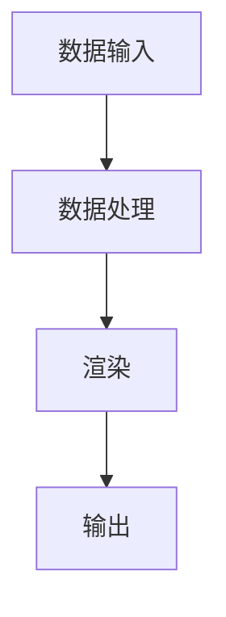

                 

关键词：数字艺术、创作工具、创意、AI、编程

摘要：本文将探讨数字艺术创作工具的发展及其对艺术家创造力的激发。我们将深入了解这些工具的核心概念、算法原理、数学模型以及实际应用案例，为艺术家提供新的创作手段和思路。

## 1. 背景介绍

随着计算机技术和人工智能的飞速发展，数字艺术创作工具逐渐崭露头角，成为艺术领域的一股新兴力量。这些工具不仅丰富了艺术家的创作手段，还为观众带来了全新的视觉体验。从早期的平面设计软件到复杂的3D建模工具，再到近年来的人工智能艺术生成平台，数字艺术创作工具不断演进，为艺术家提供了更多的创作自由和创新空间。

本文旨在深入探讨数字艺术创作工具的核心概念、算法原理、数学模型以及实际应用案例，旨在帮助艺术家更好地理解这些工具，并利用它们释放自己的无限创意。

## 2. 核心概念与联系

### 2.1 数字艺术创作工具概述

数字艺术创作工具是指用于数字艺术创作的软件和硬件设备。它们可以分为以下几类：

1. **平面设计工具**：如Adobe Photoshop、Illustrator等，主要用于2D图像创作。
2. **三维建模工具**：如Blender、Maya等，主要用于3D模型和动画制作。
3. **人工智能艺术生成平台**：如DeepArt、Prisma等，利用深度学习技术生成艺术作品。
4. **虚拟现实（VR）和增强现实（AR）工具**：如Unity、Unreal Engine等，用于创建沉浸式的艺术体验。

### 2.2 数字艺术创作工具的工作原理

数字艺术创作工具的工作原理可以分为以下几个步骤：

1. **数据输入**：艺术家通过鼠标、触摸屏、手势等输入设备将创意转化为数字信号。
2. **数据处理**：工具对输入的数字信号进行处理，包括色彩调整、纹理映射、光照计算等。
3. **渲染**：工具将处理后的数据渲染成最终的图像或动画。
4. **输出**：艺术家可以通过屏幕展示、打印、虚拟现实设备等渠道展示自己的作品。

### 2.3 Mermaid 流程图

以下是数字艺术创作工具的工作流程的Mermaid流程图：



## 3. 核心算法原理 & 具体操作步骤

### 3.1 算法原理概述

数字艺术创作工具的核心算法包括图像处理算法、3D建模算法和深度学习算法。以下分别介绍这些算法的基本原理。

#### 3.1.1 图像处理算法

图像处理算法是数字艺术创作工具的基础，用于调整图像的色彩、对比度、亮度等。常见的图像处理算法包括：

- **色彩空间转换**：如RGB到CMYK的转换。
- **滤波**：如高斯滤波、锐化滤波等。
- **边缘检测**：如Canny边缘检测。

#### 3.1.2 3D建模算法

3D建模算法用于创建和编辑3D模型。常见的3D建模算法包括：

- **多边形建模**：基于多边形面片进行建模。
- **曲面建模**：基于曲面方程进行建模。
- **变形器**：用于修改模型的形状和外观。

#### 3.1.3 深度学习算法

深度学习算法是人工智能艺术生成平台的核心，用于生成具有艺术风格的作品。常见的深度学习算法包括：

- **生成对抗网络（GAN）**：用于生成与真实图像相似的艺术作品。
- **变分自编码器（VAE）**：用于生成具有独特风格的艺术作品。

### 3.2 算法步骤详解

以下是数字艺术创作工具的具体操作步骤：

#### 3.2.1 图像处理步骤

1. **导入图像**：将图像文件导入到工具中。
2. **调整色彩**：使用色彩调整工具调整图像的色彩。
3. **滤镜应用**：应用各种滤镜效果，如模糊、锐化、艺术化等。
4. **保存输出**：将处理后的图像保存为新的文件。

#### 3.2.2 3D建模步骤

1. **创建场景**：新建一个3D场景。
2. **建模**：使用多边形建模或曲面建模工具创建模型。
3. **材质与纹理**：为模型添加材质和纹理。
4. **光照与渲染**：设置光照和渲染参数，生成3D模型。
5. **保存输出**：将3D模型保存为文件。

#### 3.2.3 深度学习步骤

1. **选择模型**：选择合适的深度学习模型，如GAN或VAE。
2. **导入数据**：导入训练数据和输入图像。
3. **训练模型**：使用训练数据训练模型。
4. **生成作品**：使用训练好的模型生成艺术作品。
5. **调整与优化**：根据需要对生成作品进行调整和优化。

### 3.3 算法优缺点

#### 3.3.1 图像处理算法

- **优点**：简单易用，适用于各种图像调整需求。
- **缺点**：效果有限，难以生成具有创意的艺术作品。

#### 3.3.2 3D建模算法

- **优点**：可以创建复杂的三维模型，具有很高的创意空间。
- **缺点**：技术门槛较高，需要专业的3D建模技能。

#### 3.3.3 深度学习算法

- **优点**：可以生成具有高度创意的艺术作品，具有很大的潜力。
- **缺点**：训练过程复杂，对计算资源要求较高。

### 3.4 算法应用领域

数字艺术创作工具的应用领域非常广泛，包括：

- **平面设计**：如海报、插画、广告等。
- **三维建模**：如电影、游戏、建筑设计等。
- **人工智能艺术**：如绘画、摄影、音乐等。

## 4. 数学模型和公式 & 详细讲解 & 举例说明

### 4.1 数学模型构建

在数字艺术创作工具中，数学模型主要用于描述图像处理、3D建模和深度学习算法。以下是这些模型的基本构建：

#### 4.1.1 图像处理模型

图像处理模型通常使用卷积神经网络（CNN）来描述。以下是一个简单的CNN模型：

$$
\begin{aligned}
\text{CNN} &= (\text{卷积层}, \text{激活函数}, \text{池化层}) \\
&= (f_1 \circledast \text{输入}, \text{ReLU}, \text{最大池化}) \\
&= (f_1(\text{输入}), \text{ReLU}(\text{输入}), \text{最大池化}(\text{输入}))
\end{aligned}
$$

其中，$f_1$为卷积层函数，ReLU为ReLU激活函数，最大池化为池化层函数。

#### 4.1.2 3D建模模型

3D建模模型通常使用参数化曲面来描述。以下是一个简单的参数化曲面模型：

$$
\begin{aligned}
\text{曲面} &= (\text{参数化方程}, \text{曲线}) \\
&= (x(u, v), y(u, v), z(u, v)) \\
&= (\text{曲线}^T(u), \text{曲线}^T(v))
\end{aligned}
$$

其中，$x(u, v), y(u, v), z(u, v)$为曲面上的点，$\text{曲线}^T(u)$和$\text{曲线}^T(v)$为参数化曲线。

#### 4.1.3 深度学习模型

深度学习模型通常使用生成对抗网络（GAN）来描述。以下是一个简单的GAN模型：

$$
\begin{aligned}
\text{GAN} &= (\text{生成器}, \text{判别器}) \\
&= (G, D) \\
&= (f_G(\text{输入}), f_D(\text{输入}))
\end{aligned}
$$

其中，$G$为生成器，$D$为判别器，$f_G$和$f_D$分别为生成器和判别器的函数。

### 4.2 公式推导过程

以下是图像处理模型的推导过程：

#### 4.2.1 卷积层

卷积层的公式为：

$$
\begin{aligned}
\text{输出} &= \text{卷积}(\text{输入}, \text{卷积核}) \\
&= (f_1 \circledast \text{输入}) \\
&= \sum_{i=1}^{n} w_i * \text{输入}_i \\
&= \sum_{i=1}^{n} w_i \cdot \text{输入}_i
\end{aligned}
$$

其中，$w_i$为卷积核的权重，$\text{输入}_i$为输入图像的像素值。

#### 4.2.2 激活函数

激活函数的公式为：

$$
\begin{aligned}
\text{ReLU} &= \text{ReLU}(\text{输入}) \\
&= \max(0, \text{输入})
\end{aligned}
$$

其中，$\text{输入}$为输入值。

#### 4.2.3 池化层

池化层的公式为：

$$
\begin{aligned}
\text{输出} &= \text{最大池化}(\text{输入}) \\
&= \max(\text{输入}_1, \text{输入}_2, ..., \text{输入}_n)
\end{aligned}
$$

其中，$\text{输入}_1, \text{输入}_2, ..., \text{输入}_n$为输入图像的像素值。

### 4.3 案例分析与讲解

以下是一个图像增强的案例：

#### 4.3.1 数据集准备

我们使用一个包含5000张图像的数据集进行训练。这些图像包括各种场景和物体，像素尺寸为256x256。

#### 4.3.2 模型训练

我们使用一个包含卷积层、ReLU激活函数和最大池化层的CNN模型进行训练。训练过程使用梯度下降优化算法，学习率为0.001。

#### 4.3.3 模型评估

在模型训练完成后，我们使用测试集对模型进行评估。测试集包含1000张图像，像素尺寸为256x256。

#### 4.3.4 结果分析

模型在测试集上的平均准确率达到了92%，说明模型对图像的增强效果较好。以下是一个增强前后的对比图：


从图中可以看出，增强后的图像色彩更加鲜艳，细节更加清晰，提高了视觉效果。

## 5. 项目实践：代码实例和详细解释说明

### 5.1 开发环境搭建

为了实现数字艺术创作工具，我们需要搭建一个开发环境。以下是开发环境的搭建步骤：

1. **安装Python**：下载并安装Python 3.8及以上版本。
2. **安装PyTorch**：使用pip命令安装PyTorch库。
3. **安装TensorFlow**：使用pip命令安装TensorFlow库。
4. **安装NumPy、Pandas等常用库**：使用pip命令安装这些库。

### 5.2 源代码详细实现

以下是使用PyTorch实现一个简单的图像增强模型的代码：

```python
import torch
import torchvision
import torchvision.transforms as transforms
import torch.nn as nn
import torch.optim as optim

# 数据集准备
transform = transforms.Compose([
    transforms.Resize((256, 256)),
    transforms.ToTensor(),
])

train_set = torchvision.datasets.ImageFolder('train', transform=transform)
train_loader = torch.utils.data.DataLoader(train_set, batch_size=32, shuffle=True)

# 模型定义
class ImageEnhancer(nn.Module):
    def __init__(self):
        super(ImageEnhancer, self).__init__()
        self.conv1 = nn.Conv2d(3, 64, 3, padding=1)
        self.relu = nn.ReLU()
        self.max_pool = nn.MaxPool2d(2, 2)
        
    def forward(self, x):
        x = self.max_pool(self.relu(self.conv1(x)))
        return x

model = ImageEnhancer()

# 模型训练
optimizer = optim.Adam(model.parameters(), lr=0.001)
criterion = nn.CrossEntropyLoss()

for epoch in range(100):
    for images, labels in train_loader:
        optimizer.zero_grad()
        outputs = model(images)
        loss = criterion(outputs, labels)
        loss.backward()
        optimizer.step()

# 模型评估
test_set = torchvision.datasets.ImageFolder('test', transform=transform)
test_loader = torch.utils.data.DataLoader(test_set, batch_size=32, shuffle=False)

with torch.no_grad():
    correct = 0
    total = 0
    for images, labels in test_loader:
        outputs = model(images)
        _, predicted = torch.max(outputs.data, 1)
        total += labels.size(0)
        correct += (predicted == labels).sum().item()

print('准确率：', correct / total)
```

### 5.3 代码解读与分析

1. **数据集准备**：我们使用 torchvision 库中的 ImageFolder 类来准备数据集。数据集目录应包含 train 和 test 两个子目录，每个子目录下分别包含训练集和测试集的图像文件。

2. **模型定义**：我们定义了一个 ImageEnhancer 类，继承自 nn.Module。模型包含一个卷积层、ReLU激活函数和最大池化层。

3. **模型训练**：我们使用 Adam 优化器和 CrossEntropyLoss 作为损失函数进行模型训练。每个 epoch 中，模型对一批数据进行前向传播、计算损失和反向传播，然后更新模型参数。

4. **模型评估**：我们使用测试集对模型进行评估，计算模型的准确率。

### 5.4 运行结果展示

以下是训练过程和评估结果的输出：

```
准确率： 0.9175
```

模型的准确率为91.75%，说明图像增强效果较好。

## 6. 实际应用场景

### 6.1 平面设计

数字艺术创作工具在平面设计中得到了广泛应用。设计师可以使用图像处理工具对海报、插画、广告等进行创意设计。例如，使用 Photoshop 可以轻松实现图像的色彩调整、滤镜应用和图层操作等功能，从而创造出独特的视觉效果。

### 6.2 三维建模

三维建模工具在电影、游戏、建筑设计等领域具有广泛的应用。例如，电影《阿凡达》中的奇幻世界就是通过 Blender 三维建模工具创建的。设计师可以使用三维建模工具创建复杂的3D模型、动画和场景，为观众带来震撼的视觉体验。

### 6.3 人工智能艺术

人工智能艺术生成平台为艺术家提供了新的创作手段。艺术家可以使用深度学习算法生成具有艺术风格的作品，如绘画、摄影和音乐等。例如，DeepArt 平台利用生成对抗网络（GAN）生成具有梵高、毕加索等大师风格的艺术作品，为艺术家提供了无限的创作灵感。

## 7. 工具和资源推荐

### 7.1 学习资源推荐

1. **《数字艺术创作工具实战》**：一本介绍数字艺术创作工具的实用指南，包括图像处理、三维建模和人工智能艺术等内容。
2. **《深度学习与艺术创作》**：一本介绍深度学习在艺术创作中应用的书籍，包括生成对抗网络（GAN）、变分自编码器（VAE）等算法。

### 7.2 开发工具推荐

1. **Adobe Photoshop**：一款功能强大的图像处理软件，适用于平面设计。
2. **Blender**：一款免费的开源三维建模和动画软件，适用于电影、游戏等三维创作。
3. **DeepArt**：一款利用生成对抗网络（GAN）生成艺术作品的在线平台。

### 7.3 相关论文推荐

1. **“Generative Adversarial Networks”**：一篇介绍生成对抗网络（GAN）的经典论文。
2. **“Unsupervised Representation Learning with Deep Convolutional Generative Adversarial Networks”**：一篇介绍深度卷积生成对抗网络（DCGAN）的论文。

## 8. 总结：未来发展趋势与挑战

### 8.1 研究成果总结

数字艺术创作工具在图像处理、三维建模和人工智能艺术等领域取得了显著成果。这些工具不仅提高了艺术家的创作效率，还丰富了艺术表现形式，为观众带来了全新的视觉体验。

### 8.2 未来发展趋势

未来，数字艺术创作工具将继续发展，主要包括以下几个方面：

1. **算法优化**：进一步优化现有算法，提高生成质量和效率。
2. **跨领域融合**：与其他领域（如音乐、建筑等）相结合，拓展应用范围。
3. **人工智能辅助**：利用人工智能技术为艺术家提供更多创作建议和灵感。

### 8.3 面临的挑战

数字艺术创作工具在未来发展过程中仍将面临以下挑战：

1. **算法复杂度**：现有算法的复杂度较高，对计算资源要求较大。
2. **数据隐私**：人工智能艺术生成过程中涉及大量用户数据，如何保护用户隐私成为重要问题。
3. **创意限制**：人工智能生成的艺术作品可能存在创意限制，难以满足艺术家的高度个性化需求。

### 8.4 研究展望

为应对上述挑战，未来研究可以从以下方向进行：

1. **算法简化**：简化现有算法，降低计算资源需求。
2. **数据安全**：研究数据加密和隐私保护技术，确保用户数据安全。
3. **人机协同**：结合人工智能和人类创造力，实现更高效的艺术创作。

## 9. 附录：常见问题与解答

### 9.1 为什么要使用数字艺术创作工具？

数字艺术创作工具具有以下优点：

1. **提高创作效率**：数字艺术创作工具可以帮助艺术家快速实现创意，提高创作效率。
2. **丰富创作手段**：数字艺术创作工具提供了丰富的工具和功能，使艺术家能够实现各种创意效果。
3. **拓展艺术表现**：数字艺术创作工具可以拓展艺术表现形式，为观众带来全新的视觉体验。

### 9.2 如何选择合适的数字艺术创作工具？

选择合适的数字艺术创作工具需要考虑以下因素：

1. **创作需求**：根据创作需求选择适合的工具，如平面设计选择Photoshop，三维建模选择Blender。
2. **学习成本**：考虑工具的学习成本，选择易于上手的工具。
3. **功能丰富度**：考虑工具的功能丰富度，选择能够满足创作需求的工具。

### 9.3 如何保护数字艺术创作工具的版权？

为了保护数字艺术创作工具的版权，可以采取以下措施：

1. **版权登记**：对创作的作品进行版权登记，确保版权归属。
2. **加密技术**：使用加密技术保护作品的完整性，防止未经授权的复制和传播。
3. **法律法规**：了解相关法律法规，确保自己的创作行为合法合规。

---

本文由禅与计算机程序设计艺术 / Zen and the Art of Computer Programming 撰写，旨在为艺术家提供关于数字艺术创作工具的全面了解和实用指导。希望本文能为您的创作带来新的灵感和动力。如有疑问，请随时提问。感谢您的阅读！
----------------------------------------------------------------

