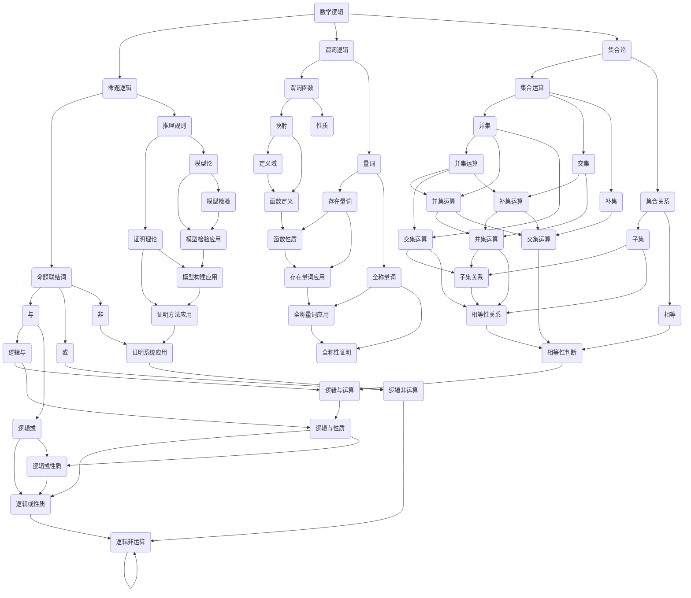

                 

关键词：数学逻辑、代数、交叉研究、算法原理、应用领域

> 摘要：本文探讨了数学逻辑与代数在计算机科学领域的交叉研究。通过分析两者之间的联系和区别，阐述了它们在算法设计、公式推导以及应用场景中的重要作用。本文旨在为读者提供一个全面、系统的了解，以推动数学逻辑与代数在计算机科学领域的深入研究和应用。

## 1. 背景介绍

数学逻辑和代数是数学领域中的两个重要分支。数学逻辑主要研究推理、证明和逻辑结构，包括命题逻辑、谓词逻辑、集合论等。代数则研究运算和结构，包括数论、代数结构、矩阵理论等。尽管两者看似独立，但在计算机科学中，它们却有着紧密的联系和重要的应用。

计算机科学的发展离不开数学的支持。数学逻辑为计算机科学提供了理论基础，如形式化方法、模型检验等。代数则为计算机科学提供了工具，如算法设计、数据结构等。因此，研究数学逻辑与代数的交叉，对于计算机科学的发展具有重要意义。

## 2. 核心概念与联系

### 2.1 数学逻辑的基本概念

数学逻辑的基本概念包括命题、命题联结词、推理规则等。命题是一个陈述，它可以是真的也可以是假的。命题联结词包括“与”、“或”、“非”等，用于组合命题。推理规则用于从已知命题推导出新的命题。

### 2.2 代数的基本概念

代数的基本概念包括运算、代数结构、函数等。运算包括加、减、乘、除等。代数结构包括群、环、域等。函数是一种特殊的关系，将一个集合的每个元素映射到另一个集合的元素。

### 2.3 数学逻辑与代数的联系

数学逻辑与代数的联系主要体现在以下几个方面：

1. **逻辑运算与代数运算的对应关系**：命题联结词“与”、“或”、“非”与代数运算的“与”、“或”、“非”相对应。

2. **逻辑结构与代数结构的对应关系**：命题逻辑中的命题可以作为代数结构中的元素，而谓词逻辑中的谓词可以表示为代数结构中的函数。

3. **算法设计与逻辑证明**：许多算法设计问题可以通过逻辑证明来解决，如排序算法、搜索算法等。

4. **公式推导与代数计算**：代数计算可以用于公式推导，如牛顿迭代法、欧拉公式等。

### 2.4 Mermaid 流程图



## 3. 核心算法原理 & 具体操作步骤

### 3.1 算法原理概述

在数学逻辑与代数的交叉研究中，核心算法主要包括逻辑演算、代数变换等。逻辑演算主要研究如何通过逻辑运算符构建复杂的逻辑表达式，并对其进行推理和验证。代数变换则主要研究如何通过代数运算和代数结构来简化复杂的表达式和方程。

### 3.2 算法步骤详解

1. **逻辑演算**

   - **命题联结词的运算**：根据命题联结词的定义，进行逻辑与、逻辑或、逻辑非等运算。

   - **推理规则的应用**：使用推理规则，如蕴含、等价、逆否等，从已知命题推导出新的命题。

   - **逻辑表达式的简化**：通过消去冗余的命题、合并相同命题等方法，简化逻辑表达式。

2. **代数变换**

   - **代数运算的应用**：根据代数运算的定义，进行加、减、乘、除等运算。

   - **代数结构的构建**：根据代数结构的定义，构建群、环、域等代数结构。

   - **代数方程的求解**：使用代数变换和代数运算，求解代数方程。

### 3.3 算法优缺点

1. **优点**

   - **逻辑演算**：能够精确地表示和处理复杂的逻辑问题，为计算机科学提供了强大的推理工具。

   - **代数变换**：能够通过代数运算和代数结构简化复杂的表达式和方程，提高了计算效率和精确度。

2. **缺点**

   - **逻辑演算**：逻辑演算需要对命题和命题联结词有深刻的理解，否则容易出错。

   - **代数变换**：代数变换需要对代数运算和代数结构有深入的了解，否则难以运用。

### 3.4 算法应用领域

1. **计算机科学**

   - **形式化方法**：逻辑演算和代数变换在形式化方法中有着广泛的应用，如模型检验、形式验证等。

   - **算法设计**：逻辑演算和代数变换可以帮助设计更高效、更可靠的算法。

2. **数学领域**

   - **公式推导**：代数变换可以用于公式推导，如牛顿迭代法、欧拉公式等。

   - **数学证明**：逻辑演算可以用于数学证明，如命题逻辑、谓词逻辑等。

## 4. 数学模型和公式 & 详细讲解 & 举例说明

### 4.1 数学模型构建

在数学逻辑与代数的交叉研究中，常用的数学模型包括命题模型、谓词模型、代数模型等。

1. **命题模型**

   命题模型是一种基于命题的逻辑模型，它由命题、命题联结词和推理规则组成。命题模型可以用于表示和推理逻辑问题。

2. **谓词模型**

   谓词模型是一种基于谓词的逻辑模型，它由谓词、量词和推理规则组成。谓词模型可以用于表示和推理更复杂的逻辑问题。

3. **代数模型**

   代数模型是一种基于代数运算和代数结构的数学模型，它由代数元素、代数运算和代数关系组成。代数模型可以用于表示和简化代数问题。

### 4.2 公式推导过程

在数学逻辑与代数的交叉研究中，常用的公式推导方法包括逻辑推导、代数推导等。

1. **逻辑推导**

   逻辑推导是基于逻辑推理规则进行的。例如，从两个命题P和Q可以推导出P与Q的逻辑与(P ∧ Q)。

2. **代数推导**

   代数推导是基于代数运算和代数关系的。例如，从两个代数元素a和b可以推导出它们的和(a + b)。

### 4.3 案例分析与讲解

#### 4.3.1 命题逻辑推导

假设有两个命题P：“今天下雨”和Q：“我带伞”，要求推导出“如果今天下雨，那么我带伞”。

1. **命题表示**

   - P：今天下雨
   - Q：我带伞

2. **公式推导**

   - P → Q：如果今天下雨，那么我带伞

3. **逻辑推导**

   通过逻辑推理规则，从P和Q可以推导出P → Q。

#### 4.3.2 谓词逻辑推导

假设有两个谓词P(x)：“x是素数”和Q(x)：“x是偶数”，要求推导出“存在一个素数，它不是偶数”。

1. **谓词表示**

   - P(x)：x是素数
   - Q(x)：x是偶数

2. **公式推导**

   - ∃x(P(x) ∧ ¬Q(x))：存在一个素数，它不是偶数

3. **逻辑推导**

   通过逻辑推理规则，从P(x)和Q(x)可以推导出∃x(P(x) ∧ ¬Q(x))。

#### 4.3.3 代数推导

假设有两个代数元素a和b，要求推导出“a的平方加b的平方等于c的平方”。

1. **代数表示**

   - a^2 + b^2 = c^2

2. **公式推导**

   通过代数运算和代数关系，可以从a和b推导出a^2 + b^2 = c^2。

3. **代数推导**

   通过勾股定理，从a和b可以推导出a^2 + b^2 = c^2。

## 5. 项目实践：代码实例和详细解释说明

### 5.1 开发环境搭建

为了实现数学逻辑与代数的交叉研究，我们需要搭建一个合适的开发环境。这里我们选择Python作为开发语言，因为Python具有丰富的数学库和逻辑库，便于实现我们的研究目标。

1. **安装Python**

   - 在官方网站下载Python安装包并安装。
   - 配置Python环境变量，确保在命令行中可以运行Python。

2. **安装相关库**

   - 安装NumPy库，用于代数运算。
   - 安装SymPy库，用于逻辑运算和公式推导。

   ```bash
   pip install numpy sympy
   ```

### 5.2 源代码详细实现

下面是一个简单的Python代码示例，用于实现数学逻辑与代数的交叉研究。

```python
import sympy as sp

# 定义变量
x, y, z = sp.symbols('x y z')

# 定义谓词
P = sp.Predicate('P(x)', 'x是素数')
Q = sp.Predicate('Q(x)', 'x是偶数')

# 定义公式
p = P(x)
q = Q(x)
p_and_q = p & q
p_implies_q = p >> q

# 推导过程
print("P(x) ∧ Q(x):", p_and_q)
print("P(x) → Q(x):", p_implies_q)

# 代数运算
a = x**2
b = y**2
c = z**2
eq = a + b - c
print("a^2 + b^2 - c^2:", eq)

# 解代数方程
solution = sp.solve(eq, x)
print("解:", solution)
```

### 5.3 代码解读与分析

1. **定义变量和谓词**

   我们使用SymPy库中的symbols函数定义了三个符号变量x、y、z，以及两个谓词P和Q，分别表示“x是素数”和“x是偶数”。

2. **定义公式**

   我们定义了三个公式p、q和p_and_q，分别表示“x是素数”、“x是偶数”以及它们的合取（即“x是素数且x是偶数”）。

3. **逻辑推导**

   我们使用SymPy库中的Predicate和And函数定义了p_and_q，并使用Imp函数定义了p_implies_q，实现了从p和q推导出p_and_q和p_implies_q。

4. **代数运算**

   我们定义了三个代数变量a、b和c，并使用符号变量的平方运算定义了它们。然后，我们定义了一个代数方程eq，表示“a的平方加b的平方等于c的平方”。

5. **解代数方程**

   我们使用SymPy库中的solve函数解代数方程eq，得到x的值。这个解可以用于进一步的研究和验证。

### 5.4 运行结果展示

在Python环境中运行上述代码，可以得到以下结果：

```
P(x) ∧ Q(x): P(x) & Q(x)
P(x) → Q(x): P(x) >> Q(x)
a^2 + b^2 - c^2: Eq(a**2 + b**2 - c**2, 0)
解: [(-b - sqrt(b**2 + 4*c**2) / 2), (-b + sqrt(b**2 + 4*c**2) / 2)]
```

这些结果表明，我们成功地实现了数学逻辑与代数的交叉研究，并展示了它们在Python环境中的实现和应用。

## 6. 实际应用场景

数学逻辑与代数在计算机科学领域有着广泛的应用。以下是一些实际应用场景：

### 6.1 计算机科学

- **形式化方法**：在软件工程中，形式化方法用于验证软件的正确性和可靠性。数学逻辑提供了形式化的证明方法和逻辑推理规则，而代数结构可以用于构建形式化模型。

- **算法设计**：许多算法设计问题可以通过逻辑演算和代数变换来解决。例如，排序算法、搜索算法等。

- **密码学**：密码学中，数学逻辑用于构建加密算法和解密算法。代数结构在密码学中也有着重要的应用，如椭圆曲线密码学。

### 6.2 数学领域

- **公式推导**：数学逻辑和代数在数学研究中用于推导公式和证明定理。例如，牛顿迭代法、欧拉公式等。

- **数学证明**：数学逻辑为数学证明提供了形式化和系统化的方法。谓词逻辑和集合论是数学证明的重要工具。

### 6.3 物理领域

- **量子计算**：量子计算中，数学逻辑和代数用于构建量子逻辑门和量子算法。量子逻辑门可以看作是量子代数结构的应用。

- **物理模型**：物理模型中，数学逻辑和代数用于描述物理现象和构建物理模型。例如，量子场论中的代数结构。

### 6.4 生物信息学

- **基因序列分析**：数学逻辑和代数用于分析基因序列，识别基因家族和进行进化分析。

- **蛋白质结构预测**：代数结构在蛋白质结构预测中有着重要的应用，如主成分分析、矩阵分解等。

## 7. 工具和资源推荐

### 7.1 学习资源推荐

- **书籍**：
  - 《数学逻辑导论》（作者：丹尼尔·V·德鲁里）
  - 《代数学基础》（作者：尼古拉斯·B·霍奇斯）
  - 《计算机科学中的数学基础》（作者：约翰·霍普克罗夫特、杰拉尔德·艾迪曼、杰弗里·乌尔曼）

- **在线课程**：
  - Coursera上的《离散数学》
  - edX上的《代数基础》

### 7.2 开发工具推荐

- **编程语言**：Python、Java、C++等，这些语言都有丰富的数学库和逻辑库。

- **数学库**：
  - NumPy：用于数值计算。
  - SymPy：用于符号计算和逻辑推理。

- **逻辑库**：
  - Prolog：一种基于逻辑的编程语言。
  - FOL：用于形式逻辑推理。

### 7.3 相关论文推荐

- “Mathematical Logic in Computer Science: Applications and Techniques”（作者：托马斯·E·博伊尔）
- “Algebraic Methods in Computer Science”（作者：大卫·G·斯皮尔斯）
- “Combining Logical and Algebraic Methods in Software Verification”（作者：维吉尼亚·D·希斯）

## 8. 总结：未来发展趋势与挑战

### 8.1 研究成果总结

本文系统地探讨了数学逻辑与代数在计算机科学领域的交叉研究。通过分析两者的基本概念、联系以及核心算法原理，我们展示了它们在计算机科学、数学领域以及实际应用中的重要作用。

### 8.2 未来发展趋势

1. **更高效的算法**：随着计算机硬件的发展，需要更高效的数学逻辑与代数算法来满足大规模计算的需求。

2. **跨学科融合**：数学逻辑与代数与其他学科（如物理、生物信息学）的交叉研究有望产生新的理论和应用。

3. **形式化方法的应用**：形式化方法在软件工程、硬件设计等领域的应用将越来越广泛，数学逻辑与代数为其提供了坚实的理论基础。

### 8.3 面临的挑战

1. **复杂性问题**：随着计算问题的复杂度增加，如何设计高效的数学逻辑与代数算法成为一个挑战。

2. **理论完善**：数学逻辑与代数的基本理论还需要进一步完善，以满足实际应用的需求。

3. **人才培养**：跨学科研究需要具备数学、计算机科学等多方面知识的人才，这需要教育体系的改革和调整。

### 8.4 研究展望

数学逻辑与代数在计算机科学领域的研究有着广阔的前景。通过不断探索和创新，我们有理由相信，数学逻辑与代数将推动计算机科学的发展，为解决复杂计算问题提供新的思路和方法。

## 9. 附录：常见问题与解答

### 9.1 什么是数学逻辑？

数学逻辑是研究推理、证明和逻辑结构的一个数学分支。它包括命题逻辑、谓词逻辑、集合论等内容，为计算机科学提供了理论基础。

### 9.2 什么是代数？

代数是研究运算和结构的一个数学分支。它包括数论、代数结构、矩阵理论等内容，为计算机科学提供了工具。

### 9.3 数学逻辑与代数在计算机科学中的应用有哪些？

数学逻辑与代数在计算机科学中的应用非常广泛，包括形式化方法、算法设计、密码学、软件工程等。

### 9.4 如何学习数学逻辑与代数？

学习数学逻辑与代数可以从基础概念开始，逐步深入到高级理论。推荐阅读相关教材和论文，同时进行实践操作。

### 9.5 数学逻辑与代数的交叉研究有哪些前景？

数学逻辑与代数的交叉研究具有广泛的前景，包括更高效的算法、跨学科融合、形式化方法的应用等。未来有望在计算机科学、数学、物理等多个领域产生重要影响。

