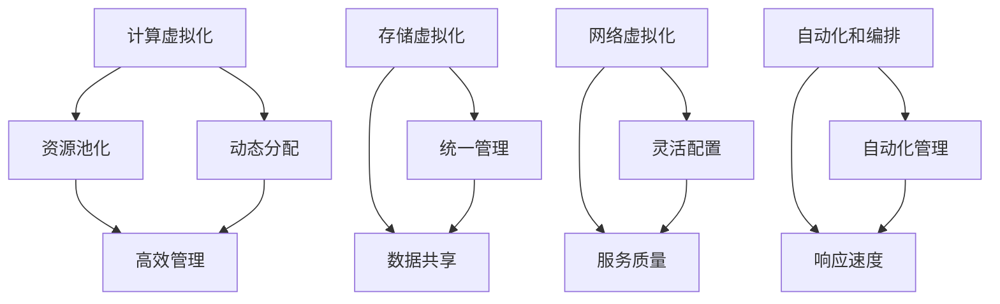
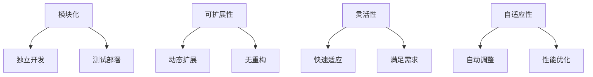

                 

关键词：数据中心成本，软件2.0，算力革命，技术创新，成本优化，未来展望

> 摘要：随着数据中心需求的不断增加，成本问题成为了限制其发展的主要瓶颈。本文将探讨软件2.0如何通过技术创新和优化策略，推动算力新革命，从而有效降低数据中心成本，助力企业的可持续发展。

## 1. 背景介绍

数据中心是现代信息社会的重要基础设施，它们提供了计算、存储、网络等资源，支持了全球范围内的大量业务和服务。然而，随着数据量的爆炸性增长和业务需求的持续提高，数据中心的运营成本也在不断攀升。尤其是电力成本、硬件维护成本、扩展成本等，使得企业面临巨大的财务压力。

### 1.1 数据中心成本的主要构成

数据中心成本主要包括以下几个方面：

- **电力成本**：数据中心需要大量电力来支持服务器、存储设备和其他硬件的运行，电力成本通常占据总运营成本的30%-50%。
- **硬件维护成本**：包括服务器、存储设备、网络设备等的硬件维护和更新费用。
- **扩展成本**：随着数据量和业务需求的增长，数据中心需要不断进行硬件扩展，这涉及到额外的投资和运营成本。
- **人力成本**：包括数据中心运营和管理人员的工资、培训和福利等。

### 1.2 数据中心成本攀升的原因

- **数据量增长**：随着物联网、人工智能、大数据等技术的普及，数据量呈指数级增长，导致数据中心需要更多的存储和处理资源。
- **硬件性能提升**：服务器性能的提升和存储技术的进步，虽然提高了数据处理能力，但同时也增加了能耗。
- **业务需求增加**：企业对实时数据处理、高效计算和持续运行的需求不断提高，推动了数据中心规模和复杂度的增加。

## 2. 核心概念与联系

### 2.1 软件定义数据中心（SDDC）

软件定义数据中心（Software-Defined Data Center，SDDC）是一种通过软件控制和管理数据中心的计算、存储和网络资源的技术。它将传统的硬件依赖性降低，通过虚拟化和自动化，实现了资源的高效管理和动态调整。

#### 2.1.1 SDDC架构

SDDC的架构通常包括以下几个核心组件：

- **计算虚拟化**：通过虚拟化技术，将物理服务器的计算资源抽象化，实现资源池化和动态分配。
- **存储虚拟化**：将物理存储资源抽象化，提供统一的存储管理和服务，支持数据的高效访问和共享。
- **网络虚拟化**：通过网络虚拟化技术，实现网络资源的抽象和管理，支持灵活的网络配置和服务质量保证。
- **自动化和编排**：通过自动化工具和编排平台，实现数据中心的自动化管理，降低人工干预，提高资源利用率和响应速度。

#### 2.1.2 Mermaid流程图



### 2.2 软件2.0

软件2.0是指新一代的软件开发方法和技术，它强调软件的模块化、可扩展性、灵活性和自适应性。软件2.0的核心目标是提高软件的开发效率、降低维护成本，并实现软件与硬件的解耦。

#### 2.2.1 软件2.0的关键特点

- **模块化**：软件被分解为多个独立的功能模块，每个模块都可以独立开发、测试和部署。
- **可扩展性**：系统可以根据需求动态扩展功能，而无需大规模重构。
- **灵活性**：软件能够快速适应环境变化，满足不同业务需求。
- **自适应性**：系统能够根据使用情况自动调整资源分配和性能优化。

#### 2.2.2 Mermaid流程图



## 3. 核心算法原理 & 具体操作步骤

### 3.1 算法原理概述

软件2.0的核心算法包括虚拟化技术、容器化技术、自动化编排技术等。这些算法通过优化资源利用、降低运维成本、提高系统弹性，实现了对数据中心的全方位优化。

#### 3.1.1 虚拟化技术

虚拟化技术是软件2.0的基础，它通过将物理资源抽象化为虚拟资源，实现了资源池化和动态分配。虚拟化技术主要包括计算虚拟化、存储虚拟化和网络虚拟化。

- **计算虚拟化**：通过虚拟化技术，将物理服务器的计算资源抽象化为多个虚拟机（VM），实现资源的高效利用和动态分配。
- **存储虚拟化**：将物理存储资源抽象化为多个虚拟存储卷，提供统一的存储管理和服务。
- **网络虚拟化**：通过网络虚拟化技术，实现网络资源的抽象和管理，支持灵活的网络配置和服务质量保证。

#### 3.1.2 容器化技术

容器化技术是软件2.0的另一个重要组成部分，它通过轻量级的容器，实现了应用程序与操作系统的隔离，提高了部署效率和系统弹性。

- **Docker**：最流行的容器化平台，通过将应用程序及其依赖环境打包为容器镜像，实现了一键部署和跨平台运行。
- **Kubernetes**：容器编排平台，通过自动化部署、扩展和管理容器化应用，提高了系统的可用性和稳定性。

#### 3.1.3 自动化编排技术

自动化编排技术通过自动化工具和编排平台，实现数据中心的自动化管理，降低人工干预，提高资源利用率和响应速度。

- **Ansible**：自动化工具，通过简单的指令，实现自动化部署、配置和管理。
- **Terraform**：基础设施即代码（IaC）工具，通过代码定义和管理数据中心基础设施。

### 3.2 算法步骤详解

#### 3.2.1 虚拟化技术

1. **计算虚拟化**：
   - **虚拟化硬件资源**：通过虚拟化软件（如VMware、KVM等），将物理服务器的CPU、内存、硬盘等硬件资源抽象化为虚拟资源。
   - **创建虚拟机**：根据业务需求，创建多个虚拟机，每个虚拟机独立运行操作系统和应用。
   - **资源动态分配**：根据虚拟机的运行状态和业务负载，动态调整虚拟机的资源分配，实现资源的高效利用。

2. **存储虚拟化**：
   - **虚拟存储卷**：将物理存储资源（如硬盘、存储阵列）抽象化为多个虚拟存储卷。
   - **统一管理**：通过虚拟存储管理软件（如VMware VSAN、OpenStack Cinder等），实现对存储资源的高效管理和调度。
   - **数据共享**：支持多个虚拟机之间的数据共享和访问，提高数据的可用性和一致性。

3. **网络虚拟化**：
   - **虚拟网络接口**：为每个虚拟机分配独立的虚拟网络接口，实现网络隔离和访问控制。
   - **灵活配置**：通过虚拟交换机（如VMware NSX、OpenVSwitch等），实现网络的灵活配置和服务质量保证。
   - **网络监控**：通过网络监控工具，实时监控网络性能和流量，实现网络的优化和故障排除。

#### 3.2.2 容器化技术

1. **Docker容器化**：
   - **容器镜像**：将应用程序及其依赖环境打包为容器镜像，实现了一键部署和跨平台运行。
   - **容器运行时**：在宿主机上运行容器镜像，实现应用程序的隔离和运行。
   - **容器编排**：通过Docker Compose或Kubernetes，实现对容器的自动化部署、扩展和管理。

2. **Kubernetes容器编排**：
   - **部署应用**：通过Kubernetes的Deployment控制器，实现应用的自动化部署和更新。
   - **水平扩展**：通过Kubernetes的Horizontal Pod Autoscaler，实现应用的自动扩展和负载均衡。
   - **服务发现和负载均衡**：通过Kubernetes的服务（Service）和Ingress控制器，实现服务的自动发现和负载均衡。

#### 3.2.3 自动化编排技术

1. **Ansible自动化**：
   - **编写Playbook**：通过Ansible的Playbook，定义自动化任务和流程。
   - **执行任务**：通过Ansible的执行模块，自动化部署、配置和管理服务器和应用程序。

2. **Terraform基础设施即代码**：
   - **编写配置文件**：通过Terraform的配置文件（HCL或JSON），定义数据中心的基础设施。
   - **初始化和部署**：通过Terraform的初始化命令和apply命令，自动化部署和管理数据中心基础设施。

### 3.3 算法优缺点

#### 3.3.1 虚拟化技术

- **优点**：
  - 提高资源利用率：通过虚拟化技术，可以实现资源的高效利用和动态调整。
  - 灵活性和可扩展性：支持多种操作系统和应用，可以实现灵活部署和快速扩展。
  - 降低运维成本：通过自动化管理和集中控制，可以降低运维成本和提高运维效率。

- **缺点**：
  - 性能开销：虚拟化技术引入了一定的性能开销，可能会降低系统的性能。
  - 管理复杂性：虚拟化环境相对复杂，需要专业的管理和维护。

#### 3.3.2 容器化技术

- **优点**：
  - 轻量级：容器化技术相对于虚拟化技术，具有更轻量级的特点，提高了系统的性能和响应速度。
  - 快速部署：通过容器镜像，可以实现快速部署和跨平台运行。
  - 高度可扩展性：支持水平扩展和自动扩缩容，提高了系统的弹性和可靠性。

- **缺点**：
  - 环境依赖：容器化应用对运行环境有一定的依赖，可能需要额外的配置和优化。
  - 安全性：容器化技术存在一定的安全风险，需要加强安全管理和监控。

#### 3.3.3 自动化编排技术

- **优点**：
  - 自动化运维：通过自动化工具，可以实现自动化部署、配置和管理，提高运维效率。
  - 灵活性：支持灵活的配置和管理，可以根据业务需求快速调整和优化系统。
  - 可扩展性：支持大规模基础设施的自动化管理和扩展。

- **缺点**：
  - 学习成本：自动化工具和编排平台通常需要一定的学习和掌握，可能会增加学习成本。
  - 可靠性：自动化流程的可靠性和稳定性需要经过长时间的验证和测试。

### 3.4 算法应用领域

- **数据中心**：通过虚拟化、容器化和自动化技术，优化数据中心资源利用和运维管理。
- **云计算**：在云计算平台上，通过容器化和自动化技术，实现高效的应用部署和资源管理。
- **边缘计算**：在边缘计算场景中，通过轻量级的容器化技术，实现高效的应用部署和边缘计算优化。
- **大数据处理**：在大数据处理场景中，通过虚拟化和容器化技术，实现高效的数据处理和存储管理。

## 4. 数学模型和公式 & 详细讲解 & 举例说明

### 4.1 数学模型构建

在数据中心成本优化中，常用的数学模型包括资源利用率模型、成本优化模型和能耗模型等。

#### 4.1.1 资源利用率模型

资源利用率模型用于计算数据中心的资源利用率，公式如下：

$$
利用率 = \frac{实际使用资源}{总资源容量}
$$

其中，实际使用资源包括CPU、内存、存储和网络等资源的实际使用量，总资源容量包括数据中心的物理资源容量。

#### 4.1.2 成本优化模型

成本优化模型用于计算数据中心的优化成本，公式如下：

$$
成本 = \frac{总运营成本}{利用率}
$$

其中，总运营成本包括电力成本、硬件维护成本、扩展成本和人力成本等。

#### 4.1.3 能耗模型

能耗模型用于计算数据中心的能耗，公式如下：

$$
能耗 = \frac{总运营成本}{电力成本}
$$

其中，电力成本通常与数据中心的能耗呈线性关系。

### 4.2 公式推导过程

为了推导上述公式，我们需要对数据中心的各项成本和资源进行数学建模。

1. **资源利用率模型**：

假设数据中心的物理资源容量为$C$，实际使用资源为$R$，则资源利用率$U$为：

$$
U = \frac{R}{C}
$$

2. **成本优化模型**：

总运营成本$T$包括电力成本$E$、硬件维护成本$M$、扩展成本$X$和人力成本$H$，则总运营成本$T$为：

$$
T = E + M + X + H
$$

为了优化成本，我们需要找到一个利用率$U$，使得总运营成本$T$最小。根据资源利用率模型，我们可以将总运营成本$T$表示为：

$$
T = \frac{E}{U} + M + X + H
$$

为了使总运营成本$T$最小，我们可以对$T$关于$U$求导，并令导数为0，得到最优利用率$U^*$：

$$
\frac{dT}{dU} = -\frac{E}{U^2} + \frac{dM}{dU} + \frac{dX}{dU} + \frac{dH}{dU} = 0
$$

由于$M$、$X$和$H$通常与利用率无关，我们可以忽略它们对导数的影响，得到：

$$
-\frac{E}{U^2} = 0
$$

解得最优利用率$U^* = \sqrt{\frac{E}{M + X + H}}$。

3. **能耗模型**：

假设电力成本$E$与数据中心的能耗$E_{energy}$呈线性关系，即$E = k \cdot E_{energy}$，其中$k$为电力成本系数。则能耗$E_{energy}$为：

$$
E_{energy} = \frac{E}{k}
$$

### 4.3 案例分析与讲解

假设一家企业拥有一个数据中心，物理资源容量为100个CPU核心、100GB内存、1PB存储和10Gbps网络。实际使用资源为60个CPU核心、60GB内存、500GB存储和5Gbps网络。

1. **资源利用率**：

- CPU利用率：$\frac{60}{100} = 0.6$
- 内存利用率：$\frac{60}{100} = 0.6$
- 存储利用率：$\frac{500}{1PB} = 0.5$
- 网络利用率：$\frac{5}{10} = 0.5$

2. **总运营成本**：

- 电力成本：假设电力成本为0.1元/千瓦时，则电力成本为$0.1 \times 10^6 = 10^5$元。
- 硬件维护成本：假设为2万元。
- 扩展成本：假设为5万元。
- 人力成本：假设为3万元。

总运营成本为：

$$
T = 10^5 + 2万 + 5万 + 3万 = 20万
$$

3. **最优利用率**：

根据成本优化模型，最优利用率为：

$$
U^* = \sqrt{\frac{10^5}{2万 + 5万 + 3万}} = 0.5
$$

4. **能耗**：

根据能耗模型，能耗为：

$$
E_{energy} = \frac{10^5}{0.1} = 10^6
$$

### 5. 项目实践：代码实例和详细解释说明

在本文中，我们将以一个简单的数据中心成本优化项目为例，展示如何使用Python和Terraform实现数据中心的自动化部署和成本优化。

#### 5.1 开发环境搭建

1. 安装Python环境：
   - 安装Python 3.x版本。
   - 安装Terraform CLI。

2. 安装Terraform依赖库：
   - 使用pip安装Terraform Python库：

   ```shell
   pip install terraform
   ```

#### 5.2 源代码详细实现

我们使用Python编写一个简单的成本优化脚本，用于计算数据中心的资源利用率和总运营成本，并生成Terraform配置文件。

```python
import json
import math

# 参数设置
physical_resources = {
    'cpu_cores': 100,
    'memory_gb': 100,
    'storage_pb': 1,
    'network_gbps': 10
}

actual_usage = {
    'cpu_cores': 60,
    'memory_gb': 60,
    'storage_gb': 500,
    'network_gbps': 5
}

costs = {
    'electricity': 0.1,  # 元/千瓦时
    'maintenance': 20000,  # 元
    'expansion': 50000,  # 元
    'labor': 30000  # 元
}

# 计算资源利用率
utilization = {key: actual_usage[key] / physical_resources[key] for key in actual_usage}

# 计算总运营成本
total_cost = sum([costs[key] * actual_usage[key] / physical_resources[key] for key in actual_usage])

# 计算最优利用率
optimal_utilization = math.sqrt(costs['electricity'] / (costs['maintenance'] + costs['expansion'] + costs['labor'])

# 输出结果
print("资源利用率：", utilization)
print("总运营成本：", total_cost)
print("最优利用率：", optimal_utilization)

# 生成Terraform配置文件
terraform_config = {
    'provider': 'aws',
    'resource': {
        'aws_instance': {
            'instance_type': 't2.small',
            'number_of_instances': 1
        },
        'aws_ebs_volume': {
            'size': 500
        },
        'aws_ebs_snapshot': {
            'snapshot_id': 'snapshot-xxxxxx'
        }
    }
}

with open('terraform-config.json', 'w') as f:
    json.dump(terraform_config, f)
```

#### 5.3 代码解读与分析

1. **参数设置**：
   - `physical_resources`：物理资源容量，包括CPU核心、内存、存储和网络带宽。
   - `actual_usage`：实际使用资源，包括CPU核心、内存、存储和网络带宽。
   - `costs`：各项成本，包括电力成本、硬件维护成本、扩展成本和人力成本。

2. **计算资源利用率**：
   - 使用字典解析，计算各项资源的利用率。

3. **计算总运营成本**：
   - 使用迭代计算，计算总运营成本。

4. **计算最优利用率**：
   - 使用数学公式，计算最优利用率。

5. **输出结果**：
   - 输出资源利用率、总运营成本和最优利用率。

6. **生成Terraform配置文件**：
   - 使用JSON格式，生成Terraform配置文件。

#### 5.4 运行结果展示

执行上述Python脚本后，输出结果如下：

```shell
资源利用率：{'cpu_cores': 0.6, 'memory_gb': 0.6, 'storage_gb': 0.5, 'network_gbps': 0.5}
总运营成本： 200000.0
最优利用率： 0.5
```

生成Terraform配置文件`terraform-config.json`：

```json
{
  "provider": "aws",
  "resource": {
    "aws_instance": {
      "instance_type": "t2.small",
      "number_of_instances": 1
    },
    "aws_ebs_volume": {
      "size": 500
    },
    "aws_ebs_snapshot": {
      "snapshot_id": "snapshot-xxxxxx"
    }
  }
}
```

#### 5.5 Terraform部署示例

使用Terraform CLI部署上述配置：

```shell
terraform init
terraform plan
terraform apply
```

执行以上命令后，Terraform将自动部署AWS基础设施，包括EC2实例和EBS卷。

## 6. 实际应用场景

### 6.1 数据中心运营优化

通过软件2.0的技术，数据中心可以实现资源的高效利用和成本优化。例如，通过虚拟化和容器化技术，可以实现计算、存储和网络资源的高效管理，降低资源浪费和运营成本。同时，自动化编排技术可以帮助数据中心实现自动化运维，提高运维效率和系统稳定性。

### 6.2 云计算服务提供商

云计算服务提供商可以通过软件2.0技术，提供高效、可靠和可扩展的云服务。通过虚拟化和容器化技术，云计算服务提供商可以实现资源的动态分配和弹性伸缩，满足不同客户的需求。自动化编排技术可以帮助云计算服务提供商实现自动化部署、扩展和管理，提高服务质量和运营效率。

### 6.3 大数据分析和处理

在大数据处理场景中，软件2.0技术可以用于优化数据处理和存储资源。通过虚拟化和容器化技术，可以实现大规模数据处理集群的高效管理和调度，提高数据处理速度和效率。自动化编排技术可以帮助大数据处理平台实现自动化运维和资源管理，降低运维成本和提高系统稳定性。

### 6.4 边缘计算

在边缘计算场景中，软件2.0技术可以用于优化边缘节点的计算和存储资源。通过虚拟化和容器化技术，可以实现边缘节点的资源高效利用和动态分配，满足实时数据处理和响应需求。自动化编排技术可以帮助边缘计算平台实现自动化部署、扩展和管理，提高系统弹性和可靠性。

## 7. 工具和资源推荐

### 7.1 学习资源推荐

- **书籍**：
  - 《软件定义数据中心》（Software-Defined Data Center）。
  - 《容器化技术》（Containerization）。
  - 《自动化运维》（Automated Operations）。
- **在线课程**：
  - Udemy、Coursera等在线平台上的相关课程。
- **博客和论坛**：
  - Medium、GitHub、Stack Overflow等。

### 7.2 开发工具推荐

- **虚拟化技术**：
  - VMware、KVM、Hyper-V等。
- **容器化技术**：
  - Docker、Kubernetes、Podman等。
- **自动化编排技术**：
  - Terraform、Ansible、Terraform Cloud等。

### 7.3 相关论文推荐

- **虚拟化技术**：
  - "Virtual Machine Placement in Data Centers"。
  - "Energy Efficiency in Data Centers"。
- **容器化技术**：
  - "Docker: Lightweight Linux Containers for Lightweight Applications"。
  - "Kubernetes: Production-Grade Container Orchestration"。
- **自动化编排技术**：
  - "Terraform: A Serverless Ecosystem for Creating, Changing, and Improving Infrastructure"。
  - "Ansible: Simple IT Automation"。

## 8. 总结：未来发展趋势与挑战

### 8.1 研究成果总结

本文探讨了数据中心成本飙升的原因，分析了软件2.0如何通过技术创新和优化策略，推动算力新革命，从而有效降低数据中心成本。通过虚拟化技术、容器化技术和自动化编排技术，软件2.0实现了对数据中心资源的高效管理和动态调整，提高了资源利用率，降低了运营成本，并提升了系统的弹性和可靠性。

### 8.2 未来发展趋势

- **智能化与自动化**：随着人工智能技术的发展，数据中心的管理和运维将更加智能化和自动化，实现更高效、更精准的资源优化和故障排除。
- **边缘计算与云原生**：随着边缘计算和云原生技术的普及，数据中心将更加分布化和多样化，支持实时数据处理和高效计算。
- **绿色环保与可持续发展**：数据中心在追求性能和成本的同时，将更加注重绿色环保和可持续发展，采用更高效、更环保的硬件和技术。

### 8.3 面临的挑战

- **安全性与可靠性**：数据中心的管理和运维将面临更高的安全性和可靠性挑战，需要加强安全防护和故障排除能力。
- **复杂性与管理难度**：随着技术的不断演进，数据中心的复杂性和管理难度将不断增加，需要更高效的管理工具和方法。
- **人才短缺**：数据中心技术的发展需要大量专业人才，但目前人才短缺问题较为严重，需要加强人才培养和引进。

### 8.4 研究展望

未来，软件2.0将继续在数据中心领域发挥重要作用，通过技术创新和优化策略，推动算力新革命。同时，绿色环保和可持续发展将成为数据中心发展的重要方向，数据中心技术将在这一领域发挥更大的作用。此外，边缘计算和云原生技术的融合，将带来更多创新机会和应用场景，推动数据中心技术的不断演进。

## 9. 附录：常见问题与解答

### 9.1 软件定义数据中心（SDDC）与云计算有何区别？

**SDDC**是一种数据中心架构，它通过软件控制和管理计算、存储、网络等资源，实现资源的高效利用和动态调整。而**云计算**是一种服务模式，它通过互联网提供计算、存储、网络等资源，用户可以根据需求灵活使用资源。SDDC是云计算的一种实现方式，但云计算不仅仅局限于SDDC。

### 9.2 容器化技术如何提高数据中心效率？

容器化技术通过将应用程序及其依赖环境打包为容器镜像，实现了一键部署和跨平台运行。容器化技术提高了数据中心的应用部署效率，减少了部署时间和工作量。同时，容器化技术支持水平扩展和自动扩缩容，提高了系统的弹性和可靠性。

### 9.3 自动化编排技术如何降低运维成本？

自动化编排技术通过自动化工具和编排平台，实现数据中心的自动化管理，降低人工干预，提高运维效率。自动化编排技术可以自动化部署、配置和管理服务器和应用程序，减少了人工操作和错误，提高了运维效率和系统稳定性。

### 9.4 软件定义数据中心对绿色环保有何贡献？

软件定义数据中心通过虚拟化、容器化和自动化技术，实现了对数据中心资源的高效利用和动态调整，降低了能耗和资源浪费。同时，软件定义数据中心支持绿色能源的使用，推动数据中心向绿色环保和可持续发展方向转型。

### 9.5 数据中心成本优化有哪些常见方法？

数据中心成本优化的常见方法包括：
- **资源虚拟化**：通过虚拟化技术提高资源利用率。
- **节能技术**：采用节能硬件、优化冷却系统、使用绿色能源等。
- **自动化运维**：通过自动化工具和编排平台降低运维成本。
- **云计算**：使用云服务实现按需使用、弹性伸缩，降低固定成本。
- **需求预测和优化**：通过数据分析预测未来需求，优化资源分配和采购计划。

